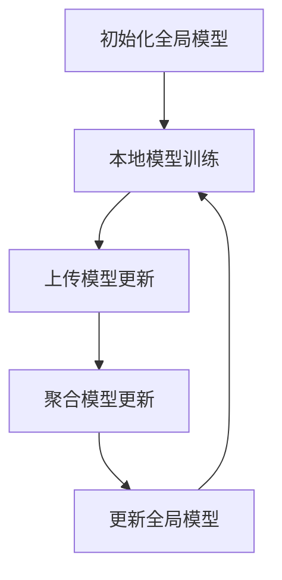

# 联邦学习 (Federated Learning) 原理与代码实例讲解

## 1.背景介绍

随着数据隐私和安全问题的日益突出，传统的集中式机器学习方法面临着巨大的挑战。数据的集中存储和处理不仅增加了数据泄露的风险，还可能违反数据保护法规。联邦学习（Federated Learning）作为一种新兴的分布式机器学习方法，能够在不共享原始数据的情况下，协同多个数据源进行模型训练，从而有效地解决了数据隐私和安全问题。

联邦学习最早由Google在2016年提出，旨在通过分布式的方式进行模型训练，使得数据可以留在本地设备上，而只需共享模型参数。这样既能保护用户隐私，又能充分利用分散的数据资源进行模型优化。

## 2.核心概念与联系

### 2.1 联邦学习的定义

联邦学习是一种分布式机器学习方法，允许多个参与方在不共享原始数据的情况下，协同训练一个全局模型。每个参与方仅需将本地模型的更新（如梯度或权重）发送到中央服务器，中央服务器汇总这些更新后更新全局模型。

### 2.2 联邦学习的类型

联邦学习主要分为三种类型：

- **横向联邦学习（Horizontal Federated Learning）**：参与方的数据集具有相同的特征空间，但样本不同。
- **纵向联邦学习（Vertical Federated Learning）**：参与方的数据集具有相同的样本，但特征空间不同。
- **联邦迁移学习（Federated Transfer Learning）**：参与方的数据集在样本和特征空间上都有差异。

### 2.3 联邦学习与传统分布式学习的区别

传统的分布式学习通常需要将数据集中到一个中央服务器进行处理，而联邦学习则强调数据的本地处理和模型参数的共享。联邦学习的核心在于保护数据隐私和安全，同时实现高效的模型训练。

## 3.核心算法原理具体操作步骤

### 3.1 联邦平均算法（Federated Averaging）

联邦平均算法是联邦学习中最常用的算法之一，其基本思想是通过多轮迭代，逐步优化全局模型。每轮迭代的具体步骤如下：

1. **初始化全局模型**：中央服务器初始化全局模型参数。
2. **本地模型训练**：每个参与方在本地数据上训练模型，并计算模型更新（如梯度或权重）。
3. **上传模型更新**：每个参与方将本地模型更新发送到中央服务器。
4. **聚合模型更新**：中央服务器汇总所有参与方的模型更新，计算全局模型的更新。
5. **更新全局模型**：中央服务器更新全局模型参数。
6. **重复迭代**：重复步骤2-5，直到模型收敛或达到预定的迭代次数。

### 3.2 联邦平均算法的Mermaid流程图



## 4.数学模型和公式详细讲解举例说明

### 4.1 联邦平均算法的数学模型

假设有 $K$ 个参与方，每个参与方 $k$ 拥有本地数据集 $D_k$，全局模型参数为 $\mathbf{w}$。联邦平均算法的目标是最小化全局损失函数：

$$
\min_{\mathbf{w}} \sum_{k=1}^{K} \frac{|D_k|}{|D|} L_k(\mathbf{w})
$$

其中，$L_k(\mathbf{w})$ 是参与方 $k$ 的本地损失函数，$|D_k|$ 是参与方 $k$ 的数据集大小，$|D|$ 是所有参与方数据集大小的总和。

### 4.2 本地模型更新

每个参与方 $k$ 在本地数据集 $D_k$ 上进行 $E$ 轮梯度下降，更新本地模型参数 $\mathbf{w}_k$：

$$
\mathbf{w}_k^{t+1} = \mathbf{w}_k^t - \eta \nabla L_k(\mathbf{w}_k^t)
$$

其中，$\eta$ 是学习率，$\nabla L_k(\mathbf{w}_k^t)$ 是本地损失函数的梯度。

### 4.3 全局模型更新

中央服务器汇总所有参与方的本地模型更新，计算全局模型参数 $\mathbf{w}$ 的更新：

$$
\mathbf{w}^{t+1} = \sum_{k=1}^{K} \frac{|D_k|}{|D|} \mathbf{w}_k^{t+1}
$$

## 5.项目实践：代码实例和详细解释说明

### 5.1 环境准备

在开始代码实例之前，我们需要准备好开发环境。本文使用Python和TensorFlow进行联邦学习的实现。

```bash
pip install tensorflow
pip install tensorflow-federated
```

### 5.2 数据准备

我们使用MNIST数据集作为示例数据集。MNIST数据集包含手写数字的图像及其对应的标签。

```python
import tensorflow as tf
import tensorflow_federated as tff

# 加载MNIST数据集
mnist_train, mnist_test = tf.keras.datasets.mnist.load_data()

# 预处理数据
def preprocess(dataset):
    dataset = dataset.map(lambda x, y: (tf.cast(x, tf.float32) / 255.0, tf.cast(y, tf.int32)))
    dataset = dataset.batch(20)
    return dataset

train_data = preprocess(tf.data.Dataset.from_tensor_slices(mnist_train))
test_data = preprocess(tf.data.Dataset.from_tensor_slices(mnist_test))
```

### 5.3 模型定义

我们定义一个简单的卷积神经网络（CNN）模型。

```python
def create_keras_model():
    model = tf.keras.models.Sequential([
        tf.keras.layers.Conv2D(32, (3, 3), activation='relu', input_shape=(28, 28, 1)),
        tf.keras.layers.MaxPooling2D((2, 2)),
        tf.keras.layers.Flatten(),
        tf.keras.layers.Dense(128, activation='relu'),
        tf.keras.layers.Dense(10, activation='softmax')
    ])
    return model
```

### 5.4 联邦学习过程

我们使用TensorFlow Federated（TFF）来实现联邦学习过程。

```python
def model_fn():
    keras_model = create_keras_model()
    return tff.learning.from_keras_model(
        keras_model,
        input_spec=train_data.element_spec,
        loss=tf.keras.losses.SparseCategoricalCrossentropy(),
        metrics=[tf.keras.metrics.SparseCategoricalAccuracy()]
    )

# 创建联邦学习过程
iterative_process = tff.learning.build_federated_averaging_process(model_fn)

# 初始化全局模型
state = iterative_process.initialize()

# 进行多轮迭代
for round_num in range(1, 11):
    state, metrics = iterative_process.next(state, [train_data])
    print(f'Round {round_num}, Metrics: {metrics}')
```

## 6.实际应用场景

### 6.1 医疗领域

在医疗领域，患者数据的隐私和安全至关重要。联邦学习可以在不共享患者数据的情况下，协同多个医疗机构进行模型训练，从而提高疾病诊断和治疗的准确性。

### 6.2 金融领域

在金融领域，客户数据的隐私和安全同样重要。联邦学习可以在不共享客户数据的情况下，协同多个金融机构进行模型训练，从而提高风险评估和欺诈检测的准确性。

### 6.3 智能设备

在智能设备领域，联邦学习可以在不共享用户数据的情况下，协同多个设备进行模型训练，从而提高语音识别、图像识别等任务的准确性。

## 7.工具和资源推荐

### 7.1 TensorFlow Federated

TensorFlow Federated（TFF）是一个开源框架，专门用于实现联邦学习。TFF提供了丰富的API和工具，方便开发者进行联邦学习的研究和应用。

### 7.2 PySyft

PySyft是一个开源库，专门用于隐私保护机器学习。PySyft支持联邦学习、差分隐私、加密计算等多种隐私保护技术。

### 7.3 OpenMined

OpenMined是一个开源社区，致力于隐私保护机器学习的研究和应用。OpenMined提供了丰富的资源和工具，帮助开发者进行联邦学习的研究和应用。

## 8.总结：未来发展趋势与挑战

联邦学习作为一种新兴的分布式机器学习方法，具有广阔的应用前景。然而，联邦学习在实际应用中仍面临诸多挑战，如通信开销、模型异构性、数据异构性等。未来，随着技术的不断发展和完善，联邦学习有望在更多领域得到广泛应用。

### 8.1 未来发展趋势

- **隐私保护技术的融合**：联邦学习将与差分隐私、加密计算等技术相结合，进一步提高数据隐私和安全。
- **高效通信协议**：开发高效的通信协议，减少联邦学习过程中的通信开销。
- **模型和数据异构性处理**：研究和开发处理模型和数据异构性的方法，提高联邦学习的适用性。

### 8.2 挑战

- **通信开销**：联邦学习需要频繁地在参与方和中央服务器之间传输模型更新，通信开销较大。
- **模型异构性**：不同参与方可能使用不同的模型结构，如何在联邦学习中处理模型异构性是一个挑战。
- **数据异构性**：不同参与方的数据分布可能存在差异，如何在联邦学习中处理数据异构性是一个挑战。

## 9.附录：常见问题与解答

### 9.1 联邦学习与分布式学习有何区别？

联邦学习强调数据的本地处理和模型参数的共享，而分布式学习通常需要将数据集中到一个中央服务器进行处理。

### 9.2 联邦学习如何保护数据隐私？

联邦学习通过在本地设备上进行模型训练，仅共享模型参数而不共享原始数据，从而保护数据隐私。

### 9.3 联邦学习的通信开销如何优化？

可以通过压缩模型更新、减少通信频率等方法来优化联邦学习的通信开销。

### 9.4 联邦学习适用于哪些场景？

联邦学习适用于数据隐私和安全要求较高的场景，如医疗、金融、智能设备等领域。

### 9.5 联邦学习的未来发展方向是什么？

联邦学习的未来发展方向包括隐私保护技术的融合、高效通信协议的开发、模型和数据异构性处理等。

---

作者：禅与计算机程序设计艺术 / Zen and the Art of Computer Programming