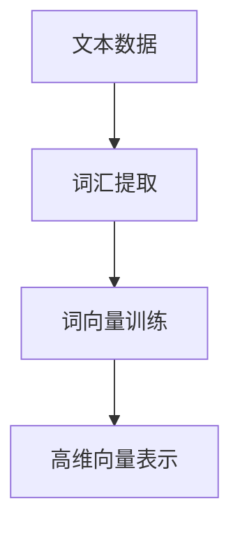

# 自然语言处理原理与代码实战案例讲解

## 1.背景介绍

自然语言处理（Natural Language Processing, NLP）是人工智能和计算语言学的一个重要分支，旨在实现计算机对人类语言的理解、生成和处理。随着大数据和深度学习技术的发展，NLP在过去十年中取得了显著的进展，广泛应用于搜索引擎、智能助手、机器翻译、情感分析等领域。

NLP的核心目标是让计算机能够理解和生成自然语言，这涉及到语言的语法、语义、语用等多个层面。本文将深入探讨NLP的核心概念、算法原理、数学模型，并通过实际代码实例展示其应用。

## 2.核心概念与联系

### 2.1 词汇与语法

词汇是语言的基本单位，语法则是词汇组合成句子的规则。NLP的基础任务之一是词汇和语法的分析，包括词性标注、句法分析等。

### 2.2 语义与语用

语义是语言的意义，语用则是语言在特定上下文中的使用。NLP需要理解词汇和句子的语义，并在特定上下文中正确使用。

### 2.3 统计与机器学习

现代NLP大量依赖统计和机器学习方法，通过大规模数据训练模型，实现对语言的理解和生成。

### 2.4 深度学习与神经网络

深度学习特别是神经网络在NLP中取得了突破性进展，特别是基于Transformer的模型如BERT、GPT等。

## 3.核心算法原理具体操作步骤

### 3.1 词向量表示

词向量（Word Embedding）是将词汇映射到高维向量空间的技术，常用的方法有Word2Vec、GloVe等。



### 3.2 句法分析

句法分析包括依存句法分析和成分句法分析，用于理解句子的结构。

### 3.3 序列标注

序列标注任务包括词性标注、命名实体识别等，常用的模型有CRF、BiLSTM-CRF等。

### 3.4 机器翻译

机器翻译是NLP的重要应用之一，基于神经网络的方法如Seq2Seq、Transformer等取得了显著效果。

## 4.数学模型和公式详细讲解举例说明

### 4.1 词向量模型

Word2Vec模型通过最大化上下文词汇的共现概率来训练词向量。Skip-gram模型的目标函数为：

$$
J(\theta) = \frac{1}{T} \sum_{t=1}^{T} \sum_{-c \leq j \leq c, j \neq 0} \log P(w_{t+j} | w_t; \theta)
$$

其中，$w_t$ 是中心词，$w_{t+j}$ 是上下文词，$c$ 是窗口大小。

### 4.2 依存句法分析

依存句法分析通过构建依存树来表示句子的结构，常用的算法有Arc-Standard、Arc-Eager等。

### 4.3 序列标注模型

CRF模型通过定义状态转移概率和观测概率来进行序列标注，其目标函数为：

$$
P(y|x) = \frac{1}{Z(x)} \exp \left( \sum_{t=1}^{T} \sum_{k=1}^{K} \lambda_k f_k(y_{t-1}, y_t, x, t) \right)
$$

其中，$Z(x)$ 是归一化因子，$f_k$ 是特征函数，$\lambda_k$ 是特征权重。

### 4.4 Transformer模型

Transformer模型通过自注意力机制实现序列到序列的转换，其核心公式为：

$$
\text{Attention}(Q, K, V) = \text{softmax}\left( \frac{QK^T}{\sqrt{d_k}} \right) V
$$

其中，$Q$ 是查询矩阵，$K$ 是键矩阵，$V$ 是值矩阵，$d_k$ 是键的维度。

## 5.项目实践：代码实例和详细解释说明

### 5.1 词向量训练

以下是使用Gensim库训练Word2Vec模型的示例代码：

```python
from gensim.models import Word2Vec

# 训练数据
sentences = [["I", "love", "natural", "language", "processing"],
             ["NLP", "is", "fun", "and", "challenging"]]

# 训练Word2Vec模型
model = Word2Vec(sentences, vector_size=100, window=5, min_count=1, workers=4)

# 获取词向量
vector = model.wv['natural']
print(vector)
```

### 5.2 依存句法分析

使用spaCy库进行依存句法分析的示例代码：

```python
import spacy

# 加载预训练模型
nlp = spacy.load("en_core_web_sm")

# 进行依存句法分析
doc = nlp("I love natural language processing.")
for token in doc:
    print(f"{token.text} -> {token.dep_} -> {token.head.text}")
```

### 5.3 序列标注

使用BiLSTM-CRF进行命名实体识别的示例代码：

```python
import torch
import torch.nn as nn
import torch.optim as optim
from torchcrf import CRF

# 定义BiLSTM-CRF模型
class BiLSTM_CRF(nn.Module):
    def __init__(self, vocab_size, tagset_size, embedding_dim, hidden_dim):
        super(BiLSTM_CRF, self).__init__()
        self.embedding = nn.Embedding(vocab_size, embedding_dim)
        self.lstm = nn.LSTM(embedding_dim, hidden_dim // 2, num_layers=1, bidirectional=True)
        self.hidden2tag = nn.Linear(hidden_dim, tagset_size)
        self.crf = CRF(tagset_size, batch_first=True)

    def forward(self, sentences):
        embeddings = self.embedding(sentences)
        lstm_out, _ = self.lstm(embeddings)
        emissions = self.hidden2tag(lstm_out)
        return emissions

# 训练和预测代码略
```

### 5.4 机器翻译

使用Transformer进行机器翻译的示例代码：

```python
import torch
import torch.nn as nn
import torch.optim as optim
from torchtext.data import Field, BucketIterator
from torchtext.datasets import Multi30k
from transformer import Transformer

# 定义字段
SRC = Field(tokenize="spacy", tokenizer_language="de", init_token="<sos>", eos_token="<eos>", lower=True)
TRG = Field(tokenize="spacy", tokenizer_language="en", init_token="<sos>", eos_token="<eos>", lower=True)

# 加载数据集
train_data, valid_data, test_data = Multi30k.splits(exts=('.de', '.en'), fields=(SRC, TRG))

# 构建词汇表
SRC.build_vocab(train_data, min_freq=2)
TRG.build_vocab(train_data, min_freq=2)

# 定义Transformer模型
class TransformerModel(nn.Module):
    def __init__(self, src_vocab_size, trg_vocab_size, d_model, nhead, num_encoder_layers, num_decoder_layers, dim_feedforward, dropout):
        super(TransformerModel, self).__init__()
        self.transformer = Transformer(d_model, nhead, num_encoder_layers, num_decoder_layers, dim_feedforward, dropout)
        self.src_embedding = nn.Embedding(src_vocab_size, d_model)
        self.trg_embedding = nn.Embedding(trg_vocab_size, d_model)
        self.fc_out = nn.Linear(d_model, trg_vocab_size)

    def forward(self, src, trg):
        src_emb = self.src_embedding(src)
        trg_emb = self.trg_embedding(trg)
        output = self.transformer(src_emb, trg_emb)
        output = self.fc_out(output)
        return output

# 训练和预测代码略
```

## 6.实际应用场景

### 6.1 搜索引擎

NLP在搜索引擎中用于理解用户查询意图、匹配相关文档、生成摘要等。

### 6.2 智能助手

智能助手如Siri、Alexa等通过NLP技术实现语音识别、自然语言理解和生成。

### 6.3 机器翻译

机器翻译系统如Google Translate通过NLP技术实现多语言之间的自动翻译。

### 6.4 情感分析

情感分析用于分析文本中的情感倾向，广泛应用于社交媒体监控、市场调研等领域。

## 7.工具和资源推荐

### 7.1 工具

- **spaCy**：一个高效的NLP库，支持多种语言的预训练模型。
- **NLTK**：一个经典的NLP库，提供丰富的文本处理工具和数据集。
- **Gensim**：一个用于训练词向量和主题模型的库。
- **Transformers**：由Hugging Face提供的库，支持多种预训练的Transformer模型。

### 7.2 资源

- **Kaggle**：提供丰富的NLP数据集和竞赛。
- **ACL Anthology**：一个包含大量NLP领域论文的数据库。
- **Coursera**：提供多门NLP相关的在线课程。

## 8.总结：未来发展趋势与挑战

### 8.1 发展趋势

- **多模态学习**：结合文本、图像、音频等多种模态的信息进行综合分析。
- **自监督学习**：通过大规模无标签数据进行预训练，提高模型的泛化能力。
- **可解释性**：提高NLP模型的可解释性，增强用户对模型的信任。

### 8.2 挑战

- **数据隐私**：在大规模数据训练中保护用户隐私。
- **公平性**：避免模型在性别、种族等方面的偏见。
- **计算资源**：深度学习模型的训练和推理需要大量计算资源。

## 9.附录：常见问题与解答

### 9.1 什么是词向量？

词向量是将词汇映射到高维向量空间的技术，用于表示词汇的语义信息。

### 9.2 如何选择NLP模型？

选择NLP模型需要考虑任务类型、数据规模、计算资源等因素。对于简单任务，可以选择传统的统计模型；对于复杂任务，可以选择深度学习模型。

### 9.3 如何提高NLP模型的性能？

提高NLP模型性能的方法包括数据增强、模型优化、超参数调优等。

### 9.4 NLP模型的可解释性如何实现？

NLP模型的可解释性可以通过可视化、特征重要性分析等方法实现。

### 9.5 NLP的未来发展方向是什么？

NLP的未来发展方向包括多模态学习、自监督学习、可解释性等。

---

作者：禅与计算机程序设计艺术 / Zen and the Art of Computer Programming