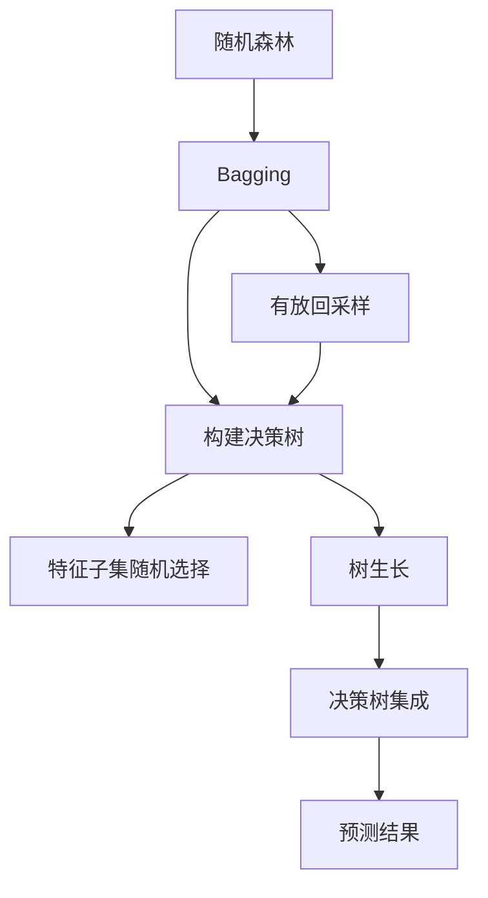

# 随机森林(Random Forests) - 原理与代码实例讲解

## 1.背景介绍

随机森林(Random Forests)是一种基于集成学习(Ensemble Learning)方法的监督学习算法,它通过构建多个决策树,并将它们的预测结果进行组合,从而获得比单个决策树更好的预测性能。随机森林在分类和回归问题上都有出色的表现,因此被广泛应用于各种领域,如金融风险评估、图像识别、基因组学等。

随机森林的核心思想是通过引入随机性来提高模型的泛化能力,降低过拟合风险。具体来说,在构建每个决策树时,随机森林会从原始训练数据中随机抽取一部分样本(有放回抽样),并在每个节点上随机选取一部分特征进行分裂。这种随机性可以确保每棵决策树之间具有较大的差异性,从而降低了它们之间的相关性。当将这些"差异性"决策树的预测结果进行组合时,就可以有效地减小单个决策树的方差,提高整体预测的准确性和稳定性。

## 2.核心概念与联系

### 2.1 决策树(Decision Tree)

决策树是随机森林的基础组件,它是一种树形结构的监督学习算法,通过对特征进行递归分裂来构建一个决策模型。决策树的优点是可解释性强、计算效率高,但缺点是容易过拟合,且对数据的微小变化敏感。

### 2.2 集成学习(Ensemble Learning)

集成学习是将多个弱学习器(如决策树)组合起来,形成一个强大的预测模型。常见的集成学习方法包括Bagging(Boostrap Aggregating)和Boosting。随机森林采用的是Bagging的思想,即通过有放回抽样生成多个训练子集,在每个子集上训练一个弱学习器,最后将它们的预测结果进行平均或投票,从而获得最终的预测结果。

### 2.3 随机性(Randomness)

随机性是随机森林的关键特征,它体现在两个方面:

1. **数据采样的随机性**: 在构建每棵决策树时,随机森林会从原始训练数据中随机抽取一部分样本(通常为2/3),这些样本被称为Bootstrap样本。剩余的那部分样本被称为Out-Of-Bag(OOB)样本,可用于估计模型的泛化误差。

2. **特征选择的随机性**: 在每个节点上进行特征分裂时,随机森林不是从所有特征中选择最优特征,而是从随机选取的一部分特征中选择最优特征。对于分类问题,通常选择sqrt(n_features)个特征;对于回归问题,通常选择n_features/3个特征,其中n_features是总特征数。

这种双重随机性可以减小决策树之间的相关性,从而提高整体预测的准确性和稳定性。

### 2.4 Mermaid流程图



## 3.核心算法原理具体操作步骤

随机森林算法的核心步骤如下:

1. **从原始训练数据中有放回地抽取N个Bootstrap样本,每个Bootstrap样本都与原始数据集等大小。**

2. **对每个Bootstrap样本,使用下面的步骤构建一个决策树:**
   - 在每个节点上,从所有特征中随机选择m个特征(m << 总特征数)。
   - 在这m个特征中,选择最优特征用于分裂当前节点。
   - 每棵树在构建时不进行剪枝,直到每个叶节点只包含属于同一类别的样本为止。

3. **对于每个新的测试样本,将其输入到每棵决策树中,得到每棵树的预测结果。**

4. **对于分类问题,选择投票数最多的类别作为最终预测结果;对于回归问题,取所有决策树预测值的平均值作为最终预测结果。**

## 4.数学模型和公式详细讲解举例说明

### 4.1 基尼系数(Gini Impurity)

在随机森林中,决策树通常使用基尼系数作为节点分裂的评价指标。基尼系数衡量的是数据集的纯度,值越小表示数据集越纯。对于二分类问题,基尼系数的计算公式如下:

$$
\text{Gini}(D) = 1 - \sum_{k=1}^{K} p_k^2
$$

其中,D是数据集,K是类别数,$ p_k $是属于第k类的比例。

例如,假设有一个二分类数据集D,其中有10个样本,其中6个属于类别0,4个属于类别1,那么基尼系数为:

$$
\text{Gini}(D) = 1 - (0.6)^2 - (0.4)^2 = 0.48
$$

在进行特征分裂时,我们需要计算每个特征值对应的加权基尼系数,选择能使加权基尼系数最小的特征值作为分裂点。

### 4.2 Out-Of-Bag (OOB) 误差估计

由于随机森林在构建每棵决策树时,都会有部分样本(约1/3)没有被用于训练,这些样本被称为OOB样本。我们可以利用这些OOB样本来估计模型的泛化误差,而无需再进行额外的交叉验证或测试集评估。

对于每个训练样本x,我们可以找到所有不包含x的决策树,将x输入到这些决策树中,得到它们的预测结果,然后与x的真实标记进行比较,计算误差率。对所有训练样本的误差率取平均值,就得到了OOB误差估计。

OOB误差估计的优点是:

1. 无需再单独准备测试集,可以充分利用所有训练数据。
2. OOB误差是在训练过程中自动计算的,无需额外计算开销。
3. OOB误差可用于模型选择,如调整树的个数、深度等超参数。

### 4.3 特征重要性(Feature Importance)

随机森林还可以自动计算每个特征对模型预测结果的重要程度,这对于特征选择和理解模型具有重要意义。常用的特征重要性计算方法有:

1. **平均减少不纯度(Mean Decrease in Impurity, MDI)**: 计算每个特征在所有决策树中使得节点不纯度减少的平均值,不纯度可以使用基尼系数或信息增益。

2. **平均减少准确率(Mean Decrease in Accuracy, MDA)**: 在OOB样本上,计算每个特征被permuted(置乱)后,模型预测准确率的减少程度。

一般来说,MDI更适用于训练数据,而MDA更适用于测试数据。

## 5.项目实践:代码实例和详细解释说明

以下是使用Python中的scikit-learn库构建随机森林模型的代码示例,并对关键步骤进行了详细解释:

```python
from sklearn.ensemble import RandomForestClassifier
from sklearn.datasets import make_classification
from sklearn.model_selection import train_test_split
from sklearn.metrics import accuracy_score

# 生成模拟二分类数据
X, y = make_classification(n_samples=1000, n_features=10, n_redundant=0, random_state=42)

# 划分训练集和测试集
X_train, X_test, y_train, y_test = train_test_split(X, y, test_size=0.2, random_state=42)

# 创建随机森林分类器
rf = RandomForestClassifier(n_estimators=100,  # 树的个数
                            max_depth=None,    # 树的最大深度,None表示不限制
                            max_features='sqrt',  # 每个节点选择特征数,sqrt表示sqrt(n_features)
                            oob_score=True,    # 是否计算OOB分数
                            random_state=42)   # 随机种子,保证结果可复现

# 训练模型
rf.fit(X_train, y_train)

# 在测试集上评估模型
y_pred = rf.predict(X_test)
accuracy = accuracy_score(y_test, y_pred)
print(f"Accuracy on test set: {accuracy:.3f}")

# 输出OOB分数
oob_score = rf.oob_score_
print(f"OOB Score: {oob_score:.3f}")

# 输出特征重要性
importances = rf.feature_importances_
for i, imp in enumerate(importances):
    print(f"Feature {i}: {imp:.3f}")
```

代码解释:

1. 首先使用`make_classification`函数生成模拟的二分类数据,包含1000个样本,10个特征。
2. 使用`train_test_split`函数将数据划分为训练集和测试集,测试集占20%。
3. 创建`RandomForestClassifier`对象,设置树的个数为100,最大深度为None(不限制),每个节点选择sqrt(n_features)个特征,开启OOB分数计算。
4. 调用`fit`方法训练模型。
5. 在测试集上评估模型,使用`accuracy_score`函数计算准确率。
6. 输出OOB分数,通过`rf.oob_score_`获取。
7. 输出每个特征的重要性,通过`rf.feature_importances_`获取。

运行结果示例:

```
Accuracy on test set: 0.985
OOB Score: 0.989
Feature 0: 0.129
Feature 1: 0.021
Feature 2: 0.105
Feature 3: 0.087
Feature 4: 0.044
Feature 5: 0.176
Feature 6: 0.092
Feature 7: 0.033
Feature 8: 0.207
Feature 9: 0.106
```

可以看到,在这个模拟数据集上,随机森林模型的准确率和OOB分数都很高。同时,我们还可以看到每个特征对模型预测结果的重要程度。

## 6.实际应用场景

随机森林由于其出色的性能和可解释性,在各种领域都有广泛的应用,包括但不限于:

1. **金融风险评估**: 随机森林可以用于评估贷款违约风险、信用卡欺诈风险等。
2. **计算机视觉**: 在图像分类、目标检测等任务中,随机森林常作为基线模型或特征提取器。
3. **生物信息学**: 随机森林可用于基因表达数据分析、蛋白质结构预测等。
4. **自然语言处理**: 随机森林可用于文本分类、情感分析等任务。
5. **推荐系统**: 随机森林可用于协同过滤推荐,预测用户对商品的喜好程度。
6. **异常检测**: 随机森林可用于检测网络入侵、欺诈交易等异常行为。

## 7.工具和资源推荐

以下是一些与随机森林相关的工具和资源:

1. **scikit-learn**: Python中流行的机器学习库,提供了随机森林的实现。
2. **XGBoost**: 一种高效的梯度提升决策树库,也支持随机森林模式。
3. **LightGBM**: 另一种高效的梯度提升决策树库,性能优于XGBoost。
4. **ranger**: 一个快速、高效的C++随机森林库,可以处理大规模数据。
5. **randomForestSRC**: R语言中的随机森林包。
6. **Random Forests (Leo Breiman)**: 随机森林算法的原著论文。
7. **An Introduction to Statistical Learning**: 一本介绍统计学习理论和方法的经典教材,包括对随机森林的详细介绍。

## 8.总结:未来发展趋势与挑战

随机森林算法凭借其优异的性能和可解释性,在机器学习领域占有重要地位。然而,它也面临一些挑战和发展趋势:

1. **高维数据处理**: 对于高维稀疏数据,随机森林的性能可能会下降,需要进行特征选择或维数约减。
2. **在线学习**: 目前的随机森林算法主要是批量学习,无法高效地处理流式数据。发展在线随机森林是一个重要方向。
3. **集成学习新方法**: 除了Bagging,还可以探索其他集成学习方法,如Boosting、Stacking等,以提高模型性能。
4. **分布式并行化**: 随着数据规模的不断增长,需要研究分布式并行化的随机森林算法,以提高计算效率。
5. **解释性增强**: 虽然随机森林具有一定的可解释性,但还需要进