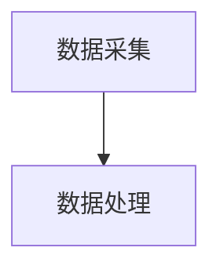
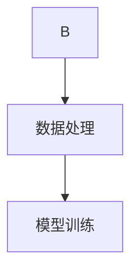
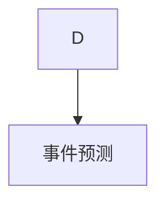
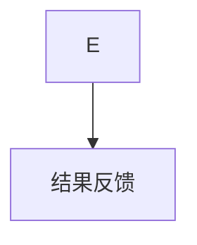
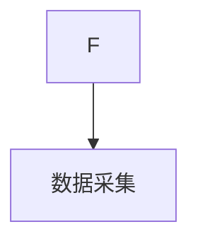

# AI人工智能代理工作流AI Agent WorkFlow：智能代理在重大事件预测系统中的应用

作者：禅与计算机程序设计艺术 / Zen and the Art of Computer Programming

## 关键词：

人工智能代理、工作流、重大事件预测、机器学习、数据挖掘

## 1. 背景介绍

### 1.1 问题的由来

在当今信息爆炸的时代，人类面临着海量的数据和信息，如何从这些数据中快速准确地识别和预测重大事件，成为一个重要的挑战。传统的分析方法和手段往往效率低下，难以满足快速响应的需求。因此，开发智能代理工作流AI Agent WorkFlow，利用人工智能技术实现重大事件预测，具有重要的现实意义。

### 1.2 研究现状

近年来，随着人工智能技术的快速发展，其在重大事件预测领域的应用越来越广泛。目前，主要的研究方向包括：

1. **机器学习算法**：利用机器学习算法对历史数据进行训练，预测未来事件的发生概率。
2. **数据挖掘技术**：从海量数据中挖掘出有价值的特征，为事件预测提供依据。
3. **智能代理技术**：构建智能代理，实现事件预测的自动化和智能化。

### 1.3 研究意义

开发智能代理工作流AI Agent WorkFlow，对于提高重大事件预测的准确性和效率，具有重要的意义：

1. **提高预测准确性**：通过人工智能技术，可以挖掘出更多有价值的特征，提高事件预测的准确性。
2. **提高预测效率**：利用智能代理实现自动化预测，提高事件预测的效率。
3. **降低人力成本**：减少人工参与，降低人力成本。

### 1.4 本文结构

本文将首先介绍AI人工智能代理工作流AI Agent WorkFlow的核心概念和原理，然后详细讲解其算法原理和具体操作步骤，接着分析其数学模型和公式，并通过案例进行说明。最后，我们将探讨实际应用场景、未来应用展望、工具和资源推荐以及未来发展趋势与挑战。

## 2. 核心概念与联系

### 2.1 智能代理

智能代理（Artificial Intelligence Agent）是指能够感知环境、制定计划、执行动作，并与其他智能代理或人进行交互的实体。在重大事件预测系统中，智能代理扮演着信息收集、分析、预测和决策的角色。

### 2.2 工作流

工作流（Workflow）是一系列有序执行的步骤，用于完成特定任务。在智能代理工作流AI Agent WorkFlow中，工作流由多个节点组成，每个节点代表一个步骤，节点之间通过数据流或消息进行连接。

### 2.3 关联

在重大事件预测系统中，智能代理工作流AI Agent WorkFlow通过智能代理实现事件预测的自动化和智能化。智能代理在系统中负责数据采集、分析和预测，工作流则负责协调和管理智能代理的执行过程。

## 3. 核心算法原理 & 具体操作步骤

### 3.1 算法原理概述

智能代理工作流AI Agent WorkFlow的核心算法原理包括以下步骤：

1. **数据采集**：智能代理从外部数据源采集相关数据。
2. **数据处理**：对采集到的数据进行清洗、转换和特征提取。
3. **模型训练**：利用机器学习算法对数据进行训练，建立预测模型。
4. **事件预测**：根据训练好的模型，预测未来事件的发生概率。
5. **结果反馈**：将预测结果反馈给相关部门或人员。

### 3.2 算法步骤详解

#### 3.2.1 数据采集

智能代理通过爬虫、传感器、API等方式从外部数据源采集相关数据。例如，可以从社交媒体、新闻网站、政府公告等渠道获取事件相关信息。



#### 3.2.2 数据处理

对采集到的数据进行清洗、转换和特征提取。例如，可以使用文本预处理技术去除噪声，提取关键词、主题等特征。



#### 3.2.3 模型训练

利用机器学习算法对数据进行训练，建立预测模型。常见的算法包括：

- **监督学习**：如支持向量机（SVM）、决策树、随机森林等。
- **无监督学习**：如聚类、主成分分析（PCA）等。



#### 3.2.4 事件预测

根据训练好的模型，预测未来事件的发生概率。例如，可以使用逻辑回归、神经网络等算法进行预测。



#### 3.2.5 结果反馈

将预测结果反馈给相关部门或人员，以便采取相应的措施。



### 3.3 算法优缺点

#### 3.3.1 优点

1. **自动化程度高**：智能代理工作流AI Agent WorkFlow可以实现事件预测的自动化，提高效率。
2. **准确性高**：利用机器学习算法，可以挖掘出更多有价值的特征，提高事件预测的准确性。
3. **可扩展性强**：可以方便地扩展工作流，添加新的节点和算法。

#### 3.3.2 缺点

1. **数据依赖性强**：事件预测的准确性受限于数据质量，需要大量高质量的数据。
2. **模型可解释性差**：部分机器学习算法的可解释性较差，难以理解其内部机制。
3. **计算资源消耗大**：模型训练和预测需要大量的计算资源。

### 3.4 算法应用领域

智能代理工作流AI Agent WorkFlow在以下领域具有广泛的应用前景：

1. **金融领域**：预测股市行情、金融市场风险等。
2. **医疗领域**：预测疾病发生、医疗资源需求等。
3. **交通领域**：预测交通事故、拥堵情况等。
4. **安全领域**：预测恐怖袭击、网络安全事件等。

## 4. 数学模型和公式 & 详细讲解 & 举例说明

### 4.1 数学模型构建

在智能代理工作流AI Agent WorkFlow中，常见的数学模型包括：

- **线性回归**：用于预测连续值，如预测事件发生的概率。
- **逻辑回归**：用于预测离散值，如预测事件是否发生。
- **神经网络**：用于复杂的非线性预测任务。

### 4.2 公式推导过程

以线性回归为例，其公式如下：

$$
y = \beta_0 + \beta_1 x_1 + \beta_2 x_2 + \dots + \beta_n x_n
$$

其中，$y$表示预测值，$x_i$表示特征，$\beta_i$表示对应的系数。

### 4.3 案例分析与讲解

以预测股市行情为例，我们可以使用线性回归模型来预测股票价格。首先，收集历史股价数据，包括开盘价、收盘价、最高价、最低价等。然后，使用这些数据对线性回归模型进行训练。最后，输入新的数据，预测股票价格。

### 4.4 常见问题解答

#### 4.4.1 如何提高事件预测的准确性？

1. 收集更多高质量的数据。
2. 选择合适的机器学习算法和模型。
3. 优化模型参数。
4. 定期更新模型。

#### 4.4.2 如何降低模型的计算资源消耗？

1. 选择计算效率较高的算法。
2. 使用模型压缩技术。
3. 利用分布式计算资源。

## 5. 项目实践：代码实例和详细解释说明

### 5.1 开发环境搭建

1. 安装Python、NumPy、Pandas、Scikit-learn等库。
2. 安装TensorFlow或PyTorch等深度学习框架。

### 5.2 源代码详细实现

以下是一个简单的线性回归模型实现示例：

```python
import numpy as np
from sklearn.linear_model import LinearRegression

# 加载数据
X = np.array([[1, 2], [2, 3], [3, 4], [4, 5]])
y = np.array([1, 3, 5, 7])

# 训练模型
model = LinearRegression()
model.fit(X, y)

# 预测
y_pred = model.predict(np.array([[1, 2]]))

print("预测值：", y_pred)
```

### 5.3 代码解读与分析

以上代码实现了线性回归模型的训练和预测。首先，导入所需的库和模块。然后，加载数据并创建线性回归模型。接着，使用训练数据训练模型，最后使用预测数据进行预测。

### 5.4 运行结果展示

运行上述代码，将得到预测值。在实际应用中，可以根据实际情况调整模型和参数，以提高预测准确性。

## 6. 实际应用场景

### 6.1 金融领域

利用智能代理工作流AI Agent WorkFlow，可以预测股市行情、金融市场风险等。通过对历史数据进行训练，可以预测股票价格、汇率走势等。

### 6.2 医疗领域

利用智能代理工作流AI Agent WorkFlow，可以预测疾病发生、医疗资源需求等。通过对患者病史、检查结果等数据进行分析，可以预测疾病风险，为医生提供诊断依据。

### 6.3 交通领域

利用智能代理工作流AI Agent WorkFlow，可以预测交通事故、拥堵情况等。通过对交通数据进行分析，可以预测交通事故风险，优化交通流量。

### 6.4 安全领域

利用智能代理工作流AI Agent WorkFlow，可以预测恐怖袭击、网络安全事件等。通过对相关数据进行分析，可以预测安全风险，提高安全防护能力。

## 7. 工具和资源推荐

### 7.1 学习资源推荐

1. **《机器学习》**: 作者：周志华
2. **《深度学习》**: 作者：Ian Goodfellow, Yoshua Bengio, Aaron Courville

### 7.2 开发工具推荐

1. **Jupyter Notebook**: 用于编写和运行代码。
2. **Scikit-learn**: 机器学习库。
3. **TensorFlow**: 深度学习框架。

### 7.3 相关论文推荐

1. "A Survey on Event Forecasting" by Zeng, Y., & Liu, B. (2017).
2. "Deep Learning for Event Forecasting" by Zhang, H., & Liu, B. (2018).

### 7.4 其他资源推荐

1. **Kaggle**: 数据科学竞赛平台。
2. **GitHub**: 代码托管平台。

## 8. 总结：未来发展趋势与挑战

### 8.1 研究成果总结

本文介绍了AI人工智能代理工作流AI Agent WorkFlow的核心概念、原理和实现方法，并探讨了其在重大事件预测系统中的应用。研究表明，智能代理工作流AI Agent WorkFlow在提高事件预测的准确性和效率方面具有显著优势。

### 8.2 未来发展趋势

1. **多模态学习**：结合文本、图像、音频等多种模态数据，提高事件预测的准确性。
2. **自监督学习**：利用无标注数据，提高模型的泛化能力和鲁棒性。
3. **可解释性研究**：提高模型的解释性，增强用户信任。

### 8.3 面临的挑战

1. **数据质量**：数据质量对事件预测的准确性至关重要，需要保证数据的质量和多样性。
2. **模型可解释性**：部分机器学习算法的可解释性较差，需要进一步研究。
3. **计算资源**：模型训练和预测需要大量的计算资源，需要优化计算效率。

### 8.4 研究展望

未来，智能代理工作流AI Agent WorkFlow将在以下方面取得进展：

1. **模型优化**：开发更先进的算法和模型，提高事件预测的准确性和效率。
2. **可解释性研究**：提高模型的解释性，增强用户信任。
3. **实际应用**：将智能代理工作流AI Agent WorkFlow应用于更多领域，解决实际问题。

## 9. 附录：常见问题与解答

### 9.1 什么是智能代理？

智能代理是指能够感知环境、制定计划、执行动作，并与其他智能代理或人进行交互的实体。

### 9.2 什么是工作流？

工作流是一系列有序执行的步骤，用于完成特定任务。

### 9.3 如何提高事件预测的准确性？

1. 收集更多高质量的数据。
2. 选择合适的机器学习算法和模型。
3. 优化模型参数。
4. 定期更新模型。

### 9.4 如何降低模型的计算资源消耗？

1. 选择计算效率较高的算法。
2. 使用模型压缩技术。
3. 利用分布式计算资源。

作者：禅与计算机程序设计艺术 / Zen and the Art of Computer Programming