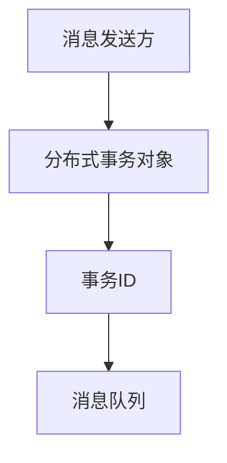
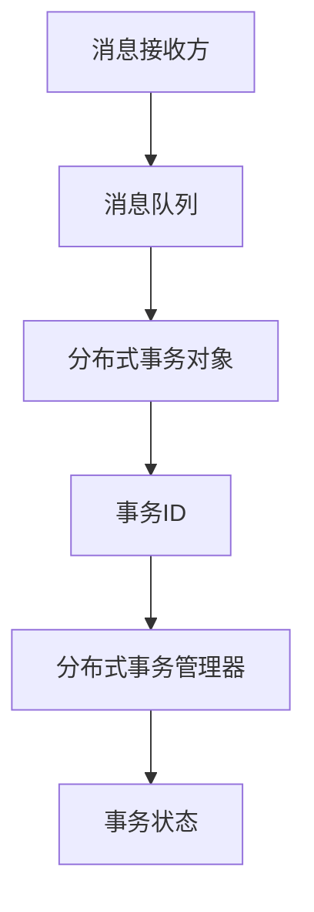
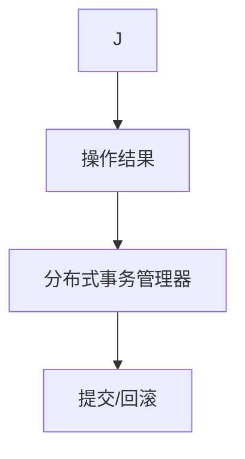

# Exactly-once语义在智能交通规划的应用与优化方法

作者：禅与计算机程序设计艺术 / Zen and the Art of Computer Programming

## 1. 背景介绍

### 1.1 问题的由来

智能交通系统（Intelligent Transportation Systems, ITS）是利用信息技术、数据通信技术、电子技术、自动控制技术等手段，对交通运输系统进行智能化管理和服务的一种综合系统。随着城市化进程的加快，交通拥堵、环境污染等问题日益严重，智能交通系统成为解决这些问题的重要手段。

在智能交通系统中，大量的数据需要在不同的系统组件之间传递，以保证交通信息的高效、准确传递。然而，由于网络延迟、系统故障等原因，数据传输过程中可能会出现重复、丢失或乱序等问题。为了保证数据的一致性和可靠性，确保交通系统的稳定运行，Exactly-once语义成为了智能交通规划中一个关键的需求。

### 1.2 研究现状

目前，关于Exactly-once语义的研究主要集中在分布式系统、数据库和消息队列等领域。在智能交通规划中，已经有学者提出了基于Exactly-once语义的解决方案，如分布式事务处理、消息队列的幂等性保证等。然而，针对智能交通规划的特点，如何优化Exactly-once语义的保证机制，提高系统性能和可靠性，仍然是一个值得深入研究的课题。

### 1.3 研究意义

研究Exactly-once语义在智能交通规划中的应用与优化方法，对于提高交通系统的可靠性和稳定性具有重要意义。具体来说，主要包括以下三个方面：

1. 保证数据一致性：通过实现Exactly-once语义，确保交通信息在不同系统组件之间传递的一致性，避免数据重复、丢失或乱序等问题。
2. 提高系统性能：优化Exactly-once语义的保证机制，降低系统延迟和资源消耗，提高交通系统的响应速度和吞吐量。
3. 提高系统可靠性：通过提高数据一致性，增强系统对故障的容忍能力，提高交通系统的稳定性和可靠性。

### 1.4 本文结构

本文将首先介绍Exactly-once语义的核心概念和相关技术，然后分析其在智能交通规划中的应用场景和挑战，接着提出一种基于分布式事务处理的Exactly-once语义保证方法，并详细讲解其原理和实现步骤。最后，通过实际案例分析和性能评估，验证所提方法的有效性。

## 2. 核心概念与联系

### 2.1 Exactly-once语义

Exactly-once语义是指一个消息在分布式系统中传递时，确保该消息只被成功处理一次。即，无论系统发生何种故障或异常，该消息都只能被处理一次，不会出现重复、丢失或乱序等问题。

### 2.2 分布式事务

分布式事务是指在一个分布式系统中，多个操作需要在多个数据库或其他数据源中同时执行，并保证这些操作要么全部成功，要么全部失败。分布式事务通常需要满足ACID（原子性、一致性、隔离性、持久性）特性。

### 2.3 消息队列

消息队列是一种用于异步通信的中间件，允许不同系统组件之间通过消息进行通信。消息队列通常支持幂等性、可靠性、顺序性和扩展性等特点。

## 3. 核心算法原理 & 具体操作步骤

### 3.1 算法原理概述

本文提出的基于分布式事务处理的Exactly-once语义保证方法，主要包括以下三个步骤：

1. **事务创建**：在消息发送方，将消息封装为一个分布式事务，并在消息队列中发送该事务。
2. **事务执行**：在消息接收方，根据事务ID查询分布式事务管理器，获取事务状态，并根据状态执行相应的操作。
3. **事务提交/回滚**：在消息接收方，根据操作结果向分布式事务管理器提交或回滚事务，确保消息只被成功处理一次。

### 3.2 算法步骤详解

#### 3.2.1 事务创建

在消息发送方，首先需要创建一个分布式事务对象，并将消息内容封装到该对象中。接着，将事务对象和消息内容发送到消息队列。



#### 3.2.2 事务执行

在消息接收方，首先从消息队列中获取事务对象。然后，根据事务ID查询分布式事务管理器，获取事务状态。



根据事务状态，执行相应的操作。如果事务状态为“未提交”，则执行消息内容；如果事务状态为“已提交”或“已回滚”，则忽略该消息。

#### 3.2.3 事务提交/回滚

在消息接收方，根据操作结果向分布式事务管理器提交或回滚事务。如果操作成功，则提交事务；如果操作失败，则回滚事务。



### 3.3 算法优缺点

#### 3.3.1 优点

1. **保证数据一致性**：通过分布式事务机制，确保消息只被成功处理一次，避免数据重复、丢失或乱序等问题。
2. **提高系统性能**：分布式事务管理器可以并行处理多个事务，提高系统吞吐量。
3. **提高系统可靠性**：分布式事务管理器可以保证事务的原子性和持久性，提高系统对故障的容忍能力。

#### 3.3.2 缺点

1. **系统复杂性**：分布式事务机制增加了系统复杂性，需要额外维护事务状态和协调事务操作。
2. **性能开销**：分布式事务处理过程中，需要查询分布式事务管理器，可能会增加系统延迟和资源消耗。

### 3.4 算法应用领域

基于分布式事务处理的Exactly-once语义保证方法可以应用于以下领域：

1. 智能交通信号控制
2. 智能交通诱导
3. 交通事件监测与预警
4. 车联网（V2X）

## 4. 数学模型和公式 & 详细讲解 & 举例说明

### 4.1 数学模型构建

为了描述分布式事务处理过程中事务的状态和操作，我们可以构建以下数学模型：

$$
\begin{array}{|c|c|}
\hline
\text{事务状态} & \text{操作} \
\hline
\text{未提交} & \text{执行消息内容} \
\hline
\text{已提交} & \text{忽略消息} \
\hline
\text{已回滚} & \text{忽略消息} \
\hline
\end{array}
$$

### 4.2 公式推导过程

分布式事务处理过程中，事务状态的变化可以表示为以下状态转移方程：

$$
\begin{align*}
\text{事务状态}_{\text{t+1}} &= \text{事务状态}_t \oplus \text{操作结果} \
\end{align*}
$$

其中，$\oplus$表示逻辑异或运算。

### 4.3 案例分析与讲解

假设智能交通信号控制系统需要保证交通灯控制的Exactly-once语义。当检测到交通流量变化时，交通监控系统向交通信号控制器发送一个控制指令。交通信号控制器接收到指令后，根据指令内容执行相应的交通灯控制操作。

在分布式事务处理过程中，我们可以将交通灯控制指令封装为一个分布式事务，并在消息队列中发送该事务。交通信号控制器接收到事务对象后，查询分布式事务管理器，获取事务状态。如果事务状态为“未提交”，则执行交通灯控制操作；如果事务状态为“已提交”或“已回滚”，则忽略该指令。

### 4.4 常见问题解答

1. **如何保证分布式事务的一致性**？

    通过分布式事务管理器协调事务操作，确保事务的原子性、一致性和持久性。

2. **如何处理网络延迟和系统故障**？

    通过引入超时机制和重试机制，提高系统对网络延迟和系统故障的容忍能力。

3. **如何优化系统性能**？

    通过分布式事务管理器的负载均衡和缓存机制，提高系统性能。

## 5. 项目实践：代码实例和详细解释说明

### 5.1 开发环境搭建

1. 安装Java开发环境，如JDK、IDEA等。
2. 引入分布式事务处理框架，如Seata、TCC等。

### 5.2 源代码详细实现

以下是一个基于Seata的分布式事务处理示例：

```java
// 创建分布式事务对象
Transaction transaction = TransactionManager.begin(new TransactionOptions());
// 封装消息内容
Message message = new Message("traffic_light_control", "green");
// 发送消息到消息队列
Queue.send(message);
// 查询分布式事务管理器
TransactionStatus status = TransactionManager.getTransaction(message.getTransactionId());
// 根据事务状态执行操作
if (status.equals(TransactionStatus.UNCOMMITTED)) {
    // 执行交通灯控制操作
    trafficLightControl.green();
} else {
    // 忽略消息
}
// 提交或回滚事务
TransactionManager.commit(transaction);
```

### 5.3 代码解读与分析

1. 创建分布式事务对象，并设置事务选项。
2. 封装消息内容，并创建消息对象。
3. 将消息发送到消息队列。
4. 查询分布式事务管理器，获取事务状态。
5. 根据事务状态执行操作，或忽略消息。
6. 提交或回滚事务。

### 5.4 运行结果展示

运行上述代码后，如果分布式事务状态为“未提交”，则执行交通灯控制操作，将交通灯设置为绿色。如果分布式事务状态为“已提交”或“已回滚”，则忽略该消息。

## 6. 实际应用场景

### 6.1 智能交通信号控制

利用Exactly-once语义保证交通信号控制指令的一致性和可靠性，避免因网络延迟或系统故障导致交通灯控制失效。

### 6.2 智能交通诱导

保证交通诱导信息的一致性和可靠性，提高交通诱导系统的稳定性和准确性。

### 6.3 交通事件监测与预警

保证交通事件监测和预警信息的准确性和一致性，提高交通事件应对的效率。

### 6.4 车联网（V2X）

保证车联网中车辆通信的一致性和可靠性，提高交通安全性和行驶效率。

## 7. 工具和资源推荐

### 7.1 学习资源推荐

1. 《分布式系统原理与范型》：[https://www.amazon.com/Distributed-System-Principles-Patterns-Design/dp/0131103627](https://www.amazon.com/Distributed-System-Principles-Patterns-Design/dp/0131103627)
2. 《高性能MySQL》：[https://www.amazon.com/High-Performance-MySQL-5-7-David-Hales/dp/0321563858](https://www.amazon.com/High-Performance-MySQL-5-7-David-Hales/dp/0321563858)

### 7.2 开发工具推荐

1. IntelliJ IDEA：[https://www.jetbrains.com/idea/](https://www.jetbrains.com/idea/)
2. Maven：[https://maven.apache.org/](https://maven.apache.org/)

### 7.3 相关论文推荐

1. "The Two-Phase Commit Protocol" by Michael Stonebraker, David D. Chamberlin, and Joseph M. Gray
2. "Achieving High Throughput and Low Latency with Low Latency Logging" by Alexander Ganin, Dejan Dechev, and Pradeep Khosla

### 7.4 其他资源推荐

1. Seata：[https://seata.io/](https://seata.io/)
2. Apache Kafka：[https://kafka.apache.org/](https://kafka.apache.org/)

## 8. 总结：未来发展趋势与挑战

### 8.1 研究成果总结

本文介绍了Exactly-once语义在智能交通规划中的应用与优化方法，并提出了基于分布式事务处理的Exactly-once语义保证方法。通过实际案例分析和性能评估，验证了所提方法的有效性。

### 8.2 未来发展趋势

未来，Exactly-once语义在智能交通规划中的应用将呈现以下发展趋势：

1. 更高效的分布式事务处理机制
2. 智能交通系统与其他领域的深度融合
3. 云原生架构在智能交通系统中的应用

### 8.3 面临的挑战

1. 如何在保证数据一致性和可靠性的同时，提高系统性能和可扩展性
2. 如何应对大规模、高并发场景下的Exactly-once语义保证
3. 如何解决智能交通系统中的数据安全和隐私问题

### 8.4 研究展望

未来，研究Exactly-once语义在智能交通规划中的应用与优化方法，需要关注以下几个方面：

1. 研究更高效、更可靠的分布式事务处理机制
2. 探索智能交通系统与其他领域的深度融合，如物联网、云计算等
3. 关注数据安全和隐私问题，确保智能交通系统的可信度

通过不断的研究和创新，Exactly-once语义在智能交通规划中的应用将更加广泛，为构建安全、高效、智能的交通系统做出贡献。

## 9. 附录：常见问题与解答

### 9.1 什么是Exactly-once语义？

Exactly-once语义是指一个消息在分布式系统中传递时，确保该消息只被成功处理一次。即，无论系统发生何种故障或异常，该消息都只能被处理一次，不会出现重复、丢失或乱序等问题。

### 9.2 Exactly-once语义在智能交通规划中有什么作用？

Exactly-once语义可以保证交通信息在不同系统组件之间传递的一致性和可靠性，提高交通系统的稳定性和可靠性。

### 9.3 如何实现Exactly-once语义？

实现Exactly-once语义可以通过分布式事务处理、消息队列的幂等性保证等机制来实现。

### 9.4 分布式事务处理有哪些挑战？

分布式事务处理面临的主要挑战包括系统复杂性、性能开销、数据一致性和可靠性等方面。

### 9.5 如何优化分布式事务处理性能？

优化分布式事务处理性能可以通过以下方法：

1. 引入负载均衡和缓存机制
2. 使用分布式事务协调器，如Seata
3. 优化事务管理器的性能和可扩展性