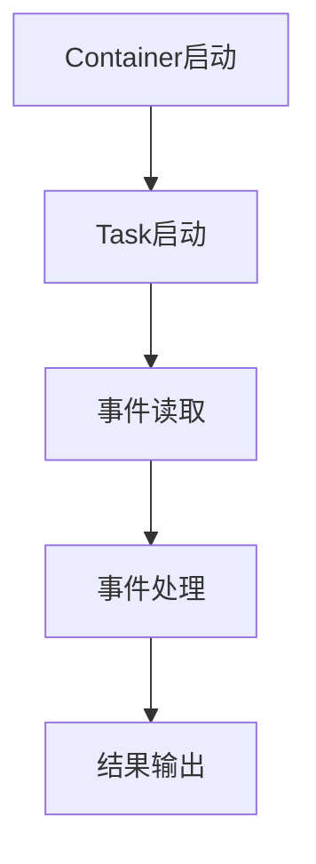

# Samza Task原理与代码实例讲解

作者：禅与计算机程序设计艺术 / Zen and the Art of Computer Programming

## 1. 背景介绍

### 1.1 问题的由来

随着大数据时代的到来，实时数据处理的需求日益增长。为了高效地处理海量数据，分布式流处理系统应运而生。Apache Samza是一个开源的分布式流处理框架，旨在提供一种简单、可扩展的方式来处理流数据。在Samza中，Task是处理数据的基本单元，理解Task的原理对于构建高效、可靠的流处理应用程序至关重要。

### 1.2 研究现状

目前，许多分布式流处理框架，如Apache Kafka Streams、Apache Flink和Apache Storm等，都采用了Task的概念。然而，Samza的Task设计有其独特之处，如支持多种执行模式、易于扩展和优化等。本文将深入探讨Samza Task的原理，并通过代码实例进行讲解。

### 1.3 研究意义

深入理解Samza Task的原理，有助于开发者构建高性能、可扩展的流处理应用程序。通过本文的讲解，读者可以了解到Samza Task的设计哲学、执行机制以及在实际应用中的优势。

### 1.4 本文结构

本文将分为以下几个部分：

1. 核心概念与联系
2. 核心算法原理 & 具体操作步骤
3. 数学模型和公式 & 详细讲解 & 举例说明
4. 项目实践：代码实例和详细解释说明
5. 实际应用场景
6. 工具和资源推荐
7. 总结：未来发展趋势与挑战

## 2. 核心概念与联系

在介绍Samza Task的原理之前，我们需要了解一些基本概念。

### 2.1 Stream

在Samza中，Stream是数据流的基本单位。它由一系列事件组成，每个事件包含时间戳和数据内容。

### 2.2 Window

Window是对Stream中数据的一种划分方式，它将事件按照时间或事件数量进行分组，以便于进行时间窗口或计数窗口等操作。

### 2.3 Task

Task是Samza处理数据的基本单元。它负责从Stream中读取事件，处理事件，并将结果输出到其他Stream或外部系统。

### 2.4 Container

Container是Samza运行时环境中的一个基本单元。每个Container负责管理一组Task，它们可以并行执行，以提高处理效率。

## 3. 核心算法原理 & 具体操作步骤

### 3.1 算法原理概述

Samza Task的执行原理可以概括为以下几个步骤：

1. Task启动：Container根据配置启动Task。
2. 事件读取：Task从Stream中读取事件。
3. 事件处理：Task对读取到的事件进行处理。
4. 结果输出：Task将处理结果输出到其他Stream或外部系统。

### 3.2 算法步骤详解

以下是一个简化的Samza Task执行流程：



### 3.3 算法优缺点

#### 优点：

1. 易于扩展：Samza的Task可以在多个Container中并行执行，从而提高处理效率。
2. 高效：Samza的Task可以与底层的消息队列（如Kafka）无缝集成，实现高效的数据处理。
3. 可靠：Samza的Task支持幂等操作，确保了数据处理的可靠性。

#### 缺点：

1. 复杂性：构建一个高效的Samza应用程序需要一定的技术背景和经验。
2. 资源消耗：并行执行Task需要较多的计算资源。

### 3.4 算法应用领域

Samza Task适用于以下场景：

1. 实时数据处理：如实时日志分析、实时监控等。
2. 复杂事件处理：如事件流分析、实时推荐等。
3. 数据集成：如将不同数据源的数据整合到一个统一的数据流中。

## 4. 数学模型和公式 & 详细讲解 & 举例说明

Samza Task的数学模型主要涉及以下几个方面：

### 4.1 数学模型构建

假设Samza Task处理的数据流为$S = \{s_1, s_2, \dots, s_n\}$，其中每个事件$s_i$包含时间戳$t_i$和数据内容$d_i$。Samza Task的目标是：

1. 对事件进行分类。
2. 对事件进行聚合。

### 4.2 公式推导过程

假设我们使用K-means算法对事件进行分类，可以用以下公式表示：

$$c_j = \argmin_{c \in C} \sum_{i=1}^n (d_i - c)^2$$

其中，$C$是聚类中心集合，$c_j$是第j个事件所属的聚类。

对于事件聚合，我们可以使用滑动窗口和计数窗口等方法。以下是一个使用滑动窗口的公式：

$$\sum_{i=t_1}^{t_2} f(s_i) = \sum_{i=t_1}^{t_2} \sum_{j=1}^m w_j f(s_{i+j})$$

其中，$t_1$和$t_2$是滑动窗口的起始和结束时间戳，$w_j$是第j个事件的权重。

### 4.3 案例分析与讲解

假设我们需要构建一个实时监控系统，对网络流量进行分类和聚合。我们可以使用Samza Task来实现以下功能：

1. 事件读取：从网络流量数据源读取事件，包括时间戳、源IP、目的IP、协议类型等。
2. 事件处理：对事件进行分类，如识别恶意流量、正常流量等。同时，对每个事件进行聚合，如统计每个IP的流量总量。
3. 结果输出：将分类结果和聚合结果输出到监控系统。

### 4.4 常见问题解答

1. **为什么选择Samza Task**？ Samza Task具有易于扩展、高效和可靠等优点，适用于实时数据处理和复杂事件处理等场景。
2. **如何优化Samza Task的性能**？ 可以通过以下方法优化Samza Task的性能：合理设置并行度、使用合适的Window策略、优化事件处理逻辑等。
3. **如何处理Samza Task的容错**？ Samza支持幂等操作，可以保证数据处理的可靠性。此外，还可以通过集群监控和自动扩容来提高系统的容错性。

## 5. 项目实践：代码实例和详细解释说明

### 5.1 开发环境搭建

为了演示Samza Task的使用，我们需要搭建以下开发环境：

1. Java开发环境
2. Apache Kafka集群
3. Apache Samza客户端库

### 5.2 源代码详细实现

以下是一个简单的Samza Task示例，该Task从Kafka读取数据，对事件进行分类，并将结果输出到另一个Kafka主题。

```java
public class EventClassifierTask extends SamzaTask {
    private final KafkaStreamInput<KafkaInputStreamSerializable, String> streamInput;
    private final KafkaStreamOutput<KafkaOutputStreamSerializable, String> streamOutput;

    public EventClassifierTask(TaskConfig config, SamzaContainerContext context,
                               KafkaConfig kafkaConfig, SamzaContainerMetrics metrics) {
        this.streamInput = context.getStreamInput("input");
        this.streamOutput = context.getStreamOutput("output");
    }

    @Override
    public void process(KafkaMessage<KafkaInputStreamSerializable, String> message, TaskContext context) {
        // 读取事件
        KafkaInputStreamSerializable input = message.getRecord();
        // 分类事件
        String category = classify(input);
        // 输出结果
        context.write("output", new KafkaOutputStreamSerializable(input.getTimestamp(), category));
    }

    private String classify(KafkaInputStreamSerializable input) {
        // 事件分类逻辑
        // ...
    }
}
```

### 5.3 代码解读与分析

上述代码实现了以下功能：

1. `EventClassifierTask`类继承自`SamzaTask`，表示一个Samza Task。
2. `process`方法负责处理输入事件，包括读取事件、分类事件和输出结果。
3. `classify`方法实现事件分类逻辑。

### 5.4 运行结果展示

在运行上述代码时，我们需要在Kafka中创建两个主题：`input`和`output`。然后将事件发送到`input`主题，Samza Task会对事件进行分类，并将结果输出到`output`主题。

## 6. 实际应用场景

Samza Task在实际应用中有着广泛的应用，以下是一些典型的应用场景：

### 6.1 实时监控

Samza Task可以用于实时监控网络流量、服务器性能等。通过将网络流量或服务器性能数据作为输入，Samza Task可以对数据进行分类和聚合，从而实现实时监控。

### 6.2 事件流分析

Samza Task可以用于分析事件流，如用户行为分析、欺诈检测等。通过将事件流作为输入，Samza Task可以对事件进行分类和聚合，从而挖掘事件之间的关联关系。

### 6.3 数据集成

Samza Task可以将来自不同数据源的数据整合到一个统一的数据流中。通过将各个数据源的数据作为输入，Samza Task可以将数据进行处理和聚合，从而实现数据集成。

## 7. 工具和资源推荐

### 7.1 学习资源推荐

1. **Apache Samza官网**：[https://samza.apache.org/](https://samza.apache.org/)
2. **Apache Kafka官网**：[https://kafka.apache.org/](https://kafka.apache.org/)
3. **Java编程学习资源**：[https://docs.oracle.com/javase/tutorial/](https://docs.oracle.com/javase/tutorial/)

### 7.2 开发工具推荐

1. **IntelliJ IDEA**：一款功能强大的Java开发工具，支持Apache Samza开发。
2. **Maven**：用于项目管理和构建的Java工具。

### 7.3 相关论文推荐

1. **Samza: A distributed stream processing system**：论文介绍了Apache Samza的设计和实现。
2. **Apache Kafka: A distributed streaming platform**：论文介绍了Apache Kafka的设计和实现。

### 7.4 其他资源推荐

1. **Apache Samza GitHub仓库**：[https://github.com/apache/samza](https://github.com/apache/samza)
2. **Apache Kafka GitHub仓库**：[https://github.com/apache/kafka](https://github.com/apache/kafka)

## 8. 总结：未来发展趋势与挑战

Samza Task作为一种高效、可靠的分布式流处理单元，在实时数据处理和复杂事件处理等领域具有广泛的应用前景。未来，Samza Task的发展趋势和挑战如下：

### 8.1 发展趋势

1. **多语言支持**：Samza Task可能会支持更多编程语言，如Python、Go等，以吸引更多开发者。
2. **更丰富的API**：Samza Task的API可能会进一步丰富，提供更多功能，如流式数据处理、状态管理、容错机制等。
3. **与云平台集成**：Samza Task可能会与云平台（如AWS、Azure等）集成，提供更便捷的部署和管理。

### 8.2 面临的挑战

1. **性能优化**：随着数据量的增长，如何进一步提高Samza Task的性能是一个挑战。
2. **资源管理**：如何高效地管理容器和Task资源是一个挑战。
3. **容错与可靠性**：如何在分布式环境下保证数据处理的容错性和可靠性是一个挑战。

总之，Samza Task作为一种强大的分布式流处理单元，在未来将继续发展和完善，为实时数据处理和复杂事件处理等领域提供更优质的服务。

## 9. 附录：常见问题与解答

### 9.1 什么是Samza Task？

Samza Task是Apache Samza中处理数据的基本单元。它负责从Stream中读取事件，处理事件，并将结果输出到其他Stream或外部系统。

### 9.2 Samza Task有哪些优点？

Samza Task具有易于扩展、高效和可靠等优点，适用于实时数据处理和复杂事件处理等场景。

### 9.3 如何优化Samza Task的性能？

可以通过以下方法优化Samza Task的性能：

1. 合理设置并行度。
2. 使用合适的Window策略。
3. 优化事件处理逻辑。
4. 调整资源配置。

### 9.4 如何处理Samza Task的容错？

Samza支持幂等操作，可以保证数据处理的可靠性。此外，还可以通过集群监控和自动扩容来提高系统的容错性。

### 9.5 Samza Task在哪些应用场景中表现出色？

Samza Task适用于以下场景：

1. 实时监控
2. 事件流分析
3. 数据集成

通过本文的讲解，相信读者已经对Samza Task有了更深入的了解。希望本文能帮助读者在实际项目中更好地应用Samza Task，实现高效、可靠的流处理。