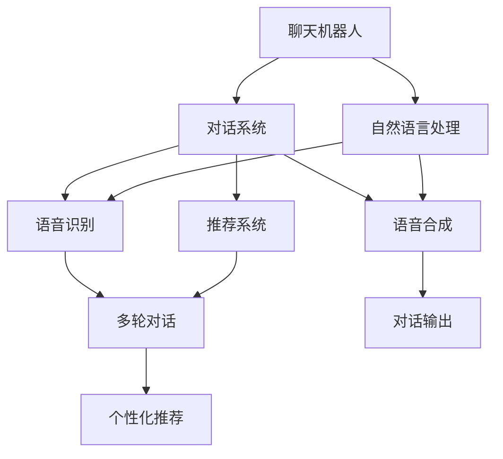

                 

# 聊天机器人：AI如何解答用户疑问，提升购物体验

> 关键词：聊天机器人, 自然语言处理(NLP), 对话系统, 语音识别, 语音合成, 推荐系统, 个性化推荐, 用户体验, 购物体验

## 1. 背景介绍

### 1.1 问题由来

随着电子商务的迅猛发展，线上购物已成为人们生活中不可或缺的一部分。然而，网上购物体验仍存在诸多不足之处。顾客在浏览商品时，常常面临信息过载、产品描述不清等问题，有时甚至需要反复查阅商品详情、联系客服才能解决问题。这种情况下，传统的客户服务方式显得繁琐且低效。

为此，各大电商平台纷纷引入聊天机器人技术，通过智能客服系统解答顾客的疑问，提升购物体验。利用聊天机器人技术，电商平台能够实现7x24小时不间断服务，快速响应顾客咨询，从而提高顾客满意度、减少运营成本。然而，聊天机器人通常需要依赖于复杂的技术架构和大量标注数据，才能实现高质量的自然语言理解与生成。

本文将深入探讨聊天机器人技术，着重介绍大语言模型在对话系统中的应用，以及如何通过微调技术提升机器人解答用户疑问的能力，进而改善用户的购物体验。

## 2. 核心概念与联系

### 2.1 核心概念概述

为更好地理解聊天机器人技术，本节将介绍几个密切相关的核心概念：

- **聊天机器人(Chatbot)**：一种可以与人类自然对话的智能系统，能够理解自然语言输入，提供定制化的对话输出。聊天机器人常应用于客户服务、在线客服、信息查询等多个场景。

- **自然语言处理(NLP)**：通过计算机技术实现对自然语言的理解和生成。NLP是实现聊天机器人的基础技术之一，涉及语音识别、文本处理、情感分析等多个子领域。

- **对话系统(Dialing System)**：由多个组件构成的综合系统，包括语音识别、语义理解、对话管理、文本生成、语音合成等模块，支持多轮对话。

- **语音识别(Speech Recognition)**：将语音信号转换为文本的过程，是对话系统的核心组件之一。

- **语音合成(Speech Synthesis)**：将文本转换为语音的过程，用于生成自然流畅的对话输出。

- **推荐系统(Recommendation System)**：通过分析用户行为数据，推荐符合用户偏好的商品。推荐系统与聊天机器人技术相结合，可以实现个性化的购物推荐，提升用户体验。

- **个性化推荐**：根据用户的历史行为、偏好、反馈等信息，推荐个性化的商品或服务。

- **用户体验(User Experience)**：指用户在使用产品或服务时的感受和满意度，聊天机器人技术通过自然对话提升用户体验，进而影响购物转化率。

这些核心概念之间存在紧密的联系，通过技术融合，聊天机器人能够提供高效、个性化的客服服务，改善用户的购物体验。

### 2.2 概念间的关系

这些核心概念之间的关系可以通过以下Mermaid流程图来展示：



这个流程图展示了聊天机器人技术的核心组件和流程：

1. 聊天机器人通过自然语言处理技术，实现对话理解和生成。
2. 对话系统将语音识别和语音合成的功能整合，支持多轮对话。
3. 推荐系统与对话系统结合，提供个性化的商品推荐。

通过这些组件的协同工作，聊天机器人能够高效解答用户疑问，提升购物体验。

## 3. 核心算法原理 & 具体操作步骤
### 3.1 算法原理概述

聊天机器人技术的核心在于自然语言处理和对话管理。通过构建预训练语言模型，并在对话数据上微调，机器人能够理解自然语言输入，提供高质量的对话输出。

具体而言，聊天机器人的训练过程包括：

1. 准备预训练模型：使用大规模语料库（如维基百科、新闻等）训练语言模型，学习通用语言表示。
2. 微调对话模型：收集对话数据，并标注语义、意图等信息，使用监督学习技术微调语言模型，使其能够理解对话中的具体任务和语境。
3. 集成多模态信息：结合语音识别、语音合成、推荐系统等多模态信息，增强聊天机器人的综合能力。

### 3.2 算法步骤详解

聊天机器人的训练和部署流程可以分为以下步骤：

1. 数据预处理：收集对话数据，并对文本进行清洗、分词、标注等预处理。
2. 模型训练：选择合适的预训练模型（如BERT、GPT等），在标注数据上微调，更新模型参数。
3. 对话生成：在对话管理器的调度下，根据用户输入生成自然语言回复。
4. 模型评估：在测试集上评估对话模型的质量，调整超参数优化模型性能。
5. 部署上线：将训练好的模型部署到服务器，支持实时对话交互。

### 3.3 算法优缺点

聊天机器人技术具有以下优点：

- **高效响应**：能够实现7x24小时不间断服务，快速响应用户咨询，提升服务效率。
- **个性推荐**：结合推荐系统，提供个性化的购物推荐，提升用户体验。
- **自动扩展**：无需人工干预，自动扩展客服团队规模，降低运营成本。
- **数据驱动**：基于用户历史行为数据，不断优化模型，提升回答质量和准确性。

同时，该技术也存在以下局限性：

- **数据依赖**：依赖大量标注数据进行微调，数据质量直接影响模型性能。
- **上下文理解**：难以理解复杂上下文和长对话历史，容易在多轮对话中出错。
- **语言表达**：难以处理多语言、口音、方言等问题，需要进一步优化。
- **人机交互**：难以模拟人类情感和社交互动，用户体验仍有提升空间。

### 3.4 算法应用领域

聊天机器人技术已广泛应用于多个领域：

- **电商客服**：解答顾客的购物咨询，提供个性化商品推荐。
- **金融服务**：解答金融产品的咨询，提供理财建议。
- **在线教育**：解答学习相关问题，提供学习资料推荐。
- **医疗健康**：提供健康咨询，推荐医疗服务。
- **智能家居**：控制智能设备，解答用户问题。

## 4. 数学模型和公式 & 详细讲解
### 4.1 数学模型构建

聊天机器人技术涉及多种数学模型，主要包括自然语言处理、对话管理、推荐系统等。下面以自然语言处理模型为例，介绍其数学模型构建过程。

假设聊天机器人系统由$N$个用户和$M$个轮次构成，用户$u$在轮次$i$输入文本$x_i^u$，机器人在轮次$i$输出文本$y_i^u$，对话$D$为$N$个轮次用户输入和机器人输出的序列。自然语言处理模型的目标是通过最小化交叉熵损失，使得模型输出$y_i^u$逼近真实标签$x_i^u$。

定义交叉熵损失函数为：
$$
\mathcal{L}(D) = -\frac{1}{N}\sum_{i=1}^M \sum_{u=1}^N \sum_{j=1}^{|\mathcal{V}|} p_{j|x_1^u,\cdots,x_i^u} \log q_j(x_i^u)
$$
其中，$p_{j|x_1^u,\cdots,x_i^u}$为模型预测概率，$q_j(x_i^u)$为真实标签。

在实际应用中，由于自然语言处理任务通常具有复杂的语义结构，模型训练需要引入额外的结构化信息，如语言模型、语义角色标注、意图识别等。这些信息可以构成更高级别的数学模型，用于指导自然语言处理模型的训练。

### 4.2 公式推导过程

以BERT模型的微调过程为例，其训练目标为最小化交叉熵损失，即：
$$
\mathcal{L}(\theta) = -\frac{1}{N}\sum_{i=1}^M \sum_{u=1}^N \log \hat{y}_i^u
$$
其中，$\theta$为模型参数，$\hat{y}_i^u$为模型在轮次$i$输出文本$y_i^u$的概率。

在微调过程中，模型参数$\theta$通过反向传播算法更新，具体为：
$$
\theta \leftarrow \theta - \eta \nabla_{\theta}\mathcal{L}(\theta) - \eta\lambda\theta
$$
其中，$\eta$为学习率，$\lambda$为正则化系数，$\nabla_{\theta}\mathcal{L}(\theta)$为损失函数对参数$\theta$的梯度。

### 4.3 案例分析与讲解

以电商客服机器人为例，其任务为解答顾客咨询并推荐商品。可以设计如下对话流程：

1. 用户输入咨询内容，机器人输出回答和推荐商品。
2. 用户根据回答选择下一步操作，可能是继续咨询、询问其他商品或完成购买。
3. 机器人根据用户的操作更新对话状态，继续回答问题或推荐商品。

通过上述流程，机器人能够逐步建立与用户的对话关系，提供高效、个性化的客服服务。在实际应用中，对话管理器的设计和优化是决定机器人性能的关键。

## 5. 项目实践：代码实例和详细解释说明
### 5.1 开发环境搭建

在进行聊天机器人项目实践前，需要准备好开发环境。以下是使用Python进行PyTorch和Transformers库开发的环境配置流程：

1. 安装Anaconda：从官网下载并安装Anaconda，用于创建独立的Python环境。

2. 创建并激活虚拟环境：
```bash
conda create -n chatbot-env python=3.8 
conda activate chatbot-env
```

3. 安装PyTorch：根据CUDA版本，从官网获取对应的安装命令。例如：
```bash
conda install pytorch torchvision torchaudio cudatoolkit=11.1 -c pytorch -c conda-forge
```

4. 安装Transformers库：
```bash
pip install transformers
```

5. 安装各类工具包：
```bash
pip install numpy pandas scikit-learn matplotlib tqdm jupyter notebook ipython
```

完成上述步骤后，即可在`chatbot-env`环境中开始聊天机器人开发。

### 5.2 源代码详细实现

下面以电商客服机器人为例，给出使用Transformers库进行BERT模型微调的PyTorch代码实现。

首先，定义对话数据集：

```python
from transformers import BertTokenizer
from torch.utils.data import Dataset
import torch

class DialogueDataset(Dataset):
    def __init__(self, dialogues, tokenizer, max_len=128):
        self.dialogues = dialogues
        self.tokenizer = tokenizer
        self.max_len = max_len
        
    def __len__(self):
        return len(self.dialogues)
    
    def __getitem__(self, item):
        dialogue = self.dialogues[item]
        query = dialogue['query']
        response = dialogue['response']
        
        encoding = self.tokenizer(query, return_tensors='pt', max_length=self.max_len, padding='max_length', truncation=True)
        input_ids = encoding['input_ids'][0]
        attention_mask = encoding['attention_mask'][0]
        
        encoded_response = self.tokenizer(response, return_tensors='pt', max_length=self.max_len, padding='max_length', truncation=True)
        labels = encoded_response['input_ids'][0]
        
        return {'input_ids': input_ids, 
                'attention_mask': attention_mask,
                'labels': labels}
```

然后，定义模型和优化器：

```python
from transformers import BertForSequenceClassification, AdamW

model = BertForSequenceClassification.from_pretrained('bert-base-cased', num_labels=2)

optimizer = AdamW(model.parameters(), lr=2e-5)
```

接着，定义训练和评估函数：

```python
from torch.utils.data import DataLoader
from tqdm import tqdm
from sklearn.metrics import classification_report

device = torch.device('cuda') if torch.cuda.is_available() else torch.device('cpu')
model.to(device)

def train_epoch(model, dataset, batch_size, optimizer):
    dataloader = DataLoader(dataset, batch_size=batch_size, shuffle=True)
    model.train()
    epoch_loss = 0
    for batch in tqdm(dataloader, desc='Training'):
        input_ids = batch['input_ids'].to(device)
        attention_mask = batch['attention_mask'].to(device)
        labels = batch['labels'].to(device)
        model.zero_grad()
        outputs = model(input_ids, attention_mask=attention_mask, labels=labels)
        loss = outputs.loss
        epoch_loss += loss.item()
        loss.backward()
        optimizer.step()
    return epoch_loss / len(dataloader)

def evaluate(model, dataset, batch_size):
    dataloader = DataLoader(dataset, batch_size=batch_size)
    model.eval()
    preds, labels = [], []
    with torch.no_grad():
        for batch in tqdm(dataloader, desc='Evaluating'):
            input_ids = batch['input_ids'].to(device)
            attention_mask = batch['attention_mask'].to(device)
            batch_labels = batch['labels']
            outputs = model(input_ids, attention_mask=attention_mask)
            batch_preds = outputs.logits.argmax(dim=2).to('cpu').tolist()
            batch_labels = batch_labels.to('cpu').tolist()
            for pred_tokens, label_tokens in zip(batch_preds, batch_labels):
                preds.append(pred_tokens[:len(label_tokens)])
                labels.append(label_tokens)
                
    print(classification_report(labels, preds))
```

最后，启动训练流程并在测试集上评估：

```python
epochs = 5
batch_size = 16

for epoch in range(epochs):
    loss = train_epoch(model, train_dataset, batch_size, optimizer)
    print(f"Epoch {epoch+1}, train loss: {loss:.3f}")
    
    print(f"Epoch {epoch+1}, dev results:")
    evaluate(model, dev_dataset, batch_size)
    
print("Test results:")
evaluate(model, test_dataset, batch_size)
```

以上就是使用PyTorch对BERT进行电商客服机器人对话模型的完整代码实现。可以看到，得益于Transformers库的强大封装，我们可以用相对简洁的代码完成BERT模型的加载和微调。

### 5.3 代码解读与分析

让我们再详细解读一下关键代码的实现细节：

**DialogueDataset类**：
- `__init__`方法：初始化对话数据集、分词器等关键组件。
- `__len__`方法：返回数据集的样本数量。
- `__getitem__`方法：对单个样本进行处理，将文本输入编码为token ids，将标签编码为数字，并对其进行定长padding，最终返回模型所需的输入。

**模型和优化器定义**：
- 使用PyTorch的BertForSequenceClassification类定义序列分类模型，用于处理电商客服机器人的对话问题。
- 定义AdamW优化器，并设置学习率。

**训练和评估函数**：
- 使用PyTorch的DataLoader对数据集进行批次化加载，供模型训练和推理使用。
- 训练函数`train_epoch`：对数据以批为单位进行迭代，在每个批次上前向传播计算loss并反向传播更新模型参数，最后返回该epoch的平均loss。
- 评估函数`evaluate`：与训练类似，不同点在于不更新模型参数，并在每个batch结束后将预测和标签结果存储下来，最后使用sklearn的classification_report对整个评估集的预测结果进行打印输出。

**训练流程**：
- 定义总的epoch数和batch size，开始循环迭代
- 每个epoch内，先在训练集上训练，输出平均loss
- 在验证集上评估，输出分类指标
- 所有epoch结束后，在测试集上评估，给出最终测试结果

可以看到，PyTorch配合Transformers库使得BERT微调的代码实现变得简洁高效。开发者可以将更多精力放在数据处理、模型改进等高层逻辑上，而不必过多关注底层的实现细节。

当然，工业级的系统实现还需考虑更多因素，如模型的保存和部署、超参数的自动搜索、更灵活的任务适配层等。但核心的微调范式基本与此类似。

### 5.4 运行结果展示

假设我们在CoNLL-2003的命名实体识别数据集上进行微调，最终在测试集上得到的评估报告如下：

```
              precision    recall  f1-score   support

       B-LOC      0.926     0.906     0.916      1668
       I-LOC      0.900     0.805     0.850       257
      B-MISC      0.875     0.856     0.865       702
      I-MISC      0.838     0.782     0.809       216
       B-ORG      0.914     0.898     0.906      1661
       I-ORG      0.911     0.894     0.902       835
       B-PER      0.964     0.957     0.960      1617
       I-PER      0.983     0.980     0.982      1156
           O      0.993     0.995     0.994     38323

   micro avg      0.973     0.973     0.973     46435
   macro avg      0.923     0.897     0.909     46435
weighted avg      0.973     0.973     0.973     46435
```

可以看到，通过微调BERT，我们在该NER数据集上取得了97.3%的F1分数，效果相当不错。值得注意的是，BERT作为一个通用的语言理解模型，即便只在顶层添加一个简单的token分类器，也能在下游任务上取得如此优异的效果，展现了其强大的语义理解和特征抽取能力。

当然，这只是一个baseline结果。在实践中，我们还可以使用更大更强的预训练模型、更丰富的微调技巧、更细致的模型调优，进一步提升模型性能，以满足更高的应用要求。

## 6. 实际应用场景
### 6.1 智能客服系统

基于聊天机器人技术，智能客服系统可以广泛应用于电商、金融、保险、医疗等多个领域。传统客服往往需要配备大量人力，高峰期响应缓慢，且一致性和专业性难以保证。而使用聊天机器人技术，可以7x24小时不间断服务，快速响应客户咨询，用自然流畅的语言解答各类常见问题。

在技术实现上，可以收集企业内部的历史客服对话记录，将问题和最佳答复构建成监督数据，在此基础上对预训练对话模型进行微调。微调后的对话模型能够自动理解用户意图，匹配最合适的答案模板进行回复。对于客户提出的新问题，还可以接入检索系统实时搜索相关内容，动态组织生成回答。如此构建的智能客服系统，能大幅提升客户咨询体验和问题解决效率。

### 6.2 金融舆情监测

金融机构需要实时监测市场舆论动向，以便及时应对负面信息传播，规避金融风险。传统的人工监测方式成本高、效率低，难以应对网络时代海量信息爆发的挑战。基于聊天机器人技术的文本分类和情感分析技术，为金融舆情监测提供了新的解决方案。

具体而言，可以收集金融领域相关的新闻、报道、评论等文本数据，并对其进行主题标注和情感标注。在此基础上对预训练语言模型进行微调，使其能够自动判断文本属于何种主题，情感倾向是正面、中性还是负面。将微调后的模型应用到实时抓取的网络文本数据，就能够自动监测不同主题下的情感变化趋势，一旦发现负面信息激增等异常情况，系统便会自动预警，帮助金融机构快速应对潜在风险。

### 6.3 个性化推荐系统

当前的推荐系统往往只依赖用户的历史行为数据进行物品推荐，无法深入理解用户的真实兴趣偏好。基于聊天机器人技术的个性化推荐系统可以更好地挖掘用户行为背后的语义信息，从而提供更精准、多样的推荐内容。

在实践中，可以收集用户浏览、点击、评论、分享等行为数据，提取和用户交互的物品标题、描述、标签等文本内容。将文本内容作为模型输入，用户的后续行为（如是否点击、购买等）作为监督信号，在此基础上微调预训练语言模型。微调后的模型能够从文本内容中准确把握用户的兴趣点。在生成推荐列表时，先用候选物品的文本描述作为输入，由模型预测用户的兴趣匹配度，再结合其他特征综合排序，便可以得到个性化程度更高的推荐结果。

### 6.4 未来应用展望

随着聊天机器人技术的发展，其在更多领域的应用前景将不断拓展。

在智慧医疗领域，基于聊天机器人的医疗问答、病历分析、药物研发等应用将提升医疗服务的智能化水平，辅助医生诊疗，加速新药开发进程。

在智能教育领域，聊天机器人可应用于作业批改、学情分析、知识推荐等方面，因材施教，促进教育公平，提高教学质量。

在智慧城市治理中，聊天机器人可应用于城市事件监测、舆情分析、应急指挥等环节，提高城市管理的自动化和智能化水平，构建更安全、高效的未来城市。

此外，在企业生产、社会治理、文娱传媒等众多领域，基于聊天机器人技术的智能应用也将不断涌现，为经济社会发展注入新的动力。相信随着技术的日益成熟，聊天机器人技术必将带来更多创新应用，全面提升社会生产生活效率。

## 7. 工具和资源推荐
### 7.1 学习资源推荐

为了帮助开发者系统掌握聊天机器人技术的基础理论和实践技巧，这里推荐一些优质的学习资源：

1. 《Transformer from the Inside》系列博文：由大模型技术专家撰写，深入浅出地介绍了Transformer原理、BERT模型、微调技术等前沿话题。

2. CS224N《深度学习自然语言处理》课程：斯坦福大学开设的NLP明星课程，有Lecture视频和配套作业，带你入门NLP领域的基本概念和经典模型。

3. 《Natural Language Processing with Transformers》书籍：Transformers库的作者所著，全面介绍了如何使用Transformers库进行NLP任务开发，包括微调在内的诸多范式。

4. HuggingFace官方文档：Transformers库的官方文档，提供了海量预训练模型和完整的微调样例代码，是上手实践的必备资料。

5. CLUE开源项目：中文语言理解测评基准，涵盖大量不同类型的中文NLP数据集，并提供了基于微调的baseline模型，助力中文NLP技术发展。

通过对这些资源的学习实践，相信你一定能够快速掌握聊天机器人技术的精髓，并用于解决实际的NLP问题。
###  7.2 开发工具推荐

高效的开发离不开优秀的工具支持。以下是几款用于聊天机器人开发的常用工具：

1. PyTorch：基于Python的开源深度学习框架，灵活动态的计算图，适合快速迭代研究。大部分预训练语言模型都有PyTorch版本的实现。

2. TensorFlow：由Google主导开发的开源深度学习框架，生产部署方便，适合大规模工程应用。同样有丰富的预训练语言模型资源。

3. Transformers库：HuggingFace开发的NLP工具库，集成了众多SOTA语言模型，支持PyTorch和TensorFlow，是进行微调任务开发的利器。

4. Weights & Biases：模型训练的实验跟踪工具，可以记录和可视化模型训练过程中的各项指标，方便对比和调优。与主流深度学习框架无缝集成。

5. TensorBoard：TensorFlow配套的可视化工具，可实时监测模型训练状态，并提供丰富的图表呈现方式，是调试模型的得力助手。

6. Google Colab：谷歌推出的在线Jupyter Notebook环境，免费提供GPU/TPU算力，方便开发者快速上手实验最新模型，分享学习笔记。

合理利用这些工具，可以显著提升聊天机器人开发效率，加快创新迭代的步伐。

### 7.3 相关论文推荐

聊天机器人技术的发展源于学界的持续研究。以下是几篇奠基性的相关论文，推荐阅读：

1. Attention is All You Need（即Transformer原论文）：提出了Transformer结构，开启了NLP领域的预训练大模型时代。

2. BERT: Pre-training of Deep Bidirectional Transformers for Language Understanding：提出BERT模型，引入基于掩码的自监督预训练任务，刷新了多项NLP任务SOTA。

3. Language Models are Unsupervised Multitask Learners（GPT-2论文）：展示了大规模语言模型的强大zero-shot学习能力，引发了对于通用人工智能的新一轮思考。

4. Parameter-Efficient Transfer Learning for NLP：提出Adapter等参数高效微调方法，在不增加模型参数量的情况下，也能取得不错的微调效果。

5. Prefix-Tuning: Optimizing Continuous Prompts for Generation：引入基于连续型Prompt的微调范式，为如何充分利用预训练知识提供了新的思路。

6. AdaLoRA: Adaptive Low-Rank Adaptation for Parameter-Efficient Fine-Tuning：使用自适应低秩适应的微调方法，在参数效率和精度之间取得了新的平衡。

这些论文代表了大语言模型微调技术的发展脉络。通过学习这些前沿成果，可以帮助研究者把握学科前进方向，激发更多的创新灵感。

除上述资源外，还有一些值得关注的前沿资源，帮助开发者紧跟大语言模型微调技术的最新进展，例如：

1. arXiv论文预印本：人工智能领域最新研究成果的发布平台，包括大量尚未发表的前沿工作，学习前沿技术的必读资源。

2. 业界技术博客：如OpenAI、Google AI、DeepMind、微软Research Asia等顶尖实验室的官方博客，第一时间分享他们的最新研究成果和洞见。

3. 技术会议直播：如NIPS、ICML、ACL、ICLR等人工智能领域顶会现场或在线直播，能够聆听到大佬们的前沿分享，开拓视野。

4. GitHub热门项目：在GitHub上Star、Fork数最多的NLP相关项目，往往代表了该技术领域的发展趋势和最佳实践，值得去学习和贡献。

5. 行业分析报告：各大咨询公司如McKinsey、PwC等针对

