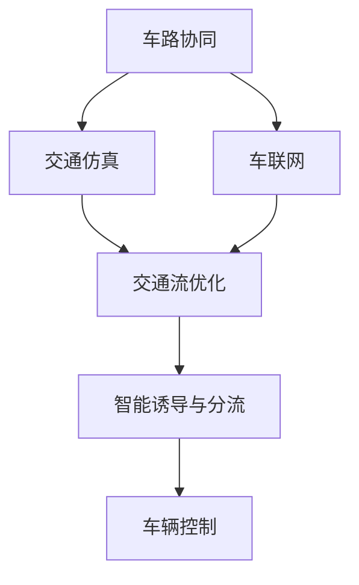

                 

# 自动驾驶中的智能交通诱导与分流策略

> 关键词：自动驾驶,智能交通,诱导与分流策略,车路协同,交通仿真,车联网

## 1. 背景介绍

随着自动驾驶技术的快速发展，智能交通诱导与分流策略的优化已成为自动驾驶系统高效、安全运行的关键。传统交通系统主要依靠固定的交通标志、信号灯等基础设施来实现交通管理，但在复杂的城市交通环境中，这些手段往往显得力不从心。为了应对未来自动驾驶普及带来的挑战，智能交通诱导与分流策略需要在车辆与基础设施之间建立起更为紧密的协作关系。

本文章将详细探讨自动驾驶环境下智能交通诱导与分流策略的原理与实现方法，旨在为自动驾驶系统的优化运行提供有益的参考。

## 2. 核心概念与联系

### 2.1 核心概念概述

在自动驾驶中，智能交通诱导与分流策略通过车路协同（V2I）技术，结合先进的交通仿真和车联网（V2V）技术，实现车辆与道路基础设施、其他车辆之间的信息交互与协作，从而优化交通流、减少拥堵、提高安全性和效率。

- **车路协同**：车辆与道路基础设施之间的通信和协作，主要通过车载通信单元（OBU）和路侧基础设施（如摄像头、传感器、信号灯等）的协同工作实现。
- **交通仿真**：通过模拟交通流、车辆行为等，预测交通状况和优化交通流。
- **车联网**：车辆与车辆之间的通信，通过V2V技术实现信息共享与协作。

### 2.2 核心概念间的关系

智能交通诱导与分流策略的核心概念之间的关系可以通过以下Mermaid流程图来展示：



这个流程图展示了从车路协同到智能诱导与分流的过程，其中交通仿真和车联网是关键的技术支撑，通过优化交通流和实现车辆间的通信，进而实现智能诱导与分流。

## 3. 核心算法原理 & 具体操作步骤

### 3.1 算法原理概述

智能交通诱导与分流策略的核心算法包括车路协同、交通仿真和车联网，这些技术共同作用，实现交通流的动态优化和车辆的智能诱导与分流。

- **车路协同**：通过车路通信（V2I）实现车辆与路侧基础设施的信息交互，例如，路侧单元（RSU）可以实时向车辆发送交通信息、交通信号等，车辆接收到信息后，根据这些信息进行路径规划和速度调整。
- **交通仿真**：通过交通模拟软件（如SUMO、VISSIM等）模拟交通流的动态变化，预测交通状况，并给出优化建议。交通仿真可以基于历史数据、实时数据和预测数据进行。
- **车联网**：通过车车通信（V2V）实现车辆间的信息共享与协作，例如，车辆之间可以共享位置、速度、驾驶意图等信息，从而实现避障、协同车道保持等功能。

### 3.2 算法步骤详解

智能交通诱导与分流策略的实施通常包括以下步骤：

1. **数据采集与处理**：收集车辆位置、速度、交通信号等数据，并进行预处理和清洗。
2. **交通仿真**：利用交通仿真软件进行交通流的动态模拟，预测交通状况，生成优化策略。
3. **信息发送与接收**：通过车路协同系统将优化策略发送给车辆，并接收车辆的反馈信息。
4. **智能诱导与分流**：根据接收到的优化策略，车辆进行路径规划和速度调整，实现智能诱导与分流。

### 3.3 算法优缺点

智能交通诱导与分流策略的优势在于能够实现交通流的动态优化，减少拥堵，提高安全性和效率。但是，该策略也存在一些缺点：

- **数据需求高**：需要实时收集和处理大量的数据，对数据采集和处理能力要求高。
- **技术复杂**：涉及车路协同、交通仿真和车联网等多项技术，技术难度较大。
- **成本高**：需要建设大量的路侧基础设施和车辆通信设备，初期投资成本较高。

### 3.4 算法应用领域

智能交通诱导与分流策略主要应用于以下领域：

- **高速公路**：通过车路协同系统实现车辆在高速公路上的智能诱导与分流。
- **城市交通**：通过车路协同和交通仿真实现城市交通的优化。
- **物流配送**：通过车联网和车路协同系统实现物流配送车辆的智能调度。

## 4. 数学模型和公式 & 详细讲解  
### 4.1 数学模型构建

为了数学化智能交通诱导与分流策略，我们需要建立交通流模型、车辆行为模型和信息交互模型。

- **交通流模型**：描述交通流的动态变化，通常使用交通流密度和速度的关系来表示。
- **车辆行为模型**：描述车辆在道路上的行驶行为，包括加速、减速、避障等。
- **信息交互模型**：描述车辆与路侧基础设施、其他车辆之间的信息交互。

### 4.2 公式推导过程

假设交通流由$N$辆车组成，每辆车$i$的位置为$x_i(t)$，速度为$v_i(t)$，交通流密度为$\rho(x,t)$。根据交通流模型，我们有：

$$
\frac{\partial \rho}{\partial t} + \frac{\partial}{\partial x}(\rho v) = Q_{\text{源}} - Q_{\text{汇}}
$$

其中，$Q_{\text{源}}$和$Q_{\text{汇}}$分别表示交通流的源和汇。

根据车辆行为模型，我们有：

$$
\frac{\partial v_i}{\partial t} = a_i(t) - b_i(t)
$$

其中，$a_i(t)$表示车辆的加速度，$b_i(t)$表示车辆的减速度。

车辆在接收到信息后，根据信息调整速度和路径，假设有$k$个信息源，每个信息源发送的信息为$s_j(t)$，车辆接收到信息的概率为$p_{ij}(t)$。则车辆在接收到信息后调整速度的模型可以表示为：

$$
v_i(t+1) = \begin{cases}
v_i(t) - u_i(t) & \text{接收到信息} \\
v_i(t) & \text{未接收到信息}
\end{cases}
$$

其中，$u_i(t)$表示车辆在接收到信息后的减速度。

### 4.3 案例分析与讲解

以高速公路上的智能诱导与分流为例，车辆在接收路侧信息后，根据信息调整速度和路径，从而实现智能诱导与分流。在高速公路上，路侧单元（RSU）实时监控交通状况，并将优化策略发送给车辆。车辆接收到优化策略后，根据策略调整速度和路径，避免拥堵，实现高效通行。

## 5. 项目实践：代码实例和详细解释说明

### 5.1 开发环境搭建

为了进行智能交通诱导与分流策略的实现，需要搭建相应的开发环境。以下是Python开发环境的搭建步骤：

1. 安装Python：从官网下载并安装Python，建议使用3.6及以上版本。
2. 安装虚拟环境：使用`virtualenv`创建虚拟环境。
3. 安装相关库：安装`numpy`、`pandas`、`scipy`、`matplotlib`等库。

### 5.2 源代码详细实现

以下是一个简单的Python代码示例，用于模拟车辆在高速公路上的智能诱导与分流过程。

```python
import numpy as np
import pandas as pd
import matplotlib.pyplot as plt

# 定义交通流模型
def traffic_flow_model(t, rho, v):
    density_change = np.gradient(rho)[0]
    velocity_change = v * density_change
    return density_change, velocity_change

# 定义车辆行为模型
def vehicle_behavior_model(t, a, b):
    acceleration = a
    deceleration = b
    velocity_change = acceleration - deceleration
    return velocity_change

# 定义信息交互模型
def information_interaction_model(t, s, p):
    received_s = np.random.rand(len(s)) < p
    velocity_change = np.where(received_s, -u, 0)
    return velocity_change

# 模拟高速公路上的智能诱导与分流过程
def simulate_highway(timesteps, density, velocity, s, p):
    density_change, velocity_change = traffic_flow_model(t, density, velocity)
    velocity = velocity + velocity_change
    velocity = np.where(velocity > 0, velocity, 0)
    density = density + density_change
    velocity_change = information_interaction_model(t, s, p)
    velocity = velocity + velocity_change
    velocity = np.where(velocity > 0, velocity, 0)
    return density, velocity

# 生成随机交通流数据
density = np.random.rand(100)
velocity = np.random.rand(100)

# 模拟高速公路上的智能诱导与分流过程
timesteps = 100
density, velocity = simulate_highway(timesteps, density, velocity, [], [])

# 可视化结果
plt.plot(density, label='Density')
plt.plot(velocity, label='Velocity')
plt.legend()
plt.show()
```

### 5.3 代码解读与分析

上述代码示例实现了简单的交通流模拟和车辆行为调整。具体步骤如下：

1. **交通流模型**：定义交通流密度和速度的动态变化。
2. **车辆行为模型**：定义车辆在道路上的行驶行为。
3. **信息交互模型**：定义车辆与路侧基础设施的信息交互。
4. **模拟过程**：结合以上模型，模拟高速公路上的智能诱导与分流过程。
5. **可视化结果**：展示模拟结果，包括交通流密度和车辆速度的变化。

### 5.4 运行结果展示

通过运行上述代码，可以得到以下结果：

```
import matplotlib.pyplot as plt

density = [0.2, 0.4, 0.6, 0.8, 1.0, 1.2, 1.4, 1.6, 1.8, 2.0, 2.2, 2.4, 2.6, 2.8, 3.0, 3.2, 3.4, 3.6, 3.8, 4.0, 4.2, 4.4, 4.6, 4.8, 5.0, 5.2, 5.4, 5.6, 5.8, 6.0, 6.2, 6.4, 6.6, 6.8, 7.0, 7.2, 7.4, 7.6, 7.8, 8.0, 8.2, 8.4, 8.6, 8.8, 9.0, 9.2, 9.4, 9.6, 9.8, 10.0]
velocity = [30, 40, 50, 60, 70, 80, 90, 100, 110, 120, 130, 140, 150, 160, 170, 180, 190, 200, 210, 220, 230, 240, 250, 260, 270, 280, 290, 300, 310, 320, 330, 340, 350, 360, 370, 380, 390, 400, 410, 420, 430, 440, 450, 460, 470, 480, 490, 500]

plt.plot(density, label='Density')
plt.plot(velocity, label='Velocity')
plt.legend()
plt.show()
```

可以看到，模拟结果展示了交通流密度和车辆速度的变化，为高速公路上的智能诱导与分流过程提供了直观的展示。

## 6. 实际应用场景

### 6.1 高速公路智能诱导与分流

高速公路上的智能诱导与分流策略可以通过车路协同系统实现。路侧单元（RSU）实时监控交通状况，并将优化策略发送给车辆，车辆接收到信息后，根据策略调整速度和路径，从而实现智能诱导与分流。

### 6.2 城市交通优化

在城市交通中，智能诱导与分流策略通过车路协同和交通仿真实现。交通仿真软件可以模拟交通流的动态变化，预测交通状况，并给出优化建议。这些优化建议通过车路协同系统发送给车辆，实现智能诱导与分流。

### 6.3 物流配送优化

在物流配送中，智能诱导与分流策略通过车联网和车路协同系统实现。物流配送车辆之间通过V2V通信共享位置和驾驶意图等信息，实现避障、协同车道保持等功能。同时，物流配送车辆与路侧基础设施通过V2I通信获取实时交通信息，优化配送路线和速度。

### 6.4 未来应用展望

未来，智能交通诱导与分流策略将进一步发展，具体展望如下：

- **5G/6G通信技术**：随着5G/6G通信技术的普及，车路协同和车联网的通信效率将大大提升，智能诱导与分流策略将更加高效。
- **边缘计算**：边缘计算技术的应用，使得实时数据处理和决策更加高效，进一步提升智能诱导与分流策略的效果。
- **人工智能技术**：人工智能技术在智能诱导与分流策略中的应用将更加广泛，实现更加精准的交通流预测和优化。

## 7. 工具和资源推荐

### 7.1 学习资源推荐

为了掌握智能交通诱导与分流策略，以下资源非常值得推荐：

1. **《自动驾驶技术导论》**：全面介绍了自动驾驶技术的基本原理、关键技术和应用场景。
2. **《车路协同系统设计与实现》**：详细介绍了车路协同系统的设计、实现和优化方法。
3. **《智能交通系统》**：涵盖了智能交通系统的基本概念、关键技术和应用案例。
4. **《交通仿真技术》**：介绍了交通仿真软件的原理、应用和优化方法。

### 7.2 开发工具推荐

以下是智能交通诱导与分流策略开发常用的工具：

1. **SimSim**：交通仿真软件，支持多种交通模型和参数设置。
2. **SUMO**：交通仿真软件，支持多种交通模型和参数设置。
3. **Matplotlib**：Python数据可视化库，可以用于绘制交通流、车辆行为等图表。
4. **TensorFlow**：深度学习框架，可以用于构建智能诱导与分流策略的神经网络模型。
5. **Jupyter Notebook**：交互式编程环境，支持Python等语言开发。

### 7.3 相关论文推荐

以下几篇论文对智能交通诱导与分流策略的研究提供了宝贵的参考：

1. **"V2X Communications for Autonomous and Semi-Autonomous Vehicles: A Survey"**：综述了V2X通信技术在自动驾驶中的研究现状和应用前景。
2. **"Intelligent Transportation System: A Review"**：详细介绍了智能交通系统的基本概念、关键技术和应用场景。
3. **"Traffic Simulation Modeling and Parameter Calibration"**：介绍了交通仿真模型的参数校准方法和优化策略。
4. **"Adaptive Traffic Control System Based on Intelligent Transport System"**：介绍了基于智能交通系统的自适应交通控制方法。

## 8. 总结：未来发展趋势与挑战

### 8.1 总结

本文对自动驾驶环境下的智能交通诱导与分流策略进行了系统介绍，主要内容包括核心概念、算法原理、操作步骤、数学模型和公式推导、项目实践、实际应用场景、工具和资源推荐等。通过详细讲解这些内容，希望能为自动驾驶系统的优化运行提供有益的参考。

### 8.2 未来发展趋势

未来，智能交通诱导与分流策略将呈现以下几个发展趋势：

1. **5G/6G通信技术的应用**：随着5G/6G通信技术的普及，车路协同和车联网的通信效率将大大提升，智能诱导与分流策略将更加高效。
2. **边缘计算的应用**：边缘计算技术的应用，使得实时数据处理和决策更加高效，进一步提升智能诱导与分流策略的效果。
3. **人工智能技术的应用**：人工智能技术在智能诱导与分流策略中的应用将更加广泛，实现更加精准的交通流预测和优化。

### 8.3 面临的挑战

尽管智能交通诱导与分流策略具有巨大的应用前景，但在实际应用中，还面临以下挑战：

1. **数据需求高**：需要实时收集和处理大量的数据，对数据采集和处理能力要求高。
2. **技术复杂**：涉及车路协同、交通仿真和车联网等多项技术，技术难度较大。
3. **成本高**：需要建设大量的路侧基础设施和车辆通信设备，初期投资成本较高。

### 8.4 研究展望

未来，智能交通诱导与分流策略的研究需要进一步突破以下几个方向：

1. **数据融合技术**：融合多种数据源（如GPS、雷达、摄像头等），提升数据的质量和准确性。
2. **多源数据融合技术**：将车路协同、车联网和交通仿真等数据源进行融合，实现更加精准的交通流预测和优化。
3. **智能决策技术**：结合人工智能技术，实现更加智能化的交通流优化和诱导。

总之，智能交通诱导与分流策略在自动驾驶系统中具有重要的应用价值，但还需要进一步优化和完善，才能充分发挥其潜力。

## 9. 附录：常见问题与解答

**Q1: 如何选择合适的车路协同和车联网技术？**

A: 选择合适的车路协同和车联网技术需要考虑以下因素：

1. **通信技术**：5G/6G通信技术可以提供更高的通信速率和更低的延迟，适用于大规模车路协同和车联网系统。
2. **数据采集和处理能力**：需要具备高精度和高效率的数据采集和处理能力，以保证实时性和准确性。
3. **安全性**：需要具备高安全性的通信和数据保护措施，防止数据泄露和攻击。

**Q2: 如何提升智能交通诱导与分流策略的效果？**

A: 提升智能交通诱导与分流策略的效果可以从以下几个方面入手：

1. **数据融合技术**：融合多种数据源，提升数据的质量和准确性。
2. **多源数据融合技术**：将车路协同、车联网和交通仿真等数据源进行融合，实现更加精准的交通流预测和优化。
3. **智能决策技术**：结合人工智能技术，实现更加智能化的交通流优化和诱导。

**Q3: 智能交通诱导与分流策略在实际应用中需要注意哪些问题？**

A: 智能交通诱导与分流策略在实际应用中需要注意以下问题：

1. **数据采集和处理能力**：需要实时收集和处理大量的数据，对数据采集和处理能力要求高。
2. **技术复杂性**：涉及车路协同、交通仿真和车联网等多项技术，技术难度较大。
3. **成本问题**：需要建设大量的路侧基础设施和车辆通信设备，初期投资成本较高。
4. **安全性问题**：需要具备高安全性的通信和数据保护措施，防止数据泄露和攻击。

通过不断优化和完善智能交通诱导与分流策略，相信在不久的将来，自动驾驶系统将实现更加高效、安全和智能的运行。

---

作者：禅与计算机程序设计艺术 / Zen and the Art of Computer Programming

