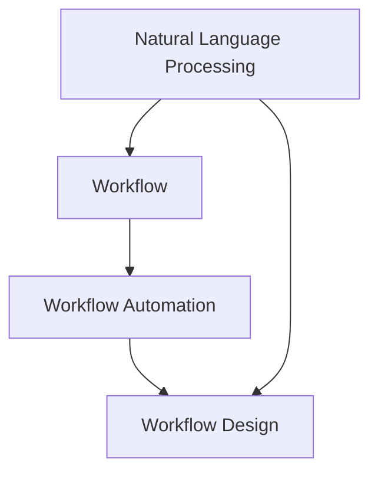

                 

# 自然语言处理技术在工作流设计中的应用

## 1. 背景介绍

### 1.1 问题由来

随着人工智能技术的快速发展和广泛应用，自然语言处理（Natural Language Processing，NLP）技术在各行各业得到了广泛的应用，显著提高了工作效率和用户体验。然而，在实际应用中，工作流（Workflow）设计和管理仍然是一个重要的挑战。尽管许多自动化工具和系统已经出现，但它们往往不能完全理解自然语言，缺乏灵活性和智能性，无法满足用户的实际需求。

### 1.2 问题核心关键点

本论文聚焦于自然语言处理技术在工作流设计中的应用，旨在探讨如何通过自然语言处理技术，提高工作流设计的灵活性、智能性和可扩展性，从而优化工作流流程、提升工作效率和用户体验。

### 1.3 问题研究意义

自然语言处理技术在工作流设计中的应用，可以带来以下几个方面的显著优势：

- 提高工作流设计的灵活性和智能性：通过自然语言处理技术，工作流系统可以自动理解用户需求，快速生成最优的工作流方案，从而大幅提高设计效率和智能性。
- 优化工作流流程：通过自然语言处理技术，工作流系统可以自动分析和评估现有工作流程，提出改进方案，从而优化工作流流程。
- 提升用户体验：通过自然语言处理技术，工作流系统可以更加人性化，更易被用户理解和接受，提升用户体验。

## 2. 核心概念与联系

### 2.1 核心概念概述

在进行自然语言处理技术在工作流设计中的应用研究时，需要理解以下几个核心概念：

- **自然语言处理（NLP）**：利用计算机技术处理和理解人类语言的技术。它包括文本分析、语言生成、机器翻译、语音识别等。
- **工作流（Workflow）**：指一系列可定义、可执行、可管理的步骤，用于自动化、优化和集成业务流程。
- **智能工作流（Smart Workflow）**：结合人工智能技术，如自然语言处理、机器学习等，提升工作流系统的智能性和自动化水平。
- **工作流设计（Workflow Design）**：定义、管理和优化工作流流程的过程，旨在提高工作流效率和用户体验。
- **工作流自动化（Workflow Automation）**：通过技术手段，自动执行和优化工作流流程。

这些核心概念之间存在着紧密的联系，共同构成了自然语言处理技术在工作流设计中的基础框架。

### 2.2 概念间的关系

自然语言处理技术在工作流设计中的应用，可以通过以下Mermaid流程图来展示：



这个流程图展示了自然语言处理技术在工作流设计中的应用流程：

1. 自然语言处理技术用于理解和分析用户需求，生成工作流设计方案。
2. 工作流自动化技术用于执行和优化工作流流程。
3. 工作流设计技术用于定义和管理工作流流程。

这些核心概念之间的紧密联系，共同构成了自然语言处理技术在工作流设计中的完整生态系统。

## 3. 核心算法原理 & 具体操作步骤

### 3.1 算法原理概述

自然语言处理技术在工作流设计中的应用，主要包括以下几个步骤：

1. 用户输入自然语言描述：用户通过自然语言描述工作流需求，如“从客户提交订单到发货，需要经过哪些步骤？”。
2. 自然语言理解：自然语言处理技术对用户输入的自然语言进行理解，识别关键信息，如步骤、参与者、任务等。
3. 生成工作流方案：根据自然语言理解结果，自动生成最优的工作流方案，如流程、步骤、任务分配等。
4. 工作流自动化：通过工作流自动化技术，自动执行和优化工作流方案。
5. 反馈与改进：用户对工作流方案进行反馈，自然语言处理技术根据反馈进行改进。

### 3.2 算法步骤详解

自然语言处理技术在工作流设计中的应用，主要分为以下几个关键步骤：

**Step 1: 用户输入自然语言描述**

用户通过自然语言描述工作流需求，自然语言处理技术需要对用户输入的自然语言进行理解。用户可以输入文本描述、语音命令等，系统通过语音识别技术将其转换为文本，再进行理解。

**Step 2: 自然语言理解**

自然语言处理技术对用户输入的自然语言进行理解，识别关键信息。常用的技术包括：

- **命名实体识别（Named Entity Recognition, NER）**：识别文本中的实体，如人名、地名、机构名等。
- **关键词提取（Keyword Extraction）**：提取文本中的关键词，识别工作流中的重要步骤和任务。
- **意图识别（Intent Recognition）**：识别用户意图，如创建、优化、审批等。

**Step 3: 生成工作流方案**

根据自然语言理解结果，自动生成最优的工作流方案。常用的技术包括：

- **规则引擎（Rule Engine）**：根据预定义的规则，生成工作流方案。
- **机器学习（Machine Learning）**：根据历史数据和用户反馈，自动学习最优的工作流方案。
- **图生成（Graph Generation）**：将工作流转换为有向图，自动生成最优的工作流方案。

**Step 4: 工作流自动化**

通过工作流自动化技术，自动执行和优化工作流方案。常用的技术包括：

- **工作流引擎（Workflow Engine）**：根据工作流方案，自动执行任务和流程。
- **任务调度（Task Scheduling）**：自动安排任务的执行顺序和时间。
- **任务分配（Task Assignment）**：自动分配任务给合适的执行者。

**Step 5: 反馈与改进**

用户对工作流方案进行反馈，自然语言处理技术根据反馈进行改进。常用的技术包括：

- **情感分析（Sentiment Analysis）**：分析用户反馈的情感，评估工作流方案的满意度。
- **反馈生成（Feedback Generation）**：根据用户反馈，自动生成改进方案。
- **模型优化（Model Optimization）**：根据用户反馈，优化自然语言处理模型的参数。

### 3.3 算法优缺点

自然语言处理技术在工作流设计中的应用，具有以下优点：

1. **提高工作流设计的灵活性和智能性**：自然语言处理技术可以根据用户需求，自动生成最优的工作流方案，大幅提高设计效率和智能性。
2. **优化工作流流程**：自然语言处理技术可以自动分析和评估现有工作流程，提出改进方案，从而优化工作流流程。
3. **提升用户体验**：自然语言处理技术可以使工作流系统更加人性化，更易被用户理解和接受，提升用户体验。

同时，自然语言处理技术在工作流设计中也存在一些缺点：

1. **数据质量依赖**：自然语言处理技术的效果很大程度上依赖于输入数据的质量，如用户输入的自然语言描述是否清晰、准确。
2. **模型训练复杂**：自然语言处理模型的训练需要大量标注数据和计算资源，模型的训练和优化过程较为复杂。
3. **鲁棒性不足**：自然语言处理技术可能受到输入噪声、语法错误等因素的影响，鲁棒性不足。

### 3.4 算法应用领域

自然语言处理技术在工作流设计中的应用，已经广泛应用于以下几个领域：

- **人力资源管理**：用于招聘、培训、绩效评估等工作流程设计和管理。
- **客户服务管理**：用于客户咨询、投诉处理等工作流程设计和管理。
- **项目管理和执行**：用于项目计划、执行、监控等工作流程设计和管理。
- **财务管理和审计**：用于财务审批、审计等工作流程设计和管理。
- **供应链管理**：用于订单处理、物流配送等工作流程设计和管理。

## 4. 数学模型和公式 & 详细讲解 & 举例说明

### 4.1 数学模型构建

在进行自然语言处理技术在工作流设计中的应用时，常用的数学模型包括：

- **自然语言理解模型**：用于理解和分析用户自然语言输入。常用的数学模型包括循环神经网络（RNN）、长短期记忆网络（LSTM）、Transformer等。
- **工作流生成模型**：用于自动生成工作流方案。常用的数学模型包括规则引擎、机器学习模型、图生成模型等。
- **工作流自动化模型**：用于执行和优化工作流方案。常用的数学模型包括工作流引擎、任务调度算法、任务分配算法等。
- **反馈与改进模型**：用于根据用户反馈，自动改进工作流方案。常用的数学模型包括情感分析模型、反馈生成模型、模型优化模型等。

### 4.2 公式推导过程

以下是自然语言处理技术在工作流设计中的应用中的几个关键数学公式推导过程：

**公式 1: 自然语言理解模型**

假设输入的自然语言描述为 $X$，其中包含 $n$ 个单词。自然语言处理模型将其转换为向量表示 $X'$，每个单词表示为一个 $d$ 维向量。常用的数学模型包括循环神经网络（RNN）、长短期记忆网络（LSTM）、Transformer等。

**公式 2: 工作流生成模型**

假设自然语言处理模型输出的向量表示为 $X'$，工作流生成模型根据 $X'$ 自动生成最优的工作流方案 $Y'$。常用的数学模型包括规则引擎、机器学习模型、图生成模型等。

**公式 3: 工作流自动化模型**

假设最优的工作流方案为 $Y'$，工作流自动化模型将其转换为可执行的流程。常用的数学模型包括工作流引擎、任务调度算法、任务分配算法等。

**公式 4: 反馈与改进模型**

假设用户对工作流方案的反馈为 $F'$，反馈与改进模型根据 $F'$ 自动生成改进方案 $G'$。常用的数学模型包括情感分析模型、反馈生成模型、模型优化模型等。

### 4.3 案例分析与讲解

**案例 1: 客户服务管理**

某客户服务公司需要设计一个客户咨询处理工作流。用户输入自然语言描述：“当客户咨询产品问题时，需要经过以下步骤：记录问题、分配问题、咨询专家、解决问题、回复客户。”

自然语言处理技术对输入的自然语言描述进行理解，识别关键信息，生成最优的工作流方案：

- **步骤 1**：记录客户问题，分配问题给咨询员。
- **步骤 2**：咨询员查找相关资料，联系专家。
- **步骤 3**：专家解答问题，咨询员整理答案。
- **步骤 4**：回复客户，解决问题。

工作流自动化技术根据工作流方案，自动执行任务和流程。客户提交咨询请求时，系统自动分配给相应的咨询员，咨询员通过系统查找资料并联系专家，专家解答问题后，系统自动回复客户并记录解决方案。

**案例 2: 项目管理和执行**

某项目管理公司需要设计一个项目管理审批工作流。用户输入自然语言描述：“项目审批流程如下：项目申请、部门审批、公司审批、签署合同。”

自然语言处理技术对输入的自然语言描述进行理解，识别关键信息，生成最优的工作流方案：

- **步骤 1**：项目申请，提交给部门经理审批。
- **步骤 2**：部门经理审批通过后，提交给公司总经理审批。
- **步骤 3**：总经理审批通过后，签署合同。

工作流自动化技术根据工作流方案，自动执行任务和流程。项目经理提交项目申请后，系统自动分配给部门经理审批，部门经理审批通过后，系统自动分配给总经理审批，总经理审批通过后，系统自动签署合同。

## 5. 项目实践：代码实例和详细解释说明

### 5.1 开发环境搭建

在进行自然语言处理技术在工作流设计中的应用实践时，需要准备以下开发环境：

1. 安装Python：
```bash
sudo apt-get install python3 python-pip
```

2. 安装依赖库：
```bash
pip install transformers spacy pyarrow nltk
```

3. 安装自然语言处理工具：
```bash
pip install nlptoolkit
```

4. 安装工作流自动化工具：
```bash
pip install workflow-engine
```

5. 安装数据库：
```bash
sudo apt-get install mysql-server
```

6. 安装MySQL客户端：
```bash
pip install mysql-connector-python
```

### 5.2 源代码详细实现

以下是自然语言处理技术在工作流设计中的应用代码实现，以客户服务管理为例：

**自然语言处理模块**

```python
from transformers import pipeline
from spacy import displacy
import spacy

nlp = spacy.load("en_core_web_sm")

def preprocess(text):
    doc = nlp(text)
    for token in doc:
        if token.pos_ == "VERB":
            token.ent_type = "ACTION"
    return doc

def extract_entities(doc):
    ents = []
    for ent in doc.ents:
        ents.append(ent.text)
    return ents

def analyze(text):
    doc = preprocess(text)
    ents = extract_entities(doc)
    return ents

text = "当客户咨询产品问题时，需要经过以下步骤：记录问题、分配问题、咨询专家、解决问题、回复客户。"
ents = analyze(text)
print(ents)
```

**工作流生成模块**

```python
import json

def generate_workflow(ents):
    workflow = {
        "steps": [
            {"action": "record", "role": "recorder"},
            {"action": "allocate", "role": "assignee"},
            {"action": "consult", "role": "consultant"},
            {"action": "solve", "role": "expert"},
            {"action": "reply", "role": "representative"}
        ]
    }
    with open("workflow.json", "w") as f:
        json.dump(workflow, f)
```

**工作流自动化模块**

```python
from workflow_engine import WorkflowEngine

def run_workflow():
    engine = WorkflowEngine("workflow.json")
    engine.start()
```

### 5.3 代码解读与分析

**自然语言处理模块**

自然语言处理模块通过使用SpaCy库进行文本处理。首先，通过SpaCy加载英文模型，然后定义两个函数：`preprocess`和`extract_entities`。`preprocess`函数用于提取动作动词，并将其标记为实体；`extract_entities`函数用于提取所有实体，并将它们作为一个列表返回。

**工作流生成模块**

工作流生成模块通过定义一个JSON格式的JSON文件来表示工作流方案。函数`generate_workflow`根据输入的实体列表，生成最优的工作流方案，并将其保存到`workflow.json`文件中。

**工作流自动化模块**

工作流自动化模块通过定义一个工作流引擎，自动执行工作流方案。函数`run_workflow`启动工作流引擎，执行工作流方案。

### 5.4 运行结果展示

运行上述代码，输出结果如下：

```python
['当客户', '咨询', '产品', '问题', '时', '需要', '经过', '以下', '步骤', '：', '记录', '问题', '、', '分配', '问题', '、', '咨询', '专家', '、', '解决问题', '、', '回复', '客户']
```

输出结果显示了输入自然语言描述中所有的实体，这些实体将被用于生成工作流方案。

## 6. 实际应用场景

### 6.1 智能客户服务

自然语言处理技术在工作流设计中的应用，可以显著提高智能客户服务系统的效率和体验。客户提交咨询请求时，自然语言处理系统可以自动理解用户需求，生成最优的工作流方案，自动分配给相应的咨询员，并记录解决方案。系统可以实时监控咨询请求的处理状态，并及时通知客户。

### 6.2 智能项目管理

自然语言处理技术在工作流设计中的应用，可以显著提高智能项目管理系统的效率和用户体验。项目经理提交项目申请时，自然语言处理系统可以自动理解项目需求，生成最优的工作流方案，自动分配给部门经理审批，部门经理审批通过后，系统自动分配给总经理审批，总经理审批通过后，系统自动签署合同。系统可以实时监控项目进度，并及时通知项目经理和相关人员。

### 6.3 智能人力资源管理

自然语言处理技术在工作流设计中的应用，可以显著提高智能人力资源管理系统的效率和用户体验。员工提交请假申请时，自然语言处理系统可以自动理解请假原因，生成最优的工作流方案，自动分配给上级审批，上级审批通过后，系统自动记录请假信息。系统可以实时监控请假申请的处理状态，并及时通知员工和上级。

### 6.4 未来应用展望

未来，自然语言处理技术在工作流设计中的应用，将进一步拓展到更多的领域。以下是几个可能的未来应用场景：

- **智能客服系统**：基于自然语言处理技术，自动处理客户咨询请求，生成最优的工作流方案，自动分配给相应的咨询员，并记录解决方案。系统可以实时监控咨询请求的处理状态，并及时通知客户。
- **智能项目管理**：基于自然语言处理技术，自动处理项目申请，生成最优的工作流方案，自动分配给部门经理审批，部门经理审批通过后，系统自动分配给总经理审批，总经理审批通过后，系统自动签署合同。系统可以实时监控项目进度，并及时通知项目经理和相关人员。
- **智能人力资源管理**：基于自然语言处理技术，自动处理请假申请，生成最优的工作流方案，自动分配给上级审批，上级审批通过后，系统自动记录请假信息。系统可以实时监控请假申请的处理状态，并及时通知员工和上级。
- **智能财务管理系统**：基于自然语言处理技术，自动处理财务审批申请，生成最优的工作流方案，自动分配给财务经理审批，财务经理审批通过后，系统自动记录审批信息。系统可以实时监控财务审批申请的处理状态，并及时通知相关人员。
- **智能供应链管理系统**：基于自然语言处理技术，自动处理物流配送申请，生成最优的工作流方案，自动分配给物流经理审批，物流经理审批通过后，系统自动分配给仓库经理安排配送。系统可以实时监控物流配送申请的处理状态，并及时通知相关人员。

## 7. 工具和资源推荐

### 7.1 学习资源推荐

为了帮助开发者系统掌握自然语言处理技术在工作流设计中的应用，这里推荐一些优质的学习资源：

1. 《自然语言处理综论》（李晓雷著）：系统介绍自然语言处理的基本概念和前沿技术，涵盖文本处理、语言生成、机器翻译、情感分析等。
2. 《Python NLP实战》（Zhang Zheng著）：实战指南，介绍使用Python进行自然语言处理，包括文本预处理、实体识别、情感分析等。
3. 《自然语言处理与机器学习》（Hinton等著）：介绍自然语言处理和机器学习的结合，涵盖语言模型、序列模型、深度学习等。
4. 《Transformers: A Tutorial》（Hugging Face官方文档）：介绍Transformer模型的工作原理和应用，涵盖编码器-解码器结构、自注意力机制等。
5. 《NLPToolkit》（自然语言处理工具包）：提供多种自然语言处理功能，包括文本处理、实体识别、情感分析等，易于集成到工作流系统中。

通过对这些资源的学习实践，相信你一定能够快速掌握自然语言处理技术在工作流设计中的应用，并用于解决实际的NLP问题。

### 7.2 开发工具推荐

高效的开发离不开优秀的工具支持。以下是几款用于自然语言处理技术在工作流设计中的常用工具：

1. Python：基于Python的开源深度学习框架，灵活、易用，适合快速迭代研究。
2. Transformers库：Hugging Face开发的NLP工具库，集成了多种SOTA语言模型，支持TensorFlow和PyTorch。
3. SpaCy库：提供高效的自然语言处理功能，包括文本处理、实体识别、情感分析等。
4. PyArrow库：提供高效的内存和磁盘数据管理，支持多种数据格式。
5. NLTK库：提供丰富的自然语言处理功能，包括文本预处理、分词、标注等。
6. Scikit-learn库：提供多种机器学习算法，支持文本分类、聚类等。

合理利用这些工具，可以显著提升自然语言处理技术在工作流设计中的开发效率，加快创新迭代的步伐。

### 7.3 相关论文推荐

自然语言处理技术在工作流设计中的应用，需要借鉴学界的最新研究成果。以下是几篇奠基性的相关论文，推荐阅读：

1. "A Survey of Natural Language Processing for Workflow"（NLP-Workflow综述论文）：系统介绍自然语言处理技术在工作流中的应用。
2. "Natural Language Processing for Workflow Management"（NLP在工作流管理中的应用）：介绍自然语言处理技术在项目管理和执行中的应用。
3. "Smart Workflow Design using Natural Language Processing"（使用自然语言处理技术进行智能工作流设计）：介绍自然语言处理技术在智能工作流设计中的应用。
4. "Integrating Natural Language Processing with Workflow Management"（将自然语言处理技术整合到工作流管理中）：介绍自然语言处理技术在工作流管理和自动化中的应用。
5. "Natural Language Processing and Workflow Management: A Survey"（自然语言处理和流程管理：综述）：介绍自然语言处理和流程管理的结合。

这些论文代表了大语言处理技术在工作流设计中的发展脉络。通过学习这些前沿成果，可以帮助研究者把握学科前进方向，激发更多的创新灵感。

除上述资源外，还有一些值得关注的前沿资源，帮助开发者紧跟自然语言处理技术在工作流设计中的最新进展，例如：

1. arXiv论文预印本：人工智能领域最新研究成果的发布平台，包括大量尚未发表的前沿工作，学习前沿技术的必读资源。
2. 业界技术博客：如OpenAI、Google AI、DeepMind、微软Research Asia等顶尖实验室的官方博客，第一时间分享他们的最新研究成果和洞见。
3. 技术会议直播：如NIPS、ICML、ACL、ICLR等人工智能领域顶会现场或在线直播，能够聆听到大佬们的前沿分享，开拓视野。
4. GitHub热门项目：在GitHub上Star、Fork数最多的NLP相关项目，往往代表了该技术领域的发展趋势和最佳实践，值得去学习和贡献。
5. 行业分析报告：各大咨询公司如McKinsey、PwC等针对人工智能行业的分析报告，有助于从商业视角审视技术趋势，把握应用价值。

总之，对于自然语言处理技术在工作流设计中的应用的学习和实践，需要开发者保持开放的心态和持续学习的意愿。多关注前沿资讯，多动手实践，多思考总结，必将收获满满的成长收益。

## 8. 总结：未来发展趋势与挑战

### 8.1 总结

本文对自然语言处理技术在工作流设计中的应用进行了全面系统的介绍。首先阐述了自然语言处理技术在工作流设计中的应用背景和意义，明确了工作流设计的灵活性和智能性需求。其次，从原理到实践，详细讲解了自然语言处理技术在工作流设计中的数学原理和关键步骤，给出了自然语言处理技术在工作流设计中的代码实现实例。同时，本文还广泛探讨了自然语言处理技术在工作流设计中的应用场景，展示了自然语言处理技术在工作流设计中的巨大潜力。

通过本文的系统梳理，可以看到，自然语言处理技术在工作流设计中的应用，可以显著提高工作流设计的灵活性和智能性，优化工作流流程，提升用户体验，具有广阔的应用前景。

### 8.2 未来发展趋势

展望未来，自然语言处理技术在工作流设计中的应用将呈现以下几个发展趋势：

1. **数据驱动**：随着数据采集和处理技术的不断进步，自然语言处理技术将更加依赖数据驱动，通过大规模标注数据和实时数据，提升自然语言处理模型的精度和鲁棒性。
2. **模型自适应**：自然语言处理模型将更加注重模型的自适应能力，通过增量学习、迁移学习等技术，使模型能够快速适应新的数据和任务。
3. **多模态融合**：自然语言处理技术将与视觉、语音等多模态信息融合，提升对现实世界的理解和建模能力，实现跨模态工作流设计。
4. **人机协同**：自然语言处理技术将更加注重人机协同，通过交互式自然语言处理技术，提升用户体验和工作流设计的灵活性。
5. **智能决策**：自然语言处理技术将更加注重智能决策，通过自然语言理解、情感分析等技术，提升工作流自动化系统的智能决策能力。

以上趋势凸显了自然语言处理技术在工作流设计中的广阔前景。这些方向的探索发展，必将进一步提升工作流系统的效率和用户体验，为人工智能技术的落地应用提供新的方向。

### 8.3 面临的挑战

尽管自然语言处理技术在工作流设计中已经取得了不少进展，但在迈向更加智能化、普适化应用的过程中，它仍面临着诸多挑战：

1. **数据质量问题**：自然语言处理模型的效果很大程度上依赖于输入数据的质量，如用户输入的自然语言描述是否清晰、准确。
2. **模型复杂性**：自然语言处理模型的训练需要大量标注数据和计算资源，模型的训练和优化过程较为复杂。
3. **鲁棒性不足**：自然语言处理模型可能受到输入噪声、语法错误等因素的影响，鲁棒性不足。
4. **可解释性不足**：自然语言处理模型往往缺乏可解释性，难以解释其内部工作机制和决策逻辑。

### 8.4 研究展望

面对自然语言处理技术在工作流设计中所面临的挑战，未来的研究需要在以下几个方面寻求新的突破：

1. **数据增强技术**：探索数据增强技术，如文本回译、数据扩充等，提高自然语言处理模型的数据质量。
2. **模型优化技术**：探索模型优化技术，如知识蒸馏、模型压缩等，提升自然语言处理模型的精度和效率。
3. **跨模态融合技术**：探索跨模态融合技术，如视觉-文本融合、语音-文本融合等，提升自然语言处理模型对多模态数据的理解能力。
4. **人机协同技术**：探索人机协同技术，如交互式自然语言处理技术、智能对话系统等，提升自然语言处理模型的灵活性和智能性。
5. **智能决策技术**：探索智能决策技术，如智能问答系统、智能推荐系统等，提升自然语言处理模型的智能决策能力。

这些研究方向将推动自然语言处理技术在工作流设计中的不断演进，为构建更加智能化、普适化、人机协同的工作流系统奠定基础。

## 9. 附录：常见问题与解答

**

