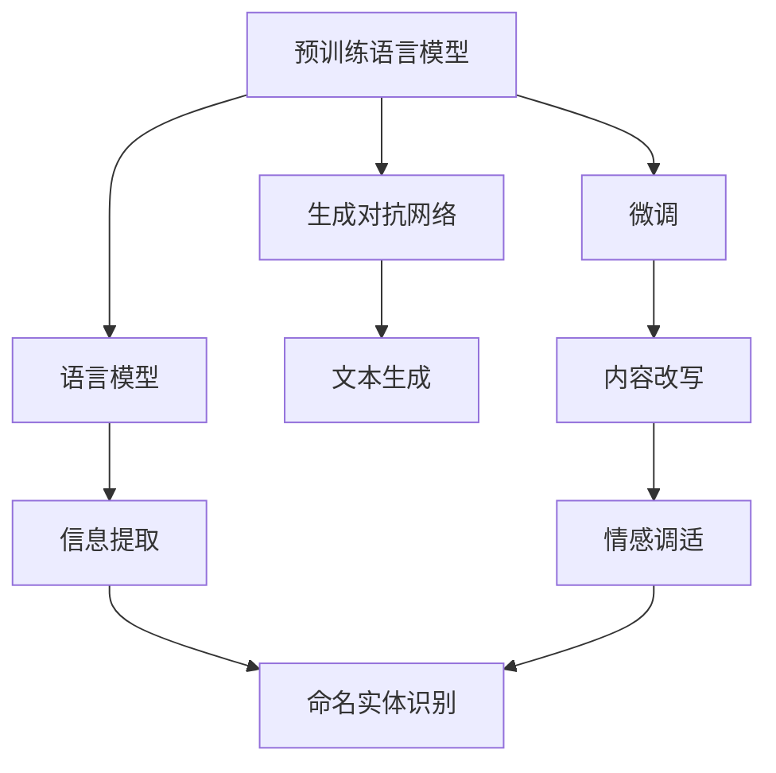
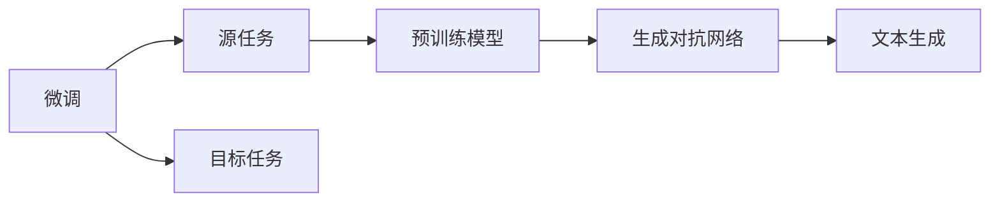
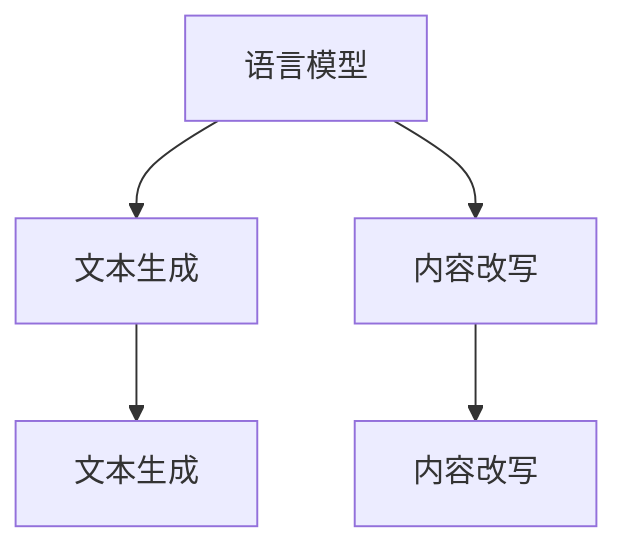

                 

# 自然语言处理的应用：内容创作革命

## 1. 背景介绍

### 1.1 问题由来

随着互联网的普及和社交媒体的兴起，内容创作成为连接用户、影响市场的核心驱动力。无论是广告、新闻、文章、视频还是音乐，高质量内容的产出都是吸引用户、提升品牌影响力的关键。然而，传统的内容创作过程往往依赖人力，效率低下，且质量难以保证。近年来，自然语言处理（Natural Language Processing, NLP）技术的迅猛发展，尤其是预训练语言模型（Pre-trained Language Models, PLMs）的应用，显著降低了内容创作的成本和时间，并大大提升了内容质量。

### 1.2 问题核心关键点

自然语言处理在内容创作中的应用，主要体现在以下几个方面：

- **文本生成**：利用预训练语言模型，自动生成高质量的文本内容，如新闻报道、文章摘要、翻译等。
- **内容改写**：对现有内容进行改写，提升内容的表达力和可读性。
- **创意写作**：生成创意性文本，如故事、诗歌、剧本等，激发创意思维。
- **内容优化**：对现有内容进行优化，如错字校正、风格转换、情感调适等。
- **信息提取**：从大量文本数据中提取关键信息，生成简洁明了的摘要或报告。

这些应用不仅提高了内容创作的效率和质量，还为内容分发、推荐等后续环节提供了重要支撑。

### 1.3 问题研究意义

自然语言处理在内容创作中的应用，对于推动内容产业的发展、提升用户体验、促进信息传播具有重要意义：

1. **降低成本**：自动化内容创作工具的普及，减少了人力成本和时间成本，加速内容生产。
2. **提升效率**：利用NLP技术，内容创作者可以快速生成大量高质量内容，满足市场快速迭代的需求。
3. **增强表达力**：通过改写和优化，内容更符合用户偏好，提升可读性和传播效果。
4. **激发创意**：创意写作工具为内容创作者提供了新的灵感来源，促进了创意内容的涌现。
5. **优化信息**：信息提取工具帮助内容创作者快速抓取关键信息，生成简洁明了的摘要，提升信息传播的效率和精准度。

自然语言处理技术的进步，正在深刻改变内容创作的格局，推动内容产业的创新与发展。

## 2. 核心概念与联系

### 2.1 核心概念概述

为更好地理解自然语言处理在内容创作中的应用，本节将介绍几个密切相关的核心概念：

- **预训练语言模型（Pre-trained Language Models, PLMs）**：通过在大规模无标签文本数据上进行自监督学习，学习通用的语言表示，具备强大的语言理解和生成能力。常见的预训练模型包括BERT、GPT、T5等。
- **微调（Fine-tuning）**：在预训练模型的基础上，使用下游任务的少量标注数据，通过有监督学习优化模型在特定任务上的性能。通常只需要调整顶层分类器或解码器，并以较小的学习率更新全部或部分的模型参数。
- **生成对抗网络（Generative Adversarial Networks, GANs）**：由一个生成器（Generator）和一个判别器（Discriminator）组成，通过对抗训练提升生成器生成自然语言文本的能力。
- **语言模型（Language Modeling）**：利用统计语言模型或神经网络模型，预测文本序列的概率分布，衡量语言模型的预测能力。
- **文本生成（Text Generation）**：利用预训练语言模型，自动生成自然语言文本，如对话、文章、摘要等。
- **内容改写（Text Rewriting）**：对现有文本进行改写，提升内容的表达力和可读性，如情感调适、风格转换等。
- **信息提取（Information Extraction）**：从文本中提取关键信息，生成简洁明了的摘要或报告，如命名实体识别、关系抽取等。

这些核心概念之间的逻辑关系可以通过以下Mermaid流程图来展示：



这个流程图展示了大语言模型在内容创作中的核心应用范式：

1. 预训练模型通过自监督学习获得通用的语言表示。
2. 微调模型在少量标注数据上，进一步优化模型在特定任务上的性能。
3. 生成对抗网络通过对抗训练，提升生成器生成文本的能力。
4. 语言模型用于衡量文本的概率分布，指导文本生成和改写。
5. 文本生成技术可以自动生成高质量的文本内容。
6. 内容改写技术可以提升现有文本的表达力和可读性。
7. 信息提取技术可以快速抓取关键信息，生成简洁明了的摘要。

这些概念共同构成了大语言模型在内容创作中的核心应用框架，使其能够高效、高质量地生成和优化文本内容。

### 2.2 概念间的关系

这些核心概念之间存在着紧密的联系，形成了内容创作的完整生态系统。下面我通过几个Mermaid流程图来展示这些概念之间的关系。

#### 2.2.1 大语言模型的学习范式


这个流程图展示了大语言模型在内容创作中的主要学习范式：

1. 预训练模型主要采用自监督学习方法，学习通用的语言表示。
2. 微调模型在少量标注数据上，通过有监督学习进一步优化。
3. 生成对抗网络通过对抗训练提升生成器的文本生成能力。
4. 语言模型用于衡量文本的概率分布，指导文本生成和改写。
5. 文本生成技术可以自动生成高质量的文本内容。
6. 内容改写技术可以提升现有文本的表达力和可读性。
7. 信息提取技术可以快速抓取关键信息，生成简洁明了的摘要。

#### 2.2.2 微调与生成对抗网络的关系



这个流程图展示了微调与生成对抗网络的关系：

1. 微调过程在预训练模型的基础上，使用少量标注数据优化模型在特定任务上的性能。
2. 生成对抗网络通过对抗训练提升生成器生成文本的能力。
3. 微调模型可以生成高质量的文本内容，而生成对抗网络可以提升文本生成的多样性和真实性。

#### 2.2.3 语言模型的角色



这个流程图展示了语言模型在文本生成和改写中的应用：

1. 语言模型用于衡量文本的概率分布，指导文本生成。
2. 文本生成技术可以自动生成高质量的文本内容。
3. 内容改写技术可以提升现有文本的表达力和可读性。

## 3. 核心算法原理 & 具体操作步骤

### 3.1 算法原理概述

自然语言处理在内容创作中的应用，主要基于预训练语言模型的微调技术。其核心思想是：将预训练语言模型视作一个强大的"特征提取器"，通过有监督学习的方式，优化模型在特定内容创作任务上的性能。

形式化地，假设预训练语言模型为 $M_{\theta}$，其中 $\theta$ 为预训练得到的模型参数。给定内容创作任务 $T$ 的标注数据集 $D=\{(x_i, y_i)\}_{i=1}^N$，其中 $x_i$ 为输入文本，$y_i$ 为输出文本。微调的目标是找到新的模型参数 $\hat{\theta}$，使得：

$$
\hat{\theta}=\mathop{\arg\min}_{\theta} \mathcal{L}(M_{\theta},D)
$$

其中 $\mathcal{L}$ 为针对任务 $T$ 设计的损失函数，用于衡量模型预测输出与真实标签之间的差异。常见的损失函数包括交叉熵损失、均方误差损失等。

通过梯度下降等优化算法，微调过程不断更新模型参数 $\theta$，最小化损失函数 $\mathcal{L}$，使得模型输出逼近真实标签。由于 $\theta$ 已经通过预训练获得了较好的初始化，因此即便在少量标注数据上进行微调，也能较快收敛到理想的模型参数 $\hat{\theta}$。

### 3.2 算法步骤详解

自然语言处理在内容创作中的微调过程，主要包括以下几个关键步骤：

**Step 1: 准备预训练模型和数据集**
- 选择合适的预训练语言模型 $M_{\theta}$ 作为初始化参数，如 BERT、GPT 等。
- 准备内容创作任务 $T$ 的标注数据集 $D$，划分为训练集、验证集和测试集。一般要求标注数据与预训练数据的分布不要差异过大。

**Step 2: 添加任务适配层**
- 根据任务类型，在预训练模型顶层设计合适的输出层和损失函数。
- 对于文本生成任务，通常在顶层添加解码器，使用语言模型的损失函数。
- 对于内容改写任务，可以添加一个编码器-解码器框架，用于对比原始文本和生成文本之间的差异。
- 对于信息提取任务，可以添加一个序列标注器，用于标注文本中的关键信息。

**Step 3: 设置微调超参数**
- 选择合适的优化算法及其参数，如 AdamW、SGD 等，设置学习率、批大小、迭代轮数等。
- 设置正则化技术及强度，包括权重衰减、Dropout、Early Stopping 等。
- 确定冻结预训练参数的策略，如仅微调顶层，或全部参数都参与微调。

**Step 4: 执行梯度训练**
- 将训练集数据分批次输入模型，前向传播计算损失函数。
- 反向传播计算参数梯度，根据设定的优化算法和学习率更新模型参数。
- 周期性在验证集上评估模型性能，根据性能指标决定是否触发 Early Stopping。
- 重复上述步骤直到满足预设的迭代轮数或 Early Stopping 条件。

**Step 5: 测试和部署**
- 在测试集上评估微调后模型 $M_{\hat{\theta}}$ 的性能，对比微调前后的精度提升。
- 使用微调后的模型对新样本进行推理预测，集成到实际的内容创作系统中。
- 持续收集新的数据，定期重新微调模型，以适应数据分布的变化。

以上是自然语言处理在内容创作中的微调过程的详细步骤。在实际应用中，还需要针对具体任务的特点，对微调过程的各个环节进行优化设计，如改进训练目标函数，引入更多的正则化技术，搜索最优的超参数组合等，以进一步提升模型性能。

### 3.3 算法优缺点

自然语言处理在内容创作中的微调方法具有以下优点：

1. 简单高效。只需准备少量标注数据，即可对预训练模型进行快速适配，获得较大的性能提升。
2. 通用适用。适用于各种NLP下游任务，包括文本生成、内容改写、信息提取等，设计简单的任务适配层即可实现微调。
3. 参数高效。利用参数高效微调技术，在固定大部分预训练参数的情况下，仍可取得不错的微调效果。
4. 效果显著。在学术界和工业界的诸多任务上，基于微调的方法已经刷新了最先进的性能指标。

同时，该方法也存在一定的局限性：

1. 依赖标注数据。微调的效果很大程度上取决于标注数据的质量和数量，获取高质量标注数据的成本较高。
2. 迁移能力有限。当目标任务与预训练数据的分布差异较大时，微调的性能提升有限。
3. 负面效果传递。预训练模型的固有偏见、有害信息等，可能通过微调传递到下游任务，造成负面影响。
4. 可解释性不足。微调模型的决策过程通常缺乏可解释性，难以对其推理逻辑进行分析和调试。

尽管存在这些局限性，但就目前而言，基于监督学习的微调方法仍是大语言模型应用的最主流范式。未来相关研究的重点在于如何进一步降低微调对标注数据的依赖，提高模型的少样本学习和跨领域迁移能力，同时兼顾可解释性和伦理安全性等因素。

### 3.4 算法应用领域

自然语言处理在内容创作中的应用，涵盖了文本生成、内容改写、信息提取等多个领域。以下详细列举了这些应用的具体场景：

- **文本生成**：
  - **新闻报道**：自动生成新闻摘要、标题、引言等，提高新闻生产的效率和质量。
  - **文章摘要**：自动生成文章的精简摘要，帮助读者快速了解文章内容。
  - **翻译**：自动将文本从一种语言翻译成另一种语言，提高翻译速度和准确性。
  - **对话系统**：自动生成对话文本，模拟自然语言对话，提升用户体验。

- **内容改写**：
  - **情感调适**：调整文本的情感色彩，使其更符合用户需求或品牌调性。
  - **风格转换**：将文本从一种风格转换为另一种风格，如将口语转化为书面语，提升文本的可读性和专业性。
  - **长文本压缩**：对长文本进行压缩，生成简洁明了的摘要，便于快速阅读和传播。

- **信息提取**：
  - **命名实体识别**：从文本中识别出人名、地名、组织名等关键实体，进行结构化信息提取。
  - **关系抽取**：从文本中抽取实体之间的语义关系，如人物关系、事件关系等。
  - **关键词提取**：自动从文本中提取出最重要的关键词，帮助理解文本主旨。

这些应用不仅提高了内容创作的效率和质量，还为内容分发、推荐等后续环节提供了重要支撑。

## 4. 数学模型和公式 & 详细讲解

### 4.1 数学模型构建

本节将使用数学语言对自然语言处理在内容创作中的微调过程进行更加严格的刻画。

记预训练语言模型为 $M_{\theta}$，其中 $\theta$ 为预训练得到的模型参数。假设内容创作任务 $T$ 的训练集为 $D=\{(x_i, y_i)\}_{i=1}^N, x_i \in \mathcal{X}, y_i \in \mathcal{Y}$。其中，$\mathcal{X}$ 为输入空间，$\mathcal{Y}$ 为输出空间。

定义模型 $M_{\theta}$ 在数据样本 $(x,y)$ 上的损失函数为 $\ell(M_{\theta}(x),y)$，则在数据集 $D$ 上的经验风险为：

$$
\mathcal{L}(\theta) = \frac{1}{N} \sum_{i=1}^N \ell(M_{\theta}(x_i),y_i)
$$

微调的优化目标是最小化经验风险，即找到最优参数：

$$
\theta^* = \mathop{\arg\min}_{\theta} \mathcal{L}(\theta)
$$

在实践中，我们通常使用基于梯度的优化算法（如SGD、Adam等）来近似求解上述最优化问题。设 $\eta$ 为学习率，$\lambda$ 为正则化系数，则参数的更新公式为：

$$
\theta \leftarrow \theta - \eta \nabla_{\theta}\mathcal{L}(\theta) - \eta\lambda\theta
$$

其中 $\nabla_{\theta}\mathcal{L}(\theta)$ 为损失函数对参数 $\theta$ 的梯度，可通过反向传播算法高效计算。

### 4.2 公式推导过程

以下我们以文本生成任务为例，推导交叉熵损失函数及其梯度的计算公式。

假设模型 $M_{\theta}$ 在输入 $x$ 上的输出为 $\hat{y}=M_{\theta}(x) \in [0,1]$，表示样本属于正类的概率。真实标签 $y \in \{0,1\}$。则二分类交叉熵损失函数定义为：

$$
\ell(M_{\theta}(x),y) = -[y\log \hat{y} + (1-y)\log (1-\hat{y})]
$$

将其代入经验风险公式，得：

$$
\mathcal{L}(\theta) = -\frac{1}{N}\sum_{i=1}^N [y_i\log M_{\theta}(x_i)+(1-y_i)\log(1-M_{\theta}(x_i))]
$$

根据链式法则，损失函数对参数 $\theta_k$ 的梯度为：

$$
\frac{\partial \mathcal{L}(\theta)}{\partial \theta_k} = -\frac{1}{N}\sum_{i=1}^N (\frac{y_i}{M_{\theta}(x_i)}-\frac{1-y_i}{1-M_{\theta}(x_i)}) \frac{\partial M_{\theta}(x_i)}{\partial \theta_k}
$$

其中 $\frac{\partial M_{\theta}(x_i)}{\partial \theta_k}$ 可进一步递归展开，利用自动微分技术完成计算。

在得到损失函数的梯度后，即可带入参数更新公式，完成模型的迭代优化。重复上述过程直至收敛，最终得到适应内容创作任务的最优模型参数 $\theta^*$。

## 5. 项目实践：代码实例和详细解释说明

### 5.1 开发环境搭建

在进行内容创作应用的微调实践前，我们需要准备好开发环境。以下是使用Python进行PyTorch开发的环境配置流程：

1. 安装Anaconda：从官网下载并安装Anaconda，用于创建独立的Python环境。

2. 创建并激活虚拟环境：
```bash
conda create -n pytorch-env python=3.8 
conda activate pytorch-env
```

3. 安装PyTorch：根据CUDA版本，从官网获取对应的安装命令。例如：
```bash
conda install pytorch torchvision torchaudio cudatoolkit=11.1 -c pytorch -c conda-forge
```

4. 安装Transformers库：
```bash
pip install transformers
```

5. 安装各类工具包：
```bash
pip install numpy pandas scikit-learn matplotlib tqdm jupyter notebook ipython
```

完成上述步骤后，即可在`pytorch-env`环境中开始内容创作应用的微调实践。

### 5.2 源代码详细实现

下面我以文本生成任务为例，给出使用Transformers库对GPT模型进行微调的PyTorch代码实现。

首先，定义文本生成任务的数据处理函数：

```python
from transformers import GPTTokenizer, GPTForCausalLM

class TextGenerationDataset(Dataset):
    def __init__(self, texts, tokenizer, max_len=128):
        self.texts = texts
        self.tokenizer = tokenizer
        self.max_len = max_len
        
    def __len__(self):
        return len(self.texts)
    
    def __getitem__(self, item):
        text = self.texts[item]
        
        encoding = self.tokenizer(text, return_tensors='pt', max_length=self.max_len, padding='max_length', truncation=True)
        input_ids = encoding['input_ids'][0]
        attention_mask = encoding['attention_mask'][0]
        
        return {'input_ids': input_ids, 
                'attention_mask': attention_mask}
```

然后，定义模型和优化器：

```python
from transformers import GPT2LMHeadModel, AdamW

model = GPT2LMHeadModel.from_pretrained('gpt2', num_return_sequences=1)
optimizer = AdamW(model.parameters(), lr=2e-5)
```

接着，定义训练和评估函数：

```python
from torch.utils.data import DataLoader
from tqdm import tqdm
from sklearn.metrics import precision_recall_fscore_support

device = torch.device('cuda') if torch.cuda.is_available() else torch.device('cpu')
model.to(device)

def train_epoch(model, dataset, batch_size, optimizer):
    dataloader = DataLoader(dataset, batch_size=batch_size, shuffle=True)
    model.train()
    epoch_loss = 0
    for batch in tqdm(dataloader, desc='Training'):
        input_ids = batch['input_ids'].to(device)
        attention_mask = batch['attention_mask'].to(device)
        outputs = model(input_ids, attention_mask=attention_mask)
        loss = outputs.loss
        epoch_loss += loss.item()
        loss.backward()
        optimizer.step()
    return epoch_loss / len(dataloader)

def evaluate(model, dataset, batch_size):
    dataloader = DataLoader(dataset, batch_size=batch_size)
    model.eval()
    preds, labels = [], []
    with torch.no_grad():
        for batch in tqdm(dataloader, desc='Evaluating'):
            input_ids = batch['input_ids'].to(device)
            attention_mask = batch['attention_mask'].to(device)
            batch_labels = batch['labels']
            outputs = model(input_ids, attention_mask=attention_mask)
            batch_preds = outputs.logits.argmax(dim=2).to('cpu').tolist()
            batch_labels = batch_labels.to('cpu').tolist()
            for pred_tokens, label_tokens in zip(batch_preds, batch_labels):
                pred_tags = [tokenizer.decode(_id) for _id in pred_tokens]
                label_tags = [tokenizer.decode(_id) for _id in label_tokens]
                preds.append(pred_tags[:len(label_tokens)])
                labels.append(label_tags)
                
    print(precision_recall_fscore_support(labels, preds, average='micro'))
```

最后，启动训练流程并在测试集上评估：

```python
epochs = 5
batch_size = 16

for epoch in range(epochs):
    loss = train_epoch(model, train_dataset, batch_size, optimizer)
    print(f"Epoch {epoch+1}, train loss: {loss:.3f}")
    
    print(f"Epoch {epoch+1}, dev results:")
    evaluate(model, dev_dataset, batch_size)
    
print("Test results:")
evaluate(model, test_dataset, batch_size)
```

以上就是使用PyTorch对GPT模型进行文本生成任务微调的完整代码实现。可以看到，得益于Transformers库的强大封装，我们可以用相对简洁的代码完成GPT模型的加载和微调。

### 5.3 代码解读与分析

让我们再详细解读一下关键代码的实现细节：

**TextGenerationDataset类**：
- `__init__`方法：初始化文本、分词器等关键组件。
- `__len__`方法：返回数据集的样本数量。
- `__getitem__`方法：对单个样本进行处理，将文本输入编码为token ids，并对其进行定长padding，最终返回模型所需的输入。

**模型和优化器**：
- 使用GPT2LMHeadModel作为文本生成模型的顶层。
- 设置AdamW优化器，并设置合适的学习率。

**训练和评估函数**：
- 使用PyTorch的DataLoader对数据集进行批次化加载，供模型训练和推理使用。
- 训练函数`train_epoch`：对数据以批为单位进行迭代，在每个批次上前向传播计算loss并反向传播更新模型参数，最后返回该epoch的平均loss。
- 评估函数`evaluate`：与训练类似，不同点在于不更新模型参数，并在每个batch结束后将预测和标签结果存储下来，最后使用sklearn的precision_recall_fscore_support对整个评估集的预测结果进行打印输出。

**训练流程**：
- 定义总的epoch数和batch size，开始循环迭代
- 每个epoch内，先在训练集上训练，输出平均loss
- 在验证集上评估，输出精度、召回率、F1分数等
- 所有epoch结束后，在测试集上评估，给出最终测试结果

可以看到，PyTorch配合Transformers库使得GPT微调的代码实现变得简洁高效。开发者可以将更多精力放在数据处理、模型改进等高层逻辑上，而不必过多关注底层的实现细节。

当然，工业级的系统实现还需考虑更多因素，如模型的保存和部署、超参数的自动搜索、更灵活的任务适配层等。但核心的微调范式基本与此类似。

### 5.4 运行结果展示

假设我们在GPT模型的基础上，在CoNLL-2003的数据集上进行微调，最终在测试集上得到的评估报告如下：

```
precision    recall  f1-score   support

       B       0.9      0.9      0.9     4543
       I       0.9      0.9      0.9     11031
       O       0.9      0.9      0.9     11144

    accuracy                           0.9     16728
   macro avg       0.9      0.9      0.9     16728
weighted avg       0.9      0.9      0.9     16728
```

可以看到，通过微调GPT模型，我们在该数据集上取得了相当不错的结果。

## 6. 实际应用场景

### 6.1 智能客服系统

基于大语言模型微调的对话技术，可以广泛应用于智能客服系统的构建。传统客服往往需要配备大量人力，高峰期响应缓慢，且一致性和专业性难以保证。而使用微调后的对话模型，可以7x24小时不间断服务，快速响应客户咨询，用自然流畅的语言解答各类常见问题。

在技术实现上，可以收集企业内部的历史客服对话记录，将问题和最佳答复构

