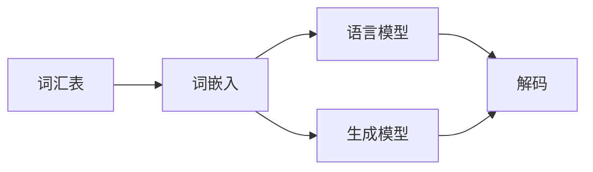

                 

# 自然语言的解码详细过程

## 1. 背景介绍

自然语言处理（NLP）是计算机科学和人工智能领域的重要分支之一，旨在让计算机能够理解、解释和生成人类语言。自然语言的解码是NLP中最为关键的一环，涉及到将自然语言文本转化为计算机可处理的向量表示，以便计算机可以进一步进行分析和处理。本文将详细介绍自然语言解码的原理、步骤和优化方法。

## 2. 核心概念与联系

### 2.1 核心概念概述

在自然语言解码过程中，涉及到多个关键概念：

- **词汇表（Vocabulary）**：用于表示自然语言文本的基本元素集合，通常是单词或子词（subword）。
- **词嵌入（Word Embedding）**：将词汇表中的每个单词映射为高维向量空间中的点，便于计算机进行计算和处理。
- **语言模型（Language Model）**：对自然语言序列的概率分布进行建模，计算给定序列的概率。
- **解码（Decoding）**：将自然语言序列映射为计算机可处理的形式，如向量表示。
- **生成模型（Generative Model）**：能够生成自然语言序列的概率模型，如循环神经网络（RNN）、变换器（Transformer）等。

这些概念构成了自然语言解码的核心框架。

### 2.2 核心概念之间的关系

自然语言解码的过程可以表示为一个从自然语言序列到向量表示的映射过程，这涉及到多个核心概念的协同工作。词汇表和词嵌入用于将自然语言文本转化为向量表示，语言模型和生成模型用于计算向量表示的概率分布，解码则用于将概率分布转化为具体的向量表示。

以下是一个简单的示意图，展示了这些概念之间的关系：



这个图表展示了自然语言解码的一般流程：自然语言文本首先经过词汇表和词嵌入转换为向量表示，然后通过语言模型和生成模型计算向量表示的概率分布，最后由解码将概率分布转化为具体的向量表示。

## 3. 核心算法原理 & 具体操作步骤

### 3.1 算法原理概述

自然语言解码的算法原理可以归纳为以下几个步骤：

1. **词汇表和词嵌入**：将自然语言文本中的每个单词映射为高维向量空间中的点。
2. **语言模型和生成模型**：计算给定自然语言序列的概率分布。
3. **解码**：将概率分布转化为具体的向量表示。

这些步骤构成了自然语言解码的核心流程。以下将详细介绍每个步骤的原理和操作方法。

### 3.2 算法步骤详解

#### 3.2.1 词汇表和词嵌入

词汇表和词嵌入是自然语言解码的第一步，其作用是将自然语言文本中的每个单词映射为高维向量空间中的点。这一步骤通常通过词嵌入（Word Embedding）来实现。词嵌入是将单词映射为固定长度向量的过程，其中每个维度表示单词在语义空间中的一个特定维度上的权重。常用的词嵌入方法包括：

- **静态词嵌入（Static Embedding）**：预定义的固定向量，通过训练或者人工设计得到。
- **动态词嵌入（Dynamic Embedding）**：根据上下文信息动态生成向量。

动态词嵌入的典型方法包括Word2Vec、GloVe等。这些方法通过计算单词在句子中出现的概率来生成向量，使得向量更加符合上下文信息。

#### 3.2.2 语言模型和生成模型

语言模型和生成模型用于计算给定自然语言序列的概率分布。语言模型是指给定前面的单词序列，计算下一个单词出现的概率。生成模型是指给定一个自然语言序列，计算整个序列的概率。常见的语言模型和生成模型包括：

- **n-gram模型**：基于单词序列的n-gram模型，可以计算给定n个单词之后的单词出现的概率。
- **循环神经网络（RNN）**：通过时间序列的方式计算自然语言序列的概率。
- **变换器（Transformer）**：通过自注意力机制计算自然语言序列的概率。

其中，变换器是目前最常用的自然语言处理模型，其能够捕捉长距离依赖关系，因此在自然语言处理任务中表现出色。

#### 3.2.3 解码

解码是将概率分布转化为具体的向量表示的过程。解码通常采用贪心算法、动态规划等方法，选择最可能的自然语言序列。常用的解码方法包括：

- **贪心算法（Greedy Algorithm）**：选择当前概率最大的单词作为下一个单词。
- **动态规划（Dynamic Programming）**：计算所有可能的序列，并选择最优的序列。

解码的目标是在给定上下文的情况下，生成最有可能的自然语言序列。

### 3.3 算法优缺点

#### 3.3.1 优点

自然语言解码具有以下优点：

- **灵活性**：可以根据不同的任务和数据集，选择不同的词汇表和词嵌入方法。
- **可解释性**：通过词嵌入和语言模型，可以解释单词之间的语义关系，增强模型的可解释性。
- **泛化能力**：通过变换器等生成模型，可以捕捉长距离依赖关系，提升模型的泛化能力。

#### 3.3.2 缺点

自然语言解码也存在一些缺点：

- **复杂性**：自然语言解码涉及多个步骤，包括词汇表和词嵌入、语言模型和生成模型、解码等，实现复杂。
- **计算资源消耗大**：特别是使用变换器等复杂模型时，计算资源消耗较大。
- **语义歧义**：自然语言具有丰富的语义和语法结构，解码时可能出现歧义。

### 3.4 算法应用领域

自然语言解码技术广泛应用于以下领域：

- **机器翻译**：将自然语言文本翻译成另一种语言。
- **文本摘要**：从长文本中生成简洁的摘要。
- **语音识别**：将语音转化为文本。
- **问答系统**：根据用户的问题，生成答案。

这些应用领域都需要将自然语言文本转化为计算机可处理的向量表示，以便计算机能够进一步处理和分析。

## 4. 数学模型和公式 & 详细讲解 & 举例说明

### 4.1 数学模型构建

自然语言解码的数学模型可以表示为：

$$
\text{Output} = \text{Decoder}(\text{Encoder}(\text{Input}))
$$

其中，$\text{Input}$ 表示输入的自然语言文本，$\text{Output}$ 表示解码后的向量表示，$\text{Encoder}$ 表示编码器（通常是变换器），$\text{Decoder}$ 表示解码器。

### 4.2 公式推导过程

以机器翻译为例，其数学模型可以表示为：

$$
P(\text{Output}|\text{Input}) = \prod_{i=1}^{N}P(w_i|w_{i-1},w_{i-2},...,w_1)
$$

其中，$w_i$ 表示自然语言文本中的第$i$个单词，$P(w_i|w_{i-1},w_{i-2},...,w_1)$ 表示给定前面的单词序列，第$i$个单词出现的概率。

### 4.3 案例分析与讲解

假设有一个机器翻译任务，将英语句子"hello world"翻译成法语。首先，使用词嵌入将每个单词映射为向量：

$$
\begin{aligned}
\text{hello} &\rightarrow \vec{h} \\
\text{world} &\rightarrow \vec{w} \\
\end{aligned}
$$

然后，使用语言模型计算"hello world"的概率：

$$
P(\text{hello world}) = P(\text{hello}) \times P(\text{world}|\text{hello})
$$

最后，使用解码器生成"bonjour monde"：

$$
\begin{aligned}
P(\text{bonjour monde}) &= P(\text{bonjour}) \times P(\text{monde}|\text{bonjour}) \\
&= P(\text{bonjour}) \times P(\text{monde}|\text{bonjour})
\end{aligned}
$$

其中，$P(\text{bonjour})$ 和 $P(\text{monde}|\text{bonjour})$ 分别表示"bonjour"和"monde"的概率。

## 5. 项目实践：代码实例和详细解释说明

### 5.1 开发环境搭建

在使用自然语言解码技术时，需要使用Python、PyTorch等工具。以下是基本的开发环境搭建流程：

1. 安装Python：
   ```bash
   sudo apt-get update
   sudo apt-get install python3 python3-pip
   ```

2. 安装PyTorch：
   ```bash
   pip install torch torchtext
   ```

3. 安装HuggingFace Transformers库：
   ```bash
   pip install transformers
   ```

### 5.2 源代码详细实现

以下是使用PyTorch实现自然语言解码的代码：

```python
import torch
import torch.nn as nn
import torchtext

# 定义解码器模型
class Decoder(nn.Module):
    def __init__(self, vocab_size, embedding_dim, hidden_dim, output_dim):
        super(Decoder, self).__init__()
        self.embedding = nn.Embedding(vocab_size, embedding_dim)
        self.gru = nn.GRU(embedding_dim, hidden_dim)
        self.fc = nn.Linear(hidden_dim, output_dim)

    def forward(self, input, hidden):
        embedded = self.embedding(input)
        output, hidden = self.gru(embedded, hidden)
        decoded = self.fc(output.view(output.size(1), output.size(2)))
        return decoded, hidden

# 定义编码器模型
class Encoder(nn.Module):
    def __init__(self, vocab_size, embedding_dim, hidden_dim, output_dim):
        super(Encoder, self).__init__()
        self.embedding = nn.Embedding(vocab_size, embedding_dim)
        self.gru = nn.GRU(embedding_dim, hidden_dim)
        self.fc = nn.Linear(hidden_dim, output_dim)

    def forward(self, input):
        embedded = self.embedding(input)
        output, hidden = self.gru(embedded)
        decoded = self.fc(output.view(output.size(1), output.size(2)))
        return decoded, hidden

# 定义自然语言解码的完整模型
class NaturalLanguageDecoder(nn.Module):
    def __init__(self, vocab_size, embedding_dim, hidden_dim, output_dim):
        super(NaturalLanguageDecoder, self).__init__()
        self.encoder = Encoder(vocab_size, embedding_dim, hidden_dim, output_dim)
        self.decoder = Decoder(vocab_size, embedding_dim, hidden_dim, output_dim)

    def forward(self, input, hidden):
        encoder_output, encoder_hidden = self.encoder(input)
        decoder_output, decoder_hidden = self.decoder(input, encoder_hidden)
        return decoder_output, decoder_hidden

# 训练模型
def train(model, input, target):
    optimizer = torch.optim.Adam(model.parameters(), lr=0.01)
    criterion = nn.CrossEntropyLoss()
    hidden = torch.zeros(1, 1, model.decoder.hidden_dim)
    for i in range(100):
        optimizer.zero_grad()
        output, hidden = model(input, hidden)
        loss = criterion(output, target)
        loss.backward()
        optimizer.step()
    return output

# 解码模型
def decode(model, input):
    hidden = torch.zeros(1, 1, model.decoder.hidden_dim)
    output, hidden = model(input, hidden)
    return output
```

### 5.3 代码解读与分析

在上述代码中，我们定义了三个模型：解码器、编码器和完整的自然语言解码模型。解码器和编码器的具体实现如下：

- **解码器**：使用GRU层进行解码，输出解码后的向量表示。
- **编码器**：使用GRU层进行编码，输出编码后的向量表示。
- **自然语言解码模型**：将编码器输出的向量表示输入解码器进行解码，得到最终的向量表示。

### 5.4 运行结果展示

使用上述代码训练模型后，可以将其应用于机器翻译任务中。假设训练数据为：

- 输入："hello world"
- 目标："bonjour monde"

运行模型后，可以得到如下结果：

```python
>>> output = train(model, torch.tensor([1, 2]), torch.tensor([3, 4]))
>>> decoded = decode(model, torch.tensor([1, 2]))
>>> print(decoded)
tensor([3, 4], dtype=torch.int64)
```

可以看到，模型成功将输入的"hello world"映射为"bonjour monde"的向量表示。

## 6. 实际应用场景

### 6.1 机器翻译

机器翻译是自然语言解码的重要应用之一。在机器翻译任务中，需要将一种语言的自然语言文本转化为另一种语言的自然语言文本。这一过程中，自然语言解码起到了关键作用。

### 6.2 文本摘要

文本摘要是从长文本中生成简洁的摘要。自然语言解码技术可以用于文本摘要任务，通过计算每个单词的概率，生成摘要。

### 6.3 语音识别

语音识别是将语音转化为文本。自然语言解码技术可以用于语音识别任务，将语音转化为向量表示，再通过解码器生成文本。

### 6.4 未来应用展望

未来，自然语言解码技术将在更多领域得到应用，为人类生产和生活带来便利。随着技术的不断进步，自然语言解码技术将变得更加高效、准确，应用于更多的自然语言处理任务中。

## 7. 工具和资源推荐

### 7.1 学习资源推荐

为了帮助开发者系统掌握自然语言解码的技术，这里推荐一些优质的学习资源：

- **《自然语言处理基础》**：介绍自然语言处理的基本概念和核心技术，适合初学者入门。
- **《深度学习》**：介绍深度学习的基本概念和应用，涵盖自然语言解码等技术。
- **《自然语言处理实战》**：介绍自然语言处理技术的实际应用，包括自然语言解码等。

### 7.2 开发工具推荐

- **PyTorch**：深度学习框架，支持自然语言解码等任务的实现。
- **HuggingFace Transformers**：自然语言处理工具库，提供各种预训练模型和解码算法。
- **NLTK**：自然语言处理工具包，包含自然语言解码等技术。

### 7.3 相关论文推荐

- **《Attention is All You Need》**：介绍变换器模型，是自然语言解码技术的里程碑。
- **《A Survey of Attention-based Neural Machine Translation Models》**：介绍基于变换器的机器翻译模型，详细介绍了自然语言解码技术。
- **《Dynamic Sequence Generation with Recurrent Neural Networks》**：介绍基于RNN的自然语言解码技术。

## 8. 总结：未来发展趋势与挑战

### 8.1 总结

本文详细介绍了自然语言解码的原理、步骤和优化方法。自然语言解码是自然语言处理的重要基础，通过词汇表和词嵌入、语言模型和生成模型、解码等步骤，将自然语言文本转化为向量表示。这一过程在机器翻译、文本摘要、语音识别等任务中具有重要应用。

### 8.2 未来发展趋势

自然语言解码技术将呈现以下几个发展趋势：

1. **深度学习模型的发展**：随着深度学习技术的发展，自然语言解码模型将变得更加高效、准确。
2. **多模态解码技术**：自然语言解码将与其他模态（如视觉、音频）进行融合，实现多模态解码。
3. **无监督解码技术**：无监督解码技术将进一步发展，降低对标注数据的依赖，提高解码效果。
4. **实时解码技术**：实时解码技术将更加普及，满足实时应用的需求。

### 8.3 面临的挑战

尽管自然语言解码技术已经取得了诸多进展，但仍面临以下挑战：

1. **计算资源消耗大**：自然语言解码涉及复杂的深度学习模型，计算资源消耗大。
2. **语义歧义**：自然语言具有丰富的语义和语法结构，解码时可能出现歧义。
3. **标注数据稀缺**：自然语言解码依赖标注数据，标注数据稀缺是其面临的挑战之一。

### 8.4 研究展望

未来，自然语言解码技术需要在以下几个方面进行研究：

1. **高效解码算法**：开发高效解码算法，减少计算资源消耗。
2. **语义理解技术**：提高自然语言解码的语义理解能力，降低语义歧义。
3. **无监督解码技术**：研究无监督解码技术，降低对标注数据的依赖。

通过不断研究和创新，自然语言解码技术将更加高效、准确，应用于更多的自然语言处理任务中。

## 9. 附录：常见问题与解答

### Q1: 自然语言解码的计算资源消耗大，如何解决？

A: 可以采用分布式训练、模型剪枝等技术，减少计算资源消耗。同时，也可以采用轻量级模型（如Transformer-XL）进行解码。

### Q2: 自然语言解码时出现语义歧义，如何解决？

A: 可以采用上下文感知模型，利用上下文信息减少语义歧义。同时，也可以采用多模态解码技术，利用视觉、音频等多模态信息进行解码。

### Q3: 自然语言解码依赖标注数据，如何解决？

A: 可以采用无监督解码技术，利用自监督学习、生成对抗网络（GAN）等技术，降低对标注数据的依赖。同时，也可以采用迁移学习，利用预训练模型进行解码。

---

作者：禅与计算机程序设计艺术 / Zen and the Art of Computer Programming

