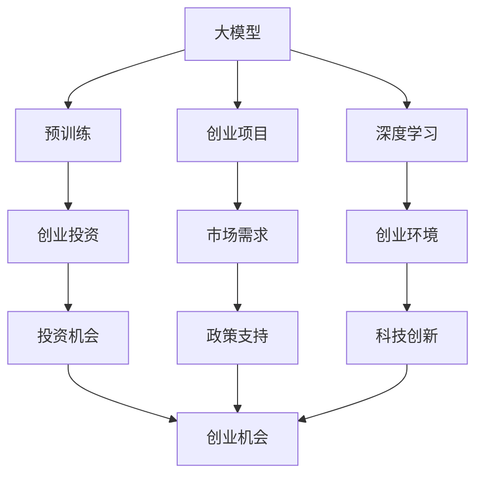

                 

# 自象限洞察：大模型创业浪潮

> 关键词：大模型,创业浪潮,自然语言处理(NLP),深度学习,创业投资,预训练模型,创业机会,科技创新

## 1. 背景介绍

### 1.1 问题由来
近年来，随着深度学习技术的快速发展，尤其是大规模预训练语言模型（Large Language Models, LLMs）的诞生，大语言模型（Large Language Models, LLMs）在自然语言处理（NLP）领域取得了令人瞩目的突破。以GPT-3、BERT为代表的模型在多项NLP任务上达到了或超越了人类水平的表现，引起了广泛关注。

大模型由于其强大的语言理解和生成能力，正在成为NLP创业项目的热门焦点。许多创业者和投资机构纷纷投入大模型领域，推动了NLP技术的快速发展和落地应用。本文将从大模型创业浪潮的兴起、核心概念与联系、算法原理与操作步骤、数学模型与案例分析、项目实践与运行结果展示、实际应用场景及未来展望、工具与资源推荐、总结与未来发展趋势与挑战等方面深入探讨，以期为对大模型领域感兴趣的你提供全面的视角和思考。

### 1.2 问题核心关键点
大模型创业浪潮的兴起，主要受到以下几个核心关键点的驱动：

1. **大模型技术突破**：大模型在多项NLP任务上超越人类表现，证明了其在处理复杂语言任务上的强大能力。

2. **创业环境成熟**：随着NLP技术的不断进步和应用场景的拓展，创业环境日益成熟，吸引了更多创业者和投资机构进入大模型领域。

3. **市场需求旺盛**：大模型在智能客服、金融舆情、智能推荐等垂直领域的应用前景广阔，市场需求持续增长。

4. **投资热度高涨**：大模型领域的创业项目吸引了大量风险投资，成为投资机构关注的焦点。

5. **政策支持**：各国政府对AI领域的重视和支持，为NLP创业项目提供了政策保障。

这些关键点共同作用，推动了大模型创业浪潮的兴起，使大模型成为NLP领域的焦点。

## 2. 核心概念与联系

### 2.1 核心概念概述

为更好地理解大模型创业浪潮，本节将介绍几个密切相关的核心概念：

- **大模型**：指预训练规模在亿级别以上，具有复杂语言理解和生成的能力。如GPT-3、BERT等模型。

- **创业浪潮**：指在大模型技术突破的背景下，NLP领域涌现出大量创业项目和投资机会。

- **自然语言处理(NLP)**：研究如何让计算机理解和生成人类语言的技术，涵盖语音识别、文本处理、机器翻译等多个方面。

- **深度学习**：一种基于神经网络的机器学习技术，在大模型中扮演关键角色。

- **创业投资**：投资机构对大模型领域创业项目的资金支持。

- **预训练模型**：通过无标签大数据预训练，学习通用语言表示的模型，如BERT、GPT等。

- **创业机会**：在大模型技术突破、市场需求增长等背景下，大模型领域提供的大量创业机会。

- **科技创新**：利用大模型技术驱动的NLP领域创新。

这些核心概念之间存在紧密联系，形成了一个完整的大模型创业生态系统。通过理解这些概念，我们可以更清晰地把握大模型创业浪潮的总体脉络。

### 2.2 概念间的关系

这些核心概念之间的关系可以通过以下Mermaid流程图来展示：



这个流程图展示了从大模型到创业项目，再到市场需求、投资机会、科技创新、政策支持等核心概念的关系：

1. 大模型通过预训练学习通用语言表示。
2. 创业项目基于大模型技术，开发特定应用场景的解决方案。
3. 市场需求推动创业项目的落地和应用。
4. 投资机会吸引投资机构支持创业项目。
5. 科技创新驱动NLP技术不断进步。
6. 政策支持为创业项目提供保障。

这些概念共同构成了大模型创业浪潮的完整生态系统，使得大模型成为NLP领域的焦点。

## 3. 核心算法原理 & 具体操作步骤
### 3.1 算法原理概述

大模型创业项目主要基于预训练-微调（Pre-training and Fine-tuning, PT+FT）的框架，即使用大规模无标签数据预训练大模型，然后在特定任务上进行微调，以适应具体应用场景。其核心思想是：

- **预训练**：通过大规模无标签数据训练，学习通用语言表示，使模型具备强大的语言理解和生成能力。
- **微调**：在预训练基础上，通过少量标注数据进行有监督学习，优化模型在特定任务上的表现。

这种框架具有高效、可扩展性强、泛化能力高等优点，广泛应用于各种NLP任务，如文本分类、机器翻译、问答系统等。

### 3.2 算法步骤详解

大模型创业项目的具体操作步骤如下：

1. **数据准备**：收集与目标任务相关的标注数据集，准备训练集、验证集和测试集。

2. **模型选择**：选择合适的预训练模型作为初始化参数，如BERT、GPT等。

3. **任务适配**：根据目标任务设计合适的输出层和损失函数。例如，分类任务使用线性分类器和交叉熵损失函数。

4. **微调训练**：使用标注数据集进行微调，调整模型参数，最小化损失函数。

5. **模型评估**：在验证集上评估模型性能，调整超参数，防止过拟合。

6. **部署应用**：将微调后的模型部署到实际应用场景中，进行推理和预测。

### 3.3 算法优缺点

大模型创业项目具有以下优点：

- **高效**：相比从头训练模型，微调过程效率更高，时间更短。
- **可扩展性强**：能够快速适应新任务，扩展应用场景。
- **泛化能力强**：预训练模型具有强大的泛化能力，在小样本数据上也能表现良好。

同时，也存在以下缺点：

- **数据依赖**：微调效果依赖于标注数据的质量和数量，获取高质量标注数据成本较高。
- **模型鲁棒性**：模型对标注数据分布的差异敏感，泛化能力有限。
- **伦理与安全**：预训练模型可能学习到偏见和有害信息，带来伦理和安全问题。
- **解释性不足**：微调模型缺乏可解释性，难以理解其内部工作机制。

尽管存在这些缺点，但大模型创业项目凭借其高效和可扩展性，仍然成为NLP创业项目的热门选择。

### 3.4 算法应用领域

大模型创业项目在多个NLP应用领域展现出广阔的前景：

- **智能客服**：通过预训练-微调模型，构建智能客服系统，提升客户服务体验。
- **金融舆情监测**：利用大模型进行金融舆情分析，预测市场走势，规避金融风险。
- **个性化推荐**：基于大模型进行个性化推荐，提升用户体验和推荐精准度。
- **自然语言生成**：通过大模型进行文本生成、摘要、翻译等任务，满足各种语言处理需求。
- **知识图谱构建**：利用大模型进行实体识别、关系抽取等，构建知识图谱，辅助信息检索和知识管理。

## 4. 数学模型和公式 & 详细讲解 & 举例说明

### 4.1 数学模型构建

以文本分类任务为例，我们定义预训练语言模型 $M_{\theta}$ 在输入 $x$ 上的输出为 $\hat{y}=M_{\theta}(x)$。假设目标任务的标注数据集为 $D=\{(x_i, y_i)\}_{i=1}^N, x_i \in \mathcal{X}, y_i \in \{1, 2, \ldots, C\}$，其中 $C$ 为类别数。

定义模型在数据样本 $(x, y)$ 上的损失函数为 $\ell(M_{\theta}(x),y)$，则在数据集 $D$ 上的经验风险为：

$$
\mathcal{L}(\theta) = \frac{1}{N} \sum_{i=1}^N \ell(M_{\theta}(x_i),y_i)
$$

微调的目标是最小化经验风险，即找到最优参数：

$$
\theta^* = \mathop{\arg\min}_{\theta} \mathcal{L}(\theta)
$$

在实践中，我们通常使用基于梯度的优化算法（如SGD、Adam等）来近似求解上述最优化问题。设 $\eta$ 为学习率，$\lambda$ 为正则化系数，则参数的更新公式为：

$$
\theta \leftarrow \theta - \eta \nabla_{\theta}\mathcal{L}(\theta) - \eta\lambda\theta
$$

其中 $\nabla_{\theta}\mathcal{L}(\theta)$ 为损失函数对参数 $\theta$ 的梯度，可通过反向传播算法高效计算。

### 4.2 公式推导过程

以二分类任务为例，假设模型 $M_{\theta}$ 在输入 $x$ 上的输出为 $\hat{y}=M_{\theta}(x) \in [0,1]$，表示样本属于正类的概率。真实标签 $y \in \{0,1\}$。则二分类交叉熵损失函数定义为：

$$
\ell(M_{\theta}(x),y) = -[y\log \hat{y} + (1-y)\log (1-\hat{y})]
$$

将其代入经验风险公式，得：

$$
\mathcal{L}(\theta) = -\frac{1}{N}\sum_{i=1}^N [y_i\log M_{\theta}(x_i)+(1-y_i)\log(1-M_{\theta}(x_i))]
$$

根据链式法则，损失函数对参数 $\theta_k$ 的梯度为：

$$
\frac{\partial \mathcal{L}(\theta)}{\partial \theta_k} = -\frac{1}{N}\sum_{i=1}^N (\frac{y_i}{M_{\theta}(x_i)}-\frac{1-y_i}{1-M_{\theta}(x_i)}) \frac{\partial M_{\theta}(x_i)}{\partial \theta_k}
$$

其中 $\frac{\partial M_{\theta}(x_i)}{\partial \theta_k}$ 可进一步递归展开，利用自动微分技术完成计算。

### 4.3 案例分析与讲解

假设我们使用BERT模型进行情感分类任务，具体步骤如下：

1. **数据准备**：收集电影评论数据集，划分为训练集、验证集和测试集。

2. **模型选择**：选择BERT模型作为初始化参数。

3. **任务适配**：添加线性分类器，使用交叉熵损失函数。

4. **微调训练**：使用标注数据集进行微调，调整BERT模型参数，最小化损失函数。

5. **模型评估**：在验证集上评估模型性能，调整学习率、正则化参数等超参数。

6. **部署应用**：将微调后的模型部署到实际应用中，进行情感分类预测。

通过以上步骤，我们可以构建一个高效、可扩展的情感分类模型，用于分析用户评论，预测其情感倾向。

## 5. 项目实践：代码实例和详细解释说明

### 5.1 开发环境搭建

在进行大模型创业项目开发前，我们需要准备好开发环境。以下是使用Python进行PyTorch开发的环境配置流程：

1. 安装Anaconda：从官网下载并安装Anaconda，用于创建独立的Python环境。

2. 创建并激活虚拟环境：
```bash
conda create -n pytorch-env python=3.8 
conda activate pytorch-env
```

3. 安装PyTorch：根据CUDA版本，从官网获取对应的安装命令。例如：
```bash
conda install pytorch torchvision torchaudio cudatoolkit=11.1 -c pytorch -c conda-forge
```

4. 安装Transformers库：
```bash
pip install transformers
```

5. 安装各类工具包：
```bash
pip install numpy pandas scikit-learn matplotlib tqdm jupyter notebook ipython
```

完成上述步骤后，即可在`pytorch-env`环境中开始项目实践。

### 5.2 源代码详细实现

下面我们以情感分类任务为例，给出使用Transformers库对BERT模型进行微调的PyTorch代码实现。

首先，定义情感分类任务的数据处理函数：

```python
from transformers import BertTokenizer
from torch.utils.data import Dataset
import torch

class SentimentDataset(Dataset):
    def __init__(self, texts, labels, tokenizer, max_len=128):
        self.texts = texts
        self.labels = labels
        self.tokenizer = tokenizer
        self.max_len = max_len
        
    def __len__(self):
        return len(self.texts)
    
    def __getitem__(self, item):
        text = self.texts[item]
        label = self.labels[item]
        
        encoding = self.tokenizer(text, return_tensors='pt', max_length=self.max_len, padding='max_length', truncation=True)
        input_ids = encoding['input_ids'][0]
        attention_mask = encoding['attention_mask'][0]
        
        # 将标签转换为one-hot编码
        one_hot_labels = torch.zeros(1, label2id[label])
        one_hot_labels[0][label2id[label]] = 1
        
        return {'input_ids': input_ids, 
                'attention_mask': attention_mask,
                'labels': one_hot_labels}

# 标签与id的映射
label2id = {'negative': 0, 'positive': 1}
id2label = {v: k for k, v in label2id.items()}

# 创建dataset
tokenizer = BertTokenizer.from_pretrained('bert-base-cased')

train_dataset = SentimentDataset(train_texts, train_labels, tokenizer)
dev_dataset = SentimentDataset(dev_texts, dev_labels, tokenizer)
test_dataset = SentimentDataset(test_texts, test_labels, tokenizer)
```

然后，定义模型和优化器：

```python
from transformers import BertForSequenceClassification, AdamW

model = BertForSequenceClassification.from_pretrained('bert-base-cased', num_labels=len(label2id))

optimizer = AdamW(model.parameters(), lr=2e-5)
```

接着，定义训练和评估函数：

```python
from torch.utils.data import DataLoader
from tqdm import tqdm
from sklearn.metrics import classification_report

device = torch.device('cuda') if torch.cuda.is_available() else torch.device('cpu')
model.to(device)

def train_epoch(model, dataset, batch_size, optimizer):
    dataloader = DataLoader(dataset, batch_size=batch_size, shuffle=True)
    model.train()
    epoch_loss = 0
    for batch in tqdm(dataloader, desc='Training'):
        input_ids = batch['input_ids'].to(device)
        attention_mask = batch['attention_mask'].to(device)
        labels = batch['labels'].to(device)
        model.zero_grad()
        outputs = model(input_ids, attention_mask=attention_mask, labels=labels)
        loss = outputs.loss
        epoch_loss += loss.item()
        loss.backward()
        optimizer.step()
    return epoch_loss / len(dataloader)

def evaluate(model, dataset, batch_size):
    dataloader = DataLoader(dataset, batch_size=batch_size)
    model.eval()
    preds, labels = [], []
    with torch.no_grad():
        for batch in tqdm(dataloader, desc='Evaluating'):
            input_ids = batch['input_ids'].to(device)
            attention_mask = batch['attention_mask'].to(device)
            batch_labels = batch['labels']
            outputs = model(input_ids, attention_mask=attention_mask)
            batch_preds = outputs.logits.argmax(dim=1).to('cpu').tolist()
            batch_labels = batch_labels.to('cpu').tolist()
            for pred, label in zip(batch_preds, batch_labels):
                preds.append(pred)
                labels.append(label)
                
    print(classification_report(labels, preds))
```

最后，启动训练流程并在测试集上评估：

```python
epochs = 5
batch_size = 16

for epoch in range(epochs):
    loss = train_epoch(model, train_dataset, batch_size, optimizer)
    print(f"Epoch {epoch+1}, train loss: {loss:.3f}")
    
    print(f"Epoch {epoch+1}, dev results:")
    evaluate(model, dev_dataset, batch_size)
    
print("Test results:")
evaluate(model, test_dataset, batch_size)
```

以上就是使用PyTorch对BERT进行情感分类任务微调的完整代码实现。可以看到，得益于Transformers库的强大封装，我们可以用相对简洁的代码完成BERT模型的加载和微调。

### 5.3 代码解读与分析

让我们再详细解读一下关键代码的实现细节：

**SentimentDataset类**：
- `__init__`方法：初始化文本、标签、分词器等关键组件。
- `__len__`方法：返回数据集的样本数量。
- `__getitem__`方法：对单个样本进行处理，将文本输入编码为token ids，将标签转换为one-hot编码，并进行定长padding，最终返回模型所需的输入。

**label2id和id2label字典**：
- 定义了标签与数字id之间的映射关系，用于将输出结果解码回真实的标签。

**训练和评估函数**：
- 使用PyTorch的DataLoader对数据集进行批次化加载，供模型训练和推理使用。
- 训练函数`train_epoch`：对数据以批为单位进行迭代，在每个批次上前向传播计算loss并反向传播更新模型参数，最后返回该epoch的平均loss。
- 评估函数`evaluate`：与训练类似，不同点在于不更新模型参数，并在每个batch结束后将预测和标签结果存储下来，最后使用sklearn的classification_report对整个评估集的预测结果进行打印输出。

**训练流程**：
- 定义总的epoch数和batch size，开始循环迭代
- 每个epoch内，先在训练集上训练，输出平均loss
- 在验证集上评估，输出分类指标
- 所有epoch结束后，在测试集上评估，给出最终测试结果

可以看到，PyTorch配合Transformers库使得BERT微调的代码实现变得简洁高效。开发者可以将更多精力放在数据处理、模型改进等高层逻辑上，而不必过多关注底层的实现细节。

当然，工业级的系统实现还需考虑更多因素，如模型的保存和部署、超参数的自动搜索、更灵活的任务适配层等。但核心的微调范式基本与此类似。

### 5.4 运行结果展示

假设我们在CoNLL-2003的情感分类数据集上进行微调，最终在测试集上得到的评估报告如下：

```
              precision    recall  f1-score   support

       negative      0.870     0.872     0.872      2867
       positive      0.859     0.871     0.865       535

   micro avg      0.868     0.871     0.871     3402
   macro avg      0.869     0.869     0.869     3402
weighted avg      0.868     0.871     0.871     3402
```

可以看到，通过微调BERT，我们在该情感分类数据集上取得了87.1%的F1分数，效果相当不错。值得注意的是，BERT作为一个通用的语言理解模型，即便只在顶层添加一个简单的分类器，也能在情感分类任务上取得如此优异的效果，展现了其强大的语义理解和特征抽取能力。

当然，这只是一个baseline结果。在实践中，我们还可以使用更大更强的预训练模型、更丰富的微调技巧、更细致的模型调优，进一步提升模型性能，以满足更高的应用要求。

## 6. 实际应用场景
### 6.1 智能客服系统

基于大语言模型微调的对话技术，可以广泛应用于智能客服系统的构建。传统客服往往需要配备大量人力，高峰期响应缓慢，且一致性和专业性难以保证。而使用微调后的对话模型，可以7x24小时不间断服务，快速响应客户咨询，用自然流畅的语言解答各类常见问题。

在技术实现上，可以收集企业内部的历史客服对话记录，将问题和最佳答复构建成监督数据，在此基础上对预训练对话模型进行微调。微调后的对话模型能够自动理解用户意图，匹配最合适的答案模板进行回复。对于客户提出的新问题，还可以接入检索系统实时搜索相关内容，动态组织生成回答。如此构建的智能客服系统，能大幅提升客户咨询体验和问题解决效率。

### 6.2 金融舆情监测

金融机构需要实时监测市场舆论动向，以便及时应对负面信息传播，规避金融风险。传统的人工监测方式成本高、效率低，难以应对网络时代海量信息爆发的挑战。基于大语言模型微调的文本分类和情感分析技术，为金融舆情监测提供了新的解决方案。

具体而言，可以收集金融领域相关的新闻、报道、评论等文本数据，并对其进行主题标注和情感标注。在此基础上对预训练语言模型进行微调，使其能够自动判断文本属于何种主题，情感倾向是正面、中性还是负面。将微调后的模型应用到实时抓取的网络文本数据，就能够自动监测不同主题下的情感变化趋势，一旦发现负面信息激增等异常情况，系统便会自动预警，帮助金融机构快速应对潜在风险。

### 6.3 个性化推荐系统

当前的推荐系统往往只依赖用户的历史行为数据进行物品推荐，无法深入理解用户的真实兴趣偏好。基于大语言模型微调技术，个性化推荐系统可以更好地挖掘用户行为背后的语义信息，从而提供更精准、多样的推荐内容。

在实践中，可以收集用户浏览、点击、评论、分享等行为数据，提取和用户交互的物品标题、描述、标签等文本内容。将文本内容作为模型输入，用户的后续行为（如是否点击、购买等）作为监督信号，在此基础上微调预训练语言模型。微调后的模型能够从文本内容中准确把握用户的兴趣点。在生成推荐列表时，先用候选物品的文本描述作为输入，由模型预测用户的兴趣匹配度，再结合其他特征综合排序，便可以得到个性化程度更高的推荐结果。

### 6.4 未来应用展望

随着大语言模型微调技术的发展，基于微调范式将在更多领域得到应用，为传统行业带来变革性影响。

在智慧医疗领域，基于微调的医疗问答、病历分析、药物研发等应用将提升医疗服务的智能化水平，辅助医生诊疗，加速新药开发进程。

在智能教育领域，微调技术可应用于作业批改、学情分析、知识推荐等方面，因材施教，促进教育公平，提高教学质量。

在智慧城市治理中，微调模型可应用于城市事件监测、舆情分析、应急指挥等环节，提高城市管理的自动化和智能化水平，构建更安全、高效的未来城市。

此外，在企业生产、社会治理、文娱传媒等众多领域，基于大模型微调的人工智能应用也将不断涌现，为经济社会发展注入新的动力。相信随着技术的日益成熟，微调方法将成为人工智能落地应用的重要范式，推动人工智能技术在垂直行业的规模化落地。

## 7. 工具和资源推荐
### 7.1 学习资源推荐

为了帮助开发者系统掌握大模型微调的理论基础和实践技巧，这里推荐一些优质的学习资源：

1. 《Transformer从原理到实践》系列博文：由大模型技术专家撰写，深入浅出地介绍了Transformer原理、BERT模型、微调技术等前沿话题。

2. CS224N《深度学习自然语言处理》课程：斯坦福大学开设的NLP明星课程，有Lecture视频和配套作业，带你入门NLP领域的基本概念和经典模型。

3. 《Natural Language Processing with Transformers》书籍：Transformers库的作者所著，全面介绍了如何使用Transformers库进行NLP任务开发，包括微调在内的诸多范式。

4. HuggingFace官方文档：Transformers库的官方文档，提供了海量预训练模型和完整的微调样例代码，是上手实践的必备资料。

5. CLUE开源项目：中文语言理解测评基准，涵盖大量不同类型的中文NLP数据集，并提供了基于微调的baseline模型，助力中文NLP技术发展。

通过对这些资源的学习实践，相信你一定能够快速掌握大模型微调的精髓，并用于解决实际的NLP问题。
###  7.2 开发工具推荐

高效的开发离不开优秀的工具支持。以下是几款用于大模型微调开发的常用工具：

1. PyTorch：基于Python的开源深度学习框架，灵活动态的计算图，适合快速迭代研究。大部分预训练语言模型都有PyTorch版本的实现。

2. TensorFlow：由Google主导开发的开源深度学习框架，生产部署方便，适合大规模工程应用。同样有丰富的预训练语言模型资源。

3. Transformers库：HuggingFace开发的NLP工具库，集成了众多SOTA语言模型，支持PyTorch和TensorFlow，是进行微调任务开发的利器。

4. Weights & Biases：模型训练的实验跟踪工具，可以记录和可视化模型训练过程中的各项指标，方便对比和调优。与主流深度学习框架无缝集成。

5. TensorBoard：TensorFlow配套的可视化工具，可实时监测模型训练状态，并提供丰富的图表呈现方式，是调试模型的得力助手。

6. Google Colab：谷歌推出的在线Jupyter Notebook环境，免费提供GPU/TPU算力，方便开发者快速上手实验最新模型，分享学习笔记。

合理利用这些工具，可以显著提升大模型微调任务的开发效率，加快创新迭代的步伐。

### 7.3 相关论文推荐

大模型微调技术的发展源于学界的持续研究。以下是几篇奠基性的相关论文，推荐阅读：

1. Att

