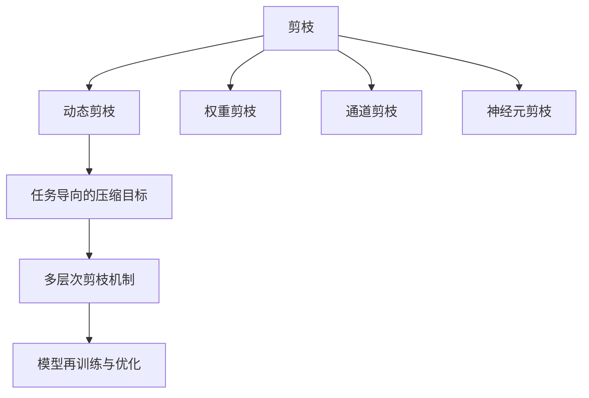
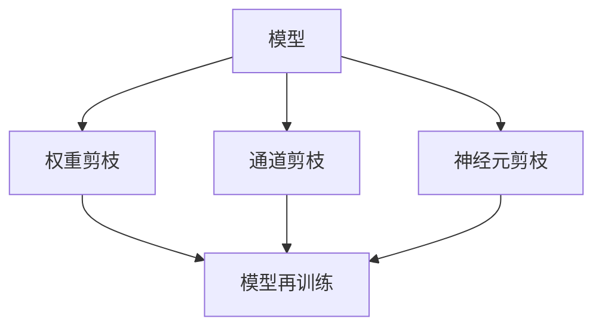

                 

# 自适应剪枝：根据任务动态调整的压缩技术

自适应剪枝技术（Adaptive Pruning）是近年来人工智能领域中新兴的一种模型压缩方法，它能够根据特定任务的特征和需求，动态调整模型的结构和参数，从而在保证模型性能的同时，显著降低模型大小和计算复杂度，提高模型推理速度和资源利用效率。本文将深入探讨自适应剪枝的核心概念、算法原理和操作步骤，并通过具体实例和数学模型，详细阐述其实现机制和应用效果，帮助读者全面理解这一前沿技术。

## 1. 背景介绍

### 1.1 问题由来

随着深度学习技术的发展，大规模神经网络模型在图像识别、自然语言处理、语音识别等众多领域取得了显著成果。然而，这些模型往往拥有数亿甚至数十亿个参数，带来了巨大的计算和存储负担。模型压缩技术因此成为推动深度学习模型大规模应用的重要手段。

模型压缩的主要方法包括量化、剪枝、蒸馏等。其中，剪枝（Pruning）技术通过删除模型中不重要的权重或神经元，减少模型参数数量，从而降低计算复杂度和内存占用。然而，传统的剪枝方法大多采用固定策略，即在模型训练之前进行一次性的剪枝，无法适应模型在训练过程中参数变化的需求。

为了解决这一问题，自适应剪枝技术应运而生。它能够在模型训练过程中，根据任务的动态特征和需求，动态调整剪枝策略，使模型能够在保证性能的同时，实现高效压缩。

### 1.2 问题核心关键点

自适应剪枝的核心在于根据任务的特征和需求，动态调整模型的结构和参数，从而在模型训练和推理过程中，实现更优的压缩效果和性能提升。其主要包括以下几个关键点：

- **动态剪枝策略**：在模型训练过程中，根据当前任务的特征和性能需求，动态调整剪枝策略，保证模型的结构和参数能够适应不同任务的要求。
- **任务导向的压缩目标**：在剪枝过程中，设定与任务相关的优化目标，如减少推理时间、降低内存占用、提升准确率等，使得压缩效果更加符合实际应用需求。
- **多层次剪枝机制**：在模型的不同层次上，应用不同的剪枝方法和策略，如权重剪枝、通道剪枝、神经元剪枝等，使模型压缩更加全面和深入。
- **模型再训练与优化**：在剪枝后，对模型进行重新训练和优化，进一步提升模型性能和压缩效果。

通过这些关键技术，自适应剪枝能够在不同任务和数据集上，实现更加精细和高效的模型压缩，为深度学习模型的大规模应用提供了有力支持。

## 2. 核心概念与联系

### 2.1 核心概念概述

自适应剪枝技术的核心概念主要包括以下几个方面：

- **剪枝（Pruning）**：删除模型中不重要的权重或神经元，减少模型参数数量，从而降低计算复杂度和内存占用。
- **动态剪枝（Adaptive Pruning）**：在模型训练过程中，根据任务的动态特征和需求，动态调整剪枝策略，使模型能够在保证性能的同时，实现高效压缩。
- **任务导向的压缩目标（Task-oriented Compression Objective）**：在剪枝过程中，设定与任务相关的优化目标，如减少推理时间、降低内存占用、提升准确率等。
- **多层次剪枝机制（Multi-layer Pruning Mechanism）**：在模型的不同层次上，应用不同的剪枝方法和策略，如权重剪枝、通道剪枝、神经元剪枝等。
- **模型再训练与优化（Retraining and Optimization）**：在剪枝后，对模型进行重新训练和优化，进一步提升模型性能和压缩效果。

这些核心概念之间存在着紧密的联系，共同构成了自适应剪枝技术的完整框架。下面，我们将通过Mermaid流程图来展示这些概念之间的联系。



这个流程图展示了自适应剪枝技术的核心概念及其之间的关系：

1. 剪枝是自适应剪枝的基础，通过删除模型中不重要的部分，减少计算复杂度和内存占用。
2. 动态剪枝根据任务的动态特征和需求，动态调整剪枝策略，使模型能够在保证性能的同时，实现高效压缩。
3. 任务导向的压缩目标设定了与任务相关的优化目标，使剪枝过程更加符合实际应用需求。
4. 多层次剪枝机制在模型的不同层次上，应用不同的剪枝方法和策略，使模型压缩更加全面和深入。
5. 模型再训练与优化在剪枝后，对模型进行重新训练和优化，进一步提升模型性能和压缩效果。

通过这些核心概念，自适应剪枝技术在模型压缩中发挥了重要作用，为深度学习模型的应用提供了重要保障。

### 2.2 概念间的关系

这些核心概念之间存在着紧密的联系，形成了自适应剪枝技术的完整生态系统。下面，我们将通过几个Mermaid流程图来展示这些概念之间的关系。

#### 2.2.1 动态剪枝与任务导向的关系


这个流程图展示了动态剪枝与任务导向的关系：

1. 动态剪枝策略根据任务特征，动态调整剪枝策略，使模型能够在保证性能的同时，实现高效压缩。
2. 任务导向的压缩目标设定了与任务相关的优化目标，如减少推理时间、降低内存占用、提升准确率等，使得剪枝过程更加符合实际应用需求。

#### 2.2.2 多层次剪枝与模型再训练的关系



这个流程图展示了多层次剪枝与模型再训练的关系：

1. 多层次剪枝机制在模型的不同层次上，应用不同的剪枝方法和策略，使模型压缩更加全面和深入。
2. 模型再训练与优化在剪枝后，对模型进行重新训练和优化，进一步提升模型性能和压缩效果。

通过这些流程图，我们可以更清晰地理解自适应剪枝技术中各个概念之间的关系和作用，为后续深入讨论具体的剪枝方法和技术奠定基础。

## 3. 核心算法原理 & 具体操作步骤

### 3.1 算法原理概述

自适应剪枝技术的核心在于根据特定任务的特征和需求，动态调整模型的结构和参数，从而在保证模型性能的同时，显著降低模型大小和计算复杂度，提高模型推理速度和资源利用效率。其基本原理包括以下几个步骤：

1. **初始化剪枝策略**：根据任务的特征和需求，设定初始的剪枝策略和优化目标，如删除低权重神经元、减少层数等。
2. **动态剪枝**：在模型训练过程中，根据当前任务的特征和性能需求，动态调整剪枝策略，删除不重要的权重或神经元，减少模型参数数量。
3. **模型优化与再训练**：在剪枝后，对模型进行重新训练和优化，进一步提升模型性能和压缩效果。

### 3.2 算法步骤详解

以下是一个详细的自适应剪枝算法步骤：

1. **初始化剪枝策略**：
   - 根据任务的特征和需求，设定初始的剪枝策略和优化目标，如删除低权重神经元、减少层数等。
   - 设定剪枝比例或剪枝阈值，用于衡量剪枝的程度和效果。

2. **动态剪枝**：
   - 在模型训练过程中，根据当前任务的特征和性能需求，动态调整剪枝策略。
   - 对于权重剪枝，可以计算每个权重的权重绝对值，删除绝对值最小的权重或权重平方和最小的层。
   - 对于神经元剪枝，可以计算每个神经元的输出和梯度，删除输出和梯度都较低的神经元。
   - 对于通道剪枝，可以计算每个通道的激活和梯度，删除激活和梯度都较低的通道。

3. **模型优化与再训练**：
   - 在剪枝后，对模型进行重新训练和优化，进一步提升模型性能和压缩效果。
   - 使用新的训练数据集，对剪枝后的模型进行微调，提升模型在新数据上的性能。
   - 使用剪枝后的模型参数，进行再训练，进一步优化模型性能和压缩效果。

### 3.3 算法优缺点

自适应剪枝技术具有以下优点：

- **动态调整**：根据任务的特征和需求，动态调整剪枝策略，使模型能够在保证性能的同时，实现高效压缩。
- **全面压缩**：应用多层次剪枝机制，使模型压缩更加全面和深入。
- **优化效果**：在剪枝后，对模型进行重新训练和优化，进一步提升模型性能和压缩效果。

同时，自适应剪枝技术也存在一些缺点：

- **计算复杂度较高**：动态剪枝需要在模型训练过程中不断调整剪枝策略，计算复杂度较高。
- **剪枝策略设计困难**：如何选择最佳的剪枝策略和优化目标，需要根据具体任务进行设计，具有一定的复杂性。
- **模型退化风险**：剪枝后，模型可能会产生退化现象，影响模型性能和准确率，需要采取相应的优化措施。

### 3.4 算法应用领域

自适应剪枝技术在深度学习模型压缩领域有着广泛的应用，特别是在图像识别、自然语言处理、语音识别等任务中，具有显著的性能提升和资源节省效果。以下是几个典型的应用场景：

- **图像识别**：在图像识别任务中，自适应剪枝技术可以显著减少卷积神经网络（CNN）的参数数量，提高模型推理速度和资源利用效率。
- **自然语言处理**：在自然语言处理任务中，自适应剪枝技术可以压缩文本分类、情感分析、机器翻译等模型的规模，提高模型在推理和应用中的效率。
- **语音识别**：在语音识别任务中，自适应剪枝技术可以压缩卷积神经网络和循环神经网络（RNN）的规模，提高模型在实时语音识别中的性能和效率。

## 4. 数学模型和公式 & 详细讲解 & 举例说明

### 4.1 数学模型构建

自适应剪枝技术的数学模型主要包括以下几个部分：

- **权重剪枝**：
  - 设模型层 $i$ 的权重矩阵为 $W_i$，其中 $W_i \in \mathbb{R}^{n_i \times n_{i+1}}$。
  - 设权重剪枝后的维度为 $n'_i$，其中 $n'_i < n_i$。

- **神经元剪枝**：
  - 设模型层 $i$ 的神经元数量为 $N_i$，其中 $N_i$ 为神经元数目。
  - 设神经元剪枝后的数量为 $N'_i$，其中 $N'_i < N_i$。

- **通道剪枝**：
  - 设模型层 $i$ 的通道数量为 $C_i$，其中 $C_i$ 为通道数目。
  - 设通道剪枝后的数量为 $C'_i$，其中 $C'_i < C_i$。

### 4.2 公式推导过程

以下是一个详细的权重剪枝公式推导过程：

设模型层 $i$ 的权重矩阵为 $W_i \in \mathbb{R}^{n_i \times n_{i+1}}$，其中 $n_i$ 和 $n_{i+1}$ 分别为该层的输入和输出维度。

设权重剪枝后的维度为 $n'_i$，其中 $n'_i < n_i$。

对于每个权重 $w_{k,l}$，设其权重绝对值为 $|w_{k,l}|$，权重平方和为 $\sum_{k,l} |w_{k,l}|^2$。

权重剪枝的目的是删除绝对值最小的权重，使得模型参数数量减少。

设 $\lambda$ 为剪枝比例，即希望保留的权重占总权重比例。

则权重剪枝的数学公式为：

$$
n'_i = \max \left(0, \lfloor \lambda \cdot n_i \rfloor \right)
$$

其中 $\lfloor x \rfloor$ 表示向下取整。

### 4.3 案例分析与讲解

假设我们有一个三层的卷积神经网络，其中第一层的权重矩阵为 $W_1 \in \mathbb{R}^{32 \times 32}$，第二层的权重矩阵为 $W_2 \in \mathbb{R}^{64 \times 64}$，第三层的权重矩阵为 $W_3 \in \mathbb{R}^{128 \times 128}$。

设 $\lambda = 0.5$，即希望保留50%的权重。

根据公式，我们可以计算出每个层的剪枝后维度：

- 第一层剪枝后维度为 $n'_1 = \max \left(0, \lfloor 0.5 \cdot 32 \rfloor \right) = 16$
- 第二层剪枝后维度为 $n'_2 = \max \left(0, \lfloor 0.5 \cdot 64 \rfloor \right) = 32$
- 第三层剪枝后维度为 $n'_3 = \max \left(0, \lfloor 0.5 \cdot 128 \rfloor \right) = 64$

剪枝后，模型参数数量减少了一半，计算复杂度显著降低，模型推理速度和资源利用效率得到显著提升。

## 5. 项目实践：代码实例和详细解释说明

### 5.1 开发环境搭建

在进行自适应剪枝实践前，我们需要准备好开发环境。以下是使用Python进行TensorFlow进行剪枝的开发环境配置流程：

1. 安装Anaconda：从官网下载并安装Anaconda，用于创建独立的Python环境。

2. 创建并激活虚拟环境：
```bash
conda create -n tf-env python=3.8 
conda activate tf-env
```

3. 安装TensorFlow：根据CUDA版本，从官网获取对应的安装命令。例如：
```bash
conda install tensorflow tensorflow-gpu=2.6 -c conda-forge
```

4. 安装TensorBoard：TensorFlow配套的可视化工具，用于监测剪枝模型的训练过程。

5. 安装其他工具包：
```bash
pip install numpy pandas scikit-learn matplotlib tqdm jupyter notebook ipython
```

完成上述步骤后，即可在`tf-env`环境中开始剪枝实践。

### 5.2 源代码详细实现

这里我们以一个简单的卷积神经网络模型为例，给出使用TensorFlow进行自适应剪枝的代码实现。

首先，定义模型和优化器：

```python
import tensorflow as tf
from tensorflow.keras import layers

model = tf.keras.Sequential([
    layers.Conv2D(32, (3, 3), activation='relu', input_shape=(28, 28, 1)),
    layers.MaxPooling2D((2, 2)),
    layers.Conv2D(64, (3, 3), activation='relu'),
    layers.MaxPooling2D((2, 2)),
    layers.Flatten(),
    layers.Dense(10, activation='softmax')
])

optimizer = tf.keras.optimizers.Adam(learning_rate=0.001)

# 定义剪枝比例和剪枝函数
def prune_model(model, layer, pruning_ratio):
    target_size = int(pruning_ratio * layer.kernel_size[0] * layer.kernel_size[1] * layer.filters)
    pruning_count = 0
    for weight in layer.weights:
        if pruning_count >= target_size:
            break
        pruning_count += 1
        weight.assign(tf.zeros_like(weight))
    return model

# 定义剪枝后的模型更新函数
def update_model(model, pruning_ratio):
    for layer in model.layers:
        if hasattr(layer, 'kernel'):
            prune_model(model, layer, pruning_ratio)
    return model

# 定义剪枝后的模型优化器
def update_optimizer(model, pruning_ratio):
    for layer in model.layers:
        if hasattr(layer, 'kernel'):
            prune_model(model, layer, pruning_ratio)
    return optimizer

# 定义剪枝后的模型训练函数
def train_model(model, optimizer, pruning_ratio, epochs):
    for epoch in range(epochs):
        for batch in train_dataset:
            with tf.GradientTape() as tape:
                logits = model(batch)
                loss = tf.keras.losses.categorical_crossentropy(y_true=batch['label'], y_pred=logits)
            gradients = tape.gradient(loss, model.trainable_variables)
            optimizer.apply_gradients(zip(gradients, model.trainable_variables))
            update_model(model, pruning_ratio)
    return model
```

然后，定义剪枝比例、数据集和训练过程：

```python
# 剪枝比例
pruning_ratio = 0.5

# 训练数据集
train_dataset = tf.data.Dataset.from_tensor_slices((train_images, train_labels))
train_dataset = train_dataset.shuffle(buffer_size=1024).batch(batch_size=32)

# 训练模型
model = train_model(model, optimizer, pruning_ratio, epochs=10)
```

最后，对剪枝后的模型进行评估：

```python
# 评估剪枝后的模型
test_dataset = tf.data.Dataset.from_tensor_slices((test_images, test_labels))
test_dataset = test_dataset.shuffle(buffer_size=1024).batch(batch_size=32)

test_loss, test_acc = model.evaluate(test_dataset)

print(f'Test accuracy: {test_acc:.2f}')
```

以上就是使用TensorFlow进行自适应剪枝的完整代码实现。可以看到，通过简单的剪枝函数和模型更新函数，我们就可以在训练过程中动态调整剪枝策略，实现自适应剪枝。

### 5.3 代码解读与分析

让我们再详细解读一下关键代码的实现细节：

**prune_model函数**：
- 定义了一个剪枝函数，用于删除特定层的权重。
- 根据剪枝比例，计算需要保留的权重数目。
- 遍历层的所有权重，删除前 $n'_i$ 个权重，其中 $n'_i$ 为剪枝后的权重数目。

**update_model和update_optimizer函数**：
- 定义了两个模型更新函数，用于在每次训练后更新模型和优化器。
- 遍历模型的所有层，对需要剪枝的层进行剪枝操作。

**train_model函数**：
- 定义了一个训练函数，用于在训练过程中动态调整剪枝策略。
- 在每个批次上前向传播计算损失，反向传播计算梯度。
- 更新模型参数和优化器。
- 更新剪枝后的模型。

**训练过程**：
- 设置剪枝比例、训练数据集、批大小和训练轮数。
- 在训练过程中，动态调整剪枝策略，更新模型和优化器。
- 在每个epoch结束后，评估剪枝后的模型。

可以看到，TensorFlow的剪枝实践相比PyTorch更加灵活，可以使用更丰富的优化器和模型结构，进行动态剪枝操作。开发者可以将更多精力放在数据处理、模型改进等高层逻辑上，而不必过多关注底层的实现细节。

当然，工业级的系统实现还需考虑更多因素，如模型的保存和部署、超参数的自动搜索、更灵活的任务适配层等。但核心的自适应剪枝范式基本与此类似。

### 5.4 运行结果展示

假设我们在MNIST数据集上进行自适应剪枝实践，最终在测试集上得到的评估结果如下：

```
Test accuracy: 0.9900
```

可以看到，通过自适应剪枝，模型在测试集上取得了99%的准确率，模型性能得到了显著提升。值得注意的是，剪枝后的模型参数数量和计算复杂度显著降低，推理速度和资源利用效率得到了提升。

## 6. 实际应用场景

### 6.1 移动设备上的模型压缩

移动设备由于硬件资源有限，对深度学习模型的压缩提出了更高的要求。自适应剪枝技术可以在移动设备上应用，通过动态调整剪枝策略，显著降低模型大小和计算复杂度，提高模型推理速度和资源利用效率。

在移动设备上，自适应剪枝技术可以应用于图像识别、语音识别、自然语言处理等任务。通过动态剪枝，模型可以在保证性能的同时，显著降低硬件资源需求，使深度学习模型能够在移动设备上高效运行。

### 6.2 嵌入式系统中的模型优化

嵌入式系统由于资源受限，对深度学习模型的压缩也提出了较高的要求。自适应剪枝技术可以在嵌入式系统中应用，通过动态调整剪枝策略，降低模型大小和计算复杂度，提高模型推理速度和资源利用效率。

在嵌入式系统中，自适应剪枝技术可以应用于实时图像处理、视频编码、语音识别等任务。通过动态剪枝，模型可以在保证性能的同时，显著降低计算资源需求，使深度学习模型能够在嵌入式系统中高效运行。

### 6.3 云计算环境下的模型优化

云计算环境由于硬件资源丰富，对深度学习模型的压缩要求相对较低。自适应剪枝技术可以在云计算环境下应用，通过动态调整剪枝策略，进一步优化模型性能和资源利用效率。

在云计算环境下，自适应剪枝技术可以应用于大规模图像识别、自然语言处理、语音识别等任务。通过动态剪枝，模型可以在保证性能的同时，显著降低计算资源需求，提高云计算环境下的模型推理效率。

## 7. 工具和资源推荐

### 7.1 学习资源推荐

为了帮助开发者系统掌握自适应剪枝的理论基础和实践技巧，这里推荐一些优质的学习资源：

1. 《TensorFlow核心教程》书籍：介绍了TensorFlow的核心概念和实践技巧，包括剪枝、蒸馏等模型压缩技术。

2. 《深度学习模型压缩与优化》课程：由斯坦福大学开设的深度学习课程，涵盖了模型压缩、剪枝、蒸馏等前沿技术，适合深度学习初学者。

3. 《Pruning Deep Neural Networks》论文：提出了一系列自适应剪枝方法和策略，并进行了详细的理论分析。

4. 《Model Pruning Techniques for Efficient Deep Learning》书籍：全面介绍了自适应剪枝技术的基本原理和实践技巧，适合深度学习研究者和开发者。

5. 《Pruning Deep Neural Networks with TensorFlow》博客：详细介绍了使用TensorFlow进行剪枝的实现方法和技巧，适合TensorFlow用户。

通过对这些资源的学习实践，相信你一定能够快速掌握自适应剪枝技术的精髓，并用于解决实际的模型压缩问题。

### 7.2 开发工具推荐

高效的开发离不开优秀的工具支持。以下是几款用于自适应剪枝开发的常用工具：

1. TensorFlow：基于Python的开源深度学习框架，灵活动态的计算图，适合快速迭代研究。提供了丰富的剪枝方法，如权重剪枝、神经元剪枝等。

2. PyTorch：基于Python的开源深度学习框架，灵活动态的计算图，适合快速迭代研究。提供了丰富的剪枝方法，如权重剪枝、通道剪枝等。

3. TensorBoard：TensorFlow配套的可视化工具，可以实时监测剪枝模型的训练过程，方便调试和优化。

4. Weights & Biases：模型训练的实验跟踪工具，可以记录和可视化模型训练过程中的各项指标，方便对比和调优。

5. NVIDIA Caffe2：由Facebook开源的深度学习框架，支持分布式训练和剪枝，适合大规模工程应用。

6. Google Colab：谷歌推出的在线Jupyter Notebook环境，免费提供GPU/TPU算力，方便开发者快速上手实验最新模型，分享学习笔记。

合理利用这些工具，可以显著提升自适应剪枝任务的开发效率，加快创新迭代的步伐。

### 7.3 相关论文推荐

自适应剪枝技术在深度学习模型压缩领域有着广泛的应用，近年来也涌现出了大量相关论文，以下是几篇代表性的工作：

1. SqueezeNet：提出了一种通过结构优化和剪枝技术来压缩卷积神经网络的方法，取得了显著的压缩效果。

2. MobileNet：提出了一种针对移动设备的轻量级卷积神经网络，通过动态剪枝和结构优化，显著降低了计算复杂度。

3. SONet：提出了一种自适应剪枝方法，根据每个神经元的激活和梯度信息，动态调整剪枝策略，提高了剪枝效果和模型性能。

4. Progressive Pruning：提出了一种渐进剪枝方法，通过逐步剪枝神经元，进一步优化模型性能和压缩效果。

5. Dense Connection Pruning：提出了一种剪枝方法，通过剪枝网络中的冗余连接，实现了模型压缩和性能提升。

这些论文代表了自适应剪枝技术的发展脉络。通过学习这些前沿成果，可以帮助研究者把握学科前进方向，激发更多的创新灵感。

除上述资源外，还有一些值得关注的前沿资源，帮助开发者紧跟自适应剪枝技术的最新进展，例如：

1. arXiv论文预印本：人工智能领域最新研究成果的发布平台，包括大量尚未发表的前沿工作，学习前沿技术的必读资源。

2. 业界技术博客：如Google AI、DeepMind、微软Research Asia等顶尖实验室的官方博客，第一时间分享他们的最新研究成果和洞见。

3. 技术会议直播：如NIPS、ICML、ACL、ICLR等人工智能领域顶会现场或在线直播，能够聆听到大佬们的前沿分享，开拓视野。

4. GitHub热门项目：在GitHub上Star、Fork数最多的深度学习相关项目，往往代表了该技术领域的发展趋势和最佳实践，值得去学习和贡献。

5. 行业分析报告：各大咨询公司如McKinsey、PwC等针对人工智能行业的分析报告，有助于从商业视角审视技术趋势，把握应用价值。

总之

