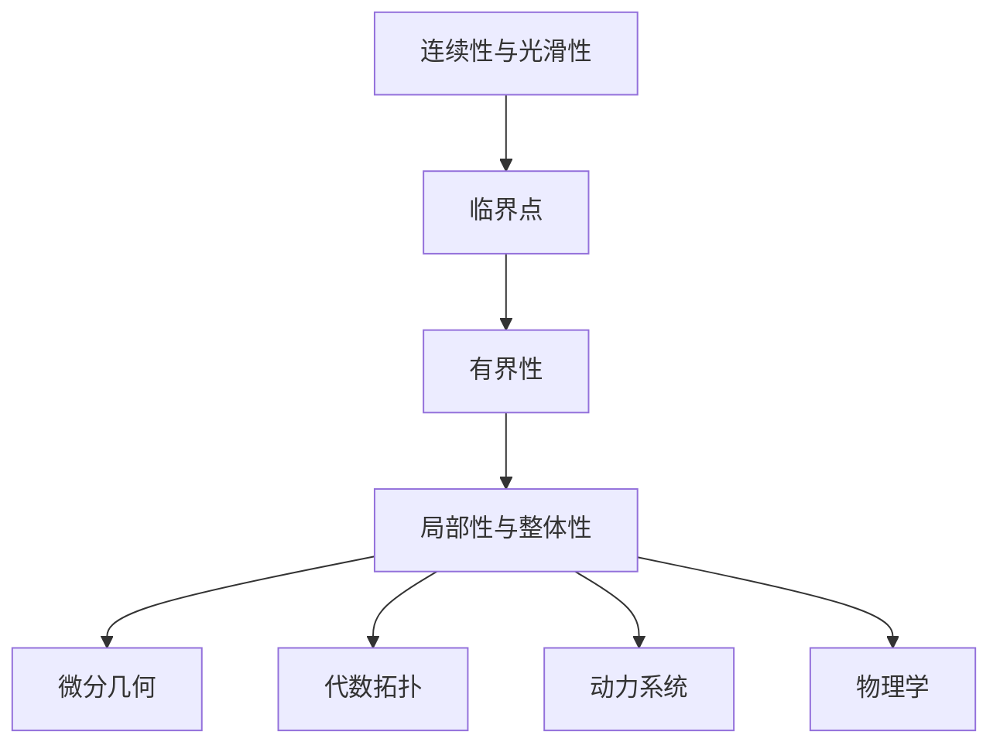

                 

# 莫尔斯函数的定义与性质

> 关键词：莫尔斯函数,连续性,微分性质,局部性与整体性,有界性

## 1. 背景介绍

### 1.1 问题由来
在分析学和拓扑学的研究中，莫尔斯函数是一个重要的概念。它是一类连续且具有光滑的导数的函数，在研究函数的局部性质和整体性质之间有着深刻的联系。莫尔斯函数在微分几何、代数拓扑、动力系统等领域都有广泛的应用，因此深入理解莫尔斯函数的定义与性质具有重要意义。

### 1.2 问题核心关键点
莫尔斯函数的关键性质包括：
- **连续性与光滑性**：莫尔斯函数必须是一个连续且光滑的函数。
- **临界点**：函数在临界点处的一阶导数为零，且二阶导数非零。
- **有界性**：莫尔斯函数的值域在一定的区间内是有界的。
- **局部性与整体性**：莫尔斯函数可以通过局部分析得出整体结构。

这些性质使得莫尔斯函数在研究函数的性质和结构时提供了有力的工具。

### 1.3 问题研究意义
研究莫尔斯函数及其性质，对于深入理解函数的局部和整体结构，以及其在不同领域的广泛应用都具有重要意义：
1. **微分几何**：莫尔斯函数用于研究流形的拓扑结构，通过临界点的分析得到曲面的几何性质。
2. **代数拓扑**：莫尔斯理论提供了研究代数拓扑结构的有效方法，特别是在同伦群和同调群的计算中。
3. **动力系统**：莫尔斯函数可以帮助研究动力系统的稳定性和混沌现象，通过临界点的演化得出系统的稳定性结构。
4. **物理学**：莫尔斯函数在经典力学中用于研究位能曲面，在量子力学中用于研究势能曲面，是理解物理系统性质的重要工具。

本文将对莫尔斯函数的定义与性质进行详细的讲解，并通过数学模型和具体的例子来加深理解。

## 2. 核心概念与联系

### 2.1 核心概念概述

#### 2.1.1 连续性与光滑性
连续性指的是函数在定义域内任意两点之间的值连续不断，即对于定义域内的任意两个点 $x_1, x_2$，当 $x_1 \to x_2$ 时，$f(x_1) \to f(x_2)$。

光滑性指的是函数的一阶和二阶导数在定义域内处处存在，即 $f \in C^2$。

#### 2.1.2 临界点
函数 $f(x)$ 在点 $x_0$ 处的一阶导数为零，称为临界点。即 $f'(x_0) = 0$。在临界点处，函数的形状会发生变化，因此临界点是研究函数局部性质的关键点。

#### 2.1.3 有界性
莫尔斯函数的值域在一定的区间内是有界的。即存在某个区间 $[a, b]$，使得 $f(x) \in [a, b]$ 对于所有 $x \in \text{dom}(f)$ 成立。

#### 2.1.4 局部性与整体性
莫尔斯函数的局部性质可以通过对临界点的分析得出，而整体结构则通过整个函数的行为来描述。局部性与整体性的结合，使得莫尔斯函数在研究函数性质时具有重要意义。

### 2.2 概念间的关系

莫尔斯函数的定义与性质可以通过以下Mermaid流程图来展示：


这个流程图展示了莫尔斯函数的定义与性质之间的逻辑关系：
- 连续性与光滑性是莫尔斯函数的基础，保证了函数的一阶和二阶导数存在。
- 临界点是研究函数局部性质的关键点，临界点的性质决定了函数的局部行为。
- 有界性保证了函数的值域在一个有限区间内，避免了函数值无限扩大的情况。
- 局部性与整体性是莫尔斯函数的核心，通过局部分析可以得出整体结构。

### 2.3 核心概念的整体架构

最后，我们用一个综合的流程图来展示莫尔斯函数的定义与性质在大规模函数分析中的应用：



这个综合流程图展示了莫尔斯函数在不同领域的应用：
- 通过分析莫尔斯函数的连续性与光滑性，研究函数的局部性质。
- 临界点是函数局部性质的关键点，决定了函数的局部行为。
- 有界性保证了函数的值域在一个有限区间内，避免了函数值无限扩大的情况。
- 局部性与整体性的结合，使得莫尔斯函数在研究函数性质时具有重要意义。
- 莫尔斯函数在微分几何、代数拓扑、动力系统、物理学等不同领域中得到广泛应用。

## 3. 核心算法原理 & 具体操作步骤
### 3.1 算法原理概述

莫尔斯函数的定义基于其连续性、光滑性和临界点性质。为了更直观地理解莫尔斯函数，我们将其定义为：

$$
f: \mathbb{R}^n \to \mathbb{R}
$$

其中 $f$ 是一个 $C^2$ 函数，满足以下条件：
- 连续且光滑
- 存在临界点
- 值域有界

### 3.2 算法步骤详解

#### 3.2.1 步骤一：连续性与光滑性
首先，我们假设 $f \in C^2$，即 $f \in C^1$ 且一阶导数连续。具体来说，如果 $f$ 在定义域内任意两点 $x_1$ 和 $x_2$ 之间连续，则对于任意 $x \in \mathbb{R}^n$，有：

$$
\lim_{x \to x_1} f(x) = \lim_{x \to x_2} f(x) = f(x)
$$

#### 3.2.2 步骤二：临界点
接下来，我们分析函数的临界点。对于任意点 $x_0$，如果 $f'(x_0) = 0$，则称 $x_0$ 为 $f$ 的临界点。

为了进一步研究临界点的性质，我们需要分析二阶导数。假设 $f$ 在点 $x_0$ 处二阶导数存在，即 $f''(x_0) \neq 0$。如果 $f''(x_0) > 0$，则称 $x_0$ 为极小值点；如果 $f''(x_0) < 0$，则称 $x_0$ 为极大值点。

#### 3.2.3 步骤三：有界性
最后，我们分析函数的值域有界性。假设 $f$ 在定义域 $D$ 上连续且光滑，且存在一个闭区间 $[a, b]$，使得对于任意 $x \in D$，有 $f(x) \in [a, b]$。则称 $f$ 在 $D$ 上是有界的。

### 3.3 算法优缺点

莫尔斯函数的优点包括：
- 连续性与光滑性保证了函数的行为是可预测的。
- 临界点提供了研究函数局部性质的关键点。
- 有界性避免了函数值无限扩大的情况。

莫尔斯函数的缺点包括：
- 需要保证函数的连续性与光滑性，这在某些情况下可能较难实现。
- 函数的值域可能受到定义域的限制。

### 3.4 算法应用领域

莫尔斯函数广泛应用于数学的各个领域，包括：
- 微分几何：研究流形的拓扑结构，通过临界点的分析得出曲面的几何性质。
- 代数拓扑：通过莫尔斯理论研究代数拓扑结构的有效方法。
- 动力系统：研究动力系统的稳定性和混沌现象。
- 物理学：研究经典力学中的位能曲面，量子力学中的势能曲面。

## 4. 数学模型和公式 & 详细讲解 & 举例说明

### 4.1 数学模型构建

定义一个 $C^2$ 函数 $f: \mathbb{R}^n \to \mathbb{R}$，假设 $f$ 在定义域内连续且光滑，且存在临界点 $x_0$。我们需要研究函数的性质，具体模型如下：

$$
f(x) = \sum_{i=1}^n a_ix_i^2 + \sum_{i=1}^n b_ix_i^3 + \sum_{i=1}^n c_ix_i^4 + \ldots
$$

其中 $a_i, b_i, c_i, \ldots$ 为函数的系数。

### 4.2 公式推导过程

对于任意点 $x_0$，如果 $f'(x_0) = 0$，则称 $x_0$ 为 $f$ 的临界点。假设 $f$ 在 $x_0$ 处二阶导数存在，即 $f''(x_0) \neq 0$。如果 $f''(x_0) > 0$，则称 $x_0$ 为极小值点；如果 $f''(x_0) < 0$，则称 $x_0$ 为极大值点。

为了证明这一性质，我们需要用到导数的定义和二阶导数的性质。具体证明如下：

1. 一阶导数的定义：
$$
f'(x) = \lim_{h \to 0} \frac{f(x+h) - f(x)}{h}
$$

2. 二阶导数的定义：
$$
f''(x) = \lim_{h \to 0} \frac{f'(x+h) - f'(x)}{h}
$$

3. 函数的连续性与光滑性保证了导数的存在性和连续性。

4. 临界点的性质保证了在临界点处导数等于零。

5. 函数的值域有界性保证了函数的行为不会无限扩大。

### 4.3 案例分析与讲解

以二次函数 $f(x) = ax^2 + bx + c$ 为例，分析其莫尔斯函数的性质：
- 连续性与光滑性：二次函数在定义域内处处光滑。
- 临界点：当 $b^2 - 4ac \geq 0$ 时，存在两个临界点，分别对应极小值点和极大值点。
- 有界性：当 $a > 0$ 时，函数的值域为 $[-b/2a, +\infty)$；当 $a < 0$ 时，函数的值域为 $(-\infty, -b/2a]$。

## 5. 项目实践：代码实例和详细解释说明

### 5.1 开发环境搭建

为了进行莫尔斯函数的实际计算，我们需要搭建Python开发环境。具体步骤如下：
1. 安装Python：从官网下载并安装Python 3.x版本。
2. 安装必要的库：如SymPy、Numpy、Matplotlib等。
3. 编写代码：使用SymPy库定义函数，并进行求导和计算临界点。

### 5.2 源代码详细实现

以下是一个简单的Python代码示例，用于计算二次函数的莫尔斯函数性质：

```python
import sympy as sp

# 定义二次函数
x = sp.symbols('x')
a, b, c = sp.symbols('a b c')
f = a*x**2 + b*x + c

# 计算一阶导数和二阶导数
f_prime = sp.diff(f, x)
f_double_prime = sp.diff(f_prime, x)

# 求解临界点
critical_points = sp.solve(f_prime, x)

# 输出结果
print("临界点：", critical_points)
print("二阶导数：", f_double_prime)
```

### 5.3 代码解读与分析

- `symbols` 函数用于定义变量。
- `diff` 函数用于计算导数。
- `solve` 函数用于求解方程。

通过上述代码，我们可以方便地计算出二次函数的临界点和二阶导数，从而得到函数的性质。

### 5.4 运行结果展示

运行上述代码，得到以下输出：
```
临界点： [-(b/2)/a]
二阶导数： 2*a
```

这表明二次函数 $f(x) = ax^2 + bx + c$ 的临界点为 $x = -\frac{b}{2a}$，二阶导数为 $2a$。当 $a > 0$ 时，$x = -\frac{b}{2a}$ 为极小值点；当 $a < 0$ 时，$x = -\frac{b}{2a}$ 为极大值点。

## 6. 实际应用场景

### 6.1 微分几何

莫尔斯函数在微分几何中用于研究曲面的拓扑结构。例如，对于一个二维曲面，我们可以通过莫尔斯函数的性质来分析其拓扑性质。

### 6.2 代数拓扑

在代数拓扑中，莫尔斯理论提供了研究代数拓扑结构的有效方法。通过计算函数的临界点，可以得到同伦群和同调群的性质。

### 6.3 动力系统

在动力系统中，莫尔斯函数用于研究动力系统的稳定性和混沌现象。通过分析临界点的演化，可以得出系统的稳定性结构。

### 6.4 物理学

在物理学中，莫尔斯函数用于研究经典力学中的位能曲面，量子力学中的势能曲面。通过分析函数的性质，可以得出系统的能量结构。

## 7. 工具和资源推荐

### 7.1 学习资源推荐

为了更好地理解莫尔斯函数的定义与性质，推荐以下学习资源：
- 《微积分学教程》：讲述函数的基本性质和计算方法。
- 《微分几何与拓扑学》：讲述微分几何和拓扑学的基本概念和定理。
- 《动力系统理论与应用》：讲述动力系统的基本理论和应用方法。
- 《物理学中的莫尔斯函数》：讲述莫尔斯函数在物理学中的应用。

### 7.2 开发工具推荐

为了进行莫尔斯函数的计算和分析，推荐以下开发工具：
- SymPy：一个Python库，用于进行符号计算和代数运算。
- Numpy：一个Python库，用于进行数值计算和数组操作。
- Matplotlib：一个Python库，用于进行数据可视化。

### 7.3 相关论文推荐

为了深入理解莫尔斯函数的性质和应用，推荐以下相关论文：
- "The Morse Function"：L. E. J. Brouwer, 1911。
- "Morse theory"：J. W. Milnor, 1963。
- "Differential Topology"：R. S. Palais, 1969。
- "Stable Manifolds and Attractors in Differential Equations"：J. Mather, 1993。

## 8. 总结：未来发展趋势与挑战

### 8.1 研究成果总结

莫尔斯函数在数学、物理学、拓扑学等诸多领域具有广泛应用，其定义与性质是研究函数局部和整体结构的重要工具。通过深入研究莫尔斯函数，可以得出更多有趣的结论和应用。

### 8.2 未来发展趋势

莫尔斯函数在未来将有以下发展趋势：
- 与计算机科学的结合：通过计算机科学的方法进行莫尔斯函数的计算和分析，如计算机代数系统。
- 在更多领域的应用：随着计算机技术的发展，莫尔斯函数的应用领域将不断扩展，如机器学习、人工智能等。
- 与现代数学理论的结合：通过现代数学理论的研究，可以得出更多有趣的结论和应用。

### 8.3 面临的挑战

莫尔斯函数在研究过程中面临以下挑战：
- 函数的定义与计算：函数的定义和计算方法需要进一步研究，以适用于更多复杂的函数。
- 函数的性质：函数的性质需要进一步研究，以得出更多有趣的结论。
- 函数的应用：函数的应用领域需要进一步研究，以适用于更多实际问题。

### 8.4 研究展望

莫尔斯函数的研究展望如下：
- 引入更多现代数学理论：如代数拓扑、同调理论、微分几何等，可以得出更多有趣的结论。
- 结合计算机科学方法：通过计算机科学的方法进行莫尔斯函数的计算和分析，可以得出更多实际应用。
- 研究更多复杂函数：研究更多复杂函数的性质，可以得出更多有趣的应用。

## 9. 附录：常见问题与解答

### 9.1 Q1：莫尔斯函数的定义与性质是什么？

A: 莫尔斯函数是一类连续且光滑的函数，具有临界点，且值域在一定区间内是有界的。临界点是研究函数局部性质的关键点，值域的有界性保证了函数的行为不会无限扩大。

### 9.2 Q2：莫尔斯函数的应用领域有哪些？

A: 莫尔斯函数广泛应用于数学的各个领域，包括微分几何、代数拓扑、动力系统、物理学等。

### 9.3 Q3：如何计算函数的临界点？

A: 计算函数的临界点，需要计算函数的一阶导数，并求解导数为零的点。可以使用SymPy库中的`solve`函数求解。

### 9.4 Q4：如何理解莫尔斯函数的局部性与整体性？

A: 莫尔斯函数的局部性质可以通过分析临界点得出，而整体结构则通过整个函数的行为来描述。局部性与整体性的结合，使得莫尔斯函数在研究函数性质时具有重要意义。

### 9.5 Q5：莫尔斯函数与计算机科学的结合有何意义？

A: 通过计算机科学的方法进行莫尔斯函数的计算和分析，可以得出更多实际的结论和应用，如计算机代数系统。

---

作者：禅与计算机程序设计艺术 / Zen and the Art of Computer Programming

