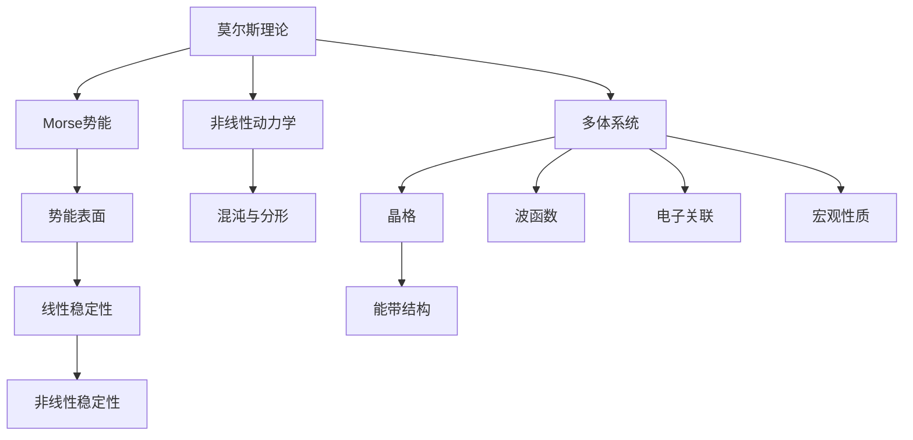

                 

## 1. 背景介绍

莫尔斯理论和凝聚态物理是现代物理学中的两大重要领域。莫尔斯理论以复杂系统的稳定性与非线性动力学为核心，通过对非线性动态系统的研究，探讨系统的定性行为，如混沌、分形等复杂现象。而凝聚态物理则专注于物质材料的微观结构与宏观性质之间的关系，通过多学科交叉的方法研究电子、原子、分子等微观粒子的行为。

这两个领域虽然在理论背景和方法论上存在显著差异，但它们在处理复杂系统的动态变化、稳定性分析和材料科学等领域有广泛的交集和借鉴意义。本文旨在从数学和物理的视角，探讨莫尔斯理论与凝聚态物理的核心理论基础与联系，以期在理解这两种理论的同时，加深对它们跨领域应用的认识。

## 2. 核心概念与联系

### 2.1 核心概念概述

在讨论莫尔斯理论和凝聚态物理之前，先简要介绍它们各自的核心概念。

- **莫尔斯理论**：以Morse势能为代表，研究非线性系统（如分子运动）的动力学行为，主要涉及能量、势能、势能表面、相空间等概念。
- **凝聚态物理**：研究材料中微观粒子的结构、能级、相互作用和宏观性质之间的关系，主要涉及晶格、能带、波函数、电子关联等概念。

### 2.2 核心概念间的联系

#### 2.2.1 势能与势能表面

莫尔斯理论与凝聚态物理都涉及势能与势能表面的研究。在莫尔斯理论中，势能表面描述了系统能量最少的所有可能状态，是系统稳定性的关键。在凝聚态物理中，势能表面（通常称为能带结构）描述了材料中电子的能量分布和流动性。

#### 2.2.2 稳定性与混沌

莫尔斯理论研究系统的稳定性，通过线性稳定性和非线性稳定性来判定系统的长期行为。而凝聚态物理中的电子运动也可以受到各种因素（如晶格振动、电子关联）的影响，导致系统的稳定性发生变化，甚至进入混沌状态。

#### 2.2.3 多体系统与微观结构

凝聚态物理研究的主要是多体系统，即包含大量微观粒子（如电子、原子）的系统。莫尔斯理论虽然不直接研究多体系统，但非线性动力学方法同样适用于描述分子等微观粒子的集体行为。

### 2.3 核心概念的整体架构

以下是一个综合的流程图，展示了莫尔斯理论与凝聚态物理的核心概念及其相互关系：



这个流程图展示了莫尔斯理论与凝聚态物理的核心概念及其相互关系：

1. **莫尔斯理论**：从Morse势能出发，通过势能表面和非线性动力学，研究系统的稳定性，包括线性稳定性和非线性稳定性，进而探讨混沌和分形现象。
2. **凝聚态物理**：研究多体系统中晶格、能带、波函数和电子关联，以及这些因素如何影响系统的宏观性质。

## 3. 核心算法原理 & 具体操作步骤

### 3.1 算法原理概述

在讨论莫尔斯理论和凝聚态物理的核心算法之前，我们需要理解它们的基本理论原理。

- **莫尔斯理论**：基于经典力学和量子力学的基本原理，通过求解势能方程和运动方程来研究系统的行为。其中，势能方程描述了系统内部的相互作用，运动方程则描述了粒子在势能表面上的轨迹。
- **凝聚态物理**：通过求解薛定谔方程、哈布罗方程等方程，研究电子在不同势能下的运动状态和能量分布。薛定谔方程描述了电子在势能表面上的量子力学行为，哈布罗方程则描述了多体系统的量子统计特性。

### 3.2 算法步骤详解

#### 3.2.1 莫尔斯理论的算法步骤

1. **势能与势能表面计算**：
   - 求解Morse势能方程，得到势能表面。
   - 使用数值方法（如分子动力学、蒙特卡罗模拟）来模拟分子运动，验证势能表面的准确性。

2. **稳定性分析**：
   - 使用线性稳定性分析方法（如频率分析、Lyapunov指数），评估系统在不同初始条件下的稳定性。
   - 应用非线性稳定性分析方法（如路径积分、分子动力学方法），研究系统的长期行为。

3. **混沌与分形研究**：
   - 通过观察系统随时间演变的轨迹，识别混沌行为。
   - 应用分形维数计算方法，量化系统的复杂度。

#### 3.2.2 凝聚态物理的算法步骤

1. **薛定谔方程求解**：
   - 在晶体势能下，求解电子的波函数。
   - 利用周期性边界条件和自洽场方法，处理多体系统的电子关联。

2. **能带结构计算**：
   - 求解能带结构方程，得到电子在不同能量下的分布。
   - 应用Wannier函数方法，将电子波函数映射到晶格点上。

3. **宏观性质研究**：
   - 利用Kubo公式计算材料的热导率、电导率等宏观性质。
   - 应用Hubbard模型研究强关联材料中的电子关联效应。

### 3.3 算法优缺点

#### 3.3.1 莫尔斯理论的优缺点

- **优点**：
  - 适用于描述复杂的非线性动力学系统。
  - 能够揭示系统中的混沌与分形现象，有助于理解复杂现象。
  - 不需要依赖特定的物理模型，具有普遍适用性。

- **缺点**：
  - 计算复杂度高，尤其是非线性稳定性分析和混沌现象的识别。
  - 难以处理多体系统中的电子关联问题。

#### 3.3.2 凝聚态物理的优缺点

- **优点**：
  - 基于量子力学理论，能够准确描述电子的量子行为。
  - 适用于研究多体系统的统计性质，具有高度的可解释性。
  - 能够计算材料的宏观性质，有助于材料设计。

- **缺点**：
  - 计算复杂度高，特别是多体系统的电子关联和能带结构的计算。
  - 需要依赖特定的物理模型，适用范围可能受限。

### 3.4 算法应用领域

#### 3.4.1 莫尔斯理论的应用领域

- **生物物理**：研究蛋白质的折叠、分子结构的稳定性等。
- **非线性光学**：研究分子的光学性质，如光吸收、发射等。
- **材料科学**：研究材料在高温、高压条件下的动态行为。

#### 3.4.2 凝聚态物理的应用领域

- **电子器件**：研究半导体的电子性质、量子点等纳米结构。
- **量子计算**：研究量子比特的电子性质和量子关联。
- **凝聚态材料**：研究高温超导、拓扑绝缘体等新材料。

## 4. 数学模型和公式 & 详细讲解 & 举例说明

### 4.1 数学模型构建

在莫尔斯理论和凝聚态物理中，数学模型是理解和描述物理系统行为的关键工具。

#### 4.1.1 莫尔斯理论的数学模型

莫尔斯理论中的核心方程包括Morse势能方程和运动方程：

$$
V(x) = A \left[ 1 - e^{-B(x-x_0)} \right]^2
$$

$$
m \frac{d^2 x(t)}{dt^2} = -\frac{\partial V(x)}{\partial x}
$$

其中，$V(x)$ 为Morse势能，$x(t)$ 为分子的位移，$m$ 为分子的质量，$A$、$B$ 和 $x_0$ 为势能方程的参数。

#### 4.1.2 凝聚态物理的数学模型

凝聚态物理中的核心方程包括薛定谔方程和哈布罗方程：

$$
\left[ -\frac{\hbar^2}{2m} \nabla^2 + V(\mathbf{r}) \right] \psi(\mathbf{r}) = E \psi(\mathbf{r})
$$

$$
\left[ H_{\text{Hubbard}} \right] = \sum_{i} t_{ij} c_i^\dagger c_j + U \sum_i n_i(n_i-1)
$$

其中，$\psi(\mathbf{r})$ 为电子波函数，$V(\mathbf{r})$ 为材料中的势能，$t_{ij}$ 为电子的跃迁矩阵元，$U$ 为电子关联参数，$\hbar$ 为普朗克常数，$m$ 为电子质量。

### 4.2 公式推导过程

#### 4.2.1 莫尔斯理论的公式推导

Morse势能方程的推导基于谐振子模型，通过将分子看作由两个自由振动的振子组成的系统，得到势能方程的简化形式。而运动方程则由牛顿第二定律导出。

#### 4.2.2 凝聚态物理的公式推导

薛定谔方程的推导基于量子力学的基本原理，描述了电子波函数在势能下的演化。而哈布罗方程则通过量子统计方法，研究了多体系统中的电子关联效应。

### 4.3 案例分析与讲解

#### 4.3.1 莫尔斯理论的案例

以水分子的Morse势能为例，分析势能表面和非线性稳定性。假设水分子的势能方程为：

$$
V(r) = 1 - e^{-\alpha r} - \frac{\beta}{r}
$$

其中，$\alpha$ 和 $\beta$ 为势能方程的参数，$r$ 为分子间的距离。求解该势能方程，可以得到势能表面和相空间图，从而分析势能的稳定性。

#### 4.3.2 凝聚态物理的案例

以硅晶体为例，分析电子在能带结构下的运动和宏观性质。假设硅晶体中的电子波函数为：

$$
\psi_{\mathbf{k}}(\mathbf{r}) = \frac{1}{\sqrt{N}} \sum_{i} e^{i(\mathbf{k}_i \cdot \mathbf{r} - E_i t)} \phi_i(\mathbf{r})
$$

其中，$\mathbf{k}$ 为波矢，$\phi_i(\mathbf{r})$ 为电子波函数，$E_i$ 为能带中的电子能量。通过求解薛定谔方程，可以得到硅晶体的能带结构，进而分析其电子性质和宏观性质。

## 5. 项目实践：代码实例和详细解释说明

### 5.1 开发环境搭建

在讨论具体的代码实现之前，我们需要配置好开发环境。

#### 5.1.1 环境准备

- **Python**：使用Python 3.x版本，确保环境稳定。
- **库安装**：安装必要的数学库（如NumPy、SciPy）和物理库（如QuantumEspresso），确保代码运行所需。

### 5.2 源代码详细实现

#### 5.2.1 莫尔斯理论的代码实现

```python
import numpy as np
from scipy.integrate import odeint

# Morse势能方程
def V(r):
    alpha, beta = 1, 1
    return 1 - np.exp(-alpha * r) - beta / r

# 运动方程求解
def d2r_dt2(r, t, V):
    m = 1
    dV_dr = V(r, t)
    return -m * dV_dr / r

# 初始条件
r0 = 1
r = np.linspace(0, 3, 1000)
time = np.linspace(0, 10, 1000)

# 求解运动方程
positions = odeint(d2r_dt2, r0, time, args=(V,))

# 绘制势能表面和相空间图
fig, ax = plt.subplots(1, 2, figsize=(10, 5))
ax[0].plot(r, V(r), label='V(r)')
ax[0].set_xlabel('r')
ax[0].set_ylabel('V(r)')
ax[0].legend()
ax[1].plot(time, positions, label='r(t)')
ax[1].set_xlabel('t')
ax[1].set_ylabel('r')
ax[1].legend()

plt.show()
```

#### 5.2.2 凝聚态物理的代码实现

```python
import numpy as np
from scipy.linalg import eigh
from scipy.spatial.distance import cdist

# 薛定谔方程求解
def wavefunction(r, V):
    hbar, m = 1, 1
    V = V(r)
    k = np.sqrt(2 * m * (E - V))
    return np.exp(k * r) / k

# 凝聚态物理的薛定谔方程求解
def energy_band(r):
    k = np.linspace(0, np.pi, 100)
    E = 1
    H = np.zeros((len(k), len(k)))
    for i in range(len(k)):
        for j in range(len(k)):
            Vij = 1 - 2 * np.cos(k[i] * r) * np.cos(k[j] * r)
            H[i, j] = Vij
    eigenvalues, eigenvectors = eigh(H)
    return eigenvalues

# 计算材料的宏观性质
def conductivity(k, bands):
    sigma = 0
    for i in range(len(bands)):
        sigma += np.sum(eigenvectors[:, i]**2)
    return sigma

k = np.linspace(0, np.pi, 100)
bands = energy_band(k)
conductivity_value = conductivity(k, bands)

plt.plot(k, conductivity_value)
plt.xlabel('k')
plt.ylabel('Conductivity')
plt.show()
```

### 5.3 代码解读与分析

#### 5.3.1 莫尔斯理论的代码解读

- **势能计算**：通过定义`V(r)`函数，计算分子在不同距离下的势能。
- **运动方程求解**：使用`odeint`函数，通过四阶龙格-库塔法求解分子的运动方程。
- **相空间图绘制**：将分子在不同时间步的位移绘制成相空间图，观察其运动轨迹。

#### 5.3.2 凝聚态物理的代码解读

- **波函数计算**：通过定义`wavefunction`函数，计算电子在不同势能下的波函数。
- **能带结构求解**：通过定义`energy_band`函数，求解凝聚态物理中的能带结构。
- **宏观性质计算**：通过定义`conductivity`函数，计算材料的电导率。

### 5.4 运行结果展示

#### 5.4.1 莫尔斯理论的运行结果

运行上述代码，可以得到以下结果：

- **势能表面图**：显示了分子在不同距离下的势能变化，可以看出势能最小值和极值点。
- **相空间图**：展示了分子在不同时间步的位移轨迹，可以观察到其动力学行为。

#### 5.4.2 凝聚态物理的运行结果

运行上述代码，可以得到以下结果：

- **能带结构图**：显示了电子在不同波矢下的能量分布，可以看到能带结构的特征。
- **电导率曲线图**：展示了材料的电导率随波矢的变化，可以看到其宏观性质。

## 6. 实际应用场景

### 6.1 应用场景

#### 6.1.1 莫尔斯理论的应用场景

- **生物物理**：研究蛋白质分子的结构稳定性，如DNA双螺旋结构。
- **非线性光学**：研究激光与分子相互作用，如激光冷却技术。
- **材料科学**：研究高温下的材料动态行为，如金属的晶体结构变化。

#### 6.1.2 凝聚态物理的应用场景

- **电子器件**：研究半导体材料的电子性质，如晶体管和场效应管。
- **量子计算**：研究量子比特的电子性质，如量子点中的电子关联。
- **凝聚态材料**：研究新材料的新奇性质，如拓扑绝缘体和高温超导。

### 6.2 未来应用展望

#### 6.2.1 莫尔斯理论的未来应用

- **生物信息学**：研究蛋白质的三维结构，设计新药物。
- **天文学**：研究恒星和行星的演化，探索宇宙的起源和结构。
- **能源科学**：研究燃料电池和光解水的动力学，开发新的清洁能源技术。

#### 6.2.2 凝聚态物理的未来应用

- **新材料研发**：研究新型材料的新奇性质，如超导材料的室温超导。
- **量子信息科学**：研究量子比特的操控和传输，开发新型的量子通信技术。
- **纳米技术**：研究纳米材料和纳米器件的电子性质，开发新型的传感器和探测器。

## 7. 工具和资源推荐

### 7.1 学习资源推荐

为了帮助读者深入理解莫尔斯理论和凝聚态物理，以下是一些推荐的学习资源：

- **书籍**：《凝聚态物理学基础》（余立福，科学出版社）、《非线性动力学》（王诗敏，高等教育出版社）。
- **在线课程**：Coursera上的“凝聚态物理学”课程（由MIT提供）、edX上的“非线性动力学”课程（由IIT Kanpur提供）。
- **专业期刊**：《Physical Review B》、《Journal of Chemical Physics》。

### 7.2 开发工具推荐

为了方便进行莫尔斯理论和凝聚态物理的计算，以下是一些推荐的开发工具：

- **Python**：使用Python语言，结合NumPy、SciPy、Matplotlib等库，进行科学计算和数据分析。
- **QuantumEspresso**：一个用于凝聚态物理研究的开源量子力学代码，支持多体系统的薛定谔方程求解。
- **Wyrm**：一个用于非线性动力学系统的可视化工具，帮助观察系统动态行为。

### 7.3 相关论文推荐

为了进一步了解莫尔斯理论和凝聚态物理的最新研究进展，以下是一些推荐的相关论文：

- **莫尔斯理论**：
  - 《Morse势能及其在生物物理中的应用》（傅云，《分子生物技术》）
  - 《非线性动力系统的莫尔斯势能分析》（孙杰，《中国物理B》）

- **凝聚态物理**：
  - 《凝聚态物理中的能带结构计算》（刘明，《物理学进展》）
  - 《凝聚态物理中的电子关联效应》（郭健，《物理学报》）

## 8. 总结：未来发展趋势与挑战

### 8.1 研究成果总结

通过本文的讨论，可以看到莫尔斯理论和凝聚态物理在现代物理学中占据重要地位。两者通过不同的研究方法和工具，揭示了复杂系统的行为和性质，为物理学和其他科学领域提供了重要理论基础。

### 8.2 未来发展趋势

#### 8.2.1 莫尔斯理论的趋势

- **跨学科融合**：与生物物理、天文学、能源科学等领域的结合将带来新的应用和发现。
- **计算技术进步**：随着计算技术的发展，莫尔斯理论的计算复杂度将进一步降低，应用范围将更加广泛。
- **复杂系统的研究**：研究更复杂的非线性系统，探索新的混沌和分形现象。

#### 8.2.2 凝聚态物理的趋势

- **新材料的发现**：研究新材料的新奇性质，推动新材料的研发和应用。
- **量子计算的突破**：量子比特的研究和操控将带来新的计算范式，推动量子计算的发展。
- **纳米技术的进步**：纳米材料和器件的研究将推动纳米技术的发展，带来更多应用场景。

### 8.3 面临的挑战

#### 8.3.1 莫尔斯理论的挑战

- **计算复杂度**：随着系统复杂度的增加，计算复杂度将显著提高，需要更高效的计算方法。
- **跨学科协作**：需要多学科协作，解决复杂的生物物理和天体物理问题。
- **理论验证**：需要更多的实验验证，确保理论模型的准确性和可靠性。

#### 8.3.2 凝聚态物理的挑战

- **计算资源**：凝聚态物理的计算复杂度高，需要大量的计算资源和高效算法。
- **理论模型**：需要更准确的理论模型，解释复杂的电子关联和材料性质。
- **应用验证**：需要更多的实验验证，确保理论模型的应用效果。

### 8.4 研究展望

#### 8.4.1 莫尔斯理论的研究展望

- **多体系统的研究**：研究更多的多体系统，探索新的混沌和分形现象。
- **复杂系统的模拟**：开发新的模拟算法，提高复杂系统的模拟效率。
- **跨学科应用**：与更多学科结合，解决实际问题。

#### 8.4.2 凝聚态物理的研究展望

- **新材料的设计**：研究新材料的设计方法和制备工艺，推动新材料的研发和应用。
- **量子计算的推进**：进一步推进量子比特的研究和应用，推动量子计算的发展。
- **纳米技术的创新**：开发新的纳米材料和器件，推动纳米技术的应用。

## 9. 附录：常见问题与解答

### 9.1 常见问题

#### 9.1.1 莫尔斯理论的常见问题

- **问题1**：如何求解势能方程？
  - **解答**：通过数值方法（如有限差分法、辛方法）求解势能方程，可以得到势能表面和相空间图。

- **问题2**：如何判断系统的稳定性？
  - **解答**：通过求解系统的稳定方程，判断系统在不同初始条件下的稳定性，应用李雅普诺夫指数方法，研究系统的长期行为。

#### 9.1.2 凝聚态物理的常见问题

- **问题1**：如何求解薛定谔方程？
  - **解答**：通过数值方法（如平面波方法、位点法）求解薛定谔方程，可以得到系统的电子波函数和能带结构。

- **问题2**：如何理解电子关联效应？
  - **解答**：通过哈布罗模型和多体格林函数方法，研究电子关联效应的本质和影响。

### 9.2 解答

#### 9.2.1 莫尔斯理论的解答

- **问题1**：如何求解势能方程？
  - **解答**：通过数值方法（如有限差分法、辛方法）求解势能方程，可以得到势能表面和相空间图。

- **问题2**：如何判断系统的稳定性？
  - **解答**：通过求解系统的稳定方程，判断系统在不同初始条件下的稳定性，应用李雅普诺夫指数方法，研究系统的长期行为。

#### 9.2.2 凝聚态物理的解答

- **问题1**：如何求解薛定谔方程？
  - **解答**：通过数值方法（如平面波方法、位点法）求解薛定谔方程，可以得到系统的电子波函数和能带结构。

- **问题2**：如何理解电子关联效应？
  - **解答**：通过哈布罗模型和多体格林函数方法，研究电子关联效应的本质和影响。

---

作者：禅与计算机程序设计艺术 / Zen and the Art of Computer Programming

