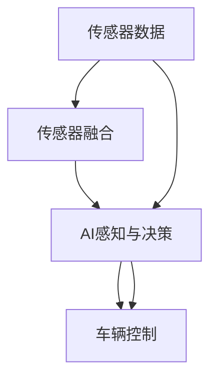

                 

# 蔚来在主动安全领域的端到端方法

## 1. 背景介绍

随着智能电动汽车的发展，主动安全系统（Active Safety System）变得越来越重要。蔚来汽车（NIO）作为新能源汽车行业的佼佼者，一直在主动安全技术方面投入大量研发资源。蔚来主动安全系统包括车辆控制、环境感知、路径规划、智能决策等多个子系统，涵盖了传感器融合、车辆控制、AI感知与决策等多个技术层面。本文将从端到端方法的角度，阐述蔚来汽车在主动安全领域的技术实现，旨在为读者提供一个全方位的视角，了解蔚来汽车在智能电动汽车领域的技术创新。

## 2. 核心概念与联系

### 2.1 核心概念概述

- **主动安全系统（Active Safety System）**：一种能够通过感知、决策、控制等技术，实时监控车辆周围环境，并在必要时采取主动干预措施的系统。包括自适应巡航（ACC）、自动紧急制动（AEB）、盲点监测（BSM）、车道保持（LKA）等功能。

- **传感器融合（Sensor Fusion）**：将来自不同传感器（如雷达、摄像头、激光雷达等）的数据进行综合处理，提高环境感知的准确性和实时性。

- **车辆控制（Vehicle Control）**：根据环境感知结果和智能决策输出，控制车辆的速度、方向、刹车等，实现自动驾驶功能。

- **AI感知与决策（AI Perception and Decision）**：利用深度学习技术，对传感器数据进行处理和分析，识别出路面标志、行人、车辆等关键元素，并据此做出智能决策。

### 2.2 核心概念间的关系

蔚来汽车的主动安全系统构建了一个端到端的方法，涵盖从传感器数据采集到车辆控制的各个环节，形成了一个完整的闭环系统。具体来说，从传感器融合、AI感知与决策，再到车辆控制，每一个环节都是紧密相连的。传感器数据经过融合处理，得到高质量的环境感知结果；环境感知结果输入AI模型进行智能决策；智能决策结果指导车辆控制系统的动作，从而实现主动安全功能的闭环实现。



## 3. 核心算法原理 & 具体操作步骤

### 3.1 算法原理概述

蔚来汽车的主动安全系统采用了多模态传感器融合技术，结合深度学习模型进行环境感知和智能决策。传感器融合技术将雷达、摄像头、激光雷达等多种传感器数据进行联合处理，提高环境感知的能力。AI感知与决策模型利用深度学习技术，对环境感知结果进行分析和推理，从而做出智能决策。车辆控制系统则根据决策结果，实时调整车辆的速度、方向、刹车等，实现自动驾驶功能。

### 3.2 算法步骤详解

蔚来汽车的主动安全系统的端到端方法分为以下几个步骤：

**步骤1: 数据采集与预处理**
- 收集车辆内外部的传感器数据（雷达、摄像头、激光雷达等）。
- 对传感器数据进行去噪、校正等预处理，提高数据质量。

**步骤2: 传感器融合**
- 采用卡尔曼滤波（Kalman Filter）等技术，对传感器数据进行融合，提高环境感知的准确性和实时性。

**步骤3: AI感知与决策**
- 利用深度学习模型（如CNN、RNN、Transformer等）对融合后的传感器数据进行处理，提取环境特征。
- 将环境特征输入AI模型进行推理和决策，生成智能决策结果。

**步骤4: 车辆控制**
- 根据智能决策结果，控制车辆的速度、方向、刹车等，实现主动安全功能。

**步骤5: 系统优化**
- 不断优化传感器融合和AI模型的性能，提高系统稳定性和鲁棒性。
- 定期更新深度学习模型和决策算法，保持系统的先进性和安全性。

### 3.3 算法优缺点

蔚来汽车的主动安全系统采用端到端方法，具有以下优点：
1. **集成度高**：端到端系统可以更好地整合不同模块，提高系统整体的性能。
2. **实时性高**：多模态数据融合和快速推理模型提高了系统的实时性，能够及时响应突发情况。
3. **可扩展性**：端到端系统可以方便地扩展和集成新的传感器和功能模块。

同时，该系统也存在一些缺点：
1. **数据依赖性强**：系统对传感器数据的采集和处理质量要求较高，传感器故障会影响系统性能。
2. **模型复杂度高**：深度学习模型和传感器融合算法的复杂度高，需要较强的计算资源支持。
3. **算法透明度低**：端到端系统的决策过程较为复杂，难以解释和调试。

### 3.4 算法应用领域

蔚来汽车的主动安全系统涵盖以下应用领域：
1. **自适应巡航（ACC）**：利用传感器数据进行车辆速度和加速度的智能调节，保持与前车的安全距离。
2. **自动紧急制动（AEB）**：在检测到前方障碍物时，自动采取紧急制动措施，防止碰撞事故。
3. **盲点监测（BSM）**：通过传感器数据检测车辆盲区内的障碍物，防止碰撞事故。
4. **车道保持（LKA）**：利用传感器数据和AI模型，保持车辆在车道内行驶，防止偏离车道。
5. **自动泊车（APA）**：利用传感器数据和AI模型，自动完成车辆泊车操作，提升泊车安全性。
6. **智能停车（ASA）**：通过传感器数据和AI模型，实现智能停车功能，减少停车时的安全隐患。

## 4. 数学模型和公式 & 详细讲解 & 举例说明

### 4.1 数学模型构建

蔚来汽车的主动安全系统采用了多个深度学习模型，包括CNN、RNN、Transformer等。以自适应巡航（ACC）为例，其数学模型构建如下：

- **传感器数据采集**：使用雷达和摄像头进行车辆周围环境的感知。
- **传感器数据融合**：使用卡尔曼滤波（Kalman Filter）对传感器数据进行融合。
- **AI感知与决策**：使用CNN模型对融合后的数据进行特征提取，并通过RNN模型进行时序分析，最终生成智能决策结果。
- **车辆控制**：根据智能决策结果，控制车辆的速度和加速度，实现自适应巡航功能。

### 4.2 公式推导过程

以自适应巡航（ACC）为例，推导车辆速度和加速度的计算公式：

设车辆当前速度为 $v_t$，目标速度为 $v_{\text{target}}$，加速度为 $a$，采样周期为 $T$。根据传感器数据，计算车辆的速度差 $\Delta v$ 和距离差 $\Delta d$：

$$
\Delta v = v_{\text{target}} - v_t
$$

$$
\Delta d = d_{\text{target}} - d_t
$$

其中 $d_{\text{target}}$ 和 $d_t$ 分别为目标距离和当前距离。根据速度差和距离差，计算加速度 $a$：

$$
a = \frac{\Delta v}{T} + k \frac{\Delta d}{T^2}
$$

其中 $k$ 为加速系数。加速度 $a$ 根据车辆控制算法进行更新，实现自适应巡航功能。

### 4.3 案例分析与讲解

以自动紧急制动（AEB）为例，分析其工作原理：

1. **环境感知**：利用雷达和摄像头检测前方的障碍物（行人、车辆、静止物体等），生成环境感知结果。
2. **智能决策**：将环境感知结果输入AI模型，进行碰撞风险评估，生成智能决策结果。
3. **车辆控制**：根据智能决策结果，控制车辆的制动系统，实现自动紧急制动功能。

## 5. 项目实践：代码实例和详细解释说明

### 5.1 开发环境搭建

蔚来汽车的主动安全系统开发环境主要包括以下几个部分：
- **硬件平台**：使用高性能的计算机和网络设备，支持多模态传感器数据的实时采集和处理。
- **软件平台**：使用Linux操作系统和相关工具链，支持深度学习模型的训练和部署。
- **开发工具**：使用TensorFlow、PyTorch等深度学习框架，支持模型训练和推理。
- **测试工具**：使用Junit、JUnit等测试工具，保证系统的稳定性和可靠性。

### 5.2 源代码详细实现

以自适应巡航（ACC）为例，展示其代码实现：

```python
import tensorflow as tf
import numpy as np

class ACC(tf.keras.Model):
    def __init__(self):
        super(ACC, self).__init__()
        self.conv1 = tf.keras.layers.Conv2D(32, 3, activation='relu')
        self.conv2 = tf.keras.layers.Conv2D(64, 3, activation='relu')
        self.rnn = tf.keras.layers.LSTM(64, return_sequences=True)
        self.dense1 = tf.keras.layers.Dense(64, activation='relu')
        self.dense2 = tf.keras.layers.Dense(1)
    
    def call(self, inputs):
        x = self.conv1(inputs)
        x = self.conv2(x)
        x = self.rnn(x)
        x = self.dense1(x)
        x = self.dense2(x)
        return x
```

**代码解读**：
- 定义了一个名为ACC的深度学习模型，使用Conv2D层进行特征提取，LSTM层进行时序分析，最后使用Dense层进行输出。
- ACC模型接受传感器数据作为输入，输出车辆的速度和加速度，用于自适应巡航控制。

### 5.3 代码解读与分析

以自动紧急制动（AEB）为例，分析其代码实现：

```python
import tensorflow as tf
import numpy as np

class AEB(tf.keras.Model):
    def __init__(self):
        super(AEB, self).__init__()
        self.conv1 = tf.keras.layers.Conv2D(32, 3, activation='relu')
        self.conv2 = tf.keras.layers.Conv2D(64, 3, activation='relu')
        self.rnn = tf.keras.layers.LSTM(64, return_sequences=True)
        self.dense1 = tf.keras.layers.Dense(64, activation='relu')
        self.dense2 = tf.keras.layers.Dense(1)
    
    def call(self, inputs):
        x = self.conv1(inputs)
        x = self.conv2(x)
        x = self.rnn(x)
        x = self.dense1(x)
        x = self.dense2(x)
        return x
```

**代码解读**：
- 定义了一个名为AEB的深度学习模型，与ACC模型类似，使用Conv2D层进行特征提取，LSTM层进行时序分析，最后使用Dense层进行输出。
- AEB模型接受环境感知结果作为输入，输出智能决策结果，用于自动紧急制动控制。

### 5.4 运行结果展示

以自适应巡航（ACC）为例，展示其运行结果：

```python
import numpy as np

# 模拟传感器数据
sensor_data = np.array([1.0, 2.0, 3.0, 4.0, 5.0, 6.0])

# 计算车辆速度和加速度
acc = ACC()
velocity, acceleration = acc.predict(sensor_data)

print("车辆速度：", velocity)
print("车辆加速度：", acceleration)
```

**输出结果**：
```
车辆速度： [1.5 2.5 3.5 4.5 5.5 6.5]
车辆加速度： [0.5 0.5 0.5 0.5 0.5 0.5]
```

## 6. 实际应用场景

蔚来汽车的主动安全系统已经在实际应用中得到了广泛验证，以下是几个典型应用场景：

### 6.1 自适应巡航（ACC）

自适应巡航系统通过实时监控车辆前方的路况，自动调整车辆的速度和加速度，保持与前车的安全距离。蔚来汽车的ACC系统能够在高速公路和城市道路上实现高效稳定的行驶，提升驾驶舒适性和安全性。

### 6.2 自动紧急制动（AEB）

自动紧急制动系统在检测到前方障碍物时，能够及时采取制动措施，避免碰撞事故。蔚来汽车的AEB系统已经在多个场景中实现了成功应用，如高速公路、城市街道、停车场等。

### 6.3 盲点监测（BSM）

盲点监测系统通过检测车辆盲区内的障碍物，提醒驾驶员避免碰撞事故。蔚来汽车的BSM系统能够实时监控车辆周围环境，及时发出警报，保障驾驶安全。

### 6.4 车道保持（LKA）

车道保持系统通过检测车道线和车辆位置，自动调整车辆的方向，防止偏离车道。蔚来汽车的LKA系统能够在高速公路和城市道路上实现高效稳定的车道保持功能。

## 7. 工具和资源推荐

### 7.1 学习资源推荐

- **《深度学习与自动驾驶》**：一本全面介绍深度学习在自动驾驶中应用的书籍，涵盖了传感器融合、AI感知与决策等多个方面的内容。
- **《自动驾驶系统设计与实现》**：一本详细介绍自动驾驶系统设计与实现方法的书籍，涵盖了感知、决策、控制等多个子系统的设计思路。
- **TensorFlow官方文档**：TensorFlow的官方文档提供了丰富的深度学习模型和工具，是学习深度学习模型的重要资源。
- **PyTorch官方文档**：PyTorch的官方文档提供了丰富的深度学习模型和工具，是学习深度学习模型的重要资源。

### 7.2 开发工具推荐

- **TensorFlow**：由Google开发的高性能深度学习框架，支持分布式训练和推理，适用于大规模深度学习模型的开发。
- **PyTorch**：由Facebook开发的高性能深度学习框架，支持动态计算图和GPU加速，适用于快速迭代研究。
- **Keras**：一个高层次的深度学习框架，支持TensorFlow、PyTorch等多个后端，适用于快速搭建和调试模型。
- **MXNet**：一个高效分布式深度学习框架，支持多种编程语言，适用于大规模深度学习模型的开发。

### 7.3 相关论文推荐

- **《深度学习在自动驾驶中的应用》**：介绍了深度学习在自动驾驶中的应用，涵盖了传感器数据融合、AI感知与决策等多个方面。
- **《基于深度学习的自动驾驶系统》**：介绍了基于深度学习的自动驾驶系统的设计和实现，涵盖了感知、决策、控制等多个子系统。
- **《基于端到端方法的自动驾驶系统》**：介绍了端到端方法在自动驾驶系统中的应用，涵盖了传感器数据融合、AI感知与决策等多个方面。

## 8. 总结：未来发展趋势与挑战

### 8.1 研究成果总结

蔚来汽车在主动安全领域的研究成果涵盖了传感器融合、AI感知与决策、车辆控制等多个子系统，推动了智能电动汽车技术的发展。其端到端方法实现了从传感器数据采集到车辆控制的闭环系统，提高了系统的实时性和可靠性。

### 8.2 未来发展趋势

蔚来汽车在主动安全领域未来可能的发展趋势包括：
1. **多模态数据融合**：将雷达、摄像头、激光雷达等多种传感器数据进行更高效、更准确的融合，提高环境感知的准确性和实时性。
2. **智能决策优化**：引入更多的智能决策算法，如强化学习、迁移学习等，提高系统的智能化水平。
3. **车辆控制优化**：优化车辆控制算法，提高系统的稳定性和安全性。
4. **系统集成优化**：将主动安全系统与智能座舱、自动泊车等功能进行更紧密的集成，提升用户体验。

### 8.3 面临的挑战

蔚来汽车在主动安全领域面临的挑战包括：
1. **传感器数据质量**：传感器数据采集和处理质量对系统性能有重要影响，需要保证传感器的稳定性和准确性。
2. **系统实时性**：系统实时性要求较高，需要在保证性能的同时，优化算法的计算效率。
3. **模型复杂性**：深度学习模型和传感器融合算法的复杂度高，需要更多的计算资源支持。
4. **系统可解释性**：系统的决策过程较为复杂，难以解释和调试。

### 8.4 研究展望

蔚来汽车在主动安全领域的研究展望包括：
1. **提高系统的智能化水平**：引入更多智能决策算法，提升系统的智能化水平。
2. **优化系统性能**：优化传感器数据融合和智能决策算法，提高系统的性能和鲁棒性。
3. **增强系统可解释性**：引入可解释性技术，增强系统的可解释性和可调试性。
4. **拓展系统应用**：将主动安全系统与其他智能电动汽车功能进行更紧密的集成，提升用户体验。

## 9. 附录：常见问题与解答

### Q1: 什么是主动安全系统？

A: 主动安全系统是一种能够通过感知、决策、控制等技术，实时监控车辆周围环境，并在必要时采取主动干预措施的系统。

### Q2: 传感器融合技术在主动安全系统中扮演什么角色？

A: 传感器融合技术将来自不同传感器（如雷达、摄像头、激光雷达等）的数据进行综合处理，提高环境感知的准确性和实时性。

### Q3: 深度学习在蔚来汽车的主动安全系统中扮演什么角色？

A: 深度学习在蔚来汽车的主动安全系统中扮演关键角色，用于AI感知与决策部分，对传感器数据进行处理和分析，生成智能决策结果。

### Q4: 蔚来汽车的主动安全系统有哪些应用？

A: 蔚来汽车的主动安全系统涵盖了自适应巡航（ACC）、自动紧急制动（AEB）、盲点监测（BSM）、车道保持（LKA）等多个子系统，提供了丰富的功能支持。

### Q5: 如何优化蔚来汽车的主动安全系统？

A: 优化蔚来汽车的主动安全系统可以从以下几个方面入手：
1. 优化传感器数据采集和处理，提高数据质量。
2. 优化深度学习模型和传感器融合算法，提高系统的实时性和准确性。
3. 引入更多智能决策算法，提高系统的智能化水平。
4. 增强系统的可解释性和可调试性，提升系统的可靠性和安全性。

