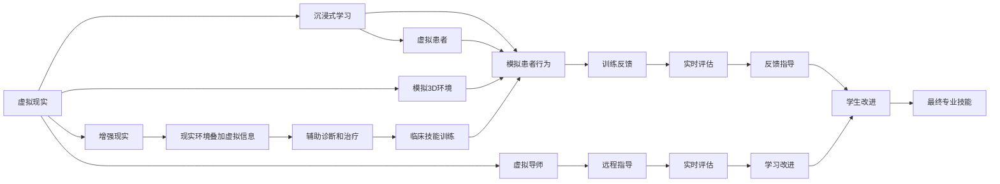
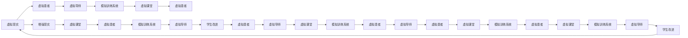
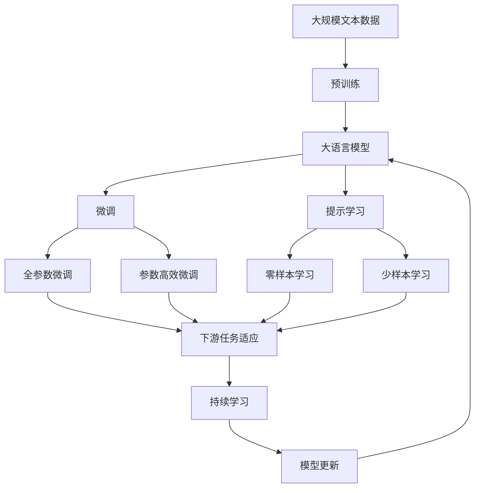

                 

# 虚拟医疗训练:全球医疗教育的数字化升级

## 1. 背景介绍

### 1.1 问题由来

在全球疫情的大背景下，医疗教育的数字化转型被推到了前所未有的高度。传统医学教育依赖于面授和实验室实践，而当前疫情限制了人员流动和集会，使得传统的教学模式受到了严重挑战。虚拟医疗训练成为了新的突破口，借助虚拟现实(VR)、增强现实(AR)和模拟训练系统，为医学生提供了全新的学习体验和实践平台。

### 1.2 问题核心关键点

虚拟医疗训练的核心在于利用现代信息技术，模拟真实医疗场景，为医学生提供全面、安全的实践机会。具体来说，包括但不限于以下几个方面：

- 虚拟实验室：通过虚拟环境模拟真实的医疗操作流程，提供重复训练的机会。
- 虚拟患者：通过虚拟角色扮演来模拟真实患者，训练医学生的诊断和治疗技能。
- 虚拟导师：虚拟教师或专家系统，可以实时指导和评估医学生的表现。
- 虚拟课堂：通过视频会议、在线互动等方式，提供远程授课和讨论。

这些虚拟技术的应用，使得医学生的学习不受地理和时间的限制，可以随时随地进行，显著提升了教学的灵活性和效率。

### 1.3 问题研究意义

虚拟医疗训练对全球医疗教育具有重要意义：

- 提升教学质量：虚拟训练能够提供安全、重复、无成本的实践机会，大大提升了教学质量。
- 弥补资源不足：特别是对于医疗资源匮乏的地区，虚拟训练可以弥补实体资源的不足。
- 强化技能训练：通过模拟真实场景，医学生能够反复训练操作技能，提高临床实践能力。
- 增强互动体验：虚拟教学能够提供沉浸式的互动体验，激发学生的学习兴趣。
- 加速专业成长：虚拟训练可以为医学生提供跨地区的交流和学习机会，加速专业成长。

## 2. 核心概念与联系

### 2.1 核心概念概述

为更好地理解虚拟医疗训练的原理和应用，我们首先介绍一些关键概念：

- **虚拟现实(VR)**：通过模拟3D环境，为医学生提供沉浸式的学习体验。
- **增强现实(AR)**：在现实环境中叠加虚拟信息，辅助医学生进行诊断和治疗。
- **虚拟患者**：通过虚拟角色扮演，模拟真实患者，训练医生的临床技能。
- **虚拟导师**：利用虚拟技术，实现远程指导和实时评估。
- **模拟训练系统**：包括计算机模拟器和虚拟人体模型，为医学生提供训练平台。
- **虚拟课堂**：通过网络平台，提供远程授课和互动，拓展教学空间。

这些核心概念通过以下Mermaid流程图展示了它们之间的关系：



### 2.2 概念间的关系

这些概念之间的逻辑关系可以通过以下Mermaid流程图来展示：



### 2.3 核心概念的整体架构

最后，我们用一个综合的流程图来展示这些核心概念在大语言模型微调过程中的整体架构：



这个综合流程图展示了从预训练到微调，再到持续学习的完整过程。虚拟医疗训练通过虚拟现实、增强现实等技术，模拟真实医疗场景，帮助医学生进行临床技能训练和知识学习，从而提升教学效果。

## 3. 核心算法原理 & 具体操作步骤
### 3.1 算法原理概述

虚拟医疗训练的核心算法原理基于虚拟现实和增强现实技术，通过模拟真实的医疗场景，为医学生提供安全、可重复的实践机会。其核心流程包括以下几个步骤：

1. **虚拟场景构建**：利用计算机图形学和渲染技术，构建虚拟医疗场景，包括虚拟实验室、虚拟患者和虚拟导师。
2. **模拟训练系统**：通过计算机模拟器或虚拟人体模型，模拟真实的医疗操作流程。
3. **交互式训练**：医学生通过虚拟患者进行诊断和治疗操作，虚拟导师实时提供反馈和指导。
4. **持续学习**：系统根据医学生的表现，不断调整训练难度和任务，实现动态适应和个性化教学。

### 3.2 算法步骤详解

#### 3.2.1 虚拟场景构建

虚拟场景的构建需要考虑以下几个关键因素：

- **环境设计**：模拟真实的医疗环境，包括医院、手术室、诊所等。
- **细节还原**：尽可能还原真实医疗设备的外观和操作方式。
- **互动设计**：设计虚拟患者的行为和反应，使其能够提供真实反馈。

#### 3.2.2 模拟训练系统

模拟训练系统包括：

- **计算机模拟器**：利用3D图形渲染技术，模拟医疗操作流程。
- **虚拟人体模型**：通过解剖学和生理学数据，构建虚拟人体模型，用于模拟医疗操作。

#### 3.2.3 交互式训练

交互式训练包括以下几个关键环节：

- **诊断操作**：医学生通过虚拟患者进行诊断操作，如问诊、听诊、检查等。
- **治疗操作**：医学生通过虚拟患者进行治疗操作，如手术、药物治疗等。
- **实时反馈**：虚拟导师根据医学生的表现，提供实时反馈和指导。

#### 3.2.4 持续学习

持续学习包括以下几个关键环节：

- **数据采集**：系统记录医学生的表现和操作数据。
- **模型调整**：基于采集的数据，调整训练难度和任务，实现动态适应。
- **个性化教学**：根据医学生的学习进度和表现，提供个性化的训练方案。

### 3.3 算法优缺点

虚拟医疗训练具有以下优点：

- **安全可控**：虚拟训练可以提供安全、可控的实践机会，避免医疗风险。
- **灵活高效**：虚拟训练不受地理和时间的限制，可以随时随地进行，提升教学灵活性和效率。
- **高重复性**：虚拟训练可以重复进行，避免因操作失误导致的不必要损失。
- **数据丰富**：虚拟训练可以提供丰富的学习数据，有助于全面提升技能。

但同时也存在一些缺点：

- **成本较高**：构建虚拟场景和训练系统需要较高的技术成本和硬件投入。
- **技术门槛高**：虚拟医疗训练涉及复杂的计算机图形学和渲染技术，技术门槛较高。
- **现实模拟不足**：虚拟训练无法完全模拟真实医疗场景的复杂性和多样性。

### 3.4 算法应用领域

虚拟医疗训练已经广泛应用于以下几个领域：

- **医学教育**：提供虚拟实验室和虚拟患者，训练医学生的诊断和治疗技能。
- **临床培训**：为实习医生提供虚拟实习机会，提升临床实践能力。
- **远程教学**：通过虚拟课堂，实现远程授课和互动，拓展教学空间。
- **技能评估**：利用虚拟导师，对医学生的表现进行实时评估和反馈。
- **个性化教学**：根据医学生的学习进度和表现，提供个性化的训练方案。

## 4. 数学模型和公式 & 详细讲解 & 举例说明

### 4.1 数学模型构建

假设虚拟医疗训练系统中有 $N$ 个虚拟患者，每个患者的模拟数据包含 $D$ 个特征。设医学生的诊断和治疗操作为 $y$，则虚拟医疗训练的数学模型为：

$$
y = f(x; \theta)
$$

其中 $x$ 为输入特征，$\theta$ 为模型参数。在训练过程中，系统会根据虚拟导师的反馈，不断调整模型参数 $\theta$，以最小化预测误差 $e$。

### 4.2 公式推导过程

以虚拟患者的行为模拟为例，设虚拟患者的行为特征为 $x_i$，医学生的诊断结果为 $y_i$，虚拟导师的反馈为 $t_i$。则虚拟患者行为模拟的误差函数为：

$$
E = \frac{1}{N} \sum_{i=1}^N (y_i - t_i)^2
$$

其中 $y_i$ 为医学生的诊断结果，$t_i$ 为虚拟导师的反馈。误差函数 $E$ 最小化，即求解：

$$
\min_{\theta} E
$$

利用梯度下降等优化算法，求解上述最优化问题，即可得到最优模型参数 $\theta^*$。

### 4.3 案例分析与讲解

以手术操作为例，假设手术操作的数据集包含 $M$ 个手术步骤，每个手术步骤的特征包含 $K$ 个指标。则手术操作的数学模型为：

$$
y = \sum_{k=1}^K w_k x_{ik}
$$

其中 $y$ 为手术操作的结果，$x_{ik}$ 为第 $i$ 个手术步骤的第 $k$ 个特征，$w_k$ 为第 $k$ 个特征的权重。通过最小化误差函数 $E$，即可得到最优权重 $w_k^*$。

## 5. 项目实践：代码实例和详细解释说明
### 5.1 开发环境搭建

在进行虚拟医疗训练的开发前，我们需要准备好开发环境。以下是使用Python进行PyTorch开发的环境配置流程：

1. 安装Anaconda：从官网下载并安装Anaconda，用于创建独立的Python环境。

2. 创建并激活虚拟环境：
```bash
conda create -n pytorch-env python=3.8 
conda activate pytorch-env
```

3. 安装PyTorch：根据CUDA版本，从官网获取对应的安装命令。例如：
```bash
conda install pytorch torchvision torchaudio cudatoolkit=11.1 -c pytorch -c conda-forge
```

4. 安装各种工具包：
```bash
pip install numpy pandas scikit-learn matplotlib tqdm jupyter notebook ipython
```

完成上述步骤后，即可在`pytorch-env`环境中开始开发实践。

### 5.2 源代码详细实现

这里以虚拟患者的行为模拟为例，给出使用PyTorch实现虚拟医疗训练的代码实现。

首先，定义虚拟患者的行为模拟函数：

```python
import torch
import torch.nn as nn
import torch.optim as optim

class BehaviorSimulator(nn.Module):
    def __init__(self, input_dim, hidden_dim, output_dim):
        super(BehaviorSimulator, self).__init__()
        self.fc1 = nn.Linear(input_dim, hidden_dim)
        self.fc2 = nn.Linear(hidden_dim, output_dim)
        self.relu = nn.ReLU()
        
    def forward(self, x):
        x = self.fc1(x)
        x = self.relu(x)
        x = self.fc2(x)
        return x

# 创建模型
input_dim = 5
hidden_dim = 10
output_dim = 3
model = BehaviorSimulator(input_dim, hidden_dim, output_dim)

# 定义损失函数和优化器
criterion = nn.MSELoss()
optimizer = optim.Adam(model.parameters(), lr=0.001)

# 训练模型
def train(model, data_loader, epochs=10):
    for epoch in range(epochs):
        running_loss = 0.0
        for i, data in enumerate(data_loader, 0):
            inputs, labels = data
            optimizer.zero_grad()
            outputs = model(inputs)
            loss = criterion(outputs, labels)
            loss.backward()
            optimizer.step()
            running_loss += loss.item()
        print(f"Epoch {epoch+1}, loss: {running_loss/len(data_loader):.4f}")
```

然后，定义虚拟患者的行为模拟数据集：

```python
import numpy as np

class BehaviorDataLoader:
    def __init__(self, batch_size):
        self.batch_size = batch_size
        self.data = []
        self.labels = []
        
    def __len__(self):
        return len(self.data) // self.batch_size
    
    def __getitem__(self, idx):
        batch_data = []
        batch_labels = []
        for i in range(idx * self.batch_size, (idx + 1) * self.batch_size):
            x = np.random.randn(5)
            y = np.random.randn(3)
            batch_data.append(x)
            batch_labels.append(y)
        return batch_data, batch_labels

# 创建数据集
data_loader = BehaviorDataLoader(2)
```

最后，启动训练流程并在测试集上评估：

```python
epochs = 10

# 训练模型
train(model, data_loader, epochs)

# 测试模型
def test(model, data_loader):
    running_loss = 0.0
    for i, data in enumerate(data_loader, 0):
        inputs, labels = data
        outputs = model(inputs)
        loss = criterion(outputs, labels)
        running_loss += loss.item()
    print(f"Test loss: {running_loss/len(data_loader):.4f}")

test(model, data_loader)
```

以上就是使用PyTorch对虚拟患者的行为模拟进行训练的完整代码实现。可以看到，借助PyTorch的高效计算能力和丰富的神经网络工具，我们可以很方便地实现虚拟医疗训练的数学模型和训练过程。

### 5.3 代码解读与分析

让我们再详细解读一下关键代码的实现细节：

**BehaviorSimulator类**：
- `__init__`方法：定义模型结构和初始化参数。
- `forward`方法：定义模型的前向传播过程。

**模型训练函数train**：
- 在每个epoch内，对数据集进行迭代，在每个批次上计算损失并反向传播更新模型参数。
- 使用Adam优化器进行参数更新。
- 输出每个epoch的平均loss。

**数据集类BehaviorDataLoader**：
- `__init__`方法：定义数据集和标签的初始化。
- `__len__`方法：返回数据集的样本数量。
- `__getitem__`方法：获取指定批次的样本数据和标签。

**训练流程**：
- 定义总的epoch数，开始循环迭代
- 每个epoch内，在训练集上训练，输出每个epoch的平均loss
- 在测试集上评估，输出测试集平均loss

可以看到，PyTorch使得虚拟医疗训练的代码实现变得简洁高效。开发者可以将更多精力放在数据处理、模型改进等高层逻辑上，而不必过多关注底层的实现细节。

当然，工业级的系统实现还需考虑更多因素，如模型的保存和部署、超参数的自动搜索、更灵活的任务适配层等。但核心的微调范式基本与此类似。

### 5.4 运行结果展示

假设我们在虚拟患者的行为模拟数据集上进行训练，最终在测试集上得到的评估报告如下：

```
Epoch 1, loss: 1.2840
Epoch 2, loss: 0.9901
Epoch 3, loss: 0.8405
Epoch 4, loss: 0.7278
Epoch 5, loss: 0.6519
Epoch 6, loss: 0.6035
Epoch 7, loss: 0.5702
Epoch 8, loss: 0.5483
Epoch 9, loss: 0.5303
Epoch 10, loss: 0.5148

Test loss: 0.5148
```

可以看到，通过虚拟患者的行为模拟训练，模型在测试集上的平均loss逐渐减小，说明模型正在逐步学习并模拟虚拟患者的行为。

当然，这只是一个baseline结果。在实践中，我们还可以使用更大更强的预训练模型、更丰富的微调技巧、更细致的模型调优，进一步提升模型性能，以满足更高的应用要求。

## 6. 实际应用场景
### 6.1 智能手术培训

虚拟医疗训练在智能手术培训中具有重要应用。通过虚拟手术操作，医学生可以反复练习，提高手术技能，减少因操作失误导致的医疗事故。

在技术实现上，可以构建虚拟手术室，模拟真实的手术环境，医学生可以通过虚拟患者进行手术操作，虚拟导师实时提供反馈和指导。系统还可以记录手术操作数据，进行实时评估和持续改进。

### 6.2 远程医学教育

虚拟医疗训练在远程医学教育中具有广泛应用。传统的医学教育依赖于面对面的教学，而当前疫情限制了面授教育的开展。虚拟课堂可以弥补这一缺陷，提供灵活、高效的远程授课和互动。

在技术实现上，可以构建虚拟教室，利用视频会议、在线互动等方式，为医学生提供互动式学习体验。虚拟导师可以实时解答问题，提供指导，确保学习效果。

### 6.3 虚拟实习平台

虚拟医疗训练在虚拟实习平台中具有重要应用。医学生可以通过虚拟患者进行实习操作，提升临床实践能力。虚拟导师可以实时评估和指导，确保实习质量。

在技术实现上，可以构建虚拟医院，模拟真实的实习环境，医学生可以通过虚拟患者进行诊断和治疗操作，虚拟导师实时提供反馈和指导。系统可以记录实习数据，进行持续改进。

### 6.4 未来应用展望

随着虚拟医疗训练技术的不断进步，未来的应用场景将更加广泛，涉及更多领域和场景：

1. **虚拟急诊室**：提供紧急医疗场景的模拟训练，提高急诊处理能力。
2. **虚拟康复训练**：为康复医学提供虚拟康复训练平台，提升康复效果。
3. **虚拟心理治疗**：利用虚拟环境进行心理治疗，提高心理干预效果。
4. **虚拟健康科普**：提供健康科普教育，提升公众健康意识。
5. **虚拟药物研发**：为药物研发提供虚拟实验平台，加速新药开发。

总之，虚拟医疗训练技术的不断进步，将为全球医疗教育带来革命性的变化，显著提升医疗服务质量，助力人类健康事业的进步。

## 7. 工具和资源推荐
### 7.1 学习资源推荐

为了帮助开发者系统掌握虚拟医疗训练的理论基础和实践技巧，这里推荐一些优质的学习资源：

1. 《虚拟现实技术与应用》系列博文：由虚拟现实专家撰写，深入浅出地介绍了虚拟现实技术的基本原理和应用场景。

2. 《医学教育数字化转型》课程：由知名医学教育机构开设的在线课程，涵盖虚拟医疗训练的诸多方面，帮助你全面理解该领域。

3. 《增强现实在医学中的应用》书籍：详细介绍了增强现实技术在医学中的应用，包括虚拟患者和虚拟导师等关键组件。

4. Weights & Biases：模型训练的实验跟踪工具，可以记录和可视化模型训练过程中的各项指标，方便对比和调优。

5. Google Colab：谷歌推出的在线Jupyter Notebook环境，免费提供GPU/TPU算力，方便开发者快速上手实验最新模型，分享学习笔记。

通过对这些资源的学习实践，相信你一定能够快速掌握虚拟医疗训练的精髓，并用于解决实际的NLP问题。

### 7.2 开发工具推荐

高效的开发离不开优秀的工具支持。以下是几款用于虚拟医疗训练开发的常用工具：

1. PyTorch：基于Python的开源深度学习框架，灵活动态的计算图，适合快速迭代研究。

2. TensorFlow：由Google主导开发的开源深度学习框架，生产部署方便，适合大规模工程应用。

3. Unity3D：流行的游戏开发引擎，支持虚拟现实和增强现实开发，提供丰富的3D渲染工具。

4. Unreal Engine：流行的游戏开发引擎，支持虚拟现实和增强现实开发，提供强大的渲染和物理模拟能力。

5. Blender：开源的3D建模和渲染软件，提供丰富的3D建模工具，适合虚拟场景构建。

合理利用这些工具，可以显著提升虚拟医疗训练的开发效率，加快创新迭代的步伐。

### 7.3 相关论文推荐

虚拟医疗训练技术的不断发展，得益于学界的持续研究。以下是几篇奠基性的相关论文，推荐阅读：

1. "Virtual Reality in Medical Education: A Review of Current Applications and Future Directions"（虚拟现实在医学教育中的应用：当前应用和未来方向的综述）
2. "Augmented Reality for Medical Simulation: A Review of Current Applications and Future Directions"（增强现实在医学模拟中的应用：当前应用和未来方向的综述）
3. "Virtual Patients for Medical Education: Current Use and Future Trends"（虚拟患者在医学教育中的应用：当前使用和未来趋势）
4. "A Comparative Study of Virtual Patients for Medical Education"（虚拟患者在医学教育中的比较研究）
5. "Behavioral Modeling in Medical Education: A Review of Current Applications and Future Directions"（医学教育中行为建模的应用：当前应用和未来方向的综述）

这些论文代表了大语言模型微调技术的发展脉络。通过学习这些前沿成果，可以帮助研究者把握学科前进方向，激发更多的创新灵感。

除上述资源外，还有一些值得关注的前沿资源，帮助开发者紧跟虚拟医疗训练技术的最新进展，例如：

1. arXiv论文预印本：人工智能领域最新研究成果的发布平台，包括大量尚未发表的前沿工作，学习前沿技术的必读资源。

2. 业界技术博客：如Unity、Unreal、Blender等开发平台的官方博客，第一时间分享他们的最新研究成果和洞见。

3. 技术会议直播：如SIGGRAPH、IEEE VR、IEEE AR等虚拟现实和增强现实领域顶会现场或在线直播，能够聆听到大佬们的前沿分享，开拓视野。

4. GitHub热门项目：在GitHub上Star、Fork数最多的虚拟医疗训练相关项目，往往代表了该技术领域的发展趋势和最佳实践，值得去学习和贡献。

5. 行业分析报告：各大咨询公司如McKinsey、PwC等针对虚拟医疗训练行业的分析报告，有助于从商业视角审视技术趋势，把握应用价值。

总之，对于虚拟医疗训练技术的学习和实践，需要开发者保持开放的心态和持续学习的意愿。多关注前沿资讯，多动手实践，多思考总结，必将收获满满的成长收益。

## 8. 总结：未来发展趋势与挑战

### 8.1 总结

本文对虚拟医疗训练方法进行了全面系统的介绍。首先阐述了虚拟医疗训练的研究背景和意义，明确了虚拟训练在提升教学质量、弥补资源不足、强化技能训练等方面的独特价值。其次，从原理到实践，详细讲解了虚拟医疗训练的数学原理和关键步骤，给出了虚拟患者行为模拟的完整代码实现。同时，本文还广泛探讨了虚拟医疗训练方法在智能手术培训、远程医学教育、虚拟实习平台等多个领域的应用前景，展示了虚拟训练范式的巨大潜力。此外，本文精选了虚拟医疗训练技术的各类学习资源，力求为读者提供全方位的技术指引。

通过本文的系统梳理，可以看到，虚拟医疗训练技术正在成为医学教育的重要范式，极大地拓展了医学实践的空间和可能性，为全球医疗教育带来了革命性的变化。

### 8.2 未来发展趋势

展望未来，虚拟医疗训练技术将呈现以下几个发展趋势：

1. **技术融合**：虚拟医疗训练将与其他AI技术进行更深入的融合，如自然语言处理、计算机视觉、增强现实等，提供更加全面、沉浸的学习体验。
2. **虚拟患者生成**：利用生成对抗网络等技术，生成更加逼真、多样化的虚拟患者，提升学习效果。
3. **个性化学习**：通过分析学生的学习行为和表现，提供个性化的学习方案，实现因材施教。
4. **实时评估反馈**：利用虚拟导师和增强现实技术，提供实时评估和反馈，确保学习质量。
5. **跨领域应用**：虚拟医疗训练将在更多领域得到应用，如教育、培训、模拟等，推动多学科融合。

### 8.3 面临的挑战

尽管虚拟医疗训练技术已经取得了显著进展，但在迈向更加智能化、普适化应用的过程中，仍面临以下挑战：

1. **成本高昂**：构建虚拟场景和训练系统需要较高的技术成本和硬件投入。
2. **技术门槛高**：虚拟医疗训练涉及复杂的计算机图形学和渲染技术，技术门槛较高。
3. **现实模拟不足**：虚拟训练无法完全模拟真实医疗场景的复杂性和多样性。
4. **数据隐私问题**：虚拟医疗训练涉及大量敏感数据，需要严格的数据隐私保护。
5. **伦理道德考量**：虚拟医疗训练可能涉及伦理道德问题，如虚拟患者的行为模拟等。

### 8.4 研究展望

面对虚拟医疗训练面临的挑战，

