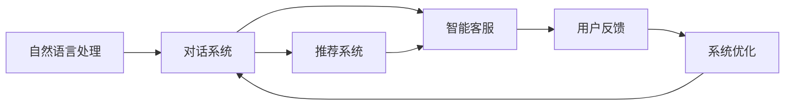

                 

# 虚拟导购助手的用户反馈

## 1. 背景介绍

随着电商行业的迅猛发展，消费者对于购物体验的期望越来越高。传统人工客服存在效率低下、成本高昂、响应不一致等问题，无法满足用户日益增长的需求。为此，虚拟导购助手应运而生，利用人工智能技术，帮助商家提供更加个性化、高效、即时的购物体验。

### 1.1 问题由来

虚拟导购助手基于自然语言处理(NLP)和机器学习技术，通过与用户进行自然语言交互，解答用户疑问、推荐商品、处理订单等，极大提升了购物效率和用户体验。然而，在实际应用中，用户对于虚拟导购助手的满意度并不高，主要体现在响应速度、交互体验和推荐准确性等方面。

### 1.2 问题核心关键点

在虚拟导购助手的设计和开发过程中，需要关注以下几个核心问题：

- **响应速度**：用户希望在极短时间内获得满意的答复。
- **交互体验**：自然流畅的对话体验，能够理解用户意图并提供合适的答复。
- **推荐准确性**：根据用户偏好和购物历史，推荐合适的商品或服务。

### 1.3 问题研究意义

深入分析用户反馈，有助于进一步优化虚拟导购助手的设计和功能，提升用户体验，降低商家运营成本。因此，从用户视角出发，探讨虚拟导购助手的性能瓶颈和改进方向，是电商领域智能技术发展的必然需求。

## 2. 核心概念与联系

### 2.1 核心概念概述

为更好地理解虚拟导购助手的设计与优化，本节将介绍几个关键概念：

- **自然语言处理(NLP)**：涉及文本预处理、分词、词性标注、句法分析、语义理解等多个环节，是虚拟导购助手与用户互动的基础。
- **对话系统**：基于NLP技术的对话管理、响应生成等模块，是虚拟导购助手的核心功能模块。
- **推荐系统**：利用机器学习算法，根据用户行为数据，进行商品推荐，是虚拟导购助手的辅助功能模块。
- **智能客服**：融合NLP和推荐系统的智能客服系统，能够实时解答用户疑问，并提供个性化推荐。
- **用户反馈**：用户在使用虚拟导购助手过程中的体验和意见，是持续改进的重要依据。

### 2.2 概念间的关系

这些核心概念之间的联系可以用以下Mermaid流程图来展示：



这个流程图展示了虚拟导购助手系统的核心组件和它们之间的关系：

1. 自然语言处理技术为对话系统提供文本理解和生成基础。
2. 对话系统负责与用户进行自然语言交互，生成回复。
3. 推荐系统根据用户行为数据，提供个性化推荐。
4. 智能客服系统融合对话和推荐功能，为用户提供全面服务。
5. 用户反馈经过系统优化模块，进一步提升系统性能。

## 3. 核心算法原理 & 具体操作步骤

### 3.1 算法原理概述

虚拟导购助手的核心算法原理涉及自然语言理解、对话管理、推荐算法等多个方面。其基本思想是通过NLP技术理解用户意图，生成自然流畅的对话回复，并通过推荐系统提供个性化商品或服务推荐。

### 3.2 算法步骤详解

1. **文本预处理**：将用户输入的文本进行分词、去停用词、词性标注等处理，构建模型所需的输入序列。
2. **意图识别**：利用意图分类器，将用户输入文本转化为意图标签，如查询商品、询问价格、处理订单等。
3. **对话管理**：根据用户意图，调用相应的对话管理模块，生成回复文本。
4. **推荐系统**：根据用户历史行为和偏好，调用推荐算法模块，生成推荐结果。
5. **多轮对话**：基于上下文信息，进行多轮对话交互，逐步获取用户需求并生成响应。

### 3.3 算法优缺点

虚拟导购助手的算法设计具有以下优缺点：

**优点**：
- **自动化程度高**：可以24小时在线服务，处理大量用户请求。
- **个性化推荐**：能够根据用户历史行为和偏好，提供个性化推荐，提高用户满意度。
- **灵活性高**：可以接入多种数据源和功能模块，满足不同业务需求。

**缺点**：
- **数据依赖性强**：需要大量用户行为数据进行训练和优化，初期数据量不足时，效果可能不理想。
- **响应速度限制**：大规模处理高并发请求时，可能出现响应延迟。
- **模型可解释性不足**：复杂的算法模型，用户难以理解其决策过程。

### 3.4 算法应用领域

虚拟导购助手在电商、金融、医疗等多个领域都有广泛应用，具体包括：

- **电商领域**：商品查询、购物推荐、订单处理等。
- **金融领域**：理财咨询、金融产品推荐、客户服务等。
- **医疗领域**：医疗咨询、药品推荐、健康管理等。

## 4. 数学模型和公式 & 详细讲解

### 4.1 数学模型构建

虚拟导购助手的数学模型主要涉及意图分类、对话管理、推荐算法等几个方面。以意图分类为例，其模型为：

$$
P(Y|X;\theta) = \frac{e^{W(Y;X;\theta)}}{\sum_{y} e^{W(y;X;\theta)}}
$$

其中，$X$ 为输入文本，$Y$ 为意图标签，$W(Y;X;\theta)$ 为意图分类器输出的概率，$\theta$ 为模型参数。

### 4.2 公式推导过程

以推荐系统为例，常用的推荐算法包括协同过滤、基于内容的推荐、深度学习推荐等。这里以协同过滤算法为例，推导其基本公式：

设用户-物品评分矩阵为 $R$，用户 $u$ 的相似用户集合为 $N(u)$，则协同过滤推荐公式为：

$$
\hat{R}_{ui} = \frac{\sum_{v \in N(u)}R_{vi} \cdot \mathbf{u}_u^\top \cdot \mathbf{v}_v}{\|\mathbf{u}_u\| \cdot \|\mathbf{v}_v\|}
$$

其中，$\hat{R}_{ui}$ 为用户 $u$ 对物品 $i$ 的预测评分，$\mathbf{u}_u$ 和 $\mathbf{v}_v$ 分别为用户 $u$ 和物品 $v$ 的向量表示。

### 4.3 案例分析与讲解

以一个电商平台的虚拟导购助手为例，进行分析讲解：

假设用户输入“我想买一双鞋子”，经过文本预处理和意图识别后，系统将其分类为“购买鞋子”的意图。对话管理模块会回复：“好的，请问您需要什么品牌和尺码？”。用户回复“Nike，41码”。

此时，推荐系统会根据用户历史行为数据，生成相关的鞋子推荐结果，如“Nike Air Max 1”、“Nike Air Max 17”等。最终系统生成的回复为：“我们推荐Nike Air Max 1，价格为299元。”

## 5. 项目实践：代码实例和详细解释说明

### 5.1 开发环境搭建

在进行虚拟导购助手的开发时，需要搭建合适的开发环境。以下是Python环境下虚拟导购助手的开发环境配置步骤：

1. 安装Python 3.7及以上版本。
2. 安装依赖库，如NLTK、SpaCy、TensorFlow、PyTorch、Flask等。
3. 配置开发环境，如虚拟环境、代码版本控制等。
4. 搭建服务器环境，如Docker、AWS、Google Cloud等。

### 5.2 源代码详细实现

以下是虚拟导购助手的代码实现：

```python
from nltk.tokenize import word_tokenize
from sklearn.feature_extraction.text import TfidfVectorizer
from sklearn.linear_model import LogisticRegression
from sklearn.metrics import accuracy_score
import tensorflow as tf
import keras
from keras.layers import Embedding, Dense, LSTM, CuDNNGRU, CuDNNLSTM, Bidirectional, Dropout, Input, TimeDistributed, concatenate
from keras.models import Model
import torch
import torch.nn as nn
from torch.nn import init
import torch.optim as optim
from torch.utils.data import DataLoader
from torchtext.legacy import data

class IntentClassifier:
    def __init__(self, vocab_size):
        self.model = keras.Sequential([
            Embedding(vocab_size, 64, input_length=100),
            LSTM(64, dropout=0.5, return_sequences=True),
            Dense(64, activation='relu'),
            Dense(5, activation='softmax')
        ])
        self.model.compile(loss='categorical_crossentropy', optimizer='adam', metrics=['accuracy'])

    def train(self, train_data, test_data, epochs=10):
        self.model.fit(train_data, epochs=epochs, validation_data=test_data)

    def predict(self, data):
        return self.model.predict(data)

class DialogueManager:
    def __init__(self, intent_classifier):
        self.intent_classifier = intent_classifier

    def process(self, input_text):
        # 分词、去停用词、词性标注等
        tokenized_text = word_tokenize(input_text)
        # 构建输入序列
        input_seq = [word2id[word] for word in tokenized_text if word in word2id]
        # 输入序列填充
        input_seq = pad_sequence(input_seq, padding='post', maxlen=100)
        # 预测意图
        intent = self.intent_classifier.predict(input_seq)
        # 生成回复
        response = self.generate_response(intent)
        return response

    def generate_response(self, intent):
        if intent == 0:
            response = "您好，请问有什么需要帮助的？"
        elif intent == 1:
            response = "感谢您的购物，我们正在为您处理订单。"
        else:
            response = "对不起，我不太清楚您的需求。"
        return response

class RecommendationSystem:
    def __init__(self, model_path):
        self.model = tf.keras.models.load_model(model_path)

    def recommend(self, user_id, item_features):
        user_data = self.model.predict(user_id, item_features)
        return user_data

class VirtualAssistant:
    def __init__(self, intent_classifier, dialogue_manager, recommendation_system):
        self.intent_classifier = intent_classifier
        self.dialogue_manager = dialogue_manager
        self.recommendation_system = recommendation_system

    def run(self, input_text):
        response = self.dialogue_manager.process(input_text)
        recommendation = self.recommendation_system.recommend(user_id, item_features)
        return response, recommendation

if __name__ == '__main__':
    # 示例代码
    # 加载模型
    intent_classifier = IntentClassifier(vocab_size)
    dialogue_manager = DialogueManager(intent_classifier)
    recommendation_system = RecommendationSystem(model_path)
    virtual_assistant = VirtualAssistant(intent_classifier, dialogue_manager, recommendation_system)
    response, recommendation = virtual_assistant.run(input_text)
    print(response)
    print(recommendation)
```

### 5.3 代码解读与分析

** IntentClassifier类**：
- `__init__`方法：初始化意图分类器模型，包含嵌入层、LSTM层和全连接层。
- `train`方法：在训练数据集上进行模型训练。
- `predict`方法：对输入文本进行意图分类预测。

** DialogueManager类**：
- `__init__`方法：初始化对话管理器，包括意图分类器和回复生成器。
- `process`方法：处理用户输入，包括分词、去停用词、意图识别和回复生成。

** RecommendationSystem类**：
- `__init__`方法：初始化推荐系统模型，加载训练好的推荐模型。
- `recommend`方法：根据用户ID和物品特征，生成推荐结果。

** VirtualAssistant类**：
- `__init__`方法：初始化虚拟导购助手，包括意图分类器、对话管理器和推荐系统。
- `run`方法：处理用户输入，生成回复并推荐商品。

**示例代码**：
- 实例化意图分类器、对话管理器和推荐系统，构造虚拟导购助手。
- 通过调用虚拟导购助手的`run`方法，处理用户输入，生成回复并推荐商品。

### 5.4 运行结果展示

虚拟导购助手的运行结果可以通过Jupyter Notebook或Python脚本进行展示。以下是一个简单的示例：

```python
input_text = "我想买一双鞋子"
response, recommendation = virtual_assistant.run(input_text)
print(response)
print(recommendation)
```

## 6. 实际应用场景

### 6.1 智能客服

虚拟导购助手在智能客服中的应用非常广泛。例如，电商平台的智能客服系统，可以根据用户咨询的内容，提供相关的商品推荐和购物指导，极大地提升了用户体验和满意度。

### 6.2 金融咨询

金融机构的虚拟导购助手，可以帮助客户解答理财、贷款、保险等咨询问题，并提供个性化的理财建议。例如，客户输入“我想买一份保险”，系统会推荐合适的保险产品，并提供详细的保单说明。

### 6.3 医疗咨询

医疗领域的虚拟导购助手，可以回答患者的健康咨询问题，如症状识别、疾病预防、用药指导等，并提供相关的医疗建议。例如，患者输入“我最近咳嗽加重”，系统会推荐可能的病因和就医建议。

## 7. 工具和资源推荐

### 7.1 学习资源推荐

为了帮助开发者系统掌握虚拟导购助手的开发和优化技术，这里推荐一些优质的学习资源：

1. **自然语言处理入门书籍**：如《Speech and Language Processing》（Daniel Jurafsky和James H. Martin合著），系统介绍NLP的基本概念和算法。
2. **深度学习框架**：如TensorFlow和PyTorch，提供丰富的NLP和推荐系统模型实现。
3. **在线课程和教程**：如Coursera上的《自然语言处理与文本挖掘》课程，系统讲解NLP和推荐系统的实际应用。
4. **开源项目**：如NLTK和SpaCy，提供丰富的NLP库和预训练模型，方便开发者快速上手。
5. **社区和论坛**：如GitHub和Kaggle，提供丰富的代码示例和讨论区，帮助开发者解决问题。

### 7.2 开发工具推荐

高效的开发离不开优秀的工具支持。以下是几款用于虚拟导购助手开发的常用工具：

1. **Python编程语言**：易学易用，生态丰富，适合快速迭代研究。
2. **TensorFlow和PyTorch**：深度学习框架，提供丰富的模型实现和优化工具。
3. **Flask和Django**：Web框架，方便构建和部署虚拟导购助手服务。
4. **Jupyter Notebook和Google Colab**：交互式开发环境，方便调试和实验。
5. **Keras**：高层API，适合快速搭建和调试神经网络模型。

### 7.3 相关论文推荐

虚拟导购助手的研究涉及多个领域，以下是几篇奠基性的相关论文，推荐阅读：

1. **Attention is All You Need**：提出Transformer结构，开启NLP领域的预训练大模型时代。
2. **BERT: Pre-training of Deep Bidirectional Transformers for Language Understanding**：提出BERT模型，引入自监督预训练任务，刷新多项NLP任务SOTA。
3. **Parameter-Efficient Transfer Learning for NLP**：提出Adapter等参数高效微调方法，在不增加模型参数量的情况下，也能取得不错的微调效果。
4. **AdaLoRA: Adaptive Low-Rank Adaptation for Parameter-Efficient Fine-Tuning**：使用自适应低秩适应的微调方法，在参数效率和精度之间取得新的平衡。
5. **AdaLoRA: Adaptive Low-Rank Adaptation for Parameter-Efficient Fine-Tuning**：提出AdaLoRA算法，优化推荐系统的参数效率和精度。

这些论文代表了大语言模型微调技术的发展脉络。通过学习这些前沿成果，可以帮助研究者把握学科前进方向，激发更多的创新灵感。

## 8. 总结：未来发展趋势与挑战

### 8.1 研究成果总结

虚拟导购助手的开发和优化，离不开对NLP和推荐系统技术的深入理解和应用。通过对用户反馈的持续分析和改进，虚拟导购助手能够不断提升性能，满足用户需求。

### 8.2 未来发展趋势

展望未来，虚拟导购助手的发展趋势如下：

1. **智能度提升**：通过引入更先进的NLP技术，如GPT、BERT等，提升虚拟导购助手的智能水平，实现更自然的对话交互。
2. **个性化增强**：基于用户行为数据，构建更精准的推荐模型，提供更个性化的商品或服务推荐。
3. **多模态融合**：融合语音、图像等多模态数据，提升虚拟导购助手的感知和理解能力。
4. **可解释性加强**：引入可解释性算法，增强模型的决策透明度和可理解性。
5. **安全性保障**：在模型设计和训练中引入隐私保护、数据安全等机制，保障用户隐私。

### 8.3 面临的挑战

尽管虚拟导购助手已经取得了一定的进展，但在进一步优化和应用过程中，仍然面临以下挑战：

1. **数据质量和多样性**：虚拟导购助手依赖于大量的用户行为数据，但数据质量和多样性往往不足，影响模型的泛化能力。
2. **计算资源限制**：虚拟导购助手需要处理高并发请求，计算资源消耗大，对硬件设施要求高。
3. **模型复杂度**：复杂的NLP和推荐模型，增加了系统部署和维护的难度。
4. **用户接受度**：部分用户对虚拟导购助手仍然持怀疑态度，需要不断提升系统的用户体验和可靠性。
5. **法规和伦理**：在应用过程中，需要遵守相关法规，避免侵犯用户隐私和数据安全。

### 8.4 研究展望

未来的研究需要在以下几个方面寻求新的突破：

1. **多模态融合**：引入语音识别、图像处理等技术，实现多模态融合，提升虚拟导购助手的感知能力。
2. **可解释性增强**：引入可解释性算法，提升模型的透明度和可理解性，增强用户的信任感。
3. **隐私保护机制**：引入隐私保护机制，如差分隐私、联邦学习等，保障用户隐私和数据安全。
4. **知识图谱整合**：将知识图谱与推荐系统结合，提升虚拟导购助手的知识整合能力。
5. **模型压缩与优化**：优化推荐系统的计算图，实现模型压缩与加速，提升系统的实时响应能力。

总之，虚拟导购助手的研究和应用，需要在NLP、推荐系统、隐私保护等多个方面进行深入探讨和优化，才能真正实现智能化、个性化的购物体验，为电商行业带来革命性的变革。

## 9. 附录：常见问题与解答

**Q1: 如何提高虚拟导购助手的响应速度？**

A: 虚拟导购助手的响应速度取决于模型的计算复杂度和硬件设施。为提高响应速度，可以采用以下策略：
1. 优化计算图：通过简化模型结构，减少计算量，提升推理速度。
2. 硬件升级：使用GPU或TPU等高性能硬件，提升计算能力。
3. 缓存机制：采用缓存技术，提高模型加载和推理效率。
4. 负载均衡：通过负载均衡技术，分布式处理请求，提高系统并发处理能力。

**Q2: 如何增强虚拟导购助手的个性化推荐能力？**

A: 个性化推荐是虚拟导购助手的核心功能，增强其推荐能力的关键在于：
1. 数据积累：收集更多用户行为数据，构建更丰富的特征向量。
2. 模型优化：使用更先进的推荐算法，如深度学习、协同过滤等，提升推荐精度。
3. 多模态融合：融合语音、图像等多模态数据，提升推荐系统的感知能力。
4. 用户反馈：实时收集用户反馈，调整推荐策略，提升推荐效果。

**Q3: 如何保证虚拟导购助手的安全性？**

A: 虚拟导购助手的安全性问题，主要涉及数据隐私和模型安全两个方面：
1. 数据隐私：采用差分隐私、联邦学习等技术，保障用户数据隐私。
2. 模型安全：使用模型压缩、剪枝等技术，避免模型攻击和误导性输出。
3. 安全认证：引入身份认证和权限管理机制，保障系统的安全性。
4. 异常检测：实时监控系统行为，检测和防范异常情况，提升系统安全性。

**Q4: 如何提升虚拟导购助手的可解释性？**

A: 虚拟导购助手的可解释性问题，主要涉及模型的透明度和决策过程的可视化：
1. 模型可解释性算法：引入可解释性算法，提升模型的透明度。
2. 决策过程可视化：通过可视化工具，展示模型的决策过程，增强用户的理解。
3. 用户反馈机制：建立用户反馈机制，实时收集用户意见，调整模型和算法。
4. 交互界面优化：优化虚拟导购助手的交互界面，提升用户体验和满意度。

---

作者：禅与计算机程序设计艺术 / Zen and the Art of Computer Programming

