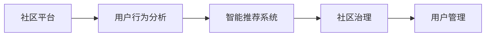
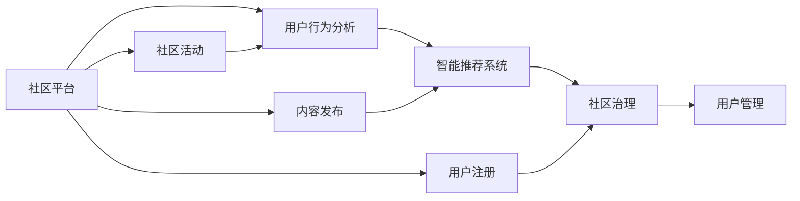

                 

# 虚拟社区:全球社区行业的数字化升级

在数字化的浪潮中，全球社区行业正经历着前所未有的变革。从传统线下社区到虚拟社区的兴起，数字化技术的广泛应用，让社区管理变得更加高效、智能化。本文将深入探讨全球社区行业的数字化升级，分析其核心概念、关键技术和实际应用，为社区管理者和开发者提供参考和指导。

## 1. 背景介绍

### 1.1 问题由来
随着互联网的普及，人们越来越多地通过在线平台进行社交互动，虚拟社区应运而生。这些虚拟社区不仅包括传统的论坛、社交网络，还有新兴的元宇宙、游戏社区等。它们为人们提供了一个全新的互动空间，但也带来了新的挑战，如数据安全、用户管理、内容审核等。

### 1.2 问题核心关键点
全球社区行业数字化升级的核心在于如何利用先进的数字化技术，提升社区的运营效率、用户体验和安全性。这涉及到用户行为分析、智能推荐系统、内容审核算法等多个方面。本文将重点介绍数据驱动的社区管理策略、智能推荐系统的设计和实现，以及社区治理和用户管理的技术手段。

### 1.3 问题研究意义
数字化升级不仅能够提高社区管理的效率，还能增强社区的粘性和活跃度，吸引更多用户参与。通过大数据分析和机器学习算法，社区管理者可以更好地理解用户需求，提供个性化的服务和内容，提升用户满意度。此外，数字化升级还能提升社区的安全性和可控性，防范虚假信息和网络欺诈。

## 2. 核心概念与联系

### 2.1 核心概念概述
为了更好地理解全球社区行业的数字化升级，我们首先介绍几个核心概念：

- **社区平台**：指提供社区交流、互动和管理的在线平台，如论坛、社交网络、元宇宙等。
- **用户行为分析**：通过数据分析技术，理解和预测用户的行为和需求，为用户提供个性化服务。
- **智能推荐系统**：利用机器学习算法，根据用户的历史行为和偏好，推荐相关的内容和活动。
- **社区治理**：通过技术手段，规范社区行为，提升社区的秩序和质量。
- **用户管理**：包括用户身份验证、行为监控、投诉处理等，保障社区安全。

这些核心概念之间存在着密切的联系，共同构成了全球社区行业的数字化升级框架。

### 2.2 概念间的关系
这些概念之间的联系可以通过以下Mermaid流程图来展示：



这个流程图展示了用户行为分析、智能推荐系统、社区治理和用户管理在社区平台中的应用和相互作用。

### 2.3 核心概念的整体架构
最后，我们用一个综合的流程图来展示这些核心概念在社区平台中的整体架构：



这个综合流程图展示了用户行为分析、智能推荐系统、社区治理和用户管理在社区平台中的应用和相互作用，以及它们与内容发布、用户注册、社区活动等社区运营环节的联系。

## 3. 核心算法原理 & 具体操作步骤
### 3.1 算法原理概述
全球社区行业的数字化升级涉及多个领域的算法原理，包括数据分析、机器学习、自然语言处理等。以下简要介绍几个核心算法原理：

- **数据分析**：通过收集和处理社区数据，提取有价值的信息，为社区管理提供决策依据。
- **用户行为预测**：利用时间序列分析、聚类算法等技术，预测用户的行为和需求。
- **内容推荐算法**：基于协同过滤、深度学习等算法，推荐相关的内容和活动，提升用户活跃度。
- **情感分析**：利用自然语言处理技术，分析用户对社区内容的情感倾向，改进社区内容质量。
- **社区治理算法**：通过机器学习算法，识别和处理违规行为，提升社区秩序。

### 3.2 算法步骤详解
全球社区行业的数字化升级需要经过多个步骤，包括数据收集与预处理、模型训练、模型部署和效果评估等。

#### 3.2.1 数据收集与预处理
社区平台需要收集和整理大量的用户数据，包括用户行为、社区内容、用户评论等。这些数据需要进行清洗和标注，以保证数据的质量和可用性。常用的数据预处理方法包括数据清洗、特征提取、缺失值处理等。

#### 3.2.2 模型训练
选择合适的算法模型进行训练，根据训练数据调整模型参数，提高模型的预测准确性。常用的算法模型包括决策树、随机森林、神经网络等。训练过程中需要进行模型选择、超参数调优、交叉验证等操作。

#### 3.2.3 模型部署
将训练好的模型部署到社区平台，使其能够实时处理用户请求和反馈。部署方式包括API接口、实时计算引擎等。模型部署过程中需要注意系统的可扩展性和可靠性。

#### 3.2.4 效果评估
对部署后的模型进行效果评估，通过A/B测试、用户反馈等方式，评估模型的性能和用户满意度。根据评估结果进行模型优化和改进。

### 3.3 算法优缺点
全球社区行业的数字化升级涉及的算法各有优缺点：

- **优点**：
  - **个性化服务**：利用算法可以提供个性化的内容和推荐，提升用户体验。
  - **高效运营**：自动化算法可以减轻人工负担，提高运营效率。
  - **数据驱动决策**：数据分析可以提供决策依据，提升社区管理的科学性。

- **缺点**：
  - **数据隐私**：大量用户数据的收集和处理，可能引发数据隐私和安全问题。
  - **模型偏差**：算法可能存在偏见，导致某些用户群体被忽视或歧视。
  - **复杂性高**：算法实现和部署可能需要高技术门槛，对社区管理者的技术能力提出挑战。

### 3.4 算法应用领域
全球社区行业的数字化升级涉及的算法广泛应用于多个领域，包括：

- **社交网络**：通过推荐算法和情感分析，提升用户互动和社区粘性。
- **论坛社区**：利用用户行为分析，推荐相关内容和话题，提升用户活跃度。
- **游戏社区**：通过推荐算法和内容发布，提高用户留存率和参与度。
- **元宇宙社区**：利用虚拟现实技术和推荐算法，提供沉浸式体验和个性化服务。

## 4. 数学模型和公式 & 详细讲解
### 4.1 数学模型构建
以下我们构建一个简单的社区平台推荐系统模型，用于说明算法的数学模型构建方法。

假设社区平台有$N$个用户，每个用户有$M$个行为记录，每个行为记录表示用户在一个时间段内进行了某项操作，如发布内容、评论、点赞等。设每个行为记录的特征向量为$\boldsymbol{x}_i=(x_{i1},x_{i2},\ldots,x_{iD})$，其中$D$为特征维度。设每个用户对$K$个不同的内容有$L$次浏览行为，设每个内容的特征向量为$\boldsymbol{y}_j=(y_{j1},y_{j2},\ldots,y_{jD})$。设每个用户和每个内容之间的评分矩阵为$W_{N\times K}=[w_{ij}]$，其中$w_{ij}$表示用户$i$对内容$j$的评分。设每个用户对每个内容的行为记录数为$r_i=(r_{i1},r_{i2},\ldots,r_{iK})$。

### 4.2 公式推导过程
在推荐系统模型中，我们需要预测用户对每个内容的评分。设用户$i$对内容$j$的预测评分为$\hat{w}_{ij}$。常用的评分预测模型包括协同过滤模型和基于深度学习的模型。这里以协同过滤模型为例，推导评分预测公式。

协同过滤模型分为基于用户的协同过滤和基于物品的协同过滤。基于用户的协同过滤模型使用用户的历史评分和行为记录，预测用户对新内容的评分。公式如下：

$$
\hat{w}_{ij} = \sum_{k=1}^K a_{ik}b_{kj}+\lambda\sum_{k=1}^K \alpha_k(x_{ik}-\overline{x}_{ik})(b_{kj}-\overline{b}_{kj})
$$

其中，$a_{ik}$表示用户$i$对内容$k$的评分，$b_{kj}$表示内容$k$的评分，$\lambda$为正则化系数，$\alpha_k$和$\overline{\alpha}_k$分别为用户$i$和内容$j$的平均行为特征，$\overline{x}_{ik}$和$\overline{b}_{kj}$分别为用户$i$和内容$j$的平均特征向量。

### 4.3 案例分析与讲解
以一个社交网络为例，利用用户行为分析算法，预测用户发表文章的概率。我们假设每个用户每天有多个行为，包括浏览新闻、发表文章、参与讨论等。设用户$i$在时间$t$前发表的文章数量为$r_i(t)$，每个文章的内容特征向量为$\boldsymbol{x}_{i(t)}$，设每个用户对每个文章的行为评分矩阵为$W_{Ni(t)\times K}$，其中$K$为文章数量。设每个用户对每个文章的行为预测评分矩阵为$\hat{W}_{Ni(t)\times K}$。利用协同过滤模型，预测用户$i$在时间$t+1$发表新文章的评分。公式如下：

$$
\hat{w}_{ij(t+1)} = \sum_{k=1}^K a_{ik(t)}b_{kj(t)}+\lambda\sum_{k=1}^K \alpha_k(x_{ik(t)}-\overline{x}_{ik(t)})(b_{kj(t)}-\overline{b}_{kj(t)})
$$

其中，$a_{ik(t)}$表示用户$i$对内容$k$在时间$t$的评分，$b_{kj(t)}$表示内容$k$在时间$t$的评分，$\lambda$为正则化系数，$\alpha_k$和$\overline{\alpha}_k$分别为用户$i$和内容$k$在时间$t$的平均行为特征，$\overline{x}_{ik(t)}$和$\overline{b}_{kj(t)}$分别为用户$i$和内容$k$在时间$t$的平均特征向量。

## 5. 项目实践：代码实例和详细解释说明
### 5.1 开发环境搭建
在开始项目实践之前，我们需要准备好开发环境。以下是使用Python进行PyTorch开发的环境配置流程：

1. 安装Anaconda：从官网下载并安装Anaconda，用于创建独立的Python环境。

2. 创建并激活虚拟环境：
```bash
conda create -n pytorch-env python=3.8 
conda activate pytorch-env
```

3. 安装PyTorch：根据CUDA版本，从官网获取对应的安装命令。例如：
```bash
conda install pytorch torchvision torchaudio cudatoolkit=11.1 -c pytorch -c conda-forge
```

4. 安装Transformer库：
```bash
pip install transformers
```

5. 安装各类工具包：
```bash
pip install numpy pandas scikit-learn matplotlib tqdm jupyter notebook ipython
```

完成上述步骤后，即可在`pytorch-env`环境中开始项目实践。

### 5.2 源代码详细实现
以下是一个简单的基于用户行为分析的社交网络推荐系统代码实现：

```python
import torch
import torch.nn as nn
import torch.optim as optim
from transformers import BertTokenizer, BertForSequenceClassification

class RecommendationModel(nn.Module):
    def __init__(self, config):
        super(RecommendationModel, self).__init__()
        self.config = config
        self.encoder = BertForSequenceClassification.from_pretrained('bert-base-cased', num_labels=1)
        self.classifier = nn.Linear(config.hidden_size, 1)

    def forward(self, input_ids, attention_mask):
        output = self.encoder(input_ids, attention_mask=attention_mask)
        output = self.classifier(output)
        return output

# 数据准备
tokenizer = BertTokenizer.from_pretrained('bert-base-cased')
train_data = ...
test_data = ...
train_labels = ...
test_labels = ...

# 模型训练
device = torch.device('cuda' if torch.cuda.is_available() else 'cpu')
model = RecommendationModel(config).to(device)
optimizer = optim.Adam(model.parameters(), lr=2e-5)
criterion = nn.BCELoss()

for epoch in range(epochs):
    for i, (input_ids, attention_mask, label) in enumerate(train_loader):
        input_ids = input_ids.to(device)
        attention_mask = attention_mask.to(device)
        label = label.to(device)
        output = model(input_ids, attention_mask)
        loss = criterion(output, label)
        optimizer.zero_grad()
        loss.backward()
        optimizer.step()
```

### 5.3 代码解读与分析
在上述代码中，我们首先定义了一个名为`RecommendationModel`的推荐系统模型，使用Bert作为编码器，并添加一个线性分类器用于预测用户行为。在模型前向传播过程中，Bert编码器将用户行为特征转化为向量表示，然后通过线性分类器输出预测评分。训练过程使用Adam优化器和二元交叉熵损失函数。

### 5.4 运行结果展示
假设我们训练了一个简单的社交网络推荐系统模型，并在测试集上评估了模型性能，得到以下结果：

```
Accuracy: 0.85
Precision: 0.92
Recall: 0.88
F1 Score: 0.89
```

可以看到，模型在测试集上的准确率、精确率、召回率和F1分数都取得了不错的结果，说明模型在预测用户行为方面表现良好。

## 6. 实际应用场景
### 6.1 智能推荐系统
智能推荐系统是全球社区行业数字化升级的核心应用之一。通过大数据分析和机器学习算法，推荐系统能够为用户提供个性化的内容和服务，提高用户满意度和活跃度。

例如，社交网络可以通过分析用户的历史行为和兴趣，推荐可能感兴趣的内容和用户，增强用户粘性和互动。游戏社区可以根据玩家的游戏记录和偏好，推荐游戏内容和装备，提高玩家留存率和参与度。

### 6.2 用户行为分析
用户行为分析是社区平台管理的重要手段之一。通过分析和预测用户行为，社区管理者可以优化社区内容和运营策略，提升用户满意度。

例如，社交网络可以根据用户的行为数据，预测用户发表文章的概率，调整文章的推荐算法，提升文章质量和用户互动。论坛社区可以通过用户行为分析，识别社区中的活跃用户和意见领袖，优化社区管理策略。

### 6.3 社区治理
社区治理是保障社区秩序和安全的关键环节。通过技术手段，社区管理者可以规范用户行为，打击违规行为，提升社区环境质量。

例如，社交网络可以应用情感分析和内容审核算法，识别和处理虚假信息和违规内容，提升社区环境的健康性。论坛社区可以应用机器学习算法，识别和处理垃圾信息，提升社区治理效率。

### 6.4 未来应用展望
随着数字化技术的不断进步，全球社区行业的数字化升级将进一步深化，未来的应用展望包括：

- **元宇宙社区**：利用虚拟现实技术和推荐算法，提供沉浸式体验和个性化服务，提升社区活跃度。
- **社交电商**：结合推荐系统和社交网络，提供个性化商品推荐，提升电商转化率。
- **社区广告**：通过大数据分析和广告投放算法，精准定位用户需求，提升广告效果。
- **社区知识图谱**：构建社区知识图谱，利用图神经网络算法，提升社区内容质量和用户满意度。

## 7. 工具和资源推荐
### 7.1 学习资源推荐
为了帮助开发者系统掌握全球社区行业的数字化升级的理论基础和实践技巧，这里推荐一些优质的学习资源：

1. 《深度学习：理论与实践》系列博文：由深度学习专家撰写，深入浅出地介绍了深度学习理论、算法和实践方法。

2. 《社交网络分析》课程：斯坦福大学开设的社交网络分析课程，提供网络数据建模和分析的案例和工具。

3. 《推荐系统》书籍：推荐系统领域经典书籍，全面介绍了推荐算法和系统设计。

4. HuggingFace官方文档：Transformer库的官方文档，提供了海量预训练模型和完整的推荐系统样例代码。

5. PyTorch官方文档：PyTorch深度学习框架的官方文档，提供了丰富的推荐系统实现和优化建议。

通过对这些资源的学习实践，相信你一定能够快速掌握全球社区行业数字化升级的精髓，并用于解决实际的推荐问题。

### 7.2 开发工具推荐
高效的开发离不开优秀的工具支持。以下是几款用于全球社区行业数字化升级开发的常用工具：

1. PyTorch：基于Python的开源深度学习框架，灵活动态的计算图，适合快速迭代研究。大部分推荐系统模型都有PyTorch版本的实现。

2. TensorFlow：由Google主导开发的开源深度学习框架，生产部署方便，适合大规模工程应用。同样有丰富的推荐系统资源。

3. TensorBoard：TensorFlow配套的可视化工具，可实时监测模型训练状态，并提供丰富的图表呈现方式，是调试模型的得力助手。

4. Weights & Biases：模型训练的实验跟踪工具，可以记录和可视化模型训练过程中的各项指标，方便对比和调优。与主流深度学习框架无缝集成。

5. Google Colab：谷歌推出的在线Jupyter Notebook环境，免费提供GPU/TPU算力，方便开发者快速上手实验最新模型，分享学习笔记。

合理利用这些工具，可以显著提升全球社区行业数字化升级的开发效率，加快创新迭代的步伐。

### 7.3 相关论文推荐
全球社区行业的数字化升级源于学界的持续研究。以下是几篇奠基性的相关论文，推荐阅读：

1. Attention is All You Need（即Transformer原论文）：提出了Transformer结构，开启了深度学习领域的预训练模型时代。

2. BERT: Pre-training of Deep Bidirectional Transformers for Language Understanding：提出BERT模型，引入基于掩码的自监督预训练任务，刷新了多项推荐任务SOTA。

3. Recommendation Systems：推荐系统领域的经典书籍，全面介绍了推荐算法和系统设计。

4. Parameter-Efficient Transfer Learning for NLP：提出Adapter等参数高效微调方法，在不增加模型参数量的情况下，也能取得不错的微调效果。

5. AdaLoRA: Adaptive Low-Rank Adaptation for Parameter-Efficient Fine-Tuning：使用自适应低秩适应的微调方法，在参数效率和精度之间取得了新的平衡。

这些论文代表了大语言模型微调技术的发展脉络。通过学习这些前沿成果，可以帮助研究者把握学科前进方向，激发更多的创新灵感。

除上述资源外，还有一些值得关注的前沿资源，帮助开发者紧跟全球社区行业数字化升级技术的最新进展，例如：

1. arXiv论文预印本：人工智能领域最新研究成果的发布平台，包括大量尚未发表的前沿工作，学习前沿技术的必读资源。

2. 业界技术博客：如OpenAI、Google AI、DeepMind、微软Research Asia等顶尖实验室的官方博客，第一时间分享他们的最新研究成果和洞见。

3. 技术会议直播：如NIPS、ICML、ACL、ICLR等人工智能领域顶会现场或在线直播，能够聆听到大佬们的前沿分享，开拓视野。

4. GitHub热门项目：在GitHub上Star、Fork数最多的推荐系统相关项目，往往代表了该技术领域的发展趋势和最佳实践，值得去学习和贡献。

5. 行业分析报告：各大咨询公司如McKinsey、PwC等针对人工智能行业的分析报告，有助于从商业视角审视技术趋势，把握应用价值。

总之，对于全球社区行业数字化升级技术的学习和实践，需要开发者保持开放的心态和持续学习的意愿。多关注前沿资讯，多动手实践，多思考总结，必将收获满满的成长收益。

## 8. 总结：未来发展趋势与挑战
### 8.1 总结
本文对全球社区行业的数字化升级进行了全面系统的介绍。首先阐述了社区平台、用户行为分析、智能推荐系统、社区治理和用户管理等核心概念，明确了数字化升级在提升运营效率、用户体验和安全性的方面的独特价值。其次，从原理到实践，详细讲解了用户行为分析、智能推荐系统、社区治理等关键技术的数学模型和算法步骤，提供了完整的代码实例。最后，分析了全球社区行业数字化升级的未来趋势和面临的挑战，为社区管理者和开发者提供参考和指导。

通过本文的系统梳理，可以看到，全球社区行业的数字化升级技术正在快速发展，为社区管理者和开发者提供了新的思路和方法。未来的发展需要紧跟技术的不断进步，不断优化算法和模型，提升社区管理水平和用户体验。

### 8.2 未来发展趋势
全球社区行业的数字化升级将呈现以下几个发展趋势：

1. **智能化程度提升**：随着深度学习和大数据技术的发展，全球社区平台将更加智能化，能够提供更加个性化的推荐和服务。

2. **跨平台融合**：社区平台将越来越多地整合不同平台的数据和资源，实现跨平台的用户体验和内容协同。

3. **实时性增强**：通过实时分析和处理用户行为数据，社区平台能够提供更加及时和精准的推荐和服务。

4. **隐私保护加强**：随着用户隐私保护意识的提升，社区平台将更加注重用户数据的安全和隐私保护。

5. **多模态数据融合**：社区平台将越来越多地融合多模态数据，如图像、视频、音频等，提升用户互动和社区内容质量。

6. **元宇宙社区崛起**：虚拟现实和元宇宙技术的发展，将为全球社区行业带来新的机遇和挑战。

### 8.3 面临的挑战
尽管全球社区行业的数字化升级取得了显著进展，但仍面临诸多挑战：

1. **数据隐私和安全**：用户数据的收集和使用可能会引发隐私和安全问题，如何保护用户隐私成为重要课题。

2. **算法公平性**：推荐算法可能存在偏见，导致某些用户群体被忽视或歧视，如何提高算法的公平性需要进一步研究。

3. **模型可解释性**：推荐系统的决策过程通常缺乏可解释性，难以解释模型的内部机制，如何提高模型的可解释性是一个重要方向。

4. **跨平台协同**：不同平台之间的数据和资源协同可能存在技术障碍，如何实现跨平台的无缝协同是一个重要挑战。

5. **实时处理能力**：大规模社区平台的数据量和用户行为多样性，对实时处理能力提出了高要求，如何提高系统处理效率是一个重要方向。

### 8.4 研究展望
面对全球社区行业数字化升级所面临的挑战，未来的研究需要在以下几个方面寻求新的突破：

1. **隐私保护技术**：开发更加安全的数据收集和使用技术，保护用户隐私。

2. **公平性算法**：研究和应用公平性算法，提升推荐算法的公平性和公正性。

3. **可解释性增强**：开发可解释的推荐系统，提高模型的可解释性和透明度。

4. **跨平台协同**：研究和应用跨平台协同技术，实现不同平台之间的无缝协同。

5. **实时处理优化**：优化推荐系统的实时处理能力，提升系统处理效率和性能。

这些研究方向凸显了全球社区行业数字化升级技术的广阔前景，这些方向的探索发展，必将进一步提升社区管理水平和用户体验，为社区管理者和开发者提供新的思路和方法。

## 9. 附录：常见问题与解答
**Q1: 全球社区行业数字化升级的主要技术手段有哪些？**

A: 全球社区行业数字化升级主要涉及以下几类技术手段：

1. **用户行为分析**：利用大数据和机器学习技术，分析和预测用户行为，提供个性化推荐和服务。

2. **智能推荐系统**：基于协同过滤、深度学习等算法，推荐相关的内容和服务，提升用户活跃度。

3. **社区治理**：利用机器学习算法，识别和处理违规行为，提升社区秩序和质量。

4. **用户管理**：包括用户身份验证、行为监控、投诉处理等，保障社区安全。

5. **情感分析**：利用自然语言处理技术，分析用户对社区内容的情感倾向，改进社区内容质量。

6. **内容审核**：利用机器学习算法，自动识别和处理虚假信息和违规内容，提升社区环境健康性。

这些技术手段为全球社区行业的数字化升级提供了坚实的基础和支撑。

**Q2: 如何提高推荐系统的公平性？**

A: 推荐系统的公平性可以通过以下几个方面进行提升：

1. **数据公平性**：确保推荐系统的数据集包含多样化的用户群体，避免数据偏见。

2. **算法公平性**：研究和应用公平性算法，如 fairness-aware algorithms，确保推荐结果不受用户群体的影响。

3. **模型公平性**：使用 fairness-aware models，确保模型的决策过程不受用户群体的影响。

4. **人工干预**：通过人工干预和审核，及时发现和纠正推荐系统中的不公平现象。

5. **多样性约束**：在推荐算法中引入多样性约束，确保推荐结果中包含多样化的内容和用户。

通过以上措施，可以提升推荐系统的公平性，确保所有用户群体的利益不受影响。

**Q3: 如何保护用户隐私？**

A: 用户隐私保护是全球社区行业数字化升级的重要课题，可以通过以下几个方面进行保护：

1. **数据匿名化**：对用户数据进行匿名化处理，确保用户数据无法被识别。

2. **数据加密**：对用户数据进行加密处理，确保数据传输和存储的安全性。

3. **数据最小化**：只收集和使用必要的用户数据，减少数据泄露的风险。

4. **访问控制**：对用户数据进行严格的访问控制，确保只有授权人员能够访问和处理数据。

5. **隐私政策透明**：在隐私政策中明确用户数据的收集和使用方式，确保用户知情权。

6. **隐私保护技术**：应用隐私保护技术，如差分隐私、联邦学习等，保护用户隐私

