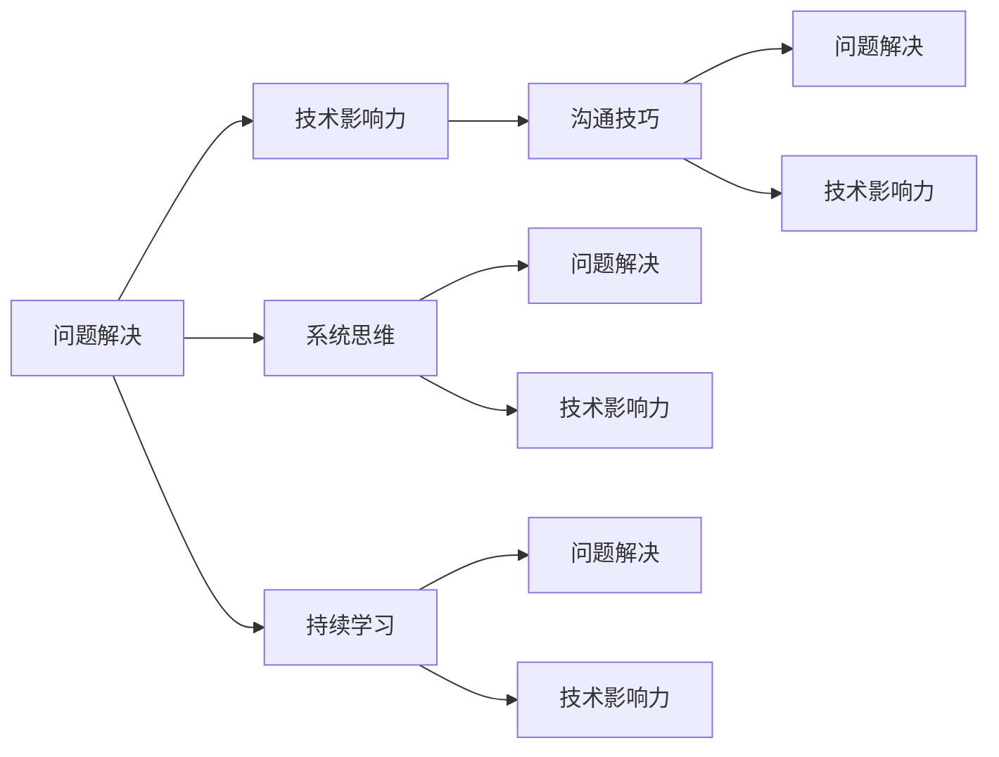

                 

# 解决问题与建立牢固关系的方法

在技术领域，解决问题和建立牢固关系是两个核心议题。解决复杂问题需要深厚的知识积累和精细的技术手段，而建立牢固的关系则依赖于出色的沟通能力和敏锐的洞察力。本文将从这两个方面深入探讨，展示如何通过解决问题提升技术能力，并通过建立牢固关系拓展技术影响力。

## 1. 背景介绍

### 1.1 问题由来

在信息化高速发展的今天，技术问题无处不在。从软件开发、数据分析到人工智能，每个领域都有其特有的技术难题需要解决。与此同时，随着技术栈的多样化，技术的相互依存性越来越高，单打独斗的模式已经难以适应复杂多变的技术环境。

### 1.2 问题核心关键点

面对复杂技术问题，我们需要关注以下核心关键点：

- **问题定义**：清晰明确地定义问题，避免模糊不清或过于宽泛的描述。
- **问题分类**：根据问题的性质进行分类，如算法问题、数据问题、部署问题等，有助于快速定位解决路径。
- **解决方案**：提出可行的解决方案，包括技术手段、工具、流程等，需经过验证和测试。
- **沟通协调**：通过良好的沟通与协调，将解决方案转化为实际的执行方案，确保团队协作顺畅。
- **持续优化**：随着技术发展，解决方案需要不断更新迭代，保持其时效性和适应性。

### 1.3 问题研究意义

解决技术问题不仅能提升个人技术水平，还能增强团队的协作能力，提升技术影响力。通过解决技术问题，技术专家可以在团队内部树立威信，通过建立牢固关系，可以将自己的技术见解和知识传递给更多人群，共同推进技术发展。

## 2. 核心概念与联系

### 2.1 核心概念概述

- **问题解决**：通过识别问题、分析问题、设计方案、实施方案、评估效果等步骤，将问题转化为可执行的技术方案。
- **技术影响力**：通过分享技术见解、参与技术社区、建立技术网络等途径，扩大技术影响力和覆盖面。
- **沟通技巧**：包括倾听、表达、反馈、协调等，是解决问题和建立关系的关键手段。
- **系统思维**：全面、综合地看待问题，考虑问题背后的人、事、物、环境等复杂因素，避免单一视角带来的局限性。
- **持续学习**：技术日新月异，持续学习新技术、新方法，保持自身技术能力的先进性和实用性。

### 2.2 概念间的关系

这些核心概念通过一系列的联系，构成了解决问题与建立关系的技术生态系统。通过问题解决，技术专家能够不断提升自己的技术能力；通过建立牢固关系，技术专家可以更广泛地传播自己的技术知识，形成良性循环，进一步推动技术发展。

以下是一个综合的Mermaid流程图，展示这些概念之间的联系：



这个流程图展示了问题解决与技术影响力、沟通技巧、系统思维和持续学习之间的关系：

- **问题解决**与**技术影响力**相互促进，通过解决问题提升技术能力，通过建立关系传播技术知识。
- **沟通技巧**是解决问题和建立关系的基础，良好的沟通能够确保问题解决的顺利进行和关系的稳固。
- **系统思维**有助于全面、综合地理解问题，避免单一视角带来的局限性，提升问题解决的效率和效果。
- **持续学习**确保技术专家始终处于技术前沿，能够应对不断变化的技术挑战，推动技术发展。

## 3. 核心算法原理 & 具体操作步骤

### 3.1 算法原理概述

基于问题的不同性质，解决问题的算法原理和操作步骤也有所差异。以下以算法问题为例，展示其算法原理和具体操作步骤。

### 3.2 算法步骤详解

#### 3.2.1 算法原理概述

算法问题的解决主要依赖于程序设计、数据结构、算法分析等基础知识。通过精确的定义问题，选择合适的算法，进行代码实现和测试，最终得到问题的解决方案。

#### 3.2.2 算法步骤详解

1. **问题定义**：明确问题描述和目标，如排序问题、查找问题等。
2. **算法选择**：根据问题的性质选择合适的算法，如分治算法、动态规划等。
3. **代码实现**：将算法逻辑转化为代码，实现具体的求解过程。
4. **测试验证**：对代码进行单元测试、集成测试，确保其正确性和鲁棒性。
5. **性能优化**：对代码进行性能分析和优化，提升执行效率。

### 3.3 算法优缺点

算法问题解决的优势在于其精确性和可重复性，但同时也存在以下缺点：

- **复杂度高**：某些算法问题需要复杂的数据结构和算法设计，对于缺乏经验的技术专家可能较难掌握。
- **调试困难**：算法问题往往需要较长的调试时间，尤其是当问题出现死循环或运行时间过长时。
- **缺乏灵活性**：算法问题的解决方案相对固定，难以应对多变的问题环境。

### 3.4 算法应用领域

算法问题解决广泛应用于软件开发、数据分析、人工智能等多个领域。以下是几个典型应用领域：

- **软件开发**：如编码调试、代码优化、性能分析等。
- **数据分析**：如数据清洗、数据挖掘、数据可视化等。
- **人工智能**：如模型训练、参数调整、优化算法等。

## 4. 数学模型和公式 & 详细讲解 & 举例说明

### 4.1 数学模型构建

数学模型是解决算法问题的重要工具，通过数学公式对问题进行建模和求解，可以得到准确的解决方案。以下以排序问题为例，展示其数学模型构建过程。

### 4.2 公式推导过程

#### 4.2.1 排序问题的数学模型

假设有一组数据 $a_1, a_2, ..., a_n$，需要对其进行排序。根据排序问题的定义，我们可以使用以下数学模型：

$$
\min_{\sigma} \sum_{i=1}^n |a_i - \sigma_i|
$$

其中 $\sigma$ 为排序后的序列。

#### 4.2.2 排序问题的求解

根据上述数学模型，可以使用贪心算法、分治算法、动态规划等方法进行求解。这里以归并排序为例，展示其求解过程。

### 4.3 案例分析与讲解

#### 4.3.1 归并排序的数学模型

归并排序的核心思想是将数据分成若干个子序列，分别进行排序，然后再将已排序的子序列合并成一个有序序列。根据该思想，可以定义如下数学模型：

$$
T(n) = 2T(\frac{n}{2}) + O(n)
$$

其中 $T(n)$ 为归并排序的时间复杂度。

#### 4.3.2 归并排序的代码实现

以下是归并排序的Python代码实现：

```python
def merge_sort(arr):
    if len(arr) <= 1:
        return arr
    
    mid = len(arr) // 2
    left = merge_sort(arr[:mid])
    right = merge_sort(arr[mid:])
    return merge(left, right)

def merge(left, right):
    result = []
    i, j = 0, 0
    while i < len(left) and j < len(right):
        if left[i] <= right[j]:
            result.append(left[i])
            i += 1
        else:
            result.append(right[j])
            j += 1
    result += left[i:]
    result += right[j:]
    return result
```

## 5. 项目实践：代码实例和详细解释说明

### 5.1 开发环境搭建

要进行算法问题的解决，首先需要搭建开发环境。以下是Python开发环境搭建的详细流程：

1. 安装Anaconda：从官网下载并安装Anaconda，用于创建独立的Python环境。

2. 创建并激活虚拟环境：
```bash
conda create -n myenv python=3.9 
conda activate myenv
```

3. 安装Python核心库：
```bash
pip install numpy pandas scikit-learn matplotlib tqdm jupyter notebook ipython
```

4. 安装常用的第三方库：
```bash
pip install tensorflow pytorch transformers scikit-learn
```

### 5.2 源代码详细实现

#### 5.2.1 归并排序的Python实现

以下是归并排序的Python代码实现：

```python
def merge_sort(arr):
    if len(arr) <= 1:
        return arr
    
    mid = len(arr) // 2
    left = merge_sort(arr[:mid])
    right = merge_sort(arr[mid:])
    return merge(left, right)

def merge(left, right):
    result = []
    i, j = 0, 0
    while i < len(left) and j < len(right):
        if left[i] <= right[j]:
            result.append(left[i])
            i += 1
        else:
            result.append(right[j])
            j += 1
    result += left[i:]
    result += right[j:]
    return result
```

### 5.3 代码解读与分析

#### 5.3.1 归并排序的代码解读

归并排序的核心在于分治和合并两个步骤。分治步骤通过递归将数组分成两半，然后分别对这两半进行排序。合并步骤则是将两个已排序的子序列合并成一个有序序列。

#### 5.3.2 归并排序的代码分析

归并排序的时间复杂度为 $O(n\log n)$，相较于其他排序算法如快速排序，归并排序的优点在于其稳定性好，缺点在于需要额外的空间来存储临时数组。

### 5.4 运行结果展示

#### 5.4.1 归并排序的测试

我们可以对归并排序进行测试，验证其正确性和效率。以下是一个简单的测试代码：

```python
import random

def test_merge_sort():
    for _ in range(1000):
        arr = random.sample(range(100), 100)
        sorted_arr = merge_sort(arr)
        assert arr == sorted_arr

test_merge_sort()
```

## 6. 实际应用场景

### 6.1 软件开发

在软件开发中，归并排序可以用于数组排序、链表排序等场景。例如，在数据库索引的实现中，归并排序可以提高查询效率。

### 6.2 数据分析

在数据分析中，归并排序可以用于大规模数据的排序和合并。例如，在数据清洗过程中，需要将多个数据集合并成一个有序的数据集。

### 6.3 人工智能

在人工智能中，归并排序可以用于数据集的分裂和合并，例如在分布式训练中，需要将数据集分成多个部分进行并行训练。

### 6.4 未来应用展望

随着技术的不断发展，归并排序的适用范围也将不断扩展。未来，通过引入新算法和优化手段，归并排序可以在更多场景下发挥其优势，推动技术发展。

## 7. 工具和资源推荐

### 7.1 学习资源推荐

- **《算法导论》**：计算机科学经典教材，全面介绍算法设计、分析等基础知识。
- **LeetCode**：在线编程练习平台，提供大量算法问题，适合实践和提升。
- **Coursera**：提供多门计算机科学相关课程，涵盖算法、数据结构、人工智能等。

### 7.2 开发工具推荐

- **Python**：简单易学的编程语言，拥有丰富的第三方库和框架，适合算法问题解决。
- **Jupyter Notebook**：支持多语言编程，便于实验和分享代码。
- **Git**：版本控制工具，便于团队协作和代码管理。

### 7.3 相关论文推荐

- **《计算机算法》**：经典算法教材，详细介绍各种算法问题的解决方法。
- **《数据结构与算法分析》**：介绍数据结构和算法设计的基本原理和方法。
- **《机器学习实战》**：介绍机器学习算法和实现的经典书籍，适合算法问题的应用实践。

## 8. 总结：未来发展趋势与挑战

### 8.1 研究成果总结

归并排序作为一种经典的算法，其核心思想和实现方式具有广泛的应用价值。通过问题解决和算法优化，归并排序在多个领域得到了广泛应用。

### 8.2 未来发展趋势

未来，算法问题解决的技术将不断创新，新的算法和工具将带来更高的效率和更强的适应性。以下几方面将可能带来新的突破：

- **分布式算法**：随着计算资源的增加，分布式算法将发挥更大的作用，提高算法问题的解决效率。
- **量子计算**：量子计算在特定问题上的优势可能带来全新的算法设计思路。
- **自动化算法**：通过自动化算法生成和优化，减少人工干预，提高算法问题的求解速度和准确性。

### 8.3 面临的挑战

算法问题解决技术虽然不断发展，但仍面临诸多挑战：

- **算法复杂度**：随着问题规模的增加，算法的复杂度将不断提升，带来计算资源的挑战。
- **数据质量**：数据质量直接影响算法问题解决的准确性，低质量数据可能导致误判和错误结果。
- **算法实现难度**：部分算法问题实现复杂，需要深厚的技术积累和实践经验。

### 8.4 研究展望

算法问题解决技术的未来发展方向包括：

- **算法自动化**：通过自动化算法生成和优化，降低算法实现的难度。
- **算法并行化**：通过并行计算技术，提高算法问题的解决效率。
- **算法混合化**：结合多种算法思想，设计更加高效、灵活的算法解决方案。

## 9. 附录：常见问题与解答

**Q1：为什么归并排序的时间复杂度为O(nlogn)？**

A: 归并排序的时间复杂度为 $O(n\log n)$，主要原因是其分治和合并两个步骤。分治步骤将问题规模不断缩小，合并步骤将已排序的子序列合并为一个有序序列，每次合并的复杂度为 $O(n)$，而归并排序需要 $O(\log n)$ 次分治，因此总时间复杂度为 $O(n\log n)$。

**Q2：归并排序的优缺点是什么？**

A: 归并排序的优点在于其稳定性好、通用性强，适用于大规模数据排序。缺点在于需要额外的空间存储临时数组，且实现较为复杂。

**Q3：归并排序与快速排序的区别是什么？**

A: 归并排序的核心思想是分治和合并，而快速排序的核心思想是分区和交换。归并排序的时间复杂度稳定，适用于大规模数据排序，而快速排序的时间复杂度较优，适用于中等规模数据排序。

---

作者：禅与计算机程序设计艺术 / Zen and the Art of Computer Programming

