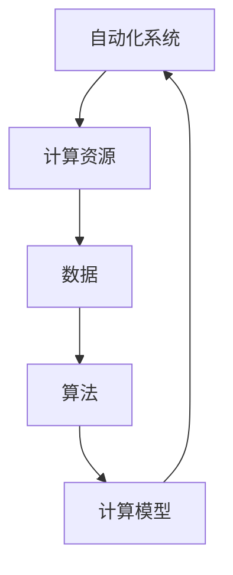
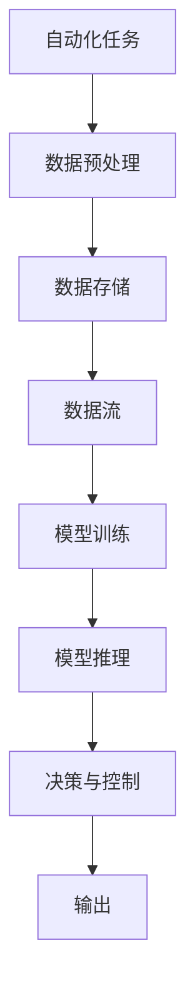

                 

## 1. 背景介绍

在过去几十年间，计算能力的飞跃性提升极大地推动了自动化的发展。从早期的简单的自动化流程控制，到复杂的数据分析与机器学习，自动化正在逐步深入到我们生活的方方面面。然而，随着计算环境的变化，自动化也面临着一系列新的挑战和机遇。本文将探讨计算变化对自动化领域的影响，帮助开发者更好地理解当前的自动化环境，并寻找未来的发展方向。

## 2. 核心概念与联系

### 2.1 核心概念概述

自动化是指利用计算技术来执行各种重复性、复杂性或高强度的工作，以提高效率、降低成本、增强决策支持等。在自动化中，计算是核心要素，因此计算环境的变化会对自动化产生深远影响。

- **自动化系统**：包括机器人、自动化流程、智能决策系统等。它们通过编程逻辑、传感器数据、机器学习模型等进行控制和决策。
- **计算资源**：包括CPU、GPU、TPU、云计算平台等。它们提供了计算任务执行的基础。
- **数据**：包括结构化与非结构化数据、大数据、数据流等。数据是自动化系统中信息处理与决策的基础。
- **算法**：包括经典算法、机器学习算法、深度学习算法等。它们定义了自动化的行为逻辑。
- **计算模型**：包括分布式计算、并行计算、异构计算等。它们优化了计算资源的利用率。

### 2.2 概念间的关系

这些核心概念通过计算环境的变化而相互作用。计算能力的变化、数据量的增加、算法的发展和计算模型的演进，共同推动了自动化系统的进步。具体来说，计算能力的提升可以使得更复杂的自动化系统得以构建；数据量的增加则提供了更加丰富的训练和优化基础；算法的发展优化了自动化系统的行为逻辑；而计算模型的演进则提高了资源利用效率。

以下是一个简单的Mermaid流程图来展示这些概念间的关系：



### 2.3 核心概念的整体架构

更全面的自动化系统架构可以如下表示：



自动化任务通过数据预处理、模型训练、模型推理、决策与控制，最终产生输出。每个环节都与计算资源、数据、算法、计算模型密切相关。

## 3. 核心算法原理 & 具体操作步骤

### 3.1 算法原理概述

自动化系统中的核心算法分为以下几个层次：

1. **基础算法**：如排序、搜索、字符串匹配等，是自动化系统中最基础的计算操作。
2. **机器学习算法**：如回归、分类、聚类、强化学习等，通过学习历史数据和模式，实现决策优化。
3. **深度学习算法**：如神经网络、卷积神经网络、循环神经网络等，通过复杂的多层次网络结构，实现更高级的抽象和推理能力。
4. **自动化算法**：如调度、控制、规则引擎等，实现自动化流程的编排和管理。

### 3.2 算法步骤详解

自动化算法的详细步骤可以总结为：

1. **任务定义**：明确自动化任务的目标和要求。
2. **数据收集**：收集相关数据，并进行预处理和清洗。
3. **模型选择**：根据任务特点选择适当的算法。
4. **模型训练**：使用历史数据对模型进行训练。
5. **模型评估**：通过测试集对模型进行评估。
6. **模型部署**：将训练好的模型部署到生产环境。
7. **监控与优化**：对模型进行实时监控和调整，确保系统稳定。

### 3.3 算法优缺点

自动化算法的主要优点包括：

- **效率高**：通过自动化算法，可以大幅提高工作效率，减少人工干预。
- **精度高**：通过机器学习和深度学习算法，可以提升决策的准确性和可靠性。
- **灵活性高**：自动化算法可以根据数据和需求的变化进行动态调整。

然而，自动化算法也存在一些缺点：

- **复杂度高**：构建和维护自动化系统可能需要复杂的技术和工程支持。
- **依赖数据**：自动化算法的效果很大程度上依赖于数据的丰富度和质量。
- **透明性差**：自动化算法的决策过程往往是黑箱操作，缺乏可解释性。
- **资源需求高**：大型自动化系统对计算资源、存储资源和网络带宽有较高要求。

### 3.4 算法应用领域

自动化算法广泛应用于以下几个领域：

- **工业自动化**：如机器人装配、生产线监控、设备维护等。
- **金融自动化**：如交易算法、风险管理、客户服务自动化等。
- **医疗自动化**：如病历分析、影像诊断、个性化治疗等。
- **智能交通**：如智能调度、车路协同、交通流量预测等。
- **智能制造**：如质量控制、供应链优化、智能仓储等。

## 4. 数学模型和公式 & 详细讲解

### 4.1 数学模型构建

在自动化系统中，数学模型常常用于描述任务目标、数据关系和算法逻辑。例如，在金融自动化中，常用的数学模型包括线性回归、逻辑回归、决策树等。在机器视觉自动化中，常常使用图像处理和识别模型，如卷积神经网络。

### 4.2 公式推导过程

以线性回归为例，其数学模型可以表示为：

$$ y = \beta_0 + \beta_1 x_1 + \beta_2 x_2 + \dots + \beta_n x_n + \epsilon $$

其中，$y$ 是输出变量，$x_1, x_2, \dots, x_n$ 是输入变量，$\beta_0, \beta_1, \beta_2, \dots, \beta_n$ 是模型参数，$\epsilon$ 是误差项。

线性回归的梯度下降优化公式为：

$$ \theta_j \leftarrow \theta_j - \alpha \frac{\partial \mathcal{L}(\theta)}{\partial \theta_j} $$

其中，$\theta_j$ 是模型参数，$\alpha$ 是学习率，$\mathcal{L}(\theta)$ 是损失函数。

### 4.3 案例分析与讲解

假设我们要构建一个股票交易系统，可以使用线性回归来预测股票价格变化。模型输入变量包括历史股票价格、交易量、公司财务数据等，输出变量为下一个交易日的股票价格。通过历史数据训练模型，并使用梯度下降优化算法调整模型参数，使得预测结果尽可能接近真实价格。

## 5. 项目实践：代码实例和详细解释说明

### 5.1 开发环境搭建

要在Python中构建自动化系统，首先需要安装必要的依赖。使用以下命令在虚拟环境中安装PyTorch：

```bash
pip install torch torchvision torchaudio
```

### 5.2 源代码详细实现

以下是一个简单的自动化系统示例代码，使用PyTorch实现线性回归：

```python
import torch
import torch.nn as nn
import torch.optim as optim

# 定义线性回归模型
class LinearRegression(nn.Module):
    def __init__(self, n_features):
        super(LinearRegression, self).__init__()
        self.linear = nn.Linear(n_features, 1)

    def forward(self, x):
        return self.linear(x)

# 定义损失函数
def mean_squared_error(y_true, y_pred):
    return torch.mean((y_true - y_pred) ** 2)

# 定义优化器
def gradient_descent(model, train_loader, epochs):
    criterion = mean_squared_error
    optimizer = optim.SGD(model.parameters(), lr=0.01)

    for epoch in range(epochs):
        for batch in train_loader:
            inputs, targets = batch
            optimizer.zero_grad()
            outputs = model(inputs)
            loss = criterion(targets, outputs)
            loss.backward()
            optimizer.step()

# 训练模型
model = LinearRegression(n_features=4)
train_loader = torch.utils.data.DataLoader(train_dataset, batch_size=32)
gradient_descent(model, train_loader, epochs=100)
```

### 5.3 代码解读与分析

该代码实现了一个简单的线性回归模型，用于预测股票价格变化。通过训练集数据，使用梯度下降优化算法调整模型参数。

### 5.4 运行结果展示

假设训练集数据包含4个特征，运行上述代码后，可以得到模型的预测结果。

## 6. 实际应用场景

### 6.1 工业自动化

在工业自动化中，自动化算法可以用于生产线上的机器人装配、设备维护和质量控制。例如，使用机器学习算法对设备运行数据进行监控，提前发现故障，并进行自动维护。

### 6.2 金融自动化

在金融自动化中，自动化算法可以用于交易算法、风险管理和客户服务自动化。例如，使用深度学习算法对市场数据进行实时分析，自动执行交易策略。

### 6.3 医疗自动化

在医疗自动化中，自动化算法可以用于病历分析、影像诊断和个性化治疗。例如，使用卷积神经网络对医学影像进行分析和诊断。

### 6.4 智能交通

在智能交通中，自动化算法可以用于智能调度、车路协同和交通流量预测。例如，使用强化学习算法对交通信号进行优化，提高交通效率。

### 6.5 智能制造

在智能制造中，自动化算法可以用于质量控制、供应链优化和智能仓储。例如，使用机器学习算法对生产数据进行分析和预测，优化生产流程。

## 7. 工具和资源推荐

### 7.1 学习资源推荐

为了掌握自动化系统的构建和优化，推荐以下学习资源：

- **《机器学习实战》**：涵盖机器学习算法、模型训练和调优等基础内容，适合初学者入门。
- **Coursera《机器学习》**：由斯坦福大学开设的课程，深入介绍机器学习理论和技术。
- **Kaggle竞赛**：通过实际比赛练习，提升解决实际问题的能力。

### 7.2 开发工具推荐

自动化系统的开发需要以下工具：

- **PyTorch**：用于深度学习模型构建和训练。
- **TensorFlow**：用于构建复杂深度学习模型和分布式训练。
- **Scikit-learn**：用于传统机器学习模型的构建和优化。
- **Jupyter Notebook**：用于编写和测试代码，并支持交互式数据分析。

### 7.3 相关论文推荐

自动化系统相关的经典论文包括：

- **《深度学习》**：Ian Goodfellow等著作，详细介绍了深度学习算法和实践。
- **《机器学习》**：Tom Mitchell著作，系统介绍了机器学习理论和技术。
- **《自动驾驶汽车：技术和策略》**：Jianfeng Gao著作，探讨了自动驾驶汽车的技术和应用。

## 8. 总结：未来发展趋势与挑战

### 8.1 研究成果总结

自动化系统在各个领域中得到了广泛应用，提升了效率和精度。然而，自动化算法也面临计算能力提升、数据规模增大、算法复杂化等挑战。

### 8.2 未来发展趋势

未来自动化系统的发展趋势包括：

- **深度学习和强化学习**：自动化算法将更多地应用深度学习和强化学习，提升决策的复杂性和灵活性。
- **分布式计算和云计算**：自动化系统将更多地利用分布式计算和云计算资源，提高系统的扩展性和鲁棒性。
- **跨领域融合**：自动化系统将更多地与物联网、大数据等技术结合，实现更全面和智能的自动化。

### 8.3 面临的挑战

自动化系统面临的挑战包括：

- **计算资源需求高**：自动化系统对计算资源的需求将不断增加，需要更多的硬件支持。
- **数据质量和隐私保护**：自动化系统对数据的依赖性强，需要高质量和隐私保护的数据源。
- **算法透明性和可解释性**：自动化系统的决策过程往往是黑箱操作，缺乏可解释性。

### 8.4 研究展望

未来的研究应关注以下几个方向：

- **自动化算法的可解释性**：增强自动化算法的透明性和可解释性，便于理解和调试。
- **自动化系统的人机协同**：构建智能人机交互界面，提高自动化系统的用户体验。
- **自动化系统的伦理和安全性**：确保自动化系统的行为符合伦理和安全标准，避免滥用和风险。

## 9. 附录：常见问题与解答

**Q1：如何处理自动化系统的数据隐私问题？**

A: 数据隐私是自动化系统中的重要问题，可以通过以下措施保护数据隐私：

- **数据匿名化**：对数据进行匿名化处理，避免敏感信息的泄露。
- **数据加密**：使用加密技术保护数据在传输和存储过程中的安全。
- **差分隐私**：在数据集上添加噪声，保护个体隐私。

**Q2：自动化系统如何处理异常情况？**

A: 自动化系统可以通过以下方式处理异常情况：

- **异常检测**：使用异常检测算法，及时发现系统中的异常。
- **异常响应**：对异常情况进行分类和处理，如自动重启、通知人工干预等。
- **自适应控制**：根据异常情况调整自动化系统的行为逻辑，保证系统的鲁棒性。

**Q3：自动化系统如何进行模型优化？**

A: 自动化系统可以通过以下方式进行模型优化：

- **模型调优**：根据实际需求调整模型的超参数，如学习率、正则化系数等。
- **模型融合**：将多个模型进行融合，提升整体的性能。
- **模型蒸馏**：将复杂的模型蒸馏为轻量级的模型，提高推理效率。

通过以上分析，我们可以看到计算变化对自动化系统的影响是深远的。未来的自动化系统将越来越依赖计算能力、数据质量和算法优化，同时也需要考虑伦理、安全和隐私等复杂问题。只有在技术、工程和管理等多方面共同努力，才能构建更加智能、可靠和安全的自动化系统。

