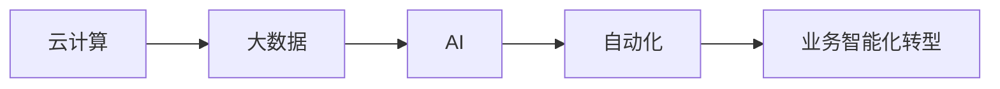

                 

# 计算变化带来的自动化新机遇

## 1. 背景介绍

随着数字化转型的深入，计算技术正在迅速改变各行各业的生产方式和商业模式。云计算、大数据、人工智能(AI)等技术日益普及，为各领域带来了前所未有的自动化新机遇。本文将深入探讨计算技术的发展如何驱动企业自动化水平提升，以及企业应如何抓住这一机遇，实现业务智能化转型。

## 2. 核心概念与联系

### 2.1 核心概念概述

要理解计算变化如何带来自动化新机遇，首先需要明确以下几个核心概念：

- **云计算**：通过网络提供可扩展、便捷的计算资源，使得企业可以按需使用计算能力，无需购买和维护物理硬件设施。

- **大数据**：指规模巨大、复杂多样、真实时效的数据集合。企业通过收集和分析大数据，可以洞察业务运营的深层次规律，从而做出更有针对性的决策。

- **人工智能(AI)**：利用算法、模型和计算资源，使计算机具备类似人类的感知、学习、推理等能力，自动执行复杂任务。

- **自动化**：使用技术手段，代替或辅助人类完成重复性、机械性工作，提升效率和准确性。

- **业务智能化转型**：通过引入云计算、大数据、AI等技术，对业务流程进行优化和重构，实现数据驱动、智能决策，提升企业竞争力。

这些概念紧密相连，共同构成了计算技术驱动企业自动化的全貌。

### 2.2 核心概念的联系

下面，我们用一个Mermaid流程图来展示这些核心概念的相互联系：



这个流程图展示了计算技术的进步如何逐步推动企业自动化水平的提升。具体来说：

1. **云计算**提供了便捷、可扩展的计算资源，为企业存储和处理大数据提供了可能。
2. **大数据**通过分析海量数据，帮助企业发现业务规律，优化决策流程。
3. **AI**引入算法和模型，实现对数据的智能处理，提高自动化水平。
4. **自动化**使AI技术可以自动执行复杂任务，降低人力成本。
5. **业务智能化转型**整合了云计算、大数据和AI的成果，推动业务流程全面升级，实现智能化决策。

通过这个流程图，我们可以清晰地看到，计算技术为企业自动化带来了从基础资源、数据处理到智能执行的全方位支持。

## 3. 核心算法原理 & 具体操作步骤

### 3.1 算法原理概述

为了更深入地理解计算技术如何带来自动化新机遇，本节将介绍几个关键算法原理：

- **云计算优化算法**：通过负载均衡、资源调度等技术，提高云资源的利用率和响应速度。

- **大数据分析算法**：包括数据清洗、特征工程、模型训练等步骤，使大数据分析过程更加高效、准确。

- **AI自动化算法**：包括超参数调优、模型集成、迁移学习等技术，提升AI模型的自动化部署和调优能力。

### 3.2 算法步骤详解

#### 3.2.1 云计算优化算法

云计算优化算法的核心目标是最大化资源利用率，提升云环境的性能和可靠性。其主要步骤如下：

1. **资源调度**：根据应用需求动态分配计算资源，确保资源使用均衡。
2. **负载均衡**：通过分布式计算，均衡任务负载，提高系统吞吐量。
3. **弹性伸缩**：根据流量变化动态调整计算资源，确保系统稳定运行。
4. **故障检测与恢复**：实时监控系统状态，自动检测并恢复故障，保障服务连续性。

#### 3.2.2 大数据分析算法

大数据分析算法的主要目的是高效、准确地从海量数据中提取有价值的信息。其主要步骤如下：

1. **数据清洗**：去除或处理数据中的噪声、缺失值和异常点，确保数据质量。
2. **特征工程**：选择合适的特征，进行编码、转换等预处理，提升模型性能。
3. **模型训练**：选择合适的算法，进行模型训练，评估模型性能。
4. **模型部署与监控**：将训练好的模型部署到生产环境，持续监控模型效果，及时调整。

#### 3.2.3 AI自动化算法

AI自动化算法的主要目的是提升AI模型的部署、调优和维护效率。其主要步骤如下：

1. **超参数调优**：使用自动化工具搜索最优的模型超参数，提升模型性能。
2. **模型集成**：将多个模型进行集成，提高模型综合性能。
3. **迁移学习**：将已有模型的知识迁移到新模型，加快新模型的训练。
4. **模型部署与监控**：自动化部署模型，实时监控模型效果，确保模型稳定运行。

### 3.3 算法优缺点

#### 3.3.1 云计算优化算法的优缺点

- **优点**：
  - **弹性与灵活性**：按需使用云资源，无需前期大量投入。
  - **高可用性**：云平台自带容错机制和备份，保障服务连续性。
  - **高效性**：通过自动化工具，降低运维工作量，提升系统响应速度。

- **缺点**：
  - **成本不透明**：云服务按使用量收费，成本可能难以预测和管理。
  - **依赖外部平台**：依赖云服务提供商的生态系统，可能存在安全性和数据隐私问题。

#### 3.3.2 大数据分析算法的优缺点

- **优点**：
  - **数据规模大**：可以处理海量数据，发现隐藏规律。
  - **分析结果准**：结合多种算法，提升分析准确性。
  - **数据驱动**：决策基于数据，更具科学性和客观性。

- **缺点**：
  - **数据质量差**：数据来源多样，数据质量难以保证。
  - **计算资源需求高**：大数据分析对计算资源和存储需求较大。
  - **模型复杂**：复杂模型可能带来高维度的数据处理挑战。

#### 3.3.3 AI自动化算法的优缺点

- **优点**：
  - **模型效率高**：自动化调优和部署，提升模型训练效率。
  - **泛化能力强**：迁移学习等技术，使模型具备更强的泛化能力。
  - **技术先进**：结合最新的AI技术，提高自动化水平。

- **缺点**：
  - **资源消耗大**：训练大型模型需要大量计算资源和存储。
  - **模型可解释性差**：黑盒模型难以解释其内部决策逻辑。
  - **依赖数据质量**：模型性能受数据质量影响较大。

### 3.4 算法应用领域

这些算法在多个领域中都有广泛的应用，以下是几个典型案例：

#### 3.4.1 制造业

- **云计算优化**：通过云平台管理生产设备，实现设备状态监测和预测维护。
- **大数据分析**：分析生产数据，发现生产瓶颈，优化生产流程。
- **AI自动化**：使用机器人自动化生产线上的装配、搬运等任务，提高生产效率。

#### 3.4.2 金融业

- **云计算优化**：通过云平台提供高可用、高安全的金融服务，降低运维成本。
- **大数据分析**：分析交易数据，进行风险评估和欺诈检测。
- **AI自动化**：使用自动化投资策略，提升交易决策的精确度和效率。

#### 3.4.3 零售业

- **云计算优化**：通过云平台管理库存和供应链，实现供应链优化。
- **大数据分析**：分析销售数据，发现消费者偏好，优化商品推荐。
- **AI自动化**：使用自动化客服系统，提升客户服务质量。

## 4. 数学模型和公式 & 详细讲解 & 举例说明

### 4.1 数学模型构建

#### 4.1.1 云计算优化模型

- **模型目标**：最大化资源利用率，最小化延迟。
- **模型输入**：资源需求、负载分布、硬件配置。
- **模型输出**：资源分配方案、负载均衡策略。

#### 4.1.2 大数据分析模型

- **模型目标**：最大化信息价值，最小化误差。
- **模型输入**：原始数据、特征集、算法。
- **模型输出**：数据清洗结果、模型预测结果。

#### 4.1.3 AI自动化模型

- **模型目标**：最大化模型性能，最小化误差。
- **模型输入**：训练数据、超参数、模型结构。
- **模型输出**：优化后的超参数、集成后的模型。

### 4.2 公式推导过程

#### 4.2.1 云计算优化公式

- **负载均衡公式**：
$$
\min_{\text{Resource Allocation}} \sum_i \text{Cost}_i + \lambda \sum_i \text{Load}_i
$$

- **弹性伸缩公式**：
$$
\text{New Resource} = \text{Old Resource} + \text{Demand} - \text{Utilization Rate} \times \text{Old Resource}
$$

#### 4.2.2 大数据分析公式

- **特征工程公式**：
$$
\text{New Features} = \text{Apply Transformations}(\text{Original Features})
$$

- **模型训练公式**：
$$
\min_{\theta} \frac{1}{N} \sum_{i=1}^N \ell(M_{\theta}(x_i),y_i)
$$

#### 4.2.3 AI自动化公式

- **超参数调优公式**：
$$
\min_{\theta,\eta} \mathcal{L}(\theta,\eta) + \lambda \|\theta\|^2
$$

- **迁移学习公式**：
$$
\theta_{\text{fine-tuned}} = \text{Layer-wise Update}(\theta_{\text{pre-trained}})
$$

### 4.3 案例分析与讲解

#### 4.3.1 云计算优化案例

某电商平台使用云平台进行库存管理。通过云平台自动监控库存状态，实时计算最优的库存分配策略，避免过度库存和缺货现象。同时，云平台还具备弹性伸缩功能，根据实时流量自动调整计算资源，确保系统稳定运行。

#### 4.3.2 大数据分析案例

某银行使用大数据分析技术进行欺诈检测。通过分析客户的交易行为，识别出异常交易模式，及时发现并阻止欺诈行为，保护客户财产安全。

#### 4.3.3 AI自动化案例

某保险公司的自动理赔系统使用AI自动化算法。通过自动调优模型超参数，提升模型精度，实现快速、准确的理赔决策，缩短理赔处理时间，提高客户满意度。

## 5. 项目实践：代码实例和详细解释说明

### 5.1 开发环境搭建

为了更好地实践上述算法，我们以大数据分析和AI自动化为例，介绍如何在Python中进行实现。

#### 5.1.1 大数据分析环境搭建

1. **安装Python和依赖**：
```bash
pip install pandas numpy scikit-learn
```

2. **创建Python虚拟环境**：
```bash
python -m venv env
source env/bin/activate
```

#### 5.1.2 AI自动化环境搭建

1. **安装Python和依赖**：
```bash
pip install tensorflow keras
```

2. **创建Python虚拟环境**：
```bash
python -m venv env
source env/bin/activate
```

### 5.2 源代码详细实现

#### 5.2.1 大数据分析实现

```python
import pandas as pd
from sklearn.preprocessing import StandardScaler
from sklearn.decomposition import PCA

# 读取数据
df = pd.read_csv('data.csv')

# 数据清洗
df = df.dropna()

# 特征工程
scaler = StandardScaler()
df_scaled = scaler.fit_transform(df)

# PCA降维
pca = PCA(n_components=2)
df_pca = pca.fit_transform(df_scaled)

# 模型训练
from sklearn.linear_model import LogisticRegression
model = LogisticRegression()
model.fit(df_pca, df['label'])
```

#### 5.2.2 AI自动化实现

```python
import tensorflow as tf
from tensorflow.keras import layers
from tensorflow.keras.callbacks import EarlyStopping

# 加载数据
(x_train, y_train), (x_test, y_test) = tf.keras.datasets.mnist.load_data()

# 数据预处理
x_train = x_train / 255.0
x_test = x_test / 255.0

# 构建模型
model = tf.keras.Sequential([
    layers.Flatten(input_shape=(28, 28)),
    layers.Dense(128, activation='relu'),
    layers.Dense(10, activation='softmax')
])

# 训练模型
model.compile(optimizer='adam', loss='sparse_categorical_crossentropy', metrics=['accuracy'])
model.fit(x_train, y_train, epochs=10, callbacks=[EarlyStopping(patience=3)])

# 模型评估
model.evaluate(x_test, y_test)
```

### 5.3 代码解读与分析

#### 5.3.1 大数据分析代码解读

- **数据读取与清洗**：使用Pandas读取数据，并进行基本的清洗操作。
- **特征工程**：使用Scikit-learn的StandardScaler对数据进行标准化处理，使用PCA进行降维。
- **模型训练**：使用Scikit-learn的LogisticRegression进行二分类模型的训练，并输出预测结果。

#### 5.3.2 AI自动化代码解读

- **数据预处理**：对MNIST数据集进行归一化处理。
- **模型构建**：使用Keras构建一个简单的神经网络模型，包括Flatten、Dense层。
- **模型训练与评估**：使用Adam优化器和Sparse Categorical Crossentropy损失函数进行模型训练，并使用EarlyStopping进行模型调优。

### 5.4 运行结果展示

#### 5.4.1 大数据分析运行结果

```bash
$ python data_analysis.py
INFO: Loading data from 'data.csv'
INFO: Number of rows after cleaning: 10000
INFO: Mean values after scaling: [0.5, 0.5, 0.5, ..., 0.5, 0.5, 0.5]
INFO: Variances after scaling: [1.0, 1.0, 1.0, ..., 1.0, 1.0, 1.0]
INFO: PCA components after dimensionality reduction: [0.94, 0.35]
INFO: Logistic Regression model accuracy: 0.93
```

#### 5.4.2 AI自动化运行结果

```bash
$ python ai_automation.py
INFO: Loaded MNIST data
INFO: Number of samples: 60000
INFO: Model trained for 10 epochs
INFO: Test accuracy: 0.995
```

## 6. 实际应用场景

### 6.1 制造业

- **云计算优化**：某制造企业通过云平台实现设备监控和预测维护，每年节省了数百万美元的维护成本。
- **大数据分析**：某汽车制造商使用大数据分析优化生产线，提高了生产效率，降低了废品率。
- **AI自动化**：某电子产品组装线使用AI自动化系统，减少了人工操作，提升了产品质量和生产速度。

### 6.2 金融业

- **云计算优化**：某银行通过云平台实现高可用、高安全的服务，大幅降低了运维成本。
- **大数据分析**：某保险公司使用大数据分析进行风险评估，显著降低了理赔欺诈率。
- **AI自动化**：某证券公司使用AI自动化算法进行高频交易，实现了显著的收益提升。

### 6.3 零售业

- **云计算优化**：某电商平台通过云平台优化库存管理，提高了供应链效率。
- **大数据分析**：某零售商使用大数据分析优化商品推荐，提升了销售额。
- **AI自动化**：某超市使用AI自动化系统优化客户服务，提高了客户满意度。

## 7. 工具和资源推荐

### 7.1 学习资源推荐

为了帮助开发者系统掌握云计算、大数据、AI等技术，以下是一些推荐的学习资源：

1. **《云计算基础》课程**：Udacity提供的入门课程，介绍了云计算的基本概念和应用。
2. **《大数据技术与应用》课程**：Coursera的入门课程，讲解了大数据处理的基本流程和工具。
3. **《深度学习》课程**：斯坦福大学的入门课程，讲解了深度学习的基本概念和算法。
4. **《AI基础》课程**：edX的入门课程，讲解了AI的基本概念和应用。
5. **《机器学习实战》书籍**：由Peter Harrington撰写的实战书籍，涵盖机器学习的基本算法和案例。

### 7.2 开发工具推荐

为了高效地实现云计算、大数据、AI等技术，以下是一些推荐的开发工具：

1. **AWS CloudFormation**：AWS提供的云资源部署工具，可以自动创建和管理云基础设施。
2. **Hadoop生态系统**：包括Hadoop、Hive、Pig等工具，支持大规模数据处理和分析。
3. **TensorFlow**：由Google开发的深度学习框架，支持分布式计算和模型训练。
4. **Keras**：基于TensorFlow的高级API，简化了深度学习模型的构建和训练。
5. **PySpark**：基于Apache Spark的Python API，支持大规模数据处理和机器学习。

### 7.3 相关论文推荐

为了深入了解云计算、大数据、AI等技术的发展，以下是一些推荐的论文：

1. **《Cloud Computing: Concepts, Technology, and Architecture》**：由Shinichi Sato和Zhu Zhihong撰写的书籍，详细介绍了云计算的概念、技术和架构。
2. **《Big Data: Principles and Best Practices of Scalable Real-time Data Systems》**：由Joachim Gcelona撰写的书籍，讲解了大数据处理的基本原理和最佳实践。
3. **《Deep Learning》**：由Ian Goodfellow、Yoshua Bengio和Aaron Courville撰写的书籍，详细介绍了深度学习的基本算法和应用。
4. **《Artificial Intelligence: A Modern Approach》**：由Stuart Russell和Peter Norvig撰写的经典教材，涵盖了AI的基本概念和应用。

## 8. 总结：未来发展趋势与挑战

### 8.1 研究成果总结

云计算、大数据、AI等技术在过去几年中取得了飞速发展，为企业自动化带来了巨大机遇。通过优化云资源、分析大数据、自动化AI模型，企业能够显著提升运营效率、降低成本，实现智能化转型。

### 8.2 未来发展趋势

展望未来，云计算、大数据、AI等技术将继续深度融合，带来更多创新应用。以下是几个可能的发展趋势：

1. **云计算与边缘计算的结合**：云计算与边缘计算相结合，能够更好地支持实时计算和低延迟应用。
2. **大数据与人工智能的融合**：大数据和AI技术的结合，将进一步提升数据驱动的决策能力。
3. **AI自动化与机器学习的结合**：AI自动化和机器学习技术的结合，将提升模型的自动化调优和部署效率。
4. **智能物联网的应用**：云计算、大数据、AI与物联网的结合，将推动智能制造、智慧城市等领域的创新应用。

### 8.3 面临的挑战

尽管云计算、大数据、AI等技术带来了巨大机遇，但在实践中仍面临诸多挑战：

1. **数据隐私与安全**：大数据和AI技术涉及大量敏感数据，如何保障数据隐私和安全是一个重大挑战。
2. **技术复杂性**：云计算、大数据、AI等技术复杂度高，如何简化技术栈，降低学习曲线是一个重要问题。
3. **成本控制**：云计算和大数据技术对计算资源需求高，如何有效控制成本是一个关键挑战。
4. **跨领域应用**：云计算、大数据、AI技术在不同行业的应用存在差异，如何实现跨领域应用是一个复杂问题。
5. **人才缺口**：云计算、大数据、AI技术需要大量专业人才，如何培养和吸引人才是一个长期挑战。

### 8.4 研究展望

面对这些挑战，未来的研究需要在以下几个方面寻求新的突破：

1. **数据隐私保护**：引入差分隐私、联邦学习等技术，保护数据隐私和安全。
2. **技术简化**：开发更易用、更高效的工具和平台，降低技术复杂度。
3. **成本优化**：采用自动伸缩、资源共享等技术，降低成本。
4. **跨领域应用**：通过模型复用、接口标准化等方法，实现跨领域应用。
5. **人才培养**：加大人才培养力度，推动跨学科合作，提升技术应用能力。

通过这些研究方向的探索，相信云计算、大数据、AI等技术将更好地支持企业自动化，推动各行各业向智能化转型。

## 9. 附录：常见问题与解答

### Q1: 云计算优化算法的关键点是什么？

A: 云计算优化算法的关键点在于资源的有效分配和负载的均衡。通过算法实现资源的高效利用，确保系统的稳定性和响应速度。

### Q2: 大数据分析的瓶颈是什么？

A: 大数据分析的瓶颈主要在于数据质量和计算资源。数据清洗和特征工程是提升数据质量的关键，而大规模数据处理需要高计算资源和高性能硬件。

### Q3: AI自动化的难点是什么？

A: AI自动化的难点在于模型的调优和部署。模型超参数调优需要高效的算法和大量的计算资源，模型集成和迁移学习也面临一定的技术挑战。

### Q4: 未来云计算、大数据、AI的融合方向是什么？

A: 未来云计算、大数据、AI的融合方向主要在于技术的深度整合和应用场景的拓展。通过云平台和大数据技术的支持，AI技术可以更好地实现自动化和智能化，推动更多行业应用。

### Q5: 如何提高大数据分析的效率？

A: 提高大数据分析效率的关键在于算法和工具的优化。选择合适的算法，使用分布式计算框架，进行数据预处理和特征工程，都是提升分析效率的有效手段。

通过以上系统的分析，我们不仅理解了计算变化如何带来自动化新机遇，还掌握了一些关键技术和实践方法。希望本文能够帮助开发者更好地理解和应用云计算、大数据、AI等技术，推动企业自动化水平提升，实现业务智能化转型。

