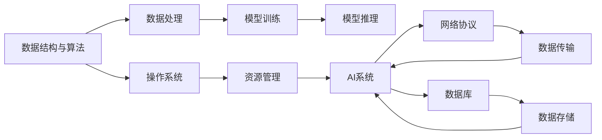
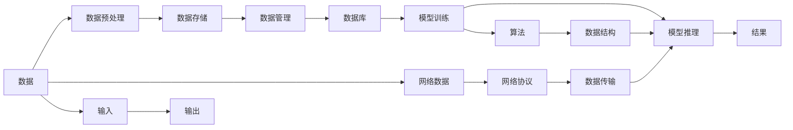

                 

# 计算机基础在AI中的应用

## 1. 背景介绍

随着人工智能技术的飞速发展，计算机基础在AI中的应用越来越广泛，从数据结构与算法到操作系统和网络协议，无不涉及。AI不仅需要处理大量数据，还需要高效、可靠地运行，这些基础计算机知识是AI技术发展不可或缺的基石。

### 1.1 问题由来

AI技术的发展离不开计算机基础的支持。从早期的基于规则的专家系统到现在的深度学习模型，每一步都离不开计算机科学的原理和实践。数据结构、算法、操作系统、网络协议等计算机基础知识，都在AI技术中被广泛应用。这些基础技术不仅提供了高效的数据处理和存储方案，还确保了AI系统的高可靠性和可扩展性。

### 1.2 问题核心关键点

计算机基础在AI中的应用，主要体现在以下几个方面：

- **数据结构与算法**：在数据预处理、模型训练和推理过程中，高效的数据结构和算法是必不可少的。
- **操作系统**：AI系统需要在各种平台上运行，操作系统提供了底层资源的管理和调度。
- **网络协议**：AI系统通常需要处理来自不同来源的数据，网络协议确保了数据传输的可靠性和安全性。
- **数据库**：高质量的数据存储和查询是AI模型的重要基础，数据库技术提供了高效的数据管理方案。

## 2. 核心概念与联系

### 2.1 核心概念概述

为了更好地理解计算机基础在AI中的应用，我们先简要介绍几个核心概念：

- **数据结构与算法**：数据结构是指数据的组织方式，算法是指解决问题的步骤和过程。在AI中，数据结构如树、图等被用来组织和表示数据，算法如排序、搜索、分类等被用来处理和分析数据。
- **操作系统**：操作系统负责管理计算机硬件资源，为应用程序提供接口和支持。AI系统通常需要高性能计算资源，如GPU、TPU等，操作系统提供了这些资源的分配和管理。
- **网络协议**：网络协议定义了数据在网络中的传输格式和规则。AI系统通常需要处理来自各种数据源的数据，网络协议确保了数据传输的可靠性和安全性。
- **数据库**：数据库是高效的数据存储和查询工具。AI系统需要大量数据进行模型训练和推理，数据库提供了高效的数据管理和访问方案。

### 2.2 概念间的关系

这些核心概念之间存在着紧密的联系，形成了AI系统的技术框架。下面通过Mermaid流程图来展示这些概念的关系：



这个流程图展示了数据结构与算法在数据处理、模型训练和推理中的作用，以及操作系统、网络协议和数据库在资源管理、数据传输和数据存储中的支持。

### 2.3 核心概念的整体架构

最后，我们用一个综合的流程图来展示这些核心概念在AI系统中的整体架构：



这个综合流程图展示了数据从输入到输出的整个处理流程，数据结构与算法在其中起到了关键作用，操作系统、网络协议和数据库提供了必要的支持和保障。

## 3. 核心算法原理 & 具体操作步骤
### 3.1 算法原理概述

AI中的核心算法包括机器学习、深度学习等。这些算法在处理数据和构建模型时，都需要依赖计算机基础的支持。

- **机器学习算法**：如线性回归、决策树、支持向量机等，这些算法需要优化和统计学理论的支撑。
- **深度学习算法**：如卷积神经网络、循环神经网络、生成对抗网络等，这些算法需要高效的矩阵运算和GPU/TPU支持。
- **强化学习算法**：如Q-learning、Policy Gradient等，这些算法需要优化和控制理论的支撑。

### 3.2 算法步骤详解

以深度学习中的卷积神经网络（CNN）为例，详细说明核心算法的具体操作步骤：

#### 3.2.1 数据预处理

- 数据清洗：去除噪声、缺失值和异常值，确保数据质量。
- 数据增强：对数据进行扩充和变换，增加数据多样性。

#### 3.2.2 模型设计

- 选择模型结构：根据任务特点选择合适的卷积层、池化层、全连接层等。
- 确定损失函数：选择合适的损失函数，如交叉熵、均方误差等。

#### 3.2.3 模型训练

- 划分数据集：将数据集划分为训练集、验证集和测试集。
- 训练模型：使用反向传播算法优化模型参数，最小化损失函数。
- 验证模型：在验证集上评估模型性能，调整超参数。

#### 3.2.4 模型推理

- 数据预处理：对测试数据进行预处理，如归一化、缩放等。
- 模型预测：将预处理后的数据输入模型，得到预测结果。

### 3.3 算法优缺点

**优点**：

- **高效性**：计算机基础提供的底层资源管理、数据存储和传输优化，使AI算法能够高效处理大量数据。
- **可靠性**：操作系统和网络协议的健壮性确保了AI系统的稳定性和可靠性。
- **可扩展性**：数据库和分布式存储技术使AI系统可以扩展到大规模数据集和复杂模型。

**缺点**：

- **复杂性**：计算机基础涉及底层资源管理和数据传输，技术复杂度较高。
- **资源需求**：AI系统需要高性能计算资源，对硬件和网络要求较高。
- **学习曲线**：需要掌握操作系统、网络协议、数据库等知识，学习成本较高。

### 3.4 算法应用领域

计算机基础在AI中的应用非常广泛，以下是几个典型领域：

- **计算机视觉**：计算机视觉领域需要处理大量图像和视频数据，数据结构如树、图、向量等被广泛应用，算法如卷积神经网络、分割算法等被用来处理和分析图像和视频。
- **自然语言处理**：自然语言处理领域需要处理和分析大量文本数据，数据结构如树、图、哈希表等被用来组织和表示数据，算法如BERT、GPT等被用来处理和分析文本。
- **语音识别**：语音识别领域需要处理和分析语音数据，数据结构如树、图、矩阵等被用来组织和表示数据，算法如RNN、CNN等被用来处理和分析语音。
- **推荐系统**：推荐系统需要处理和分析用户行为数据，数据结构如树、图、哈希表等被用来组织和表示数据，算法如协同过滤、矩阵分解等被用来处理和分析用户行为。

## 4. 数学模型和公式 & 详细讲解 & 举例说明

### 4.1 数学模型构建

AI中的数学模型主要包括以下几个部分：

- **线性回归模型**：
  $$
  y = \beta_0 + \beta_1 x_1 + \beta_2 x_2 + \cdots + \beta_n x_n + \epsilon
  $$
  其中，$\beta_i$ 为系数，$\epsilon$ 为误差项。

- **支持向量机模型**：
  $$
  y = \sum_{i=1}^n \alpha_i y_i K(x_i, x) + b
  $$
  其中，$K(x_i, x)$ 为核函数，$\alpha_i$ 为拉格朗日乘子，$b$ 为偏置项。

- **神经网络模型**：
  $$
  y = \sigma(\sum_{i=1}^n w_i x_i + b)
  $$
  其中，$\sigma$ 为激活函数，$w_i$ 为权重，$b$ 为偏置。

### 4.2 公式推导过程

以神经网络模型为例，详细说明其公式推导过程：

#### 4.2.1 前向传播

前向传播是将输入数据经过一系列线性变换和激活函数得到输出结果的过程。对于单层神经网络，前向传播公式为：
$$
h = \sigma(\sum_{i=1}^n w_i x_i + b)
$$
其中，$\sigma$ 为激活函数，$w_i$ 为权重，$b$ 为偏置。

#### 4.2.2 反向传播

反向传播是根据输出结果和期望结果计算梯度的过程，用于更新权重和偏置。对于单层神经网络，反向传播公式为：
$$
\frac{\partial L}{\partial w_i} = \frac{\partial L}{\partial h} \frac{\partial h}{\partial w_i}
$$
其中，$L$ 为损失函数，$h$ 为输出结果。

### 4.3 案例分析与讲解

以线性回归模型为例，详细说明其应用和案例分析：

#### 4.3.1 数据预处理

假设有一组房屋价格数据，需要进行预处理。可以采用数据清洗和数据增强的方法，确保数据质量：

- 数据清洗：去除噪声和异常值，如去除高价房或低价房。
- 数据增强：对数据进行扩充和变换，如将价格数据进行归一化处理。

#### 4.3.2 模型设计

根据房屋面积、房间数量等特征，设计线性回归模型：
$$
y = \beta_0 + \beta_1 x_1 + \beta_2 x_2 + \cdots + \beta_n x_n + \epsilon
$$
其中，$y$ 为房屋价格，$x_i$ 为房屋面积、房间数量等特征。

#### 4.3.3 模型训练

将数据集划分为训练集和测试集，使用梯度下降算法优化模型参数，最小化损失函数：
$$
L = \frac{1}{N} \sum_{i=1}^N (y_i - \hat{y}_i)^2
$$
其中，$N$ 为样本数量，$\hat{y}_i$ 为模型预测价格。

#### 4.3.4 模型推理

将测试数据输入模型，得到预测价格：
$$
\hat{y} = \beta_0 + \beta_1 x_1 + \beta_2 x_2 + \cdots + \beta_n x_n
$$
其中，$x_i$ 为测试数据中的房屋面积、房间数量等特征。

## 5. 项目实践：代码实例和详细解释说明

### 5.1 开发环境搭建

在进行AI项目实践前，我们需要准备好开发环境。以下是使用Python进行TensorFlow开发的环境配置流程：

1. 安装Anaconda：从官网下载并安装Anaconda，用于创建独立的Python环境。

2. 创建并激活虚拟环境：
```bash
conda create -n tf-env python=3.8 
conda activate tf-env
```

3. 安装TensorFlow：根据CUDA版本，从官网获取对应的安装命令。例如：
```bash
conda install tensorflow=2.6.0 -c conda-forge -c pytorch -c anaconda
```

4. 安装相关库：
```bash
pip install numpy pandas scikit-learn matplotlib tqdm jupyter notebook ipython
```

完成上述步骤后，即可在`tf-env`环境中开始AI项目实践。

### 5.2 源代码详细实现

这里我们以TensorFlow实现线性回归模型为例，给出完整的代码实现：

```python
import tensorflow as tf
import numpy as np
import matplotlib.pyplot as plt

# 准备数据
x = np.array([1, 2, 3, 4, 5])
y = np.array([2, 4, 6, 8, 10])
x = x.reshape(-1, 1)

# 定义模型
model = tf.keras.Sequential([
    tf.keras.layers.Dense(units=1, input_shape=[1])
])

# 定义损失函数和优化器
loss_fn = tf.keras.losses.MeanSquaredError()
optimizer = tf.keras.optimizers.SGD(learning_rate=0.01)

# 训练模型
epochs = 100
history = model.fit(x, y, epochs=epochs, verbose=0)

# 预测数据
x_test = np.array([6, 7, 8, 9, 10])
x_test = x_test.reshape(-1, 1)
y_pred = model.predict(x_test)

# 可视化训练过程
plt.plot(history.history['loss'], label='Train Loss')
plt.plot(history.history['val_loss'], label='Validation Loss')
plt.legend()
plt.show()
```

### 5.3 代码解读与分析

让我们再详细解读一下关键代码的实现细节：

**代码1：准备数据**：
- 使用NumPy创建训练数据集`x`和`y`。
- 使用`reshape`方法将数据集`x`从一维数组转换为二维数组，方便TensorFlow模型处理。

**代码2：定义模型**：
- 使用TensorFlow的Sequential模型，添加一个Dense层作为线性回归模型。
- 设置模型输入形状为`[1]`，输出单元数为`1`。

**代码3：定义损失函数和优化器**：
- 使用均方误差损失函数`MeanSquaredError`。
- 使用随机梯度下降优化器`SGD`，设置学习率为`0.01`。

**代码4：训练模型**：
- 设置训练轮数`epochs`为`100`。
- 使用`fit`方法训练模型，并记录训练过程中的损失值。

**代码5：预测数据**：
- 使用训练好的模型对测试数据进行预测。
- 使用`predict`方法进行预测，并返回预测结果。

**代码6：可视化训练过程**：
- 使用Matplotlib绘制训练过程中的损失值变化图。
- 通过`legend`添加图例，通过`show`显示图形。

## 6. 实际应用场景

计算机基础在AI中的应用场景非常广泛，以下是几个典型场景：

### 6.1 推荐系统

推荐系统需要处理和分析用户行为数据，如图书阅读、商品购买等。数据结构如树、图、哈希表等被用来组织和表示数据，算法如协同过滤、矩阵分解等被用来处理和分析用户行为。

### 6.2 计算机视觉

计算机视觉领域需要处理和分析大量图像和视频数据。数据结构如树、图、向量等被用来组织和表示数据，算法如卷积神经网络、分割算法等被用来处理和分析图像和视频。

### 6.3 自然语言处理

自然语言处理领域需要处理和分析大量文本数据。数据结构如树、图、哈希表等被用来组织和表示数据，算法如BERT、GPT等被用来处理和分析文本。

### 6.4 语音识别

语音识别领域需要处理和分析语音数据。数据结构如树、图、矩阵等被用来组织和表示数据，算法如RNN、CNN等被用来处理和分析语音。

## 7. 工具和资源推荐

### 7.1 学习资源推荐

为了帮助开发者系统掌握AI技术的基础知识，这里推荐一些优质的学习资源：

1. 《深度学习》书籍：Ian Goodfellow等人著作的深度学习经典教材，系统介绍了深度学习的理论和实践。
2. Coursera《深度学习》课程：由Andrew Ng等人主讲的深度学习入门课程，讲解了深度学习的核心算法和应用。
3. Udacity《人工智能工程师纳米学位》课程：提供完整的AI课程体系，从入门到高级，涵盖多个AI领域。
4. Kaggle：提供大量的数据集和竞赛平台，帮助开发者实践和提升AI技能。
5. Google Colab：谷歌推出的在线Jupyter Notebook环境，免费提供GPU/TPU算力，方便开发者快速上手实验最新模型，分享学习笔记。

### 7.2 开发工具推荐

高效的开发离不开优秀的工具支持。以下是几款用于AI开发的常用工具：

1. Jupyter Notebook：开源的交互式编程环境，支持Python、R等多种编程语言。
2. PyTorch：基于Python的开源深度学习框架，支持动态计算图，适合快速迭代研究。
3. TensorFlow：由Google主导开发的开源深度学习框架，生产部署方便，适合大规模工程应用。
4. Weights & Biases：模型训练的实验跟踪工具，可以记录和可视化模型训练过程中的各项指标。
5. TensorBoard：TensorFlow配套的可视化工具，可实时监测模型训练状态，并提供丰富的图表呈现方式。

### 7.3 相关论文推荐

AI技术的发展源于学界的持续研究。以下是几篇奠基性的相关论文，推荐阅读：

1. A Tutorial on Support Vector Machines for Pattern Recognition（支持向量机论文）：由Christopher M. Bishop等人著作，介绍支持向量机的理论和应用。
2. Deep Learning（深度学习论文）：由Yoshua Bengio等人著作，介绍深度学习的理论和应用。
3. Learning Deep Architectures for AI（深度学习架构论文）：由Yoshua Bengio等人著作，介绍深度学习架构的理论和应用。
4. Attention is All You Need（Transformer论文）：由Ashish Vaswani等人著作，介绍Transformer的结构和应用。
5. ImageNet Classification with Deep Convolutional Neural Networks（卷积神经网络论文）：由Alex Krizhevsky等人著作，介绍卷积神经网络的结构和应用。

这些论文代表了AI技术的发展脉络。通过学习这些前沿成果，可以帮助研究者把握学科前进方向，激发更多的创新灵感。

## 8. 总结：未来发展趋势与挑战

### 8.1 总结

本文对计算机基础在AI中的应用进行了全面系统的介绍。首先阐述了计算机基础与AI技术之间的关系，明确了计算机基础在AI发展中的关键作用。其次，从原理到实践，详细讲解了AI中的核心算法、数学模型和操作步骤，给出了AI项目开发的完整代码实例。同时，本文还广泛探讨了AI技术在推荐系统、计算机视觉、自然语言处理、语音识别等领域的实际应用，展示了AI技术的强大潜力。此外，本文精选了AI技术的各类学习资源，力求为读者提供全方位的技术指引。

通过本文的系统梳理，可以看到，计算机基础在AI中的应用是AI技术发展不可或缺的重要基础。这些基础技术不仅提供了高效的数据处理和存储方案，还确保了AI系统的高可靠性和可扩展性。未来，伴随计算机基础和AI技术的持续演进，相信AI技术必将在更多领域得到应用，为人类认知智能的进化带来深远影响。

### 8.2 未来发展趋势

展望未来，计算机基础在AI中的应用将呈现以下几个发展趋势：

1. **算法优化**：随着深度学习模型的复杂性增加，算法的优化成为关键。未来的算法将更加高效、准确，能够处理更大规模的数据。
2. **模型压缩**：随着模型参数的增大，模型的压缩和优化成为重要方向。未来的模型将更加轻量级、高效，适合实时应用。
3. **分布式计算**：随着数据量的增加，分布式计算成为必然趋势。未来的AI系统将更加依赖分布式计算资源，实现高效的数据处理和模型训练。
4. **边缘计算**：随着IoT设备的发展，边缘计算成为重要方向。未来的AI系统将更加依赖边缘计算资源，实现实时、高效的数据处理。
5. **跨领域融合**：未来的AI系统将更加注重跨领域融合，如AI与物联网、AI与大数据等。

### 8.3 面临的挑战

尽管计算机基础在AI中的应用已经取得了巨大成就，但在迈向更加智能化、普适化应用的过程中，它仍面临着诸多挑战：

1. **资源消耗**：AI系统需要大量的计算资源，硬件资源的消耗成为瓶颈。如何实现更高效的资源利用，是未来的一个重要方向。
2. **数据隐私**：AI系统需要大量的数据进行训练和推理，数据隐私和安全成为重要问题。如何保障数据隐私，保护用户权益，是未来的一个重要方向。
3. **算法公平性**：AI系统中的算法可能存在偏见，导致不公平的结果。如何实现算法的公平性，是未来的一个重要方向。
4. **模型可解释性**：AI系统中的模型通常是黑盒模型，难以解释其内部机制。如何实现模型的可解释性，是未来的一个重要方向。
5. **系统鲁棒性**：AI系统可能存在对抗性攻击和脆弱性。如何实现系统的鲁棒性，保障系统的安全性和可靠性，是未来的一个重要方向。

### 8.4 研究展望

面对计算机基础在AI应用中所面临的挑战，未来的研究需要在以下几个方面寻求新的突破：

1. **算法优化**：开发更加高效的算法，如加速优化算法、近似算法等，提高模型训练和推理的效率。
2. **模型压缩**：研究更加轻量级、高效的模型压缩技术，如模型蒸馏、剪枝等，提高模型的可部署性。
3. **分布式计算**：研究分布式计算框架，如TensorFlow分布式训练、PyTorch分布式训练等，提高模型的可扩展性。
4. **数据隐私保护**：研究数据隐私保护技术，如差分隐私、联邦学习等，保障数据隐私和安全。
5. **算法公平性**：研究公平性算法，如公平性回归、公平性分类等，实现算法的公平性。
6. **模型可解释性**：研究模型可解释性技术，如可解释模型、可解释特征等，提高模型的可解释性。

这些研究方向的探索，必将引领计算机基础在AI应用中的持续演进，为构建安全、可靠、可解释、可控的智能系统铺平道路。面向未来，计算机基础和AI技术的深度融合，必将在构建人机协同的智能时代中扮演越来越重要的角色。

## 9. 附录：常见问题与解答

**Q1：计算机基础在AI中的应用有哪些？**

A: 计算机基础在AI中的应用非常广泛，包括数据结构与算法、操作系统、网络协议、数据库等。这些基础技术提供了高效的数据处理和存储方案，确保了AI系统的高可靠性和可扩展性。

**Q2：AI系统中的数据结构与算法有哪些？**

A: AI系统中的数据结构与算法主要包括以下几种：
- 数据结构：如树、图、哈希表等，用于组织和表示数据。
- 算法：如卷积神经网络、分割算法、协同过滤、矩阵分解等，用于处理和分析数据。

**Q3：AI系统中的操作系统和网络协议有哪些？**

A: AI系统中的操作系统和网络协议主要包括以下几种：
- 操作系统：如Linux、Windows、macOS等，用于管理计算机硬件资源。
- 网络协议：如TCP/IP、HTTP/HTTPS、FTP等，用于数据传输和通信。

**Q4：AI系统中的数据库有哪些？**

A: AI系统中的数据库主要包括以下几种：
- 关系型数据库：如MySQL、PostgreSQL、Oracle等，用于高效的数据存储和查询。
- 非关系型数据库：如MongoDB、Redis、Cassandra等，用于高并发、高可扩展的数据存储和查询。

**Q5：AI系统中的深度学习框架有哪些？**

A: AI系统中的深度学习框架主要包括以下几种：
- TensorFlow：由Google主导开发的开源深度学习框架，支持多种平台和硬件。
- PyTorch：基于Python的开源深度学习框架，支持动态计算图和GPU/TPU加速。
- Keras：由François Chollet开发的高级神经网络API，易于使用。

**Q6：AI系统中的可视化工具有哪些？**

A: AI系统中的可视化工具主要包括以下几种：
- TensorBoard：TensorFlow配套的可视化工具，可实时监测模型训练状态，并提供丰富的图表呈现方式。
- Weights & Biases：模型训练的实验跟踪工具，可以记录和可视化模型训练过程中的各项指标。
- Matplotlib：Python中的数据可视化库，支持多种图表类型和定制化设置。

通过这些问题与解答，相信你对计算机基础在AI中的应用有了更全面的了解。未来，随着计算机基础和AI技术的持续演进，相信这些技术将为我们构建更加智能、普适的AI系统提供坚实的基础。

