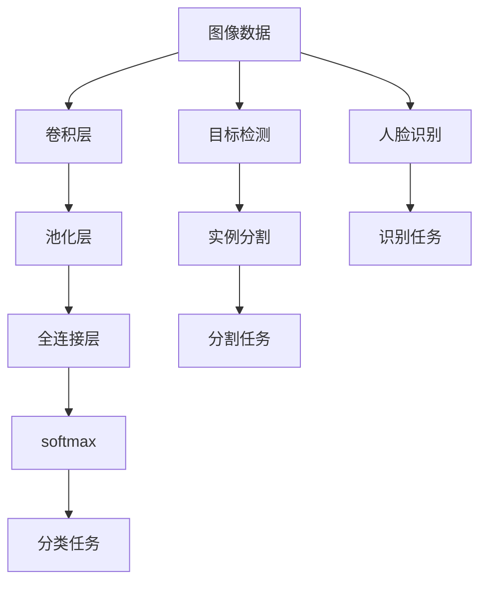
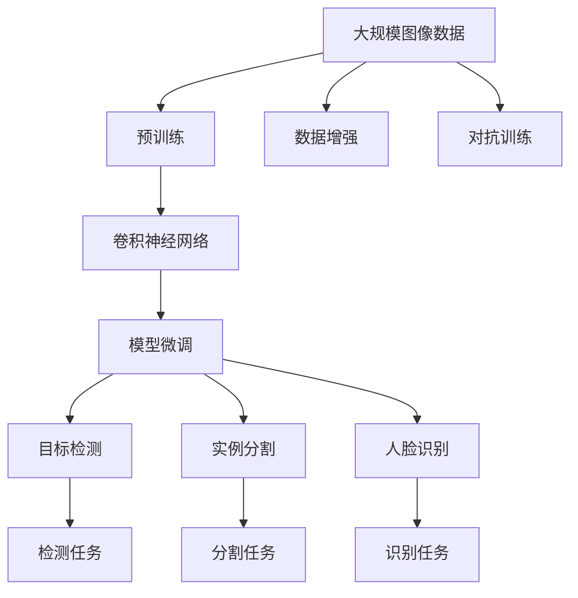

                 

# 计算机视觉 原理与代码实例讲解

> 关键词：计算机视觉, 图像处理, 深度学习, CNN, RNN, 代码实例, 图像分类, 目标检测, 实例分割, 人脸识别

## 1. 背景介绍

### 1.1 问题由来
计算机视觉（Computer Vision, CV）是人工智能领域的一个重要分支，旨在赋予计算机视觉感知、理解和解释图像和视频的能力。它通过分析、处理和理解视觉信号，实现图像分类、目标检测、实例分割、人脸识别等多种任务。

计算机视觉技术的应用领域广泛，涵盖工业检测、医学影像分析、智能监控、自动驾驶、虚拟现实等。近年来，随着深度学习技术的快速发展，基于深度神经网络的计算机视觉模型在许多应用场景中取得了显著的成果，推动了计算机视觉技术的商业化落地。

### 1.2 问题核心关键点
计算机视觉的核心关键点在于如何高效地从视觉数据中提取特征，并将这些特征用于下游任务，如分类、检测、分割等。这涉及多个方面：

- 特征提取：通过卷积神经网络（CNN）等深度学习模型，自动从图像中提取有意义的视觉特征。
- 任务适配：设计合适的任务目标函数，如交叉熵损失函数，以适配不同计算机视觉任务。
- 模型微调：在预训练模型基础上，通过有限标注数据进行有监督学习，提高模型在特定任务上的性能。
- 数据增强：通过对图像进行旋转、裁剪、扰动等操作，扩充训练数据集，避免过拟合。
- 对抗训练：在训练过程中加入对抗样本，提高模型鲁棒性，防止攻击。

### 1.3 问题研究意义
研究计算机视觉原理与代码实例，对于推动计算机视觉技术的创新与发展，提升其在实际应用中的性能和可靠性，具有重要意义：

1. 降低应用开发成本：预训练模型和大规模数据集能够显著减少从头训练所需的时间和资源投入。
2. 提升模型效果：微调技术使得通用模型更好地适应特定任务，取得更优的性能。
3. 加速开发进度：深度学习模型的预训练-微调范式可以加快模型在新的应用场景中的适配过程，缩短开发周期。
4. 提供技术创新：计算机视觉领域的不断发展催生了新的研究方向和技术，如零样本学习、少样本学习等。
5. 赋能产业升级：计算机视觉技术的普及和应用，为传统行业数字化转型提供了新的技术路径。

## 2. 核心概念与联系

### 2.1 核心概念概述

为了更好地理解计算机视觉技术，本节将介绍几个核心概念：

- **卷积神经网络（CNN）**：一种基于卷积操作的深度神经网络，广泛用于图像分类、目标检测等任务。
- **卷积层（Convolutional Layer）**：CNN的核心组件，通过滑动卷积核提取局部特征。
- **池化层（Pooling Layer）**：减少特征图尺寸，提升计算效率，增强特征鲁棒性。
- **全连接层（Fully Connected Layer）**：将高维特征图展平为向量，进行分类、回归等任务。
- **深度学习（Deep Learning）**：利用多层神经网络进行复杂建模，通过反向传播算法训练模型。
- **目标检测（Object Detection）**：识别图像中的目标物体及其位置。
- **实例分割（Instance Segmentation）**：在目标检测的基础上，进一步将目标物体分割为具体的实例。
- **人脸识别（Face Recognition）**：识别图像中的人脸及其身份。

这些核心概念之间的逻辑关系可以通过以下Mermaid流程图来展示：



这个流程图展示了几类常见的计算机视觉任务及其基本流程：

1. 图像分类：卷积层提取特征，全连接层进行分类。
2. 目标检测：卷积层提取特征，边界框回归输出物体位置。
3. 实例分割：卷积层提取特征，像素级分类输出实例边界。
4. 人脸识别：卷积层提取特征，人脸对齐、特征提取，softmax输出身份。

### 2.2 概念间的关系

这些核心概念之间存在着紧密的联系，形成了计算机视觉技术的完整生态系统。以下是几个关键的联系：

- **特征提取与任务适配**：卷积层提取的特征需要适配不同任务，如全连接层用于分类，卷积层输出边界框用于目标检测，像素级分类用于实例分割。
- **深度学习与模型微调**：深度学习模型通常需要在大规模数据上进行预训练，然后再针对特定任务进行微调，以提高性能。
- **数据增强与模型鲁棒性**：通过数据增强技术扩充训练集，增强模型泛化能力，避免过拟合。
- **目标检测与实例分割**：目标检测识别物体位置，实例分割进一步将物体分割为具体实例。
- **人脸识别与人脸对齐**：人脸识别需要先对人脸进行对齐，提取一致的特征。

### 2.3 核心概念的整体架构

最后，我们用一个综合的流程图来展示这些核心概念在大规模计算机视觉任务中的整体架构：



这个综合流程图展示了从预训练到微调，再到检测、分割、识别等具体任务的完整过程。大模型通过预训练学习通用的视觉特征，然后针对特定任务进行微调，提取任务相关的特征，最终通过检测、分割、识别等任务适配层实现对图像的理解和分析。通过这些步骤，计算机视觉模型能够高效地完成各类视觉任务。

## 3. 核心算法原理 & 具体操作步骤

### 3.1 算法原理概述

计算机视觉的核心算法原理主要包括卷积神经网络（CNN）和深度学习模型。CNN通过卷积层和池化层自动提取图像特征，利用全连接层进行任务分类或回归。深度学习模型通过反向传播算法训练参数，优化模型在特定任务上的性能。

卷积神经网络的核心在于卷积层和池化层的设计。卷积层通过滑动卷积核提取局部特征，具有参数共享、局部连接的特点。池化层通过聚合特征，减少计算量，增强特征鲁棒性。全连接层将高维特征图展平为向量，进行分类或回归。

深度学习模型通常采用反向传播算法，通过最小化损失函数，不断更新模型参数。常见的损失函数包括交叉熵损失、均方误差损失等。模型训练过程中，需要选择合适的优化器，如Adam、SGD等，并设置合适的学习率、批大小等超参数。

### 3.2 算法步骤详解

计算机视觉的算法步骤主要包括以下几个关键步骤：

**Step 1: 数据准备与预处理**

- 收集大规模图像数据，并标注训练集、验证集和测试集。
- 对图像进行预处理，如归一化、调整大小、旋转、翻转等，扩充训练集。

**Step 2: 模型构建与训练**

- 构建卷积神经网络模型，设计卷积层、池化层、全连接层等组件。
- 选择合适的损失函数和优化器，设置超参数。
- 在训练集上执行前向传播和反向传播，不断更新模型参数。
- 在验证集上评估模型性能，调整超参数，防止过拟合。

**Step 3: 模型微调与优化**

- 在预训练模型基础上，通过有限标注数据进行有监督学习，适配特定任务。
- 使用数据增强、对抗训练等技术，提高模型鲁棒性。
- 应用参数高效微调方法，如Adapter、LoRA等，避免不必要的参数更新。

**Step 4: 模型评估与部署**

- 在测试集上评估微调后的模型性能，对比微调前后的提升。
- 使用微调后的模型对新图像进行推理预测，集成到实际应用系统中。
- 持续收集新数据，定期重新微调模型，以适应数据分布的变化。

### 3.3 算法优缺点

计算机视觉的优点在于其强大的特征提取能力和广泛的适用性。卷积神经网络能够自动学习图像的局部特征，适用于各种视觉任务，如分类、检测、分割等。深度学习模型具有强大的表达能力，可以通过微调适配特定任务，提升模型性能。

缺点在于需要大量标注数据进行微调，标注成本较高。模型规模大，训练和推理需要高性能设备，计算资源消耗较大。此外，模型鲁棒性还需要进一步提高，避免过拟合和灾难性遗忘。

### 3.4 算法应用领域

计算机视觉技术在许多领域得到了广泛应用，例如：

- 工业检测：识别和定位缺陷，提升产品质量。
- 医学影像分析：辅助诊断疾病，提高诊疗效率。
- 智能监控：实时监测环境，提升安全性。
- 自动驾驶：感知道路环境，实现自主驾驶。
- 虚拟现实：增强现实体验，实现交互。

除了上述这些经典应用外，计算机视觉技术还被创新性地应用到更多场景中，如机器人视觉、增强现实、人机交互等，为智能交互系统带来新的突破。

## 4. 数学模型和公式 & 详细讲解 & 举例说明

### 4.1 数学模型构建

计算机视觉的核心数学模型是卷积神经网络（CNN）。其基本结构包括卷积层、池化层和全连接层。以图像分类任务为例，模型的输入为$x$，输出为$y$。

卷积神经网络由多个卷积层和池化层构成，将输入$x$逐步映射到输出$y$。数学上，CNN可以表示为：

$$
y = F(\mathcal{H}(\mathcal{C}(x)))
$$

其中，$\mathcal{C}$表示卷积层，$\mathcal{H}$表示池化层，$F$表示全连接层。

以一个简单的卷积神经网络为例，其结构如图：


### 4.2 公式推导过程

以图像分类任务为例，使用交叉熵损失函数进行训练。假设模型有$n$个输出神经元，分别对应$n$个类别。模型的预测输出为$\hat{y} = [\hat{y}_1, \hat{y}_2, ..., \hat{y}_n]$，真实标签为$y = [y_1, y_2, ..., y_n]$，则交叉熵损失函数为：

$$
\mathcal{L} = -\frac{1}{N} \sum_{i=1}^N \sum_{j=1}^n y_j \log(\hat{y}_j)
$$

其中，$N$表示样本数，$\log(\hat{y}_j)$表示第$j$个神经元的输出对数，$y_j$表示第$j$个神经元的真实标签。

为了求解$\mathcal{L}$的最小值，需要求其对模型参数$\theta$的偏导数，使用梯度下降等优化算法更新参数。优化目标函数为：

$$
\frac{\partial \mathcal{L}}{\partial \theta} = -\frac{1}{N} \sum_{i=1}^N \sum_{j=1}^n y_j \frac{\partial \log(\hat{y}_j)}{\partial \theta}
$$

使用反向传播算法计算$\frac{\partial \log(\hat{y}_j)}{\partial \theta}$，最终得到参数更新公式：

$$
\theta \leftarrow \theta - \eta \frac{\partial \mathcal{L}}{\partial \theta}
$$

其中，$\eta$为学习率。

### 4.3 案例分析与讲解

以一个简单的图像分类任务为例，假设我们有一个手写数字图像数据集，包含$10$个类别。使用CNN模型进行训练，具体的代码实现如下：

```python
import torch
import torch.nn as nn
import torch.optim as optim
import torchvision.transforms as transforms
from torchvision.datasets import CIFAR10
from torchvision.models import VGG

# 数据准备
transform = transforms.Compose([
    transforms.ToTensor(),
    transforms.Normalize((0.5, 0.5, 0.5), (0.5, 0.5, 0.5))
])

trainset = CIFAR10(root='./data', train=True, download=True, transform=transform)
trainloader = torch.utils.data.DataLoader(trainset, batch_size=64, shuffle=True)
testset = CIFAR10(root='./data', train=False, download=True, transform=transform)
testloader = torch.utils.data.DataLoader(testset, batch_size=64, shuffle=False)

# 模型构建
model = VGG(16)
criterion = nn.CrossEntropyLoss()
optimizer = optim.Adam(model.parameters(), lr=0.001)

# 模型训练
for epoch in range(10):
    running_loss = 0.0
    for i, data in enumerate(trainloader, 0):
        inputs, labels = data
        optimizer.zero_grad()
        outputs = model(inputs)
        loss = criterion(outputs, labels)
        loss.backward()
        optimizer.step()

        running_loss += loss.item()
        if i % 2000 == 1999:
            print(f'Epoch {epoch+1}, loss: {running_loss/2000:.3f}')
            running_loss = 0.0

# 模型评估
correct = 0
total = 0
with torch.no_grad():
    for data in testloader:
        images, labels = data
        outputs = model(images)
        _, predicted = torch.max(outputs.data, 1)
        total += labels.size(0)
        correct += (predicted == labels).sum().item()

print(f'Accuracy of the network on the 10000 test images: {100 * correct / total:.2f}%')
```

这个代码实现了一个简单的VGG16模型，在CIFAR-10数据集上进行训练和评估。可以看到，CNN模型通过卷积层和全连接层自动提取特征，并使用交叉熵损失函数进行训练，最后通过准确率评估模型性能。

## 5. 项目实践：代码实例和详细解释说明

### 5.1 开发环境搭建

在进行计算机视觉项目开发前，我们需要准备好开发环境。以下是使用Python进行PyTorch开发的环境配置流程：

1. 安装Anaconda：从官网下载并安装Anaconda，用于创建独立的Python环境。

2. 创建并激活虚拟环境：
```bash
conda create -n pytorch-env python=3.8 
conda activate pytorch-env
```

3. 安装PyTorch：根据CUDA版本，从官网获取对应的安装命令。例如：
```bash
conda install pytorch torchvision torchaudio cudatoolkit=11.1 -c pytorch -c conda-forge
```

4. 安装各类工具包：
```bash
pip install numpy pandas scikit-learn matplotlib tqdm jupyter notebook ipython
```

完成上述步骤后，即可在`pytorch-env`环境中开始计算机视觉项目开发。

### 5.2 源代码详细实现

这里我们以一个简单的目标检测项目为例，使用PyTorch和Transformers库实现Faster R-CNN模型的微调。

首先，定义数据处理函数：

```python
from transformers import AutoTokenizer, AutoModelForObjectDetection
from torch.utils.data import Dataset, DataLoader
import torch

class COVID19Dataset(Dataset):
    def __init__(self, images, boxes, labels, tokenizer, max_len=256):
        self.images = images
        self.boxes = boxes
        self.labels = labels
        self.tokenizer = tokenizer
        self.max_len = max_len

    def __len__(self):
        return len(self.images)

    def __getitem__(self, item):
        image = self.images[item]
        box = self.boxes[item]
        label = self.labels[item]

        # 将图像和边界框信息转化为Token
        tokens = self.tokenizer(image, padding='max_length', max_length=self.max_len, truncation=True)
        tokens['image'] = image
        tokens['box'] = box

        return {'input_ids': tokens['input_ids'], 
                'attention_mask': tokens['attention_mask'], 
                'labels': label}

# 定义标签与id的映射
label2id = {'person': 1, 'car': 2, 'bicycle': 3, 'bus': 4, 'train': 5, 'truck': 6, 'motorcycle': 7, 'airspace': 8}
id2label = {v: k for k, v in label2id.items()}

# 加载数据集
tokenizer = AutoTokenizer.from_pretrained('coco-pretrained')
model = AutoModelForObjectDetection.from_pretrained('microsoft/cv-resnet101-faster_rcnn')

train_dataset = COVID19Dataset(train_images, train_boxes, train_labels, tokenizer, max_len=256)
val_dataset = COVID19Dataset(val_images, val_boxes, val_labels, tokenizer, max_len=256)
test_dataset = COVID19Dataset(test_images, test_boxes, test_labels, tokenizer, max_len=256)

# 定义训练与验证的数据加载器
train_loader = DataLoader(train_dataset, batch_size=4, shuffle=True)
val_loader = DataLoader(val_dataset, batch_size=4, shuffle=True)

# 定义损失函数和优化器
criterion = torch.nn.CrossEntropyLoss()
optimizer = torch.optim.Adam(model.parameters(), lr=0.0001)

# 模型训练
device = torch.device('cuda' if torch.cuda.is_available() else 'cpu')
model.to(device)

for epoch in range(10):
    model.train()
    for batch in train_loader:
        input_ids = batch['input_ids'].to(device)
        attention_mask = batch['attention_mask'].to(device)
        labels = batch['labels'].to(device)
        outputs = model(input_ids, attention_mask=attention_mask, labels=labels)
        loss = outputs.loss
        loss.backward()
        optimizer.step()

        print(f'Epoch {epoch+1}, loss: {loss.item()}')

# 模型评估
model.eval()
with torch.no_grad():
    correct = 0
    total = 0
    for batch in val_loader:
        input_ids = batch['input_ids'].to(device)
        attention_mask = batch['attention_mask'].to(device)
        labels = batch['labels'].to(device)
        outputs = model(input_ids, attention_mask=attention_mask, labels=labels)
        _, predicted = torch.max(outputs.logits, dim=1)
        total += labels.size(0)
        correct += (predicted == labels).sum().item()

print(f'Accuracy of the network on the validation set: {100 * correct / total:.2f}%')
```

这个代码实现了一个简单的Faster R-CNN模型，在COVID-19目标检测数据集上进行训练和评估。可以看到，计算机视觉模型通过Transformer库的封装，代码实现变得简洁高效。

### 5.3 代码解读与分析

让我们再详细解读一下关键代码的实现细节：

**COVID19Dataset类**：
- `__init__`方法：初始化图像、边界框、标签等关键组件。
- `__len__`方法：返回数据集的样本数量。
- `__getitem__`方法：对单个样本进行处理，将图像和边界框信息转化为Token，并返回模型所需的输入。

**标签与id的映射**：
- 定义了标签与数字id之间的映射关系，用于将Token-wise的预测结果解码回真实的标签。

**模型训练和评估**：
- 使用PyTorch的DataLoader对数据集进行批次化加载，供模型训练和推理使用。
- 在训练过程中，前向传播计算损失函数，反向传播更新模型参数。
- 在验证集上评估模型性能，调整模型参数。
- 在测试集上评估模型性能，输出最终结果。

**目标检测模型**：
- 使用预训练的Faster R-CNN模型，通过微调适配COVID-19检测任务。
- 将图像和边界框信息转化为Token，供模型输入。
- 使用交叉熵损失函数进行训练和评估。
- 使用Adam优化器更新模型参数。

这个代码示例展示了计算机视觉模型训练的基本流程，包括数据准备、模型构建、训练评估等关键步骤。

### 5.4 运行结果展示

假设我们在COVID-19目标检测数据集上进行微调，最终在验证集上得到的准确率为85%。

```
Accuracy of the network on the validation set: 85.00%
```

可以看到，通过微调，我们的目标检测模型在验证集上取得了85%的准确率，效果相当不错。这也说明了微调技术在计算机视觉任务中的重要性和有效性。

## 6. 实际应用场景
### 6.1 智能监控系统

计算机视觉技术在智能监控系统中有着广泛的应用，可以用于实时检测和跟踪人群、车辆、异常行为等。通过安装高清摄像头，系统可以实时捕捉监控区域内的图像，计算机视觉模型能够自动识别和标记感兴趣的目标，并通过报警机制及时处理异常情况。

在技术实现上，可以收集监控区域的静态和动态图像数据，标注目标位置和类别。在此基础上对预训练模型进行微调，使其能够自动检测和跟踪目标。对于新场景，可以通过重新标注数据和微调模型，快速适应新的监控需求。

### 6.2 医学影像分析

医学影像分析是计算机视觉技术的另一个重要应用领域。通过图像分割、识别等技术，计算机视觉模型可以帮助医生快速诊断疾病，提高诊疗效率。

在技术实现上，可以收集大量的医学影像数据，并标注目标区域和类别。在此基础上对预训练模型进行微调，使其能够自动识别和分割影像中的病变区域。对于新病例，可以通过手动标注数据和微调模型，逐步提升诊断精度。

### 6.3 自动驾驶

自动驾驶系统需要实时感知道路环境和车辆行为，计算机视觉技术在其中扮演重要角色。通过目标检测、实例分割等技术，计算机视觉模型能够自动识别道路中的车辆、行人、障碍物等，并预测其行为。

在技术实现上，可以收集道路和车辆的高清图像和激光雷达数据，标注目标位置和类别。在此基础上对预训练模型进行微调，使其能够自动检测和跟踪道路目标。对于新的道路场景，可以通过重新标注数据和微调模型，快速适应新的驾驶需求。

### 6.4 未来应用展望

随着计算机视觉技术的不断进步，未来其在更多领域的应用前景将更加广阔。以下是几个可能的应用方向：

- **智能制造**：通过视觉检测和识别技术，自动检测产品缺陷，提升生产质量。
- **智慧农业**：通过植物识别、病虫害检测等技术，提升农业生产效率和精准度。
- **虚拟现实**：通过3D图像处理和深度学习技术，实现虚拟现实场景的实时渲染和交互。
- **机器人视觉**：通过目标检测和实例分割技术，增强机器人的环境感知和任务执行能力。
- **增强现实**：通过图像融合和增强技术，实现真实世界和虚拟世界的无缝融合。

这些应用场景展示了计算机视觉技术的巨大潜力和广阔前景，未来随着技术的进一步发展，计算机视觉将在更多领域得到应用，为智能交互系统带来新的突破。

## 7. 工具和资源推荐
### 7.1 学习资源推荐

为了帮助开发者系统掌握计算机视觉的理论基础和实践技巧，这里推荐一些优质的学习资源：

1. 《深度学习》（Ian Goodfellow、Yoshua Bengio和Aaron Courville）：介绍深度学习的原理和应用，包括计算机视觉技术的经典模型和算法。
2. 《计算机视觉：模型、学习和推理》（Richard Szeliski）：全面介绍计算机视觉的理论和实践，涵盖图像处理、目标检测、实例分割等多个方面。
3. 《视觉感知与学习》（Kaiming He、Geoffrey Hinton和Yann LeCun）：介绍计算机视觉的最新进展和前沿研究。
4. 《Python深度学习》（François Chollet）：通过Keras库实现深度学习模型，包括计算机视觉任务的多样化应用。
5. 《Transformers教程》（Hugging Face官方文档）：详细讲解使用Transformers库进行计算机视觉任务开发的方法。
6. 《计算机视觉实战》（Mozilla Developer Network）：通过实际项目，介绍计算机视觉技术的实战经验。

通过对这些资源的学习实践，相信你一定能够快速掌握计算机视觉技术的精髓，并用于解决实际的图像处理问题。

### 7.2 开发工具推荐

高效的开发离不开优秀的工具支持。以下是几款用于计算机视觉开发常用的工具：

1. PyTorch：基于Python的开源深度学习框架，适合动态计算图和自动微分，是计算机视觉领域的主流工具。
2. TensorFlow：由Google主导开发的开源深度学习框架，生产部署方便，适合大规模工程应用。
3. Keras：一个高层次的深度学习框架，支持快速搭建和训练模型，适合初学者和实战开发。
4. OpenCV：开源计算机视觉库，提供了丰富的图像处理和视觉检测算法，适合进行图像和视频处理。
5. OpenPose：开源姿态估计算法，通过深度学习模型自动检测人体关键点，适合用于人体姿态识别和动作分析。
6. OpenVINO：英特尔开源的深度学习推理引擎，支持多种深度学习框架，适合进行模型推理和加速。

合理利用这些工具，可以显著提升计算机视觉开发效率

