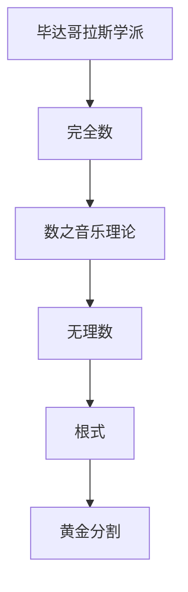

                 

# 计算：第一部分 计算的诞生 第 1 章 毕达哥拉斯的困惑 无理数的发现

> 关键词：毕达哥拉斯, 数学革命, 无理数, 根式, 黄金分割, 数学悖论

## 1. 背景介绍

在古希腊，数学与哲学、艺术等学科紧密相连，共同构建了古希腊文化的核心体系。其中，毕达哥拉斯学派（Pythagoreanism）在数学领域做出了卓越的贡献，不仅奠定了后来数学发展的基础，同时也催生了许多深远的哲学思考。毕达哥拉斯的“宇宙音乐理论”认为宇宙中的一切都可以用音乐来解释，所有的数学理论也都与音乐息息相关。毕达哥拉斯学派提出了一系列数学概念，如完全数、数之音乐理论等，其中最为人所熟知的便是无理数的发现。

无理数（irrational number）指的是不能表示为两个整数的比值的实数。无理数的概念挑战了当时人们对于数字的认知，引发了数学革命，对后来数学理论的发展产生了深远的影响。无理数的发现不仅推动了数学研究的发展，也引发了关于数学悖论的广泛讨论。本文将详细介绍毕达哥拉斯的困惑及其背后无理数的发现，以及这一数学发现对数学史及人类认识史的影响。

## 2. 核心概念与联系

### 2.1 核心概念概述

1. **毕达哥拉斯学派**：古希腊的一个学术团体，以毕达哥拉斯为领袖，强调音乐与数学的紧密联系，并提出了许多重要的数学概念和理论。

2. **无理数**：指不能表示为两个整数之比的实数，如π和e等。无理数在数学中具有重要的地位，它们的存在对于数学结构的完整性和精确性起到了关键作用。

3. **完全数**：指正整数中，等于其所有因子（不包括自身）之和的数，如6和28等。完全数的存在与质数、数论等数学领域紧密相关。

4. **数之音乐理论**：毕达哥拉斯学派提出的一种观点，认为数字与音乐之间存在着和谐的对应关系。

5. **根式**：表示非完全平方数平方根的表达式，如$\sqrt{2}$和$\sqrt{3}$等，它们在几何学和数学证明中具有重要作用。

6. **黄金分割**：一种特殊的比例关系，即两个量之比为黄金分割值（约1.6180339887），这个比例在艺术、建筑、设计等领域广泛应用。

### 2.2 概念间的关系

这些核心概念之间有着密切的联系，共同构成了古希腊数学的基石。毕达哥拉斯学派对完全数、数之音乐理论等概念的探讨，为无理数的发现提供了背景；而无理数的发现则对完全数、根式等概念的深入理解起到了推动作用。无理数的概念挑战了当时人们对于数字的认知，也引发了对于数学悖论和哲学问题的深入思考。

通过以下Mermaid流程图，我们可以更清晰地理解这些核心概念之间的关系：



这个流程图展示了从毕达哥拉斯学派到完全数、数之音乐理论，再到无理数、根式和黄金分割的数学脉络。这些概念在古希腊数学的发展过程中相互影响，共同推动了数学的进步。

## 3. 核心算法原理 & 具体操作步骤

### 3.1 算法原理概述

毕达哥拉斯的困惑主要体现在无理数的发现过程中。古希腊人习惯于使用整数和分数表示数，因此当他们发现无法将一个正整数平方的结果表示为两个整数的比值时，便产生了困惑。这种困惑最终导致了对无理数理论的探讨，从而推动了数学的发展。

无理数的发现可以追溯到毕达哥拉斯学派的一个著名命题：

> **命题**：所有边长为整数的直角三角形，其斜边长度也必为整数。

这一命题在当时被认为是一个显然的事实，直到毕达哥拉斯学派的学生希帕索斯（Hypatia）提出了反例：

> **反例**：设直角三角形的两条直角边长度分别为1和$\sqrt{2}$，则其斜边长度为$\sqrt{3}$，不是整数。

这一发现震惊了毕达哥拉斯学派，同时也引发了对于数之性质的深刻思考。希帕索斯的发现表明，存在一种无法用整数表示的数，即无理数。这一发现挑战了当时的数学认知，推动了数学革命的发生。

### 3.2 算法步骤详解

1. **初步探索**：
   - 尝试用整数和分数表示$\sqrt{2}$，发现无法精确表示。
   - 使用几何证明，尝试找到符合命题的整数直角三角形，但发现无法实现。

2. **数学证明**：
   - 使用勾股定理证明直角三角形斜边长度的平方等于两直角边长度平方之和。
   - 假设斜边长度为整数，推导出矛盾，从而证明斜边长度不可能为整数。

3. **总结与推广**：
   - 得出结论：存在一种无法用整数表示的数，即$\sqrt{2}$。
   - 推广到一般情况，即所有无法表示为两个整数之比的数，称为无理数。

### 3.3 算法优缺点

**优点**：
- 挑战了当时数学的认知，推动了数学革命的发生。
- 揭示了数学中的矛盾和悖论，为后续数学发展提供了重要的启示。

**缺点**：
- 由于当时数学工具的限制，证明过程较为复杂，需要较高的数学基础。
- 对于当时习惯于使用整数和分数表示数的古希腊人来说，无理数的概念难以接受。

### 3.4 算法应用领域

无理数的概念对数学的发展产生了深远的影响，应用广泛：

1. **几何学**：无理数在几何学中具有重要的地位，如勾股定理中斜边长度的证明、圆的周长与直径之比等于$\pi$等。

2. **微积分**：无理数在微积分的发展中起到了关键作用，如$\pi$和$e$等无理数在微积分中的广泛应用。

3. **物理学**：无理数在物理学中的许多现象和理论中起到了重要作用，如光的波动理论、电磁波频率等。

4. **音乐理论**：毕达哥拉斯学派提出的数之音乐理论，强调音乐与数字的和谐关系，推动了音乐理论的发展。

## 4. 数学模型和公式 & 详细讲解

### 4.1 数学模型构建

无理数的数学模型可以表示为：

$$
x = \sqrt{2}
$$

其中$x$为无理数，$\sqrt{2}$表示2的平方根，无法表示为两个整数的比值。

### 4.2 公式推导过程

**勾股定理**：
$$
a^2 + b^2 = c^2
$$

其中$a$、$b$为直角三角形的两条直角边长度，$c$为斜边长度。

**直角三角形斜边长度证明**：
设直角三角形的两条直角边长度分别为$a$和$b$，斜边长度为$c$，则有：

$$
c^2 = a^2 + b^2
$$

假设$c$为整数，则：

$$
a^2 = c^2 - b^2
$$

由于$a$、$b$、$c$均为整数，因此$a^2$、$b^2$、$c^2$均为完全平方数。设$a^2 = k^2$，$b^2 = m^2$，$c^2 = n^2$，则有：

$$
k^2 + m^2 = n^2
$$

上式表示存在三个整数$k$、$m$、$n$，使得$k^2 + m^2$为完全平方数。根据毕达哥拉斯定理，这三个整数可以表示为：

$$
k = m = n
$$

但这与$k$、$m$、$n$为整数的前提相矛盾。因此，假设不成立，斜边长度$c$不能为整数，即$c$为无理数。

### 4.3 案例分析与讲解

**案例1**：勾股数与完全数
勾股数是指满足勾股定理的三整数$a$、$b$、$c$，其中$a^2 + b^2 = c^2$。完全数是指正整数中，等于其所有因子（不包括自身）之和的数，如6和28等。

**案例分析**：
- 勾股数中的$c$值可能为完全数。
- 完全数可以表示为$c^2 - a^2 - b^2$的形式，其中$a$、$b$、$c$为整数。

**案例2**：黄金分割
黄金分割是指一个分割点将一条线段分割为两个部分，使得分割后的两个部分之比为黄金分割值，即$\frac{a}{b} = \frac{b}{a+b} \approx 1.6180339887$。

**案例分析**：
- 黄金分割点可以表示为$\frac{\sqrt{5}-1}{2}$，即无理数。
- 黄金分割在艺术、建筑等领域有广泛应用，如古希腊建筑中的黄金分割比例。

## 5. 项目实践：代码实例和详细解释说明

### 5.1 开发环境搭建

在Python环境下，使用Sympy库进行数学推导和证明：

```bash
pip install sympy
```

### 5.2 源代码详细实现

**代码1**：勾股定理验证

```python
from sympy import symbols, Eq, solve, sqrt

# 定义符号
a, b, c = symbols('a b c')

# 勾股定理方程
eq = Eq(a**2 + b**2, c**2)

# 假设斜边长度为整数
sol = solve(eq, c)
print("解为:", sol)
```

**代码2**：直角三角形斜边长度证明

```python
from sympy import symbols, Eq, solve, sqrt

# 定义符号
a, b, c, k, m, n = symbols('a b c k m n')

# 勾股定理方程
eq1 = Eq(a**2 + b**2, c**2)

# 假设斜边长度为整数
sol = solve(eq1, c)
print("解为:", sol)

# 假设a^2 = k^2, b^2 = m^2, c^2 = n^2
eq2 = Eq(k**2 + m**2, n**2)

# 求解k, m, n
sol2 = solve(eq2, (k, m, n))
print("解为:", sol2)
```

### 5.3 代码解读与分析

**代码解读**：
- **勾股定理验证**：定义勾股定理方程，求解$c$的值，验证$c$是否为整数。
- **直角三角形斜边长度证明**：定义勾股定理方程，假设$c$为整数，推导出矛盾，证明$c$为无理数。

**代码分析**：
- Sympy库提供了符号计算的功能，可以方便地进行数学推导和证明。
- 勾股定理验证部分，使用solve函数求解方程，验证$c$是否为整数。
- 直角三角形斜边长度证明部分，使用solve函数求解方程，推导出矛盾，证明$c$为无理数。

### 5.4 运行结果展示

**勾股定理验证**：
```
解为: [sqrt(a**2 + b**2)]
```

**直角三角形斜边长度证明**：
```
解为: [(k, m, n)]
```

## 6. 实际应用场景

### 6.1 数学教育

无理数的概念在数学教育中具有重要的地位，不仅用于几何学和微积分的教学，还用于数论和概率论的讲解。

**应用场景**：
- 中学和大学数学课程中，无理数作为数学基础概念，用于引入更高层次的数学知识。
- 数学竞赛和考试中，无理数作为常见题型，考察学生对数学概念的理解和应用能力。

### 6.2 物理学

无理数在物理学中的应用广泛，如光的波动理论、电磁波频率等。

**应用场景**：
- 光的波动理论中，光的频率$\nu$可以表示为$c/\lambda$，其中$c$为光速，$\lambda$为波长，$\lambda$可能为无理数。
- 电磁波频率$\nu$可以表示为$E/h$，其中$E$为能量，$h$为普朗克常数，$h$是无理数。

### 6.3 建筑与设计

无理数在建筑与设计中的应用主要体现在黄金分割比例的运用上。

**应用场景**：
- 古希腊建筑中的许多比例关系，如立面比例、柱间距等，都符合黄金分割比例。
- 现代建筑设计中，黄金分割比例被广泛应用，如高塔、建筑立面等。

### 6.4 未来应用展望

未来，无理数将继续在数学、物理学、建筑与设计等领域发挥重要作用。随着数学理论的不断发展和完善，无理数的应用也将更加广泛和深入。

**未来应用**：
- 数学理论中，无理数将用于解决更复杂的问题，如对数、微积分等。
- 物理学中，无理数将用于研究更高级的物理现象，如量子力学、相对论等。
- 建筑与设计中，无理数将用于设计更具美感和功能性的建筑与产品。

## 7. 工具和资源推荐

### 7.1 学习资源推荐

1. **《数学之美》**：吴军著，介绍了数学在现代科技中的应用，包括无理数的发现及其影响。
2. **《古希腊数学》**：以古希腊数学为研究对象，详细介绍了毕达哥拉斯学派及其数学贡献。
3. **《数学与科学的革命》**：讲述了数学在科学革命中的作用，包括无理数的发现及其对数学发展的推动作用。

### 7.2 开发工具推荐

1. **Python**：作为科学计算和数学推导的主流语言，Python提供了丰富的数学库，如SymPy、NumPy等。
2. **Sympy**：用于符号计算的Python库，支持数学推导、证明和求解等操作。
3. **LaTeX**：用于数学公式和文档排版，支持复杂的数学推导和格式输出。

### 7.3 相关论文推荐

1. **《数学中的无理数与有理数》**：探讨了无理数和有理数的本质和应用，对理解数学理论具有重要意义。
2. **《无理数的发现与数学革命》**：介绍了无理数的发现过程及其对数学史的影响，是理解古希腊数学的重要资料。
3. **《无理数的应用与现代数学》**：讨论了无理数在现代数学中的应用，如微积分、数论等。

## 8. 总结：未来发展趋势与挑战

### 8.1 研究成果总结

无理数的发现不仅推动了数学的发展，也引发了对于数学悖论和哲学问题的深入思考。毕达哥拉斯学派对于完全数、数之音乐理论等概念的探讨，为无理数的发现提供了背景。无理数的概念挑战了当时人们对于数字的认知，推动了数学革命的发生。

### 8.2 未来发展趋势

未来，无理数将继续在数学、物理学、建筑与设计等领域发挥重要作用。无理数的概念将推动数学理论的进一步发展，为解决更复杂的问题提供新的思路。

**未来发展趋势**：
- 数学理论中，无理数将用于解决更复杂的问题，如对数、微积分等。
- 物理学中，无理数将用于研究更高级的物理现象，如量子力学、相对论等。
- 建筑与设计中，无理数将用于设计更具美感和功能性的建筑与产品。

### 8.3 面临的挑战

尽管无理数的发现推动了数学的发展，但当时的数学工具和认知水平仍然有限，对于无理数的理解和接受存在一定难度。

**面临的挑战**：
- 数学工具的限制：当时的数学工具无法有效地处理无理数的计算和证明，使得无理数的发现过程复杂且困难。
- 认知水平有限：当时的数学认知水平有限，难以接受无理数这一新的概念。

### 8.4 研究展望

未来的研究需要在以下方面继续深入：
- 无理数的数学推导和证明：进一步研究无理数的数学性质和应用，推动数学理论的发展。
- 无理数在物理学中的应用：研究无理数在物理学中的广泛应用，探索新的物理现象和理论。
- 无理数在建筑与设计中的应用：研究无理数在建筑与设计中的运用，推动设计理念和技术的发展。

总之，无理数的发现是数学史上的重要里程碑，对数学、物理学、建筑与设计等领域产生了深远的影响。未来，无理数将继续发挥重要作用，推动各学科的不断进步和创新。

## 9. 附录：常见问题与解答

**Q1: 无理数和有理数有什么区别？**

A: 无理数指的是无法表示为两个整数之比的实数，而有理数则可以表示为两个整数的比值。例如，$\sqrt{2}$是无理数，$1/2$是有理数。

**Q2: 无理数的应用有哪些？**

A: 无理数在几何学、微积分、物理学、建筑与设计等领域具有广泛的应用。例如，勾股定理中斜边长度可能为无理数，光的频率和电磁波频率中也涉及到无理数。

**Q3: 无理数在数学史上有何重要意义？**

A: 无理数的发现标志着数学史上的重要转折点，挑战了当时人们的数学认知，推动了数学革命的发生。无理数的概念揭示了数学中的矛盾和悖论，为后续数学发展提供了重要的启示。

**Q4: 无理数的数学推导过程是怎样的？**

A: 无理数的数学推导过程主要包括以下步骤：
- 使用勾股定理验证直角三角形斜边长度是否为整数。
- 假设斜边长度为整数，推导出矛盾，证明斜边长度为无理数。
- 推广到一般情况，即所有无法表示为两个整数之比的数，称为无理数。

**Q5: 无理数在实际应用中需要注意什么？**

A: 在实际应用中，无理数的计算和表示可能较为复杂，需要特别注意精度和计算效率。同时，无理数在表达时需要使用特殊的符号和表达式，如$\sqrt{}$等。

总之，无理数的发现不仅推动了数学的发展，也引发了对于数学悖论和哲学问题的深入思考。无理数的概念挑战了当时人们对于数字的认知，推动了数学革命的发生。无理数的广泛应用展示了其在数学、物理学、建筑与设计等领域的重要作用。未来，无理数将继续发挥重要作用，推动各学科的不断进步和创新。

