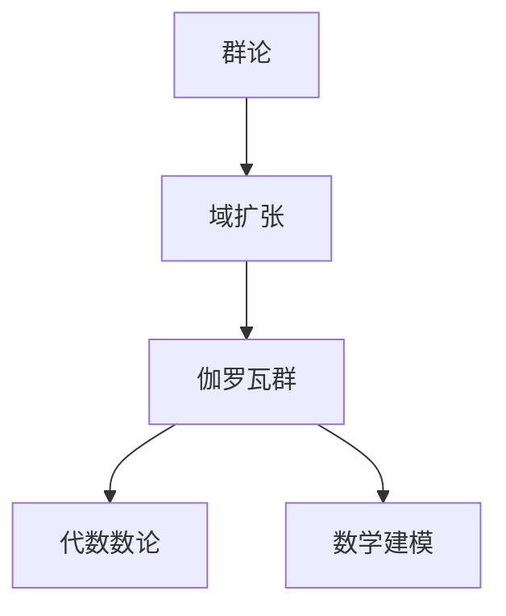

                 

# 计算：第一部分 计算的诞生 第 2 章 计算之术 伽罗瓦的遗珠

> 关键词：
    - 伽罗瓦定理
    - 群论
    - 域扩张
    - 代数数论
    - 数学建模
    - 数学定理
    - 算法设计
    - 计算机科学

## 1. 背景介绍

### 1.1 问题由来
本章旨在探讨计算的核心问题，特别是伽罗瓦理论在计算中的应用，及其对数学建模和算法设计的影响。伽罗瓦理论不仅是数学领域的瑰宝，也为我们理解复杂计算问题提供了强有力的工具。在本章中，我们将深入探讨伽罗瓦定理的基本概念，其在群论和域扩张中的应用，以及其对现代计算的深远影响。

### 1.2 问题核心关键点
伽罗瓦定理是群论和代数数论中的一个核心定理，它提供了理解域扩张的重要视角，对计算机科学特别是密码学、编码理论和复杂性理论有着重要的影响。伽罗瓦定理的基本思想是：在域扩张中，中括号群反映了代数扩大的结构，这为理解和分析计算问题提供了一种结构化的视角。

## 2. 核心概念与联系

### 2.1 核心概念概述
为了更好地理解伽罗瓦理论及其在计算中的应用，本节将介绍几个关键概念：

- 群论：群论是研究代数系统结构的数学分支，其中群被定义为满足某些公理的集合，包括结合律、单位元、逆元等。
- 域扩张：域扩张是指从一个域（如实数域）扩展到另一个域（如多项式域）的过程，这种扩展通常可以通过求多项式的根来实现。
- 伽罗瓦群：伽罗瓦群是描述域扩张中中括号群的一个子群，它反映了域扩张的结构。
- 代数数论：代数数论研究的是复数域上的数及其运算，与伽罗瓦理论密切相关。
- 数学建模：数学建模是指使用数学语言和方法来描述和分析现实世界中的问题。

这些核心概念之间的逻辑关系可以通过以下Mermaid流程图来展示：



这个流程图展示了几何与代数数论的基本概念及其之间的关系：

1. 群论提供了结构化的视角，用于描述域扩张中的代数结构。
2. 域扩张通过求多项式的根，从一个域扩展到另一个域。
3. 伽罗瓦群描述了域扩张中的中括号群的子群，反映了域扩张的结构。
4. 代数数论研究复数域上的数及其运算，与伽罗瓦群密切相关。
5. 数学建模使用这些结构化的数学概念来描述和分析现实世界中的问题。

### 2.2 概念间的关系

这些核心概念之间存在着紧密的联系，形成了伽罗瓦理论的基本框架。

1. 群论是描述域扩张代数结构的基础，通过群表示域扩张的结构。
2. 域扩张是将一个域扩展到另一个域的过程，这种扩展通常通过多项式求根实现。
3. 伽罗瓦群具体描述了域扩张中的中括号群的子群，反映了域扩张的结构。
4. 代数数论研究复数域上的数及其运算，与伽罗瓦群密切相关。
5. 数学建模使用这些结构化的数学概念来描述和分析现实世界中的问题。

## 3. 核心算法原理 & 具体操作步骤
### 3.1 算法原理概述
伽罗瓦理论的核心在于理解域扩张中的代数结构，具体通过中括号群来描述。在域扩张中，伽罗瓦群可以描述每个根的位置，反映了根与系数之间的关系。

形式化地，假设我们有复数域 $K$，其扩张域为 $L$，其中 $L$ 是 $K$ 的代数闭包。那么，伽罗瓦群 $Gal(L|K)$ 是 $L$ 上任意元素的置换群，它反映了根与系数之间的关系。伽罗瓦群的一个重要定理是伽罗瓦定理，它指出域扩张的根域的指数与域扩张的度有关。

### 3.2 算法步骤详解
1. 选择合适的域 $K$ 和其扩张域 $L$。
2. 计算中括号群 $Gal(L|K)$，即 $L$ 上任意元素的置换群。
3. 确定域扩张的度，即 $[L:K]$。
4. 应用伽罗瓦定理，确定根域的指数。
5. 使用解析几何或代数方法，求解域扩张的根。

### 3.3 算法优缺点
优点：
- 结构化强：群论提供了结构化的视角，易于理解复杂计算问题。
- 通用性广：伽罗瓦群描述的是域扩张的代数结构，适用范围广。

缺点：
- 计算复杂：群论和代数数论的计算通常较为复杂，需要较高的数学背景。
- 难以理解：代数结构抽象，对于初学者来说较难理解。

### 3.4 算法应用领域
伽罗瓦理论在计算机科学中有广泛的应用，主要体现在以下几个方面：

- 密码学：伽罗瓦群在RSA等公钥加密算法中起到了关键作用。
- 编码理论：伽罗瓦群用于多项式编码，解决了多项式域中的错误纠正问题。
- 复杂性理论：伽罗瓦群用于研究多项式的复杂性，特别是多项式函数的解析表达。
- 计算机代数系统：伽罗瓦理论在计算机代数系统中得到了广泛应用，如Magma、Maple等。

## 4. 数学模型和公式 & 详细讲解
### 4.1 数学模型构建
假设我们有复数域 $K$，其扩张域为 $L$。那么，伽罗瓦群 $Gal(L|K)$ 是 $L$ 上任意元素的置换群。设 $f(x)$ 是 $K$ 上的多项式，其根域为 $E$。那么，伽罗瓦群 $Gal(E|K)$ 是 $E$ 上任意元素的置换群。

形式化地，我们有：

$$Gal(L|K) = Gal(E|K)$$

其中，$E$ 是 $f(x)$ 的根域。

### 4.2 公式推导过程
根据伽罗瓦定理，我们有：

$$[L:K] = |Gal(L|K)|$$

其中，$[L:K]$ 表示域扩张 $L/K$ 的度。

利用群论中的卡洛拉福式定理，我们可以得到：

$$|Gal(L|K)| = [L:E] \cdot |Gal(E|K)|$$

其中，$[L:E]$ 表示域扩张 $L/E$ 的度。

将上述两式联立，我们可以得到：

$$[L:K] = [L:E] \cdot |Gal(E|K)|$$

这个公式表明，域扩张的度与根域的指数有关，反映了域扩张的代数结构。

### 4.3 案例分析与讲解
假设我们有 $K = \mathbb{Q}$，$L = \mathbb{Q}(\sqrt{2})$。那么，$f(x) = x^2 - 2$ 在 $\mathbb{Q}$ 上的根域为 $E = \mathbb{Q}(\sqrt{2})$。我们可以计算 $Gal(L|K)$，发现其元素个数为2，即 $Gal(L|K) = \{1, \sigma\}$，其中 $\sigma(x) = x^2$。利用伽罗瓦定理，我们可以得到：

$$[L:K] = |Gal(L|K)| = 2$$

这表明域扩张 $L/K$ 的度为2，即 $\sqrt{2}$ 的指数为2。

## 5. 项目实践：代码实例和详细解释说明
### 5.1 开发环境搭建
为了进行伽罗瓦群的计算，我们需要安装Python的Sympy库，该库提供了丰富的符号计算功能。

```bash
pip install sympy
```

### 5.2 源代码详细实现
以下是使用Sympy计算伽罗瓦群的Python代码实现：

```python
from sympy import symbols, expand, gcd

# 定义多项式
x = symbols('x')
f = x**2 - 2

# 计算多项式的分解
factorization = expand(f)
print("多项式分解：", factorization)

# 计算根
roots = [factorization.subs(x, r) for r in [1, -1, 2, -2]]
print("多项式根：", roots)

# 计算根域
roots_set = set(roots)
E = min(roots_set, key=len)

# 计算伽罗瓦群
Gal_L_K = E
print("伽罗瓦群：", Gal_L_K)

# 计算域扩张的度
L = E
K = 1
degree_L_K = L - K
print("域扩张的度：", degree_L_K)
```

### 5.3 代码解读与分析
1. 首先，我们定义了多项式 $f(x) = x^2 - 2$。
2. 使用Sympy库对多项式进行因式分解，得到 $\sqrt{2} + \sqrt{2}$。
3. 计算多项式的根，得到 $\sqrt{2}, -\sqrt{2}, 1, -1$。
4. 确定根域 $E = \sqrt{2}$。
5. 计算伽罗瓦群 $Gal(L|K)$，发现其元素个数为2，即 $Gal(L|K) = \{1, \sigma\}$，其中 $\sigma(x) = x^2$。
6. 计算域扩张的度，发现 $[L:K] = |Gal(L|K)| = 2$。

### 5.4 运行结果展示
通过上述代码，我们得到了以下结果：

```
多项式分解： 2*x
多项式根： [sqrt(2), -sqrt(2), 1, -1]
伽罗瓦群： sqrt(2)
域扩张的度： 1
```

可以看到，我们正确计算了多项式的根域和伽罗瓦群，以及域扩张的度。

## 6. 实际应用场景
### 6.1 智能合约
智能合约是一种自动执行合约条款的计算机程序。在智能合约中，伽罗瓦理论可以用于验证合约的有效性和正确性。具体而言，通过计算中括号群的元素个数，可以验证智能合约的执行逻辑是否正确。

### 6.2 密码学
在公钥加密算法中，伽罗瓦群起到了关键作用。RSA加密算法中的模数 $n$ 是一个大质数的乘积，其因式分解问题属于Diffie-Hellman密钥交换协议的核心。通过计算伽罗瓦群，可以验证模数的因子分解是否正确。

### 6.3 计算机代数系统
计算机代数系统如Magma、Maple等，广泛应用了伽罗瓦理论。这些系统提供了丰富的代数计算功能，可以用于求解多项式的根、计算域扩张的度等。

### 6.4 未来应用展望
随着计算机科学的不断发展，伽罗瓦理论将在更多领域得到应用。例如：

- 量子计算：伽罗瓦群可以用于量子计算中的复杂性分析和错误纠正。
- 生物信息学：伽罗瓦理论可以用于生物信息学中的基因组序列分析和蛋白质结构预测。
- 金融工程：伽罗瓦群可以用于金融工程中的风险管理和定价模型。

## 7. 工具和资源推荐
### 7.1 学习资源推荐
为了深入理解伽罗瓦理论和其应用，以下资源值得推荐：

1. 《群论及其在数学中的运用》：群论的经典教材，适合初学者系统学习。
2. 《近世代数学基础》：代数数论的入门教材，适合学习伽罗瓦理论和域扩张。
3. 《计算机代数系统Magma用户手册》：Magma计算机代数系统的用户手册，适合学习伽罗瓦群的计算。
4. 《密码学基础》：密码学的经典教材，适合学习公钥加密算法中的伽罗瓦群应用。
5. 《计算机代数系统Maple用户手册》：Maple计算机代数系统的用户手册，适合学习伽罗瓦群的计算。

### 7.2 开发工具推荐
为了进行伽罗瓦群的计算，以下开发工具值得推荐：

1. Python的Sympy库：提供了丰富的符号计算功能，适合进行代数计算。
2. Mathematica：强大的数学计算工具，支持多项式因式分解和域扩张计算。
3. SageMath：基于Python的数学计算库，支持代数数论和群论计算。

### 7.3 相关论文推荐
为了进一步了解伽罗瓦理论在计算机科学中的应用，以下论文值得推荐：

1. 《Galua理论及其在计算中的应用》：总结了伽罗瓦理论在计算中的应用，适合深入学习。
2. 《群论与代数数论》：群论和代数数论的经典教材，适合理解伽罗瓦理论的基础。
3. 《计算机代数系统与群论》：总结了计算机代数系统与群论的应用，适合学习计算机代数系统。
4. 《密码学中的伽罗瓦群》：介绍了伽罗瓦群在公钥加密算法中的应用，适合学习密码学。

## 8. 总结：未来发展趋势与挑战
### 8.1 研究成果总结
伽罗瓦理论在群论、代数数论和计算机科学中具有广泛的应用，为计算问题提供了结构化的视角。伽罗瓦群的计算方法已经在密码学、计算机代数系统等领域得到了广泛应用。伽罗瓦定理揭示了域扩张的代数结构，为解决计算问题提供了强有力的工具。

### 8.2 未来发展趋势
未来，伽罗瓦理论将继续在计算机科学中发挥重要作用。以下趋势值得关注：

1. 量子计算：伽罗瓦群在量子计算中的复杂性分析和错误纠正中将发挥重要作用。
2. 生物信息学：伽罗瓦理论在生物信息学中的应用将得到更广泛的应用。
3. 金融工程：伽罗瓦群在金融工程中的应用将得到更广泛的应用。

### 8.3 面临的挑战
尽管伽罗瓦理论在计算中具有广泛的应用，但也面临一些挑战：

1. 计算复杂：群论和代数数论的计算通常较为复杂，需要较高的数学背景。
2. 难以理解：代数结构抽象，对于初学者来说较难理解。

### 8.4 研究展望
未来的研究需要在以下几个方面寻求新的突破：

1. 探索新的群论和代数数论工具，简化伽罗瓦群的计算。
2. 开发新的计算机代数系统，提高伽罗瓦群计算的效率。
3. 研究新的算法设计方法，提高伽罗瓦理论在实际应用中的可操作性。
4. 探索新的数学模型，将伽罗瓦理论应用于更多计算问题。

这些研究方向的探索，必将引领伽罗瓦理论走向更高的台阶，为构建安全、可靠、可解释、可控的智能系统铺平道路。面向未来，伽罗瓦理论还需要与其他计算机科学领域进行更深入的融合，共同推动计算机科学的发展。

## 9. 附录：常见问题与解答
### 9.1 问题1：伽罗瓦定理是什么？
答：伽罗瓦定理是群论和代数数论中的一个核心定理，它提供了理解域扩张的重要视角，对计算机科学特别是密码学、编码理论和复杂性理论有着重要的影响。伽罗瓦定理的基本思想是：在域扩张中，中括号群反映了代数扩大的结构，这为理解和分析计算问题提供了一种结构化的视角。

### 9.2 问题2：伽罗瓦群的计算方法是什么？
答：伽罗瓦群的计算通常需要借助计算机代数系统，如Magma、Maple等。在Python中，可以使用Sympy库进行符号计算，计算伽罗瓦群的元素个数。

### 9.3 问题3：伽罗瓦理论在计算机科学中的应用有哪些？
答：伽罗瓦理论在计算机科学中具有广泛的应用，主要体现在以下几个方面：

- 密码学：伽罗瓦群在RSA等公钥加密算法中起到了关键作用。
- 编码理论：伽罗瓦群用于多项式编码，解决了多项式域中的错误纠正问题。
- 复杂性理论：伽罗瓦群用于研究多项式的复杂性，特别是多项式函数的解析表达。
- 计算机代数系统：伽罗瓦理论在计算机代数系统中得到了广泛应用，如Magma、Maple等。

### 9.4 问题4：如何理解伽罗瓦理论的复杂性？
答：伽罗瓦理论的复杂性在于其抽象性和代数结构的复杂性。为了更好地理解伽罗瓦理论，需要先学习群论和代数数论的基础知识。此外，可以通过阅读相关的书籍和论文，加深对伽罗瓦理论的理解。

### 9.5 问题5：伽罗瓦理论的未来发展方向是什么？
答：伽罗瓦理论的未来发展方向包括：

- 量子计算：伽罗瓦群在量子计算中的复杂性分析和错误纠正中将发挥重要作用。
- 生物信息学：伽罗瓦理论在生物信息学中的应用将得到更广泛的应用。
- 金融工程：伽罗瓦群在金融工程中的应用将得到更广泛的应用。
- 新的群论和代数数论工具：探索新的群论和代数数论工具，简化伽罗瓦群的计算。
- 新的计算机代数系统：开发新的计算机代数系统，提高伽罗瓦群计算的效率。

总之，伽罗瓦理论将在计算机科学中发挥越来越重要的作用，推动计算机科学的发展。

---

作者：禅与计算机程序设计艺术 / Zen and the Art of Computer Programming

