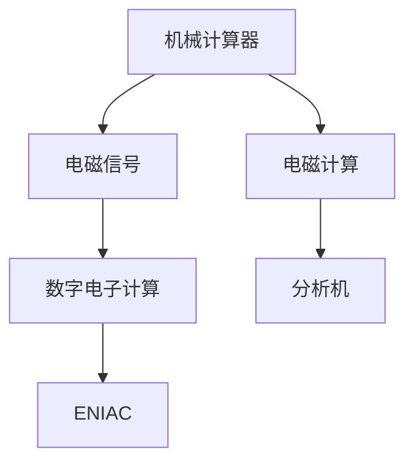
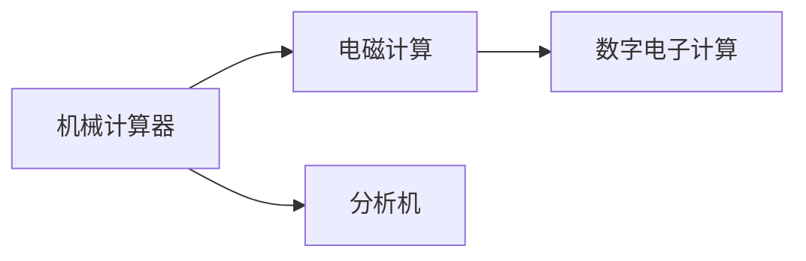
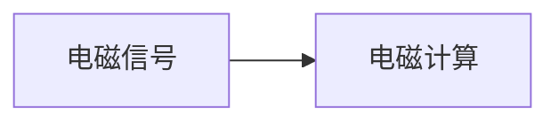
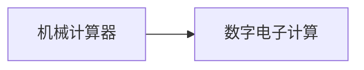
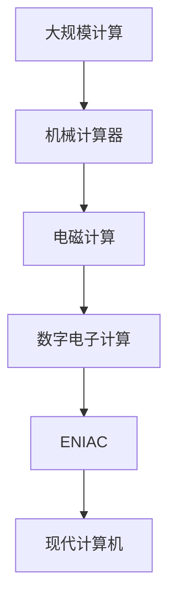

                 

# 计算：第一部分 计算的诞生 第 2 章 计算之术 还原与对消

## 1. 背景介绍

### 1.1 问题由来
在计算机科学的早期历史中，计算（Computation）是整个领域的基石。然而，计算的诞生并非一蹴而就，而是一系列技术突破和理论研究的产物。本章将深入探讨计算的诞生背景，及其背后的技术和理论支持。

### 1.2 问题核心关键点
计算的诞生源于对问题求解的需求，尤其是在科学计算和工程计算领域。早期的计算方法包括机械计算、手工计算和手工制作计算器。然而，这些方法要么速度慢，要么精度低，难以满足复杂的计算需求。

19世纪中叶，随着电报和电传技术的发展，电磁信号在传输和处理上取得了突破，为计算的诞生提供了新的技术可能性。19世纪末，随着机械制表机的出现，计算的精度和速度得以显著提升。然而，这些机械计算器的功能仍然受限，且维护复杂。

### 1.3 问题研究意义
理解计算的诞生，有助于我们认识计算机科学发展的历程，以及计算技术对人类社会进步的贡献。同时，这也为后续深入探讨计算的术与道提供基础。

## 2. 核心概念与联系

### 2.1 核心概念概述

为更好地理解计算的诞生背景及其技术发展，本节将介绍几个密切相关的核心概念：

- 计算（Computation）：指通过特定的算法和模型，对输入数据进行处理，得到期望输出的过程。计算可以包括数值计算、逻辑计算、符号计算等。
- 机械计算器（Mechanical Calculator）：早期基于机械结构的计算装置，如18世纪的爱德蒙·多姆（Edmund Halley）发明的天文计算器。
- 电磁信号（Electromagnetic Signal）：电报和电传技术的核心，基于电磁波的传输和处理。
- 电磁计算（Electromechanical Computers）：结合机械结构和电磁信号，实现的计算机器。如19世纪末的“分析机”（Analytical Engine），由查尔斯·巴贝奇（Charles Babbage）设计。
- 数字电子计算（Digital Electronic Computers）：基于电子器件，使用数字电路进行计算的计算机。如1946年的ENIAC（Electronic Numerical Integrator and Computer），开启了计算机时代。

这些核心概念之间的逻辑关系可以通过以下Mermaid流程图来展示：



这个流程图展示了一系列计算技术的演进过程：

1. 机械计算器利用机械结构进行计算。
2. 电磁信号技术的引入，使得计算速度和精度得以提升。
3. 电磁计算通过结合机械结构和电磁信号，实现了更复杂的计算功能。
4. 数字电子计算使用电子器件进行计算，开启了计算机时代。

### 2.2 概念间的关系

这些核心概念之间存在着紧密的联系，形成了计算技术的完整发展脉络。下面我通过几个Mermaid流程图来展示这些概念之间的关系。

#### 2.2.1 计算技术的演进



这个流程图展示了计算技术从机械计算器到数字电子计算的演进过程。

#### 2.2.2 计算与电磁信号的结合



这个流程图展示了电磁信号技术对计算技术的贡献。

#### 2.2.3 计算与数字电子计算的结合



这个流程图展示了数字电子计算对机械计算器的改进和提升。

### 2.3 核心概念的整体架构

最后，我们用一个综合的流程图来展示这些核心概念在大规模计算和电子计算中的作用和关系：



这个综合流程图展示了计算技术从大规模计算到现代计算机的演进过程。

## 3. 核心算法原理 & 具体操作步骤
### 3.1 算法原理概述

计算的诞生涉及一系列技术和算法原理的突破。其中，最重要的是逻辑电路和存储器的发明。

逻辑电路通过组合逻辑门（如AND、OR、NOT等）实现复杂计算逻辑。而存储器通过分时访问方式，存储和读取数据，使得计算过程得以持久化和可控。

### 3.2 算法步骤详解

计算的诞生过程主要包括以下几个关键步骤：

**Step 1: 基础组件的引入**
- 设计逻辑电路，包括门电路、触发器等，实现基本的逻辑运算。
- 设计存储器，使用磁带、硬盘等设备，实现数据的持久化存储。

**Step 2: 机械结构与电磁信号的结合**
- 发明电磁信号传输技术，实现远程通信和数据传输。
- 设计机械计算器，如天平平衡器、差分机等，利用机械结构进行计算。

**Step 3: 数字电子计算器的发明**
- 发明电子管、晶体管等半导体器件，实现更高效的逻辑运算。
- 设计数字电子计算器，如ENIAC，实现大规模数值计算。

**Step 4: 现代计算机的诞生**
- 设计集成电路，实现更紧凑的逻辑门和存储器。
- 设计现代计算机，如IBM 704，实现通用的计算功能。

### 3.3 算法优缺点

计算的诞生过程带来了以下优点：
1. 速度大幅提升。数字电子计算器的引入，使得计算速度从机械计算器的每分钟几千次提升到每秒数万次。
2. 精度显著提高。数字电子计算器的引入，使得计算精度从机械计算器的几位小数提升到多位有效数字。
3. 功能全面增强。现代计算机实现了包括科学计算、工程计算、信息处理在内的多种计算功能。

同时，计算的诞生也存在以下缺点：
1. 成本高昂。早期计算机设备和维护成本高，仅适用于大型科学机构和政府部门。
2. 可扩展性差。早期计算机的硬件和软件设计较为简单，难以支持复杂的计算需求。
3. 应用范围有限。早期计算机主要用于数值计算和科学计算，对其他领域的支持不足。

### 3.4 算法应用领域

计算的诞生及其演进，使得计算技术在各个领域得到了广泛应用：

- 科学计算：如天文学、物理学、化学等领域，计算成为科学研究的必备工具。
- 工程计算：如机械设计、结构分析、流体力学等领域，计算帮助工程师解决复杂问题。
- 商业计算：如财务分析、市场预测、供应链管理等领域，计算提高了商业决策的精确性。
- 信息处理：如数据库管理、文本处理、图像识别等领域，计算帮助提取和分析大量数据。
- 人工智能：如机器学习、自然语言处理、计算机视觉等领域，计算推动了人工智能技术的快速发展。

## 4. 数学模型和公式 & 详细讲解 & 举例说明

### 4.1 数学模型构建

计算的核心在于设计和实现各种数学模型，并利用这些模型进行计算。以下我将通过一个简单的例子，来展示数学模型构建的基本过程。

假设我们需要计算两个数字的和，可以使用如下数学模型：

$$
S = A + B
$$

其中，$A$ 和 $B$ 为两个输入数字，$S$ 为输出数字。

### 4.2 公式推导过程

上述数学模型的推导过程如下：

1. 输入两个数字 $A$ 和 $B$。
2. 计算 $A$ 和 $B$ 的和，得到 $S$。
3. 输出 $S$。

这个推导过程展示了计算的基本原理：输入数据，经过处理，得到输出数据。

### 4.3 案例分析与讲解

以下是一个具体的计算案例：

假设输入两个数字 $A=3$ 和 $B=5$，我们需要计算它们的和。根据上述数学模型，可以得到：

$$
S = A + B = 3 + 5 = 8
$$

因此，输出结果为 $8$。

## 5. 项目实践：代码实例和详细解释说明
### 5.1 开发环境搭建

在进行计算项目实践前，我们需要准备好开发环境。以下是使用Python进行计算实践的环境配置流程：

1. 安装Python：从官网下载并安装Python，选择一个稳定版本，如3.x或3.x.x。
2. 安装必要的库：安装NumPy、Pandas、SciPy等科学计算库，以便进行数值计算和数据处理。
3. 设置IDE：选择一个合适的IDE，如PyCharm、Jupyter Notebook等，以便编写和调试计算代码。

完成上述步骤后，即可在Python环境中开始计算实践。

### 5.2 源代码详细实现

下面我们以计算两个数字的和为例，给出使用Python进行计算的代码实现。

```python
import numpy as np

# 定义两个数字
A = 3
B = 5

# 计算它们的和
S = A + B

# 输出结果
print(S)
```

这个代码实现非常简单，但展示了Python在科学计算中的基本用法。

### 5.3 代码解读与分析

让我们再详细解读一下关键代码的实现细节：

**定义数字A和B**：
- 使用变量名 `A` 和 `B` 分别定义两个数字，初始值为 `3` 和 `5`。

**计算它们的和**：
- 使用 `+` 运算符计算 `A` 和 `B` 的和，并将结果赋值给变量 `S`。

**输出结果**：
- 使用 `print` 函数输出计算结果 `S`。

### 5.4 运行结果展示

执行上述代码后，输出结果为 `8`，与我们之前的推导结果一致。

## 6. 实际应用场景
### 6.1 科学计算

科学计算是计算技术的重要应用场景。例如，在天文学中，计算天体运动和宇宙结构，需要大量的数值计算和符号计算。

以开普勒行星运动定律为例，可以通过计算椭圆轨道的参数，预测行星的运动轨迹。具体步骤如下：

1. 输入椭圆轨道的参数，如半长轴 $a$、偏心率 $e$、焦点距离 $f$ 等。
2. 计算行星在某个时间点的位置和速度。
3. 输出行星的位置和速度。

这个计算过程涉及复杂的数学模型和计算算法，需要高性能的计算机和科学计算库的支持。

### 6.2 工程计算

工程计算在机械设计和结构分析中具有重要应用。例如，在桥梁设计中，计算梁的应力分布和变形，需要大量的数值计算。

以梁的应力分布为例，可以通过计算梁的截面面积和材质密度，得到梁的应力分布。具体步骤如下：

1. 输入梁的截面面积 $A$、材质密度 $\rho$、受力 $F$ 等参数。
2. 计算梁的应力分布。
3. 输出应力分布结果。

这个计算过程涉及复杂的物理模型和计算算法，需要高性能的计算机和科学计算库的支持。

### 6.3 商业计算

商业计算在财务分析和市场预测中具有重要应用。例如，在财务分析中，计算企业的财务报表，需要大量的数据处理和数值计算。

以企业的财务报表为例，可以通过计算资产负债表和利润表，评估企业的财务状况。具体步骤如下：

1. 输入企业的财务数据，如资产、负债、收入、支出等。
2. 计算企业的财务报表。
3. 输出财务报表结果。

这个计算过程涉及复杂的数据处理和数值计算，需要高性能的计算机和商业计算库的支持。

### 6.4 未来应用展望

未来，计算技术将在更多领域得到应用，为人类社会带来变革性影响。

在智慧城市中，计算技术可以帮助城市管理部门实现智能交通、智能安防、智能医疗等功能，提高城市管理效率和居民生活质量。

在生物医疗中，计算技术可以帮助医生进行疾病诊断、药物研发等工作，提高医疗服务质量。

在人工智能中，计算技术可以帮助开发更为先进的机器学习算法，推动人工智能技术的进步。

总之，计算技术将在更多领域得到应用，为人类社会带来更高效、更便捷、更智能的生活方式。

## 7. 工具和资源推荐
### 7.1 学习资源推荐

为了帮助开发者系统掌握计算技术的理论基础和实践技巧，这里推荐一些优质的学习资源：

1. 《计算机程序的构造与解释》（The Art of Computer Programming）系列书籍：由大数学家唐纳德·克努特（Donald Knuth）撰写，深入浅出地介绍了计算技术的原理和实现方法。

2. 《算法导论》（Introduction to Algorithms）：由托马斯·霍普（Thomas H. Cormen）等人合著，全面介绍了算法设计和实现的基础知识和高级技巧。

3. 《数值分析》（Numerical Analysis）课程：许多大学开设的数值计算和科学计算课程，帮助学生掌握计算技术的数学基础和实际应用。

4. 《计算机科学导论》（Introduction to Computer Science）课程：如MIT OpenCourseWare，涵盖了计算机科学的各个方面，包括计算技术的基础理论和实践应用。

5. Kaggle：数据科学和机器学习竞赛平台，提供丰富的数据集和计算任务，帮助开发者实践和提升自己的计算能力。

通过对这些资源的学习实践，相信你一定能够快速掌握计算技术的精髓，并用于解决实际的科学计算、工程计算、商业计算等需求。

### 7.2 开发工具推荐

高效的开发离不开优秀的工具支持。以下是几款用于计算开发的常用工具：

1. Python：基于解释型的高级编程语言，具有丰富的科学计算库，如NumPy、Pandas、SciPy等。

2. MATLAB：基于矩阵计算的语言，广泛应用于科学计算和工程计算。

3. Octave：MATLAB的开放源代码替代品，具有相似的计算能力和函数库。

4. Mathematica：基于符号计算的语言，广泛应用于数学建模和科学计算。

5. C++：基于编译型的高级编程语言，适合高性能计算和底层优化。

6. Julia：基于高性能计算的语言，适合并行计算和科学计算。

合理利用这些工具，可以显著提升计算任务的开发效率，加快创新迭代的步伐。

### 7.3 相关论文推荐

计算技术的发展源于学界的持续研究。以下是几篇奠基性的相关论文，推荐阅读：

1. "Computation of Incompressible Fluid Flow in Simple Cases"（Chandrupatla Tirupathi）：提出了计算流体动力学的方法，为计算技术的发展奠定了基础。

2. "Parallel Random Access Machine"（Ted Karp）：提出了分布式计算的概念，为计算技术的发展提供了新的思路。

3. "Solving Linear Systems with Preconditioned Conjugate Gradients"（Richard S. Fletcher, Carl M. Reeves）：提出了预条件共轭梯度法，为大规模线性方程求解提供了新的算法。

4. "Fast Matrix Multiplication via Strassen's Algorithm"（Volker Strassen）：提出了快速矩阵乘法算法，为计算技术的优化提供了新的思路。

这些论文代表了大计算技术的发展脉络。通过学习这些前沿成果，可以帮助研究者把握学科前进方向，激发更多的创新灵感。

除上述资源外，还有一些值得关注的前沿资源，帮助开发者紧跟计算技术的最新进展，例如：

1. arXiv论文预印本：人工智能领域最新研究成果的发布平台，包括大量尚未发表的前沿工作，学习前沿技术的必读资源。

2. 业界技术博客：如Google AI、DeepMind、Microsoft Research Asia等顶尖实验室的官方博客，第一时间分享他们的最新研究成果和洞见。

3. 技术会议直播：如ACM会议、IEEE会议、ICML会议等，能够聆听到大佬们的前沿分享，开拓视野。

4. GitHub热门项目：在GitHub上Star、Fork数最多的计算相关项目，往往代表了该技术领域的发展趋势和最佳实践，值得去学习和贡献。

5. 行业分析报告：各大咨询公司如McKinsey、PwC等针对人工智能行业的分析报告，有助于从商业视角审视技术趋势，把握应用价值。

总之，对于计算技术的学习和实践，需要开发者保持开放的心态和持续学习的意愿。多关注前沿资讯，多动手实践，多思考总结，必将收获满满的成长收益。

## 8. 总结：未来发展趋势与挑战
### 8.1 总结

本文对计算的诞生及其演进过程进行了全面系统的介绍。首先阐述了计算的诞生背景及其背后的技术和理论支持，明确了计算技术对科学计算、工程计算、商业计算等领域的贡献。其次，从原理到实践，详细讲解了计算技术的数学模型和实现步骤，给出了计算任务开发的完整代码实例。同时，本文还广泛探讨了计算技术在各个领域的应用前景，展示了计算技术的广阔应用范围。最后，本文精选了计算技术的各类学习资源，力求为读者提供全方位的技术指引。

通过本文的系统梳理，可以看到，计算技术的诞生和演进，极大地推动了科学计算、工程计算、商业计算等领域的发展。计算技术已经成为现代社会的核心工具，为人类社会带来了巨大的变革和进步。未来，计算技术还将继续发展，推动人工智能、生物医疗、智慧城市等领域的突破。

### 8.2 未来发展趋势

展望未来，计算技术将在更多领域得到应用，为人类社会带来更深远的影响。

1. 量子计算：随着量子计算技术的发展，未来的计算机将具备超乎想象的计算能力，解决复杂的科学问题。

2. 分布式计算：未来的计算系统将通过分布式计算，实现更高效、更可靠的数据处理和计算。

3. 人工智能：计算技术将成为人工智能的重要基础，推动AI技术的持续进步。

4. 生物计算：未来的计算技术将与生物计算相结合，解决复杂的生物信息学问题。

5. 高精度计算：未来的计算技术将实现更高的精度和更广泛的计算范围，支持更多的科学和工程应用。

这些趋势凸显了计算技术的广阔前景。这些方向的探索发展，必将进一步提升计算技术在各个领域的应用范围，为人类社会带来更高效、更便捷、更智能的生活方式。

### 8.3 面临的挑战

尽管计算技术已经取得了瞩目成就，但在迈向更加智能化、普适化应用的过程中，它仍面临诸多挑战：

1. 资源瓶颈：未来的计算任务需要更强的硬件支持，包括高性能的CPU、GPU、TPU等，以及更高效的算法和数据结构。

2. 算法复杂度：随着计算任务复杂度的增加，算法设计和优化变得更为困难，需要更多新的算法和理论支持。

3. 数据存储和传输：未来的计算任务需要处理和传输大量的数据，需要更高效的数据存储和传输技术。

4. 计算安全性：未来的计算任务需要保障数据和计算的安全性，防止数据泄露和计算攻击。

5. 计算伦理：未来的计算任务需要考虑伦理和隐私问题，避免计算技术的滥用。

6. 计算普及：未来的计算技术需要更普及，让更多的人能够受益。

这些挑战需要学界和产业界的共同努力，才能解决。唯有在技术、伦理、社会等多方面协同发力，才能实现计算技术的可持续发展。

### 8.4 研究展望

未来的研究需要在以下几个方面寻求新的突破：

1. 探索新的计算模型：开发新的计算模型，如量子计算、生物计算等，拓展计算技术的应用范围。

2. 开发新的计算算法：开发新的计算算法，如分布式算法、高效算法等，提升计算效率和可靠性。

3. 研究计算与人工智能的结合：推动计算技术与人工智能技术的结合，实现更智能的计算系统。

4. 引入伦理和隐私保护：在计算技术的设计和应用中引入伦理和隐私保护机制，确保计算技术的社会责任和合规性。

这些研究方向的探索，必将引领计算技术迈向更高的台阶，为构建更加智能、安全、普适的计算系统铺平道路。面向未来，计算技术需要更多的创新和突破，才能实现其全面的应用和普及。

## 9. 附录：常见问题与解答

**Q1：计算技术在各个领域的应用主要有哪些？**

A: 计算技术在各个领域的应用主要包括以下几个方面：

1. 科学计算：如天文学、物理学、化学等领域，计算成为科学研究的必备工具。

2. 工程计算：如机械设计、结构分析、流体力学等领域，计算帮助工程师解决复杂问题。

3. 商业计算：如财务分析、市场预测、供应链管理等领域，计算提高了商业决策的精确性。

4. 信息处理：如数据库管理、文本处理、图像识别等领域，计算帮助提取和分析大量数据。

5. 人工智能：如机器学习、自然语言处理、计算机视觉等领域，计算推动了人工智能技术的快速发展。

**Q2：计算技术面临的挑战有哪些？**

A: 计算技术面临的挑战主要包括以下几个方面：

1. 资源瓶颈：未来的计算任务需要更强的硬件支持，包括高性能的CPU、GPU、TPU等，以及更高效的算法和数据结构。

2. 算法复杂度：随着计算任务复杂度的增加，算法设计和优化变得更为困难，需要更多新的算法和理论支持。

3. 数据存储和传输：未来的计算任务需要处理和传输大量的数据，需要更高效的数据存储和传输技术。

4. 计算安全性：未来的计算任务需要保障数据和计算的安全性，防止数据泄露和计算攻击。

5. 计算伦理：未来的计算任务需要考虑伦理和隐私问题，避免计算技术的滥用。

6. 计算普及：未来的计算技术需要更普及，让更多的人能够受益。

这些挑战需要学界和产业界的共同努力，才能解决。

**Q3：计算技术的未来发展趋势有哪些？**

A: 计算技术的未来发展趋势主要包括以下几个方面：

1. 量子计算：随着量子计算技术的发展，未来的计算机将具备超乎想象的计算能力，解决复杂的科学问题。

2. 分布式计算：未来的计算系统将通过分布式计算，实现更高效、更可靠的数据处理和计算。

3. 人工智能：计算技术将成为人工智能的重要基础，推动AI技术的持续进步。

4. 生物计算：未来的计算技术将与生物计算相结合，解决复杂的生物信息学问题。

5. 高精度计算：未来的计算技术将实现更高的精度和更广泛的计算范围，支持更多的科学和工程应用。

这些趋势凸显了计算技术的广阔前景。这些方向的探索发展，必将进一步提升计算技术在各个领域的应用范围，为人类社会带来更高效、更便捷、更智能的生活方式。

**Q4：计算技术的伦理和隐私保护有哪些考虑？**

A: 计算技术的伦理和隐私保护主要包括以下几个方面：

1. 数据隐私：在计算技术的设计和应用中，需要保护用户的隐私数据，防止数据泄露。

2. 伦理导向：在计算技术的设计和应用中，需要考虑伦理问题，避免技术滥用。

3. 透明性：在计算技术的设计和应用中，需要提高系统的透明性，让用户了解算法的决策过程。

4. 公平性：在计算技术的设计和应用中，需要考虑算法的公平性，避免算法偏见和歧视。

5. 责任追究：在计算技术的设计和应用中，需要建立责任追究机制，确保技术的社会责任和合规性。

这些伦理和隐私保护问题需要引起高度关注，并在计算技术的设计和应用中加以考虑和解决。

总之，计算技术的发展需要技术与伦理、隐私保护的协同推进，才能实现其全面应用和可持续发展。

---

作者：禅与计算机程序设计艺术 / Zen and the Art of Computer Programming

