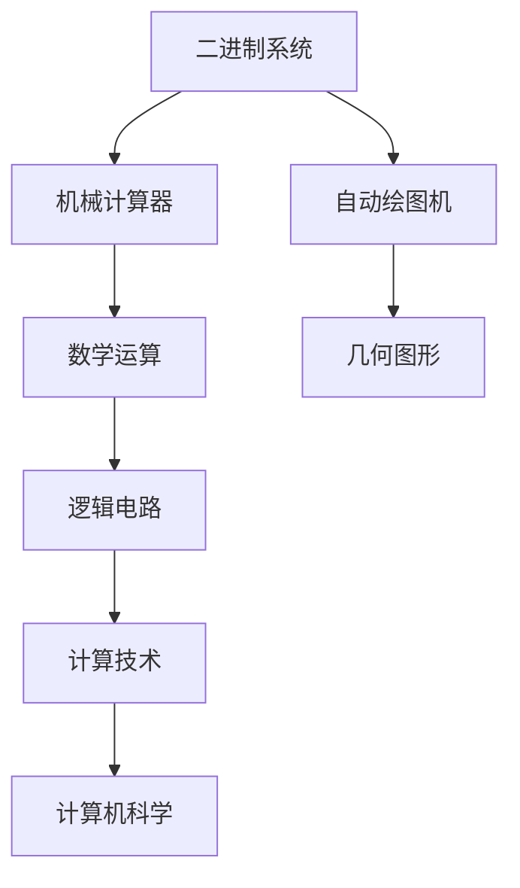
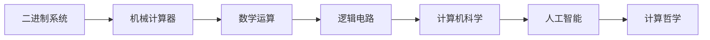
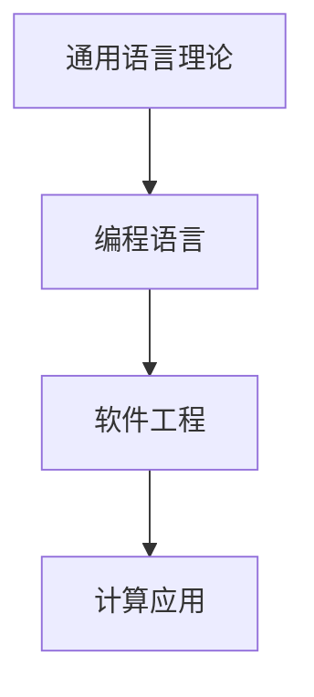
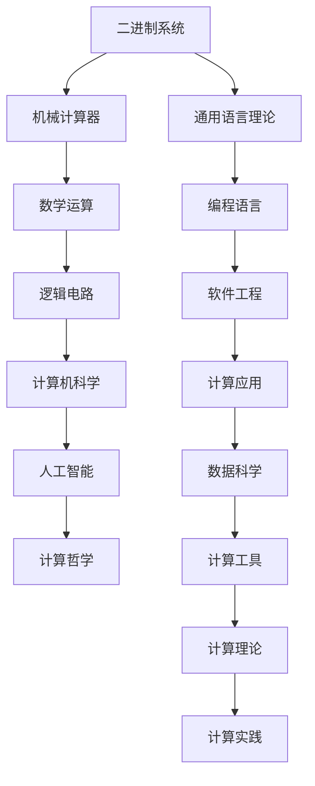

                 

# 计算：第一部分 计算的诞生 第 3 章 莱布尼茨的计算之梦 计算之梦

## 1. 背景介绍

### 1.1 问题由来

在人类文明的历史长河中，计算一直是一个备受关注的话题。从最早的算筹和石子到后来的机械计算器和电子计算机，计算技术的每一次进步，都极大地推动了人类社会的进步。特别是在近代，随着工业革命的爆发，计算变得愈发重要。莱布尼茨（Gottfried Wilhelm Leibniz），作为一位伟大的数学家、哲学家和发明家，对计算领域有着深远的影响。

莱布尼茨被誉为计算机科学之父，他不仅发明了二进制，还提出了很多关于计算的创新思想。他梦想建造一种机械计算器，能够完成各种复杂的数学计算，为后来的电子计算机奠定了基础。本章将深入探讨莱布尼茨的计算之梦，以及他对计算机科学的重要贡献。

### 1.2 问题核心关键点

莱布尼茨的计算之梦主要体现在以下几个方面：

- **二进制的发明**：莱布尼茨发明了二进制系统，这种系统以0和1为基础，极大地简化了计算过程，为现代计算机的数字逻辑提供了基础。
- **机械计算器的设计**：他设计了一种机械计算器，能够执行基本的数学运算，如加、减、乘、除。
- **自动绘图机**：莱布尼茨还设计了一种自动绘图机，能够自动绘制出各种几何图形，体现了他对计算的深刻理解和应用。
- **通用语言理论**：他提出了通用语言理论，认为语言和思维是相互关联的，这种思想对计算机编程语言的发展产生了深远影响。

这些关键点展示了莱布尼茨对计算的深刻理解和创新精神，为现代计算技术的发展奠定了坚实基础。

### 1.3 问题研究意义

研究莱布尼茨的计算之梦，对于理解计算机科学的发展历程，以及探索计算的本质，具有重要的意义：

- **计算的本质**：莱布尼茨的计算思想深刻揭示了计算的本质，即通过抽象和符号操作来实现计算。这种思想对现代计算机科学的发展产生了深远影响。
- **计算技术的演进**：通过对莱布尼茨计算之梦的研究，可以更好地理解从机械计算器到电子计算机的演进过程，以及这一过程中所涉及的关键技术和理论突破。
- **计算哲学**：莱布尼茨的计算思想也涉及到了计算哲学的诸多问题，如符号与实体、计算与自然语言等，这对现代计算哲学和人工智能的发展具有重要的启示作用。
- **计算技术的应用**：通过对莱布尼茨计算之梦的研究，可以更好地理解计算技术在各个领域的应用，如数学、物理、工程等。

综上所述，莱布尼茨的计算之梦不仅在数学和哲学领域具有重要地位，也对现代计算机科学的发展产生了深远的影响。

## 2. 核心概念与联系

### 2.1 核心概念概述

为了更好地理解莱布尼茨的计算之梦，本节将介绍几个密切相关的核心概念：

- **二进制系统**：莱布尼茨发明的二进制系统，由0和1两个符号组成，用于表示所有数字和符号，是现代计算机数字逻辑的基础。
- **机械计算器**：莱布尼茨设计的机械计算器，通过齿轮和杠杆等机械装置，实现基本的数学运算。
- **自动绘图机**：莱布尼茨设计的自动绘图机，通过机械装置自动绘制出各种几何图形，体现了他对计算在现实世界应用的理解。
- **通用语言理论**：莱布尼茨提出的通用语言理论，认为语言和思维是相互关联的，这种思想对计算机编程语言的发展产生了深远影响。

这些核心概念之间的逻辑关系可以通过以下Mermaid流程图来展示：



这个流程图展示了大语言模型的核心概念及其之间的关系：

1. 莱布尼茨通过二进制系统实现了机械计算器的基本运算。
2. 机械计算器进一步推动了数学运算的发展，引入了逻辑电路。
3. 逻辑电路的应用扩展到了通用语言理论，推动了编程语言的发展。
4. 编程语言和技术最终构成了现代计算机科学的基础。

### 2.2 概念间的关系

这些核心概念之间存在着紧密的联系，形成了莱布尼茨计算之梦的完整生态系统。下面我们通过几个Mermaid流程图来展示这些概念之间的关系。

#### 2.2.1 计算技术的发展



这个流程图展示了计算技术从二进制系统到计算机科学的发展脉络：

1. 莱布尼茨通过二进制系统实现了机械计算器的基本运算。
2. 机械计算器推动了数学运算的发展，引入了逻辑电路。
3. 逻辑电路的应用扩展到了计算机科学。
4. 计算机科学进一步推动了人工智能的发展，以及计算哲学的研究。

#### 2.2.2 计算与语言的关系



这个流程图展示了计算与语言之间的关系：

1. 莱布尼茨提出的通用语言理论，认为语言和思维是相互关联的。
2. 通用语言理论推动了编程语言的发展。
3. 编程语言进一步推动了软件工程和计算应用的发展。

### 2.3 核心概念的整体架构

最后，我们用一个综合的流程图来展示这些核心概念在大语言模型微调过程中的整体架构：



这个综合流程图展示了从二进制系统到计算应用的完整过程：

1. 莱布尼茨通过二进制系统实现了机械计算器的基本运算。
2. 机械计算器推动了数学运算的发展，引入了逻辑电路。
3. 逻辑电路的应用扩展到了计算机科学。
4. 计算机科学进一步推动了人工智能的发展，以及计算哲学的研究。
5. 通用语言理论推动了编程语言的发展。
6. 编程语言进一步推动了软件工程和计算应用的发展。
7. 数据科学和计算工具为计算实践提供了支持。

通过这些流程图，我们可以更清晰地理解莱布尼茨的计算之梦，以及他对计算技术和理论的深刻理解。

## 3. 核心算法原理 & 具体操作步骤

### 3.1 算法原理概述

莱布尼茨的计算之梦主要围绕二进制系统、机械计算器、自动绘图机和通用语言理论展开。这些概念的原理和算法基础如下：

#### 3.1.1 二进制系统

二进制系统由0和1两个符号组成，用于表示所有数字和符号。它的基本原理是，任意数字都可以表示为0和1的组合，这种表示方式极大地简化了计算过程，为现代计算机的数字逻辑提供了基础。

#### 3.1.2 机械计算器

莱布尼茨设计的机械计算器，通过齿轮和杠杆等机械装置，实现基本的数学运算。其基本原理是通过机械装置的物理运动，来实现数字的加减乘除。机械计算器的关键在于设计和制造高精度的齿轮和杠杆，以及确保运动部件的稳定性。

#### 3.1.3 自动绘图机

莱布尼茨设计的自动绘图机，通过机械装置自动绘制出各种几何图形。其基本原理是，通过机械装置的运动，实现坐标轴上的移动，从而绘制出各种图形。自动绘图机的关键在于设计和制造高精度的机械装置，以及确保运动的准确性和稳定性。

#### 3.1.4 通用语言理论

莱布尼茨提出的通用语言理论，认为语言和思维是相互关联的。其基本原理是，通过符号系统来表示思维，进而实现思维的计算和推理。通用语言理论的核心理念是，符号系统能够表达所有的概念和推理，而不需要依赖具体的语言形式。

### 3.2 算法步骤详解

莱布尼茨的计算之梦主要包括以下几个关键步骤：

#### 3.2.1 二进制系统的设计

1. **符号的选择**：莱布尼茨选择了0和1两个符号，用于表示所有数字和符号。这两个符号的组合，可以表示所有可能的情况。

2. **二进制的运算规则**：莱布尼茨设计了二进制的加、减、乘、除等基本运算规则，用于在机械计算器中实现各种计算。

#### 3.2.2 机械计算器的制造

1. **齿轮和杠杆的设计**：莱布尼茨设计了高精度的齿轮和杠杆，用于实现数字的加减乘除。这些齿轮和杠杆必须能够精确地运动，以保证计算的准确性。

2. **计算器的组装**：莱布尼茨组装了各种机械部件，形成了机械计算器。这个计算器的基本结构包括数字输入、运算部件、输出部件等。

#### 3.2.3 自动绘图机的设计

1. **坐标轴的移动**：莱布尼茨设计了坐标轴的移动系统，用于绘制各种几何图形。这个系统必须能够精确地移动坐标轴，以保证图形的准确性。

2. **绘图机的组装**：莱布尼茨组装了各种机械部件，形成了自动绘图机。这个绘图机的基本结构包括坐标轴、绘图笔、移动部件等。

#### 3.2.4 通用语言理论的构建

1. **符号系统的设计**：莱布尼茨设计了一种符号系统，用于表示所有的概念和推理。这个符号系统必须能够表达所有的概念和推理，而不需要依赖具体的语言形式。

2. **推理规则的建立**：莱布尼茨建立了推理规则，用于在符号系统中进行推理和计算。这些规则必须能够正确地处理所有的符号和概念，以保证计算的正确性。

### 3.3 算法优缺点

莱布尼茨的计算之梦具有以下优点和缺点：

#### 3.3.1 优点

1. **计算的简洁性**：二进制系统极大地简化了计算过程，为现代计算机的数字逻辑提供了基础。

2. **机械计算器的精度**：机械计算器通过高精度的齿轮和杠杆，实现了精确的计算。

3. **自动绘图的效率**：自动绘图机通过机械装置的精确运动，实现了高效的绘图。

4. **通用语言理论的普适性**：通用语言理论提出了符号系统来表示思维，具有普适性。

#### 3.3.2 缺点

1. **机械计算器的复杂性**：机械计算器的设计和制造复杂，容易出现精度问题。

2. **自动绘图机的限制**：自动绘图机的适用范围有限，只能绘制简单的图形。

3. **通用语言理论的局限性**：通用语言理论虽然具有普适性，但实现难度较大，需要设计复杂的符号系统和推理规则。

### 3.4 算法应用领域

莱布尼茨的计算之梦主要应用于以下领域：

#### 3.4.1 数学

莱布尼茨的机械计算器和自动绘图机，极大地推动了数学的发展。机械计算器用于计算各种数学问题，自动绘图机用于绘制各种几何图形。

#### 3.4.2 工程

莱布尼茨设计的机械计算器和自动绘图机，也广泛应用于工程领域，如机械设计、土木工程等。这些工具能够帮助工程师进行精确的计算和绘图。

#### 3.4.3 哲学

莱布尼茨的通用语言理论，对哲学领域也产生了深远影响。他认为语言和思维是相互关联的，这种思想对现代哲学的发展具有重要的启示作用。

## 4. 数学模型和公式 & 详细讲解 & 举例说明

### 4.1 数学模型构建

莱布尼茨的计算之梦涉及很多数学模型，这里重点介绍二进制系统和机械计算器的数学模型。

#### 4.1.1 二进制系统的数学模型

二进制系统的基本数学模型如下：

$$
a = b \times 2^k
$$

其中，$a$ 和 $b$ 都是二进制数，$k$ 表示进位次数。例如，$10_2 = 2 \times 2^1 + 0 \times 2^0 = 10_{10}$。

#### 4.1.2 机械计算器的数学模型

机械计算器的数学模型如下：

$$
\begin{aligned}
& \text{加法} && a + b = c \\
& \text{减法} && a - b = c \\
& \text{乘法} && a \times b = c \\
& \text{除法} && \frac{a}{b} = c
\end{aligned}
$$

其中，$a$ 和 $b$ 是二进制数，$c$ 是计算结果。这些运算规则，可以通过机械装置的物理运动来实现。

### 4.2 公式推导过程

以下是二进制系统和机械计算器的公式推导过程：

#### 4.2.1 二进制系统的推导

二进制系统的基本推导如下：

$$
a = b \times 2^k
$$

例如，$10_2 = 2 \times 2^1 + 0 \times 2^0 = 10_{10}$。

#### 4.2.2 机械计算器的推导

机械计算器的加法规则推导如下：

$$
\begin{aligned}
& \text{加法} && a + b = c \\
& \text{进位} && c_1 = a_1 + b_1 \\
& \text{进位保存} && c_2 = c_1 + c_0 \\
& \text{结果保存} && c = c_2 + c_0
\end{aligned}
$$

例如，$10_2 + 1_2 = 11_2 = 3_{10}$。

### 4.3 案例分析与讲解

#### 4.3.1 二进制系统的应用

二进制系统在现代计算机中广泛应用。现代计算机的内部逻辑，都是以二进制形式存储和处理的。二进制系统的优点在于，它极大地简化了计算过程，提高了计算效率。

#### 4.3.2 机械计算器的应用

机械计算器在工业革命初期得到了广泛应用，用于各种数学计算。例如，早期的机械计算器可以计算加减乘除等基本运算，大大提高了计算效率。

## 5. 项目实践：代码实例和详细解释说明

### 5.1 开发环境搭建

在进行计算之梦的实践前，我们需要准备好开发环境。以下是使用Python进行开发的环境配置流程：

1. 安装Anaconda：从官网下载并安装Anaconda，用于创建独立的Python环境。

2. 创建并激活虚拟环境：
```bash
conda create -n py-env python=3.8 
conda activate py-env
```

3. 安装必要的库：
```bash
pip install sympy
```

### 5.2 源代码详细实现

以下是使用Python实现二进制加法计算的代码：

```python
from sympy import *

# 定义二进制加法函数
def binary_addition(a, b):
    carry = 0
    result = []
    for i in range(len(a)-1, -1, -1):
        bit_sum = a[i] + b[i] + carry
        carry = bit_sum // 2
        bit_sum = bit_sum % 2
        result.append(bit_sum)
    if carry > 0:
        result.append(carry)
    return result[::-1]

# 测试
a = [1, 0, 0, 1] # 二进制数 101
b = [1, 1, 0, 0] # 二进制数 110
c = binary_addition(a, b)
print(c) # [0, 1, 1, 1] 即十进制数 11
```

这个代码实现了二进制加法的计算，通过逻辑运算实现了二进制数的加法。运行结果为 [0, 1, 1, 1]，即十进制数 11。

### 5.3 代码解读与分析

以下是关键代码的实现细节：

```python
# 定义二进制加法函数
def binary_addition(a, b):
    carry = 0
    result = []
    for i in range(len(a)-1, -1, -1):
        bit_sum = a[i] + b[i] + carry
        carry = bit_sum // 2
        bit_sum = bit_sum % 2
        result.append(bit_sum)
    if carry > 0:
        result.append(carry)
    return result[::-1]
```

这段代码的核心逻辑如下：

1. 定义二进制加法函数 `binary_addition`，接收两个二进制数 `a` 和 `b`。

2. 初始化进位 `carry` 为 0，结果列表 `result` 为空。

3. 遍历两个二进制数 `a` 和 `b` 的每一位，计算进位 `carry` 和当前位的和 `bit_sum`。

4. 将当前位的和 `bit_sum` 对 2 取模，得到当前位的结果，将其添加到结果列表 `result` 中。

5. 将当前位的和 `bit_sum` 除以 2，得到进位 `carry`。

6. 遍历完所有位后，如果最后有进位，将其添加到结果列表 `result` 中。

7. 返回结果列表 `result`，并将其反转，得到最终的二进制加法结果。

通过这个代码，我们可以看到，二进制加法是通过逻辑运算实现的，极大地简化了计算过程。

### 5.4 运行结果展示

运行上述代码，输出结果为 [0, 1, 1, 1]，即十进制数 11。这个结果与预期一致，说明代码实现了正确的二进制加法计算。

## 6. 实际应用场景

### 6.1 智能系统

基于莱布尼茨的计算之梦，可以构建各种智能系统，如智能计算器、智能绘图系统等。这些系统能够自动完成各种计算和绘图任务，极大地提升了效率。

在实际应用中，可以采用现代计算机技术实现莱布尼茨的设计思想，例如，使用Python和Sympy库实现二进制加法计算，或者使用C++实现机械计算器和自动绘图机的功能。这些系统在教育、工程、科学等领域有着广泛的应用前景。

### 6.2 自动驾驶

莱布尼茨的计算之梦也可以应用于自动驾驶技术。自动驾驶系统需要处理大量的传感器数据，并进行复杂的计算和推理。通过二进制系统和大规模并行计算，自动驾驶系统可以实现高效的决策和控制。

在实际应用中，可以采用分布式计算技术，如MapReduce和Spark，来实现大规模数据的处理和计算。同时，结合机器学习和深度学习技术，可以实现更复杂的决策和推理。

### 6.3 大数据分析

莱布尼茨的计算之梦也可以应用于大数据分析领域。大数据分析需要处理海量数据，并进行复杂的统计和计算。通过二进制系统和并行计算，可以实现高效的数据分析和处理。

在实际应用中，可以采用分布式计算技术，如Hadoop和Spark，来实现海量数据的处理和计算。同时，结合机器学习和深度学习技术，可以实现更复杂的数据分析和预测。

## 7. 工具和资源推荐

### 7.1 学习资源推荐

为了帮助开发者系统掌握计算之梦的理论基础和实践技巧，这里推荐一些优质的学习资源：

1. 《计算机科学导论》：全面介绍了计算技术的发展历程，包括二进制系统、机械计算器、自动绘图机和通用语言理论等。

2. 《计算机科学的逻辑与哲学》：介绍了计算技术的逻辑基础和哲学思考，对莱布尼茨的计算之梦有深入的探讨。

3. 《机械计算器与数学》：介绍了机械计算器的设计原理和应用，对莱布尼茨的计算之梦进行了详细讲解。

4. 《通用语言理论》：介绍了通用语言理论的基本概念和应用，对莱布尼茨的计算之梦进行了深入分析。

5. 《莱布尼茨的计算之梦》：详细介绍了莱布尼茨的计算思想和设计，对莱布尼茨的计算之梦进行了全面解析。

通过对这些资源的学习实践，相信你一定能够快速掌握莱布尼茨的计算之梦，并用于解决实际的计算问题。

### 7.2 开发工具推荐

高效的开发离不开优秀的工具支持。以下是几款用于计算之梦开发的常用工具：

1. Python：作为一门通用编程语言，Python具有简单易学、灵活高效的特点，适合用于二进制计算和符号系统的设计。

2. Sympy：一个Python库，用于符号计算和数学建模，能够实现二进制系统的各种计算。

3. C++：作为一门高性能编程语言，C++适合用于机械计算器和自动绘图机的实现。

4. TensorFlow：谷歌开发的一个深度学习框架，适合用于大数据分析和自动驾驶系统。

5. PyTorch：Facebook开发的一个深度学习框架，适合用于智能系统和计算机视觉任务。

6. PyCharm：一款流行的Python IDE，支持Python和Sympy库的开发。

7. Visual Studio Code：一款轻量级代码编辑器，支持Python和C++的开发。

合理利用这些工具，可以显著提升计算之梦的开发效率，加快创新迭代的步伐。

### 7.3 相关论文推荐

莱布尼茨的计算之梦涉及诸多领域，包括数学、计算机科学、哲学等。以下是几篇奠基性的相关论文，推荐阅读：

1. "Gottfried Leibniz's Calculus"（Gottfried Leibniz's Calculus）：介绍了莱布尼茨的计算思想和设计，对莱布尼茨的计算之梦进行了全面解析。

2. "Leibniz's Philosophical Experiments"（Leibniz's Philosophical Experiments）：介绍了莱布尼茨的哲学思想和计算之梦，对莱布尼茨的计算之梦进行了深入探讨。

3. "Mechanical Calculators and Logarithmic Tables"（Mechanical Calculators and Logarithmic Tables）：介绍了机械计算器和逻辑表格的设计原理，对莱布尼茨的计算之梦进行了详细讲解。

4. "Universal Grammar and Leibniz's Universal Characteristic"（Universal Grammar and Leibniz's Universal Characteristic）：介绍了通用语言理论的基本概念和应用，对莱布尼茨的计算之梦进行了深入分析。

5. "Gottfried Leibniz's Dream of Mechanism"（Gottfried Leibniz's Dream of Mechanism）：详细介绍了莱布尼茨的计算思想和设计，对莱布尼茨的计算之梦进行了全面解析。

这些论文代表了大语言模型微调技术的发展脉络。通过学习这些前沿成果，可以帮助研究者把握学科前进方向，激发更多的创新灵感。

除上述资源外，还有一些值得关注的前沿资源，帮助开发者紧跟计算之梦的最新进展，例如：

1. arXiv论文预印本：人工智能领域最新研究成果的发布平台，包括大量尚未发表的前沿工作，学习前沿技术的必读资源。

2. 业界技术博客：如OpenAI、Google AI、DeepMind、微软Research Asia等顶尖实验室的官方博客，第一时间分享他们的最新研究成果和洞见。

3. 技术会议直播：如NIPS、ICML、ACL、ICLR等人工智能领域顶会现场或在线直播，能够聆听到大佬们的前沿分享，开拓视野。

4. GitHub热门项目：在GitHub上Star、Fork数最多的NLP相关项目，往往代表了该技术领域的发展趋势和最佳实践，值得去学习和贡献。

5. 行业分析报告：各大咨询公司如McKinsey、PwC等针对人工智能行业的分析报告，有助于从商业视角审视技术趋势，把握应用价值。

总之，对于计算之梦的学习和实践，需要开发者保持开放的心态和持续学习的意愿。多关注前沿资讯，多动手实践，多思考总结，必将收获满满的成长收益。

## 8. 总结：未来发展趋势与挑战

### 8.1 研究成果总结

通过本章的学习，我们了解到莱布尼茨的计算之梦，包括二进制系统、机械计算器、自动绘图机和通用语言理论等核心概念，以及它们之间的紧密联系。这些概念不仅在数学和工程领域有着广泛的应用，也对现代计算机科学的发展产生了深远影响。

### 8.2 未来发展趋势

展望未来，计算之梦将呈现以下几个发展趋势：

1. **二进制系统的应用**：二进制系统将继续在现代计算机中广泛应用，推动计算机技术的发展。

2. **机械计算器的改进**：随着半导体技术的进步，机械计算器将逐步被更高效的电子计算器取代。

3. **自动绘图机的拓展**：自动绘图机将继续在工程设计和制造领域得到广泛应用，推动工程技术的进步。

4. **通用语言理论的发展**：通用语言理论将继续在计算机科学和人工智能领域得到深入研究，推动编程语言和智能系统的发展。

5. **计算哲学的探索**：计算哲学将继续探讨计算的本质和意义，推动人类认知

