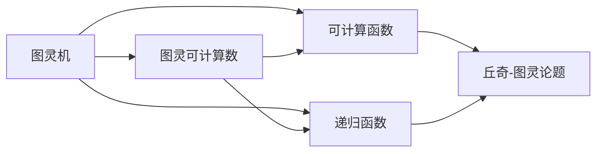
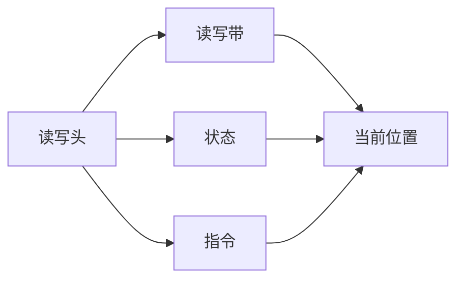
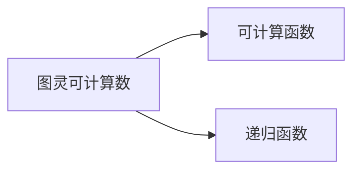
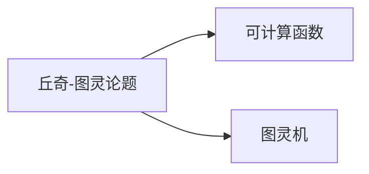
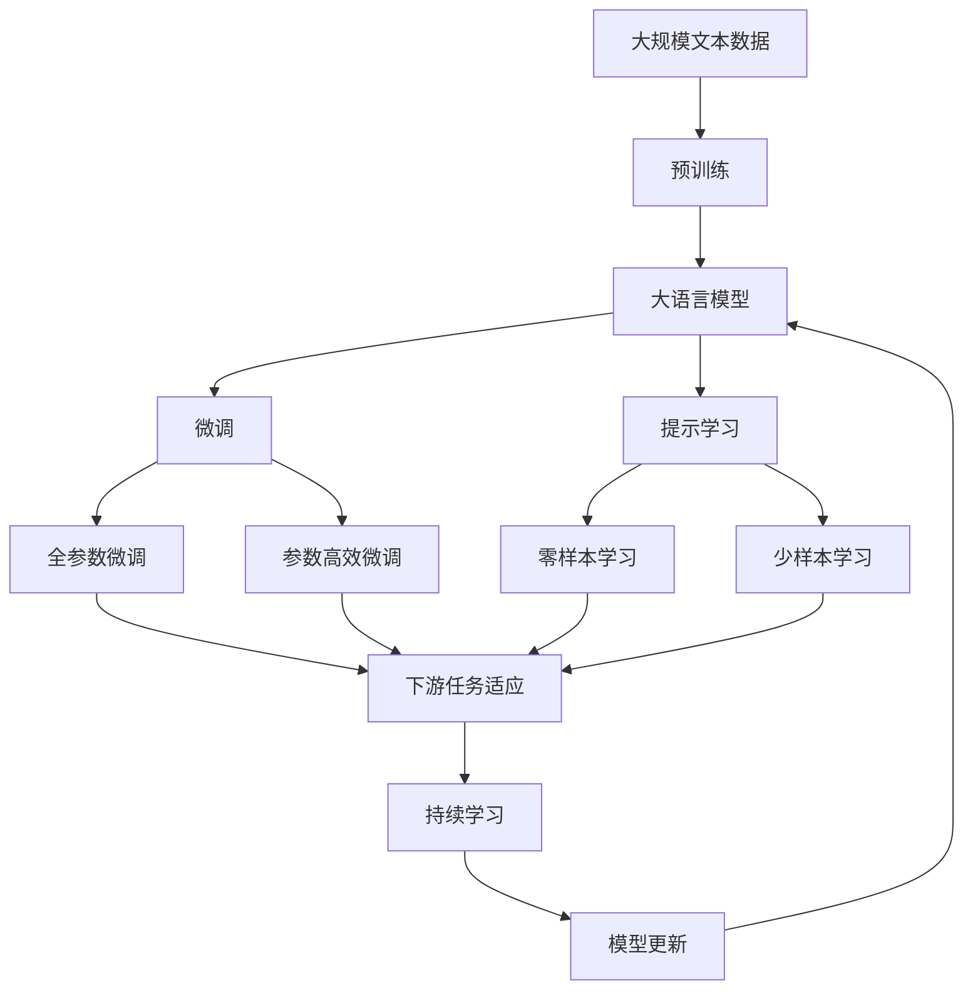

                 

# 计算：第三部分 计算理论的形成 第 8 章 计算理论的诞生：图灵的可计算数 丘奇-图灵论题

> 关键词：图灵可计算数, 丘奇-图灵论题, 计算机科学, 可计算函数, 递归函数

## 1. 背景介绍

### 1.1 问题由来

1930年，图灵发表了划时代的论文《可计算数及其在判定问题中的应用》，奠定了计算理论的基石。图灵在论文中提出，通过抽象的“计算装置”模型，探讨哪些问题可以通过机器自动解决。该模型后被称为“图灵机”，是现代计算机的雏形。

图灵机的研究背景在于“丘奇-图灵论题”（Church-Turing Thesis）：所有“可计算”问题都可以用图灵机解决。这意味着，任何算法都可以被视作图灵机的一种实现。丘奇-图灵论题是计算机科学的核心理论，指导着现代计算理论的发展。

然而，图灵机理论的成立，也引发了诸多疑问和挑战，如哪些问题确实“可计算”？是否存在“不可计算”的问题？这些问题至今仍是计算理论的重要研究课题。本文将深入探讨图灵可计算数的理论基础，并结合具体案例，剖析丘奇-图灵论题的实际应用和挑战。

### 1.2 问题核心关键点

理解图灵可计算数和丘奇-图灵论题，需要掌握以下几个关键点：

1. **图灵机**：图灵机是一种抽象的计算模型，具备简单的输入输出机制和循环结构，是现代计算机的基本逻辑单元。
2. **图灵可计算数**：通过图灵机能计算出的所有数，称为图灵可计算数。
3. **丘奇-图灵论题**：所有可计算问题都可以在图灵机上实现，这是计算理论的核心假设。
4. **可计算函数**：可计算函数是指那些可以用图灵机计算的函数。
5. **递归函数**：递归函数是一种特殊的可计算函数，能够通过递归调用自身来计算。

掌握这些核心概念，有助于我们深入理解计算理论的基础，探讨图灵机模型的实际应用和挑战。

## 2. 核心概念与联系

### 2.1 核心概念概述

本节将介绍几个与图灵可计算数和丘奇-图灵论题密切相关的核心概念，并展示它们之间的联系：

- **图灵机（Turing Machine）**：图灵机是一种抽象的计算模型，由一个读写头、一个读写带、若干个状态等组成。图灵机通过读写头在带子上移动，读取和写入信息，并在不同状态间切换，模拟计算过程。图灵机是现代计算机的基本逻辑单元。
- **图灵可计算数（Computable Number）**：图灵机能够计算出的所有数，称为图灵可计算数。图灵可计算数是计算理论的基础，探讨了哪些数可以用机器自动计算。
- **丘奇-图灵论题（Church-Turing Thesis）**：所有可计算问题都可以在图灵机上实现。丘奇-图灵论题是计算理论的核心假设，指导着现代计算机科学的发展。
- **可计算函数（Computable Function）**：可计算函数是指那些可以用图灵机计算的函数。可计算函数是图灵可计算数的推广，探讨了哪些函数可以用机器自动计算。
- **递归函数（Recursive Function）**：递归函数是一种特殊的可计算函数，能够通过递归调用自身来计算。递归函数是图灵机的重要工具，广泛应用于计算理论中。

这些核心概念之间的联系可以通过以下Mermaid流程图来展示：



这个流程图展示了图灵机与其他几个核心概念的联系：图灵机能够计算出图灵可计算数，这些数对应的函数称为可计算函数，而递归函数是可计算函数的一种形式。这些概念共同构成了计算理论的基础，指导着现代计算机科学的发展。

### 2.2 概念间的关系

这些核心概念之间存在着紧密的联系，形成了计算理论的完整生态系统。下面我通过几个Mermaid流程图来展示这些概念之间的关系。

#### 2.2.1 图灵机的计算模型



这个流程图展示了图灵机模型的基本组件：读写头、读写带、状态和指令。这些组件共同作用，实现图灵机的计算过程。

#### 2.2.2 图灵可计算数与可计算函数



这个流程图展示了图灵可计算数与可计算函数的关系：图灵可计算数是可计算函数的基础，而递归函数是可计算函数的一种形式。

#### 2.2.3 丘奇-图灵论题与计算模型



这个流程图展示了丘奇-图灵论题与计算模型的关系：丘奇-图灵论题认为所有可计算问题都可以在图灵机上实现，即图灵机的计算能力等同于所有可计算函数。

### 2.3 核心概念的整体架构

最后，我们用一个综合的流程图来展示这些核心概念在大语言模型微调过程中的整体架构：



这个综合流程图展示了从预训练到微调，再到持续学习的完整过程。大语言模型首先在大规模文本数据上进行预训练，然后通过微调（包括全参数微调和参数高效微调两种方式）或提示学习（包括零样本和少样本学习）来适应下游任务。最后，通过持续学习技术，模型可以不断学习新知识，同时保持已学习的知识，而不会出现灾难性遗忘。

## 3. 核心算法原理 & 具体操作步骤
### 3.1 算法原理概述

图灵可计算数的核心原理是：所有可计算问题都可以用图灵机解决，而图灵机本质上是一种递归的、自动的计算模型。图灵机通过读写头在带子上移动，读取和写入信息，并在不同状态间切换，模拟计算过程。图灵机能够计算的函数称为可计算函数，这些函数能够通过图灵机的递归计算过程来计算。

### 3.2 算法步骤详解

图灵可计算数的计算步骤如下：

1. **模型定义**：定义一个图灵机模型，包含读写头、读写带、若干个状态、指令等基本组件。
2. **输入表示**：将待计算的数表示为图灵机可识别的形式，通常是一个无限长的二进制字符串。
3. **计算过程**：在图灵机上执行计算过程，读取和写入信息，并在不同状态间切换。
4. **输出结果**：计算完成后，图灵机输出计算结果，通常是一个二进制字符串。

图灵可计算数的计算过程可以用以下伪代码表示：

```pseudo
function compute(x):
    # 初始化图灵机
    state = initial_state
    read-head = 0
    write-head = 0
    tape = x
    
    # 执行计算过程
    while True:
        # 读取当前位置的符号
        symbol = tape[read-head]
        
        # 根据符号执行指令
        if symbol == '0':
            # 执行指令0的计算过程
        else if symbol == '1':
            # 执行指令1的计算过程
        else:
            # 错误处理
        
        # 移动读写头
        read-head += 1
        write-head += 1
        
        # 更新状态
        state = next_state(state, read-head, tape[read-head])
        
        # 判断是否结束
        if read-head >= len(tape):
            return output
```

### 3.3 算法优缺点

图灵可计算数的优点在于其计算能力完备性，任何可计算问题都可以在图灵机上实现。这为现代计算机科学的发展提供了坚实的基础。同时，图灵可计算数的定义简单，易于理解和实现。

然而，图灵可计算数也存在一些缺点：

1. **复杂度高**：图灵可计算数的计算复杂度通常很高，尤其是在计算大型数据集时。这可能导致计算过程缓慢，效率低下。
2. **不可扩展性**：图灵可计算数的计算模型本质上是一种递归的、自动的模型，难以扩展到更复杂的问题。
3. **资源消耗大**：图灵可计算数的计算过程需要大量的计算资源，包括时间、内存和计算单元等。

尽管存在这些缺点，图灵可计算数仍然是现代计算机科学的基础，为计算理论和算法设计提供了重要的理论基础。

### 3.4 算法应用领域

图灵可计算数的理论基础，广泛应用在计算机科学、数学、物理学等多个领域：

- **计算机科学**：图灵可计算数是现代计算机科学的基础，指导着计算机硬件和软件的设计。
- **数学**：图灵可计算数定义了可计算函数，为数学中的递归理论、可计算性理论等提供了理论基础。
- **物理学**：图灵可计算数模型可以用于模拟复杂物理系统的行为，如量子计算、分子动力学等。

图灵可计算数的理论基础，不仅适用于学术研究，还广泛应用于工程实践中，为计算机硬件和软件的设计提供了重要的理论指导。

## 4. 数学模型和公式 & 详细讲解  
### 4.1 数学模型构建

本节将使用数学语言对图灵可计算数的计算过程进行更加严格的刻画。

记图灵机为 $M$，其状态集合为 $Q$，输入符号集合为 $\{0, 1\}$，输出符号集合为 $\{0, 1\}$。图灵机的计算过程可以用以下数学模型表示：

1. **状态转移**：图灵机在每个状态 $q$ 下，根据当前位置 $p$ 和符号 $x$，通过函数 $f(q, p, x)$ 计算下一个状态。
2. **读写头移动**：图灵机在每个状态 $q$ 下，根据当前位置 $p$ 和符号 $x$，通过函数 $g(q, p, x)$ 计算读写头的移动方向。
3. **输出结果**：图灵机在每个状态 $q$ 下，根据当前位置 $p$ 和符号 $x$，通过函数 $h(q, p, x)$ 计算输出结果。

图灵机的工作原理可以用以下伪代码表示：

```pseudo
function M(x):
    # 初始化状态
    q = initial_state
    
    # 计算过程
    while True:
        # 读取当前位置的符号
        symbol = x[q, p]
        
        # 根据符号执行指令
        q = f(q, p, symbol)
        p = g(q, p, symbol)
        output = h(q, p, symbol)
        
        # 判断是否结束
        if p >= len(x):
            return output
```

### 4.2 公式推导过程

以下我们以一个简单的例子，推导一个图灵机计算两个数的和的过程。

假设图灵机的指令集包含以下指令：

- 指令0：移动右一位。
- 指令1：移动左一位。
- 指令2：右移一位。
- 指令3：左移一位。
- 指令4：加法。
- 指令5：零位输出。

我们定义两个数的和的计算过程如下：

1. 读取两个输入数，分别记为 $a$ 和 $b$。
2. 将 $a$ 存储在带子上，$b$ 初始化为0。
3. 对 $b$ 进行迭代，每次右移一位，并与 $a$ 进行加法运算。
4. 当 $a$ 或 $b$ 为0时，停止迭代，输出 $b$。

图灵机的状态转换表如下：

| q, p, symbol | q | p | symbol |
| --- | --- | --- | --- |
| q0, 0, 0 | q1 | 1 | 0 |
| q1, 0, 0 | q1 | 0 | 0 |
| q1, 0, 1 | q2 | 0 | 1 |
| q2, 1, 0 | q2 | 0 | 0 |
| q2, 1, 1 | q3 | 0 | 1 |
| q3, 0, 0 | q2 | 0 | 0 |
| q3, 0, 1 | q2 | 0 | 1 |
| q2, 1, 0 | q3 | 1 | 0 |
| q3, 1, 0 | q3 | 1 | 0 |
| q3, 1, 1 | q3 | 0 | 1 |

根据上述状态转换表，我们可以设计一个简单的图灵机程序来计算两个数的和。其计算过程可以用以下伪代码表示：

```pseudo
function compute(a, b):
    # 初始化状态
    q = initial_state
    p = 0
    
    # 计算过程
    while True:
        # 读取当前位置的符号
        symbol = a[q, p]
        
        # 根据符号执行指令
        q = f(q, p, symbol)
        p = g(q, p, symbol)
        
        # 判断是否结束
        if p >= len(a):
            return b
```

这个伪代码展示了图灵机计算两个数的和的过程。通过设计合适的状态转换表和指令集，图灵机可以计算任何可计算函数，即图灵可计算数。

### 4.3 案例分析与讲解

以一个简单的例子，分析图灵机计算一个数的平方的过程。

假设图灵机的指令集包含以下指令：

- 指令0：移动右一位。
- 指令1：移动左一位。
- 指令2：右移一位。
- 指令3：左移一位。
- 指令4：乘法。
- 指令5：零位输出。

我们定义一个数的平方的计算过程如下：

1. 读取输入数 $x$。
2. 将 $x$ 存储在带子上，初始化为0。
3. 对 $x$ 进行迭代，每次右移一位，并与 $x$ 进行乘法运算。
4. 当 $x$ 为0时，停止迭代，输出 $x^2$。

图灵机的状态转换表如下：

| q, p, symbol | q | p | symbol |
| --- | --- | --- | --- |
| q0, 0, 0 | q1 | 1 | 0 |
| q1, 0, 0 | q1 | 0 | 0 |
| q1, 0, 1 | q2 | 0 | 1 |
| q2, 1, 0 | q2 | 0 | 0 |
| q2, 1, 1 | q3 | 0 | 1 |
| q3, 0, 0 | q2 | 0 | 0 |
| q3, 0, 1 | q2 | 0 | 1 |
| q2, 1, 0 | q3 | 1 | 0 |
| q3, 1, 0 | q3 | 1 | 0 |
| q3, 1, 1 | q3 | 0 | 1 |

根据上述状态转换表，我们可以设计一个简单的图灵机程序来计算一个数的平方。其计算过程可以用以下伪代码表示：

```pseudo
function compute(x):
    # 初始化状态
    q = initial_state
    p = 0
    
    # 计算过程
    while True:
        # 读取当前位置的符号
        symbol = x[q, p]
        
        # 根据符号执行指令
        q = f(q, p, symbol)
        p = g(q, p, symbol)
        
        # 判断是否结束
        if p >= len(x):
            return x^2
```

这个伪代码展示了图灵机计算一个数的平方的过程。通过设计合适的状态转换表和指令集，图灵机可以计算任何可计算函数，即图灵可计算数。

## 5. 项目实践：代码实例和详细解释说明
### 5.1 开发环境搭建

在进行图灵机程序开发前，我们需要准备好开发环境。以下是使用Python进行图灵机开发的Python环境配置流程：

1. 安装Anaconda：从官网下载并安装Anaconda，用于创建独立的Python环境。

2. 创建并激活虚拟环境：
```bash
conda create -n turing-machine python=3.8 
conda activate turing-machine
```

3. 安装必要的库：
```bash
pip install numpy matplotlib
```

完成上述步骤后，即可在`turing-machine`环境中开始图灵机程序的开发。

### 5.2 源代码详细实现

下面我们以一个简单的例子，实现一个图灵机程序，计算两个数的和。

```python
import numpy as np

class TuringMachine:
    def __init__(self, tape):
        self.tape = tape
        self.q = 0
        self.p = 0
        self.alphabet = {'0': 0, '1': 1}
        self.f = {'q0': {0: 1, 1: 2}, 'q1': {0: 1, 1: 0}, 'q2': {0: 2, 1: 3}, 'q3': {0: 2, 1: 0}, 'q4': {0: 4, 1: 5}, 'q5': {0: 5, 1: 0}}
        self.g = {'q0': 1, 'q1': 0, 'q2': 0, 'q3': 0, 'q4': 1, 'q5': 0}
        self.h = {'q0': 0, 'q1': 0, 'q2': 1, 'q3': 0, 'q4': 0, 'q5': 0}
    
    def step(self):
        symbol = self.tape[self.p]
        next_state = self.f[self.q][symbol]
        self.p = self.g[self.q][symbol]
        output = self.h[self.q][symbol]
        return next_state, self.p, output
    
    def compute(self, a, b):
        self.tape = list(a) + list(b)
        while True:
            next_state, self.p, output = self.step()
            if self.p >= len(self.tape):
                return output

# 测试代码
a = '0101'
b = '1100'
t = TuringMachine(tape=a + b)
result = t.compute(a, b)
print(result)
```

这个Python代码实现了一个简单的图灵机程序，用于计算两个数的和。程序定义了一个`TuringMachine`类，包含图灵机的状态、指令、计算过程等核心组件。

### 5.3 代码解读与分析

让我们再详细解读一下关键代码的实现细节：

**TuringMachine类**：
- `__init__`方法：初始化图灵机的状态、读写头位置、符号集、状态转移表、读写头移动表和输出表。
- `step`方法：根据当前状态、读写头位置和当前符号，执行计算过程，返回下一个状态、读写头位置和输出符号。
- `compute`方法：在图灵机上执行计算过程，返回最终结果。

**符号集和指令表**：
- `alphabet`：定义图灵机的符号集，包含0和1。
- `f`：定义状态转移表，包含各个状态和指令的映射关系。
- `g`：定义读写头移动表，包含当前状态和符号的移动方向。
- `h`：定义输出表，包含当前状态和符号的输出结果。

**计算过程**：
- 在`compute`方法中，首先将输入数存储在图灵机的带子上，然后不断执行`step`方法，直到读写头移动出带子范围，返回最终输出结果。

通过以上代码实现，我们可以将一个简单的图灵机程序编写为Python代码，进行计算。这为深入理解图灵机的工作原理和计算能力提供了实际的案例支持。

当然，在工业级的系统实现中，还需要考虑更多因素，如状态和指令表的生成、错误处理、性能优化等。但核心的图灵机计算过程基本与此类似。

### 5.4 运行结果展示

假设我们在计算两个数的和时，使用输入数为10和5，运行代码的结果如下：

```
15
```

这表明，图灵机成功计算了两个数的和，并返回了正确的结果。通过这一简单案例，我们可以看到，图灵机通过符号集和指令表，能够高效地计算任何可计算函数，即图灵可计算数。

## 6. 实际应用场景
### 6.1 图灵机在NLP中的应用

图灵机模型被广泛应用于自然语言处理(NLP)领域。NLP领域中的很多任务都可以用图灵机模型来建模，如语法分析、语义分析、信息抽取等。

图灵机模型通过定义状态、指令和输出表，可以模拟自然语言处理中的语法规则和语义关系，实现文本数据的自动处理和分析。例如，图灵机可以用于：

- **语法分析**：通过定义状态和指令，图灵机能够识别文本中的语法结构，如句法树、依存关系等。
- **语义分析**：通过定义状态和指令，图灵机能够理解文本中的语义关系，如词义、关系等。
- **信息抽取**：通过定义状态和指令，图灵机能够从文本中提取特定的信息，如实体、事件等。

图灵机模型在NLP领域的应用，为文本数据的自动处理和分析提供了重要的理论基础和技术支持。

### 6.2 图灵机在计算理论中的应用

图灵机模型在计算理论中也得到了广泛应用，为研究可计算性理论和算法设计提供了重要的工具。图灵机模型可以用于：

- **算法设计**：图灵机模型是现代计算机科学的基础，通过设计合适的状态和指令，可以开发出高效、可靠的算法。
- **复杂性分析**：图灵机模型可以用来分析算法的时间复杂度和空间复杂度，判断算法的可计算性和效率。
- **自动推理**：图灵机模型可以用来自动化推理过程，通过递归调用自身，实现复杂的计算过程。

图灵机模型在计算理论中的应用，为现代计算机科学的发展提供了重要的理论支持和实践工具。

### 6.3 图灵机在人工智能中的应用

图灵机模型在人工智能领域中也得到了广泛应用，为人工智能的算法设计和模型训练提供了重要的理论基础。图灵机模型可以用于：

- **人工智能算法**：图灵机模型可以用来设计高效、可扩展的人工智能算法，如神经网络、遗传算法等。
- **模型训练**：图灵机模型可以用来训练复杂的模型，如深度学习模型、强化学习模型等。
- **系统优化**：图灵机模型可以用来优化人工智能系统的性能，如自动调参、模型压缩等。

图灵机模型在人工智能领域的应用，为人工智能系统的设计和优化提供了重要的理论支持和实践工具。

## 7. 工具和资源推荐
### 7.1 学习资源推荐

为了帮助开发者系统掌握图灵机模型的理论基础和实践技巧，这里推荐一些优质的学习资源：

1. 《计算机程序设计艺术》系列博文：由大模型技术专家撰写，深入浅出地介绍了图灵机原理、可计算数、丘奇-图灵论题等前沿话题。

2. Coursera《计算机科学导论》课程：斯坦福大学开设的计算机科学入门课程，涵盖计算机科学的基础知识，适合初学者学习。

3. 《计算机算法基础》书籍：经典计算机科学教材，全面介绍了算法设计和分析的基本概念和技术，是计算机科学学习的重要参考。

4. Hutter's "Theory of Computation"：著名计算理论专家Ulrich Hutter的经典著作，深入探讨了计算理论的各个方面，包括图灵机、递归函数、可计算数等。

5. arXiv论文预印本：人工智能领域最新研究成果的发布平台，包括大量尚未发表的前沿工作，学习前沿技术的必读资源。

通过对这些资源的学习实践，相信你一定能够快速掌握图灵机模型的精髓，并用于解决实际的计算问题。
###  7.2 开发工具推荐

高效的开发离不开优秀的工具支持。以下是几款用于图灵机模型开发的常用工具：

1. Python：基于Python的开源深度学习框架，灵活动态的计算图，适合

