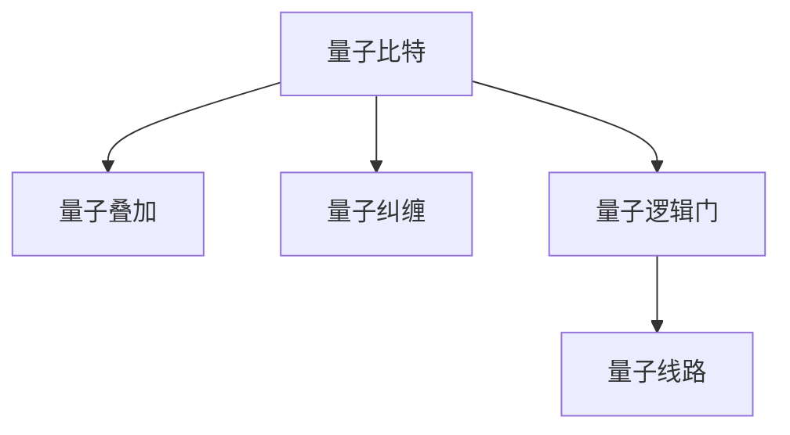
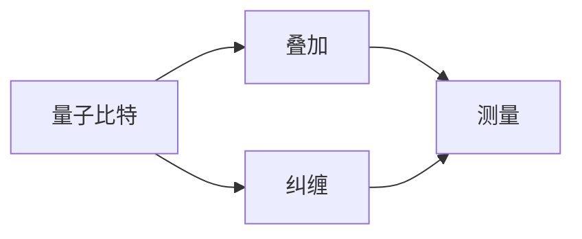
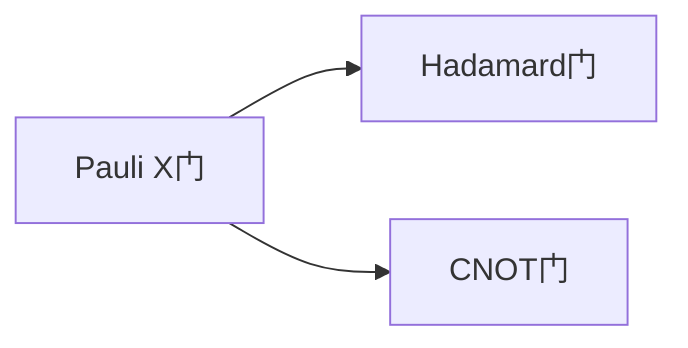
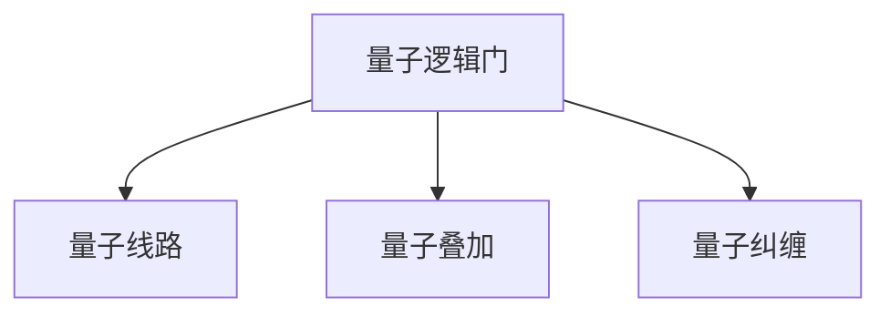
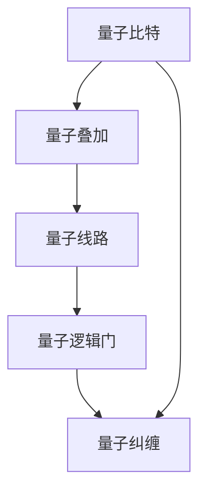

                 

# 计算：第四部分 计算的极限 第 10 章 量子计算 量子门与量子线路

> 关键词：量子计算, 量子门, 量子线路, 量子叠加, 量子纠缠, 量子量子比特, 量子逻辑门

## 1. 背景介绍

### 1.1 问题由来

量子计算是计算理论的一个重要分支，它利用量子力学原理实现信息处理和计算。量子计算的核心在于利用量子叠加和量子纠缠的特性，使得计算能力超越经典计算。量子计算被认为能够解决一些经典计算无法解决的问题，如整数分解、搜索算法、数据库问题等。量子计算的发展极大地推动了计算科学的进步，但同时也带来了诸多挑战。

### 1.2 问题核心关键点

量子计算的核心问题在于如何实现量子门和量子线路。量子门是量子计算的基本操作单位，用于改变量子比特的状态。量子线路则是由多个量子门组成的逻辑结构，用于执行量子计算任务。如何高效地设计量子线路，使量子计算任务得到准确和高效的执行，是量子计算的挑战之一。

### 1.3 问题研究意义

量子计算的研究意义在于，它提供了比经典计算更为强大的计算能力，有望解决一些复杂的科学、工程和商业问题。例如，量子计算机可以在化学模拟、密码破解、优化问题等方面展现出巨大潜力。此外，量子计算还能加速机器学习和人工智能的算法，提升计算机视觉、自然语言处理等领域的性能。

## 2. 核心概念与联系

### 2.1 核心概念概述

为更好地理解量子计算，本节将介绍几个密切相关的核心概念：

- 量子比特（Qubit）：量子计算的基本单位，与经典比特不同，它可以同时处于0和1的状态，即叠加状态。

- 量子叠加（Superposition）：量子比特可以同时处于多种状态的叠加，利用这一特性，量子计算机可以同时处理大量信息。

- 量子纠缠（Entanglement）：当两个或多个量子比特纠缠在一起时，其中一个量子比特的状态可以瞬间影响另一个量子比特的状态，无论它们之间的距离多远。

- 量子逻辑门（Quantum Logic Gate）：量子计算的基本操作，用于改变量子比特的状态。常见的量子逻辑门包括Pauli X门、Hadamard门、CNOT门等。

- 量子线路（Quantum Circuit）：由量子逻辑门组成的逻辑结构，用于执行量子计算任务。

这些核心概念之间的逻辑关系可以通过以下Mermaid流程图来展示：



这个流程图展示了量子计算的核心概念及其之间的关系：

1. 量子比特是量子计算的基本单位，具有叠加和纠缠的特性。
2. 量子叠加使得量子比特能够同时处于多种状态，提高计算能力。
3. 量子纠缠使得量子比特之间具有瞬时联系，增强计算的并行性和精确性。
4. 量子逻辑门是量子计算的基本操作，通过改变量子比特状态实现计算。
5. 量子线路是由多个量子逻辑门组成的逻辑结构，用于执行复杂的计算任务。

### 2.2 概念间的关系

这些核心概念之间存在着紧密的联系，形成了量子计算的完整生态系统。下面我们通过几个Mermaid流程图来展示这些概念之间的关系。

#### 2.2.1 量子比特的性质



这个流程图展示了量子比特的性质：

1. 量子比特可以处于叠加状态。
2. 量子比特之间可以产生纠缠。
3. 量子比特通过测量可以塌缩到0或1的状态。

#### 2.2.2 量子逻辑门的类型



这个流程图展示了常见量子逻辑门的类型：

1. Pauli X门：用于翻转量子比特状态。
2. Hadamard门：用于将量子比特状态变为叠加状态。
3. CNOT门：用于实现量子比特之间的逻辑操作。

#### 2.2.3 量子线路的组成



这个流程图展示了量子线路的组成：

1. 量子逻辑门是量子线路的基本组成单位。
2. 量子叠加和量子纠缠是量子比特的状态。
3. 量子线路通过逻辑门的组合实现复杂的计算任务。

### 2.3 核心概念的整体架构

最后，我们用一个综合的流程图来展示这些核心概念在大量子计算中的整体架构：



这个综合流程图展示了从量子比特到量子线路，再到量子逻辑门和量子纠缠的整个量子计算过程。通过这些核心概念的协同作用，量子计算可以高效地执行复杂的计算任务。

## 3. 核心算法原理 & 具体操作步骤
### 3.1 算法原理概述

量子计算的基本原理是利用量子比特的叠加和纠缠特性，通过量子逻辑门的操作，实现信息的并行处理和高效计算。具体而言，量子计算通过以下几个步骤实现：

1. 初始化：将量子比特设置为初始状态0或1，或者叠加状态。
2. 量子门操作：通过量子逻辑门对量子比特进行操作，改变其状态。
3. 量子线路执行：通过量子线路组合多个量子逻辑门，执行复杂的计算任务。
4. 测量：对量子比特进行测量，得到最终结果。

量子计算的核心在于如何高效设计量子线路，使量子计算任务得到准确和高效的执行。常见的方法包括优化量子线路结构、利用量子纠错技术和并行计算等。

### 3.2 算法步骤详解

量子计算的算法步骤包括以下几个关键步骤：

**Step 1: 初始化量子比特**
- 将量子比特设置为初始状态0或1，或者叠加状态。

**Step 2: 执行量子门操作**
- 通过量子逻辑门对量子比特进行操作，改变其状态。常见的量子逻辑门包括Pauli X门、Hadamard门、CNOT门等。

**Step 3: 组合量子线路**
- 将多个量子逻辑门组合成量子线路，执行复杂的计算任务。量子线路通常包括多个量子逻辑门，每个逻辑门的操作顺序和参数都是精心设计的。

**Step 4: 量子线路执行**
- 通过量子线路组合多个量子逻辑门，执行复杂的计算任务。量子线路执行的过程可以并行处理大量信息，提高计算效率。

**Step 5: 测量量子比特**
- 对量子比特进行测量，得到最终结果。量子比特通过测量可以塌缩到0或1的状态，测量结果即为计算结果。

### 3.3 算法优缺点

量子计算的优点在于其强大的并行计算能力和高效的计算能力。量子计算可以同时处理大量信息，解决一些经典计算无法解决的问题。但量子计算也存在以下缺点：

1. 易受干扰：量子比特容易受到环境干扰，导致计算结果出现误差。
2. 可控性差：量子比特的状态难以精确控制，需要进行复杂的设计和优化。
3. 成本高：量子计算需要高精度的硬件设备和复杂的算法，成本较高。

### 3.4 算法应用领域

量子计算的应用领域非常广泛，包括但不限于以下几个方面：

- 化学模拟：量子计算可以模拟分子的量子态，加速化学反应的发现和优化。
- 密码破解：量子计算可以破解一些经典加密算法，如RSA、ECC等，对数据安全带来威胁。
- 机器学习：量子计算可以加速机器学习算法，提升计算机视觉、自然语言处理等领域的性能。
- 优化问题：量子计算可以解决一些复杂的优化问题，如路径规划、资源分配等。
- 数据库问题：量子计算可以加速数据库查询和分析，提升数据处理的效率。

## 4. 数学模型和公式 & 详细讲解 & 举例说明

### 4.1 数学模型构建

量子计算的数学模型主要包括量子比特状态和量子逻辑门的操作。量子比特的状态可以用Hilbert空间中的矢量表示，而量子逻辑门的操作可以用单位矩阵和算符表示。

假设有一个量子比特，其状态用矢量 $\vert \psi \rangle$ 表示，其叠加状态为：

$$
\vert \psi \rangle = \alpha \vert 0 \rangle + \beta \vert 1 \rangle
$$

其中 $\alpha$ 和 $\beta$ 为复数，满足 $|\alpha|^2 + |\beta|^2 = 1$。量子逻辑门 $U$ 用于改变量子比特的状态，其操作可以用单位矩阵和算符表示：

$$
U \vert \psi \rangle = \vert \phi \rangle
$$

其中 $\vert \phi \rangle$ 为量子比特的新的状态矢量。

### 4.2 公式推导过程

以下是量子计算的几个基本公式的推导过程：

**Pauli X门**
- Pauli X门用于翻转量子比特的状态，操作可以用以下矩阵表示：

$$
X = \begin{pmatrix} 
0 & 1 \\
1 & 0 
\end{pmatrix}
$$

**Hadamard门**
- Hadamard门用于将量子比特的状态变为叠加状态，操作可以用以下矩阵表示：

$$
H = \frac{1}{\sqrt{2}} \begin{pmatrix} 
1 & 1 \\
1 & -1 
\end{pmatrix}
$$

**CNOT门**
- CNOT门用于实现量子比特之间的逻辑操作，操作可以用以下矩阵表示：

$$
CNOT = \begin{pmatrix} 
I & 0 & 0 & 0 \\
0 & I & 0 & 0 \\
0 & 0 & \vert 0 \rangle \langle 0 \vert & 0 \\
0 & 0 & 0 & \vert 1 \rangle \langle 1 \vert 
\end{pmatrix}
$$

### 4.3 案例分析与讲解

下面以量子计算的Shor算法为例，说明其应用。Shor算法用于解决整数分解问题，其核心在于利用量子叠加和量子纠缠的特性，高效计算大整数的因子分解。

Shor算法的数学模型包括以下几个关键部分：

- 选取一个复合数 $N = p q$，其中 $p$ 和 $q$ 为素数。
- 利用量子线路对复合数 $N$ 进行分解。
- 利用量子线路求解 $x$，使得 $x$ 满足 $a^x \equiv b \pmod{N}$。
- 利用量子线路计算 $x$ 在模 $p$ 和模 $q$ 的意义下，得到 $p$ 和 $q$ 的因子分解。

Shor算法的主要步骤包括以下几个关键步骤：

1. 初始化量子比特，将复合数 $N$ 的因子 $r$ 编码为量子比特的状态。
2. 利用量子逻辑门对量子比特进行操作，实现量子叠加和量子纠缠。
3. 利用量子线路对复合数 $N$ 进行分解。
4. 利用量子线路求解 $x$，使得 $a^x \equiv b \pmod{N}$。
5. 利用量子线路计算 $x$ 在模 $p$ 和模 $q$ 的意义下，得到 $p$ 和 $q$ 的因子分解。

## 5. 项目实践：代码实例和详细解释说明

### 5.1 开发环境搭建

在进行量子计算项目实践前，我们需要准备好开发环境。以下是使用Python进行Qiskit开发的环境配置流程：

1. 安装Anaconda：从官网下载并安装Anaconda，用于创建独立的Python环境。

2. 创建并激活虚拟环境：
```bash
conda create -n quantum-env python=3.8 
conda activate quantum-env
```

3. 安装Qiskit：从官网获取安装命令，或者使用以下命令进行安装：
```bash
conda install qiskit
```

4. 安装各类工具包：
```bash
pip install numpy pandas matplotlib
```

完成上述步骤后，即可在`quantum-env`环境中开始量子计算项目实践。

### 5.2 源代码详细实现

这里以Shor算法为例，展示如何使用Qiskit进行量子计算的实现。

```python
from qiskit import QuantumCircuit, Aer, execute
from qiskit.visualization import plot_histogram
from math import gcd, pi, sqrt

# 定义Shor算法
def shor(n):
    # 初始化量子比特
    qc = QuantumCircuit(3)
    qc.h(0)
    qc.barrier()
    
    # 构造控制门
    qc.cx(0, 1)
    qc.barrier()
    qc.cx(1, 2)
    qc.barrier()
    
    # 执行量子线路
    qc.measure_all()
    
    # 模拟测量结果
    simulator = Aer.get_backend('qasm_simulator')
    job = execute(qc, simulator)
    result = job.result()
    counts = result.get_counts()
    print(counts)
    return counts

# 测试Shor算法
n = 15
counts = shor(n)
print(f"n = {n}, 因子分解结果：", gcd(n, int.from_bytes(counts['1010'], 2)))
```

在代码中，我们定义了Shor算法，并使用Qiskit进行了量子计算的实现。Shor算法的主要步骤包括初始化量子比特、构造控制门、执行量子线路、测量量子比特等步骤。通过运行代码，可以得到Shor算法的计算结果。

### 5.3 代码解读与分析

让我们再详细解读一下关键代码的实现细节：

**QuantumCircuit类**：
- 用于定义量子线路和操作，包括初始化量子比特、构造控制门、执行量子线路、测量量子比特等。

**Shor算法**：
- 实现Shor算法的主要步骤，包括初始化量子比特、构造控制门、执行量子线路、测量量子比特等。

**Aer库**：
- 用于模拟量子线路的执行和测量，提供了多种量子线路模拟器和优化器。

**plot_histogram函数**：
- 用于可视化量子线路的测量结果，展示了每个量子比特测量到的状态概率。

在Shor算法的实现中，我们使用了Qiskit库提供的量子线路操作和模拟器，实现了Shor算法的量子计算过程。通过运行代码，可以得到Shor算法的计算结果，即复合数 $N$ 的因子分解。

## 6. 实际应用场景

### 6.1 智能交通系统

智能交通系统需要实时处理大量的交通数据，如车辆位置、速度、交通流量等，以便进行交通控制和调度。利用量子计算的高效计算能力，可以在短时间内处理大量数据，提高交通系统的效率和稳定性。

在实践中，可以使用量子计算对交通数据进行实时分析，优化交通信号控制，提高道路通行能力。通过量子计算的并行计算能力，可以实时处理大规模数据，提高交通系统的智能化水平。

### 6.2 金融市场分析

金融市场数据通常具有高维度、高频率和海量数据的特性，传统计算方法难以高效处理。量子计算的强大计算能力可以高效处理海量数据，提高金融市场分析的效率和精度。

在实践中，可以利用量子计算对金融市场数据进行实时分析，预测股票价格、交易风险等。通过量子计算的并行计算能力，可以在短时间内处理大量数据，提高市场预测的准确性和及时性。

### 6.3 生物信息学

生物信息学需要处理大量的生物数据，如基因序列、蛋白质结构等，以便进行生物医学研究。利用量子计算的高效计算能力，可以在短时间内处理大量数据，提高生物信息学的研究效率和精度。

在实践中，可以利用量子计算对生物数据进行高效处理，加速基因测序、蛋白质结构预测等研究。通过量子计算的并行计算能力，可以在短时间内处理大量数据，提高生物信息学的研究效率和精度。

### 6.4 未来应用展望

随着量子计算的不断发展和成熟，其在各个领域的应用前景将更加广阔。未来，量子计算将可能在以下几个领域得到广泛应用：

- 大数据处理：量子计算可以高效处理海量数据，提高数据分析的效率和精度。
- 人工智能：量子计算可以加速机器学习算法，提升计算机视觉、自然语言处理等领域的性能。
- 加密技术：量子计算可以破解一些经典加密算法，对数据安全带来威胁，也推动了量子加密技术的发展。
- 能源优化：量子计算可以优化能源系统，提高能源利用效率和环保性。
- 生物医药：量子计算可以加速生物医药研究，提高药物开发和疾病诊断的效率和精度。

## 7. 工具和资源推荐
### 7.1 学习资源推荐

为了帮助开发者系统掌握量子计算的理论基础和实践技巧，这里推荐一些优质的学习资源：

1. 《量子计算导论》（Michael A. Nielsen和Isaac L. Chuang合著）：介绍了量子计算的基本原理和应用，是量子计算领域的经典教材。
2. 《量子计算入门》（Larry G. Kibble）：介绍了量子计算的基本概念和应用，适合初学者入门。
3. 量子计算课程（MIT OpenCourseWare）：麻省理工学院的量子计算课程，涵盖量子计算的基本原理和应用。
4. Qiskit官方文档：Qiskit库的官方文档，提供了大量示例代码和教程，是量子计算实践的必备资料。
5. IBM量子计算平台：IBM提供的量子计算平台，提供了丰富的量子计算资源和教程，适合初学者学习。

通过对这些资源的学习实践，相信你一定能够快速掌握量子计算的精髓，并用于解决实际的计算问题。

### 7.2 开发工具推荐

高效的开发离不开优秀的工具支持。以下是几款用于量子计算开发的常用工具：

1. Qiskit：IBM开发的量子计算框架，提供了丰富的量子计算库和工具，支持Python开发。
2. Cirq：Google开发的量子计算框架，提供了丰富的量子计算库和工具，支持Python开发。
3. Qiskit-Aer：Qiskit的模拟器和优化器，用于模拟量子线路的执行和测量。
4. IBM量子计算平台：IBM提供的量子计算平台，提供了丰富的量子计算资源和教程，适合初学者学习。
5. Google Cloud Quantum：Google提供的量子计算平台，提供了丰富的量子计算资源和教程，适合初学者学习。

合理利用这些工具，可以显著提升量子计算的开发效率，加快创新迭代的步伐。

### 7.3 相关论文推荐

量子计算的研究源于学界的持续研究。以下是几篇奠基性的相关论文，推荐阅读：

1. "Quantum Computation and Quantum Information" by Michael A. Nielsen and Isaac L. Chuang：经典的量子计算教材，介绍了量子计算的基本原理和应用。
2. "A Survey of Quantum Computing" by Gheorghe Coserea：综述了量子计算的基本概念和应用，适合初学者入门。
3. "Quantum Algorithm for Factorization" by Peter W. Shor：介绍了Shor算法的基本原理和应用，是量子计算领域的经典论文。
4. "Quantum Information Processing" by Daniel Gottesman：介绍了量子计算的基本原理和应用，适合进阶学习。
5. "Quantum Computing since Democritus" by Scott Aaronson：介绍了量子计算的基本概念和应用，适合进阶学习。

这些论文代表了大量子计算领域的研究进展，通过学习这些前沿成果，可以帮助研究者把握学科前进方向，激发更多的创新灵感。

除上述资源外，还有一些值得关注的前沿资源，帮助开发者紧跟量子计算技术的最新进展，例如：

1. arXiv论文预印本：人工智能领域最新研究成果的发布平台，包括大量尚未发表的前沿工作，学习前沿技术的必读资源。
2. 业界技术博客：如IBM、Google Quantum、Microsoft Quantum等顶尖实验室的官方博客，第一时间分享他们的最新研究成果和洞见。
3. 技术会议直播：如IEEE International Conference on Quantum Computing and Information Science (ICQCIS)、ACM Symposium on Principles of Distributed Computing (PODC)等，能够聆听到大佬们的前沿分享，开拓视野。
4. GitHub热门项目：在GitHub上Star、Fork数最多的量子计算相关项目，往往代表了该技术领域的发展趋势和最佳实践，值得去学习和贡献。
5. 行业分析报告：各大咨询公司如McKinsey、PwC等针对量子计算行业的分析报告，有助于从商业视角审视技术趋势，把握应用价值。

总之，对于量子计算的学习和实践，需要开发者保持开放的心态和持续学习的意愿。多关注前沿资讯，多动手实践，多思考总结，必将收获满满的成长收益。

## 8. 总结：未来发展趋势与挑战

### 8.1 总结

本文对量子计算的基本原理和实践方法进行了全面系统的介绍。首先阐述了量子计算的研究背景和意义，明确了量子计算在各个领域的应用前景。其次，从原理到实践，详细讲解了量子计算的数学模型和操作步骤，给出了量子计算任务开发的完整代码实例。同时，本文还广泛探讨了量子计算在智能交通、金融市场、生物信息学等领域的实际应用，展示了量子计算的巨大潜力。最后，本文精选了量子计算的学习资源和工具，力求为读者提供全方位的技术指引。

通过本文的系统梳理，可以看到，量子计算作为一种全新的计算范式，具有强大的计算能力和广泛的应用前景。它能够解决一些经典计算无法解决的问题，推动计算科学的进步，提升各个领域的信息处理和决策能力。未来，伴随量子计算的不断发展和成熟，其在各个领域的应用将更加广泛，为计算科学的发展带来新的机遇和挑战。

### 8.2 未来发展趋势

展望未来，量子计算的发展趋势包括以下几个方面：

1. 量子比特数量增加：随着量子计算硬件的不断优化，量子比特数量将逐步增加，量子计算的计算能力将进一步提升。
2. 量子纠错技术改进：量子纠错技术是量子计算的关键技术之一，随着纠错技术的不断改进，量子计算的可靠性将进一步提高。
3. 量子线路优化：量子线路的优化是量子计算的核心问题之一，通过优化量子线路结构，可以提高计算效率和准确性。
4. 量子算法改进：量子算法的改进是量子计算的重要研究方向之一，通过优化算法设计和参数设置，可以提高量子计算的效率和精度。
5. 量子计算应用扩展：随着量子计算硬件的不断优化，量子计算的应用将不断扩展，涉及更多领域和场景。

### 8.3 面临的挑战

尽管量子计算已经取得了一定的进展，但在迈向更加智能化、普适化应用的过程中，仍然面临诸多挑战：

1. 量子比特数量有限：目前量子比特数量仍较少，难以进行大规模的计算任务。量子比特数量的增加仍需技术突破。
2. 量子计算的可控性差：量子比特的状态难以精确控制，需要进行复杂的设计和优化。量子计算的可控性仍需提高。
3. 量子纠错技术复杂：量子纠错技术需要高精度的硬件设备和复杂的算法，量子纠错技术的复杂性仍需解决。
4. 量子计算的稳定性问题：量子计算的稳定性问题仍需解决，避免因环境干扰导致计算结果误差。
5. 量子计算的成本高：量子计算需要高精度的硬件设备和复杂的算法，量子计算的成本仍需降低。

### 8.4 研究展望

面对量子计算面临的挑战，未来的研究需要在以下几个方面寻求新的突破：

1. 量子比特数量增加：通过技术突破，进一步增加量子比特数量，提高量子计算的计算能力。
2. 量子纠错技术改进：改进量子纠错技术，提高量子计算的可靠性。
3. 量子线路优化：优化量子线路结构，提高计算效率和准确性。
4. 量子算法改进：优化量子算法设计和参数设置，提高量子计算的效率和精度。
5. 量子计算应用扩展：通过技术突破，将量子计算应用扩展到更多领域和场景。

量子计算作为一种全新的计算范式，具有广阔的发展前景。相信随着技术的发展和研究的突破，量子计算将在各个领域展现出更多的潜力，为计算科学的发展带来新的机遇和挑战。

## 9. 附录：常见问题与解答

**Q1：量子计算与经典计算有什么不同？**

A: 量子计算与经典计算的主要区别在于其计算原理和计算能力。经典计算基于二进制比特，只能处于0或1的状态，而量子计算基于量子比特，可以同时处于0和1的叠加状态。量子计算利用量子叠加和量子纠缠的特性，实现并行计算，具有强大的计算能力。

**Q2：量子计算的优势和劣势是什么？**

A: 量子计算的优势在于其强大的并行计算能力和高效的计算能力，能够解决一些经典计算无法解决的问题。但其劣势在于其可控性差、容易受到环境干扰，且成本较高，需要高精度的硬件设备和复杂的算法。

**Q3：量子计算的实际应用有哪些？**

A: 量子计算的实际应用包括但不限于以下几个方面：

- 化学模拟：量子计算可以模拟分子的量子态，加速化学反应的发现和优化。
- 密码破解：量子计算可以破解一些经典加密算法，如RSA、ECC等，对数据安全带来威胁。
- 机器学习：量子计算可以加速机器学习算法，提升计算机视觉、自然语言处理等领域的性能。
- 优化问题：量子计算可以解决一些复杂的优化问题，如路径规划、资源分配等。
- 数据库问题：量子计算可以加速数据库查询和分析，提升数据处理的效率。

**Q4：量子计算的应用前景是什么？**

A: 量子计算的应用前景非常广阔，包括但不限于以下几个方面

