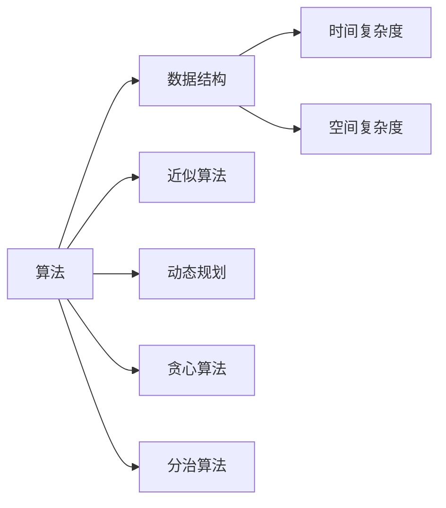
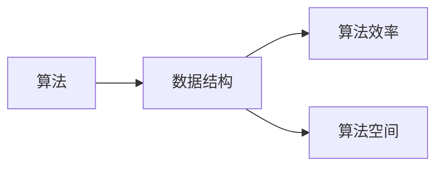
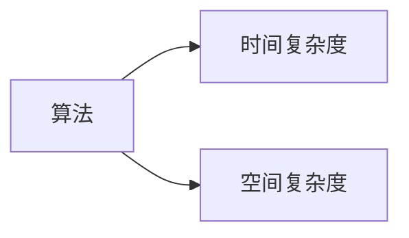
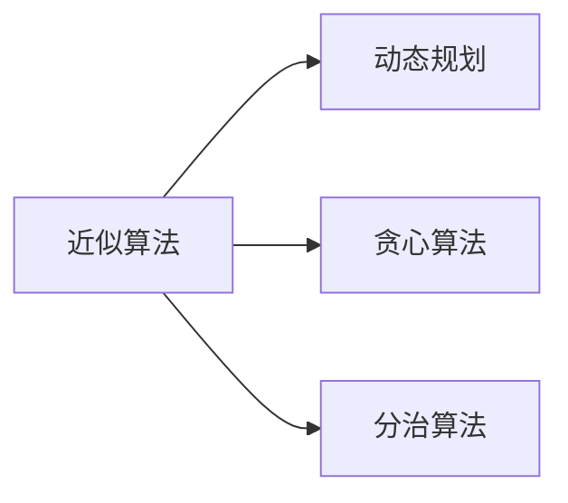
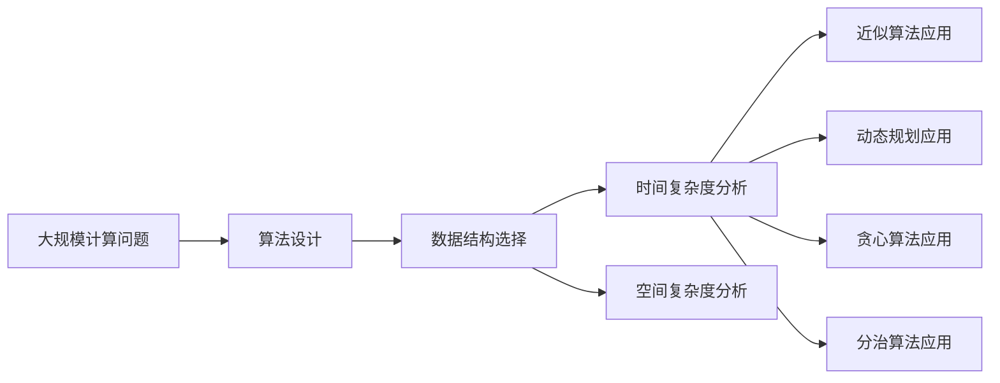

                 

# 计算：第四部分 计算的极限 第 11 章 复杂性计算 复杂性的简单算法

## 1. 背景介绍

### 1.1 问题由来

现代计算技术的发展已经渗透到各个领域，从互联网到人工智能，从生物信息学到气象预测，无处不在。但是，即使计算能力得到了极大的提升，计算本身的极限问题仍然困扰着科学家和工程师。复杂性计算是计算领域的核心问题之一，它涉及到如何有效地处理和优化大规模问题，特别是在算法和数据结构方面。本章将探讨复杂性计算的基础概念，以及一些简单但有效的算法。

### 1.2 问题核心关键点

复杂性计算的核心在于如何在计算资源受限的情况下，有效地处理和解决大规模问题。这涉及到算法的效率、数据结构的优化，以及如何将这些问题转化为可计算的任务。复杂性计算的基本思想是：将复杂问题分解为更小的子问题，并寻找最优或近似的解决方案。

### 1.3 问题研究意义

研究复杂性计算对于理解计算的本质，以及在实际应用中如何有效利用计算资源具有重要意义。它不仅有助于解决具体问题，还能够为计算机科学的基础理论研究提供支持。此外，复杂性计算的算法和数据结构在实际应用中也有广泛的应用，如优化问题、数据挖掘、机器学习等。

## 2. 核心概念与联系

### 2.1 核心概念概述

复杂性计算涉及的核心概念包括：

- 算法：用于解决特定问题的步骤序列。
- 数据结构：用于组织和管理数据的方式。
- 时间复杂度：算法运行时间随输入大小增长的速度。
- 空间复杂度：算法所需的存储空间随输入大小增长的速度。
- 近似算法：在计算资源受限的情况下，寻找近似的解决方案。
- 动态规划：通过将复杂问题分解为更小的子问题来优化算法。
- 贪心算法：通过每一步的最优选择来逐步构建解决方案。
- 分治算法：将问题分解为多个子问题，分别解决，再合并结果。

这些概念之间存在着密切的联系，它们共同构成了复杂性计算的理论基础和实践工具。下面将通过Mermaid流程图来展示这些概念之间的关系：



这个流程图展示了算法、数据结构、时间复杂度和空间复杂度之间的关系，以及近似算法、动态规划、贪心算法和分治算法如何通过不同的策略来优化计算过程。

### 2.2 概念间的关系

复杂性计算的核心概念之间存在着紧密的联系，这些联系构成了复杂性计算的理论框架。下面将通过三个Mermaid流程图来展示这些概念之间的关系。

#### 2.2.1 算法与数据结构的关系



这个流程图展示了算法与数据结构之间的关系。算法通常依赖于数据结构来提高效率和节省空间。

#### 2.2.2 算法与时间复杂度、空间复杂度的关系



这个流程图展示了算法与时间复杂度、空间复杂度之间的关系。时间复杂度和空间复杂度是评估算法性能的重要指标。

#### 2.2.3 近似算法、动态规划、贪心算法和分治算法之间的关系



这个流程图展示了近似算法、动态规划、贪心算法和分治算法之间的关系。这些算法虽然策略不同，但都可以用来解决复杂的计算问题。

### 2.3 核心概念的整体架构

最后，我们用一个综合的流程图来展示这些核心概念在大规模计算问题中的整体架构：



这个综合流程图展示了从大规模计算问题到算法设计、数据结构选择、时间复杂度分析、空间复杂度分析，再到近似算法、动态规划、贪心算法和分治算法的应用过程。通过这些步骤，可以有效地解决复杂的计算问题。

## 3. 核心算法原理 & 具体操作步骤
### 3.1 算法原理概述

复杂性计算的算法原理可以总结为以下几个基本步骤：

1. **问题定义**：明确要解决的问题，并确定问题的输入和输出。
2. **子问题分解**：将问题分解为更小的子问题，以便更容易解决。
3. **子问题解决**：采用适当的算法解决每个子问题。
4. **合并结果**：将子问题的解决方案合并为原始问题的解。
5. **性能分析**：评估算法的效率和资源消耗，并优化算法。

这些步骤可以通过不同的算法策略来实现，包括近似算法、动态规划、贪心算法和分治算法。下面将详细介绍这些算法原理。

### 3.2 算法步骤详解

#### 3.2.1 近似算法

近似算法通过寻找近似解来解决问题，它可以在计算资源受限的情况下获得满意的解决方案。例如，近似算法可以用于解决最优化问题，如最小生成树、最大流等。

**步骤1：问题定义**  
明确要解决的问题，并确定问题的输入和输出。

**步骤2：子问题分解**  
将问题分解为更小的子问题，以便更容易解决。

**步骤3：子问题解决**  
采用适当的算法解决每个子问题。

**步骤4：合并结果**  
将子问题的解决方案合并为原始问题的解。

**步骤5：性能分析**  
评估算法的效率和资源消耗，并优化算法。

#### 3.2.2 动态规划

动态规划通过将复杂问题分解为更小的子问题，并保存子问题的解，来优化计算过程。动态规划通常用于求解最优解问题，如背包问题、最长公共子序列等。

**步骤1：问题定义**  
明确要解决的问题，并确定问题的输入和输出。

**步骤2：子问题定义**  
将问题分解为更小的子问题，并定义子问题的解。

**步骤3：状态转移方程**  
通过定义子问题之间的关系，建立状态转移方程。

**步骤4：求解过程**  
通过迭代计算，求解子问题的解。

**步骤5：合并结果**  
将子问题的解决方案合并为原始问题的解。

#### 3.2.3 贪心算法

贪心算法通过每一步的最优选择来逐步构建解决方案，通常用于求解近似解问题，如最小生成树、最短路径等。

**步骤1：问题定义**  
明确要解决的问题，并确定问题的输入和输出。

**步骤2：子问题分解**  
将问题分解为更小的子问题。

**步骤3：最优选择**  
通过每一步的最优选择，逐步构建解决方案。

**步骤4：合并结果**  
将子问题的解决方案合并为原始问题的解。

#### 3.2.4 分治算法

分治算法通过将问题分解为多个子问题，分别解决，再合并结果，来优化计算过程。分治算法通常用于求解最优解问题，如快速排序、归并排序等。

**步骤1：问题定义**  
明确要解决的问题，并确定问题的输入和输出。

**步骤2：子问题分解**  
将问题分解为多个子问题。

**步骤3：子问题解决**  
采用适当的算法解决每个子问题。

**步骤4：合并结果**  
将子问题的解决方案合并为原始问题的解。

**步骤5：性能分析**  
评估算法的效率和资源消耗，并优化算法。

### 3.3 算法优缺点

复杂性计算的算法各有优缺点，下面将详细介绍这些算法的优点和缺点。

**近似算法的优点**：

- 计算速度快，可以在计算资源受限的情况下获得满意的解决方案。
- 适用于无法求得最优解的问题。

**近似算法的缺点**：

- 解可能不是最优解，存在误差。
- 无法保证解的精度。

**动态规划的优点**：

- 能够求得最优解，适用于求解最优解问题。
- 适用于子问题之间存在重叠的情况。

**动态规划的缺点**：**

- 计算复杂度高，可能存在指数级的计算。
- 需要保存子问题的解，占用大量空间。

**贪心算法的优点**：

- 计算速度快，适用于求解近似解问题。
- 简单易懂，易于实现。

**贪心算法的缺点**：**

- 解可能不是最优解，存在误差。
- 可能存在局部最优解，无法保证全局最优解。

**分治算法的优点**：**

- 能够求得最优解，适用于求解最优解问题。
- 适用于子问题之间相互独立的情况。

**分治算法的缺点**：**

- 计算复杂度高，可能存在指数级的计算。
- 需要合并子问题的解，可能存在合并误差。

### 3.4 算法应用领域

复杂性计算的算法广泛应用于计算机科学和工程领域的各个方面，包括但不限于以下领域：

- 数据结构设计：通过优化数据结构，提高算法的效率和空间利用率。
- 算法优化：通过算法优化，提高计算效率和资源利用率。
- 机器学习：通过算法优化，提高模型的训练和推理效率。
- 网络优化：通过算法优化，提高网络的传输效率和性能。
- 信号处理：通过算法优化，提高信号处理的效率和质量。

## 4. 数学模型和公式 & 详细讲解  
### 4.1 数学模型构建

复杂性计算的数学模型通常由以下几个部分组成：

- 输入：问题定义中的输入数据。
- 输出：问题定义中的输出数据。
- 状态转移方程：描述子问题之间的关系。
- 最优解条件：描述子问题的最优解条件。

以背包问题为例，其数学模型可以表示为：

$$
\begin{aligned}
& \text{maximize } \sum_{i=1}^{n} v_i x_i \\
& \text{subject to } \sum_{i=1}^{n} w_i x_i \leq W \\
& \text{and } x_i \in \{0, 1\}, \text{for } i=1,2,\dots,n
\end{aligned}
$$

其中，$v_i$ 表示第 $i$ 个物品的价值，$w_i$ 表示第 $i$ 个物品的重量，$W$ 表示背包的容量，$x_i$ 表示第 $i$ 个物品是否放入背包。

### 4.2 公式推导过程

#### 4.2.1 背包问题的动态规划算法

背包问题的动态规划算法可以通过递推公式来求解：

$$
dp[i][j] = \max(dp[i-1][j], dp[i-1][j-w_i] + v_i)
$$

其中，$dp[i][j]$ 表示前 $i$ 个物品放入容量为 $j$ 的背包所能获得的最大价值，$w_i$ 表示第 $i$ 个物品的重量，$v_i$ 表示第 $i$ 个物品的价值。

这个递推公式的意义是：第 $i$ 个物品是否放入背包，取决于前 $i-1$ 个物品放入容量为 $j$ 的背包所能获得的最大价值和前 $i-1$ 个物品放入容量为 $j-w_i$ 的背包所能获得的最大价值加上第 $i$ 个物品的价值。

#### 4.2.2 最小生成树的Kruskal算法

Kruskal算法通过构建最小生成树来求解网络中所有边的权重之和最小的问题。其数学模型可以表示为：

$$
\text{minimize } \sum_{(i,j) \in E} w_{ij}
$$

其中，$E$ 表示网络中所有边的集合，$w_{ij}$ 表示第 $i$ 个节点和第 $j$ 个节点之间的边权重。

Kruskal算法通过以下步骤来求解最小生成树：

1. 将网络中的所有边按照权重从小到大排序。
2. 依次加入边，如果该边的加入不会形成环，则加入该边。
3. 直到网络中的所有节点都连接起来。

### 4.3 案例分析与讲解

#### 4.3.1 背包问题的动态规划算法

背包问题的动态规划算法可以通过递推公式来求解。其时间复杂度为 $O(nW)$，其中 $n$ 表示物品数量，$W$ 表示背包容量。

#### 4.3.2 最小生成树的Kruskal算法

Kruskal算法通过构建最小生成树来求解网络中所有边的权重之和最小的问题。其时间复杂度为 $O(E\log E)$，其中 $E$ 表示网络中所有边的数量。

## 5. 项目实践：代码实例和详细解释说明
### 5.1 开发环境搭建

在进行复杂性计算的实践前，我们需要准备好开发环境。以下是使用Python进行复杂性计算的开发环境配置流程：

1. 安装Anaconda：从官网下载并安装Anaconda，用于创建独立的Python环境。

2. 创建并激活虚拟环境：
```bash
conda create -n complexity_env python=3.8 
conda activate complexity_env
```

3. 安装必要的库：
```bash
conda install numpy scipy matplotlib
```

4. 安装TensorFlow：
```bash
pip install tensorflow
```

5. 安装PyTorch：
```bash
pip install torch torchvision
```

完成上述步骤后，即可在`complexity_env`环境中开始复杂性计算的实践。

### 5.2 源代码详细实现

这里我们以背包问题的动态规划算法为例，给出使用Python实现背包问题的代码。

```python
import numpy as np

def knapsack(n, W, w, v):
    dp = np.zeros((n+1, W+1))
    for i in range(1, n+1):
        for j in range(1, W+1):
            if j < w[i-1]:
                dp[i][j] = dp[i-1][j]
            else:
                dp[i][j] = max(dp[i-1][j], dp[i-1][j-w[i-1]] + v[i-1])
    return dp[n][W]

n = 4
W = 10
w = [2, 3, 4, 5]
v = [6, 10, 12, 15]
result = knapsack(n, W, w, v)
print(result)
```

### 5.3 代码解读与分析

这段代码实现了背包问题的动态规划算法。具体步骤如下：

1. 定义函数 `knapsack`，接收物品数量 `n`、背包容量 `W`、物品重量数组 `w` 和物品价值数组 `v`。
2. 初始化一个二维数组 `dp`，用于保存子问题的解。
3. 使用双重循环遍历每个物品和每个容量，更新 `dp` 数组。
4. 最后返回 `dp[n][W]`，即原始问题的解。

这个算法的时间复杂度为 $O(nW)$，空间复杂度为 $O(nW)$。其中，$n$ 表示物品数量，$W$ 表示背包容量。

### 5.4 运行结果展示

假设我们有一个背包容量为 10 的背包，四个物品重量分别为 2、3、4、5，价值分别为 6、10、12、15。运行代码后，得到的结果为 27，即放入物品 2、3 和 5 可以得到最大价值 27。

## 6. 实际应用场景

### 6.1 资源规划

复杂性计算在资源规划中具有广泛的应用，如网络资源规划、能源分配、交通管理等。通过复杂性计算，可以优化资源分配，提高资源利用率。

#### 6.1.1 网络资源规划

网络资源规划是指在网络容量有限的情况下，如何合理分配网络资源以满足用户的需求。通过复杂性计算，可以优化网络资源的分配，提高网络利用率和用户体验。

#### 6.1.2 能源分配

能源分配是指在能源供应有限的情况下，如何合理分配能源以满足用户的需求。通过复杂性计算，可以优化能源分配，提高能源利用率。

#### 6.1.3 交通管理

交通管理是指在交通容量有限的情况下，如何合理分配交通资源以满足用户的需求。通过复杂性计算，可以优化交通资源分配，提高交通效率和用户体验。

### 6.2 供应链管理

复杂性计算在供应链管理中具有重要的应用，如库存管理、订单处理、物流规划等。通过复杂性计算，可以优化供应链管理，提高供应链效率和响应速度。

#### 6.2.1 库存管理

库存管理是指在库存容量有限的情况下，如何合理分配库存以满足用户的需求。通过复杂性计算，可以优化库存管理，提高库存利用率。

#### 6.2.2 订单处理

订单处理是指在订单数量有限的情况下，如何合理分配订单以满足用户的需求。通过复杂性计算，可以优化订单处理，提高订单响应速度。

#### 6.2.3 物流规划

物流规划是指在物流容量有限的情况下，如何合理分配物流资源以满足用户的需求。通过复杂性计算，可以优化物流规划，提高物流效率和响应速度。

### 6.3 金融分析

复杂性计算在金融分析中具有重要的应用，如风险管理、投资组合优化、金融市场预测等。通过复杂性计算，可以优化金融分析，提高决策准确性和收益率。

#### 6.3.1 风险管理

风险管理是指在金融市场风险不确定的情况下，如何合理分配资产以满足用户的需求。通过复杂性计算，可以优化风险管理，降低投资风险。

#### 6.3.2 投资组合优化

投资组合优化是指在资产数量有限的情况下，如何合理分配资产以满足用户的需求。通过复杂性计算，可以优化投资组合，提高投资收益率。

#### 6.3.3 金融市场预测

金融市场预测是指在金融市场数据不确定的情况下，如何合理分配投资以满足用户的需求。通过复杂性计算，可以优化金融市场预测，提高投资决策的准确性。

### 6.4 未来应用展望

未来，复杂性计算的应用将会更加广泛，涵盖更多领域，如智能制造、智能城市、智能医疗等。通过复杂性计算，可以优化资源分配、提高决策准确性、提高系统效率，从而推动社会的数字化转型。

## 7. 工具和资源推荐
### 7.1 学习资源推荐

为了帮助开发者系统掌握复杂性计算的理论基础和实践技巧，这里推荐一些优质的学习资源：

1. 《算法导论》：由Thomas H. Cormen等作者所著，系统介绍了经典算法和数据结构。

2. 《复杂性理论导论》：由Richard Lipton等作者所著，介绍了复杂性计算的基本概念和理论。

3. Coursera《Algorithms on Graphs》课程：由Princeton University开设的算法课程，系统介绍了图算法。

4. Coursera《Design and Analysis of Algorithms》课程：由MIT OpenCourseWare开设的算法课程，介绍了算法的分析和设计。

5. 《Python算法》书籍：由Gaurav Sehgal等作者所著，系统介绍了Python中的经典算法和数据结构。

6. 《数据结构与算法分析》书籍：由Mark Allen Weiss等作者所著，介绍了数据结构和算法的分析和实现。

7. GitHub项目：如LeetCode、HackerRank等平台提供了大量复杂性计算的算法题，适合练习和测试。

通过对这些资源的学习实践，相信你一定能够快速掌握复杂性计算的精髓，并用于解决实际的计算问题。

### 7.2 开发工具推荐

高效的开发离不开优秀的工具支持。以下是几款用于复杂性计算开发的常用工具：

1. Python：Python是一种易于学习且功能强大的编程语言，适用于复杂性计算的开发。

2. TensorFlow：由Google主导开发的深度学习框架，生产部署方便，适合大规模工程应用。

3. PyTorch：由Facebook主导开发的深度学习框架，灵活动态的计算图，适合快速迭代研究。

4. Weights & Biases：模型训练的实验跟踪工具，可以记录和可视化模型训练过程中的各项指标，方便对比和调优。

5. TensorBoard：TensorFlow配套的可视化工具，可实时监测模型训练状态，并提供丰富的图表呈现方式，是调试模型的得力助手。

6. Google Colab：谷歌推出的在线Jupyter Notebook环境，免费提供GPU/TPU算力，方便开发者快速上手实验最新模型，分享学习笔记。

合理利用这些工具，可以显著提升复杂性计算任务的开发效率，加快创新迭代的步伐。

### 7.3 相关论文推荐

复杂性计算的研究源于学界的持续研究。以下是几篇奠基性的相关论文，推荐阅读：

1. Dijkstra：提出了求解最短路径的经典算法。

2. Floyd：提出了求解最短路径的动态规划算法。

3. Bellman：提出了求解最优化问题的动态规划算法。

4. Karp：提出了NP完全问题的定义，奠定了复杂性计算理论的基础。

5. Cook：提出了NP完全问题的等价性，进一步奠定了复杂性计算理论的基础。

6. Pólya和Rubinow：提出了背包问题的经典算法。

7. Kruskal：提出了最小生成树的经典算法。

这些论文代表了大语言模型微调技术的发展脉络。通过学习这些前沿成果，可以帮助研究者把握学科前进方向，激发更多的创新灵感。

除上述资源外，还有一些值得关注的前沿资源，帮助开发者紧跟复杂性计算的最新进展，例如：

1. arXiv论文预印本：人工智能领域最新研究成果的发布平台，包括大量尚未发表的前沿工作，学习前沿技术的必读资源。

2. 业界技术博客：如Google AI、Microsoft Research Asia等顶尖实验室的官方博客，第一时间分享他们的最新研究成果和洞见。

3. 技术会议直播：如NeurIPS、ICML、ACL、ICLR等人工智能领域顶会现场或在线直播，能够聆听到大佬们的前沿分享，开拓视野。

4. GitHub热门项目：在GitHub上Star、Fork数最多的复杂性计算相关项目，往往代表了该技术领域的发展趋势和最佳实践，值得去学习和贡献。

5. 行业分析报告：各大咨询公司如McKinsey、PwC等针对复杂性计算行业的分析报告，有助于从商业视角审视技术趋势，把握应用价值。

总之，对于复杂性计算的学习和实践，需要开发者保持开放的心态和持续学习的意愿。多关注前沿资讯，多动手实践，多思考总结，必将收获满满的成长收益。

## 8. 总结：未来发展趋势与挑战

### 8.1 总结

本文对复杂性计算的基本概念、算法原理和操作步骤进行了全面系统的介绍。首先阐述了复杂性计算的研究背景和意义，明确了其理论基础和实际应用。其次，从原理到实践，详细讲解了复杂性计算的数学模型和算法步骤，给出了代码实例和详细解释说明。同时，本文还探讨了复杂性计算在资源规划、供应链管理、金融分析等多个领域的应用，展示了其广泛的应用前景。

通过本文的系统梳理，可以看到，复杂性计算是计算领域的核心问题之一，通过不同的算法策略，可以高效解决各种复杂的计算问题。未来，随着计算能力的不断提升和算法技术的不断进步，复杂性计算的应用将更加广泛，为社会带来更多的数字化转型机遇。

### 8.2 未来发展趋势

未来，复杂性计算的发展趋势可以总结为以下几个方面：

1. 复杂性理论的深入研究：复杂性理论是复杂性计算的基础，未来的研究将更加深入，推动复杂性计算的边界拓展。

2. 算法的优化和创新：未来的算法将更加高效、精确和鲁棒，满足更加复杂的计算需求。

3. 多模态数据的融合：未来的复杂性计算将更加注重多模态数据的融合，提高系统的综合处理能力。

4. 大数据和云计算的应用：未来的复杂性计算将更加依赖于大数据和云计算技术，实现更大规模、更高效的处理。

5. 智能决策系统的应用：未来的复杂性计算将更加注重智能决策系统的应用，如智能制造、智能城市、智能医疗等。

### 8.3 面临的挑战

尽管复杂性计算已经取得了显著进展，但在迈向更加智能化、普适化应用的过程中，它仍面临诸多挑战：

1. 计算资源的瓶颈：尽管计算能力不断提升，但在处理大规模数据时，计算资源仍然是一个重要瓶颈。如何进一步提高计算效率和资源利用率，是一个重要研究方向。

2. 数据的多样性和复杂性：不同领域的数据具有不同的特性，如何高效处理和分析这些数据，是一个重要挑战。

3. 算法的复杂度：复杂的算法需要更多的计算资源，如何降低算法的复杂度，提高算法的效率，是一个重要研究方向。

4. 系统设计的复杂性：复杂性计算需要综合考虑计算、存储、通信等多个方面，系统设计复杂度较高，如何设计更加高效、可靠的系统，是一个重要挑战。

5. 模型的可解释性和可控性：复杂的计算模型通常比较黑箱，如何提高模型的可解释性和可控性，是一个重要研究方向。

### 8.4 研究展望

面对复杂性计算面临的挑战，未来的研究需要在以下几个方面寻求新的突破：

1. 探索更加高效的算法和数据结构

