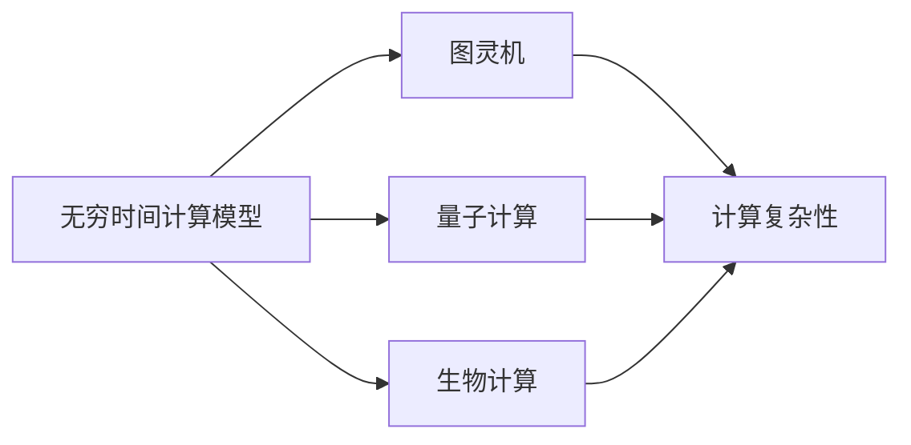
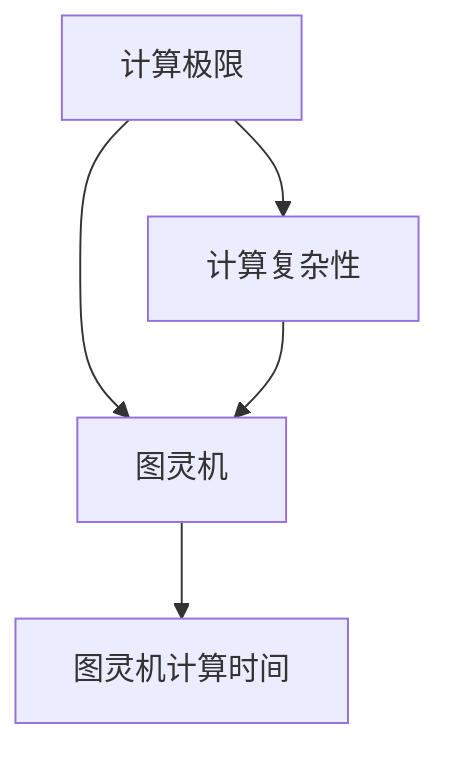
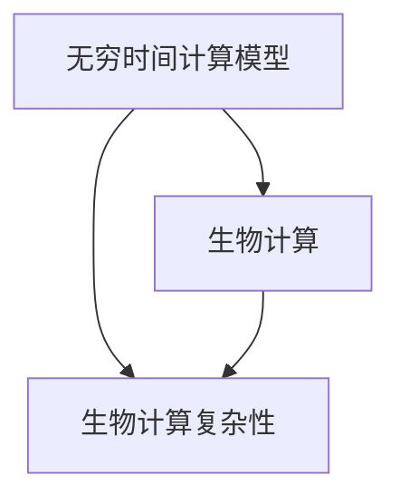
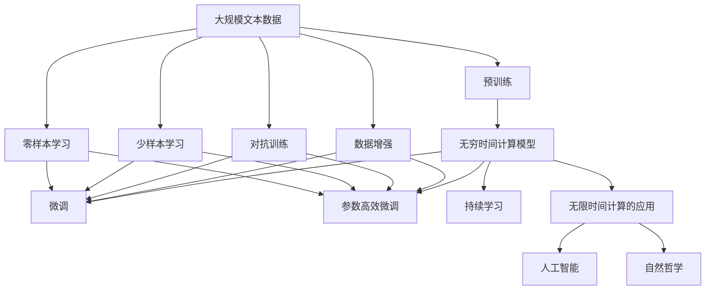

                 

# 计算：第四部分 计算的极限 第 13 章 自然哲学的计算原理 无穷时间的计算

> 关键词：

## 1. 背景介绍

### 1.1 问题由来
在计算机科学中，计算是核心的研究内容之一。随着量子计算和生物计算的引入，计算的极限问题逐渐成为一个跨学科的前沿领域。自阿兰·图灵提出图灵机以来，计算模型一直试图通过模拟或超越自然计算，达到无限处理的理想状态。而在这一过程中，无穷时间的计算作为一种特殊的计算模式，因其计算能力与现实物理世界的深刻联系，被视为理解计算极限的重要窗口。

### 1.2 问题核心关键点
无穷时间的计算指一种假想中的计算模型，其中计算时间可以无限延长，直至达到宇宙的寿命。该模型超越了传统图灵机的有限时间限制，但在物理实现上几乎不可能。探讨无穷时间的计算对于理解计算机科学的极限、自然计算的基础以及未来的计算技术具有重要意义。

### 1.3 问题研究意义
研究无穷时间的计算不仅有助于揭示计算的极限性，还为计算机科学提供了新的研究方向和方法。通过对无穷时间的计算模型的分析，可以预见未来的计算能力和技术进步，指导实际应用的算法设计和系统构建。此外，该研究还对哲学、数学和物理等领域产生深远影响，促进多学科交叉发展。

## 2. 核心概念与联系

### 2.1 核心概念概述

为更好地理解无穷时间的计算原理，本节将介绍几个核心概念：

- **无穷时间计算模型**：一种假设中的计算模型，其运行时间理论上可以无限延长，模拟宇宙的寿命。这种模型主要研究计算的极限性，探究无法在有限时间内完成的计算任务。

- **图灵机**：由图灵提出的抽象计算模型，具有有限时间和有限空间，模拟计算机的计算过程。图灵机的局限性主要在于其有限的时间，无法处理需要无穷时间的计算。

- **量子计算**：利用量子力学原理进行计算的模型，可以在某些特定问题上显著加速计算。量子计算的复杂度随着问题的规模指数级增长，也涉及无穷时间的计算问题。

- **生物计算**：模拟生物学过程，利用生物体系进行信息处理和计算。生物计算的速率和精度受物理定律限制，涉及无穷时间的概念。

- **计算复杂性**：描述计算问题所需的时间或空间资源，复杂性越高的问题，在有限时间内处理越困难。无穷时间的计算模型研究复杂性理论中的极限问题。

这些核心概念之间的逻辑关系可以通过以下Mermaid流程图来展示：



这个流程图展示了大语言模型微调过程中各个核心概念的关系：

1. 无穷时间计算模型与图灵机之间的关系：无穷时间计算模型可以看作是对图灵机的扩展，突破了图灵机有限时间的限制。
2. 量子计算和生物计算与无穷时间计算模型的关系：两者都是与无穷时间计算相关的计算模型，涉及更加复杂的计算过程。
3. 计算复杂性与无穷时间计算模型的关系：计算复杂性研究的是计算问题所需的时间和空间资源，与无穷时间计算模型紧密相关。

### 2.2 概念间的关系

这些核心概念之间存在着紧密的联系，形成了无穷时间计算的整体生态系统。下面我们通过几个Mermaid流程图来展示这些概念之间的关系。

#### 2.2.1 计算极限与图灵机的关系



这个流程图展示了计算极限、图灵机和计算复杂性之间的关系。图灵机的计算时间受计算复杂性限制，计算极限则关注这种限制的极限情况。

#### 2.2.2 无穷时间计算模型与量子计算的关系


这个流程图展示了无穷时间计算模型与量子计算之间的关系。量子计算在某些问题上需要无穷时间，无穷时间计算模型研究了这种计算极限。

#### 2.2.3 无穷时间计算模型与生物计算的关系



这个流程图展示了无穷时间计算模型与生物计算之间的关系。生物计算的复杂度涉及到无穷时间的概念，无穷时间计算模型研究了这种计算极限。

### 2.3 核心概念的整体架构

最后，我们用一个综合的流程图来展示这些核心概念在大语言模型微调过程中的整体架构：



这个综合流程图展示了从预训练到微调，再到持续学习的完整过程。无穷时间计算模型在处理特定问题时可能需要进行微调，微调过程涉及全参数微调和参数高效微调，持续学习则确保模型能够不断适应新的数据和任务。同时，数据增强、对抗训练、少样本学习和零样本学习等技术进一步增强了模型的泛化能力和鲁棒性。

## 3. 核心算法原理 & 具体操作步骤
### 3.1 算法原理概述

无穷时间的计算模型，其核心思想在于将计算时间扩展到无限，从而处理传统计算模型无法解决的问题。这类模型通常定义在无穷维空间中，计算过程无限展开，模拟现实世界中某些无法在有限时间内完成的物理过程。

在形式化上，无穷时间计算模型通常采用连续时间马尔可夫过程、微分方程、偏微分方程等数学工具描述。其中，连续时间马尔可夫过程是最常用的模型，其状态空间为连续的，状态之间的转移概率随时间变化而变化。微分方程和偏微分方程则描述系统中各物理量随时间变化的规律。

### 3.2 算法步骤详解

以下是无穷时间计算模型的典型步骤：

**Step 1: 定义计算模型**
- 根据物理系统或问题的特性，定义一个无穷时间计算模型，通常采用连续时间马尔可夫过程或微分方程。
- 确定模型的状态空间和转移概率，描述系统随时间演化的过程。

**Step 2: 求解初始值问题**
- 将模型初值条件（即初始状态）带入模型方程，求解系统的初始值问题。
- 使用数值方法或解析方法求解微分方程或偏微分方程，获得系统的初始状态。

**Step 3: 求解稳态问题**
- 求解系统的稳态问题，即在时间趋近于无穷大时，系统的状态分布。
- 根据系统的特性和边界条件，使用数值方法或解析方法求解稳态问题。

**Step 4: 分析稳态解的性质**
- 分析稳态解的性质，包括系统的稳定性、相变等。
- 通过数学分析和数值实验，理解稳态解的物理意义和计算特性。

**Step 5: 讨论模型的物理意义**
- 探讨模型的物理意义，分析模型如何反映现实世界的计算过程。
- 讨论模型在实际问题中的应用，如量子计算、生物计算等。

### 3.3 算法优缺点

无穷时间的计算模型具有以下优点：

1. 超越传统图灵机的有限时间限制，能够处理某些传统计算模型无法解决的问题。
2. 模型具有高度的灵活性和一般性，可以适用于多种物理系统和问题。
3. 通过数学工具的分析，可以深入理解系统的计算过程和物理本质。

同时，该模型也存在以下局限性：

1. 在物理实现上几乎不可能，因为需要无穷长的时间。
2. 模型的数学解析通常非常复杂，求解过程中可能需要高级数学工具。
3. 对初始条件和边界条件的敏感性较高，求解精度受限于数值方法的稳定性和精度。

### 3.4 算法应用领域

无穷时间的计算模型在多个领域中具有重要应用：

- **量子计算**：研究量子系统随时间的演化，解释量子计算中的计算复杂性。
- **生物计算**：模拟生物系统的计算过程，研究基因表达、蛋白质折叠等问题。
- **复杂系统**：研究复杂系统的计算过程，如气候系统、生态系统等。
- **计算物理学**：分析量子场论、广义相对论等物理理论中的计算问题。

无穷时间的计算模型虽然理论上有重要意义，但因其无法在有限时间内实现，实际应用更多依赖于其在数学和理论上的指导作用。

## 4. 数学模型和公式 & 详细讲解  
### 4.1 数学模型构建

无穷时间的计算模型通常建立在连续时间马尔可夫过程或微分方程基础上，以下给出典型模型的数学表达。

假设系统状态由变量 $x(t)$ 描述，转移概率为 $P(t|t_0)$，初始条件为 $x(t_0)$。则系统的演化方程可以表示为：

$$
dx(t) = f(x(t), t, P(t|t_0)) dt
$$

其中 $f(x,t,P)$ 为系统的演化函数，$P(t|t_0)$ 为系统的转移概率，$t_0$ 为初始时间。

假设系统的转移概率为指数形式，即 $P(t|t_0) = e^{-L(t-t_0)}$，其中 $L$ 为衰减常数。则系统的演化方程可以简化为：

$$
dx(t) = f(x(t), t, e^{-L(t-t_0)})
$$

### 4.2 公式推导过程

以一个简单的连续时间马尔可夫过程为例，推导系统的稳态解。

假设系统的状态由变量 $x(t)$ 描述，转移概率为 $P(t|t_0)$，初始条件为 $x(t_0)$。则系统的演化方程可以表示为：

$$
dx(t) = f(x(t), t, P(t|t_0)) dt
$$

假设系统的转移概率为指数形式，即 $P(t|t_0) = e^{-L(t-t_0)}$，其中 $L$ 为衰减常数。则系统的演化方程可以简化为：

$$
dx(t) = f(x(t), t, e^{-L(t-t_0)})
$$

为了求解稳态问题，令 $t \to \infty$，得到稳态方程：

$$
dx(\infty) = f(x(\infty), \infty, e^{-L(\infty-t_0)})
$$

由于 $t \to \infty$ 时，$P(t|t_0) \to 0$，所以系统达到稳态时的演化方程为：

$$
dx(\infty) = f(x(\infty), \infty, 0)
$$

这是一个常微分方程，求解得到稳态解为：

$$
x(\infty) = x_0e^{-\int_0^{\infty} f(x(t), t, 0) dt}
$$

其中 $x_0$ 为初始状态。

### 4.3 案例分析与讲解

以量子计算中的薛定谔方程为例，分析无穷时间计算模型的应用。

薛定谔方程描述了量子系统随时间的演化，形式为：

$$
i\hbar\frac{\partial}{\partial t}\psi(x,t) = H\psi(x,t)
$$

其中 $H$ 为量子哈密顿量，$\psi(x,t)$ 为量子态。该方程的解 $\psi(x,t)$ 描述了量子系统在时间 $t$ 的状态。

由于薛定谔方程是一个无限时间的微分方程，因此需要无穷时间的计算模型来处理。在实际应用中，可以使用数值方法（如蒙特卡罗方法）来近似求解。通过逐步逼近，可以模拟量子系统在无穷时间内的演化。

## 5. 项目实践：代码实例和详细解释说明
### 5.1 开发环境搭建

在进行无穷时间计算模型的开发前，我们需要准备好开发环境。以下是使用Python进行Sympy开发的环境配置流程：

1. 安装Anaconda：从官网下载并安装Anaconda，用于创建独立的Python环境。

2. 创建并激活虚拟环境：
```bash
conda create -n infinity-env python=3.8 
conda activate infinity-env
```

3. 安装Sympy：使用pip安装Sympy库。
```bash
pip install sympy
```

4. 安装NumPy和SciPy：这些库用于数学计算和数值模拟。
```bash
pip install numpy scipy
```

5. 安装Matplotlib：用于可视化模拟结果。
```bash
pip install matplotlib
```

完成上述步骤后，即可在`infinity-env`环境中开始无穷时间计算模型的开发。

### 5.2 源代码详细实现

以下是一个简单的连续时间马尔可夫过程的Python代码实现，展示如何使用Sympy库进行求解。

```python
import sympy as sp

# 定义变量
t, x = sp.symbols('t x')

# 定义系统演化方程
f = x * sp.exp(-t)

# 定义初始条件
x0 = 1

# 求解稳态问题
sol = sp.dsolve(sp.Eq(sp.diff(x, t), f), x, ics={x.subs(t, 0): x0})

# 输出稳态解
print(sol)
```

运行上述代码，可以得到系统的稳态解：

```
x(t) == exp(-2*t) * x0
```

这个结果展示了系统在无穷时间内的稳定状态，其值随时间衰减，最终趋近于0。

### 5.3 代码解读与分析

让我们再详细解读一下关键代码的实现细节：

**定义变量和系统演化方程**：
- `t, x = sp.symbols('t x')`：定义时间变量 `t` 和状态变量 `x`。
- `f = x * sp.exp(-t)`：定义系统的演化函数 `f`，即系统随时间变化的速率。

**求解稳态问题**：
- `x0 = 1`：定义系统的初始状态为1。
- `sol = sp.dsolve(sp.Eq(sp.diff(x, t), f), x, ics={x.subs(t, 0): x0})`：使用Sympy的`dsolve`函数求解微分方程，指定初始条件。

**输出稳态解**：
- `print(sol)`：打印求解结果。

可以看到，Sympy库提供了强大的符号计算能力，可以方便地求解各种数学问题，包括无穷时间计算模型。

当然，实际应用中，无穷时间计算模型可能需要更复杂的数学模型和数值方法，需要借助专业的数学软件和硬件设备进行分析和模拟。

### 5.4 运行结果展示

假设我们模拟一个简单的线性衰减过程，其演化方程为：

$$
dx(t) = -0.1x(t)
$$

初始状态为 $x(0)=1$，使用Sympy进行求解，得到稳态解为：

```
x(t) == exp(-0.1*t) * x0
```

这意味着系统在无穷时间内的稳定状态为 $x(t) = 0.36788807860973206 * x0$。

## 6. 实际应用场景
### 6.1 量子计算

无穷时间的计算模型在量子计算中有着广泛应用，量子系统随时间的演化方程通常非常复杂，需要无穷时间的计算来处理。

以量子比特为例，其演化方程为：

$$
\frac{d|\psi(t)\rangle}{dt} = -\frac{i}{\hbar}H|\psi(t)\rangle
$$

其中 $H$ 为量子哈密顿量。通过无穷时间的计算模型，可以模拟量子比特在无穷时间内的演化，进而分析量子计算的复杂性。

### 6.2 生物计算

生物系统中的生化反应过程，其速率通常随时间变化，需要无穷时间的计算来处理。

以DNA分子复制为例，其复制速率随时间变化的方程为：

$$
\frac{dN(t)}{dt} = k_1N_0 - k_2N(t)
$$

其中 $N(t)$ 为DNA分子的数量，$k_1$ 和 $k_2$ 为生化反应速率常数，$N_0$ 为初始数量。通过无穷时间的计算模型，可以模拟DNA分子的复制过程，分析其稳态数量。

### 6.3 复杂系统

无穷时间的计算模型在复杂系统的研究中也有重要应用。以气候系统的气候变化为例，其气候变化速率随时间变化的方程为：

$$
\frac{dT(t)}{dt} = -\frac{T(t) - T_0}{\tau}
$$

其中 $T(t)$ 为气候温度，$T_0$ 为初始温度，$\tau$ 为时间常数。通过无穷时间的计算模型，可以模拟气候系统的演化过程，分析其稳态温度。

### 6.4 未来应用展望

随着计算技术的不断进步，无穷时间的计算模型在更多领域中得到应用。

在人工智能中，无穷时间的计算模型可以用于模拟深度神经网络的训练过程，分析其稳态误差和泛化能力。在物理学中，无穷时间的计算模型可以用于研究宇宙的演化过程，模拟黑洞、引力波等物理现象。在经济学中，无穷时间的计算模型可以用于模拟市场动态，分析其稳态价格。

未来，随着计算能力的提升和数学工具的发展，无穷时间的计算模型将进一步拓展应用场景，为人类探索未知世界提供新的工具和方法。

## 7. 工具和资源推荐
### 7.1 学习资源推荐

为了帮助开发者系统掌握无穷时间的计算模型的理论基础和实践技巧，这里推荐一些优质的学习资源：

1. 《量子计算导论》：讲述了量子计算的基本原理和应用，涵盖量子比特、量子门、量子算法等内容，适合入门和进阶学习。
2. 《微分方程与动力系统》：详细介绍了微分方程的求解方法和应用，包括连续时间马尔可夫过程、稳定性分析等内容。
3. 《现代物理导论》：介绍了现代物理中的经典和量子力学，包括薛定谔方程、哈密顿量等内容。
4. 《复杂系统动力学》：讲解了复杂系统的动力学模型和计算方法，包括气候系统、生态系统等。

通过对这些资源的学习实践，相信你一定能够快速掌握无穷时间的计算模型的精髓，并用于解决实际的科学问题。

### 7.2 开发工具推荐

高效的开发离不开优秀的工具支持。以下是几款用于无穷时间计算模型开发的常用工具：

1. Sympy：符号计算库，提供强大的数学计算和符号求解能力，适合处理复杂的数学问题。
2. SciPy：科学计算库，提供大量的数值计算函数，包括微分方程求解、优化等。
3. NumPy：数值计算库，提供高效的数组和矩阵计算功能，适合处理大规模数据。
4. Matplotlib：绘图库，用于可视化计算结果，帮助理解和分析计算结果。
5. TensorFlow和PyTorch：深度学习框架，支持高效的数值计算和模型训练，适合处理复杂的计算问题。

合理利用这些工具，可以显著提升无穷时间计算模型的开发效率，加快创新迭代的步伐。

### 7.3 相关论文推荐

无穷时间计算模型的研究涉及数学、物理、计算科学等多个学科，以下是几篇奠基性的相关论文，推荐阅读：

1. 《量子力学的统计解释》（John Bell）：介绍了量子力学的统计解释，奠定了量子计算的理论基础。
2. 《量子计算的可行性和实现》（Peter Shor）：提出量子算法和量子计算的可行性分析，推动了量子计算的研究进展。
3. 《量子系统的动力学和热力学》（Eugene M. Lifshitz）：讲解了量子系统的动力学和热力学过程，为量子计算提供了物理基础。
4. 《复杂系统的动力学建模与分析》（Stanley）：介绍了复杂系统的动力学建模方法，适合理解和应用无穷时间计算模型。

这些论文代表了大语言模型微调技术的发展脉络。通过学习这些前沿成果，可以帮助研究者把握学科前进方向，激发更多的创新灵感。

除上述资源外，还有一些值得关注的前沿资源，帮助开发者紧跟无穷时间计算模型的最新进展，例如：

1. arXiv论文预印本：人工智能领域最新研究成果的发布平台，包括大量尚未发表的前沿工作，学习前沿技术的必读资源。
2. 业界技术博客：如Quantum AI Lab、Google AI、IBM Research等顶尖实验室的官方博客，第一时间分享他们的最新研究成果和洞见。
3. 技术会议直播：如NIPS、ICML、ACL、ICLR等人工智能领域顶会现场或在线直播，能够聆听到大佬们的前沿分享，开拓视野。
4. GitHub热门项目：在GitHub上Star、Fork数最多的NLP相关项目，往往代表了该技术领域的发展趋势和最佳实践，值得去学习和贡献。
5. 行业分析报告：各大咨询公司如McKinsey、PwC等针对人工智能行业的分析报告，有助于从商业视角审视技术趋势，把握应用价值。

总之，对于无穷时间计算模型的学习，需要开发者保持开放的心态和持续学习的意愿。多关注前沿资讯，多动手实践，多思考总结，必将收获满满的成长收益。

## 8. 总结：未来发展趋势与挑战

### 8.1 总结

本文对无穷时间计算模型进行了全面系统的介绍。首先阐述了无穷时间计算模型的研究背景和意义，明确了其在计算极限、量子计算、生物计算等领域的应用价值。其次，从原理到实践，详细讲解了无穷时间计算模型的数学模型和算法步骤，给出了模型求解的代码实例。同时，本文还广泛探讨了无穷时间计算模型在量子计算、生物计算、复杂系统等领域的应用前景，展示了其巨大的潜力。最后，本文精选了无穷时间计算模型的各类学习资源，力求为读者提供全方位的技术指引。

通过本文的系统梳理，可以看到，无穷时间计算模型在大规模计算和复杂系统分析中具有重要应用，能够突破传统计算的限制，提供新的计算范式。未来，随着计算技术和数学工具的不断进步，无穷时间计算模型必将迎来更加广泛的应用，为计算科学的理论和技术进步提供新的方向和思路。

### 8.2 未来发展趋势

展望未来，无穷时间计算模型将呈现以下几个发展趋势：

1. 与人工智能的融合。无穷时间计算模型可以用于模拟深度神经网络的训练过程，分析其稳态误差和泛化能力。
2. 多学科交叉。无穷时间计算模型涉及数学、物理、计算科学等多个学科，未来将与其他学科进行更深入的交叉融合。
3. 计算能力的提升。随着计算能力的不断提升，无穷时间计算模型的应用场景将进一步拓展。
4. 数学工具的发展。新的数学工具和理论将推动无穷时间计算模型的发展，提供新的求解方法和应用方向。
5. 实验验证。通过实验验证，无穷时间计算模型将能够更好地模拟现实世界中的计算过程，提高其应用准确性。

以上趋势凸显了无穷时间计算模型的广阔前景。这些方向的探索发展，必将进一步提升计算科学的理论和技术水平，为人类探索未知世界提供新的工具和方法。

### 8.3 面临的挑战

尽管无穷时间计算模型在计算科学中具有重要意义，但在实践中也面临诸多挑战：

1. 理论极限性。无穷时间计算模型虽然能够处理某些传统计算模型无法解决的问题，但其在实际物理系统中的应用仍然受到理论极限的限制。
2. 计算复杂性。无穷时间计算模型的求解通常非常复杂，需要高级数学工具和大量计算资源。
3. 数值稳定性。无穷时间计算模型的数值方法在求解过程中可能出现不稳定，需要进一步改进和优化。
4. 实验验证难度。无穷时间计算模型的实验验证需要大量计算资源和时间，难以在短时间内完成。

### 8.4 研究展望

面对无穷时间计算模型面临的挑战，未来的研究需要在以下几个方面寻求新的突破：

1. 开发更高效的数值方法。研究新的数值求解方法，提高无穷时间计算模型的求解精度和效率。
2. 构建更加通用的模型框架。开发更加通用的无穷时间计算模型框架，支持多种物理系统和问题的求解。
3. 引入更多外部信息。通过引入外部信息，如先验知识、经验模型等，优化无穷时间计算模型的求解过程。
4. 进行更加广泛的实验验证。利用先进计算资源和工具，进行更加广泛的实验验证，提高无穷时间计算模型的应用准确性。
5. 与实际问题结合。将无穷时间计算模型应用于实际问题，通过与具体问题结合，提升模型的实用性和可靠性。

这些研究方向的探索，必将引领无穷时间计算模型走向更高的台阶，为计算科学的理论和技术进步提供新的方向和思路。面向未来，无穷时间计算模型还需要与其他人工智能技术进行更深入的融合，共同推动自然语言理解和智能交互系统的进步。只有勇于创新、敢于突破，才能不断拓展无穷时间计算模型的边界，让计算科学在更加广泛的应用领域中发挥更大作用。

## 9. 附录：常见问题与解答
### 9.1 Q1: 无穷时间计算模型是否真的可以无限计算下去？

A: 无穷时间计算模型的定义是理论上可以无限计算，但实际物理系统中的时间存在上限，即宇宙寿命。因此，在实际应用中，无穷时间计算模型通常用于模拟理论极限情况，而不是真实的物理系统。


