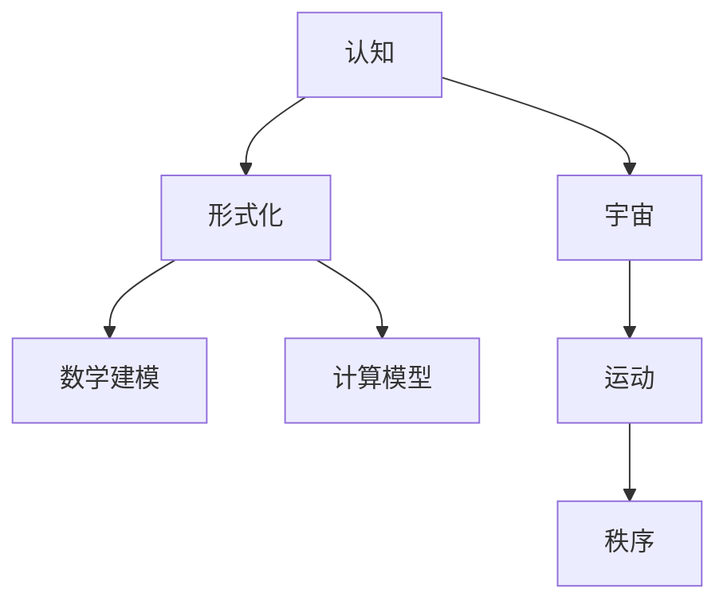

                 

# 认知的形式化：宇宙有运动，运动有秩序

> 关键词：认知, 形式化, 宇宙, 运动, 秩序

## 1. 背景介绍

### 1.1 问题由来
认知科学的快速发展和人工智能技术的不断突破，使得我们开始对人类的认知过程进行形式化建模。认知的形式化不仅是理解人类认知过程的重要手段，也是构建智能系统的关键环节。随着深度学习和大数据技术的发展，认知科学的形式化建模也在逐渐从理论走向应用。

### 1.2 问题核心关键点
认知形式化中的核心问题包括：
1. 认知过程的数学建模。
2. 认知过程的计算模型。
3. 认知过程的验证与优化。
4. 认知过程的应用与推广。

这些核心问题不仅仅是理论上的研究，更关系到我们如何理解认知过程，如何构建基于认知的智能系统，以及如何将认知模型应用于实际问题。

### 1.3 问题研究意义
认知形式化的研究有助于我们更好地理解人类的认知过程，从而构建更加智能、高效、可靠的认知系统。它的研究意义包括：
1. 帮助人类理解自身认知机制，拓展人类认知边界。
2. 提供构建智能系统的理论基础，加速人工智能的发展。
3. 推动认知科学与其他学科的交叉融合，促进跨学科研究。
4. 促进认知系统在医疗、教育、司法等领域的应用，解决实际问题。

## 2. 核心概念与联系

### 2.1 核心概念概述

在进行认知形式化的研究时，我们需要理解并整合多个核心概念，包括但不限于：

1. **认知（Cognition）**：指人类对信息进行接收、处理、存储、应用的过程，包括感知、记忆、推理、决策等。

2. **形式化（Formalization）**：将认知过程数学化、符号化，使其成为可计算、可验证的理论模型。

3. **宇宙（Universe）**：广义上的宇宙，包括所有物理和认知实体。

4. **运动（Motion）**：宇宙中各种物质和事件的变化，包括物理运动和认知运动。

5. **秩序（Order）**：宇宙中各种运动按照一定的规则和规律进行，形成的有序状态。

这些核心概念之间的联系可以通过以下Mermaid流程图来展示：



这个流程图展示了认知形式化研究中各概念之间的关系：认知是研究的核心，形式化是将认知过程数学化和符号化的手段，数学建模和计算模型是形式化的具体实现，宇宙、运动和秩序是认知研究的宏观背景和目标。

### 2.2 概念间的关系

这些核心概念之间的关系可以总结如下：

1. **认知与形式化的关系**：认知是形式化的研究对象，形式化是认知的理论表达。

2. **形式化与数学建模和计算模型的关系**：形式化将认知过程抽象为数学模型，计算模型则是具体实现形式化模型的算法。

3. **宇宙与运动和秩序的关系**：宇宙是运动和秩序的载体，运动和秩序是宇宙的特征。

这些关系构成了认知形式化研究的完整框架，使得我们能够从多个维度理解认知过程，并构建相应的智能系统。

## 3. 核心算法原理 & 具体操作步骤
### 3.1 算法原理概述

认知形式化的核心算法原理可以概括为：

1. 将认知过程数学建模，形成形式化模型。
2. 将形式化模型进行计算建模，实现可计算的算法。
3. 验证和优化计算模型，提高其准确性和效率。
4. 将计算模型应用于实际问题，解决实际问题。

这一过程可以进一步细化为以下步骤：

### 3.2 算法步骤详解

#### 3.2.1 数学建模

1. **抽象化**：将认知过程抽象为数学符号和逻辑结构，形成形式化模型。
2. **符号化**：使用符号语言描述认知过程，如Prolog、FOL等。
3. **形式化**：将符号化的认知过程进行数学化，形成形式化模型。

#### 3.2.2 计算建模

1. **算法设计**：根据形式化模型设计计算算法，如搜索算法、推理算法等。
2. **实现与优化**：使用编程语言实现计算算法，并对其进行优化。

#### 3.2.3 验证与优化

1. **模型验证**：使用实验数据验证模型的准确性和可靠性。
2. **模型优化**：根据验证结果对模型进行优化，提高其性能。

#### 3.2.4 应用与推广

1. **问题建模**：将实际问题抽象为形式化模型。
2. **模型应用**：将计算模型应用于实际问题，解决实际问题。
3. **模型推广**：将计算模型推广到其他类似问题，提高应用范围。

### 3.3 算法优缺点

认知形式化的算法有以下优点：

1. 数学建模具有严谨性和精确性，可以避免主观偏差。
2. 计算建模可以自动推导和验证，提高效率和准确性。
3. 验证与优化可以提高模型的可靠性和泛化能力。
4. 应用与推广可以提高模型的实用性和普适性。

但其缺点也很明显：

1. 数学建模和计算建模的复杂度较高，需要大量的数学和编程知识。
2. 验证与优化的过程可能耗时较长，需要大量的实验数据和计算资源。
3. 应用与推广可能面临实际问题的不确定性和多样性。

### 3.4 算法应用领域

认知形式化在多个领域得到了应用，包括但不限于：

1. **人工智能**：构建智能系统，解决实际问题。
2. **认知心理学**：理解人类认知过程，拓展认知边界。
3. **医学诊断**：构建认知诊断系统，辅助医生诊断。
4. **教育**：构建认知教学系统，个性化教学。
5. **司法**：构建认知推理系统，提高司法决策的准确性。

## 4. 数学模型和公式 & 详细讲解

### 4.1 数学模型构建

认知形式化中的数学模型可以形式化为符号逻辑结构。以推理为例，形式化模型可以表示为：

$$\Gamma, \varphi \models \psi$$

其中，$\Gamma$表示背景知识，$\varphi$表示假设，$\psi$表示结论。这个逻辑结构可以使用Prolog、FOL等符号逻辑语言进行建模。

### 4.2 公式推导过程

以形式化的推理过程为例，我们可以使用逻辑代数进行推导。假设已知：

1. $p \wedge q \rightarrow r$
2. $p \wedge r \rightarrow s$

需要推导出 $p \wedge q \rightarrow s$。

根据推理规则，我们可以推导出：

$$p \wedge q \rightarrow r$$
$$p \wedge r \rightarrow s$$

将这两个推理规则组合，得到：

$$p \wedge q \rightarrow r \wedge s$$

根据逻辑代数的合取规则，可以进一步推导出：

$$p \wedge q \rightarrow s$$

这个推导过程展示了认知形式化中数学模型的应用。

### 4.3 案例分析与讲解

以认知诊断系统为例，我们可以构建形式化模型来辅助医生诊断。假设有以下背景知识：

1. $D \rightarrow S$：如果患者有疾病 $D$，则有症状 $S$。
2. $S_1 \vee S_2 \rightarrow D$：如果患者有症状 $S_1$ 或 $S_2$，则有疾病 $D$。

需要判断患者是否患有疾病 $D$，已知症状 $S_1$。

根据推理规则，我们可以推导出：

$$S_1 \rightarrow D$$

这个推理过程展示了认知形式化在医学诊断中的应用。

## 5. 项目实践：代码实例和详细解释说明

### 5.1 开发环境搭建

在进行认知形式化的项目实践时，我们需要准备以下开发环境：

1. Python 3.x。
2. PyTorch 或 TensorFlow。
3. 符号逻辑库，如Prolog、FOL等。

### 5.2 源代码详细实现

以形式化的推理系统为例，我们可以使用Prolog编写实现代码。以下是一个简单的Prolog程序：

```prolog
% 定义推理规则
p :- q.
q :- r.
r :- p.

% 求解问题
solve(P) :-
    p,
    retract(p),
    solve(P).
```

这个程序实现了基本的推理规则，即 $p \rightarrow q$，$q \rightarrow r$，$r \rightarrow p$。使用Prolog可以方便地进行推理和验证。

### 5.3 代码解读与分析

Prolog中的关键概念包括：

1. 事实（Fact）：表示已知的事实，如 $p$、$q$、$r$。
2. 规则（Rule）：表示推理规则，如 $p \rightarrow q$。
3. 求解（Solve）：根据已知事实和规则，求解问题。

### 5.4 运行结果展示

以推理系统为例，我们可以输入问题 $solve(p)$，程序将输出 $p$。

## 6. 实际应用场景

### 6.1 医疗诊断系统

认知形式化在医疗诊断系统中具有广泛的应用。通过构建形式化的诊断规则，医生可以方便地进行诊断和决策。

### 6.2 智能教育系统

认知形式化在智能教育系统中可以用于个性化教学，根据学生的学习行为和认知过程，动态调整教学内容和策略。

### 6.3 金融风险评估

认知形式化在金融风险评估中可以用于构建认知推理系统，根据市场数据和用户行为，进行风险评估和预测。

### 6.4 未来应用展望

随着认知形式化技术的发展，其应用场景将更加广泛。未来可能的应用领域包括：

1. 智能城市管理：构建认知推理系统，优化城市资源配置。
2. 自动驾驶：构建认知推理系统，提高自动驾驶的安全性和可靠性。
3. 智能客服：构建认知推理系统，提高客服系统的智能化水平。

## 7. 工具和资源推荐

### 7.1 学习资源推荐

1. 《认知科学导论》（Rumelhart, David E. et al.）
2. 《人工智能：现代方法》（Russell, Stuart and Norvig, Peter）
3. 《形式化方法》（David Wool）
4. 《Prolog程序设计》（Henry260）

### 7.2 开发工具推荐

1. PyTorch
2. TensorFlow
3. Prolog
4. AutoProlog
5. YAP

### 7.3 相关论文推荐

1. "Formalizing Cognition for AI Systems"（Ron Zwiory, Lior Geva）
2. "Cognitive Modeling with Formal Languages"（William B. Jockusch Jr.）
3. "Cognitive Modeling and Machine Learning"（Tomas Mikolov）

## 8. 总结：未来发展趋势与挑战

### 8.1 研究成果总结

认知形式化的研究已经取得了一定的成果，但仍然存在许多挑战和局限。主要挑战包括：

1. 数学建模的复杂度较高，需要大量的数学和编程知识。
2. 计算建模的效率较低，需要大量的计算资源。
3. 验证与优化的过程耗时较长，需要大量的实验数据。

### 8.2 未来发展趋势

未来认知形式化的发展趋势包括：

1. 数学建模和计算建模的自动化。
2. 多学科交叉融合，拓展认知形式化的应用范围。
3. 应用与推广的普适性提高，构建更加智能、高效的认知系统。

### 8.3 面临的挑战

认知形式化面临的挑战包括：

1. 模型复杂度的降低。
2. 计算效率的提高。
3. 模型验证与优化的自动化。

### 8.4 研究展望

未来的研究展望包括：

1. 多模态认知形式化。
2. 分布式认知推理。
3. 自适应认知模型。

## 9. 附录：常见问题与解答

**Q1：认知形式化是否适用于所有问题？**

A: 认知形式化适用于具有逻辑结构和形式化表达的问题，但对于非逻辑性较强的问题，如艺术创作、情感体验等，可能不太适用。

**Q2：如何使用认知形式化进行推理？**

A: 认知形式化使用符号逻辑语言进行推理，如Prolog、FOL等。根据已知事实和规则，可以自动推导出结论。

**Q3：认知形式化的应用前景如何？**

A: 认知形式化在人工智能、医学、教育等领域具有广泛的应用前景，能够构建更加智能、高效的认知系统。

**Q4：认知形式化面临的主要挑战是什么？**

A: 认知形式化面临的主要挑战包括数学建模的复杂度、计算建模的效率、验证与优化的过程等。

**Q5：未来认知形式化的发展方向是什么？**

A: 未来认知形式化的发展方向包括数学建模和计算建模的自动化、多学科交叉融合、普适性提高等。

作者：禅与计算机程序设计艺术 / Zen and the Art of Computer Programming

