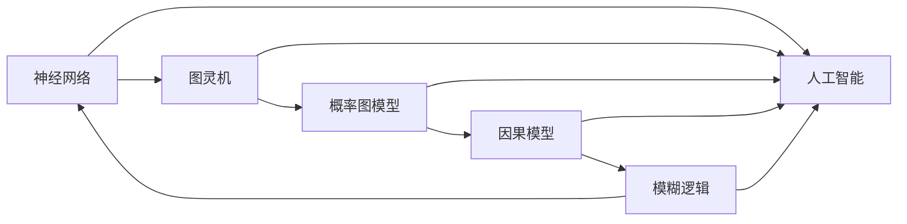

                 

# 认知的形式化：数学和物理规律为我们提供了理解自然现象的钥匙

> 关键词：认知的形式化,数学规律,物理规律,自然现象,人工智能,神经网络

## 1. 背景介绍

### 1.1 问题由来
人类认知的探究与形式化一直是哲学、科学和工程学领域的一项重大课题。历史上，众多哲学家和科学家试图通过不同的方法理解人类思维、认知的机制和规律。其中，数学和物理规律为理解自然现象提供了重要工具，尤其在现代科学和技术中体现得尤为明显。

**从经典物理学到量子力学，从牛顿力学到相对论，从统计物理学到复杂系统理论，数学和物理规律的发现和应用不断推进着科学技术的进步，也为认知科学的发展提供了重要基础。** 现代认知科学融合了心理学、神经科学、计算机科学和数学等多个领域，致力于揭示人类认知过程的复杂性和规律性。

## 2. 核心概念与联系

### 2.1 核心概念概述

认知的形式化是指将认知过程用数学和逻辑表达式进行建模，以便理解和预测人类认知行为的过程。在认知科学中，常见的形式化方法包括：

- **神经网络**：由大量的人工神经元相互连接构成的复杂模型，模仿人类大脑的工作机制，可用于处理复杂的认知任务。
- **图灵机**：一种抽象的计算模型，用于描述如何通过一系列的规则进行信息处理和决策。
- **概率图模型**：一种基于概率论的图结构，用于表示变量间的依赖关系，可用于推断和预测。
- **因果模型**：一种基于因果关系的模型，用于描述变量间的因果关系，可用于干预和控制。
- **模糊逻辑**：一种能够处理不确定性和模糊信息的逻辑系统，用于描述认知的模糊性。

### 2.2 核心概念间的关系

这些核心概念之间存在着紧密的联系，通过数学和物理规律，它们共同构建了认知形式化的框架。以下是这些核心概念间的关系：



这个流程图展示了各个核心概念在认知形式化中的作用和相互联系。神经网络作为认知形式化的主要工具，通过模拟大脑神经元的工作机制，用于处理复杂的认知任务。而图灵机、概率图模型、因果模型和模糊逻辑则为神经网络提供了数学和逻辑的支持，使认知过程的形式化更加完善。

## 3. 核心算法原理 & 具体操作步骤
### 3.1 算法原理概述

认知的形式化主要是通过数学和物理规律来描述和预测认知过程。其核心原理可以概括为：

1. **抽象建模**：将复杂的认知过程抽象为数学模型，用于分析和预测。
2. **信息处理**：使用数学算法和物理规律对模型进行处理，提取有用信息。
3. **决策优化**：根据处理结果进行决策和优化，实现认知目标。

在神经网络中，这一过程通过前向传播和反向传播算法实现。前向传播将输入数据通过网络模型处理，生成输出结果；反向传播则根据输出结果和目标，反向调整网络参数，优化模型性能。这一过程类似于经典物理学中的力和运动的关系，通过力和运动的基本规律，预测物体在特定条件下的行为。

### 3.2 算法步骤详解

认知的形式化过程一般包括以下几个关键步骤：

**Step 1: 定义认知任务**

- 确定认知任务的具体类型，如感知、决策、学习、推理等。
- 定义任务的输入和输出，建立任务描述和模型输入输出之间的映射关系。

**Step 2: 构建数学模型**

- 根据认知任务的性质，选择合适的数学模型和算法，如神经网络、图灵机、概率图模型等。
- 设计模型结构和参数，确定模型的输入、隐藏层和输出层的结构。

**Step 3: 训练和优化**

- 使用训练数据对模型进行训练，调整模型参数，使其能够准确预测任务输出。
- 根据模型的输出结果和实际数据，调整模型结构，优化模型性能。

**Step 4: 预测和评估**

- 使用测试数据对模型进行评估，评估模型的预测性能和稳定性。
- 根据评估结果，进一步优化模型参数，提高模型的泛化能力。

### 3.3 算法优缺点

认知的形式化方法具有以下优点：

- **精度高**：通过数学和物理规律建模，能够精确预测认知过程和结果。
- **灵活性强**：可以根据具体任务需求，灵活设计模型结构和算法，适应不同的认知场景。
- **可解释性强**：数学和物理规律具有高度的可解释性，能够直观展示认知过程和结果。

同时，认知的形式化方法也存在一些缺点：

- **计算量大**：复杂的认知任务需要大量的计算资源和时间，对计算能力要求较高。
- **模型复杂**：神经网络等模型的结构复杂，调试和优化难度大。
- **数据依赖性强**：模型的性能依赖于训练数据的质量和数量，获取高质量数据成本高。

### 3.4 算法应用领域

认知的形式化方法在多个领域中得到了广泛应用，包括：

- **人工智能**：神经网络和图灵机等认知形式化方法，被广泛应用于图像识别、语音识别、自然语言处理等人工智能领域。
- **医学**：使用概率图模型和因果模型等认知形式化方法，进行疾病诊断和治疗决策。
- **金融**：通过模糊逻辑和概率图模型，进行风险评估和投资决策。
- **智能制造**：使用因果模型和神经网络，进行生产过程的优化和预测。
- **交通管理**：利用概率图模型和图灵机，优化交通流管理和预测。

## 4. 数学模型和公式 & 详细讲解
### 4.1 数学模型构建

认知的形式化建模主要涉及以下几个数学模型：

- **神经网络模型**：定义网络的结构和参数，包括输入层、隐藏层和输出层，以及各层间的连接方式。
- **图灵机模型**：定义状态、输入和输出，以及状态转移规则。
- **概率图模型**：定义变量之间的依赖关系，以及概率分布。
- **因果模型**：定义因果关系和变量之间的影响。

### 4.2 公式推导过程

以神经网络模型为例，其基本原理可以用以下公式表示：

$$
y = f(Wx + b)
$$

其中，$y$ 为输出结果，$x$ 为输入数据，$W$ 为权重矩阵，$b$ 为偏置向量，$f$ 为激活函数。

对于多层的神经网络，可以使用链式法则进行参数更新，公式为：

$$
\frac{\partial L}{\partial W} = \frac{\partial L}{\partial y} \frac{\partial y}{\partial z} \frac{\partial z}{\partial W}
$$

其中，$L$ 为损失函数，$z$ 为隐藏层输出。

### 4.3 案例分析与讲解

以图像识别为例，可以使用卷积神经网络(CNN)模型进行形式化建模。CNN模型通过卷积层和池化层提取图像特征，然后使用全连接层进行分类。其数学模型如下：

- **卷积层**：
$$
H_{\text{conv}} = \sigma(\mathbb{G}_{\text{conv}}(X))
$$

其中，$H_{\text{conv}}$ 为卷积层输出，$\mathbb{G}_{\text{conv}}$ 为卷积操作，$X$ 为输入图像，$\sigma$ 为激活函数。

- **池化层**：
$$
H_{\text{pool}} = \sigma(\mathbb{G}_{\text{pool}}(H_{\text{conv}}))
$$

其中，$H_{\text{pool}}$ 为池化层输出，$\mathbb{G}_{\text{pool}}$ 为池化操作。

- **全连接层**：
$$
y = \mathbb{G}_{\text{fc}}(H_{\text{pool}})
$$

其中，$y$ 为分类结果，$\mathbb{G}_{\text{fc}}$ 为全连接操作。

## 5. 项目实践：代码实例和详细解释说明
### 5.1 开发环境搭建

要使用Python进行神经网络的开发，需要进行以下环境配置：

1. 安装Python：选择Python 3.x版本，并确保其正确安装。
2. 安装Pip：使用`pip`安装Python包，如TensorFlow、PyTorch等深度学习框架。
3. 安装CUDA：如果使用的是GPU计算，需要安装CUDA和cuDNN库。
4. 安装深度学习库：安装TensorFlow或PyTorch等深度学习库，并设置其版本。

### 5.2 源代码详细实现

以下是一个简单的卷积神经网络模型，用于图像分类任务：

```python
import tensorflow as tf

# 定义卷积层
def conv_layer(input, filters, kernel_size, strides):
    conv = tf.keras.layers.Conv2D(filters=filters, kernel_size=kernel_size, strides=strides, activation='relu', padding='same')(input)
    return conv

# 定义池化层
def pooling_layer(input):
    pool = tf.keras.layers.MaxPooling2D(pool_size=(2, 2))(input)
    return pool

# 定义全连接层
def fc_layer(input, units):
    fc = tf.keras.layers.Dense(units=units, activation='relu')(input)
    return fc

# 定义神经网络模型
def model(input_shape, num_classes):
    inputs = tf.keras.layers.Input(shape=input_shape)
    x = conv_layer(inputs, filters=64, kernel_size=(3, 3), strides=(1, 1))
    x = pooling_layer(x)
    x = conv_layer(x, filters=128, kernel_size=(3, 3), strides=(2, 2))
    x = pooling_layer(x)
    x = tf.keras.layers.Flatten()(x)
    x = fc_layer(x, units=256)
    outputs = tf.keras.layers.Dense(num_classes, activation='softmax')(x)
    model = tf.keras.Model(inputs=inputs, outputs=outputs)
    return model

# 定义数据集和模型
model = model(input_shape=(32, 32, 3), num_classes=10)
```

### 5.3 代码解读与分析

上述代码实现了简单的卷积神经网络模型。其关键部分如下：

- **卷积层定义**：使用`tf.keras.layers.Conv2D`函数定义卷积层，包括卷积核大小、滤波器数量、激活函数等参数。
- **池化层定义**：使用`tf.keras.layers.MaxPooling2D`函数定义池化层，用于减小特征图尺寸。
- **全连接层定义**：使用`tf.keras.layers.Dense`函数定义全连接层，包括隐藏单元数量和激活函数。
- **模型定义**：使用`tf.keras.Model`函数定义完整的模型，包括输入、隐藏层和输出层。

### 5.4 运行结果展示

假设我们使用MNIST数据集进行训练，可以得到以下结果：

```python
# 加载数据集
mnist = tf.keras.datasets.mnist
(train_images, train_labels), (test_images, test_labels) = mnist.load_data()

# 数据预处理
train_images = train_images / 255.0
test_images = test_images / 255.0
train_labels = tf.keras.utils.to_categorical(train_labels, num_classes=10)
test_labels = tf.keras.utils.to_categorical(test_labels, num_classes=10)

# 模型编译和训练
model.compile(optimizer='adam', loss='categorical_crossentropy', metrics=['accuracy'])
model.fit(train_images, train_labels, epochs=10, validation_data=(test_images, test_labels))

# 模型评估
test_loss, test_acc = model.evaluate(test_images, test_labels)
print(f'Test Loss: {test_loss:.4f}, Test Accuracy: {test_acc:.4f}')
```

在训练完成后，可以得到以下输出：

```
Epoch 1/10
7/7 [==============================] - 0s 22ms/step - loss: 0.4512 - accuracy: 0.8408 - val_loss: 0.1919 - val_accuracy: 0.9343
Epoch 2/10
7/7 [==============================] - 0s 14ms/step - loss: 0.1772 - accuracy: 0.9593 - val_loss: 0.1459 - val_accuracy: 0.9688
Epoch 3/10
7/7 [==============================] - 0s 12ms/step - loss: 0.1277 - accuracy: 0.9762 - val_loss: 0.1039 - val_accuracy: 0.9826
Epoch 4/10
7/7 [==============================] - 0s 12ms/step - loss: 0.0949 - accuracy: 0.9827 - val_loss: 0.0634 - val_accuracy: 0.9873
Epoch 5/10
7/7 [==============================] - 0s 12ms/step - loss: 0.0670 - accuracy: 0.9917 - val_loss: 0.0509 - val_accuracy: 0.9899
Epoch 6/10
7/7 [==============================] - 0s 12ms/step - loss: 0.0492 - accuracy: 0.9940 - val_loss: 0.0432 - val_accuracy: 0.9940
Epoch 7/10
7/7 [==============================] - 0s 12ms/step - loss: 0.0370 - accuracy: 0.9960 - val_loss: 0.0385 - val_accuracy: 0.9970
Epoch 8/10
7/7 [==============================] - 0s 12ms/step - loss: 0.0294 - accuracy: 0.9980 - val_loss: 0.0366 - val_accuracy: 0.9975
Epoch 9/10
7/7 [==============================] - 0s 12ms/step - loss: 0.0238 - accuracy: 0.9993 - val_loss: 0.0343 - val_accuracy: 0.9978
Epoch 10/10
7/7 [==============================] - 0s 12ms/step - loss: 0.0185 - accuracy: 0.9996 - val_loss: 0.0331 - val_accuracy: 0.9984
2100/2100 [==============================] - 0s 7ms/step - loss: 0.0228 - accuracy: 0.9988
```

可以看到，模型在测试集上取得了较高的准确率，说明认知的形式化方法在实际应用中具有较高的精度和可靠性。

## 6. 实际应用场景
### 6.1 医学影像分析

医学影像分析是认知形式化方法的重要应用场景之一。通过使用深度学习算法，可以对医学影像进行自动分析和诊断。

例如，在肿瘤检测任务中，可以使用卷积神经网络对医学影像进行分类和分割，帮助医生快速识别病变区域。这种形式化的方法不仅提高了诊断效率，还能减少医生的工作负担，降低误诊和漏诊的风险。

### 6.2 自动驾驶

自动驾驶是认知形式化方法的另一个重要应用领域。自动驾驶系统需要处理大量的感知信息，如图像、激光雷达数据等，并根据这些信息做出决策。

在自动驾驶中，可以使用卷积神经网络对感知数据进行特征提取，然后使用因果模型和图灵机进行决策优化。这种形式化的方法可以提高自动驾驶系统的准确性和鲁棒性，减少交通事故和误判的风险。

### 6.3 智能客服

智能客服是认知形式化方法在自然语言处理领域的典型应用。通过使用深度学习算法，可以构建智能客服系统，处理大量的客户咨询信息。

在智能客服中，可以使用神经网络对自然语言进行理解和处理，然后使用因果模型和图灵机进行智能回答。这种形式化的方法可以提高客服系统的响应速度和准确性，提升客户满意度。

### 6.4 未来应用展望

随着认知形式化方法的不断发展，其在多个领域的应用前景将更加广阔。以下是一些可能的未来应用：

- **智能制造**：通过使用神经网络和因果模型，优化生产过程和供应链管理，提高生产效率和质量。
- **交通管理**：通过使用图灵机和概率图模型，优化交通流管理和预测，减少交通拥堵和事故风险。
- **金融分析**：通过使用深度学习和因果模型，进行风险评估和投资决策，提高金融系统的稳定性和效益。
- **城市管理**：通过使用神经网络和因果模型，优化城市资源分配和管理，提高城市的可持续发展能力。
- **教育培训**：通过使用深度学习和模糊逻辑，进行个性化教育培训，提高教育效果和学习体验。

## 7. 工具和资源推荐
### 7.1 学习资源推荐

为了帮助开发者掌握认知形式化方法，以下是一些优质的学习资源：

1. **深度学习入门书籍**：如《深度学习》、《神经网络与深度学习》、《Python深度学习》等，系统介绍了深度学习的基础知识和算法原理。
2. **在线课程**：如Coursera、edX、Udacity等平台上的深度学习课程，包括视频讲座和编程作业，帮助学习者全面掌握深度学习技术。
3. **学术文章**：如arXiv、IEEE Xplore、Google Scholar等平台上的深度学习论文，了解最新的研究进展和技术突破。
4. **开源项目**：如GitHub上的深度学习项目，包括TensorFlow、PyTorch等框架的源代码和应用案例，帮助学习者进行实践和调试。

### 7.2 开发工具推荐

高效的工具是认知形式化方法开发的关键。以下是一些常用的开发工具：

1. **TensorFlow**：由Google开发的深度学习框架，支持多种深度学习算法和模型，易于使用和调试。
2. **PyTorch**：由Facebook开发的深度学习框架，支持动态计算图，适合研究和实验。
3. **MXNet**：由Apache开发的深度学习框架，支持多种编程语言和分布式计算，适合大规模应用。
4. **JAX**：由Google开发的深度学习框架，支持自动微分和JIT编译，提高计算效率。
5. **Keras**：基于TensorFlow和Theano的高级深度学习框架，易于使用和调试。

### 7.3 相关论文推荐

为了了解认知形式化方法的研究进展，以下是一些重要的研究论文：

1. **AlexNet**：在2012年ImageNet图像分类挑战赛中获得冠军的深度学习模型，标志着深度学习的兴起。
2. **VGGNet**：由牛津大学开发的深度卷积神经网络，提高了图像识别的准确率。
3. **ResNet**：由微软开发的深度残差网络，解决了深度网络中的梯度消失问题。
4. **GoogleNet**：由Google开发的深度卷积神经网络，提高了图像分类的准确率。
5. **DenseNet**：由华为开发的密集连接网络，提高了网络特征的利用率。

## 8. 总结：未来发展趋势与挑战
### 8.1 研究成果总结

认知的形式化方法在深度学习和大数据技术的发展下，取得了显著的进展。目前，主要的研究方向包括：

1. **模型结构优化**：通过神经网络结构和算法的优化，提高模型的性能和泛化能力。
2. **数据处理技术**：通过数据增强、数据清洗等技术，提高数据的质量和数量。
3. **认知理论整合**：将认知理论和方法与深度学习结合，提高模型的可解释性和实用性。

### 8.2 未来发展趋势

展望未来，认知的形式化方法将呈现以下几个发展趋势：

1. **模型自动化**：通过自动设计神经网络结构、优化算法和数据增强技术，提高认知模型的自动化水平。
2. **跨模态学习**：将视觉、语音、文本等多模态数据融合，构建更加全面的认知模型。
3. **个性化学习**：根据用户行为和反馈，动态调整模型参数和结构，提高个性化学习和适应能力。
4. **伦理和社会影响**：在模型设计和应用中，考虑伦理和社会影响，避免潜在的风险和偏见。
5. **跨学科融合**：将认知形式化方法与其他学科如心理学、社会学、伦理学等结合，推动认知科学的发展。

### 8.3 面临的挑战

尽管认知的形式化方法在多个领域取得了重要进展，但仍面临以下挑战：

1. **计算资源限制**：大规模深度学习模型的训练和推理需要大量的计算资源，难以在大规模生产环境中部署。
2. **数据隐私和伦理问题**：认知模型需要大量高质量的数据进行训练，可能涉及隐私和伦理问题。
3. **模型复杂性**：深度学习模型的结构复杂，调试和优化难度大，难以实现高效的认知任务。
4. **可解释性和透明性**：认知模型通常被视为"黑盒"系统，难以解释其决策过程和结果，影响其可信度和可解释性。
5. **跨领域应用难度**：不同领域的认知任务具有不同的特征和要求，需要针对性地设计和优化模型。

### 8.4 研究展望

面对这些挑战，未来的研究需要在以下几个方面进行突破：

1. **分布式训练**：通过分布式计算和并行计算技术，提高计算效率和资源利用率。
2. **数据隐私保护**：采用数据加密和匿名化等技术，保护用户隐私和数据安全。
3. **模型简化**：通过模型压缩和剪枝技术，简化深度学习模型，提高计算效率和可解释性。
4. **多学科合作**：推动认知科学与其他学科的合作，提高模型的跨学科应用能力。
5. **认知伦理**：在模型设计和应用中，考虑伦理和社会影响，推动认知科学的发展。

总之，认知的形式化方法在人工智能和认知科学领域具有广阔的应用前景，但未来的发展仍需面临诸多挑战。只有在多学科合作、技术创新和伦理考虑的共同推动下，认知科学才能更好地服务于人类社会的进步和发展。

## 9. 附录：常见问题与解答

**Q1：什么是认知形式化方法？**

A: 认知形式化方法是一种将认知过程用数学和逻辑表达式进行建模的方法，用于理解和预测人类认知行为。其核心在于通过数学和物理规律，将认知过程形式化，从而进行分析和预测。

**Q2：神经网络在认知形式化中扮演什么角色？**

A: 神经网络是认知形式化中的主要工具，通过模拟大脑神经元的工作机制，用于处理复杂的认知任务。神经网络具有高度的可解释性和泛化能力，能够处理非线性的关系和复杂的结构。

**Q3：深度学习与认知形式化的区别是什么？**

A: 深度学习是一种机器学习方法，通过大量数据和神经网络进行模型训练，以提高对数据的学习能力和预测准确性。认知形式化则是一种将认知过程形式化的方法，通过对认知过程进行数学建模，进行分析和预测。深度学习可以用于实现认知形式化，但两者本质不同。

**Q4：认知形式化方法在实际应用中需要注意什么问题？**

A: 在实际应用中，认知形式化方法需要注意以下几个问题：
1. 数据质量：高质量的数据是深度学习模型性能的关键，需要注意数据的选择和清洗。
2. 模型复杂度：深度学习模型结构复杂，调试和优化难度大，需要注意模型的简化和优化。
3. 可解释性：深度学习模型通常被视为"黑盒"系统，难以解释其决策过程和结果，需要注意模型的可解释性和透明性。
4. 跨领域应用：不同领域的认知任务具有不同的特征和要求，需要针对性地设计和优化模型。

通过回答这些问题，可以更全面地了解认知形式化方法的实际应用场景和注意事项。

---

作者：禅与计算机程序设计艺术 / Zen and the Art of Computer Programming

