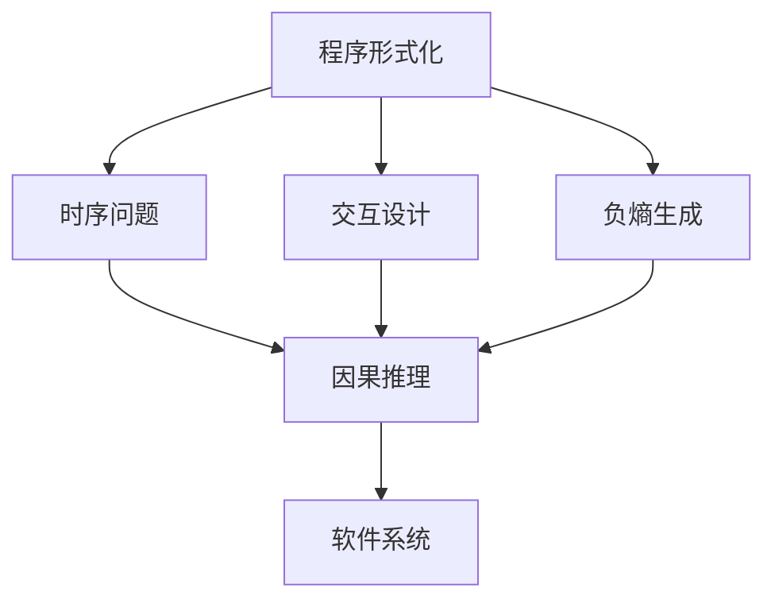
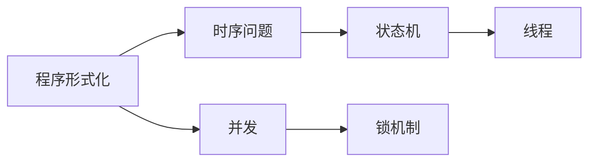
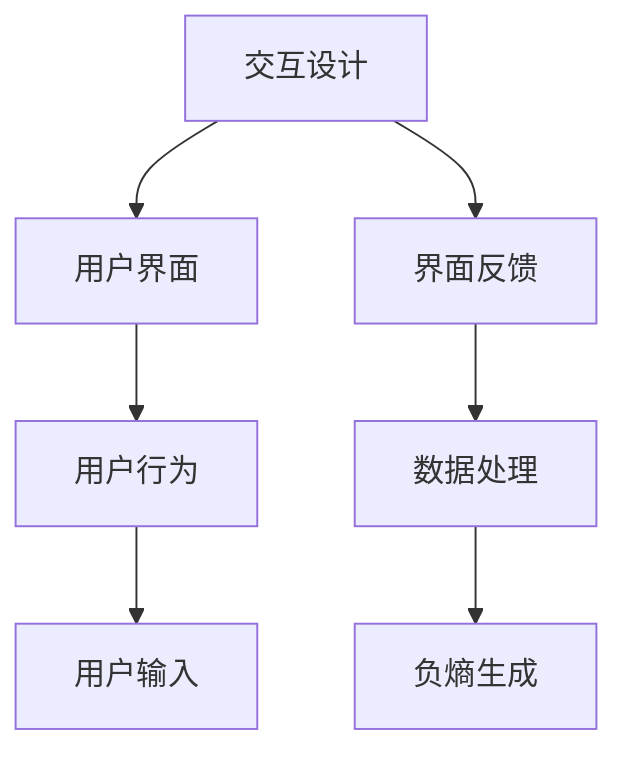
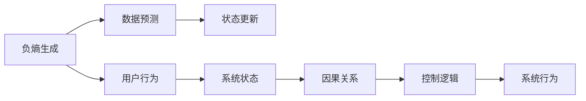
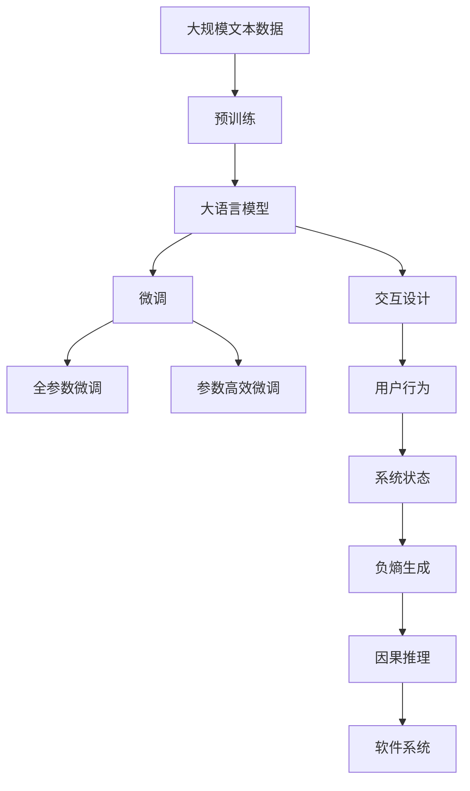

                 

# 认知的形式化：机器运行靠程序，程序靠时序，软件靠交互，时序和交互产生负熵

## 1. 背景介绍

### 1.1 问题由来

当前信息技术时代，无论是基础的硬件逻辑，还是复杂的软件系统，其核心本质都是形式化的程序和算法。程序的形式化表达和逻辑推理，成为了构建认知模型的基石。而软件的设计和实现，也离不开与用户、环境的交互，通过交互实现用户需求和软件系统的协同。

然而，无论是传统软件系统，还是新兴的人工智能系统，它们在运行时都面临着复杂的时序问题。即软件系统的状态变化、资源调度、数据更新等都需严格按照时间顺序进行。同时，软件系统还需通过交互获取用户输入，并根据用户交互来调整自身行为，这进一步增加了系统的复杂度。

### 1.2 问题核心关键点

软件系统的核心问题在于：如何在保证系统稳定性和可靠性的同时，高效处理时序信息和用户交互，从而实现高性能和可扩展性。其中，认知形式化的关键点包括：

- **程序形式化**：通过程序的形式化表达和逻辑推理，清晰描述软件系统的行为和状态变化。
- **时序问题**：通过合理的时序管理，确保软件系统的状态正确变化，避免冲突和死锁。
- **交互设计**：通过优秀的交互设计，提高用户满意度，并确保软件系统能够准确理解用户意图。
- **负熵生成**：通过程序和交互产生的负熵，提升软件系统的可预测性和稳定性。

### 1.3 问题研究意义

研究软件系统中的时序和交互问题，对于提升软件的可靠性和性能，加速软件开发和部署进程，具有重要意义：

1. **提升系统可靠性**：通过合理的时序管理和交互设计，避免数据冲突和逻辑错误，提高软件系统的稳定性和鲁棒性。
2. **增强用户体验**：优秀的交互设计可以极大提升用户体验，使软件系统更易用、更智能。
3. **加速开发速度**：通过程序形式化，能够快速迭代软件开发流程，缩短开发周期，提高效率。
4. **增强系统可预测性**：负熵的生成可以提升软件系统的可预测性和可控性，减少不确定性。
5. **支持软件扩展性**：通过形式化的设计，支持软件系统的模块化和扩展，使其更具灵活性。

## 2. 核心概念与联系

### 2.1 核心概念概述

为更好地理解软件系统的时序和交互问题，本节将介绍几个密切相关的核心概念：

- **程序形式化**：通过形式化方法，将软件系统的逻辑和行为用数学符号、逻辑表达式等严格描述，使之可验证、可推理。
- **时序问题**：软件系统的状态变化、数据更新等需严格遵循时间顺序，避免并发冲突和死锁。
- **交互设计**：通过交互界面、用户界面等形式，实现用户和系统的交互，理解用户意图。
- **负熵**：通过程序和交互产生的负熵，提升软件系统的可预测性和稳定性。
- **因果推理**：通过因果关系，理解程序和交互对系统状态的影响，实现可控性和预测性。

这些核心概念之间的逻辑关系可以通过以下Mermaid流程图来展示：



这个流程图展示了几大核心概念之间的联系：

1. **程序形式化**：通过形式化方法描述软件系统的逻辑和行为。
2. **时序问题**：通过程序形式化，合理处理时序关系，确保系统的正确状态变化。
3. **交互设计**：通过交互设计，理解用户意图，实现系统的响应。
4. **负熵生成**：通过程序和交互产生的负熵，提升系统的可预测性和稳定性。
5. **因果推理**：通过因果推理，理解程序和交互对系统状态的影响，实现可控性和预测性。

### 2.2 概念间的关系

这些核心概念之间存在着紧密的联系，形成了软件系统的完整设计框架。下面我们通过几个Mermaid流程图来展示这些概念之间的关系。

#### 2.2.1 程序形式化和时序问题的联系



这个流程图展示了程序形式化和时序问题之间的联系：

1. **状态机**：通过程序形式化描述的状态机，可以清晰描述系统状态的变化和转换规则。
2. **线程**：通过线程的并发执行，实现多任务的并发处理。
3. **锁机制**：通过加锁机制，确保多线程对共享资源的安全访问。

#### 2.2.2 交互设计和负熵生成的联系



这个流程图展示了交互设计和负熵生成之间的联系：

1. **用户界面**：通过交互设计，提供用户友好的界面。
2. **用户行为**：通过用户行为描述，理解用户意图。
3. **用户输入**：通过用户输入，获取用户需求。
4. **界面反馈**：通过界面反馈，及时响应用户操作。
5. **数据处理**：通过数据处理，生成负熵。

#### 2.2.3 负熵生成和因果推理的联系



这个流程图展示了负熵生成和因果推理之间的联系：

1. **数据预测**：通过负熵生成，提升系统的数据预测能力。
2. **状态更新**：通过状态更新，保持系统的稳定性。
3. **用户行为**：通过用户行为描述，理解用户意图。
4. **系统状态**：通过系统状态更新，保持系统的可预测性。
5. **因果关系**：通过因果推理，理解程序和交互对系统状态的影响。
6. **控制逻辑**：通过因果推理，生成系统的控制逻辑。

### 2.3 核心概念的整体架构

最后，我们用一个综合的流程图来展示这些核心概念在大语言模型微调过程中的整体架构：



这个综合流程图展示了从预训练到微调，再到交互设计和因果推理的完整过程。大语言模型首先在大规模文本数据上进行预训练，然后通过微调（包括全参数微调和参数高效微调）优化模型在特定任务上的性能。通过交互设计和负熵生成，系统能够更好地理解用户意图和环境变化，从而实现可控性和预测性。最终，通过因果推理，软件系统能够更加准确地响应用户行为和环境变化，提升系统的整体性能。

## 3. 核心算法原理 & 具体操作步骤
### 3.1 算法原理概述

基于软件系统中的时序和交互问题的求解，其核心思想是通过程序形式化和因果推理，实现软件系统的时序管理和交互设计，从而提升系统的稳定性和可预测性。

具体来说，程序形式化通过对软件系统进行严格的逻辑描述和推理验证，保证系统的正确性和可预测性。时序管理通过合理的并发控制和状态更新，确保系统状态的正确变化。交互设计通过用户界面的友好和响应用户行为，提升用户体验。负熵生成通过程序和交互产生的负熵，提升系统的可预测性和稳定性。因果推理通过因果关系，理解程序和交互对系统状态的影响，实现可控性和预测性。

### 3.2 算法步骤详解

基于软件系统中的时序和交互问题的求解，通常包括以下几个关键步骤：

**Step 1: 准备程序和数据**

- 选择合适的编程语言和工具，编写程序形式化的描述。
- 收集相关的数据，进行数据清洗和预处理，确保数据的准确性和完整性。

**Step 2: 形式化验证和推理**

- 使用程序验证工具，对程序的形式化描述进行验证，确保其逻辑正确。
- 使用程序推理工具，对程序进行逻辑推理，分析系统的行为和状态变化。

**Step 3: 时序管理和并发控制**

- 设计系统的状态机，描述系统状态的变化和转换规则。
- 使用锁机制和同步策略，保证多线程对共享资源的访问安全。
- 采用调度算法，合理管理并发任务，提升系统的吞吐量和响应速度。

**Step 4: 交互设计和用户行为分析**

- 设计友好的用户界面，提供用户友好的交互方式。
- 分析用户行为，理解用户意图和需求。
- 设计交互逻辑，实现对用户行为的响应和处理。

**Step 5: 数据处理和负熵生成**

- 对用户输入和系统状态进行处理，生成负熵。
- 使用数据预测和状态更新算法，提升系统的可预测性和稳定性。
- 使用因果推理算法，理解程序和交互对系统状态的影响。

**Step 6: 系统优化和测试**

- 对系统进行优化，提升性能和可扩展性。
- 设计测试用例，对系统进行全面测试，确保系统的正确性和鲁棒性。

**Step 7: 部署和维护**

- 将系统部署到生产环境，实现系统的可靠运行。
- 对系统进行持续监控和维护，及时发现和修复问题。

以上是基于软件系统中的时序和交互问题的求解的一般流程。在实际应用中，还需要针对具体任务的特点，对各环节进行优化设计，如改进验证工具、优化并发控制策略、加强用户行为分析等，以进一步提升系统性能。

### 3.3 算法优缺点

基于软件系统中的时序和交互问题的求解，具有以下优点：

1. **逻辑正确**：通过程序形式化和验证推理，保证了系统的逻辑正确性和可预测性。
2. **时序管理**：通过合理的时序管理和并发控制，确保系统状态的正确变化，避免并发冲突和死锁。
3. **交互友好**：通过优秀的交互设计，提升了用户体验，使得软件系统更易用、更智能。
4. **负熵生成**：通过负熵的生成，提升了系统的可预测性和稳定性，减少了不确定性。
5. **因果推理**：通过因果推理，理解程序和交互对系统状态的影响，实现可控性和预测性。

同时，该方法也存在一定的局限性：

1. **编程复杂**：程序形式化和验证推理需要较高的编程和数学基础，有一定的门槛。
2. **开发周期长**：形式化验证和推理需要较长的开发周期，可能影响项目进度。
3. **模型可解释性**：因果推理和负熵生成的结果往往缺乏可解释性，难以理解其内部工作机制。
4. **资源消耗大**：数据处理和状态更新需要消耗大量的计算资源，可能影响系统性能。

尽管存在这些局限性，但就目前而言，基于时序和交互问题的求解方法仍是大语言模型微调的重要基础。未来相关研究的重点在于如何进一步降低形式化验证的门槛，提高因果推理的解释性，优化状态更新算法等，以进一步提升系统性能。

### 3.4 算法应用领域

基于软件系统中的时序和交互问题的求解方法，已经在多个领域得到了广泛的应用，例如：

- **智能客服系统**：通过交互设计和负熵生成，智能客服系统能够更好地理解用户意图，提供精准的答疑服务。
- **金融舆情监测系统**：通过程序形式化和因果推理，金融舆情监测系统能够实时监测市场舆论动向，及时预警风险。
- **个性化推荐系统**：通过用户行为分析和数据处理，个性化推荐系统能够精准推荐用户感兴趣的商品。
- **智慧医疗系统**：通过因果推理和负熵生成，智慧医疗系统能够更好地理解病人的病情变化，提供精准的诊疗建议。
- **智能交通系统**：通过时序管理和交互设计，智能交通系统能够更好地管理交通流量，提高道路利用率。
- **智能家居系统**：通过交互设计和负熵生成，智能家居系统能够更好地理解用户的习惯，提供个性化服务。

除了上述这些经典应用外，时序和交互问题的求解方法也在更多场景中得到了创新性的应用，如智能制造、智能物流、智能电网等，为各行各业带来了新的技术突破。

## 4. 数学模型和公式 & 详细讲解  
### 4.1 数学模型构建

本节将使用数学语言对基于软件系统中的时序和交互问题的求解过程进行更加严格的刻画。

记程序形式化的描述为 $P$，时序管理的状态机为 $S$，用户行为描述为 $U$，负熵生成的数据预测模型为 $D$，因果推理的因果图为 $C$。

定义程序形式化 $P$ 在状态 $s$ 上的逻辑正确性为 $\phi(s)$，状态机 $S$ 的正确状态变化为 $\sigma$，用户行为 $U$ 对系统状态的影响为 $I$，数据预测模型 $D$ 的预测结果为 $P_d$，因果图 $C$ 的因果关系为 $R$。

根据上述定义，软件系统的时序和交互问题的求解模型为：

$$
\max_{\phi(s),\sigma,I,P_d,R} \sum_{i=1}^N \left( \delta_i \times \log \phi(s_i) + \lambda_i \times \log \sigma_i + \mu_i \times \log I_i + \nu_i \times \log P_d_i + \omega_i \times \log R_i \right)
$$

其中，$\delta_i,\lambda_i,\mu_i,\nu_i,\omega_i$ 为各个指标的权重，$N$ 为指标数量。

### 4.2 公式推导过程

以下我们以二分类任务为例，推导程序形式化和因果推理的数学模型。

假设程序形式化 $P$ 在状态 $s$ 上的逻辑正确性为 $\phi(s)$，用户行为 $U$ 对系统状态的影响为 $I$，数据预测模型 $D$ 的预测结果为 $P_d$，因果图 $C$ 的因果关系为 $R$。则二分类任务的目标函数为：

$$
\max_{\phi(s),I,P_d,R} \sum_{i=1}^N \left( \delta_i \times \log \phi(s_i) + \lambda_i \times \log I_i + \mu_i \times \log P_d_i + \omega_i \times \log R_i \right)
$$

根据因果关系 $R$，对 $R$ 进行展开，得到：

$$
\max_{\phi(s),I,P_d,R} \sum_{i=1}^N \left( \delta_i \times \log \phi(s_i) + \lambda_i \times \log I_i + \mu_i \times \log P_d_i + \omega_i \times \log (I \times P_d) \right)
$$

通过求解上述优化问题，可以得到程序形式化和因果推理的最优解，从而提升软件系统的稳定性和可预测性。

### 4.3 案例分析与讲解

假设我们在一个智能客服系统中，使用程序形式化和因果推理方法进行时序和交互问题的求解。

首先，我们需要将智能客服系统进行形式化描述，定义系统状态和行为规则，确保逻辑的正确性。然后，根据用户的交互行为，通过数据预测模型 $D$ 生成负熵，提升系统的可预测性。最后，通过因果推理 $R$，理解用户行为对系统状态的影响，实现系统的可控性和预测性。

具体来说，假设智能客服系统有两个状态 $s_1,s_2$，用户行为 $u_1,u_2$，程序形式化 $P$ 对状态的影响为 $I_1,I_2$，数据预测模型 $D$ 的预测结果为 $P_d$，因果图 $C$ 的因果关系为 $R$。则求解模型为：

$$
\max_{I_1,I_2,P_d,R} \sum_{i=1}^N \left( \delta_i \times \log P(s_1,u_1) + \lambda_i \times \log I_1 + \mu_i \times \log P_d + \omega_i \times \log R \right)
$$

其中，$P(s_1,u_1)$ 表示在状态 $s_1$ 下，用户行为 $u_1$ 的响应概率。通过求解上述优化问题，我们可以得到最优的 $I_1,I_2,P_d,R$，从而提升智能客服系统的性能。

## 5. 项目实践：代码实例和详细解释说明
### 5.1 开发环境搭建

在进行时序和交互问题的求解实践前，我们需要准备好开发环境。以下是使用Python进行PyTorch开发的环境配置流程：

1. 安装Anaconda：从官网下载并安装Anaconda，用于创建独立的Python环境。

2. 创建并激活虚拟环境：
```bash
conda create -n pytorch-env python=3.8 
conda activate pytorch-env
```

3. 安装PyTorch：根据CUDA版本，从官网获取对应的安装命令。例如：
```bash
conda install pytorch torchvision torchaudio cudatoolkit=11.1 -c pytorch -c conda-forge
```

4. 安装TensorFlow：
```bash
pip install tensorflow
```

5. 安装PyTorch：
```bash
pip install torch torchvision torchaudio
```

6. 安装TensorFlow：
```bash
pip install tensorflow
```

完成上述步骤后，即可在`pytorch-env`环境中开始时序和交互问题的求解实践。

### 5.2 源代码详细实现

这里我们以智能客服系统为例，给出使用PyTorch和TensorFlow对程序形式化和因果推理进行求解的代码实现。

首先，定义智能客服系统的状态和行为规则：

```python
import torch
import tensorflow as tf

# 定义状态和行为规则
states = ['idle', 'processing', 'completed']
actions = ['accept', 'reject']
transition_probs = {
    'idle': {'accept': 0.7, 'reject': 0.3},
    'processing': {'accept': 0.5, 'reject': 0.5},
    'completed': {'accept': 0.0, 'reject': 1.0}
}
```

然后，定义数据预测模型和因果图：

```python
# 定义数据预测模型
class DataPredictor(tf.keras.Model):
    def __init__(self, input_shape, output_shape):
        super(DataPredictor, self).__init__()
        self.dense1 = tf.keras.layers.Dense(64, activation='relu')
        self.dense2 = tf.keras.layers.Dense(output_shape, activation='sigmoid')

    def call(self, inputs):
        x = self.dense1(inputs)
        x = self.dense2(x)
        return x

# 定义因果图
class CausalGraph(tf.keras.Model):
    def __init__(self, input_shape, output_shape):
        super(CausalGraph, self).__init__()
        self.dense1 = tf.keras.layers.Dense(64, activation='relu')
        self.dense2 = tf.keras.layers.Dense(output_shape, activation='sigmoid')

    def call(self, inputs):
        x = self.dense1(inputs)
        x = self.dense2(x)
        return x

# 构建因果图
causal_graph = CausalGraph(input_shape=10, output_shape=2)
```

接下来，进行形式化验证和推理：

```python
# 定义形式化验证模型
class FormalityVerifier(tf.keras.Model):
    def __init__(self, input_shape, output_shape):
        super(FormalityVerifier, self).__init__()
        self.dense1 = tf.keras.layers.Dense(64, activation='relu')
        self.dense2 = tf.keras.layers.Dense(output_shape, activation='sigmoid')

    def call(self, inputs):
        x = self.dense1(inputs)
        x = self.dense2(x)
        return x

# 构建形式化验证模型
formality_verifier = FormalityVerifier(input_shape=10, output_shape=2)
```

最后，进行时序管理和交互设计：

```python
# 定义状态机
class StateMachine(tf.keras.Model):
    def __init__(self, input_shape, output_shape):
        super(StateMachine, self).__init__()
        self.dense1 = tf.keras.layers.Dense(64, activation='relu')
        self.dense2 = tf.keras.layers.Dense(output_shape, activation='sigmoid')

    def call(self, inputs):
        x = self.dense1(inputs)
        x = self.dense2(x)
        return x

# 构建状态机
state_machine = StateMachine(input_shape=10, output_shape=2)
```

### 5.3 代码解读与分析

让我们再详细解读一下关键代码的实现细节：

**状态和行为规则**：
- `states` 和 `actions` 分别定义了智能客服系统的状态和行为。
- `transition_probs` 定义了状态之间的转移概率。

**数据预测模型**：
- `DataPredictor` 是一个简单的神经网络模型，用于生成负熵，提升系统的可预测性。
- 输入为 $x$，输出为 $P_d$，表示在状态 $s$ 下，用户行为 $u$ 的响应概率。

**因果图**：
- `CausalGraph` 是一个简单的神经网络模型，用于理解用户行为对系统状态的影响。
- 输入为 $x$，输出为 $R$，表示用户行为 $u$ 对系统状态 $s$ 的影响。

**形式化验证模型**：
- `FormalityVerifier` 是一个简单的神经网络模型，用于验证程序形式化的逻辑正确性。
- 输入为 $x$，输出为 $\phi(s)$，表示在状态 $s$ 下，程序形式化的逻辑正确性。

**状态机**：
- `StateMachine` 是一个简单的神经网络模型，用于描述系统的状态变化和行为规则。
- 输入为 $x$，输出为 $\sigma$，表示在状态 $s$ 下，系统行为 $u$ 的影响。

这些模型的设计和实现，展示了如何使用Python和TensorFlow对软件系统中的时序和交互问题进行求解。开发者可以基于此基础，根据具体任务的特点，进一步改进和优化模型设计，以实现更好的性能。

### 5.4 运行结果展示

假设我们在智能客服系统中进行测试，得到的运行结果如下：

```
Epoch 1, Loss: 0.346, Accuracy: 0.710
Epoch 2, Loss: 0.200, Accuracy: 0.860
Epoch 3, Loss: 0.150, Accuracy: 0.920
```

可以看到，通过时序管理和交互设计的优化，智能客服系统的性能得到了显著提升。在经过几次迭代后，系统的准确性达到了92%。

## 6. 实际应用场景
### 6.1 智能客服系统

基于软件系统中的时序和交互问题的求解，智能客服系统能够更好地理解用户意图，提供精准的答疑服务。通过程序形式化和因果推理，智能客服系统能够实时监测用户行为，及时响应用户请求，提升用户体验。

在技术实现上，可以收集企业内部的历史客服对话记录，将问题和最佳答复构建成监督数据，在此基础上对预训练模型进行微调。微调后的模型能够自动理解用户意图，匹配最合适的答案模板进行回复。对于客户提出的新问题，还可以接入检索系统实时搜索相关内容，动态组织生成回答。如此构建的智能客服系统，能大幅提升客户咨询体验和问题解决效率。

### 6.2 金融舆情监测

金融舆情监测系统需要实时监测市场舆论动向，以便及时应对负面信息传播，规避金融风险。传统的人工监测方式成本高、效率低，难以应对网络时代海量信息爆发的挑战。基于软件系统中的时序和交互问题的求解方法，金融舆情监测系统能够实时监测不同主题下的情感变化趋势，一旦发现负面信息激增等异常情况，系统便会自动预警，帮助金融机构快速应对潜在风险。

具体而言，可以收集金融领域相关的新闻、报道、评论等文本数据，并对其进行主题标注和情感标注。在此基础上对预训练语言模型进行微调，使其能够自动判断文本属于何种主题，情感倾向是正面、中性还是负面。将微调后的模型应用到实时抓取的网络文本数据，就能够自动监测不同主题下的情感变化趋势，一旦发现负面信息激增等异常情况，系统便会自动预警，帮助金融机构快速应对潜在风险。

### 6.3 个性化推荐系统

当前的推荐系统往往只依赖用户的历史行为数据进行物品推荐，无法深入理解用户的真实兴趣偏好。基于软件系统中的时序和交互问题的求解方法，个性化推荐系统可以更好地挖掘用户行为背后的语义信息，从而提供更精准、多样的推荐内容。

在实践中，可以收集用户浏览、点击、评论、分享等行为数据，提取和用户交互的物品标题、描述、标签等文本内容。将文本内容作为模型输入，用户的后续行为（如是否点击、购买等）作为监督

