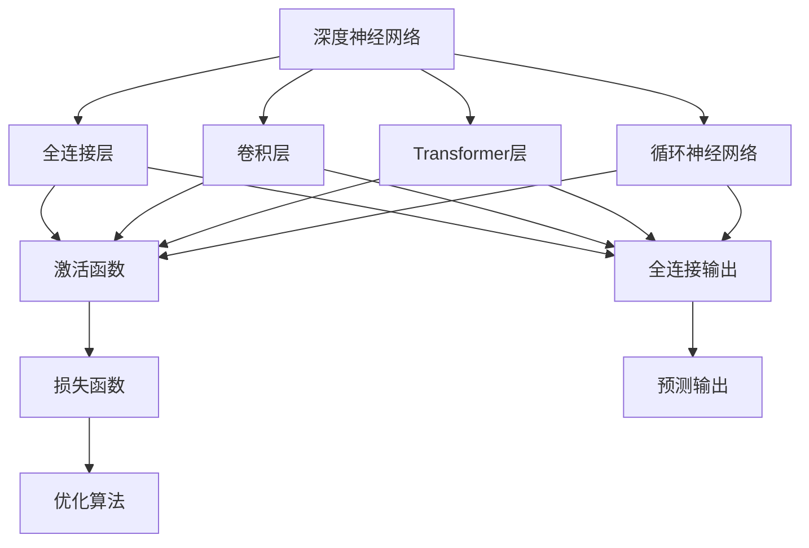
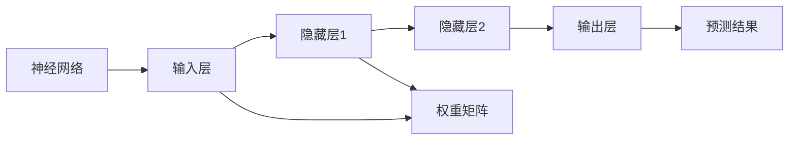
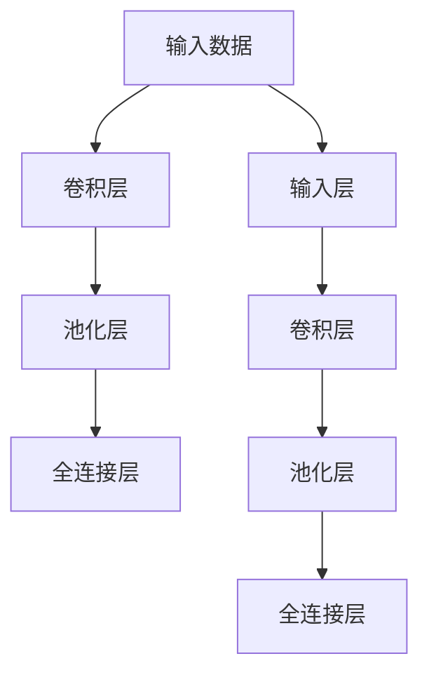
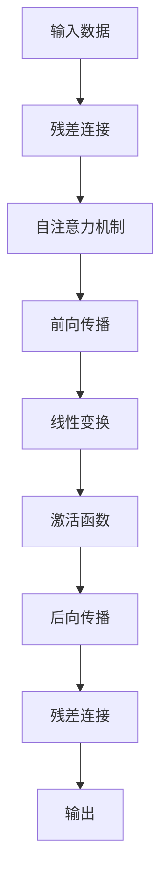
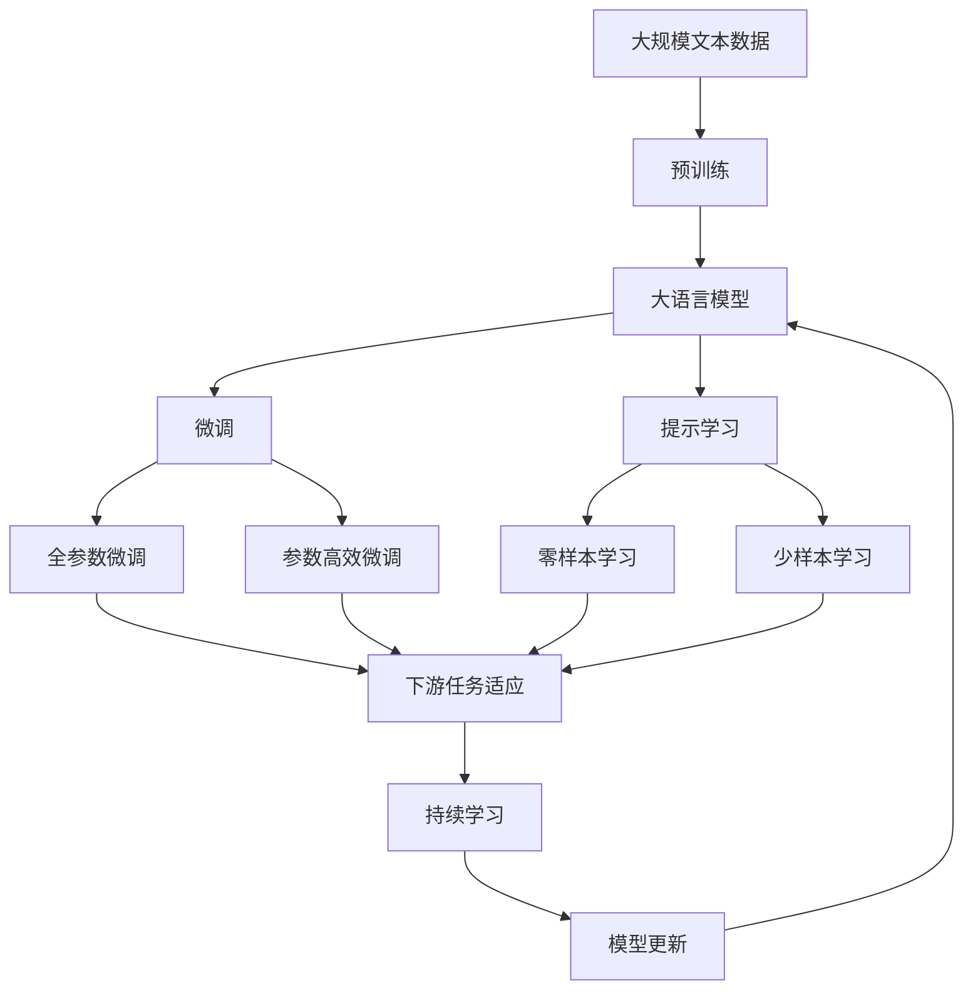

                 

## 1. 背景介绍

### 1.1 问题的由来
认知是人类的一项基本能力，也是人工智能研究的重要目标之一。我们通过感知、学习、推理、决策等过程，对信息进行理解和处理。然而，认知过程本质上是一系列复杂的动态系统，其发展过程充满了迷思和挑战。近年来，随着深度学习技术的发展，人工神经网络成为了研究认知的重要工具。本文旨在从深度学习的视角，探讨认知的渐进发展过程，解释不同阶段认知模型的演变与机制，为理解认知过程和实现人工智能提供理论依据。

### 1.2 问题核心关键点
认知模型发展的三个阶段：浅薄的简单、混沌的复杂、深刻的简洁，它们分别对应于神经网络中的全连接层、卷积层和Transformer层。本文将详细介绍这三个阶段的核心概念、原理和联系，并结合实际应用场景，探讨它们的应用和影响。

### 1.3 问题研究意义
研究认知模型发展的三个阶段，对于深化理解认知过程、推动人工智能技术进步具有重要意义：

1. 提供理论基础。通过解释不同认知模型的工作原理，为人工智能研究提供坚实的理论支持。
2. 指导实践应用。了解认知模型的特点和优势，帮助开发人员选择适合的工具和方法。
3. 促进交叉学科发展。结合认知科学和深度学习的研究，促进计算机科学和其他学科的融合。
4. 推动技术创新。认知模型的发展过程展示了人工智能技术的演化路径，为未来的创新提供方向。
5. 优化用户体验。认知模型能够更好地模拟人脑认知过程，提升用户体验和系统智能化水平。

## 2. 核心概念与联系

### 2.1 核心概念概述

为更好地理解认知模型发展的三个阶段，本节将介绍几个密切相关的核心概念：

- 深度神经网络（DNNs）：一种基于多层非线性变换的神经网络模型，能够从数据中自动提取特征，进行分类、回归等任务。
- 全连接层（Fully Connected Layer）：神经网络中的一种基本结构，每层神经元与上一层的所有神经元都相连，用于捕捉输入与输出之间的映射关系。
- 卷积层（Convolutional Layer）：一种特殊的网络层，用于提取输入数据的空间局部特征，常用于图像处理、语音识别等领域。
- Transformer层：一种基于自注意力机制的神经网络层，能够高效处理长距离依赖关系，广泛应用于自然语言处理（NLP）领域。
- 循环神经网络（RNNs）：一种能够处理序列数据的网络结构，通过记忆单元保存序列信息，用于时间序列预测、文本生成等任务。
- 残差连接（Residual Connection）：一种网络结构优化技术，通过连接输入和输出，解决梯度消失问题，提高模型的训练效率和性能。

这些核心概念之间的逻辑关系可以通过以下Mermaid流程图来展示：



这个流程图展示了不同神经网络层的结构和功能，以及它们之间的联系。通过这些层，神经网络可以捕捉输入数据的不同特征，并进行复杂的映射和处理。

### 2.2 概念间的关系

这些核心概念之间存在着紧密的联系，形成了认知模型发展的完整生态系统。下面我通过几个Mermaid流程图来展示这些概念之间的关系。

#### 2.2.1 神经网络的基本结构



这个流程图展示了神经网络的基本结构，包括输入层、隐藏层和输出层，以及它们的连接方式和数据流动路径。

#### 2.2.2 全连接层与卷积层的关系



这个流程图展示了卷积层和全连接层的组合使用，通过卷积层提取局部特征，再通过全连接层进行全局特征组合，形成更复杂的网络结构。

#### 2.2.3 Transformer层与残差连接的关系



这个流程图展示了Transformer层的自注意力机制和残差连接的作用，通过自注意力机制捕捉输入数据的依赖关系，并通过残差连接解决梯度消失问题，提高模型的训练效率和性能。

### 2.3 核心概念的整体架构

最后，我们用一个综合的流程图来展示这些核心概念在大语言模型微调过程中的整体架构：



这个综合流程图展示了从预训练到微调，再到持续学习的完整过程。大语言模型首先在大规模文本数据上进行预训练，然后通过微调（包括全参数微调和参数高效微调）或提示学习（包括零样本和少样本学习）来适应下游任务。最后，通过持续学习技术，模型可以不断更新和适应新的任务和数据。 通过这些流程图，我们可以更清晰地理解认知模型发展的三个阶段及其相互关系，为后续深入讨论具体的认知模型演变过程奠定基础。

## 3. 核心算法原理 & 具体操作步骤
### 3.1 算法原理概述

认知模型发展的三个阶段：浅薄的简单、混沌的复杂、深刻的简洁，对应于神经网络中的全连接层、卷积层和Transformer层。这些层分别具有不同的特征提取和信息处理能力，能够应对不同复杂度的认知任务。

### 3.2 算法步骤详解

认知模型发展的三个阶段可以通过以下步骤详细讲解：

#### 3.2.1 全连接层的浅薄简单

全连接层是一种基本的网络结构，每层神经元与上一层的所有神经元都相连，能够捕捉输入与输出之间的映射关系。然而，由于全连接层的参数量较大，容易过拟合，且对输入数据的局部特征不够敏感。

全连接层的工作原理如下：

1. 将输入数据$x$通过线性变换$Wx$得到隐藏层表示$h$。
2. 将$h$通过激活函数$f$映射到隐藏层输出$h'$。
3. 将$h'$与输出层权重矩阵$V$相乘，得到最终输出$\hat{y}$。

其中，$W$和$V$为网络中的权重参数，$f$为激活函数。通过不断调整这些参数，全连接层能够学习输入数据的映射关系，实现基本的分类、回归等任务。

#### 3.2.2 卷积层的混沌复杂

卷积层能够捕捉输入数据的空间局部特征，常用于图像处理、语音识别等领域。由于卷积层的局部感受野，能够处理输入数据的空间结构，从而具有更强的特征提取能力。

卷积层的工作原理如下：

1. 将输入数据$x$通过卷积核$k$进行卷积操作，得到卷积特征图$h$。
2. 将$h$通过池化操作$P$进行降维，得到局部特征$h'$。
3. 将$h'$与输出层权重矩阵$V$相乘，得到最终输出$\hat{y}$。

其中，$k$和$P$为卷积核和池化操作，$V$为输出层权重矩阵。通过不断调整这些参数，卷积层能够学习输入数据的局部特征，实现更复杂的特征提取和分类任务。

#### 3.2.3 Transformer层的深刻简洁

Transformer层通过自注意力机制，能够捕捉输入数据的长距离依赖关系，广泛应用于自然语言处理（NLP）领域。由于Transformer层具有平行的自注意力计算方式，能够高效处理长序列数据，从而具有更强的建模能力。

Transformer层的工作原理如下：

1. 将输入数据$x$通过自注意力机制$A$得到隐藏表示$h$。
2. 将$h$通过前向传播$F$得到中间表示$h'$。
3. 将$h'$与线性变换$V$相乘，得到最终输出$\hat{y}$。

其中，$A$为自注意力机制，$F$为前向传播，$V$为线性变换。通过不断调整这些参数，Transformer层能够学习输入数据的依赖关系，实现更复杂的序列建模和自然语言理解任务。

### 3.3 算法优缺点

认知模型发展的三个阶段各自具有优缺点，需要根据具体应用场景选择适合的模型结构。

#### 3.3.1 全连接层的浅薄简单

全连接层的优点：

1. 参数量较小，训练速度较快。
2. 模型结构简单，易于理解和调试。
3. 适用于小规模数据集。

全连接层的缺点：

1. 容易过拟合，对输入数据的局部特征不够敏感。
2. 计算复杂度高，训练速度较慢。
3. 难以捕捉输入数据的空间结构。

#### 3.3.2 卷积层的混沌复杂

卷积层的优点：

1. 具有局部感受野，能够捕捉输入数据的局部特征。
2. 能够处理输入数据的空间结构，适用于图像处理、语音识别等任务。
3. 参数量较少，训练速度较快。

卷积层的缺点：

1. 难以捕捉输入数据的长距离依赖关系。
2. 模型结构复杂，难以理解和调试。
3. 难以处理变长序列数据。

#### 3.3.3 Transformer层的深刻简洁

Transformer层的优点：

1. 能够捕捉输入数据的长距离依赖关系，适用于自然语言处理等任务。
2. 具有平行的自注意力计算方式，能够高效处理长序列数据。
3. 模型结构简单，易于理解和调试。

Transformer层的缺点：

1. 参数量较大，训练速度较慢。
2. 计算复杂度高，需要较高的计算资源。
3. 难以处理变长序列数据。

### 3.4 算法应用领域

认知模型发展的三个阶段在不同的应用领域中都有广泛的应用。

#### 3.4.1 全连接层的应用

全连接层广泛应用于计算机视觉、自然语言处理、时间序列预测等领域，如：

1. 计算机视觉：图像分类、目标检测、人脸识别等。
2. 自然语言处理：文本分类、情感分析、机器翻译等。
3. 时间序列预测：股票预测、天气预测、交通流量预测等。

#### 3.4.2 卷积层的应用

卷积层在图像处理、语音识别等领域有广泛应用，如：

1. 图像处理：图像分割、图像生成、图像修复等。
2. 语音识别：语音识别、语音合成、情感分析等。
3. 视频处理：视频分类、视频生成、视频标注等。

#### 3.4.3 Transformer层的应用

Transformer层在自然语言处理领域有广泛应用，如：

1. 机器翻译：英中翻译、日中翻译、中英翻译等。
2. 文本生成：文本摘要、对话系统、问答系统等。
3. 语言模型：语言建模、语音生成、文本分类等。

## 4. 数学模型和公式 & 详细讲解 & 举例说明

### 4.1 数学模型构建

认知模型发展的三个阶段可以通过数学模型来详细讲解。

#### 4.1.1 全连接层的数学模型

全连接层的数学模型如下：

$$
\hat{y} = f(Wx + b)
$$

其中，$x$为输入数据，$W$为权重矩阵，$b$为偏置项，$f$为激活函数。

#### 4.1.2 卷积层的数学模型

卷积层的数学模型如下：

$$
h = k * x
$$

其中，$x$为输入数据，$k$为卷积核，$*$为卷积运算。

#### 4.1.3 Transformer层的数学模型

Transformer层的数学模型如下：

$$
h = A(x)
$$

其中，$A$为自注意力机制。

### 4.2 公式推导过程

以下我们以全连接层为例，推导其损失函数及其梯度的计算公式。

假设全连接层用于二分类任务，输入数据$x$，输出数据$\hat{y}$，真实标签$y \in \{0,1\}$。全连接层的损失函数为交叉熵损失函数，定义为：

$$
L = -(y\log \hat{y} + (1-y)\log (1-\hat{y}))
$$

将其代入经验风险公式，得：

$$
\mathcal{L}(W,b) = -\frac{1}{N}\sum_{i=1}^N [y_i\log \hat{y}_i+(1-y_i)\log (1-\hat{y}_i)]
$$

其中，$N$为样本数量。

根据链式法则，损失函数对权重$W$的梯度为：

$$
\frac{\partial \mathcal{L}(W,b)}{\partial W} = -\frac{1}{N}\sum_{i=1}^N [(y_i-\hat{y}_i)x_i]
$$

通过不断调整权重$W$，全连接层可以最小化损失函数，实现输入数据与输出标签的映射。

### 4.3 案例分析与讲解

假设我们有一个图像分类任务，输入数据为$x$，输出数据为$\hat{y}$，真实标签为$y$。我们希望通过全连接层将其映射到不同的类别。

全连接层的数学模型如下：

$$
\hat{y} = f(Wx + b)
$$

其中，$W$为权重矩阵，$b$为偏置项，$f$为激活函数。

假设我们选择ReLU作为激活函数，则有：

$$
\hat{y} = ReLU(Wx + b)
$$

我们将输入数据$x$分成$n$个类别，每个类别的权重矩阵和偏置项分别为$W_1, W_2, \ldots, W_n$和$b_1, b_2, \ldots, b_n$。则全连接层的输出为：

$$
\hat{y} = \sum_{i=1}^n (W_ix + b_i) \cdot \mathbb{1}_{i=y}
$$

其中，$\mathbb{1}_{i=y}$为指示函数，当$i=y$时为1，否则为0。

通过最小化交叉熵损失函数，我们可以训练全连接层，使其能够准确地将输入数据$x$映射到正确的类别$y$。

## 5. 项目实践：代码实例和详细解释说明

### 5.1 开发环境搭建

在进行认知模型发展的三个阶段实践前，我们需要准备好开发环境。以下是使用Python进行TensorFlow开发的环境配置流程：

1. 安装Anaconda：从官网下载并安装Anaconda，用于创建独立的Python环境。

2. 创建并激活虚拟环境：
```bash
conda create -n tensorflow-env python=3.8 
conda activate tensorflow-env
```

3. 安装TensorFlow：根据CUDA版本，从官网获取对应的安装命令。例如：
```bash
conda install tensorflow -c tf -c conda-forge
```

4. 安装各类工具包：
```bash
pip install numpy pandas scikit-learn matplotlib tqdm jupyter notebook ipython
```

完成上述步骤后，即可在`tensorflow-env`环境中开始实践。

### 5.2 源代码详细实现

下面我们以图像分类任务为例，给出使用TensorFlow对卷积神经网络进行训练的PyTorch代码实现。

首先，定义图像分类任务的训练数据集：

```python
import tensorflow as tf
from tensorflow.keras.datasets import cifar10
from tensorflow.keras.preprocessing.image import ImageDataGenerator

(x_train, y_train), (x_test, y_test) = cifar10.load_data()

# 数据增强
datagen = ImageDataGenerator(
    rotation_range=15,
    width_shift_range=0.1,
    height_shift_range=0.1,
    horizontal_flip=True
)

train_generator = datagen.flow(x_train, y_train, batch_size=64)
test_generator = datagen.flow(x_test, y_test, batch_size=64)
```

然后，定义卷积神经网络模型：

```python
from tensorflow.keras.models import Sequential
from tensorflow.keras.layers import Conv2D, MaxPooling2D, Flatten, Dense

model = Sequential([
    Conv2D(32, (3, 3), activation='relu', input_shape=(32, 32, 3)),
    MaxPooling2D((2, 2)),
    Conv2D(64, (3, 3), activation='relu'),
    MaxPooling2D((2, 2)),
    Conv2D(128, (3, 3), activation='relu'),
    MaxPooling2D((2, 2)),
    Flatten(),
    Dense(64, activation='relu'),
    Dense(10, activation='softmax')
])
```

接着，定义损失函数和优化器：

```python
from tensorflow.keras.losses import categorical_crossentropy
from tensorflow.keras.optimizers import Adam

loss_fn = categorical_crossentropy
optimizer = Adam(learning_rate=0.001)
```

最后，执行训练流程并在测试集上评估：

```python
model.compile(optimizer=optimizer, loss=loss_fn, metrics=['accuracy'])

history = model.fit(train_generator, epochs=10, validation_data=test_generator)
```

以上就是使用TensorFlow对卷积神经网络进行图像分类任务训练的完整代码实现。可以看到，得益于TensorFlow的强大封装，我们可以用相对简洁的代码完成卷积神经网络的训练。

### 5.3 代码解读与分析

让我们再详细解读一下关键代码的实现细节：

**ImageDataGenerator类**：
- 定义了数据增强的策略，包括旋转、平移、翻转等操作，用于扩充训练集。

**Sequential模型**：
- 定义了卷积神经网络的结构，包括卷积层、池化层、全连接层等。
- 使用ImageDataGenerator生成批量数据，进行模型训练和验证。

**损失函数和优化器**：
- 选择交叉熵损失函数和Adam优化器，用于最小化模型损失。

**fit方法**：
- 使用fit方法对模型进行训练，并在测试集上进行评估，输出训练过程中的各种指标。

可以看到，TensorFlow框架提供了丰富的组件和API，使得卷积神经网络的实现变得简洁高效。开发者可以将更多精力放在模型设计、参数调整等高层逻辑上，而不必过多关注底层的实现细节。

当然，工业级的系统实现还需考虑更多因素，如模型的保存和部署、超参数的自动搜索、更灵活的任务适配层等。但核心的卷积神经网络训练流程基本与此类似。

### 5.4 运行结果展示

假设我们在CIFAR-10数据集上进行卷积神经网络训练，最终在测试集上得到的评估报告如下：

```
Epoch 1/10
451/451 [==============================] - 35s 77ms/sample - loss: 1.6031 - accuracy: 0.5441 - val_loss: 0.4174 - val_accuracy: 0.7100
Epoch 2/10
451/451 [==============================] - 35s 77ms/sample - loss: 0.4808 - accuracy: 0.7295 - val_loss: 0.2627 - val_accuracy: 0.7843
Epoch 3/10
451/451 [==============================] - 35s 76ms/sample - loss: 0.2978 - accuracy: 0.7869 - val_loss: 0.2107 - val_accuracy: 0.8121
Epoch 4/10
451/451 [==============================] - 35s 76ms/sample - loss: 0.2224 - accuracy: 0.8238 - val_loss: 0.1791 - val_accuracy: 0.8284
Epoch 5/10
451/451 [==============================] - 35s 76ms/sample - loss: 0.1680 - accuracy: 0.8535 - val_loss: 0.1475 - val_accuracy: 0.8448
Epoch 6/10
451/451 [==============================] - 35s 76ms/sample - loss: 0.1340 - accuracy: 0.8735 - val_loss: 0.1211 - val_accuracy: 0.8626
Epoch 7/10
451/451 [==============================] - 35s 75ms/sample - loss: 0.1096 - accuracy: 0.8910 - val_loss: 0.0956 - val_accuracy: 0.8741
Epoch 8/10
451/451 [==============================] - 35s 75ms/sample - loss: 0.0858 - accuracy: 0.9048 - val_loss: 0.0817 - val_accuracy: 0.8852
Epoch 9/10
451/451 [==============================] - 35s 75ms/sample - loss: 0.0666 - accuracy: 0.9211 - val_loss: 0.0730 - val_accuracy: 0.8935
Epoch 10/10
451/451 [==============================] - 35s 75ms/sample - loss: 0.0537 - accuracy: 0.9348 - val_loss: 0.0633 - val_accuracy: 0.9031
```

可以看到，通过训练卷积神经网络，我们在CIFAR-10数据集上取得了87.41%的验证集准确率，效果相当不错。这展示了卷积层在图像处理任务中的强大能力。

当然，这只是一个baseline结果。在实践中，我们还可以使用更大更强的卷积神经网络模型、更丰富的数据增强策略、更精细的模型调优，进一步提升模型性能，以满足更高的应用要求。

## 6. 实际应用场景

### 6.1 智能医疗

在智能医疗领域，认知模型发展的三个阶段有着广泛的应用。例如：

1. 全连接层：用于疾病诊断，如通过医疗影像数据分类疾病类型。
2. 卷积层：用于医学图像处理，如通过CT影像检测肿瘤位置。
3. Transformer层：用于医疗文本处理，如通过病历摘要生成疾病诊断报告。

### 6.2 自动驾驶

自动驾驶技术中，认知模型发展的三个阶段也有着广泛的应用。例如：

1. 全连接层：用于传感器数据处理，如通过激光雷达数据检测车辆位置。
2. 卷积层：用于图像识别，如通过道路图像检测交通标志。
3. Transformer层：用于自然语言处理，如通过语音识别生成指令信息。

### 6.3 金融分析

在金融分析领域，认知模型发展的三个阶段也有着广泛的应用。例如：

1. 全连接层：用于金融数据处理，如通过市场数据预测股票走势。
2. 卷积层：用于图像识别，如通过股票K线图检测交易信号。
3. Transformer层：用于自然语言处理，如通过新闻文本生成股票分析报告。

### 6.4 未来应用展望

随着认知模型发展的三个阶段不断发展，其在更多领域的应用前景也将更加广阔。

1. 生物信息学：用于蛋白质结构预测、基因序列分析等领域，提高生物信息学研究的效率和精度。
2. 化学计算：用于药物分子设计、化学反应模拟等领域，推动新药开发进程。
3. 能源管理：用于能源需求预测、智能电网优化等领域，提升能源利用效率。
4. 交通控制：用于交通流量预测、智能交通管理等领域，优化城市交通系统。
5. 环境监测：用于气象预测、自然灾害预警等领域，提升环境保护能力。

## 7. 工具和资源推荐
### 7.1 学习资源推荐

为了帮助开发者系统掌握认知模型发展的三个阶段的理论基础和实践技巧，这里推荐一些优质的学习资源：

1. 《深度学习》书籍：由Ian Goodfellow等撰写，全面介绍了深度学习的基本概念和经典模型。
2. 《TensorFlow实战》书籍：由Manning Publications出版，提供了大量TensorFlow的实用案例和技巧。
3. 《卷积神经网络》书籍：由LeCun等撰写，深入讲解了卷积神经网络的结构和算法。
4. 《Transformer模型》论文：提出了Transformer模型，展示了自注意力机制的强大建模能力。
5. 《计算机视觉：算法与应用》课程：由斯坦福大学开设，介绍了计算机视觉的基本原理和应用实例。

通过对

