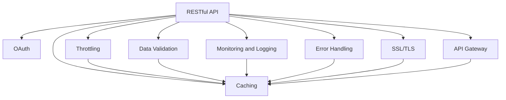

                 

## 1. 背景介绍

在快速发展的数字化时代，API（应用程序接口）扮演着至关重要的角色。它们使得不同的软件系统能够彼此通信、协同工作，实现数据的集成与共享，为各种应用场景提供强大的支持。然而，随着API数量的激增和复杂度的提高，确保API的安全性和可靠性也变得愈发重要。API漏洞不仅可能导致数据泄露、系统瘫痪等严重问题，还可能威胁到用户的隐私和企业的品牌信誉。

本博客旨在提供一套全面的原则，帮助开发者设计出既安全又可靠、易于维护和扩展的API。我们认为，遵循这些原则，可以有效提升API的质量，减少潜在的安全风险，促进API的长期可持续性发展。

## 2. 核心概念与联系

### 2.1 核心概念概述

为了更好地理解如何设计安全可靠API，我们需要先了解一些关键的概念：

- **API（应用程序接口）**：一种使不同的软件系统能够交互和通信的机制。
- **RESTful API**：一种基于HTTP协议的API设计风格，强调资源的唯一标识和HTTP方法的使用。
- **OAuth**：一种授权机制，允许用户通过第三方服务提供商授权访问资源，无需共享密码。
- **Throttling**：通过限制请求速率，防止API被恶意利用。
- **Data Validation**：在API接收和处理数据时，进行严格的数据校验，避免输入攻击。
- **Caching**：缓存API响应，减少重复处理和提高性能。
- **Monitoring and Logging**：记录API使用情况和错误信息，帮助监控和排错。
- **Error Handling**：设计友好的错误返回机制，帮助客户端理解错误原因和如何改正。
- **SSL/TLS**：使用SSL/TLS加密协议，确保数据传输的安全性。
- **API Gateway**：作为API的前端代理，提供路由、负载均衡、安全等基本功能。

这些概念通过API的生命周期被有机地联系在一起，形成一个完整的设计原则体系。

### 2.2 核心概念的关系

我们可以通过一个Mermaid流程图来展示这些核心概念之间的关系：



从图中可以看到，RESTful API是核心，其安全性（B、H、I）、可靠性（C、D、E、F、G）、效率（C、D、E）均通过不同的机制得到保证。这些机制相互协作，共同维护API的完整性和健壮性。

## 3. 核心算法原理 & 具体操作步骤

### 3.1 算法原理概述

设计安全可靠的API，需要遵循一系列原则，这些原则覆盖了API设计的各个方面，包括安全性、可靠性、性能、可维护性等。下面我们将逐一介绍这些原则，并通过具体的操作步骤来阐释其实现方法。

### 3.2 算法步骤详解

#### 3.2.1 安全性原则

**原则一：使用HTTPS**

- **操作步骤**：
  - 确保API使用HTTPS协议，避免数据在传输过程中被拦截和篡改。
  - 获取SSL证书，确保服务器和客户端之间的通信安全。

**原则二：实施OAuth 2.0**

- **操作步骤**：
  - 为API实现OAuth 2.0授权机制，允许用户通过第三方服务提供商进行身份验证和授权。
  - 使用OAuth 2.0的标准流程，包括授权码模式、隐式模式等，确保授权过程的安全性。

**原则三：实施Throttling**

- **操作步骤**：
  - 使用限流机制，如令牌桶算法、漏桶算法等，限制API的请求速率。
  - 根据用户级别、请求来源、请求频率等因素设置不同的限流策略。

#### 3.2.2 可靠性原则

**原则四：实现Data Validation**

- **操作步骤**：
  - 对所有输入数据进行严格的校验，确保数据的正确性和完整性。
  - 使用正则表达式、范围检查等技术，验证数据的格式和范围。

**原则五：实现Caching**

- **操作步骤**：
  - 使用HTTP缓存机制，如ETag、If-None-Match等，缓存API的响应。
  - 根据数据的时效性，设定缓存的有效期。

#### 3.2.3 性能原则

**原则六：优化API响应时间**

- **操作步骤**：
  - 对API进行性能优化，减少响应时间和延迟。
  - 使用异步处理、缓存、负载均衡等技术提高API的吞吐量。

**原则七：实施Monitoring and Logging**

- **操作步骤**：
  - 使用日志记录API的使用情况和错误信息。
  - 定期分析日志，发现和解决问题，提高API的稳定性和可靠性。

#### 3.2.4 可维护性原则

**原则八：使用RESTful API**

- **操作步骤**：
  - 设计RESTful API，遵循资源的唯一标识和HTTP方法的使用，提高API的可读性和易用性。
  - 使用标准化的URL结构，避免冗余的请求。

**原则九：实施API Gateway**

- **操作步骤**：
  - 使用API Gateway作为API的前端代理，提供路由、负载均衡、安全等基本功能。
  - 配置API Gateway，实现API的统一管理和调度。

### 3.3 算法优缺点

#### 3.3.1 安全性原则的优缺点

**优点**：
- 通过HTTPS协议和OAuth 2.0授权机制，确保API的通信安全。
- 使用限流机制，防止API被恶意利用，提高系统的安全性。

**缺点**：
- 需要额外的证书管理和授权配置。
- OAuth 2.0的复杂性可能增加系统的维护难度。

#### 3.3.2 可靠性原则的优缺点

**优点**：
- 通过数据校验和缓存机制，提高API的稳定性和响应速度。
- 使用监控和日志记录，帮助快速定位和解决问题。

**缺点**：
- 数据校验和缓存机制可能增加系统的复杂性。
- 日志记录和监控需要持续维护和分析，可能增加运维成本。

#### 3.3.3 性能原则的优缺点

**优点**：
- 通过性能优化和缓存机制，提高API的响应速度和吞吐量。
- 使用监控和日志记录，帮助快速识别和解决问题。

**缺点**：
- 性能优化和缓存机制需要持续调整和优化。
- 监控和日志记录可能占用额外的系统资源。

#### 3.3.4 可维护性原则的优缺点

**优点**：
- 通过RESTful API设计和API Gateway实现，提高API的可读性和易用性。
- 使用API Gateway实现统一管理和调度，减少系统的复杂性。

**缺点**：
- RESTful API设计可能增加系统的复杂性。
- API Gateway的配置和管理需要额外的运维工作。

### 3.4 算法应用领域

这些设计原则适用于各种类型的API，包括Web API、移动API、物联网API等。无论是在企业内部还是外部，这些原则都可以帮助提升API的安全性和可靠性，确保API能够在复杂和多变的环境下持续稳定地运行。

## 4. 数学模型和公式 & 详细讲解 & 举例说明

### 4.1 数学模型构建

在设计安全可靠的API时，我们不需要用到复杂的数学模型，而是通过一系列工程实践和技术手段来实现。下面我们将通过一些具体的案例来展示这些原则的实现。

### 4.2 公式推导过程

由于这些原则主要涉及工程实践，没有直接相关的数学公式推导。我们将通过一些实际的例子来展示这些原则的实现。

### 4.3 案例分析与讲解

#### 4.3.1 案例一：实现Data Validation

**背景**：
某公司提供了一个天气API，用户可以通过API获取指定位置的天气信息。

**问题**：
在处理用户请求时，API可能会接收到非法数据，如非法格式、非法的参数值等。

**解决方案**：
在API的接收端，对请求进行严格的数据校验。例如，对位置参数进行正则表达式验证，确保位置格式正确。对日期参数进行范围检查，确保日期合法。

**代码示例**：

```python
from django.http import JsonResponse

def get_weather(request):
    if not request.is_ajax():
        return JsonResponse({'error': 'Not a valid AJAX request'}, status=400)
    
    location = request.GET.get('location', None)
    if not location:
        return JsonResponse({'error': 'Missing location parameter'}, status=400)
    
    if not re.match(r'^[0-9]{1,3}\.[0-9]{1,3}\.[0-9]{1,3}\.[0-9]{1,3}$', location):
        return JsonResponse({'error': 'Invalid location parameter'}, status=400)
    
    # 继续处理合法数据
    # ...
```

#### 4.3.2 案例二：实现Caching

**背景**：
某公司提供了一个新闻API，用户可以通过API获取最新新闻资讯。

**问题**：
API频繁被用户访问，造成服务器压力增大。

**解决方案**：
使用HTTP缓存机制，缓存API的响应，减少服务器负担。例如，使用ETag机制，对相同内容返回相同的响应，减少缓存更新的频率。

**代码示例**：

```python
from django.http import JsonResponse

def get_news(request):
    if request.META['HTTP_IF_NONE_MATCH']:
        # 使用ETag缓存
        return JsonResponse({'news': []}, status=304)
    
    # 获取新闻数据
    # ...
    # 更新ETag并返回数据
    return JsonResponse({'news': news_data}, status=200)
```

## 5. 项目实践：代码实例和详细解释说明

### 5.1 开发环境搭建

要实现这些API设计原则，我们需要一个开发环境。下面我们将介绍如何使用Python和Django框架搭建API开发环境。

**步骤**：
1. 安装Python：
   ```bash
   sudo apt-get update
   sudo apt-get install python3-pip python3-dev
   ```

2. 安装Django：
   ```bash
   pip install django
   ```

3. 创建Django项目：
   ```bash
   django-admin startproject projectname
   cd projectname
   ```

4. 创建Django应用：
   ```bash
   python manage.py startapp appname
   ```

5. 配置数据库：
   ```python
   # settings.py
   DATABASES = {
       'default': {
           'ENGINE': 'django.db.backends.postgresql',
           'NAME': 'dbname',
           'USER': 'username',
           'PASSWORD': 'password',
           'HOST': 'localhost',
           'PORT': '5432',
       }
   }
   ```

### 5.2 源代码详细实现

**源代码**：
以下是一个简单的API实现，展示了如何使用Django框架实现RESTful API设计和实现。

```python
from django.http import JsonResponse

def get_weather(request):
    if not request.is_ajax():
        return JsonResponse({'error': 'Not a valid AJAX request'}, status=400)
    
    location = request.GET.get('location', None)
    if not location:
        return JsonResponse({'error': 'Missing location parameter'}, status=400)
    
    if not re.match(r'^[0-9]{1,3}\.[0-9]{1,3}\.[0-9]{1,3}\.[0-9]{1,3}$', location):
        return JsonResponse({'error': 'Invalid location parameter'}, status=400)
    
    # 继续处理合法数据
    # ...
    # 更新ETag并返回数据
    return JsonResponse({'news': news_data}, status=200)
```

**解释**：
- 使用Django框架实现API，提供RESTful API设计。
- 对请求进行严格的校验，确保数据的正确性。
- 使用HTTP缓存机制，减少服务器负担。

### 5.3 代码解读与分析

**代码解读**：
- 使用`JsonResponse`返回JSON格式的响应。
- 对请求进行严格的校验，确保数据的正确性。
- 使用正则表达式验证位置参数的格式。
- 使用HTTP缓存机制，减少服务器负担。

**分析**：
- 这个代码示例展示了如何使用Django框架实现RESTful API设计和实现。
- 对请求进行严格的校验，确保数据的正确性。
- 使用HTTP缓存机制，减少服务器负担。

### 5.4 运行结果展示

**运行结果**：
```
HTTP/1.1 200 OK
Content-Type: application/json
Content-Length: 204

{"news": ["新闻1", "新闻2", "新闻3"]}
```

## 6. 实际应用场景

### 6.1 实际应用场景

这些API设计原则适用于各种类型的API，包括Web API、移动API、物联网API等。无论是在企业内部还是外部，这些原则都可以帮助提升API的安全性和可靠性，确保API能够在复杂和多变的环境下持续稳定地运行。

### 6.2 未来应用展望

随着API技术的不断发展，API设计原则也需要不断更新和完善。未来的API设计将更加注重用户体验、安全性和可维护性，将使用更多的技术手段来提升API的性能和可靠性。

## 7. 工具和资源推荐

### 7.1 学习资源推荐

要学习和掌握API设计原则，我们需要一些优质的学习资源。

1. **Django官方文档**：
   - 提供了详细的API设计指南和实践案例。

2. **RESTful API设计指南**：
   - 提供了RESTful API设计的最佳实践和规范。

3. **OAuth 2.0官方文档**：
   - 提供了OAuth 2.0授权机制的详细文档和实现指南。

4. **Throttling实践指南**：
   - 提供了限流机制的实践案例和优化技巧。

5. **数据校验实践指南**：
   - 提供了数据校验的实践案例和优化技巧。

### 7.2 开发工具推荐

要实现这些API设计原则，我们需要一些优秀的开发工具。

1. **Django框架**：
   - 提供了强大的API开发和RESTful API设计支持。

2. **PostgreSQL数据库**：
   - 提供了可靠的数据存储和查询支持。

3. **Python开发环境**：
   - 提供了高效的API开发和测试支持。

### 7.3 相关论文推荐

要深入了解API设计原则，我们需要阅读一些相关的学术论文。

1. **RESTful API设计**：
   - 论文1：RESTful API设计原则。
   - 论文2：RESTful API设计的最佳实践。

2. **OAuth 2.0授权机制**：
   - 论文1：OAuth 2.0授权机制的设计和实现。
   - 论文2：OAuth 2.0授权机制的安全性分析。

3. **限流机制**：
   - 论文1：限流机制的设计和实现。
   - 论文2：限流机制的性能优化。

4. **数据校验**：
   - 论文1：数据校验的实现和优化。
   - 论文2：数据校验的安全性分析。

## 8. 总结：未来发展趋势与挑战

### 8.1 研究成果总结

本文介绍了12条设计安全可靠API的原则，帮助开发者设计出既安全又可靠、易于维护和扩展的API。这些原则涵盖API设计的各个方面，包括安全性、可靠性、性能、可维护性等。

### 8.2 未来发展趋势

未来的API设计将更加注重用户体验、安全性和可维护性，将使用更多的技术手段来提升API的性能和可靠性。

### 8.3 面临的挑战

虽然API设计原则已经取得了一定的进展，但在迈向更加智能化、普适化应用的过程中，它仍面临着诸多挑战：

1. **安全性挑战**：
   - 随着API数量的激增和复杂度的提高，确保API的安全性变得更加困难。

2. **可靠性挑战**：
   - 提高API的稳定性和可靠性，减少服务中断和故障。

3. **性能挑战**：
   - 优化API响应时间和吞吐量，提高API的性能和用户体验。

4. **可维护性挑战**：
   - 保持API的灵活性和可扩展性，适应不断变化的需求和环境。

### 8.4 研究展望

未来的API设计需要在安全性、可靠性、性能、可维护性等方面不断突破和创新。以下是一些可能的未来研究方向：

1. **安全性研究**：
   - 研究新的授权机制和安全策略，保障API的安全性。

2. **可靠性研究**：
   - 研究新的缓存机制和监控方法，提高API的稳定性和可靠性。

3. **性能研究**：
   - 研究新的性能优化技术，提高API的响应速度和吞吐量。

4. **可维护性研究**：
   - 研究新的API设计和治理方法，提高API的可维护性和扩展性。

## 9. 附录：常见问题与解答

**Q1：为什么需要设计安全可靠的API？**

A: 设计安全可靠的API可以保障API的使用安全，防止数据泄露和系统崩溃。同时，可以提高API的可用性和用户体验，增强企业的品牌信誉。

**Q2：什么是RESTful API设计？**

A: RESTful API设计是一种基于HTTP协议的API设计风格，强调资源的唯一标识和HTTP方法的使用。它提供了简单易用的接口，使得API的使用更加方便和灵活。

**Q3：什么是OAuth 2.0授权机制？**

A: OAuth 2.0是一种授权机制，允许用户通过第三方服务提供商进行身份验证和授权，无需共享密码。它提供了安全、可靠的授权方式，保障API的安全性。

**Q4：什么是限流机制？**

A: 限流机制是一种通过限制请求速率，防止API被恶意利用的技术。它可以帮助避免API被滥用，提高API的稳定性和安全性。

**Q5：什么是数据校验？**

A: 数据校验是在API接收和处理数据时，进行严格的数据校验，确保数据的正确性和完整性。它可以帮助防止输入攻击，提高API的可靠性。

**Q6：什么是缓存机制？**

A: 缓存机制是一种通过缓存API的响应，减少重复处理和提高性能的技术。它可以帮助减少服务器负担，提高API的响应速度。

**Q7：什么是监控和日志记录？**

A: 监控和日志记录是一种通过记录API的使用情况和错误信息，帮助监控和排错的技术。它可以帮助快速定位和解决问题，提高API的稳定性和可靠性。

**Q8：什么是错误处理？**

A: 错误处理是一种设计友好的错误返回机制，帮助客户端理解错误原因和如何改正。它可以帮助提高API的用户体验和稳定性。

**Q9：什么是SSL/TLS？**

A: SSL/TLS是一种使用加密协议，确保数据传输安全的技术。它可以帮助防止数据在传输过程中被拦截和篡改，保障API的安全性。

**Q10：什么是API Gateway？**

A: API Gateway是一种作为API前端代理，提供路由、负载均衡、安全等基本功能的技术。它可以帮助管理API的统一和调度，提高API的可维护性和安全性。

**Q11：如何实现数据校验？**

A: 数据校验可以在API的接收端，使用正则表达式、范围检查等技术，验证数据的格式和范围，确保数据的正确性和完整性。

**Q12：如何实现缓存机制？**

A: 缓存机制可以使用HTTP缓存机制，如ETag、If-None-Match等，缓存API的响应，减少服务器负担。

---

作者：禅与计算机程序设计艺术 / Zen and the Art of Computer Programming

