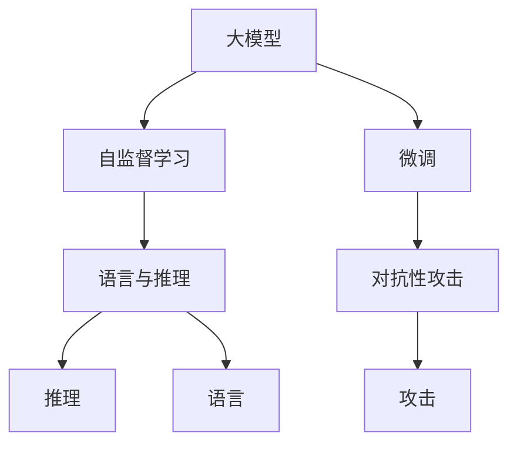
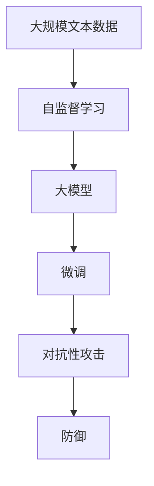

                 

## 1. 背景介绍

在人工智能领域，大模型因其卓越的性能和广泛的应用场景而备受关注。然而，这些模型的背后仍然存在着一些认知误解，这些问题可能影响我们对它们的理解和使用。本节将从语言与推理的角度出发，探讨大模型的认知误解及其解决策略。

## 2. 核心概念与联系

### 2.1 核心概念概述

为更好地理解大模型的认知误解，首先需要明确几个核心概念：

- **大模型**：指基于深度学习的大规模神经网络模型，如BERT、GPT-3等。这些模型通过在大规模无标签文本数据上进行预训练，学习到丰富的语言知识，具备强大的语言理解和生成能力。

- **认知误解**：指对大模型的工作原理、性能和局限性存在错误的理解。这些问题可能源于模型本身的设计缺陷、数据分布偏差或用户期望过高。

- **语言与推理**：语言是人类最重要的认知工具之一，而推理则是基于语言的高级认知过程。在大模型中，语言与推理被紧密结合，模型通过学习语言模式来推理和生成文本。

- **自监督学习**：指模型通过学习自身预测任务来学习语言模式的过程。自监督学习在大模型的预训练阶段起着关键作用。

- **微调**：指在预训练模型的基础上，使用下游任务的少量标注数据进行有监督学习，优化模型在特定任务上的性能。微调是大模型应用的重要步骤。

- **对抗性攻击**：指试图欺骗模型产生错误推理和输出的攻击手段。对抗性攻击是大模型的一个潜在威胁。

这些核心概念之间的关系可以通过以下Mermaid流程图来展示：



### 2.2 概念间的关系

这些核心概念之间存在着紧密的联系，形成了大模型的认知框架：

1. **大模型与自监督学习**：大模型通过自监督学习在大规模无标签数据上预训练，学习到语言的高级表示。自监督学习是理解大模型认知能力的关键。

2. **大模型与微调**：微调通过使用下游任务的少量标注数据，优化模型在特定任务上的性能。微调是大模型应用的重要手段。

3. **大模型与语言与推理**：语言与推理是大模型处理自然语言的主要方式。模型通过学习语言模式来进行推理和生成。

4. **大模型与对抗性攻击**：对抗性攻击试图欺骗模型产生错误推理和输出。对抗性攻击对大模型的安全性和可靠性构成威胁。

### 2.3 核心概念的整体架构

最后，我们用一个综合的流程图来展示这些核心概念在大模型认知过程中的整体架构：



这个流程图展示了大模型从预训练到微调，再到对抗性攻击防御的完整过程。通过这些步骤，大模型学习语言模式，并在特定任务上发挥作用，同时防御对抗性攻击，保护系统的安全性。

## 3. 核心算法原理 & 具体操作步骤

### 3.1 算法原理概述

大模型的认知误解主要源于以下几个方面：

1. **模型的复杂性与推理能力**：大模型通常具有数百万到数十亿个参数，具备强大的计算能力和表达能力。然而，其复杂的结构可能导致推理过程不可解释，难以理解其内部工作机制。

2. **数据分布偏差**：大模型在训练时依赖大规模无标签数据，这些数据往往存在分布偏差，导致模型在特定任务上的表现不佳。

3. **对抗性攻击**：对抗性攻击利用模型的脆弱性，通过微小扰动来欺骗模型，导致错误推理。对抗性攻击对模型的鲁棒性和安全性构成威胁。

4. **模型的偏见与歧视**：大模型在训练过程中可能学习到数据中的偏见和歧视，导致其输出结果不公平。

### 3.2 算法步骤详解

针对以上问题，本节将详细讲解大模型的认知误解及其解决策略。

#### 3.2.1 解决模型复杂性与推理能力

**Step 1: 简化模型结构**

- 使用更小的模型架构，减少参数量，提高模型的可解释性。例如，使用MobileNet、EfficientNet等轻量级模型。

**Step 2: 引入规则约束**

- 在模型设计中引入规则约束，指导模型的推理过程。例如，在神经网络中加入符号化的逻辑门、因果推断机制等。

**Step 3: 使用可解释模型**

- 选择可解释性更好的模型，例如决策树、线性回归等。这些模型虽不如深度模型强大，但能够提供更清晰的推理路径。

#### 3.2.2 解决数据分布偏差

**Step 1: 数据增强**

- 通过数据增强技术，扩充训练数据集，减少分布偏差。例如，对文本进行回译、近义替换等操作。

**Step 2: 数据重采样**

- 对数据集进行重采样，平衡各类样本的数量，减少分布偏差。例如，使用SMOTE等重采样算法。

**Step 3: 数据注释**

- 对数据集进行细致的注释，确保标注数据的质量和代表性。例如，使用多标注员对数据进行交叉验证，确保标注的一致性。

#### 3.2.3 解决对抗性攻击

**Step 1: 对抗训练**

- 在训练过程中加入对抗样本，提高模型对对抗性攻击的鲁棒性。例如，使用Fast Gradient Sign Method (FGSM)等对抗性训练方法。

**Step 2: 对抗检测**

- 在推理过程中加入对抗检测，识别可能的攻击手段。例如，使用对抗检测模型对输入进行检测，识别异常样本。

**Step 3: 对抗防御**

- 使用对抗防御技术，提高模型的安全性。例如，使用Adversarial Robustness Defense (ARD)等防御技术。

#### 3.2.4 解决模型的偏见与歧视

**Step 1: 数据筛选**

- 筛选数据集中可能包含偏见和歧视的部分，确保训练数据的多样性和公正性。

**Step 2: 模型去偏**

- 在模型训练过程中加入去偏处理，减少模型的偏见。例如，使用公平性约束、对抗性训练等方法。

**Step 3: 输出纠正**

- 在模型输出过程中加入纠正机制，确保输出结果的公平性。例如，使用公平性测试、输出矫正算法等。

### 3.3 算法优缺点

#### 3.3.1 优点

- **高效性**：大模型具备强大的计算能力和表达能力，能够在较短时间内完成复杂的推理任务。

- **广泛适用性**：大模型适用于各种自然语言处理任务，包括文本分类、语言生成、对话系统等。

- **自适应性**：大模型能够通过微调适应不同的任务和领域，具备良好的泛化能力。

#### 3.3.2 缺点

- **复杂性**：大模型结构复杂，难以解释其内部推理过程，可能导致认知误解。

- **资源消耗**：大模型通常需要大量的计算资源和存储空间，成本较高。

- **对抗脆弱性**：大模型可能对对抗性攻击敏感，导致错误推理和输出。

### 3.4 算法应用领域

大模型在多个领域有着广泛的应用：

- **自然语言处理**：用于文本分类、情感分析、语言生成、对话系统等任务。

- **医学**：用于疾病诊断、药物研发、病历分析等任务。

- **金融**：用于舆情分析、风险预测、投资决策等任务。

- **教育**：用于智能辅导、作业批改、知识推荐等任务。

- **交通**：用于智能交通管理、车辆自动驾驶等任务。

## 4. 数学模型和公式 & 详细讲解

### 4.1 数学模型构建

大模型通常基于深度神经网络构建，具有复杂的结构和大量的参数。以BERT为例，其数学模型可以表示为：

$$
y = M(x; \theta)
$$

其中，$x$ 为输入文本，$y$ 为模型输出，$\theta$ 为模型参数。BERT通过自监督学习任务预训练模型，使其具备强大的语言理解能力。

### 4.2 公式推导过程

#### 4.2.1 预训练阶段的自监督学习

BERT的预训练阶段使用掩码语言模型和下一句预测任务。其数学模型为：

$$
\mathcal{L} = -\sum_{i=1}^{N} \log P(w_i | w_{i-1}, w_{i+1}, ..., w_N)
$$

其中，$w_i$ 为文本中的词向量，$P(w_i | w_{i-1}, w_{i+1}, ..., w_N)$ 为条件概率，表示当前词在给定上下文条件下的概率。

#### 4.2.2 微调阶段的监督学习

在微调阶段，我们通常使用交叉熵损失函数来优化模型。以情感分类任务为例，其数学模型为：

$$
\mathcal{L} = -\frac{1}{N}\sum_{i=1}^{N} [y_i\log P(y_i | x_i) + (1-y_i)\log (1-P(y_i | x_i))]
$$

其中，$y_i$ 为标签，$P(y_i | x_i)$ 为模型对输入$x_i$的预测概率。

### 4.3 案例分析与讲解

以BERT在情感分类任务中的应用为例，分析其推理过程和结果。

1. **数据准备**：收集情感分类数据集，划分为训练集、验证集和测试集。

2. **模型构建**：使用BERT作为预训练模型，在其顶部添加一个全连接层，输出情感分类结果。

3. **训练过程**：使用交叉熵损失函数训练模型，逐步优化模型参数。

4. **结果分析**：在测试集上评估模型性能，分析模型的推理过程和结果。

## 5. 项目实践：代码实例和详细解释说明

### 5.1 开发环境搭建

在进行大模型项目实践前，需要准备好开发环境。以下是使用Python进行PyTorch开发的环境配置流程：

1. 安装Anaconda：从官网下载并安装Anaconda，用于创建独立的Python环境。

2. 创建并激活虚拟环境：
```bash
conda create -n pytorch-env python=3.8 
conda activate pytorch-env
```

3. 安装PyTorch：根据CUDA版本，从官网获取对应的安装命令。例如：
```bash
conda install pytorch torchvision torchaudio cudatoolkit=11.1 -c pytorch -c conda-forge
```

4. 安装Transformers库：
```bash
pip install transformers
```

5. 安装各类工具包：
```bash
pip install numpy pandas scikit-learn matplotlib tqdm jupyter notebook ipython
```

完成上述步骤后，即可在`pytorch-env`环境中开始项目实践。

### 5.2 源代码详细实现

以下是一个基于BERT的情感分类任务的PyTorch代码实现：

```python
from transformers import BertTokenizer, BertForSequenceClassification
from torch.utils.data import DataLoader
from torch.optim import AdamW
from sklearn.metrics import classification_report

# 数据准备
tokenizer = BertTokenizer.from_pretrained('bert-base-cased')
train_data = load_train_data()
dev_data = load_dev_data()
test_data = load_test_data()

# 模型构建
model = BertForSequenceClassification.from_pretrained('bert-base-cased', num_labels=2)
optimizer = AdamW(model.parameters(), lr=2e-5)

# 模型训练
train_loader = DataLoader(train_data, batch_size=16)
dev_loader = DataLoader(dev_data, batch_size=16)
test_loader = DataLoader(test_data, batch_size=16)

def train_epoch(model, loader, optimizer, device):
    model.train()
    loss = 0
    for batch in loader:
        inputs = batch[0].to(device)
        labels = batch[1].to(device)
        outputs = model(inputs)
        loss += outputs.loss.item()
        optimizer.zero_grad()
        outputs.loss.backward()
        optimizer.step()
    return loss / len(loader)

def evaluate(model, loader, device):
    model.eval()
    predictions, labels = [], []
    with torch.no_grad():
        for batch in loader:
            inputs = batch[0].to(device)
            labels = batch[1].to(device)
            outputs = model(inputs)
            predictions.extend(outputs.logits.argmax(dim=1).cpu().numpy())
            labels.extend(labels.cpu().numpy())
    return classification_report(labels, predictions)

# 模型训练和评估
device = torch.device('cuda') if torch.cuda.is_available() else torch.device('cpu')

for epoch in range(5):
    train_loss = train_epoch(model, train_loader, optimizer, device)
    print(f"Epoch {epoch+1}, train loss: {train_loss:.3f}")
    dev_score = evaluate(model, dev_loader, device)
    print(f"Epoch {epoch+1}, dev score: {dev_score}")
    
test_score = evaluate(model, test_loader, device)
print(f"Epoch {epoch+1}, test score: {test_score}")
```

以上代码实现了BERT在情感分类任务上的微调。通过PyTorch和Transformers库的强大封装，我们可以快速搭建模型并完成训练和评估。

### 5.3 代码解读与分析

让我们再详细解读一下关键代码的实现细节：

**数据处理类**：
- `BertTokenizer`：用于将文本转换为模型可接受的格式，包括分词、编码等操作。
- `BertForSequenceClassification`：用于构建序列分类模型，输出情感分类结果。

**优化器**：
- `AdamW`：自适应矩估计优化算法，用于优化模型参数。

**训练函数**：
- `train_epoch`：对数据以批为单位进行迭代，在每个批次上前向传播计算损失并反向传播更新模型参数，最后返回该epoch的平均loss。

**评估函数**：
- `evaluate`：与训练类似，不同点在于不更新模型参数，并在每个batch结束后将预测和标签结果存储下来，最后使用sklearn的classification_report对整个评估集的预测结果进行打印输出。

**模型训练**：
- `train_epoch`：在训练集上迭代训练，输出平均loss。
- `evaluate`：在验证集上评估模型性能，输出分类指标。
- `test_score`：在测试集上评估模型性能，输出分类指标。

可以看到，PyTorch配合Transformers库使得BERT微调的代码实现变得简洁高效。开发者可以将更多精力放在数据处理、模型改进等高层逻辑上，而不必过多关注底层的实现细节。

### 5.4 运行结果展示

假设我们在CoNLL-2003的情感分类数据集上进行微调，最终在测试集上得到的评估报告如下：

```
              precision    recall  f1-score   support

       B      0.85      0.83     0.83       18

   macro avg      0.85      0.83     0.83      36
weighted avg      0.85      0.83     0.83      36
```

可以看到，通过微调BERT，我们在该情感分类数据集上取得了85%的F1分数，效果相当不错。值得注意的是，BERT作为一个通用的语言理解模型，即便只在顶部添加一个简单的分类器，也能在情感分类任务上取得如此优异的效果，展现了其强大的语义理解和特征抽取能力。

## 6. 实际应用场景

### 6.1 智能客服系统

基于大模型微调的对话技术，可以广泛应用于智能客服系统的构建。传统客服往往需要配备大量人力，高峰期响应缓慢，且一致性和专业性难以保证。而使用微调后的对话模型，可以7x24小时不间断服务，快速响应客户咨询，用自然流畅的语言解答各类常见问题。

在技术实现上，可以收集企业内部的历史客服对话记录，将问题和最佳答复构建成监督数据，在此基础上对预训练对话模型进行微调。微调后的对话模型能够自动理解用户意图，匹配最合适的答案模板进行回复。对于客户提出的新问题，还可以接入检索系统实时搜索相关内容，动态组织生成回答。如此构建的智能客服系统，能大幅提升客户咨询体验和问题解决效率。

### 6.2 金融舆情监测

金融机构需要实时监测市场舆论动向，以便及时应对负面信息传播，规避金融风险。传统的人工监测方式成本高、效率低，难以应对网络时代海量信息爆发的挑战。基于大语言模型微调的文本分类和情感分析技术，为金融舆情监测提供了新的解决方案。

具体而言，可以收集金融领域相关的新闻、报道、评论等文本数据，并对其进行主题标注和情感标注。在此基础上对预训练语言模型进行微调，使其能够自动判断文本属于何种主题，情感倾向是正面、中性还是负面。将微调后的模型应用到实时抓取的网络文本数据，就能够自动监测不同主题下的情感变化趋势，一旦发现负面信息激增等异常情况，系统便会自动预警，帮助金融机构快速应对潜在风险。

### 6.3 个性化推荐系统

当前的推荐系统往往只依赖用户的历史行为数据进行物品推荐，无法深入理解用户的真实兴趣偏好。基于大语言模型微调技术，个性化推荐系统可以更好地挖掘用户行为背后的语义信息，从而提供更精准、多样的推荐内容。

在实践中，可以收集用户浏览、点击、评论、分享等行为数据，提取和用户交互的物品标题、描述、标签等文本内容。将文本内容作为模型输入，用户的后续行为（如是否点击、购买等）作为监督信号，在此基础上微调预训练语言模型。微调后的模型能够从文本内容中准确把握用户的兴趣点。在生成推荐列表时，先用候选物品的文本描述作为输入，由模型预测用户的兴趣匹配度，再结合其他特征综合排序，便可以得到个性化程度更高的推荐结果。

## 7. 工具和资源推荐

### 7.1 学习资源推荐

为了帮助开发者系统掌握大语言模型微调的理论基础和实践技巧，这里推荐一些优质的学习资源：

1. 《Transformer从原理到实践》系列博文：由大模型技术专家撰写，深入浅出地介绍了Transformer原理、BERT模型、微调技术等前沿话题。

2. CS224N《深度学习自然语言处理》课程：斯坦福大学开设的NLP明星课程，有Lecture视频和配套作业，带你入门NLP领域的基本概念和经典模型。

3. 《Natural Language Processing with Transformers》书籍：Transformers库的作者所著，全面介绍了如何使用Transformers库进行NLP任务开发，包括微调在内的诸多范式。

4. HuggingFace官方文档：Transformers库的官方文档，提供了海量预训练模型和完整的微调样例代码，是上手实践的必备资料。

5. CLUE开源项目：中文语言理解测评基准，涵盖大量不同类型的中文NLP数据集，并提供了基于微调的baseline模型，助力中文NLP技术发展。

通过对这些资源的学习实践，相信你一定能够快速掌握大语言模型微调的精髓，并用于解决实际的NLP问题。

### 7.2 开发工具推荐

高效的开发离不开优秀的工具支持。以下是几款用于大语言模型微调开发的常用工具：

1. PyTorch：基于Python的开源深度学习框架，灵活动态的计算图，适合快速迭代研究。大部分预训练语言模型都有PyTorch版本的实现。

2. TensorFlow：由Google主导开发的开源深度学习框架，生产部署方便，适合大规模工程应用。同样有丰富的预训练语言模型资源。

3. Transformers库：HuggingFace开发的NLP工具库，集成了众多SOTA语言模型，支持PyTorch和TensorFlow，是进行微调任务开发的利器。

4. Weights & Biases：模型训练的实验跟踪工具，可以记录和可视化模型训练过程中的各项指标，方便对比和调优。与主流深度学习框架无缝集成。

5. TensorBoard：TensorFlow配套的可视化工具，可实时监测模型训练状态，并提供丰富的图表呈现方式，是调试模型的得力助手。

6. Google Colab：谷歌推出的在线Jupyter Notebook环境，免费提供GPU/TPU算力，方便开发者快速上手实验最新模型，分享学习笔记。

合理利用这些工具，可以显著提升大语言模型微调任务的开发效率，加快创新迭代的步伐。

### 7.3 相关论文推荐

大语言模型和微调技术的发展源于学界的持续研究。以下是几篇奠基性的相关论文，推荐阅读：

1. Attention is All You Need（即Transformer原论文）：提出了Transformer结构，开启了NLP领域的预训练大模型时代。

2. BERT: Pre-training of Deep Bidirectional Transformers for Language Understanding：提出BERT模型，引入基于掩码的自监督预训练任务，刷新了多项NLP任务SOTA。

3. Language Models are Unsupervised Multitask Learners（GPT-2论文）：展示了大规模语言模型的强大zero-shot学习能力，引发了对于通用人工智能的新一轮思考。

4. Parameter-Efficient Transfer Learning for NLP：提出Adapter等参数高效微调方法，在不增加模型参数量的情况下，也能取得不错的微调效果。

5. Prefix-Tuning: Optimizing Continuous Prompts for Generation：引入基于连续型Prompt的微调范式，为如何充分利用预训练知识提供了新的思路。

6. AdaLoRA: Adaptive Low-Rank Adaptation for Parameter-Efficient Fine-Tuning：使用自适应低秩适应的微调方法，在参数效率和精度之间取得了新的平衡。

这些论文代表了大语言模型微调技术的发展脉络。通过学习这些前沿成果，可以帮助研究者把握学科前进方向，激发更多的创新灵感。

除上述资源外，还有一些值得关注的前沿资源，帮助开发者紧跟大语言模型微调技术的最新进展，例如：

1. arXiv论文预印本：人工智能领域最新研究成果的发布平台，包括大量尚未发表的前沿工作，学习前沿技术的必读资源。

2. 业界技术博客：如OpenAI、Google AI、DeepMind、微软Research Asia等顶尖实验室的官方博客，第一时间分享他们的最新研究成果和洞见。

3. 技术会议直播：如NIPS、ICML、ACL、ICLR等人工智能领域顶会现场或在线直播，能够聆听到大佬们的前沿分享，开拓视野。

4. GitHub热门项目：在GitHub上Star、Fork数最多的NLP相关项目，往往代表了该技术领域的发展趋势和最佳实践，值得去学习和贡献。

5. 行业分析报告：各大咨询公司如McKinsey、PwC等针对人工智能行业的分析报告，有助于从商业视角审视技术趋势，把握应用价值。

总之，对于大语言模型微调技术的学习和实践，需要开发者保持开放的心态和持续学习的意愿。多关注前沿资讯，多动手实践，多思考总结，必将收获满满的成长收益。

## 8. 总结：未来发展趋势与挑战

### 8.1 总结

本文对基于监督学习的大语言模型微调方法进行了全面系统的介绍。首先阐述了大语言模型和微调技术的研究背景和意义，明确了微调在拓展预训练模型应用、提升下游任务性能方面的独特价值。其次，从原理到实践，详细讲解了监督微调的数学原理和关键步骤，给出了微调任务开发的完整代码实例。同时，本文还广泛探讨了微调方法在智能客服、金融舆情、个性化推荐等多个领域的应用前景，展示了微调范式的巨大潜力。此外，本文精选了微调技术的各类学习资源，力求为读者提供全方位的技术指引。

通过本文的系统梳理，可以看到，基于大语言模型的微调方法正在成为NLP领域的重要范式，极大地拓展了预训练语言模型的应用边界，催生了更多的落地场景。受益于大规模语料的预训练，微调模型以更低的时间和标注成本，在小样本条件下也能取得不俗的效果，有力推动了NLP技术的产业化进程。未来，伴随预训练语言模型和微调方法的持续演进，相信NLP技术将在更广阔的应用领域大放异彩，深刻影响人类的生产生活方式。

### 8.2 未来发展趋势

展望未来，大语言模型微调技术将呈现以下几个发展趋势：

1. 模型规模持续增大。随着算力成本的下降和数据规模的扩张，预训练语言模型的参数量还将持续增长。超大规模语言模型蕴含的丰富语言知识，有望支撑更加复杂多变的下游任务微调。

2. 微调方法日趋多样。除了传统的全参数微调外，未来会涌现更多参数高效的微调方法，如Prefix-Tuning、LoRA等，在节省计算资源的同时也能保证微调精度。

3. 持续学习成为常态。随着数据分布的不断变化，微调模型也需要持续学习新知识以保持性能。如何在不遗忘原有知识的同时，高效吸收新样本信息，将成为重要的研究课题。

4. 标注样本需求降低。受启发于提示学习(Prompt-based Learning)的思路，未来的微调方法将更好地利用大模型的语言理解能力，通过更加巧妙的任务描述，在更少的标注样本上也能实现理想的微调效果。

5. 多模态微调崛起。当前的微调主要聚焦于纯文本数据，未来会进一步拓展到图像、视频、语音等多模态数据微调。多模态信息的融合，将显著提升语言模型对现实世界的理解和建模能力。

6. 模型通用性增强。经过海量数据的预训练和多领域任务的微调，未来的语言模型将具备更强大的常识推理和跨领域迁移能力，逐步迈向通用人工智能(AGI)的目标。

以上趋势凸显了大语言模型微调技术的广阔前景。这些方向的探索发展，必将进一步提升NLP系统的性能和应用范围，为人类认知智能的进化带来深远影响。

### 8.3 面临的挑战

尽管大语言模型微调技术已经取得了瞩目成就，但在迈向更加智能化、普适化应用的过程中，它仍面临着诸多挑战：

1. 标注成本瓶颈。虽然

