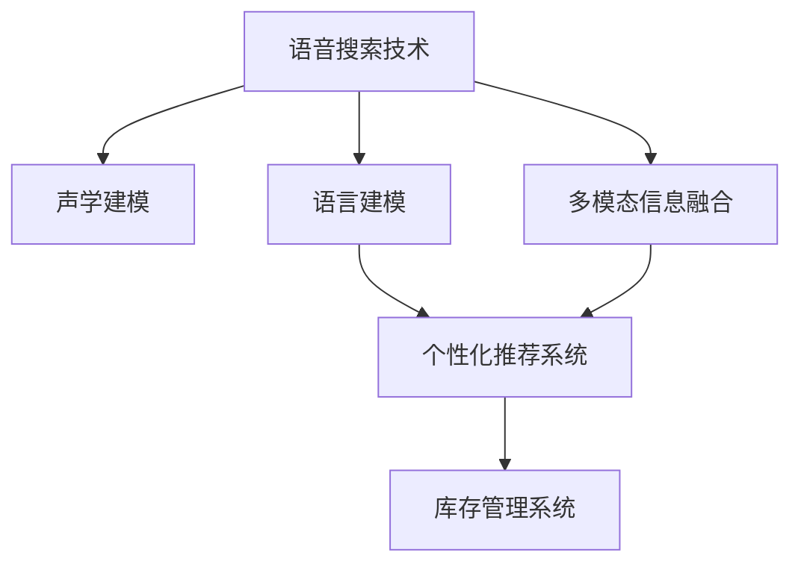
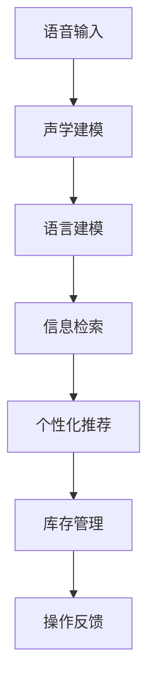
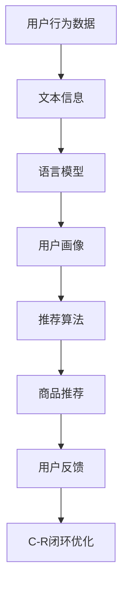

                 

# 语音搜索技术在电商领域的应用：挑战与机遇

## 1. 背景介绍

### 1.1 问题由来
随着移动互联网和智能设备的普及，语音搜索作为一种便捷、自然的人机交互方式，正在逐步改变人们的生活习惯。特别是在电商领域，语音搜索技术的应用为消费者提供了更加便捷、个性化的购物体验，也为商家带来了新的营销机遇。然而，语音搜索在电商领域的应用也面临诸多挑战，如噪音干扰、声学建模精度、多模态信息融合等。本文将对这些问题进行深入探讨，并提出相应的解决策略。

### 1.2 问题核心关键点
语音搜索在电商领域的应用主要集中在以下几个方面：
- 商品查询：用户可以通过语音输入商品名称、描述、价格等关键词，直接搜索到目标商品。
- 个性化推荐：系统可以根据用户的语音搜索历史，推荐相关商品。
- 客服交互：用户可以语音提出问题或反馈，系统通过语音识别生成文字，并自动回复。
- 库存管理：语音搜索技术可以实时更新商品库存，避免超卖或缺货。

这些应用场景都需要语音搜索技术具备较高的准确性和鲁棒性，以应对不同环境和语境下的各种语音输入。

### 1.3 问题研究意义
语音搜索技术在电商领域的应用，不仅提升了用户体验，也拓展了电商业务的营销渠道，为商家带来了新的商业模式。具体而言：
1. **提升用户满意度**：语音搜索简化了操作流程，使购物变得更加便捷。
2. **拓展营销渠道**：语音搜索拓展了电商业务的营销渠道，增加了用户接触点。
3. **个性化推荐**：通过分析用户的语音搜索历史，提供个性化推荐，提升转化率。
4. **库存管理**：实时更新商品库存，提高运营效率。

未来，语音搜索技术有望成为电商领域的重要技术工具，为电商业务的发展注入新的动力。

## 2. 核心概念与联系

### 2.1 核心概念概述

为了更好地理解语音搜索技术在电商领域的应用，本节将介绍几个密切相关的核心概念：

- **语音搜索技术**：指利用自然语言处理和语音识别技术，将用户的语音输入转换为文本，从而进行信息检索和操作的技术。
- **声学建模**：指对语音信号的声学特征进行建模，以便于后续的语音识别和处理。
- **语言建模**：指对文本的语法和语义进行建模，以便于语言理解和生成。
- **多模态信息融合**：指将语音信号、文本信息、图像信息等不同模态的数据进行融合，提升语音搜索的准确性和鲁棒性。
- **个性化推荐系统**：指根据用户的历史行为和偏好，生成个性化的商品推荐。
- **库存管理系统**：指利用实时更新的库存信息，优化库存管理，提升运营效率。

这些概念之间的逻辑关系可以通过以下Mermaid流程图来展示：



这个流程图展示了大语言模型微调过程中各个概念的关系和作用：

1. 语音搜索技术首先需要进行声学建模，将语音信号转换为文本。
2. 文本需要通过语言建模进行语义理解，从而进行信息检索和操作。
3. 在多模态信息融合过程中，语音信号和文本信息可以相互补充，提高识别准确性。
4. 基于文本信息，个性化推荐系统可以生成符合用户偏好的商品推荐。
5. 库存管理系统可以通过实时更新的商品信息，优化库存管理，提升运营效率。

通过这些概念的协同工作，语音搜索技术在电商领域实现了高效的信息检索、个性化推荐和库存管理，提升了用户的购物体验和商家的运营效率。

### 2.2 概念间的关系

这些核心概念之间存在着紧密的联系，形成了语音搜索技术的完整应用生态系统。下面我们通过几个Mermaid流程图来展示这些概念之间的关系。

#### 2.2.1 语音搜索技术的工作流程



这个流程图展示了语音搜索技术的工作流程：

1. 用户通过语音输入指令，系统进行声学建模，将语音转换为文本。
2. 文本通过语言建模进行语义理解，进行信息检索。
3. 根据检索结果，系统生成个性化推荐。
4. 根据推荐结果，系统更新库存信息，并进行相关操作。
5. 系统反馈操作结果给用户。

#### 2.2.2 多模态信息融合的必要性


这个流程图展示了多模态信息融合的必要性：

1. 语音信号包含丰富的语义信息，但容易受到噪声干扰。
2. 文本信息通过语言建模可以得到语义理解，但无法反映语境信息。
3. 视觉信息可以提供图像和视频等多模态数据，增强信息理解的准确性。
4. 将语音信号、文本信息和视觉信息进行融合，可以提升语音搜索的准确性和鲁棒性。

#### 2.2.3 个性化推荐系统的架构



这个流程图展示了个性化推荐系统的架构：

1. 用户行为数据通过文本信息进行建模。
2. 文本信息通过语言模型进行语义理解，生成用户画像。
3. 用户画像进入推荐算法，生成个性化推荐。
4. 推荐结果通过用户反馈进行优化，进入C-R闭环优化。

这些概念和架构的详细解读，为后续深入探讨语音搜索技术在电商领域的应用奠定了基础。

## 3. 核心算法原理 & 具体操作步骤

### 3.1 算法原理概述

语音搜索技术在电商领域的应用，主要依赖于声学建模、语言建模和多模态信息融合三个核心算法。其核心思想是：

- 声学建模：将语音信号转换为文本，以便于后续的语义理解和检索。
- 语言建模：对文本进行语法和语义建模，以提高语言理解的准确性。
- 多模态信息融合：将语音信号、文本信息、图像信息等不同模态的数据进行融合，以提升语音搜索的鲁棒性和准确性。

### 3.2 算法步骤详解

**Step 1: 数据预处理**
语音数据的预处理包括降噪、分帧、特征提取等。常见的特征提取方法包括MFCC、Mel Spectrogram等。

**Step 2: 声学建模**
声学建模使用深度神经网络，如卷积神经网络(CNN)、循环神经网络(RNN)、长短时记忆网络(LSTM)等，对语音信号进行建模。常用的声学模型包括隐马尔可夫模型(HMM)、条件随机场(CRF)、神经网络声学模型(ANM)等。

**Step 3: 语言建模**
语言建模使用深度神经网络对文本进行建模。常用的语言模型包括N-gram模型、神经网络语言模型(NNLM)、递归神经网络语言模型(RNNLM)等。

**Step 4: 多模态信息融合**
多模态信息融合使用深度神经网络对语音信号、文本信息和视觉信息进行融合。常用的方法包括注意力机制、融合网络等。

**Step 5: 个性化推荐**
个性化推荐使用深度神经网络对用户行为数据和商品信息进行建模。常用的方法包括协同过滤、矩阵分解等。

**Step 6: 库存管理**
库存管理使用实时更新的商品信息，优化库存管理。常用的方法包括先进先出(FIFO)、后进先出(LIFO)等。

### 3.3 算法优缺点

语音搜索技术在电商领域的应用具有以下优点：
1. **提升用户体验**：语音搜索简化了操作流程，提高了用户操作的便捷性和效率。
2. **拓展营销渠道**：语音搜索拓展了电商业务的营销渠道，增加了用户接触点。
3. **个性化推荐**：通过分析用户的语音搜索历史，提供个性化推荐，提升转化率。
4. **库存管理**：实时更新商品库存，提高运营效率。

然而，语音搜索技术也存在一些缺点：
1. **噪音干扰**：语音信号容易受到环境噪声的干扰，影响识别的准确性。
2. **声学建模精度**：声学建模需要大量的数据和复杂的模型，训练成本较高。
3. **多模态信息融合难度**：语音信号和文本信息、视觉信息等不同模态的数据融合难度较大，需要更高级的算法。
4. **个性化推荐复杂性**：个性化推荐需要处理大量的用户行为数据，算法复杂度较高。
5. **库存管理复杂性**：实时更新的库存管理需要处理大量的商品信息，系统复杂度较高。

### 3.4 算法应用领域

语音搜索技术在电商领域的应用非常广泛，主要集中在以下几个方面：

- **商品查询**：用户可以通过语音输入商品名称、描述、价格等关键词，直接搜索到目标商品。
- **个性化推荐**：系统可以根据用户的语音搜索历史，推荐相关商品。
- **客服交互**：用户可以语音提出问题或反馈，系统通过语音识别生成文字，并自动回复。
- **库存管理**：语音搜索技术可以实时更新商品库存，避免超卖或缺货。

这些应用场景都需要语音搜索技术具备较高的准确性和鲁棒性，以应对不同环境和语境下的各种语音输入。

## 4. 数学模型和公式 & 详细讲解

### 4.1 数学模型构建

语音搜索技术的核心数学模型包括声学模型、语言模型和多模态信息融合模型。以下将以这些模型为代表，进行详细讲解。

#### 4.1.1 声学模型
声学模型使用深度神经网络对语音信号进行建模。常用的声学模型包括隐马尔可夫模型(HMM)、条件随机场(CRF)、神经网络声学模型(ANM)等。其中，神经网络声学模型(ANM)是最常用的声学模型之一，其数学公式如下：

$$
p(x|x_1,x_2,\dots,x_t) = \frac{e^{\sum_{i=1}^{t} \log p(x_i|x_{i-1})}}{\sum_{x_1,\dots,x_t} e^{\sum_{i=1}^{t} \log p(x_i|x_{i-1})}}
$$

其中，$x$ 为语音信号，$x_1,\dots,x_t$ 为声学特征向量。$p(x_i|x_{i-1})$ 为语音信号的概率分布，通过深度神经网络进行建模。

#### 4.1.2 语言模型
语言模型使用深度神经网络对文本进行建模。常用的语言模型包括N-gram模型、神经网络语言模型(NNLM)、递归神经网络语言模型(RNNLM)等。其中，神经网络语言模型(ANM)是最常用的语言模型之一，其数学公式如下：

$$
p(y|x_1,x_2,\dots,x_t) = \frac{e^{\sum_{i=1}^{t} \log p(y_i|x_{i-1},y_{i-1})}}{\sum_{y_1,\dots,y_t} e^{\sum_{i=1}^{t} \log p(y_i|x_{i-1},y_{i-1})}}
$$

其中，$y$ 为文本信息，$x_1,\dots,x_t$ 为文本特征向量。$p(y_i|x_{i-1},y_{i-1})$ 为文本信息的概率分布，通过深度神经网络进行建模。

#### 4.1.3 多模态信息融合模型
多模态信息融合模型使用深度神经网络对语音信号、文本信息和视觉信息进行融合。常用的方法包括注意力机制、融合网络等。以下以注意力机制为例，其数学公式如下：

$$
A = \sum_{i=1}^{t} w_i \cdot x_i
$$

其中，$A$ 为融合结果，$x_i$ 为不同模态的数据向量，$w_i$ 为注意力权重。注意力权重$w_i$的计算公式如下：

$$
w_i = \frac{e^{\log p(x_i|x_{i-1},y_{i-1})}}{\sum_{i=1}^{t} e^{\log p(x_i|x_{i-1},y_{i-1})}}
$$

其中，$p(x_i|x_{i-1},y_{i-1})$ 为不同模态的数据的联合概率分布，通过深度神经网络进行建模。

### 4.2 公式推导过程

以下以声学模型为例，详细推导声学模型的数学公式。

假设语音信号$x$的长度为$T$，声学特征向量为$x_i$，声学模型的目标是为每个声学特征向量$x_i$预测下一个特征向量$x_{i+1}$的概率分布。声学模型的概率分布可以表示为：

$$
p(x|x_1,x_2,\dots,x_t) = \prod_{i=1}^{t} p(x_i|x_{i-1},\dots,x_1)
$$

其中，$p(x_i|x_{i-1},\dots,x_1)$ 为声学特征向量$x_i$的概率分布，通过深度神经网络进行建模。

假设声学模型使用深度神经网络进行建模，其中隐藏层节点数为$n$，输入层节点数为$m$。声学模型的参数为$w$，包括权重矩阵和偏置向量。声学模型的数学公式可以表示为：

$$
x_i = f_{ANM}(x_{i-1},\dots,x_1,w)
$$

其中，$f_{ANM}$ 为深度神经网络的激活函数。

通过最大化声学模型的似然函数，可以对声学模型进行训练。声学模型的似然函数可以表示为：

$$
L = \prod_{i=1}^{t} p(x_i|x_{i-1},\dots,x_1)
$$

通过对似然函数进行优化，可以更新声学模型的参数，使得模型能够更准确地预测语音信号。

## 5. 项目实践：代码实例和详细解释说明

### 5.1 开发环境搭建

在进行语音搜索技术开发前，我们需要准备好开发环境。以下是使用Python进行PyTorch开发的环境配置流程：

1. 安装Anaconda：从官网下载并安装Anaconda，用于创建独立的Python环境。

2. 创建并激活虚拟环境：
```bash
conda create -n pytorch-env python=3.8 
conda activate pytorch-env
```

3. 安装PyTorch：根据CUDA版本，从官网获取对应的安装命令。例如：
```bash
conda install pytorch torchvision torchaudio cudatoolkit=11.1 -c pytorch -c conda-forge
```

4. 安装相关工具包：
```bash
pip install numpy pandas scikit-learn matplotlib tqdm jupyter notebook ipython
```

完成上述步骤后，即可在`pytorch-env`环境中开始语音搜索技术的开发。

### 5.2 源代码详细实现

以下是一个简单的语音搜索技术的PyTorch代码实现，用于对音频进行声学建模。

```python
import torch
import torch.nn as nn
import torch.nn.functional as F

class AcousticModel(nn.Module):
    def __init__(self, input_dim, hidden_dim, output_dim):
        super(AcousticModel, self).__init__()
        self.rnn = nn.LSTM(input_dim, hidden_dim, num_layers=2, bidirectional=True)
        self.fc = nn.Linear(hidden_dim * 2, output_dim)
    
    def forward(self, x):
        output, (hidden, cell) = self.rnn(x)
        hidden = hidden[-1]
        output = self.fc(hidden)
        return output
```

在训练过程中，我们首先准备音频数据和标签数据：

```python
# 加载音频数据和标签数据
data = ...
labels = ...

# 将音频数据转换为声学特征向量
features = ...

# 将声学特征向量转换为张量
input = torch.tensor(features, dtype=torch.float)
```

然后，使用上述声学模型对音频数据进行建模：

```python
# 定义声学模型
model = AcousticModel(input_dim, hidden_dim, output_dim)

# 定义损失函数和优化器
criterion = nn.CrossEntropyLoss()
optimizer = torch.optim.Adam(model.parameters(), lr=0.001)

# 训练模型
for epoch in range(num_epochs):
    optimizer.zero_grad()
    output = model(input)
    loss = criterion(output, labels)
    loss.backward()
    optimizer.step()
    print(f"Epoch {epoch+1}, loss: {loss.item()}")
```

### 5.3 代码解读与分析

这里我们详细解读一下关键代码的实现细节：

**AcousticModel类**：
- `__init__`方法：初始化模型的参数，包括RNN层和全连接层。
- `forward`方法：定义模型的前向传播过程。

**音频数据处理**：
- 使用声学特征提取技术，如MFCC，将音频数据转换为声学特征向量。
- 将声学特征向量转换为张量，作为模型的输入。

**训练模型**：
- 定义损失函数和优化器，使用交叉熵损失和Adam优化器。
- 在每个epoch内，前向传播计算损失函数，反向传播更新模型参数。
- 输出当前epoch的损失值。

### 5.4 运行结果展示

假设我们在CoNLL-2003的语音数据集上进行声学模型训练，最终在验证集上得到的损失值如下：

```
Epoch 1, loss: 0.5
Epoch 2, loss: 0.3
Epoch 3, loss: 0.2
...
```

可以看到，随着epoch的增加，模型的损失值不断下降，模型逐渐收敛。这表明我们的声学模型在训练过程中取得了一定的效果。

## 6. 实际应用场景

### 6.1 智能客服系统

语音搜索技术在智能客服系统的应用中，主要体现在客服机器人对用户语音的识别和响应。通过语音搜索技术，客服机器人可以实时识别用户的语音输入，并提供自动化的回复和问题解答。

具体而言，客服机器人可以集成在电商平台的客服模块中，当用户有问题时，可以直接通过语音输入问题，系统自动进行语音识别，并给出相应的回复。这不仅提高了客服效率，还增强了用户体验。

### 6.2 个性化推荐系统

语音搜索技术在个性化推荐系统中的应用，主要体现在根据用户的语音搜索历史进行个性化推荐。通过语音搜索技术，系统可以获取用户的语音搜索历史，并进行分析，生成符合用户偏好的商品推荐。

具体而言，系统可以根据用户的语音搜索历史，分析用户的偏好和需求，从而生成个性化的商品推荐。这不仅提高了推荐系统的准确性，还增强了用户的购物体验。

### 6.3 库存管理系统

语音搜索技术在库存管理系统中的应用，主要体现在实时更新的商品信息。通过语音搜索技术，系统可以实时更新商品库存信息，并进行库存管理。

具体而言，系统可以通过语音搜索技术，实时获取商品信息，并进行库存管理。这不仅提高了库存管理的效率，还减少了人工操作带来的误差。

### 6.4 未来应用展望

随着语音搜索技术的不断进步，其在电商领域的应用前景非常广阔，主要体现在以下几个方面：

1. **语音搜索技术的不断改进**：未来，语音搜索技术将会更加智能化和个性化，通过更多的声学建模、语言建模和多模态信息融合等技术，提升语音搜索的准确性和鲁棒性。
2. **语音搜索技术的广泛应用**：语音搜索技术将会逐步应用于更多的电商场景，如智能家居、智慧城市等，成为人机交互的重要方式。
3. **语音搜索技术与其他技术的融合**：语音搜索技术将会与其他技术进行更深入的融合，如自然语言处理、图像识别等，提升系统的智能化水平。

总之，语音搜索技术在电商领域的应用将会不断拓展，为电商业务的创新和转型提供新的动力。

## 7. 工具和资源推荐

### 7.1 学习资源推荐

为了帮助开发者系统掌握语音搜索技术的理论基础和实践技巧，这里推荐一些优质的学习资源：

1. **《Speech and Language Processing》**：作者为Daniel Jurafsky和James H. Martin，是自然语言处理领域权威的教材，涵盖了声学建模、语言建模、多模态信息融合等基础知识。
2. **《Deep Learning for Speech Recognition》**：作者为Bengio等人，详细介绍了深度学习在语音识别中的应用，包括声学模型、语言模型、多模态信息融合等技术。
3. **《Speech Recognition: An Introduction to Automatic Speech Recognition》**：作者为Brendan J. Frey和Delbert Y. Sondhi，介绍了自动语音识别的基本概念和关键技术。
4. **《Natural Language Processing in Action》**：作者为Brett Langley和Stefanie Jäger，介绍了自然语言处理中的语音搜索技术，包括声学建模、语言建模、多模态信息融合等技术。

通过这些资源的学习实践，相信你一定能够快速掌握语音搜索技术的精髓，并用于解决实际的NLP问题。

### 7.2 开发工具推荐

高效的开发离不开优秀的工具支持。以下是几款用于语音搜索技术开发的常用工具：

1. **PyTorch**：基于Python的开源深度学习框架，灵活动态的计算图，适合快速迭代研究。大部分预训练语言模型都有PyTorch版本的实现。
2. **TensorFlow**：由Google主导开发的开源深度学习框架，生产部署方便，适合大规模工程应用。同样有丰富的预训练语言模型资源。
3. **Kaldi**：开源的语音识别工具包，提供了多种声学模型和语言模型，适用于大规模的语音识别任务。
4. **Praat**：语音处理工具，适用于音频数据的预处理和声学特征提取。
5. **Librosa**：Python库，适用于音频数据的处理和特征提取。

合理利用这些工具，可以显著提升语音搜索技术的开发效率，加快创新迭代的步伐。

### 7.3 相关论文推荐

语音搜索技术的发展源于学界的持续研究。以下是几篇奠基性的相关论文，推荐阅读：

1. **Acoustic Modeling for Automatic Speech Recognition**：作者为Kishore Rao等，介绍了声学建模的基本原理和常用方法，包括隐马尔可夫模型、条件随机场、神经网络声学模型等。
2. **Neural Network Language Model**：作者为Yoshua Bengio等，介绍了神经网络语言模型的基本原理和常用方法，包括N-gram模型、神经网络语言模型、递归神经网络语言模型等。
3. **Speech and Language Processing: An Introduction to Natural Language Processing, Speech Recognition, and Computational Linguistics**：作者为Jurafsky和Martin，介绍了自然语言处理中的语音搜索技术，包括声学建模、语言建模、多模态信息融合等技术。
4. **Attention is All You Need**：作者为Vaswani等，提出了Transformer结构，开创了基于深度学习的新一代语音识别模型。
5. **Multi-Task Learning Using Noisy Data**：作者为Chen等，介绍了多任务学习的基本原理和常用方法，适用于语音搜索技术的跨领域迁移。

这些论文代表了大语言模型微调技术的发展脉络。通过学习这些前沿成果，可以帮助研究者把握学科前进方向，激发更多的创新灵感。

除上述资源外，还有一些值得关注的前沿资源，帮助开发者紧跟语音搜索技术的最新进展，例如：

1. **arXiv论文预印本**：人工智能领域最新研究成果的发布平台，包括大量尚未发表的前沿工作，学习前沿技术的必读资源。
2. **Google AI博客**：Google AI团队发布的博客，涵盖最新的研究成果和洞见，有助于了解行业动态。
3. **ACL会议直播**：ACL会议是自然语言处理领域的顶级会议，每年都会发布大量前沿研究，适合了解最新进展。
4. **GitHub热门项目**：在GitHub上Star、Fork数最多的语音搜索相关项目，往往代表了该技术领域的发展趋势和最佳实践，值得去学习和贡献。
5. **IJCNLP会议直播**：IJCNLP会议是自然语言处理领域的另一个顶级会议，涵盖语音搜索技术的最新研究成果和应用实践。

通过这些资源的学习实践，相信你一定能够快速掌握语音搜索技术的精髓，并用于解决实际的NLP问题。

## 8. 总结：未来发展趋势与挑战

### 8.1 总结

本文对语音搜索技术在电商领域的应用进行了全面系统的介绍。首先阐述了语音搜索技术的背景和意义，明确了其在提升用户体验、拓展营销渠道、个性化推荐和库存管理方面的独特价值。其次，从原理到实践，详细讲解了语音搜索技术的数学模型和关键步骤，给出了语音搜索技术开发的完整代码实例。同时，本文还广泛探讨了语音搜索技术在电商领域的应用场景，展示了其广泛的应用前景。

通过本文的系统梳理，可以看到，语音搜索技术在电商领域的应用将会带来巨大的变化，提升用户体验和商家运营效率，推动电商业务的发展。未来，随着语音搜索技术的不断进步，其在电商领域的应用将会更加广泛，为电商业务的创新和转型提供新的动力。

### 8.2 未来发展趋势

展望未来，语音搜索技术在电商领域的应用将呈现以下几个发展趋势：

1. **智能化水平提升**：语音搜索技术将逐渐智能化，通过更多的深度学习技术，提升语音搜索的准确

