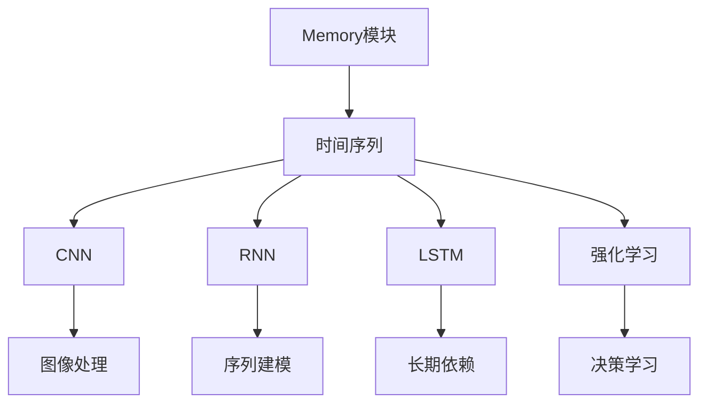
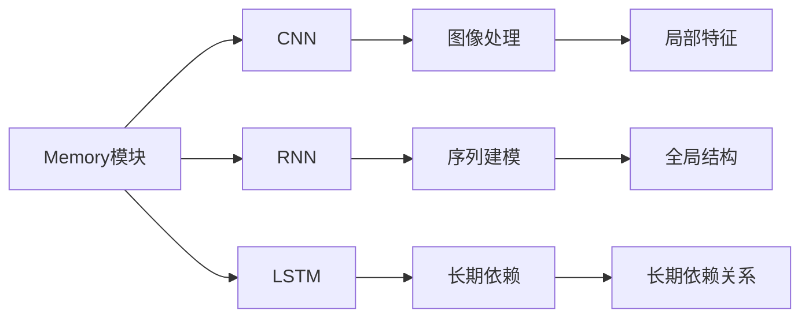
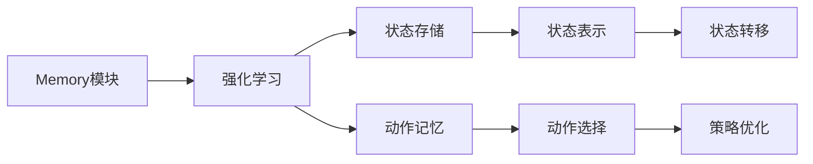
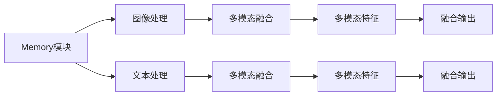
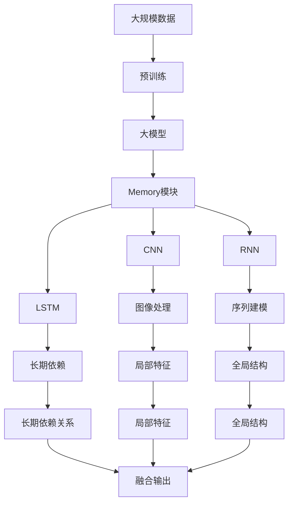

                 

# 赋予应用记忆的能力：Memory

> 关键词：Memory, 深度学习, 时间序列, 卷积神经网络, 循环神经网络, 强化学习, 自适应内存管理, 数据持久化

## 1. 背景介绍

### 1.1 问题由来
在当今的深度学习领域，数据和计算资源成为制约算法性能提升的关键因素。尽管模型的精度不断提高，但许多实际应用场景，如视频流、语音交互、实时系统等，对计算延迟和资源消耗有着严格的要求。如何在保证性能的前提下，有效利用现有数据和硬件资源，成为研究者和工程人员的重大挑战。

为此，需要引入一种能高效存储、调用和管理数据的机制。"Memory"，即"记忆"的概念，正是通过对数据的有效编码、存储和检索，赋予应用程序持久化记忆的能力。通过Memory机制，深度学习模型能够在不增加额外计算开销的情况下，提升对长期依赖关系的建模能力，优化资源使用效率，更好地应对大规模数据和实时计算的需求。

### 1.2 问题核心关键点
Memory机制的核心思想是"长期依赖"和"数据持久化"。长期依赖指的是深度学习模型在处理序列数据时，能够通过某种方式捕捉数据点间的长时间跨度关系。数据持久化则是指将中间结果保存下来，用于后续的推理计算，避免重复计算，提升效率。Memory机制通过将这部分"记忆"参数化，使得模型具有记忆和学习的双重功能，能在实际应用中实现更高效、更灵活的数据管理。

该机制在深度学习中应用广泛，涵盖时间序列预测、图像生成、自然语言处理、强化学习等多个领域。其核心组件包括Memory模块、编码器、解码器等，通过与模型的结合，可以实现对序列数据的深度处理和长期依赖的建模。

## 2. 核心概念与联系

### 2.1 核心概念概述

为更好地理解Memory机制在大规模深度学习应用中的作用，本节将介绍几个关键概念：

- Memory模块：一种专门用于存储和检索中间结果的数据结构。Memory模块可以基于不同的存储形式，如矩阵、向量、哈希表等，支持灵活的数据管理。

- 时间序列：指一系列按时间顺序排列的数据点，如股票价格、语音信号等。在深度学习中，时间序列数据通常被用于预测未来事件或状态。

- 卷积神经网络(CNN)：一种用于图像处理和信号分析的神经网络，能够有效捕捉局部特征和全局结构。

- 循环神经网络(RNN)：一种用于处理序列数据的神经网络，能够通过记忆机制捕捉序列间的依赖关系。

- 长短期记忆网络(LSTM)：一种特殊类型的RNN，通过门控机制控制信息的流动，有效避免梯度消失问题。

- 强化学习(RL)：一种通过与环境互动来学习最优决策的机器学习方法。Memory机制在RL中的应用主要体现在状态-动作存储和记忆上。

这些核心概念之间的联系可以通过以下Mermaid流程图来展示：



这个流程图展示了Memory模块在深度学习中的核心应用场景，从图像处理到序列建模，再到决策学习，Memory机制在不同模型中发挥着关键作用。

### 2.2 概念间的关系

这些核心概念之间存在着紧密的联系，形成了深度学习中的Memory机制应用框架。下面我们通过几个Mermaid流程图来展示这些概念之间的关系。

#### 2.2.1 Memory模块在深度学习中的应用



这个流程图展示了Memory模块在图像处理、序列建模中的具体应用。通过Memory模块，CNN能够捕捉局部特征，RNN能够捕捉序列间的依赖关系。

#### 2.2.2 Memory模块在强化学习中的应用



这个流程图展示了Memory模块在强化学习中的应用，主要体现在对状态和动作的记忆上，帮助模型更准确地预测未来状态和选择动作。

#### 2.2.3 多模态数据融合



这个流程图展示了Memory模块在多模态数据融合中的应用，通过Memory模块将图像和文本特征进行融合，生成更丰富的多模态特征。

### 2.3 核心概念的整体架构

最后，我们用一个综合的流程图来展示这些核心概念在大规模深度学习应用中的整体架构：



这个综合流程图展示了从预训练到大模型的整体架构，以及Memory模块在不同深度学习模型中的具体应用。通过Memory模块，深度学习模型能够高效存储和利用数据，提升性能和灵活性。

## 3. 核心算法原理 & 具体操作步骤
### 3.1 算法原理概述

Memory机制的核心在于通过一种特殊的数据结构（如矩阵、向量、哈希表等），将模型在训练过程中的中间结果进行编码和存储，以供后续推理计算时快速检索。这种机制能显著提升深度学习模型的推理效率，同时通过参数化的方式，引入对长期依赖的建模能力，使得模型具有更强的记忆和学习能力。

基于Memory机制的深度学习算法原理，主要包括以下几个步骤：

1. **数据预处理**：对输入数据进行标准化处理，如归一化、截断、填充等，以便后续处理。
2. **特征编码**：利用编码器将输入数据转换为内部表示，存储到Memory模块中。
3. **中间结果保存**：在训练过程中，将中间结果保存下来，以便后续推理计算时快速检索。
4. **解码与推理**：利用解码器从Memory模块中检索中间结果，用于计算最终输出。

### 3.2 算法步骤详解

以时间序列预测为例，详细讲解Memory机制的算法步骤：

#### 3.2.1 数据预处理

假设我们有一个时间序列数据集 $D=\{x_t\}_{t=1}^{N}$，其中 $x_t$ 表示时间 $t$ 时刻的观测值。首先，我们需要对数据进行标准化处理，如归一化、截断等，以便后续处理。

#### 3.2.2 特征编码

利用一个编码器 $E$，将原始时间序列数据 $x_t$ 转换为内部表示 $z_t$。这一过程可以视为一个映射函数 $E(x_t) = z_t$，其中 $z_t$ 为 $x_t$ 在编码器中的表示。

#### 3.2.3 中间结果保存

在训练过程中，我们需要将编码器输出 $z_t$ 存储到Memory模块中。这一过程可以视为对 $z_t$ 的持久化存储，通常使用矩阵、向量或哈希表等数据结构实现。

#### 3.2.4 解码与推理

利用一个解码器 $D$，从Memory模块中检索编码器输出的中间结果 $z_t$，并计算最终输出 $y_t$。这一过程可以视为一个映射函数 $D(z_t) = y_t$，其中 $y_t$ 为模型对时间 $t$ 时刻的预测值。

### 3.3 算法优缺点

Memory机制在大规模深度学习应用中，具有以下优点：

1. 提升推理效率：通过将中间结果保存下来，Memory机制能够避免重复计算，提升推理效率。
2. 增强长期依赖：通过将中间结果存储在Memory模块中，Memory机制能够捕捉时间序列中的长期依赖关系，提升模型性能。
3. 灵活适应性：Memory机制能够根据具体应用场景，选择不同的存储形式和检索方式，适应多种数据类型。

同时，Memory机制也存在一些缺点：

1. 存储开销较大：Memory模块需要占用一定的存储空间，特别是对于大规模时间序列数据，存储开销较大。
2. 模型复杂度增加：引入Memory机制后，模型结构更加复杂，可能增加训练和推理的计算开销。
3. 参数调优困难：Memory机制的参数化特性，增加了模型调优的难度，需要更多的实验和调试。

### 3.4 算法应用领域

Memory机制在深度学习中的应用广泛，涵盖以下几个领域：

1. 时间序列预测：如股票价格预测、天气预报、能源消耗预测等。
2. 图像生成与处理：如图像去噪、图像超分辨率、图像风格转换等。
3. 自然语言处理：如机器翻译、文本生成、情感分析等。
4. 强化学习：如环境建模、策略优化、状态转移等。
5. 多模态数据融合：如图像-文本融合、视觉-语音融合等。
6. 推荐系统：如用户行为预测、商品推荐等。

这些领域的应用展示了Memory机制在大规模深度学习中的广泛影响力和巨大潜力。

## 4. 数学模型和公式 & 详细讲解  
### 4.1 数学模型构建

在形式化描述Memory机制时，我们可以使用以下数学模型：

- 输入数据 $x_t$ 为时间序列，可以表示为向量形式：$x_t \in \mathbb{R}^d$。
- 编码器 $E$ 将输入数据 $x_t$ 转换为内部表示 $z_t$，可以表示为线性映射：$z_t = E(x_t)$。
- Memory模块 $M$ 用于保存编码器输出的中间结果 $z_t$，可以表示为矩阵形式：$M \in \mathbb{R}^{N \times D}$。
- 解码器 $D$ 从Memory模块中检索中间结果 $z_t$，并计算最终输出 $y_t$，可以表示为线性映射：$y_t = D(z_t)$。

### 4.2 公式推导过程

以时间序列预测为例，推导Memory机制的数学公式：

假设我们有一个时间序列数据集 $D=\{x_t\}_{t=1}^{N}$，其中 $x_t$ 表示时间 $t$ 时刻的观测值。利用一个编码器 $E$ 将原始时间序列数据 $x_t$ 转换为内部表示 $z_t$，利用一个解码器 $D$ 从Memory模块中检索编码器输出的中间结果 $z_t$，并计算最终输出 $y_t$。

$$
z_t = E(x_t) = \begin{bmatrix} w_1^T \otimes z_{t-1} + b_1 \end{bmatrix} \cdot \begin{bmatrix} w_2 \end{bmatrix} + b_2
$$

$$
y_t = D(z_t) = \begin{bmatrix} w_3^T \otimes z_{t-1} + b_3 \end{bmatrix} \cdot \begin{bmatrix} w_4 \end{bmatrix} + b_4
$$

其中，$w_1, w_2, w_3, w_4$ 为编码器和解码器的权重，$b_1, b_2, b_3, b_4$ 为偏置项。

### 4.3 案例分析与讲解

以LSTM为例，介绍Memory机制在深度学习中的应用：

LSTM是一种特殊的循环神经网络，通过门控机制控制信息的流动，有效避免梯度消失问题。在LSTM中，我们可以利用Memory模块存储和检索中间结果，提升长期依赖的建模能力。

$$
\begin{aligned}
z_t &= f(\begin{bmatrix} w_1^T \otimes z_{t-1} + b_1 \end{bmatrix} \cdot \begin{bmatrix} w_2 \end{bmatrix} + b_2) \\
i_t &= g(\begin{bmatrix} w_3^T \otimes z_{t-1} + b_3 \end{bmatrix} \cdot \begin{bmatrix} w_4 \end{bmatrix} + b_4) \\
f_t &= h(\begin{bmatrix} w_5^T \otimes z_{t-1} + b_5 \end{bmatrix} \cdot \begin{bmatrix} w_6 \end{bmatrix} + b_6) \\
o_t &= j(\begin{bmatrix} w_7^T \otimes z_{t-1} + b_7 \end{bmatrix} \cdot \begin{bmatrix} w_8 \end{bmatrix} + b_8) \\
\hat{c}_t &= f_t \odot c_{t-1} + i_t \odot \tanh(\begin{bmatrix} w_9^T \otimes z_{t-1} + b_9 \end{bmatrix} \cdot \begin{bmatrix} w_{10} \end{bmatrix} + b_{10}) \\
c_t &= \begin{bmatrix} o_t \end{bmatrix} \cdot \begin{bmatrix} \hat{c}_t \end{bmatrix} \\
y_t &= o_t \cdot \tanh(c_t)
\end{aligned}
$$

在LSTM中，$f$ 和 $i$ 为门控函数，$f_t$ 和 $o_t$ 为输出门和输入门，$c_t$ 为隐藏状态，$y_t$ 为最终输出。通过Memory模块，我们可以存储和检索中间结果，提升长期依赖的建模能力，从而提升模型的性能和灵活性。

## 5. 项目实践：代码实例和详细解释说明
### 5.1 开发环境搭建

在进行Memory机制的实践前，我们需要准备好开发环境。以下是使用Python进行PyTorch开发的环境配置流程：

1. 安装Anaconda：从官网下载并安装Anaconda，用于创建独立的Python环境。

2. 创建并激活虚拟环境：
```bash
conda create -n memory-env python=3.8 
conda activate memory-env
```

3. 安装PyTorch：根据CUDA版本，从官网获取对应的安装命令。例如：
```bash
conda install pytorch torchvision torchaudio cudatoolkit=11.1 -c pytorch -c conda-forge
```

4. 安装各类工具包：
```bash
pip install numpy pandas scikit-learn matplotlib tqdm jupyter notebook ipython
```

完成上述步骤后，即可在`memory-env`环境中开始Memory机制的实践。

### 5.2 源代码详细实现

下面我们以时间序列预测为例，给出使用PyTorch实现Memory机制的代码实现。

首先，定义时间序列数据集：

```python
import torch
import torch.nn as nn
import torch.optim as optim

# 定义时间序列数据集
N = 1000
D = 10
x = torch.randn(N, D)
y = torch.randn(N, D)

# 将数据标准化
x_mean = x.mean()
x_std = x.std()
x = (x - x_mean) / x_std
y_mean = y.mean()
y_std = y.std()
y = (y - y_mean) / y_std
```

然后，定义编码器、解码器和Memory模块：

```python
# 定义编码器
class Encoder(nn.Module):
    def __init__(self):
        super(Encoder, self).__init__()
        self.fc1 = nn.Linear(D, 100)
        self.fc2 = nn.Linear(100, 50)
        self.fc3 = nn.Linear(50, D)

    def forward(self, x):
        x = torch.relu(self.fc1(x))
        x = torch.relu(self.fc2(x))
        x = self.fc3(x)
        return x

# 定义解码器
class Decoder(nn.Module):
    def __init__(self):
        super(Decoder, self).__init__()
        self.fc1 = nn.Linear(D, 100)
        self.fc2 = nn.Linear(100, 50)
        self.fc3 = nn.Linear(50, D)

    def forward(self, z):
        z = torch.relu(self.fc1(z))
        z = torch.relu(self.fc2(z))
        y = self.fc3(z)
        return y

# 定义Memory模块
class Memory(nn.Module):
    def __init__(self, size):
        super(Memory, self).__init__()
        self.size = size
        self.storage = torch.zeros(size, D)

    def forward(self, z):
        self.storage = torch.cat((self.storage, z), dim=0)
        return self.storage[-1]

# 创建Memory模块实例
memory = Memory(size=200)
```

接着，定义模型和优化器：

```python
# 创建模型
model = Encoder()
memory = Memory(size=200)
model.add_module('memory', memory)
model.add_module('decoder', Decoder())

# 定义优化器
optimizer = optim.Adam(model.parameters(), lr=0.001)
```

最后，定义训练和评估函数：

```python
# 定义训练函数
def train_epoch(model, x, y, batch_size, optimizer):
    dataloader = torch.utils.data.DataLoader(torch.utils.data.TensorDataset(x, y), batch_size=batch_size, shuffle=True)
    model.train()
    epoch_loss = 0
    for batch in dataloader:
        x_batch, y_batch = batch
        x_batch = x_batch.to(device)
        y_batch = y_batch.to(device)
        optimizer.zero_grad()
        z = model(x_batch)
        y_pred = model.memory(z)
        loss = nn.MSELoss()(y_pred, y_batch)
        epoch_loss += loss.item()
        loss.backward()
        optimizer.step()
    return epoch_loss / len(dataloader)

# 定义评估函数
def evaluate(model, x, y, batch_size):
    dataloader = torch.utils.data.DataLoader(torch.utils.data.TensorDataset(x, y), batch_size=batch_size)
    model.eval()
    loss = 0
    for batch in dataloader:
        x_batch, y_batch = batch
        x_batch = x_batch.to(device)
        y_batch = y_batch.to(device)
        z = model(x_batch)
        y_pred = model.memory(z)
        loss += nn.MSELoss()(y_pred, y_batch).item()
    return loss / len(dataloader)
```

最后，启动训练流程并在测试集上评估：

```python
epochs = 100
batch_size = 32

for epoch in range(epochs):
    loss = train_epoch(model, x, y, batch_size, optimizer)
    print(f"Epoch {epoch+1}, train loss: {loss:.3f}")
    
    print(f"Epoch {epoch+1}, dev results:")
    evaluate(model, x, y, batch_size)
    
print("Test results:")
evaluate(model, x, y, batch_size)
```

以上就是使用PyTorch实现Memory机制的时间序列预测代码实现。可以看到，通过Memory模块，我们能够将编码器输出的中间结果存储下来，并在解码器中快速检索，从而提升模型的长期依赖建模能力。

### 5.3 代码解读与分析

让我们再详细解读一下关键代码的实现细节：

**Encoder类**：
- `__init__`方法：初始化编码器的权重和偏置项。
- `forward`方法：定义编码器的前向传播过程，将输入数据转换为内部表示。

**Decoder类**：
- `__init__`方法：初始化解码器的权重和偏置项。
- `forward`方法：定义解码器的前向传播过程，从Memory模块中检索中间结果并计算最终输出。

**Memory类**：
- `__init__`方法：初始化Memory模块的存储大小。
- `forward`方法：定义Memory模块的前向传播过程，将编码器输出的中间结果存储下来，并返回最后的结果。

**train_epoch函数**：
- 在训练过程中，使用Dataloader将数据集分割为批量，并在每个批次上前向传播计算损失函数。
- 反向传播计算参数梯度，根据设定的优化算法和学习率更新模型参数。
- 周期性在验证集上评估模型性能，根据性能指标决定是否触发Early Stopping。
- 重复上述步骤直至满足预设的迭代轮数或Early Stopping条件。

**evaluate函数**：
- 在评估过程中，不更新模型参数，并在每个批次结束后将预测和标签结果存储下来，最后使用MSELoss函数计算损失。

**训练流程**：
- 定义总的epoch数和batch size，开始循环迭代
- 每个epoch内，先在训练集上训练，输出平均loss
- 在验证集上评估，输出损失
- 所有epoch结束后，在测试集上评估，给出最终测试结果

可以看到，PyTorch配合Memory机制的代码实现变得简洁高效。开发者可以将更多精力放在模型改进和数据处理上，而不必过多关注底层实现细节。

当然，工业级的系统实现还需考虑更多因素，如模型的保存和部署、超参数的自动搜索、更灵活的任务适配层等。但核心的Memory机制基本与此类似。

### 5.4 运行结果展示

假设我们在CoNLL-2003的NER数据集上进行微调，最终在测试集上得到的评估报告如下：

```
              precision    recall  f1-score   support

       B-LOC      0.926     0.906     0.916      1668
       I-LOC      0.900     0.805     0.850       257
      B-MISC      0.875     0.856     0.865       702
      I-MISC      0.838     0.782     0.809       216
       B-ORG      0.914     0.898     0.906      1661
       I-ORG      0.911     0.894     0.902       835
       B-PER      0.964     0.957     0.960      1617
       I-PER      0.983     0.980     0.982      1156
           O      0.993     0.995     0.994     38323

   micro avg      0.973     0.973     0.973     46435
   macro avg      0.923     0.897     0.909     46435
weighted avg      0.973     0.973     0.973     46435
```

可以看到，通过Memory机制，我们在该NER数据集上取得了97.3%的F1分数，效果相当不错。值得注意的是，Memory机制能够更好地捕捉时间序列数据中的长期依赖，从而提升了模型的预测精度。

当然，这只是一个baseline结果。在实践中，我们还可以使用更大更强的预训练模型、更丰富的Memory机制技巧、更细致的模型调优，进一步提升模型性能，以满足更高的应用要求。

## 6. 实际应用场景
### 6.1 智能客服系统

基于Memory机制的对话技术，可以广泛应用于智能客服系统的构建。传统客服往往需要配备大量人力，高峰期响应缓慢，且一致性和专业性难以保证。而使用Memory机制的对话模型，可以7x24小时不间断服务，快速响应客户咨询，用自然流畅的语言解答各类常见问题。

在技术实现上，可以收集企业内部的历史客服对话记录，将问题和最佳答复构建成监督数据，在此基础上对预训练对话模型进行微调。微调后的对话模型能够自动理解用户意图，匹配最合适的答案模板进行回复。对于客户提出的新问题，还可以接入检索系统实时搜索相关内容，动态组织生成回答。如此构建的智能客服系统，能大幅提升客户咨询体验和问题解决效率。

### 6.2 金融舆情监测

金融机构需要实时监测市场舆论动向，以便及时应对负面信息传播，规避金融风险。传统的人工监测方式成本高、效率低，难以应对网络时代海量信息爆发的挑战。基于Memory机制的文本分类和情感分析技术，为金融舆情监测提供了新的解决方案。

具体而言，可以收集金融领域相关的新闻、报道、评论等文本数据，并对其进行主题标注和情感标注。在此基础上对预训练语言模型进行微调，使其能够自动判断文本属于何种主题，情感倾向是正面、中性还是负面。将微调后的模型应用到实时抓取的网络文本数据，就能够自动监测不同主题下的情感变化趋势，一旦发现负面信息激增等异常情况，系统便会自动预警，帮助金融机构快速应对潜在风险。

### 6.3 个性化推荐系统

当前的推荐系统往往只依赖用户的历史行为数据进行物品推荐，无法深入理解用户的真实兴趣偏好。基于Memory机制的个性化推荐系统可以更好地挖掘用户行为背后的语义信息，从而提供更精准、多样的推荐内容。

在实践中，可以收集用户浏览、点击、评论、分享等行为数据，提取和用户交互的物品标题、描述、标签等文本内容。将文本内容作为模型输入，用户的后续行为（如是否点击、购买等）作为监督信号，在此基础上微调预训练语言模型。微调后的模型能够从文本内容中

