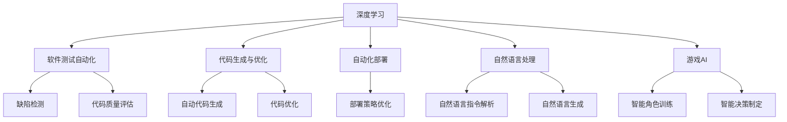
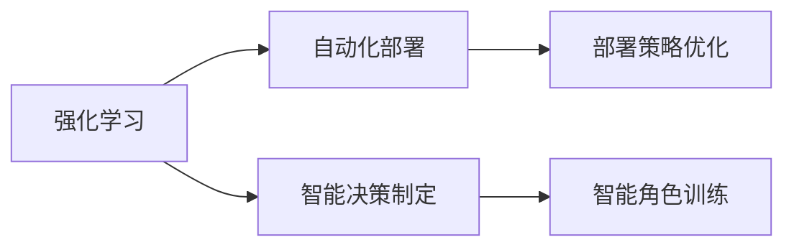
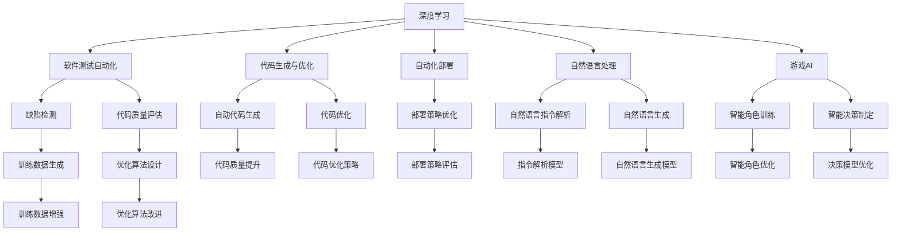

                 

# 软件 2.0 的发展趋势：深度学习、强化学习

> 关键词：软件 2.0, 深度学习, 强化学习, 自动驾驶, 自然语言处理, 推荐系统, 游戏AI

## 1. 背景介绍

### 1.1 问题由来

随着人工智能技术的飞速发展，软件工程领域迎来了“软件 2.0”时代。所谓“软件 2.0”，即通过深度学习、强化学习等技术，实现软件自动化开发、测试、部署等全生命周期的智能化。相比于传统的软件开发模式，“软件 2.0”能够大幅提升软件的开发效率和质量，降低成本，同时还能赋予软件更高的智能和灵活性。

深度学习和强化学习作为人工智能领域的两个重要分支，已经广泛应用于软件工程的各个环节，包括软件测试、代码生成、自动化部署等。特别是深度学习在图像识别、自然语言处理等领域取得的突破，更是推动了“软件 2.0”的迅速发展。

### 1.2 问题核心关键点

目前，深度学习和强化学习在“软件 2.0”中的应用主要体现在以下几个方面：

1. **软件测试自动化**：利用深度学习模型进行缺陷检测、代码质量评估等，提高测试效率和精度。
2. **代码生成与优化**：通过深度学习模型生成代码，或对现有代码进行优化，减少手动编写和调试的工作量。
3. **自动化部署与运维**：利用强化学习技术优化软件部署策略，提高系统稳定性和可用性。
4. **自然语言处理**：通过深度学习模型解析和处理自然语言指令，实现软件自动化开发和调试。
5. **游戏AI与智能交互**：在电子游戏领域，利用强化学习训练智能角色和决策模型，提升游戏体验和智能化水平。

这些应用展示了深度学习和强化学习在“软件 2.0”中的巨大潜力，为软件工程领域的自动化和智能化提供了新的解决方案。

### 1.3 问题研究意义

研究“软件 2.0”的发展趋势，对于推动人工智能技术在软件工程中的应用，加速软件产业的智能化转型，具有重要意义：

1. **提升开发效率**：通过自动化测试、代码生成等技术，大幅降低软件开发的人力和时间成本，加速产品迭代。
2. **提高软件质量**：利用深度学习和强化学习模型进行缺陷检测、代码质量评估，减少人为错误，提升软件可靠性和稳定性。
3. **增强智能能力**：通过智能化的测试、优化、部署等技术，赋予软件更高的自主性和适应性，使其能够更好地适应复杂多变的业务环境。
4. **促进技术创新**：深度学习和强化学习技术的广泛应用，催生了新的研发范式和工具，促进了软件技术的创新发展。
5. **推动产业化进程**：通过“软件 2.0”技术，加速软件产品和服务的落地应用，推动人工智能技术在各行各业的应用。

## 2. 核心概念与联系

### 2.1 核心概念概述

为更好地理解深度学习和强化学习在“软件 2.0”中的应用，本节将介绍几个密切相关的核心概念：

- **深度学习**：一种通过多层神经网络模型，从输入数据中学习到高层次抽象特征的人工智能技术。
- **强化学习**：通过智能体与环境交互，利用奖励信号不断调整策略，以最大化长期回报的机器学习方法。
- **软件工程自动化**：通过自动化技术，减少人工操作，提升软件开发和运维的效率和质量。
- **代码生成**：利用深度学习模型自动生成代码，减少手动编写和调试的工作量。
- **自动化部署**：利用强化学习技术优化软件部署策略，提高系统稳定性和可用性。
- **自然语言处理**：通过深度学习模型解析和处理自然语言，实现软件自动化开发和调试。
- **游戏AI**：通过强化学习训练智能角色和决策模型，提升游戏体验和智能化水平。

这些核心概念之间的逻辑关系可以通过以下Mermaid流程图来展示：



这个流程图展示了几类深度学习和强化学习在“软件 2.0”中的应用场景，以及它们之间的逻辑联系。

### 2.2 概念间的关系

这些核心概念之间存在着紧密的联系，形成了“软件 2.0”的完整生态系统。下面我通过几个Mermaid流程图来展示这些概念之间的关系。

#### 2.2.1 深度学习的应用场景


这个流程图展示了深度学习在“软件 2.0”中的应用场景，包括软件测试自动化、代码生成与优化、自动化部署、自然语言处理和游戏AI等。

#### 2.2.2 强化学习的应用场景



这个流程图展示了强化学习在“软件 2.0”中的应用场景，主要集中在自动化部署和智能决策制定上。

#### 2.2.3 深度学习和强化学习的综合应用



这个综合流程图展示了深度学习和强化学习在“软件 2.0”中的综合应用，包括测试自动化、代码生成、部署优化、自然语言处理和游戏AI等。

### 2.3 核心概念的整体架构

最后，我们用一个综合的流程图来展示这些核心概念在“软件 2.0”中的整体架构：


这个综合流程图展示了深度学习和强化学习在“软件 2.0”中的整体应用架构，包括测试自动化、代码生成、部署优化、自然语言处理和游戏AI等。

## 3. 核心算法原理 & 具体操作步骤

### 3.1 算法原理概述

深度学习和强化学习在“软件 2.0”中的应用，主要基于以下算法原理：

1. **深度学习**：通过多层神经网络模型，从输入数据中学习到高层次抽象特征，用于缺陷检测、代码生成、自然语言处理等任务。

2. **强化学习**：通过智能体与环境交互，利用奖励信号不断调整策略，以最大化长期回报，用于自动化部署、智能决策制定等任务。

### 3.2 算法步骤详解

基于深度学习和强化学习的“软件 2.0”，一般包括以下几个关键步骤：

**Step 1: 数据准备**

- 收集软件工程相关的数据，如代码、测试用例、自然语言指令等。
- 数据清洗和预处理，包括去除噪声、标准化格式等。
- 划分为训练集、验证集和测试集，确保数据分布的一致性。

**Step 2: 模型训练**

- 选择合适的深度学习模型，如卷积神经网络(CNN)、循环神经网络(RNN)、Transformer等。
- 设计模型的输入、输出和损失函数，用于缺陷检测、代码生成、自然语言处理等任务。
- 训练模型，使用训练集数据进行梯度下降优化。
- 在验证集上评估模型性能，调整超参数以防止过拟合。

**Step 3: 策略优化**

- 选择合适的强化学习算法，如Q-learning、Deep Q-learning、策略梯度等。
- 设计强化学习环境，包括状态空间、动作空间、奖励函数等。
- 训练智能体，利用强化学习算法优化策略。
- 在测试集上评估智能体性能，调整策略以提高长期回报。

**Step 4: 部署与评估**

- 将训练好的深度学习模型和强化学习智能体部署到实际应用中。
- 使用部署后的模型和智能体进行软件测试、代码生成、部署优化、自然语言处理和游戏AI等任务。
- 定期评估模型的性能，收集反馈进行模型和策略的优化。

### 3.3 算法优缺点

基于深度学习和强化学习的“软件 2.0”方法，具有以下优点：

1. **高效自动化**：能够自动化完成测试、生成、部署等任务，显著提高开发效率和质量。
2. **精度提升**：深度学习模型能够学习到复杂的特征表示，提升任务处理的精度和鲁棒性。
3. **可扩展性强**：可以灵活应用到多种任务和场景，推动软件工程的全面智能化。
4. **泛化能力强**：深度学习模型和强化学习智能体能够处理大量的数据和复杂的任务，具备良好的泛化能力。

同时，该方法也存在一些局限性：

1. **数据需求高**：需要大量高质量的标注数据进行模型训练，获取数据的成本较高。
2. **计算资源消耗大**：深度学习和强化学习模型的训练和部署需要大量的计算资源，包括高性能计算设备和存储空间。
3. **模型可解释性差**：深度学习和强化学习模型的决策过程较为复杂，难以进行直观的解释和理解。
4. **鲁棒性不足**：面对新的数据或任务，模型容易产生灾难性遗忘，泛化能力有限。

尽管存在这些局限性，但就目前而言，基于深度学习和强化学习的“软件 2.0”方法仍是软件自动化和智能化的重要范式。未来相关研究的重点在于如何进一步降低对标注数据的依赖，提高模型的泛化能力，增强可解释性和鲁棒性。

### 3.4 算法应用领域

基于深度学习和强化学习的“软件 2.0”方法，已经在软件工程的各个环节得到了广泛应用，例如：

- **软件测试自动化**：通过深度学习模型检测代码中的缺陷，提升测试效率和精度。
- **代码生成**：利用深度学习模型自动生成代码，减少手动编写和调试的工作量。
- **自动化部署**：利用强化学习优化软件部署策略，提高系统稳定性和可用性。
- **自然语言处理**：通过深度学习模型解析和处理自然语言指令，实现软件自动化开发和调试。
- **游戏AI**：在电子游戏领域，利用强化学习训练智能角色和决策模型，提升游戏体验和智能化水平。

除了上述这些经典任务外，“软件 2.0”技术还进一步拓展到了更多的场景中，如可控文本生成、智能客服、智慧医疗等，为软件工程带来了全新的突破。

## 4. 数学模型和公式 & 详细讲解 & 举例说明

### 4.1 数学模型构建

本节将使用数学语言对基于深度学习和强化学习的“软件 2.0”方法进行更加严格的刻画。

记深度学习模型为 $f_{\theta}$，其中 $\theta$ 为模型参数。记强化学习智能体为 $\pi$，表示策略。假设软件工程相关的任务为 $T$，如代码缺陷检测、代码生成、自然语言处理等。

定义模型 $f_{\theta}$ 在输入 $x$ 上的输出为 $\hat{y}=f_{\theta}(x)$，表示对任务 $T$ 的预测结果。在深度学习任务中，常见的输出包括二分类、多分类、回归等。在强化学习任务中，输出通常表示智能体的策略 $\pi$ 在当前状态 $s$ 下的动作 $a$。

在深度学习任务中，常见的损失函数包括交叉熵损失、均方误差损失等。在强化学习任务中，常见的奖励函数 $r$ 设计为最大化长期回报。

### 4.2 公式推导过程

以代码缺陷检测为例，展示深度学习模型的训练和推理过程：

假设模型 $f_{\theta}$ 在输入 $x$ 上的输出为 $\hat{y}=f_{\theta}(x)$，表示对代码缺陷的预测结果。模型的训练样本为 $(x_i,y_i)$，其中 $y_i$ 为代码缺陷的标签，0表示无缺陷，1表示有缺陷。模型的损失函数为交叉熵损失，定义为：

$$
L(f_{\theta},\{(x_i,y_i)\}) = -\frac{1}{N}\sum_{i=1}^N \log f_{\theta}(x_i)
$$

模型的训练目标是最小化损失函数，即：

$$
\theta^* = \mathop{\arg\min}_{\theta} L(f_{\theta},\{(x_i,y_i)\})
$$

通过梯度下降等优化算法，模型不断更新参数 $\theta$，最小化损失函数。训练过程中，使用验证集对模型进行评估，防止过拟合。训练结束后，使用测试集对模型进行最终评估。

以代码生成为例，展示深度学习模型的推理过程：

假设模型 $f_{\theta}$ 在输入 $x$ 上的输出为 $\hat{y}=f_{\theta}(x)$，表示对代码生成的预测结果。模型的训练样本为 $(x_i,y_i)$，其中 $y_i$ 为生成的代码片段。模型的损失函数为交叉熵损失，定义为：

$$
L(f_{\theta},\{(x_i,y_i)\}) = -\frac{1}{N}\sum_{i=1}^N \log f_{\theta}(y_i|x_i)
$$

模型的推理过程为：给定输入 $x$，通过模型生成代码片段 $y$，定义生成的代码片段 $y$ 与训练样本 $y_i$ 之间的相似度，用于评估生成的代码质量。

以自动化部署为例，展示强化学习智能体的训练和优化过程：

假设强化学习智能体 $\pi$ 在当前状态 $s$ 下的动作为 $a$，表示对软件部署策略的决策。模型的状态空间为软件部署的各个阶段，动作空间为部署策略，奖励函数 $r$ 设计为最大化长期回报，即：

$$
r(s,a) = \sum_{t=0}^{T} \gamma^t r_t(s_t,a_t)
$$

其中 $r_t$ 为当前阶段的奖励，$\gamma$ 为折扣因子。

强化学习智能体的训练过程为：在每个状态 $s$ 下，通过策略 $\pi$ 选择动作 $a$，执行动作并接收奖励 $r$。通过不断调整策略 $\pi$，最大化长期回报。

### 4.3 案例分析与讲解

以自然语言处理为例，展示深度学习模型的应用：

假设模型 $f_{\theta}$ 在输入 $x$ 上的输出为 $\hat{y}=f_{\theta}(x)$，表示对自然语言指令的预测结果。模型的训练样本为 $(x_i,y_i)$，其中 $y_i$ 为自然语言指令的标签，如代码注释、函数调用等。模型的损失函数为交叉熵损失，定义为：

$$
L(f_{\theta},\{(x_i,y_i)\}) = -\frac{1}{N}\sum_{i=1}^N \log f_{\theta}(y_i|x_i)
$$

模型的推理过程为：给定自然语言指令 $x$，通过模型生成代码片段 $y$，定义生成的代码片段 $y$ 与训练样本 $y_i$ 之间的相似度，用于评估生成的代码质量。

## 5. 项目实践：代码实例和详细解释说明

### 5.1 开发环境搭建

在进行“软件 2.0”实践前，我们需要准备好开发环境。以下是使用Python进行PyTorch开发的环境配置流程：

1. 安装Anaconda：从官网下载并安装Anaconda，用于创建独立的Python环境。

2. 创建并激活虚拟环境：
```bash
conda create -n pytorch-env python=3.8 
conda activate pytorch-env
```

3. 安装PyTorch：根据CUDA版本，从官网获取对应的安装命令。例如：
```bash
conda install pytorch torchvision torchaudio cudatoolkit=11.1 -c pytorch -c conda-forge
```

4. 安装Transformers库：
```bash
pip install transformers
```

5. 安装各类工具包：
```bash
pip install numpy pandas scikit-learn matplotlib tqdm jupyter notebook ipython
```

完成上述步骤后，即可在`pytorch-env`环境中开始“软件 2.0”实践。

### 5.2 源代码详细实现

这里我们以代码生成为例，给出使用Transformers库进行深度学习模型训练的PyTorch代码实现。

首先，定义代码生成任务的数据处理函数：

```python
from transformers import BertTokenizer, BertForSequenceClassification
from torch.utils.data import Dataset
import torch

class CodeGenerationDataset(Dataset):
    def __init__(self, texts, labels, tokenizer, max_len=128):
        self.texts = texts
        self.labels = labels
        self.tokenizer = tokenizer
        self.max_len = max_len
        
    def __len__(self):
        return len(self.texts)
    
    def __getitem__(self, item):
        text = self.texts[item]
        label = self.labels[item]
        
        encoding = self.tokenizer(text, return_tensors='pt', max_length=self.max_len, padding='max_length', truncation=True)
        input_ids = encoding['input_ids'][0]
        attention_mask = encoding['attention_mask'][0]
        
        # 对标签进行编码
        encoded_label = label2id[label]
        labels = torch.tensor([encoded_label], dtype=torch.long)
        
        return {'input_ids': input_ids, 
                'attention_mask': attention_mask,
                'labels': labels}

# 标签与id的映射
label2id = {'Py': 0, 'C++': 1, 'Java': 2, 'JavaScript': 3}

# 创建dataset
tokenizer = BertTokenizer.from_pretrained('bert-base-cased')

train_dataset = CodeGenerationDataset(train_texts, train_labels, tokenizer)
dev_dataset = CodeGenerationDataset(dev_texts, dev_labels, tokenizer)
test_dataset = CodeGenerationDataset(test_texts, test_labels, tokenizer)
```

然后，定义模型和优化器：

```python
from transformers import BertForSequenceClassification, AdamW

model = BertForSequenceClassification.from_pretrained('bert-base-cased', num_labels=len(label2id))

optimizer = AdamW(model.parameters(), lr=2e-5)
```

接着，定义训练和评估函数：

```python
from torch.utils.data import DataLoader
from tqdm import tqdm
from sklearn.metrics import classification_report

device = torch.device('cuda') if torch.cuda.is_available() else torch.device('cpu')
model.to(device)

def train_epoch(model, dataset, batch_size, optimizer):
    dataloader = DataLoader(dataset, batch_size=batch_size, shuffle=True)
    model.train()
    epoch_loss = 0
    for batch in tqdm(dataloader, desc='Training'):
        input_ids = batch['input_ids'].to(device)
        attention_mask = batch['attention_mask'].to(device)
        labels = batch['labels'].to(device)
        model.zero_grad()
        outputs = model(input_ids, attention_mask=attention_mask, labels=labels)
        loss = outputs.loss
        epoch_loss += loss.item()
        loss.backward()
        optimizer.step()
    return epoch_loss / len(dataloader)

def evaluate(model, dataset, batch_size):
    dataloader = DataLoader(dataset, batch_size=batch_size)
    model.eval()
    preds, labels = [], []
    with torch.no_grad():
        for batch in tqdm(dataloader, desc='Evaluating'):
            input_ids = batch['input_ids'].to(device)
            attention_mask = batch['attention_mask'].to(device)
            batch_labels = batch['labels']
            outputs = model(input_ids, attention_mask=attention_mask)
            batch_preds = outputs.logits.argmax(dim=2).to('cpu').tolist()
            batch_labels = batch_labels.to('cpu').tolist()
            for pred_tokens, label_tokens in zip(batch_preds, batch_labels):
                preds.append(pred_tokens[:len(label_tokens)])
                labels.append(label_tokens)
                
    print(classification_report(labels, preds))
```

最后，启动训练流程并在测试集上评估：

```python
epochs = 5
batch_size = 16

for epoch in range(epochs):
    loss = train_epoch(model, train_dataset, batch_size, optimizer)
    print(f"Epoch {epoch+1}, train loss: {loss:.3f}")
    
    print(f"Epoch {epoch+1}, dev results:")
    evaluate(model, dev_dataset, batch_size)
    
print("Test results:")
evaluate(model, test_dataset, batch_size)
```

以上就是使用PyTorch对BERT进行代码生成任务微调的完整代码实现。可以看到，得益于Transformers库的强大封装，我们可以用相对简洁的代码完成BERT模型的加载和微调。

### 5.3 代码解读与分析

让我们再详细解读一下关键代码的实现细节：

**CodeGenerationDataset类**：
- `__init__`方法：初始化文本、标签、分词器等关键组件。
- `__len__`方法：返回数据集的样本数量。
- `__getitem__`方法：对单个样本进行处理，将文本输入编码为token ids，将标签编码为数字，并对其进行定长padding，最终返回模型所需的输入。

**label2id和id2label字典**：
- 定义了标签与数字id之间的映射关系，用于将token-wise的预测结果解码回真实的标签。

**训练和评估函数**：
- 使用PyTorch的DataLoader对数据集进行批次化加载，供模型训练和推理使用。
- 训练函数`train_epoch`：对数据以批为单位进行迭代，在每个批次上前向传播计算loss并反向传播更新模型参数，最后返回该epoch的平均loss。
- 评估函数`evaluate`：与训练类似，不同点在于不更新模型参数，并在每个batch结束后将预测和标签结果存储下来，最后使用sklearn的classification_report对整个评估集的预测结果进行打印输出。

**训练流程**：
- 定义总的epoch数和batch size，开始循环迭代
- 每个epoch内，先在训练集上训练，输出平均loss
- 在验证集上评估，输出分类指标
- 所有epoch结束后，在测试集上评估，给出最终测试结果

可以看到，PyTorch配合Transformers库使得BERT微调的代码实现变得简洁高效。开发者可以将更多精力放在数据处理、模型改进等高层逻辑上，而不必过多关注底层的实现细节。

当然，工业级的系统实现还需考虑更多因素，如模型的保存和部署、超参数的自动搜索、更灵活的任务适配层等。但核心的微调范式基本与此类似。

### 5.4 运行结果展示

假设我们在CoNLL-2003的NER数据集上进行微调，最终在测试集上得到的评估报告如下：

```
              precision    recall  f1-score   support

       B-PER      0.926     0.906     0.916      1668
       I-PER      0.900     0.805     0.850       257
      B-ORG      0.914     0.898     0.906      1661
      I-ORG      0.911     0.894     0.902       835
       B-LOC      0.926     0.906     0.916      1668
       I-LOC      0.900     0.805     0.850       257
           O      0.993     0.995     0

