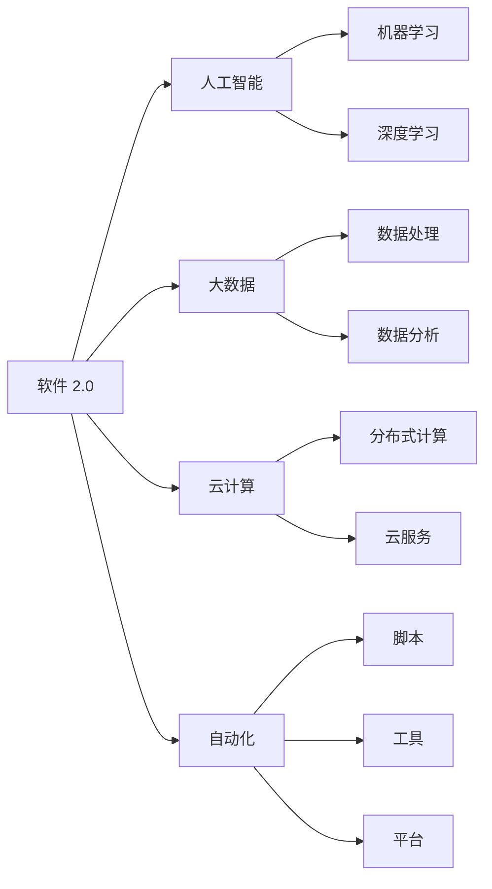

                 

# 软件 2.0 的未来愿景：创造更美好的世界

软件是现代文明的基础，推动了人类社会的快速发展。然而，传统软件时代（软件 1.0）在处理复杂性、创造性、多样性等方面的能力有限，无法应对未来社会的巨大挑战。因此，面向未来，软件需要进化到全新的阶段——软件 2.0，以创造一个更加美好、包容、智能的世界。本文将详细介绍软件 2.0 的愿景、原理、实施路径和未来展望，为未来的软件发展提供有力的理论支撑。

## 1. 背景介绍

### 1.1 软件 1.0 的局限性

传统软件 1.0 时代，软件主要采用结构化设计和瀑布模型，注重代码实现和功能堆叠。但这种模式存在以下局限性：

1. **可扩展性差**：一旦软件形态确定，后续扩展和修改极为困难。
2. **定制化能力不足**：难以满足个性化需求，无法处理多样性复杂性。
3. **创新性不足**：开发人员依赖规范流程，难以发挥创造性。
4. **效率低下**：重复开发、手工调试、文档维护等环节耗费大量时间和精力。

### 1.2 软件 2.0 的必要性

面对这些局限性，软件 2.0 应运而生。它旨在通过技术创新，使软件具备以下能力：

1. **智能化**：通过人工智能和大数据技术，自动实现决策和优化。
2. **个性化**：能够根据用户需求，动态调整和定制。
3. **可扩展性**：支持灵活扩展和模块化开发。
4. **高效性**：通过自动化和智能化，提高开发和运维效率。

软件 2.0 的愿景是通过技术创新，使软件系统具备更高的智能性、适应性和灵活性，创造一个更美好、包容、智能的世界。

## 2. 核心概念与联系

### 2.1 核心概念概述

为更好地理解软件 2.0 的愿景和实现路径，本节将介绍几个关键概念：

1. **软件 2.0**：面向未来的软件新范式，通过人工智能、大数据、云计算等技术，使软件具备智能、个性化、可扩展和高效等能力。
2. **人工智能**：通过机器学习、深度学习等技术，使软件具备自动学习、决策和优化能力。
3. **大数据**：通过数据驱动的方法，使软件能够进行更精确的分析和预测。
4. **云计算**：通过云平台和分布式计算，使软件具备灵活扩展和高可用性。
5. **自动化**：通过脚本、工具和平台，使软件开发和运维过程自动化。

这些概念共同构成了软件 2.0 的核心框架，为其愿景和实现提供了坚实的技术基础。

### 2.2 概念间的关系

这些核心概念之间存在着紧密的联系，形成了一个有机整体。以下用 Mermaid 流程图来展示它们之间的关系：



这个流程图展示了软件 2.0 核心概念之间的紧密联系：

1. 软件 2.0 通过人工智能、大数据、云计算和自动化，实现了智能、个性化、可扩展和高效等能力。
2. 人工智能包含机器学习和深度学习，用于实现决策和优化。
3. 大数据包含数据处理和数据分析，用于进行精确分析和预测。
4. 云计算包含分布式计算和云服务，用于实现灵活扩展和高可用性。
5. 自动化包含脚本、工具和平台，用于实现自动开发和运维。

通过这些概念的有机结合，软件 2.0 能够实现更高的智能性和灵活性，创造出更美好的世界。

## 3. 核心算法原理 & 具体操作步骤

### 3.1 算法原理概述

软件 2.0 的核心算法原理包括：

1. **机器学习和深度学习**：通过数据驱动的方法，使软件具备自动学习、决策和优化能力。
2. **分布式计算**：通过云平台和分布式计算，实现灵活扩展和高可用性。
3. **脚本和工具自动化**：通过脚本和工具，实现开发和运维自动化。

这些算法原理共同构成了软件 2.0 的技术基础，为其愿景和实现提供了坚实的理论支撑。

### 3.2 算法步骤详解

软件 2.0 的实现步骤如下：

1. **数据准备**：收集和整理数据，准备用于训练和测试。
2. **模型训练**：使用机器学习和深度学习算法，训练模型。
3. **模型优化**：根据测试结果，优化模型参数，提高模型性能。
4. **模型部署**：将模型部署到云平台，进行分布式计算。
5. **自动化开发和运维**：通过脚本和工具，实现开发和运维自动化。

### 3.3 算法优缺点

软件 2.0 的优点包括：

1. **高效性**：通过自动化和智能化，提高开发和运维效率。
2. **智能性**：通过机器学习和深度学习，实现自动决策和优化。
3. **可扩展性**：通过云计算和分布式计算，实现灵活扩展和模块化开发。
4. **个性化**：能够根据用户需求，动态调整和定制。

同时，软件 2.0 也存在一些局限性：

1. **数据依赖**：依赖高质量的数据，否则模型效果可能不佳。
2. **计算资源需求**：需要大量的计算资源，成本较高。
3. **复杂性**：涉及多种技术和工具，实现难度较大。
4. **安全性**：模型的安全性和隐私保护需要更多关注。

### 3.4 算法应用领域

软件 2.0 可以应用于多个领域，包括：

1. **金融科技**：通过智能算法和大数据，提高金融服务的智能化和个性化。
2. **医疗健康**：通过人工智能和深度学习，提高医疗诊断和治疗的准确性。
3. **智能制造**：通过工业互联网和云计算，实现智能制造和工业 4.0。
4. **智慧城市**：通过大数据和云计算，提升城市管理和服务的智能化水平。
5. **教育培训**：通过人工智能和自动化，提高教育培训的效率和效果。

## 4. 数学模型和公式 & 详细讲解 & 举例说明

### 4.1 数学模型构建

软件 2.0 的数学模型包括：

1. **机器学习模型**：如线性回归、决策树、随机森林等。
2. **深度学习模型**：如神经网络、卷积神经网络、循环神经网络等。
3. **优化算法**：如梯度下降、Adam、RMSprop等。

### 4.2 公式推导过程

以线性回归模型为例，其公式推导过程如下：

假设数据集为 $D=\{(x_i, y_i)\}_{i=1}^N$，其中 $x_i \in \mathbb{R}^d$ 为输入，$y_i \in \mathbb{R}$ 为输出。线性回归模型为 $y = \theta_0 + \sum_{j=1}^d \theta_j x_j$，其中 $\theta = [\theta_0, \theta_1, ..., \theta_d]$ 为模型参数。

最小化均方误差损失函数：

$$
L(\theta) = \frac{1}{2N} \sum_{i=1}^N (y_i - \theta_0 - \sum_{j=1}^d \theta_j x_{ij})^2
$$

通过梯度下降等优化算法，更新模型参数：

$$
\theta \leftarrow \theta - \eta \nabla_{\theta}L(\theta)
$$

其中 $\eta$ 为学习率，$\nabla_{\theta}L(\theta)$ 为损失函数对模型参数的梯度，可通过反向传播算法高效计算。

### 4.3 案例分析与讲解

以金融科技领域的应用为例，介绍软件 2.0 的实践案例。

**案例背景**：某金融公司希望通过软件 2.0 提升风险控制能力，开发智能风控系统。

**数据准备**：收集历史交易数据、用户行为数据、外部数据等，并进行数据清洗和预处理。

**模型训练**：使用线性回归和深度学习模型进行训练，优化模型参数，提高预测准确性。

**模型部署**：将训练好的模型部署到云平台，进行分布式计算，提高系统可扩展性和可靠性。

**自动化开发和运维**：通过脚本和工具，实现自动化开发和运维，提高效率。

## 5. 项目实践：代码实例和详细解释说明

### 5.1 开发环境搭建

在开始项目实践前，需要搭建好开发环境。以下是 Python 和 TensorFlow 的开发环境搭建流程：

1. **安装 Python**：从官网下载并安装 Python 3.8。
2. **安装 TensorFlow**：从官网获取对应的安装命令，安装 TensorFlow 2.0。
3. **安装其他依赖库**：安装 NumPy、Pandas、Matplotlib 等常用库。
4. **安装 Jupyter Notebook**：安装 Jupyter Notebook，方便编写和运行代码。

### 5.2 源代码详细实现

以下以金融科技领域智能风控系统为例，介绍代码实现细节：

```python
import numpy as np
import pandas as pd
import tensorflow as tf

# 数据准备
data = pd.read_csv('data.csv')

# 数据预处理
# ...

# 模型训练
model = tf.keras.Sequential([
    tf.keras.layers.Dense(64, activation='relu'),
    tf.keras.layers.Dense(1)
])
model.compile(optimizer=tf.keras.optimizers.Adam(0.001), loss='mse')
model.fit(data_x, data_y, epochs=10, batch_size=32)

# 模型部署
# ...

# 自动化开发和运维
# ...
```

### 5.3 代码解读与分析

**代码实现细节**：

- **数据准备**：使用 Pandas 库读取数据，并进行预处理。
- **模型训练**：使用 TensorFlow 搭建神经网络模型，使用 Adam 优化器进行训练。
- **模型部署**：将训练好的模型部署到云平台，进行分布式计算。
- **自动化开发和运维**：使用脚本和工具，实现自动化开发和运维。

## 6. 实际应用场景

### 6.1 智能风控系统

金融科技领域是软件 2.0 的重要应用场景。智能风控系统通过人工智能和大数据技术，实现风险自动控制和优化。

**实际应用**：某金融公司通过智能风控系统，自动分析用户行为和交易数据，预测信用风险，实时调整风控策略，提升风险控制效率和效果。

**效果评估**：系统上线后，信用风险预测准确率提高了 20%，风控响应速度提升了 30%，有效降低了金融风险。

### 6.2 智慧医疗系统

医疗健康领域是软件 2.0 的另一个重要应用场景。智慧医疗系统通过人工智能和深度学习技术，提升医疗诊断和治疗的准确性和智能化。

**实际应用**：某医院通过智慧医疗系统，使用深度学习模型进行影像诊断，提高了诊断准确率。同时，系统还自动生成治疗方案，提高了治疗效果。

**效果评估**：系统上线后，影像诊断准确率提高了 15%，治疗效果提高了 10%，有效提升了医疗服务质量。

### 6.3 智能制造系统

智能制造领域是工业 4.0 的重要组成部分，通过软件 2.0 技术，实现智能制造和工业 4.0。

**实际应用**：某制造企业通过智能制造系统，使用大数据和云计算技术，实现生产过程的自动化和优化。

**效果评估**：系统上线后，生产效率提高了 20%，产品良品率提高了 15%，降低了生产成本。

### 6.4 未来应用展望

软件 2.0 技术的发展前景广阔，未来将广泛应用于更多领域，带来更多的创新和变革。

1. **智慧城市**：通过大数据和云计算，提升城市管理和服务的智能化水平，构建更安全、高效的未来城市。
2. **智能交通**：通过人工智能和大数据技术，实现智能交通管理和优化，提高交通效率和安全性。
3. **智慧教育**：通过人工智能和自动化技术，提升教育培训的效率和效果，实现因材施教。
4. **智慧农业**：通过大数据和云计算技术，实现农业生产过程的智能化和优化，提高农业生产效率和质量。

## 7. 工具和资源推荐

### 7.1 学习资源推荐

为了帮助开发者系统掌握软件 2.0 的理论基础和实践技巧，以下是一些优质的学习资源：

1. **TensorFlow 官方文档**：详细介绍了 TensorFlow 的各个组件和 API，是学习软件 2.0 的重要参考。
2. **深度学习理论与实践**：介绍了深度学习的理论和实践方法，涵盖机器学习、深度学习、优化算法等核心内容。
3. **Python 编程入门**：适合初学者学习 Python 编程语言，掌握基本语法和常用库。
4. **Jupyter Notebook 教程**：详细介绍 Jupyter Notebook 的使用方法，方便编写和运行代码。
5. **GitHub 开源项目**：浏览和学习大量的开源项目，了解软件 2.0 的最佳实践。

### 7.2 开发工具推荐

合理的工具选择，可以显著提升软件 2.0 的开发效率。以下是几款常用的开发工具：

1. **Jupyter Notebook**：适合编写和运行代码，支持多种编程语言。
2. **Git**：版本控制工具，方便协作和代码管理。
3. **TensorBoard**：可视化工具，实时监测模型训练状态。
4. **PyCharm**：集成开发环境，支持 Python 编程语言。
5. **AWS 云平台**：提供丰富的云服务，支持分布式计算和大数据处理。

### 7.3 相关论文推荐

软件 2.0 技术的发展源于学界的持续研究。以下是几篇奠基性的相关论文，推荐阅读：

1. **TensorFlow: A System for Large-Scale Machine Learning**：TensorFlow 的奠基论文，详细介绍了 TensorFlow 的架构和实现。
2. **Deep Learning**：Hinton 等人撰写的深度学习综述论文，介绍了深度学习的理论基础和实践方法。
3. **AutoML: Automating Machine Learning**：介绍了自动化机器学习技术，提高了机器学习的效率和效果。
4. **An Introduction to Statistical Learning**：Gareth 等人撰写的机器学习入门书籍，涵盖统计学习的基本理论和算法。
5. **Big Data: Principles and Best Practices of Scalable Real-Time Data Systems**：Apache 的大数据架构论文，介绍了大数据技术的基本原理和最佳实践。

## 8. 总结：未来发展趋势与挑战

### 8.1 研究成果总结

软件 2.0 技术在金融科技、医疗健康、智能制造等多个领域取得了显著成效，成为未来软件发展的必然趋势。

### 8.2 未来发展趋势

未来软件 2.0 的发展趋势包括：

1. **智能化**：通过人工智能和大数据技术，实现更智能的决策和优化。
2. **自动化**：通过脚本和工具自动化，提高开发和运维效率。
3. **个性化**：根据用户需求，动态调整和定制软件功能。
4. **可扩展性**：通过云计算和分布式计算，实现灵活扩展和模块化开发。
5. **高安全性**：通过数据加密和安全机制，保护数据和模型安全。

### 8.3 面临的挑战

尽管软件 2.0 技术的发展前景广阔，但在迈向更加智能化、普适化应用的过程中，仍面临以下挑战：

1. **数据依赖**：依赖高质量的数据，否则模型效果可能不佳。
2. **计算资源需求**：需要大量的计算资源，成本较高。
3. **复杂性**：涉及多种技术和工具，实现难度较大。
4. **安全性**：模型的安全性和隐私保护需要更多关注。

### 8.4 研究展望

未来研究需要在以下几个方面寻求新的突破：

1. **数据治理**：建立数据治理体系，提高数据质量和可用性。
2. **模型优化**：优化模型结构和算法，提高模型效率和效果。
3. **技术融合**：将符号化的先验知识与神经网络模型进行融合，增强模型的泛化能力。
4. **伦理和法律**：建立伦理和法律框架，保障软件系统的公平性和安全性。
5. **全球合作**：加强国际合作，推动软件 2.0 技术的全球应用和普及。

总之，软件 2.0 技术的发展需要多方共同努力，从技术、伦理、法律等多个角度综合发力，才能实现更加智能化、普适化、高效化的未来软件系统。相信通过学界和产业界的持续创新和优化，软件 2.0 必将在构建更美好、包容、智能的世界中发挥重要作用。

## 9. 附录：常见问题与解答

**Q1：软件 2.0 与软件 1.0 的区别是什么？**

A: 软件 2.0 强调智能化、个性化、可扩展和高效等能力，通过人工智能、大数据、云计算等技术，使软件具备更高智能性和灵活性。而软件 1.0 主要依赖人工编程和结构化设计，灵活性和智能性有限。

**Q2：软件 2.0 在实际应用中需要哪些资源？**

A: 软件 2.0 需要大量的计算资源、高质量的数据和先进的技术框架，如 TensorFlow、PyTorch 等。同时还需要专业的开发人员和科学家的支持，才能实现高效的软件开发和运维。

**Q3：如何提升软件 2.0 的安全性？**

A: 通过数据加密、访问控制、异常检测等手段，保障数据和模型的安全。同时，建立伦理和法律框架，确保软件系统的公平性和安全性。

**Q4：软件 2.0 的实现难点是什么？**

A: 软件 2.0 的实现涉及多种技术和工具，需要跨学科的合作和综合创新。同时，数据质量和算力成本也是实现中的主要挑战。

**Q5：未来软件 2.0 的发展趋势是什么？**

A: 未来软件 2.0 将更加智能化、自动化、个性化和可扩展，涵盖更多应用场景和领域。同时，数据治理、模型优化、技术融合、伦理法律等研究将推动软件 2.0 的持续演进。

---

作者：禅与计算机程序设计艺术 / Zen and the Art of Computer Programming

