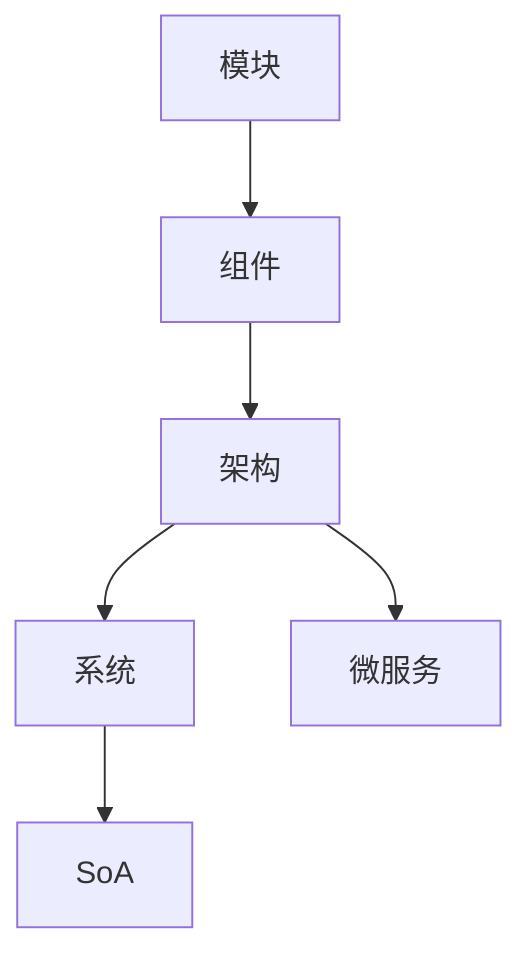

                 

# 软件 2.0 的模块化：融合成最佳整体

> 关键词：
# 1. 背景介绍

## 1.1 问题由来

软件工程自诞生以来，一直围绕“如何构建可维护、可扩展的软件系统”这一核心问题展开。随着技术的发展和应用场景的复杂化，传统的基于大型单体应用的软件架构面临着诸多挑战。如何实现代码的模块化、解耦合、易于维护和扩展，成为软件开发人员需要深思熟虑的问题。

## 1.2 问题核心关键点

软件2.0时代，模块化设计成为软件系统开发的基础。其核心关键点在于如何将大系统拆分为一系列独立、自包含、可复用的模块，并在运行时动态地进行组合和集成，形成最优的整体。该设计理念不仅适用于传统的软件工程，也广泛应用于人工智能、大数据等新兴领域，成为现代软件开发的重要范式。

## 1.3 问题研究意义

模块化设计不仅提高了软件的可维护性和可扩展性，也极大地促进了团队协作和代码复用，降低了开发成本，缩短了项目周期。通过模块化的构建，开发者能够快速响应市场变化，持续迭代和优化系统，提升软件的质量和竞争力。此外，模块化设计还能确保系统架构的清晰性和灵活性，降低复杂系统的设计和调试难度。

## 1.4 问题解决路径

本文章将详细介绍软件2.0时代的模块化设计思路，阐述其原理、操作步骤及具体应用，并通过实例展示模块化设计的实际效果。此外，文章还将探讨模块化设计在人工智能等领域的创新应用，提出未来发展的趋势和面临的挑战，为软件开发人员提供系统的理论指导和实践参考。

# 2. 核心概念与联系

## 2.1 核心概念概述

为了深入理解软件2.0的模块化设计，我们先介绍几个关键概念：

- **模块(Module)**：指具有独立功能、可以重复使用的小程序单元，通常由一组相关的函数和数据组成。

- **组件(Component)**：模块的一种高级形式，通常包含更复杂、更丰富的功能，并可以与其他组件进行组合和集成。

- **架构(Architecture)**：描述系统整体的框架结构，包括组件之间的关系、通信机制和数据流动等。

- **系统(System)**：由一组模块和组件构成的完整应用，能够实现特定的业务功能。

- **微服务(Microservice)**：一种基于组件的架构风格，由一组小型、自治的服务组成，服务之间通过网络进行通信。

- **面向服务架构(SoA)**：将系统划分为服务，服务之间通过接口和标准协议进行交互，实现灵活和高效的系统集成。

这些概念构成了软件2.0时代模块化设计的核心，通过合理的模块划分和组合，可以构建高效、灵活的软件系统。

## 2.2 概念间的关系

这些核心概念之间的逻辑关系可以通过以下Mermaid流程图来展示：



这个流程图展示了模块化设计的基本流程：从独立的模块开始，通过组合成组件，再通过架构进行系统设计，最后形成完整的微服务体系，支持面向服务的架构。

# 3. 核心算法原理 & 具体操作步骤

## 3.1 算法原理概述

软件2.0的模块化设计主要遵循以下原则：

- **独立性**：每个模块或组件应尽可能独立，减少耦合关系。
- **复用性**：模块或组件应具有高内聚度，易于在多个系统中复用。
- **灵活性**：模块或组件应具有高度的灵活性，适应不同的环境和需求变化。
- **可扩展性**：模块或组件应易于扩展和升级，支持新的功能和业务需求。

## 3.2 算法步骤详解

### 3.2.1 模块划分

模块划分的目的是将系统拆分为一系列独立、自包含的模块，每个模块负责特定的功能。以下是模块划分的一般步骤：

1. **识别功能需求**：明确系统的功能需求，识别需要实现的主要功能。

2. **分解功能**：将功能进一步细化为多个子功能，形成基本的功能模块。

3. **设计接口**：为每个模块设计清晰的接口，确定模块之间的通信机制。

4. **实现模块**：根据接口设计实现具体的模块代码，确保模块独立性和可复用性。

### 3.2.2 组件组合

组件组合是将多个模块组合成一个更高层次的组件，实现更复杂的业务功能。以下是组件组合的一般步骤：

1. **选择模块**：从已有的功能模块中选择需要组合的模块。

2. **设计组件接口**：设计组件的输入输出接口，明确组件的功能和调用方式。

3. **实现组件代码**：根据接口设计实现组件代码，确保组件的可复用性和可维护性。

4. **测试和优化**：对组件进行单元测试和集成测试，确保组件的功能和性能。

### 3.2.3 架构设计

架构设计是将多个组件进行合理的组合和集成，形成完整的应用系统。以下是架构设计的一般步骤：

1. **定义架构模式**：选择适合的架构模式，如MVC、事件驱动等。

2. **设计架构层次**：将组件划分为不同的层次，定义组件之间的关系。

3. **实现架构代码**：根据架构设计实现具体的代码，确保系统的可扩展性和灵活性。

4. **测试和优化**：对架构进行全面的测试和优化，确保系统的稳定性和性能。

## 3.3 算法优缺点

### 3.3.1 优点

- **可维护性高**：模块化设计使代码易于理解和维护，减少出错率。
- **可扩展性强**：模块或组件易于添加和修改，支持系统的持续迭代和扩展。
- **可复用性好**：模块或组件可以在多个系统中复用，降低开发成本。
- **灵活性高**：模块或组件具有高度的灵活性，适应不同的环境和需求变化。

### 3.3.2 缺点

- **设计复杂**：模块划分和组合需要仔细考虑，设计复杂度高。
- **接口设计要求高**：接口设计不合理可能导致模块或组件无法正确协同工作。
- **调试困难**：模块或组件数量多，调试复杂，容易产生“蝴蝶效应”。
- **性能开销**：模块或组件的组合和通信可能导致一定的性能开销。

## 3.4 算法应用领域

软件2.0的模块化设计广泛适用于各种软件开发领域，包括但不限于：

- **Web开发**：将Web应用划分为前端、后端、数据库等多个模块，支持微服务架构。
- **移动应用**：将移动应用划分为UI、业务逻辑、数据访问等多个组件，实现模块化开发。
- **企业应用**：将企业系统划分为多个模块或组件，支持灵活的架构设计和扩展。
- **人工智能**：将AI模型和组件模块化，支持模型的组合和集成，实现更高效、更灵活的AI应用。
- **大数据**：将大数据处理流程划分为多个模块，支持分布式处理和扩展。

# 4. 数学模型和公式 & 详细讲解 & 举例说明

## 4.1 数学模型构建

软件2.0的模块化设计可以抽象为数学模型：

$$
S = M_1 \times M_2 \times ... \times M_n
$$

其中 $S$ 表示完整的软件系统，$M_i$ 表示第 $i$ 个模块或组件。

## 4.2 公式推导过程

以一个简单的Web应用为例，其模块化设计的数学模型推导如下：

$$
S = U \times F \times D \times C
$$

其中 $U$ 表示前端UI模块，$F$ 表示后端业务逻辑模块，$D$ 表示数据访问模块，$C$ 表示控制器模块。

## 4.3 案例分析与讲解

### 4.3.1 电商系统设计

电商系统是一个典型的软件2.0应用，其模块化设计如下：

1. **前端模块**：负责展示和交互界面，包括商品展示、购物车、用户登录等功能。

2. **后端模块**：负责业务逻辑处理，包括商品管理、订单处理、支付等功能。

3. **数据库模块**：负责数据存储和访问，包括商品信息、订单信息、用户信息等功能。

4. **缓存模块**：负责缓存频繁访问的数据，提高系统的响应速度。

### 4.3.2 案例分析

电商系统的模块化设计，实现了功能的分离和独立，各模块之间通过接口进行通信，确保了系统的可扩展性和灵活性。同时，模块的复用性和可维护性也得到了提升，大大降低了开发成本。

# 5. 项目实践：代码实例和详细解释说明

## 5.1 开发环境搭建

为了进行模块化设计的实践，我们需要准备开发环境。以下是使用Python进行Flask开发的环境配置流程：

1. 安装Anaconda：从官网下载并安装Anaconda，用于创建独立的Python环境。

2. 创建并激活虚拟环境：
```bash
conda create -n flask-env python=3.8 
conda activate flask-env
```

3. 安装Flask：
```bash
pip install Flask
```

4. 安装Flask-WTF、Jinja2等扩展库：
```bash
pip install Flask-WTF Jinja2
```

5. 安装SQLAlchemy：
```bash
pip install SQLAlchemy
```

完成上述步骤后，即可在`flask-env`环境中开始模块化设计的实践。

## 5.2 源代码详细实现

### 5.2.1 电商系统的模块划分

```python
from flask import Flask, render_template, request
from flask_sqlalchemy import SQLAlchemy
from flask_wtf import FlaskForm
from wtforms import StringField, SubmitField
from wtforms.validators import DataRequired

app = Flask(__name__)

# 数据库配置
app.config['SQLALCHEMY_DATABASE_URI'] = 'sqlite:///example.db'
app.config['SQLALCHEMY_TRACK_MODIFICATIONS'] = False

db = SQLAlchemy(app)

# 模型定义
class Product(db.Model):
    id = db.Column(db.Integer, primary_key=True)
    name = db.Column(db.String(64), unique=True, nullable=False)
    price = db.Column(db.Float, nullable=False)

class Cart(db.Model):
    id = db.Column(db.Integer, primary_key=True)
    product_id = db.Column(db.Integer, db.ForeignKey('product.id'))
    quantity = db.Column(db.Integer, nullable=False)

# 表单定义
class ProductForm(FlaskForm):
    name = StringField('产品名称', validators=[DataRequired()])
    price = StringField('产品价格', validators=[DataRequired()])
    submit = SubmitField('提交')

# 视图函数
@app.route('/')
def index():
    products = Product.query.all()
    return render_template('index.html', products=products)

@app.route('/add', methods=['GET', 'POST'])
def add_product():
    form = ProductForm()
    if form.validate_on_submit():
        product = Product(name=form.name.data, price=form.price.data)
        db.session.add(product)
        db.session.commit()
        return redirect('/')
    return render_template('add_product.html', form=form)

@app.route('/cart')
def cart():
    cart = Cart.query.all()
    return render_template('cart.html', cart=cart)

@app.route('/checkout', methods=['POST'])
def checkout():
    cart = Cart.query.all()
    for item in cart:
        product = Product.query.get(item.product_id)
        product.price *= item.quantity
    total_price = sum([product.price for product in Product.query.all()])
    return render_template('checkout.html', total_price=total_price)
```

## 5.3 代码解读与分析

### 5.3.1 代码结构

电商系统的模块划分如下：

1. **前端模块**：通过Flask框架实现视图函数，负责展示和交互界面。

2. **后端模块**：通过Flask-SQLAlchemy扩展实现数据库操作，负责业务逻辑处理。

3. **数据模块**：通过SQLAlchemy实现数据模型定义，负责数据存储和访问。

4. **表单模块**：通过WTForms库实现表单定义和验证，实现用户输入处理。

### 5.3.2 代码实现

前端模块的实现主要通过视图函数和模板渲染，实现用户的交互界面展示。后端模块的实现主要通过数据库操作和视图函数，实现业务逻辑处理。数据模块的实现主要通过模型定义和数据操作，实现数据的存储和访问。表单模块的实现主要通过表单定义和验证，实现用户输入处理。

## 5.4 运行结果展示

假设我们在电商系统上运行，可以在浏览器中访问系统页面，看到商品列表、添加商品、购物车等功能。

# 6. 实际应用场景

## 6.1 电商系统

电商系统是一个典型的软件2.0应用，通过模块化设计，实现功能的分离和独立，各模块之间通过接口进行通信，确保了系统的可扩展性和灵活性。同时，模块的复用性和可维护性也得到了提升，大大降低了开发成本。

## 6.2 微服务架构

微服务架构是一种基于组件的架构风格，将系统拆分为多个小型、自治的服务，服务之间通过网络进行通信。微服务架构通过模块化设计，实现了系统的灵活和高效集成，支持系统的持续迭代和扩展。

## 6.3 大数据系统

大数据系统通常涉及复杂的数据处理流程，通过模块化设计，可以将数据处理流程划分为多个模块，支持分布式处理和扩展。模块化设计大大提高了系统的可扩展性和灵活性，支持数据的分布式存储和处理。

## 6.4 未来应用展望

随着技术的发展和应用场景的复杂化，软件2.0的模块化设计将继续演进和优化，未来有望在以下几个方面取得突破：

1. **自动化设计和部署**：通过自动化工具和工具链，实现模块化和组件的自动化设计和部署，降低开发成本和提高效率。

2. **智能编排和调度**：通过智能编排和调度技术，实现模块和组件的自动组合和调度，支持更高效的运行和扩展。

3. **可观测性和可监控性**：通过可观测性和可监控性技术，实现模块和组件的实时监控和诊断，提升系统的稳定性和可靠性。

4. **安全和隐私保护**：通过安全和隐私保护技术，实现模块和组件的安全和隐私保护，确保系统的安全性和合规性。

# 7. 工具和资源推荐

## 7.1 学习资源推荐

为了帮助开发者系统掌握软件2.0的模块化设计思路，这里推荐一些优质的学习资源：

1. 《软件设计模式》：这本书系统介绍了软件设计模式的基本概念和应用，是掌握模块化设计的经典之作。

2. 《设计模式：可复用面向对象软件的基础》：这本书详细介绍了23种设计模式及其应用场景，是软件开发者的必备参考。

3. 《微服务设计模式》：这本书介绍了微服务架构的设计模式和最佳实践，是微服务架构的权威指南。

4. 《Flask官方文档》：Flask框架的官方文档，提供了完整的教程和样例代码，是学习Flask的必读资源。

5. 《SQLAlchemy官方文档》：SQLAlchemy库的官方文档，提供了详细的使用教程和示例，是学习数据库操作和ORM的必备资源。

6. 《WTForms官方文档》：WTForms库的官方文档，提供了完整的表单设计和验证方法，是学习表单处理的必备资源。

通过对这些资源的学习实践，相信你一定能够快速掌握软件2.0的模块化设计思路，并用于解决实际的开发问题。

## 7.2 开发工具推荐

高效的开发离不开优秀的工具支持。以下是几款用于模块化设计开发的常用工具：

1. Flask：基于Python的开源Web框架，灵活轻量，支持模块化和组件设计，是构建Web应用的首选框架。

2. SQLAlchemy：基于Python的开源ORM库，支持复杂的数据模型设计和操作，是实现数据库访问的首选工具。

3. WTForms：基于Python的开源表单库，支持灵活的表单设计和验证，是实现用户输入处理的首选工具。

4. PyCharm：JetBrains开发的Python开发工具，支持多种框架和库，提供全面的开发环境和调试工具。

5. Docker：基于Linux容器的开源平台，支持模块和组件的容器化部署和运维，是实现微服务架构的首选平台。

6. GitLab CI/CD：GitLab提供的CI/CD工具，支持模块和组件的自动化构建、测试和部署，是实现持续集成和持续部署的首选工具。

合理利用这些工具，可以显著提升模块化设计的开发效率，加快创新迭代的步伐。

## 7.3 相关论文推荐

软件2.0的模块化设计源于学界的持续研究。以下是几篇奠基性的相关论文，推荐阅读：

1. "Design Patterns: Elements of Reusable Object-Oriented Software"：这本书详细介绍了23种设计模式及其应用，是软件设计模式的权威指南。

2. "Microservices: A lightweight architecture for mobile and cloud apps"：这篇文章介绍了微服务架构的基本概念和设计模式，是微服务架构的权威文献。

3. "Designing Distributed Systems"：这本书详细介绍了分布式系统设计的基本概念和设计模式，是分布式系统设计的权威指南。

4. "The Web Application in a Nutshell"：这本书详细介绍了Web应用开发的基本概念和最佳实践，是Web应用开发的经典之作。

5. "A Survey on Data-Driven Software Architectures"：这篇文章综述了数据驱动架构的基本概念和设计模式，是数据驱动架构的权威文献。

这些论文代表了大规模软件系统设计和模块化设计的最新进展，通过学习这些前沿成果，可以帮助研究者把握学科前进方向，激发更多的创新灵感。

除上述资源外，还有一些值得关注的前沿资源，帮助开发者紧跟模块化设计技术的最新进展，例如：

1. arXiv论文预印本：人工智能领域最新研究成果的发布平台，包括大量尚未发表的前沿工作，学习前沿技术的必读资源。

2. 业界技术博客：如Google、Microsoft、Amazon等顶尖公司的官方博客，第一时间分享他们的最新研究成果和洞见。

3. 技术会议直播：如OOPSLA、ICSE、SIGSOFT等软件工程领域顶会现场或在线直播，能够聆听到专家们的前沿分享，开拓视野。

4. GitHub热门项目：在GitHub上Star、Fork数最多的软件相关项目，往往代表了该技术领域的发展趋势和最佳实践，值得去学习和贡献。

5. 行业分析报告：各大咨询公司如McKinsey、PwC等针对软件工程领域的分析报告，有助于从商业视角审视技术趋势，把握应用价值。

总之，对于软件2.0的模块化设计的学习和实践，需要开发者保持开放的心态和持续学习的意愿。多关注前沿资讯，多动手实践，多思考总结，必将收获满满的成长收益。

# 8. 总结：未来发展趋势与挑战

## 8.1 研究成果总结

本文对软件2.0的模块化设计进行了全面系统的介绍。首先阐述了模块化设计的基本概念和核心关键点，明确了模块化设计在软件系统开发中的重要地位。其次，从原理到实践，详细讲解了模块化设计的数学模型和操作步骤，给出了模块化设计任务开发的完整代码实例。同时，本文还广泛探讨了模块化设计在软件工程、人工智能等领域的应用前景，展示了模块化设计的巨大潜力。

通过本文的系统梳理，可以看到，软件2.0的模块化设计已经成为现代软件开发的重要范式，极大地提高了软件的可维护性和可扩展性，催生了更多的创新应用和实践。未来，伴随技术的发展和应用场景的复杂化，模块化设计将不断演进和优化，为软件开发人员提供更高效、更灵活的开发工具和方法。

## 8.2 未来发展趋势

展望未来，软件2.0的模块化设计将呈现以下几个发展趋势：

1. **自动化和智能化**：通过自动化工具和智能化技术，实现模块化和组件的自动化设计和部署，降低开发成本和提高效率。

2. **微服务架构的普及**：微服务架构将继续发展和普及，成为构建大规模分布式系统的首选架构风格。

3. **模块化和组件的标准化**：通过标准化设计和开发，实现模块和组件的通用性和互操作性，支持更多的应用场景和系统集成。

4. **可观测性和可监控性**：通过可观测性和可监控性技术，实现模块和组件的实时监控和诊断，提升系统的稳定性和可靠性。

5. **安全和隐私保护**：通过安全和隐私保护技术，实现模块和组件的安全和隐私保护，确保系统的安全性和合规性。

以上趋势凸显了软件2.0的模块化设计技术的广阔前景。这些方向的探索发展，必将进一步提升软件系统的性能和应用范围，为人类社会带来更高效、更智能的开发和应用体验。

## 8.3 面临的挑战

尽管软件2.0的模块化设计已经取得了瞩目成就，但在迈向更加智能化、普适化应用的过程中，它仍面临着诸多挑战：

1. **设计复杂性**：模块划分和组合需要仔细考虑，设计复杂度高，增加了开发难度和维护成本。

2. **接口设计要求高**：接口设计不合理可能导致模块或组件无法正确协同工作，影响系统性能和稳定性。

3. **调试困难**：模块或组件数量多，调试复杂，容易产生“蝴蝶效应”，增加了开发和维护的难度。

4. **性能开销**：模块或组件的组合和通信可能导致一定的性能开销，需要优化和改进。

5. **安全和隐私保护**：模块和组件的安全和隐私保护需要深入考虑，确保系统的安全性和合规性。

6. **标准化和互操作性**：模块和组件的标准化和互操作性需要进一步提升，支持更广泛的应用场景和系统集成。

这些挑战凸显了软件2.0的模块化设计技术的复杂性和难度，需要开发者在实践过程中不断优化和改进，确保系统的稳定性和性能。

## 8.4 研究展望

面对软件2.0的模块化设计所面临的种种挑战，未来的研究需要在以下几个方面寻求新的突破：

1. **自动化设计和部署**：通过自动化工具和智能化技术，实现模块化和组件的自动化设计和部署，降低开发成本和提高效率。

2. **智能编排和调度**：通过智能编排和调度技术，实现模块和组件的自动组合和调度，支持更高效的运行和扩展。

3. **可观测性和可监控性**：通过可观测性和可监控性技术，实现模块和组件的实时监控和诊断，提升系统的稳定性和可靠性。

4. **安全和隐私保护**：通过安全和隐私保护技术，实现模块和组件的安全和隐私保护，确保系统的安全性和合规性。

5. **标准化和互操作性**：通过标准化设计和开发，实现模块和组件的通用性和互操作性，支持更多的应用场景和系统集成。

这些研究方向的探索，必将引领软件2.0的模块化设计技术迈向更高的台阶，为软件开发人员提供更高效、更灵活的开发工具和方法。相信随着技术的发展和应用的深入，软件2.0的模块化设计将继续演进和优化，为软件开发带来更多的创新和突破。

# 9. 附录：常见问题与解答

**Q1：模块化设计和组件化设计有什么区别？**

A: 模块化设计通常指将一个大系统划分为多个独立、自包含的模块，每个模块负责特定的功能。而组件化设计则指将模块进行进一步的组合和封装，形成更复杂、更灵活的组件，组件之间通过接口进行通信。

**Q2：模块化设计的优点和缺点是什么？**

A: 模块化设计的优点包括：
- **可维护性高**：模块独立性和复用性高，易于理解和维护。
- **可扩展性强**：模块易于添加和修改，支持系统的持续迭代和扩展。
- **可复用性好**：模块可以复用在多个系统中，降低开发成本。

模块化设计的缺点包括：
- **设计复杂**：模块划分和组合需要仔细考虑，设计复杂度高。
- **接口设计要求高**：接口设计不合理可能导致模块无法正确协同工作。
- **调试困难**：模块数量多，调试复杂，容易产生“蝴蝶效应”。
- **性能开销**：模块的组合和通信可能导致一定的性能开销。

**Q3：如何选择合适的模块划分方式？**

A: 选择合适的模块划分方式需要考虑系统的功能和需求，以及模块的独立性和复用性。通常采用以下方法：
- **功能拆分**：将系统按照功能进行拆分，形成独立的功能模块。
- **领域拆分**：按照业务领域进行拆分，形成独立的业务模块。
- **层次拆分**：按照层次结构进行拆分，形成独立的功能层。

**Q4：如何优化模块之间的接口设计？**

A: 优化模块之间的接口设计需要考虑接口的清晰性和稳定性。通常采用以下方法：
- **接口定义**：清晰定义接口的输入输出，明确模块之间的通信方式。
- **接口文档**：编写详细的接口文档，描述接口的功能和使用方式。
- **接口测试**：进行接口测试，确保接口的正确性和稳定性。

**Q5：模块化设计在实际应用中有哪些典型的成功案例？**

A: 模块化设计在实际应用中有许多典型的成功案例，例如：
- **Spring框架**：Spring框架通过模块化和组件化设计，实现了灵活的Web应用开发和组件复用。
- **React库**：React库通过组件化设计，实现了高效的UI组件开发和复用。
- **微服务架构**：微服务架构通过模块化和组件化设计，实现了系统的灵活和高效集成。

这些成功案例展示了模块化设计的广泛应用和巨大潜力，为软件开发提供了宝贵的经验和参考。

---

作者：禅与计算机程序设计艺术 / Zen and the Art of Computer Programming

