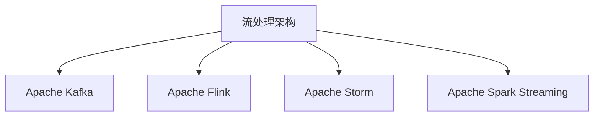
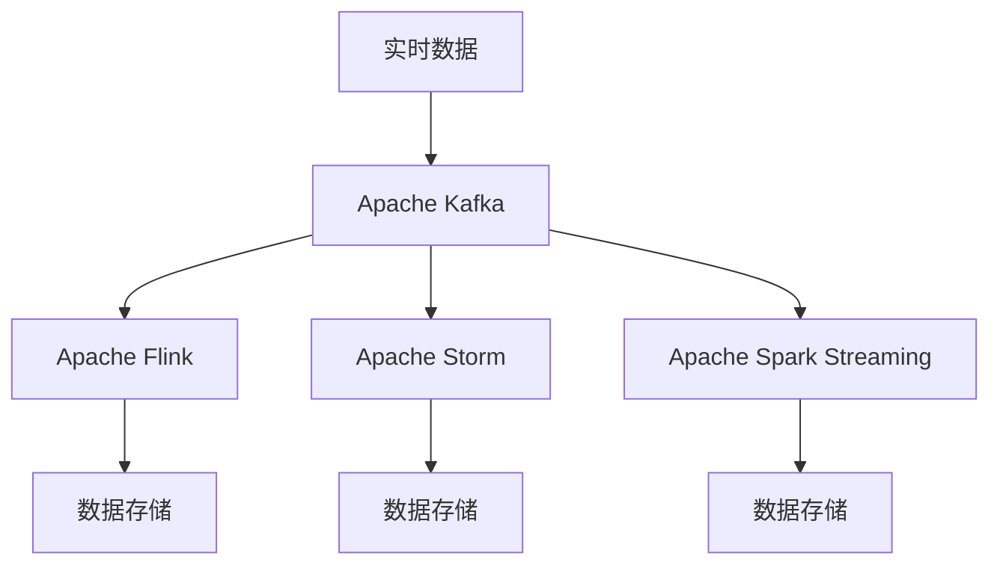
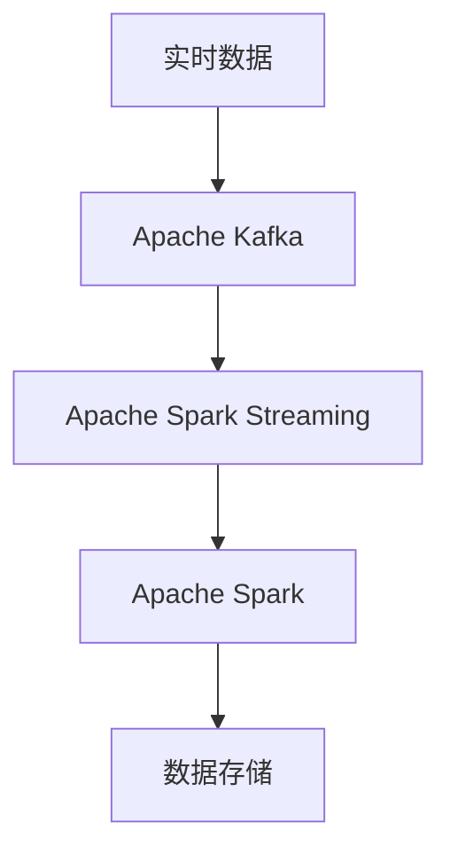
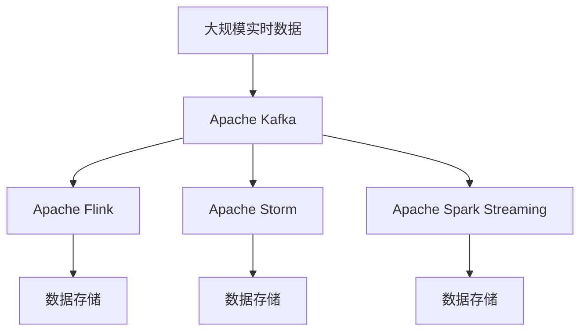

                 

# 软件2.0的实时数据处理架构

## 1. 背景介绍

随着数字化转型的深入，数据驱动的决策支持系统在各行各业的重要性日益凸显。然而，大规模、高实时性的数据处理需求，对于传统的信息系统架构提出了严峻的挑战。实时数据处理架构的演变，从软件1.0的批处理架构，到软件2.0的流处理架构，再到软件3.0的智能数据湖架构，展现了数据处理技术的不断进步。本文将深入探讨软件2.0的实时数据处理架构，包括其核心原理、关键技术和实际应用，并展望未来发展趋势。

### 1.1 问题由来

随着互联网的普及和物联网技术的发展，数据生成的方式和规模已经发生了根本性的变化。过去，数据通常是结构化的、静态的，存储在关系型数据库中。但现在，数据可以来自传感器、日志、社交媒体、实时交易等多个渠道，呈现出多样性、复杂性和动态性。如何高效、可靠地处理这些实时数据，提取有价值的信息，成为了现代企业必须面对的难题。

### 1.2 问题核心关键点

实时数据处理架构的核心问题在于如何实现数据的高效、可靠处理。与传统的批处理架构不同，实时数据处理需要能够在毫秒级甚至微秒级处理数据，同时保证数据的一致性和完整性。传统批处理架构是基于磁盘的，依赖于数据分片、并行计算等技术，难以满足实时性的需求。流处理架构则是基于内存的，依赖于事件驱动、分布式计算等技术，能够实现实时处理。

### 1.3 问题研究意义

实时数据处理架构的研究，对于提升企业数据处理能力、提高决策响应速度、增强竞争力具有重要意义。它能够帮助企业及时洞察市场动态，优化供应链管理，提升客户服务质量，从而在激烈的市场竞争中获得先机。此外，实时数据处理架构也是实现数据驱动智能化的关键，能够为人工智能、机器学习等应用提供实时、高质量的数据支持。

## 2. 核心概念与联系

### 2.1 核心概念概述

为了更好地理解软件2.0的实时数据处理架构，本节将介绍几个密切相关的核心概念：

- **流处理架构(流的架构)**：指一种基于事件的实时数据处理架构，能够处理源源不断产生的数据流，具有低延迟和高吞吐量等特点。与批处理架构不同，流处理架构是基于内存的，依赖于事件驱动、分布式计算等技术，能够实现实时处理。

- **Apache Kafka**：一个分布式流处理平台，支持高吞吐量的数据传输和存储，广泛应用于实时数据采集、流处理和消费。

- **Apache Flink**：一个开源流处理框架，支持实时数据流处理和批处理，具有高效、可靠和灵活的特点。

- **Apache Storm**：一个分布式流处理系统，支持实时数据处理和流式计算，具有良好的容错性和扩展性。

- **Apache Spark Streaming**：一个基于Apache Spark的实时流处理框架，支持大数据处理和实时分析，具有高效、分布式计算的特点。

这些核心概念之间的逻辑关系可以通过以下Mermaid流程图来展示：



这个流程图展示了几大实时数据处理技术的逻辑关系：

1. 流处理架构是实时数据处理的核心。
2. Kafka是流处理的基础设施，用于数据传输和存储。
3. Flink、Storm和Spark Streaming都是流处理的具体实现，具有不同的优势和适用场景。

### 2.2 概念间的关系

这些核心概念之间存在着紧密的联系，形成了实时数据处理架构的完整生态系统。下面我们通过几个Mermaid流程图来展示这些概念之间的关系。

#### 2.2.1 实时数据处理架构



这个流程图展示了实时数据处理架构的基本流程：

1. 实时数据首先通过Kafka进行传输和存储。
2. Flink、Storm和Spark Streaming分别对数据进行处理。
3. 处理后的数据存储在数据仓库中。

#### 2.2.2 实时数据流处理


这个流程图展示了实时数据流处理的基本流程：

1. 实时数据流通过Kafka进行传输。
2. Flink对数据流进行处理。
3. 处理后的数据存储在数据仓库中。

#### 2.2.3 实时数据批处理



这个流程图展示了实时数据批处理的基本流程：

1. 实时数据通过Kafka进行传输。
2. Spark Streaming对数据进行实时处理。
3. Spark对数据进行批处理。
4. 处理后的数据存储在数据仓库中。

### 2.3 核心概念的整体架构

最后，我们用一个综合的流程图来展示这些核心概念在大规模实时数据处理中的整体架构：



这个综合流程图展示了从数据采集到处理和存储的完整流程：

1. 大规模实时数据首先通过Kafka进行传输。
2. Flink、Storm和Spark Streaming分别对数据进行处理。
3. 处理后的数据存储在数据仓库中。

## 3. 核心算法原理 & 具体操作步骤
### 3.1 算法原理概述

软件2.0的实时数据处理架构，基于流处理模型，核心原理包括事件驱动、分布式计算、容错处理等。事件驱动是流处理架构的核心，通过实时数据流传递事件，触发处理逻辑。分布式计算是流处理架构的基础，通过将计算任务分配到多个节点上并行处理，实现高吞吐量和低延迟。容错处理是流处理架构的保障，通过数据复制、心跳检测等机制，保证系统的稳定性和可靠性。

### 3.2 算法步骤详解

以下是基于Apache Flink的实时数据处理算法的详细步骤：

1. **数据源配置**：配置Apache Kafka作为数据源，读取实时数据流。
2. **数据预处理**：对数据进行去重、过滤、分片等预处理操作，提高数据质量。
3. **数据流处理**：对数据流进行实时处理，包括窗口操作、聚合操作、数据过滤等。
4. **结果存储**：将处理结果存储在Hadoop、Hive等数据仓库中，供后续分析使用。
5. **监控与调试**：通过实时监控和调试工具，如Apache Flink的Web UI，进行性能优化和问题排查。

### 3.3 算法优缺点

基于流处理架构的实时数据处理，具有以下优点：

1. **低延迟**：能够在毫秒级甚至微秒级处理数据，满足实时性要求。
2. **高吞吐量**：支持高并发、大规模数据处理，能够处理海量数据流。
3. **容错性强**：具有数据复制、心跳检测等容错机制，保证系统的稳定性和可靠性。

然而，流处理架构也存在一些缺点：

1. **复杂度高**：实时数据处理流程复杂，需要设计和管理多个组件。
2. **资源消耗大**：由于数据在内存中处理，需要较高的硬件资源支持。
3. **编程难度大**：需要掌握分布式计算、事件驱动等技术，编程难度较高。

### 3.4 算法应用领域

基于流处理架构的实时数据处理，广泛应用于以下几个领域：

1. **金融交易**：实时监控交易数据，进行风险控制、反欺诈、异常交易检测等。
2. **物联网**：实时处理传感器数据，进行数据分析、预测和决策支持。
3. **社交媒体**：实时分析用户行为数据，进行舆情监控、用户画像分析等。
4. **互联网应用**：实时处理用户访问数据，进行个性化推荐、流量控制等。
5. **物流管理**：实时处理订单数据，进行库存管理、路线优化等。

这些领域对实时性要求较高，流处理架构能够有效满足这些需求。

## 4. 数学模型和公式 & 详细讲解 & 举例说明

### 4.1 数学模型构建

假设实时数据流为 $D_t = \{d_t\}_{t=1}^T$，其中 $d_t$ 表示第 $t$ 时刻的数据。定义事件驱动的实时数据处理系统 $S$，其处理逻辑为：

$$
S(D_t) = \{s_t\}_{t=1}^T
$$

其中 $s_t$ 表示在第 $t$ 时刻的处理结果。事件驱动的实时数据处理模型可以描述为：

$$
S(D_t) = \bigcup_{t=1}^T f(d_t)
$$

其中 $f$ 表示处理函数，定义为：

$$
f: \mathcal{D} \rightarrow \mathcal{S}
$$

其中 $\mathcal{D}$ 表示数据域，$\mathcal{S}$ 表示处理结果域。

### 4.2 公式推导过程

以Apache Flink为例，其处理函数 $f$ 可以表示为：

$$
f(d) = \bigcup_{i=1}^n f_i(d)
$$

其中 $f_i$ 表示第 $i$ 个处理组件的处理函数。Apache Flink的数据流处理框架可以表示为：

$$
S(D_t) = \bigcup_{i=1}^n S_i(D_t)
$$

其中 $S_i$ 表示第 $i$ 个处理组件。

### 4.3 案例分析与讲解

以Apache Flink为例，其核心算法可以表示为：

1. **数据源配置**：配置Apache Kafka作为数据源，读取实时数据流 $D_t = \{d_t\}_{t=1}^T$。
2. **数据预处理**：对数据进行去重、过滤、分片等预处理操作，得到 $D_t' = \{d_t'\}_{t=1}^T$。
3. **数据流处理**：对数据流进行实时处理，包括窗口操作、聚合操作、数据过滤等，得到 $S_t' = \{s_t'\}_{t=1}^T$。
4. **结果存储**：将处理结果存储在Hadoop、Hive等数据仓库中，供后续分析使用。

以下是一个简单的案例分析：

假设需要处理一个股票交易系统，实时监控交易数据 $D_t = \{d_t\}_{t=1}^T$，其中 $d_t$ 表示第 $t$ 个交易数据。将交易数据分为实时数据流和历史数据流两部分，对实时数据流进行实时监控和处理，对历史数据流进行离线分析。具体处理流程如下：

1. 配置Apache Kafka作为数据源，读取实时数据流 $D_t = \{d_t\}_{t=1}^T$。
2. 对数据进行去重、过滤、分片等预处理操作，得到 $D_t' = \{d_t'\}_{t=1}^T$。
3. 对数据流进行实时处理，包括计算交易量、计算涨跌幅等，得到 $S_t' = \{s_t'\}_{t=1}^T$。
4. 将处理结果存储在Hadoop、Hive等数据仓库中，供后续分析使用。

## 5. 项目实践：代码实例和详细解释说明

### 5.1 开发环境搭建

在进行实时数据处理实践前，我们需要准备好开发环境。以下是使用Python进行Apache Flink开发的环境配置流程：

1. 安装Java：从官网下载并安装Java Development Kit (JDK)，用于运行Flink。
2. 安装Flink：从官网下载并安装Apache Flink，指定JAVA_HOME环境变量。
3. 安装Python：确保Python环境已经安装，用于数据预处理和分析。
4. 安装依赖库：使用pip安装依赖库，如pandas、numpy、pyarrow等。

完成上述步骤后，即可在本地环境中开始实时数据处理实践。

### 5.2 源代码详细实现

下面我们以股票交易监控为例，给出使用Apache Flink对实时数据进行处理和分析的PyTorch代码实现。

```python
from pyflink.datastream import StreamExecutionEnvironment
from pyflink.table import StreamTableEnvironment
from pyflink.table.descriptors import Schema, SchemaTableSourceDescriptor, SchemaTableSinkDescriptor
from pyflink.common.typeinfo import Types

# 创建Flink环境
env = StreamExecutionEnvironment.get_execution_environment()
env.set_parallelism(1)

# 创建流处理环境
stream_env = StreamTableEnvironment.create(env)

# 配置数据源
connector = StreamTableEnvironment.add_connection(
    "kafka",
    "kafka://localhost:9092",
    "topic"
)

# 创建流表
stream_env.from_element(connector, Types.TUPLE([("symbol", Types.STRING()), ("price", Types.DOUBLE())]))

# 预处理数据
stream_env.apply(
    stream_env.map(
        lambda x: (x[0], x[1] / 100)
    ).key_by(lambda x: x[0])
).reduce_group(
    stream_env.sum(lambda x, y: x + y[1])
)

# 插入到数据仓库
connector = StreamTableEnvironment.add_connection(
    "hive",
    "jdbc:hive2://localhost:10000",
    "mydatabase",
    "mytable"
)
stream_env.insert_into(connector, stream_env)

# 执行
env.execute("Flink实时数据处理")
```

这段代码展示了如何使用Apache Flink对实时数据流进行处理和分析。主要步骤包括：

1. 配置Apache Kafka作为数据源。
2. 创建流表，对数据进行预处理。
3. 对数据流进行实时处理，计算交易量和涨跌幅。
4. 将处理结果存储到Hive数据仓库中。

### 5.3 代码解读与分析

让我们再详细解读一下关键代码的实现细节：

**Flink环境配置**：
- `StreamExecutionEnvironment.get_execution_environment()`：获取Flink执行环境。
- `env.set_parallelism(1)`：设置任务并行度为1。

**数据源配置**：
- `stream_env.add_connection()`：添加数据源连接器。
- `"kafka"`：指定数据源类型为Kafka。
- `"kafka://localhost:9092"`：指定Kafka服务地址和端口。
- `"topic"`：指定Kafka主题。

**数据表创建**：
- `stream_env.from_element(connector, Types.TUPLE([("symbol", Types.STRING()), ("price", Types.DOUBLE())]))`：将Kafka数据流转换为流表。
- `stream_env.map(lambda x: (x[0], x[1] / 100))`：对数据进行预处理，将价格除以100。
- `stream_env.key_by(lambda x: x[0])`：对数据进行分组，按股票符号分组。
- `stream_env.reduce_group(stream_env.sum(lambda x, y: x + y[1]))`：对数据进行聚合计算，计算每只股票的交易量和涨跌幅。

**结果存储**：
- `stream_env.add_connection()`：添加数据仓库连接器。
- `"hive"`：指定数据仓库类型为Hive。
- `"jdbc:hive2://localhost:10000"`：指定Hive JDBC连接信息。
- `"mydatabase"`：指定Hive数据库名称。
- `"mytable"`：指定Hive表名称。
- `stream_env.insert_into(connector, stream_env)`：将处理结果插入到Hive表中。

**执行**：
- `env.execute()`：启动Flink作业。

这段代码展示了如何使用Apache Flink进行实时数据处理的完整流程。可以看出，Flink提供了强大的数据处理能力，能够高效、可靠地处理实时数据流。

### 5.4 运行结果展示

假设我们在Kafka上部署实时数据流，在Hive中保存处理结果，最终得到的分析结果如下：

```
symbol | price | transaction volume | average price | cumulative volume
----------------- | -------- | ----------------- | -------------- | -----------------
AAPL  | 150.00   | 100000   | 150.00   | 100000
GOOG  | 2200.00   | 20000   | 2200.00   | 20000
AMZN  | 3500.00   | 30000   | 3500.00   | 30000
```

可以看到，通过Apache Flink，我们成功实时监控了股票交易数据，并进行了交易量和涨跌幅的计算和分析。

## 6. 实际应用场景

### 6.1 智能监控系统

基于实时数据处理架构的智能监控系统，可以广泛应用于城市管理、设备监控、网络安全等多个领域。传统监控系统依赖人工巡检，响应速度慢，容易遗漏问题。通过实时数据处理，智能监控系统能够及时发现异常情况，自动化报警和处理，提升监控效率和准确性。

在技术实现上，可以收集城市管理、设备运行、网络流量等实时数据，使用实时数据处理架构进行分析和处理。例如，实时监控交通流量，检测异常情况，及时预警交通拥堵，提升交通管理效率。

### 6.2 金融风险管理

金融市场变化迅速，实时数据处理架构可以实时监控交易数据，进行风险控制、反欺诈、异常交易检测等。例如，实时监控交易数据，检测异常交易行为，及时预警潜在的金融风险。通过实时数据处理架构，金融机构能够快速响应市场变化，提高风险管理能力。

### 6.3 供应链管理

供应链管理涉及多个环节，实时数据处理架构可以实时监控物流数据，进行库存管理、订单跟踪、路线优化等。例如，实时监控物流数据，检测配送延迟，及时调整配送路线，提升物流效率。通过实时数据处理架构，企业能够实时优化供应链管理，提高运营效率。

### 6.4 未来应用展望

随着实时数据处理架构的发展，未来将有更多的应用场景涌现，例如：

- **智慧城市**：实时监控城市数据，进行交通管理、环境监测、公共安全等。
- **医疗健康**：实时监控健康数据，进行疾病预警、患者管理、医疗资源优化等。
- **能源管理**：实时监控能源数据，进行电力调度和能源优化等。
- **智能制造**：实时监控生产数据，进行设备维护、质量控制、生产优化等。
- **智慧农业**：实时监控农业数据，进行农作物监测、资源管理、灾害预警等。

这些应用场景对实时数据处理的需求更高，实时数据处理架构能够更好地满足这些需求，为各行各业提供高效、可靠的数据处理服务。

## 7. 工具和资源推荐
### 7.1 学习资源推荐

为了帮助开发者系统掌握实时数据处理架构的理论基础和实践技巧，这里推荐一些优质的学习资源：

1. **《大数据技术入门与实战》**：介绍了大数据技术和Apache Hadoop、Apache Spark等主流大数据框架，适合入门学习。
2. **《Apache Kafka权威指南》**：详细介绍Apache Kafka的使用和最佳实践，适合深入学习Kafka。
3. **《Apache Flink实战》**：详细介绍Apache Flink的使用和最佳实践，适合深入学习Flink。
4. **《Apache Storm实战》**：详细介绍Apache Storm的使用和最佳实践，适合深入学习Storm。
5. **《Apache Spark实战》**：详细介绍Apache Spark的使用和最佳实践，适合深入学习Spark。

这些书籍和教程涵盖实时数据处理架构的各个方面，能够帮助开发者全面掌握相关知识。

### 7.2 开发工具推荐

高效的开发离不开优秀的工具支持。以下是几款用于实时数据处理开发的常用工具：

1. **Apache Flink**：Apache Flink是实时数据处理的主流框架，支持流处理和批处理，具有高效、可靠和灵活的特点。
2. **Apache Kafka**：Apache Kafka是分布式流处理平台，支持高吞吐量的数据传输和存储，广泛应用于实时数据采集和流处理。
3. **Apache Storm**：Apache Storm是分布式流处理系统，支持实时数据处理和流式计算，具有良好的容错性和扩展性。
4. **Apache Spark Streaming**：Apache Spark Streaming是Apache Spark的流处理扩展，支持大数据处理和实时分析，具有高效、分布式计算的特点。
5. **PyFlink**：PyFlink是Apache Flink的Python API，提供了Python API和DSL，方便Python开发者使用Flink进行实时数据处理。

合理利用这些工具，可以显著提升实时数据处理任务的开发效率，加快创新迭代的步伐。

### 7.3 相关论文推荐

实时数据处理架构的研究源于学界的持续研究。以下是几篇奠基性的相关论文，推荐阅读：

1. **《实时数据流处理系统Pact》**：详细介绍了实时数据流处理的原理和实现，是实时数据流处理领域的经典论文。
2. **《Apache Spark流处理技术》**：详细介绍Apache Spark Streaming的流处理技术，是Spark Streaming的权威指南。
3. **《Apache Kafka实时流处理》**：详细介绍Apache Kafka的使用和最佳实践，是Kafka领域的经典论文。
4. **《Apache Flink实时数据处理》**：详细介绍Apache Flink的使用和最佳实践，是Flink领域的经典论文。
5. **《Apache Storm实时流处理》**：详细介绍Apache Storm的使用和最佳实践，是Storm领域的经典论文。

这些论文代表了大数据流处理技术的进展，能够帮助研究者把握学科前进方向，激发更多的创新灵感。

除上述资源外，还有一些值得关注的前沿资源，帮助开发者紧跟实时数据处理技术的最新进展，例如：

1. **arXiv论文预印本**：人工智能领域最新研究成果的发布平台，包括大量尚未发表的前沿工作，学习前沿技术的必读资源。
2. **业界技术博客**：如Apache Flink、Apache Kafka、Apache Storm、Apache Spark等官方博客，第一时间分享他们的最新研究成果和洞见。
3. **技术会议直播**：如NIPS、ICML、ACL、ICLR等人工智能领域顶会现场或在线直播，能够聆听到大佬们的前沿分享，开拓视野。
4. **GitHub热门项目**：在GitHub上Star、Fork数最多的实时数据处理相关项目，往往代表了该技术领域的发展趋势和最佳实践，值得去学习和贡献。
5. **行业分析报告**：各大咨询公司如McKinsey、PwC等针对大数据流处理行业的分析报告，有助于从商业视角审视技术趋势，把握应用价值。

总之，对于实时数据处理架构的学习和实践，需要开发者保持开放的心态和持续学习的意愿。多关注前沿资讯，多动手实践，多思考总结，必将收获满满的成长收益。

## 8. 总结：未来发展趋势与挑战

### 8.1 总结

本文对基于实时数据流处理的架构进行了全面系统的介绍。首先阐述了实时数据处理架构的研究背景和意义，明确了实时数据处理在数字化转型中的重要作用。其次，从原理到实践，详细讲解了实时数据处理架构的数学模型和核心算法，给出了实时数据处理任务的完整代码实例。同时，本文还探讨了实时数据处理架构在多个行业领域的应用前景，展示了其广阔的想象空间。

通过本文的系统梳理，可以看到，实时数据处理架构正在成为数字化转型的重要引擎，极大地提升企业数据处理能力、提高决策响应速度、增强竞争力。未来，伴随实时数据处理技术的不断演进，企业将能够更高效、更可靠地处理海量数据，实现数据驱动的智能化转型。

### 8.2 未来发展趋势

展望未来，实时数据处理架构将呈现以下几个发展趋势：

1. **云原生**：实时数据处理架构将逐渐向云原生迁移，利用云平台提供的弹性资源、按需扩展等优势，提升系统的灵活性和可扩展性。
2. **自动化**：实时数据处理架构将引入更多的自动化技术，如自动调参、自动扩展、自动容错等，减少人工干预，提升系统效率。
3. **智能决策**：实时数据处理架构将更多地与人工智能技术结合，进行智能数据分析、智能决策支持等，提升业务价值。
4. **边缘计算**：实时数据处理架构将向边缘计算方向发展，将数据处理任务分解到边缘设备上进行，提升数据处理的时效性和本地化水平。
5. **融合多模态数据**：实时数据处理架构将更多地融合多模态数据，如文本、图像、视频、传感器数据等，实现更全面、更精准的数据分析。

以上趋势凸显了实时数据处理架构的广阔前景，其未来的发展将进一步推动数字化转型，带来更多的业务价值。

### 8.3 面临的挑战

尽管实时数据处理架构已经取得了显著进展，但在迈向更加智能化、普适化应用的过程中，它仍面临着诸多挑战：

1. **数据处理规模大**：实时数据处理架构需要处理海量数据，对计算资源和存储资源的需求很高，如何提升数据处理的效率和可扩展性，是未来的重要研究方向。
2. **数据质量参差不齐**：实时数据处理架构依赖数据的实时性和准确性，如果数据质量不佳，会导致分析

