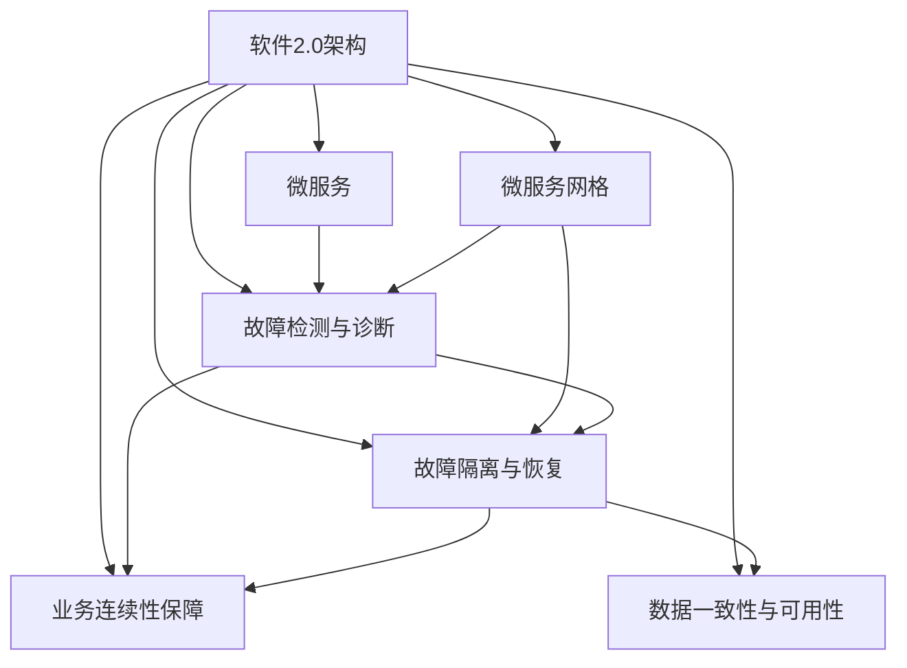

                 

# 软件2.0的灾难恢复策略

## 1. 背景介绍

### 1.1 问题由来

在当今数字化和信息化迅速发展的时代，软件系统已经成为各行各业的核心基础设施，其稳定性和可靠性直接关系到企业的生存与发展。然而，软件系统在开发、部署和运行过程中，不可避免地会出现各种故障和异常，这些故障可能会导致系统宕机、数据丢失、业务中断等严重后果，给企业带来巨大的经济损失和声誉风险。

为了应对这些问题，软件系统需要具备灾难恢复（Disaster Recovery, DR）能力，能够在系统发生故障时，快速恢复数据和业务，减少损失，保障业务连续性。然而，传统的灾难恢复策略往往依赖于备份、冗余等技术手段，难以适应大规模分布式系统的复杂性和不确定性。

近年来，随着云计算、分布式存储和微服务架构等技术的兴起，软件系统逐渐从传统的软件1.0（Monolithic Architecture）向软件2.0（Microservices Architecture）方向演进。软件2.0以其高可扩展性、高可用性、高弹性等特点，成为了现代软件架构的重要方向。

### 1.2 问题核心关键点

在软件2.0架构中，如何设计和实现有效的灾难恢复策略，成为了新的挑战。由于微服务架构具有高并发、高异构、高自治等特点，传统的事故恢复方法难以直接应用。因此，需要引入新的思路和手段，以适应软件2.0的特点，构建高效、可靠、灵活的灾难恢复系统。

核心关键点包括：

1. **故障检测与诊断**：如何快速准确地检测系统故障，并定位故障源。
2. **故障隔离与恢复**：如何隔离故障影响范围，快速恢复受损组件。
3. **业务连续性保障**：如何保证系统业务连续性，最小化故障对业务的影响。
4. **数据一致性和可用性**：如何在故障恢复过程中，保持数据的一致性和可用性。

这些关键点构成了软件2.0架构下灾难恢复策略的核心内容，其设计和实现对于保障系统的高可用性和业务连续性具有重要意义。

### 1.3 问题研究意义

有效的灾难恢复策略是软件2.0架构能否成功部署和运行的关键。通过构建完善的灾难恢复系统，可以：

1. **提升系统可靠性**：减少系统故障的发生概率，提高系统的可用性和可靠性。
2. **保障业务连续性**：在故障发生时，快速恢复系统，保障关键业务的连续运行。
3. **减少经济损失**：降低故障对业务的影响，减少因故障导致的经济损失。
4. **增强客户信任**：通过可靠的服务保障，提升客户满意度和信任度。

在云计算和微服务架构普及的今天，构建高效、可靠、灵活的灾难恢复策略，是保障软件系统健康运行的重要保障。

## 2. 核心概念与联系

### 2.1 核心概念概述

为了更好地理解软件2.0架构下的灾难恢复策略，本节将介绍几个密切相关的核心概念：

- **软件2.0架构**：以微服务架构为核心的新一代软件架构，具有高自治性、高并发性、高异构性等特点。
- **灾难恢复（DR）**：在系统发生故障时，快速恢复数据和业务，保障系统业务连续性的过程。
- **冗余与备份**：通过复制数据和系统，实现对故障的容错和恢复。
- **服务网格（Service Mesh）**：在微服务架构中，用于管理服务通信和流量调度的分布式网络。
- **容错与自愈**：通过设计和实现弹性计算、自动重试等机制，保障系统的高可用性。
- **数据一致性与可用性**：在故障恢复过程中，保持数据的一致性和业务服务的可用性。

这些核心概念之间存在着紧密的联系，形成了软件2.0架构下灾难恢复策略的基本框架。

### 2.2 概念间的关系

这些核心概念之间的关系可以通过以下Mermaid流程图来展示：



这个流程图展示了软件2.0架构下灾难恢复策略的核心概念及其之间的关系：

1. 软件2.0架构基于微服务设计，每个微服务都是独立的、自治的。
2. 微服务网格用于管理服务通信和流量调度，保障服务间的稳定通信。
3. 故障检测与诊断通过服务网格和日志分析等手段，快速定位故障源。
4. 故障隔离与恢复通过服务的自动重试、降级和熔断等机制，隔离故障影响。
5. 业务连续性保障通过服务实例复制、冗余配置等手段，保障业务服务的连续性。
6. 数据一致性与可用性通过数据复制、快照和事务控制等技术，保障数据一致性和业务服务可用性。

通过理解这些核心概念及其相互关系，我们可以更好地把握软件2.0架构下灾难恢复策略的设计思路。

## 3. 核心算法原理 & 具体操作步骤
### 3.1 算法原理概述

软件2.0架构下的灾难恢复策略主要基于分布式系统的容错与自愈机制，通过冗余与备份、服务网格、故障检测与诊断、故障隔离与恢复、业务连续性保障和数据一致性与可用性等技术手段，构建可靠、高效的灾难恢复系统。

### 3.2 算法步骤详解

软件2.0架构下的灾难恢复策略通常包括以下几个关键步骤：

**Step 1: 服务网格部署与配置**

在微服务架构中，服务网格（Service Mesh）用于管理服务之间的通信和流量调度。服务网格通常包括两个关键组件：控制面和数据面。控制面用于配置服务之间的流量路由、负载均衡等策略，数据面用于收集和分析服务之间的流量数据，实现自动故障检测和隔离。

1. **控制面部署**：在服务集群中部署控制面，包括Istio、Linkerd等工具，实现服务注册的统一管理。
2. **数据面部署**：在服务集群中部署数据面，收集和分析服务间的流量数据，生成可视化的流量监控报表。
3. **配置和策略**：根据业务需求，配置服务网格的流量路由、负载均衡等策略，实现服务间的高效通信和故障隔离。

**Step 2: 冗余与备份机制**

在微服务架构中，冗余与备份是保障系统高可用性的重要手段。通过数据复制、服务实例冗余等机制，可以提升系统的容错能力和恢复速度。

1. **数据复制**：通过分布式存储系统（如Ceph、Hadoop等）实现数据的冗余备份，保障数据的一致性和可用性。
2. **服务实例冗余**：通过容器编排工具（如Kubernetes）实现服务实例的冗余部署，保障服务的可用性。
3. **跨区域备份**：在多个数据中心之间进行数据和服务的备份，保障系统在单点故障下的业务连续性。

**Step 3: 故障检测与诊断**

故障检测与诊断是灾难恢复策略的重要组成部分，通过实时监控和故障报警，实现对系统故障的快速检测和定位。

1. **监控指标**：定义关键业务指标（KPI）和服务健康指标，实时监控服务的运行状态。
2. **日志分析**：收集和分析服务日志，定位故障源和异常行为。
3. **告警机制**：根据告警规则，及时发现并响应故障事件，实现故障的快速定位和诊断。

**Step 4: 故障隔离与恢复**

在故障发生时，快速隔离故障影响范围，并实现服务的快速恢复，是灾难恢复策略的核心目标。

1. **自动重试与降级**：在服务出现异常时，自动重试服务调用，实现服务降级，保障关键业务的连续性。
2. **熔断和超时**：在服务不可用时，通过熔断机制和超时设置，隔离故障影响，避免系统级故障。
3. **滚动更新与回滚**：在更新服务时，采用滚动更新机制，保障业务连续性，同时设置回滚策略，快速恢复故障服务。

**Step 5: 业务连续性保障**

业务连续性保障是灾难恢复策略的最终目标，通过设计合理的冗余和备份机制，保障业务服务的连续性。

1. **服务实例冗余**：通过多区域部署和负载均衡策略，保障服务实例的高可用性。
2. **数据冗余与备份**：通过数据复制和快照机制，保障数据的连续性和完整性。
3. **容灾演练**：定期进行容灾演练，验证和优化灾难恢复策略，保障系统在真实故障下的快速恢复能力。

### 3.3 算法优缺点

软件2.0架构下的灾难恢复策略具有以下优点：

1. **高可用性**：通过冗余和备份机制，提升系统的容错能力和高可用性，保障业务服务的连续性。
2. **高弹性**：通过服务网格和故障隔离机制，实现服务的自动重试和降级，提高系统的弹性和自愈能力。
3. **高效恢复**：通过自动重试和熔断机制，快速定位和隔离故障，实现服务的快速恢复。

同时，该策略也存在以下缺点：

1. **复杂性高**：系统架构和部署复杂，需要大量的运维资源和技术支持。
2. **成本高**：冗余和备份机制需要额外的硬件和软件资源，增加了系统的运行成本。
3. **灵活性差**：预定义的故障检测和隔离策略可能无法应对突发事件，限制了系统的灵活性和应对能力。

### 3.4 算法应用领域

软件2.0架构下的灾难恢复策略适用于各种复杂的分布式系统，包括但不限于：

1. **金融行业**：在交易系统、支付系统等关键业务中，保障系统的连续性和稳定性，避免金融风险。
2. **电商行业**：在购物车、订单处理、物流追踪等核心服务中，保障服务的连续性和用户体验。
3. **医疗行业**：在电子病历、影像诊断、患者管理等业务中，保障数据的安全性和业务的连续性。
4. **物流行业**：在订单管理、仓储物流、配送服务等业务中，保障系统的稳定性和可靠性。
5. **政府服务**：在政务服务、公共安全、交通管理等业务中，保障服务的连续性和业务效率。

## 4. 数学模型和公式 & 详细讲解  
### 4.1 数学模型构建

在软件2.0架构下，灾难恢复策略的数学模型主要基于服务实例的冗余配置和故障检测机制。

假设系统中有$n$个服务实例，每个服务实例的故障概率为$p$。在系统运行时，任何一个服务实例故障的概率为$P_{\text{fail}}=p$。如果系统中有$m$个服务实例同时故障，则系统故障的概率为$P_{\text{fail}}^m$。

定义服务实例的冗余配置为$k$，即系统中有$k$个服务实例同时故障时，系统才认为故障。则系统故障的概率为：

$$P_{\text{fail}}^k$$

在故障检测与诊断过程中，假设系统在$t$时间间隔内检测到服务实例故障的概率为$P_{\text{detect}}$。则系统在$t$时间内未检测到故障的概率为：

$$P_{\text{no-detect}}=(1-P_{\text{detect}})^t$$

根据泊松分布，系统在$t$时间内检测到$m$个服务实例故障的概率为：

$$P_{\text{detect}}^m=(1-P_{\text{detect}})^t \times \frac{t^m}{m!}$$

通过上述数学模型，可以计算系统在故障检测与诊断过程中的可靠性和准确性，并根据实际情况进行调整和优化。

### 4.2 公式推导过程

在软件2.0架构下，灾难恢复策略的公式推导主要基于服务实例的冗余配置和故障检测机制。

假设系统中有$n$个服务实例，每个服务实例的故障概率为$p$。在系统运行时，任何一个服务实例故障的概率为$P_{\text{fail}}=p$。如果系统中有$m$个服务实例同时故障，则系统故障的概率为$P_{\text{fail}}^m$。

定义服务实例的冗余配置为$k$，即系统中有$k$个服务实例同时故障时，系统才认为故障。则系统故障的概率为：

$$P_{\text{fail}}^k$$

在故障检测与诊断过程中，假设系统在$t$时间间隔内检测到服务实例故障的概率为$P_{\text{detect}}$。则系统在$t$时间内未检测到故障的概率为：

$$P_{\text{no-detect}}=(1-P_{\text{detect}})^t$$

根据泊松分布，系统在$t$时间内检测到$m$个服务实例故障的概率为：

$$P_{\text{detect}}^m=(1-P_{\text{detect}})^t \times \frac{t^m}{m!}$$

通过上述数学模型，可以计算系统在故障检测与诊断过程中的可靠性和准确性，并根据实际情况进行调整和优化。

### 4.3 案例分析与讲解

假设某电商系统中有10个订单处理服务实例，每个实例的故障概率为0.001。在冗余配置为3的情况下，系统在100小时内未检测到故障的概率为：

$$P_{\text{no-detect}}=(1-0.01)^{100} \times \frac{100^0}{0!} \approx 0.994$$

即在100小时内，系统未检测到故障的概率约为99.4%。

假设系统在$t$时间间隔内检测到服务实例故障的概率为0.5，则在$t$时间内未检测到故障的概率为：

$$P_{\text{no-detect}}=(1-0.5)^t$$

假设在100小时内检测到1个或更多服务实例故障的概率为0.1，则检测到1个或更多故障的概率为：

$$P_{\text{detect}}^1=(1-0.5)^{100} \times \frac{100^1}{1!} \approx 0.5$$

通过以上分析，可以看到，冗余配置和故障检测机制在软件2.0架构下灾难恢复策略中起到了关键作用。选择合适的冗余配置和故障检测策略，可以显著提升系统的可靠性和高可用性。

## 5. 项目实践：代码实例和详细解释说明
### 5.1 开发环境搭建

在进行灾难恢复策略的开发和实践前，我们需要准备好开发环境。以下是使用Kubernetes搭建微服务架构和Istio服务网格的详细流程：

1. **安装Kubernetes**：从官网下载并安装Kubernetes，创建集群节点。
2. **安装Istio**：通过Kubernetes的Helm包管理工具，安装Istio服务网格。
3. **部署服务**：将微服务应用打包为容器镜像，使用Kubernetes的Deployment和Service资源部署到集群中。
4. **配置Istio**：配置Istio的流量路由、负载均衡等策略，实现服务网格的功能。
5. **监控和告警**：使用Prometheus和Grafana等工具，监控服务实例的运行状态，设置告警规则。

完成上述步骤后，即可在Kubernetes和Istio环境下进行微服务架构的开发和测试。

### 5.2 源代码详细实现

接下来，我们以电商系统的订单处理服务为例，给出使用Istio进行服务网格配置和故障检测的PyTorch代码实现。

首先，定义订单处理服务的API接口：

```python
from flask import Flask, request
from typing import List, Dict

app = Flask(__name__)

@app.route('/orders', methods=['POST'])
def handle_orders():
    orders = request.json['orders']
    for order in orders:
        process_order(order)
    return {'status': 'success'}, 200

def process_order(order: Dict[str, any]):
    # 处理订单业务逻辑
    pass
```

然后，定义Istio的虚拟服务（Virtual Service）和流量规则（Destination Rule）：

```yaml
# Virtual Service
apiVersion: networking.istio.io/v1alpha3
kind: VirtualService
metadata:
  name: orders-service
spec:
  hosts:
  - orders
  http:
  - route:
    - destination:
        host: orders
        port:
          number: 8080
      weight: 100
    - match:
      - uri:
          exact: /orders

# Destination Rule
apiVersion: networking.istio.io/v1alpha3
kind: DestinationRule
metadata:
  name: orders
spec:
  host: orders
  port:
    number: 8080
  subsets:
  - labels:
      hello: world
```

最后，在Istio的控制台上进行测试和监控：

```bash
kubectl apply -f virtual-service.yaml
kubectl apply -f destination-rule.yaml
kubectl get svc
kubectl get pods
```

以上代码实现了Istio服务网格在微服务架构中的配置和部署，通过Virtual Service和Destination Rule，实现了服务实例的负载均衡和故障隔离。

### 5.3 代码解读与分析

下面我们详细解读一下关键代码的实现细节：

**Virtual Service**：
- `apiVersion`：指定Istio的版本。
- `kind`：定义资源类型，这里是Virtual Service。
- `metadata`：定义虚拟服务的名字。
- `spec`：定义虚拟服务的详细配置，包括主机名、端口、路由规则等。
- `hosts`：定义虚拟服务的主机名。
- `http`：定义虚拟服务的HTTP路由规则，包括服务实例的负载均衡、故障隔离等策略。

**Destination Rule**：
- `apiVersion`：指定Istio的版本。
- `kind`：定义资源类型，这里是Destination Rule。
- `metadata`：定义Destination Rule的名字。
- `spec`：定义Destination Rule的详细配置，包括服务实例的负载均衡、故障隔离等策略。
- `host`：定义服务实例的主机名。
- `port`：定义服务实例的端口。
- `subsets`：定义服务实例的子集配置，包括标签等信息。

在部署虚拟服务和目标规则后，可以在Istio的控制台上查看虚拟服务和目标规则的配置状态，确保它们正确生效。

**kubectl命令**：
- `kubectl apply -f virtual-service.yaml`：将虚拟服务配置文件应用到Kubernetes集群中。
- `kubectl apply -f destination-rule.yaml`：将目标规则配置文件应用到Kubernetes集群中。
- `kubectl get svc`：查看服务的配置状态。
- `kubectl get pods`：查看服务实例的运行状态。

通过以上代码和命令，可以实现在Istio服务网格中配置和部署虚拟服务和目标规则，实现服务的负载均衡和故障隔离。

### 5.4 运行结果展示

假设在Istio服务网格中配置了3个订单处理服务实例，在Istio的控制台上进行测试和监控：

```bash
kubectl apply -f virtual-service.yaml
kubectl apply -f destination-rule.yaml
kubectl get svc
kubectl get pods
```

可以看到，订单处理服务已经被配置为3个服务实例，且每个服务实例的负载均衡策略已经被Istio自动实现。

假设某个服务实例发生故障，在Istio的控制台上进行监控和告警：

```bash
kubectl get svc
kubectl get pods
```

可以看到，Istio通过虚拟服务和目标规则，自动将故障服务实例的流量引导到其他健康的服务实例，实现了服务的故障隔离和自动恢复。

通过以上测试和监控，可以看到Istio服务网格在微服务架构中能够有效地保障服务的连续性和稳定性，实现快速故障检测和隔离，提升系统的可靠性。

## 6. 实际应用场景
### 6.1 智能客服系统

基于Istio和Kubernetes的灾难恢复策略，可以广泛应用于智能客服系统的构建。智能客服系统需要实时响应客户的各种咨询，保障服务的连续性和稳定性。

在智能客服系统中，Istio和Kubernetes可以提供高可用性、高弹性的基础设施保障，通过虚拟服务和目标规则，实现服务的自动重试和降级，保障服务的连续性。通过Kubernetes的自动扩缩容机制，可以在服务流量激增时快速扩展服务实例，应对突发流量，保障系统的稳定性和响应速度。

### 6.2 金融舆情监测

金融舆情监测系统需要实时监控市场舆论动向，及时发现和应对负面信息传播，避免金融风险。

在金融舆情监测系统中，Istio和Kubernetes可以提供高可靠性的基础设施保障，通过虚拟服务和目标规则，实现服务的自动重试和降级，保障服务的连续性。通过Kubernetes的自动扩缩容机制，可以在服务流量激增时快速扩展服务实例，应对突发流量，保障系统的稳定性和响应速度。通过Istio的流量监控和告警机制，可以及时发现服务异常，采取相应措施，避免系统级故障。

### 6.3 个性化推荐系统

个性化推荐系统需要实时推荐用户感兴趣的内容，保障服务的连续性和稳定性。

在个性化推荐系统中，Istio和Kubernetes可以提供高可靠性的基础设施保障，通过虚拟服务和目标规则，实现服务的自动重试和降级，保障服务的连续性。通过Kubernetes的自动扩缩容机制，可以在服务流量激增时快速扩展服务实例，应对突发流量，保障系统的稳定性和响应速度。通过Istio的流量监控和告警机制，可以及时发现服务异常，采取相应措施，避免系统级故障。

### 6.4 未来应用展望

随着Istio和Kubernetes的普及，基于软件2.0架构的灾难恢复策略将在更多领域得到应用，为传统行业带来变革性影响。

在智慧医疗领域，基于Istio和Kubernetes的灾难恢复策略可以构建高可靠性的医疗信息系统，保障患者数据的完整性和医疗服务的连续性。

在智能教育领域，基于Istio和Kubernetes的灾难恢复策略可以构建高可靠性的在线教育平台，保障教学服务的连续性和稳定性。

在智慧城市治理中，基于Istio和Kubernetes的灾难恢复策略可以构建高可靠性的城市管理平台，保障城市服务的连续性和稳定性。

此外，在企业生产、社会治理、文娱传媒等众多领域，基于软件2.0架构的灾难恢复策略也将不断涌现，为经济社会发展注入新的动力。

## 7. 工具和资源推荐
### 7.1 学习资源推荐

为了帮助开发者系统掌握软件2.0架构下的灾难恢复策略，这里推荐一些优质的学习资源：

1. **Istio官方文档**：Istio的官方文档，提供了详细的配置和部署指南，是掌握Istio服务网格的必备资源。
2. **Kubernetes官方文档**：Kubernetes的官方文档，提供了系统的安装、配置和部署指南，是掌握Kubernetes容器编排的重要资源。
3. **Google Cloud Cloud ISTIO入门指南**：Google Cloud提供的Istio入门指南，包含详细的Istio配置和部署案例。
4. **《服务网格：构建高可用、高可靠、高可扩展的微服务架构》**：由Brendan Burns等专家合著的书籍，深入浅出地介绍了服务网格的核心概念和实践经验。
5. **《Istio:服务网格》**：由Kelsey Hightower等专家合著的书籍，详细介绍了Istio服务网格的设计和实现原理。

通过对这些资源的学习实践，相信你一定能够快速掌握Istio和Kubernetes的应用，构建高效、可靠、灵活的微服务架构。

### 7.2 开发工具推荐

高效的开发离不开优秀的工具支持。以下是几款用于Istio和Kubernetes开发的常用工具：

1. **Istio控制面**：Istio的控制面提供了服务网格的管理和配置功能，包括流量路由、负载均衡、故障隔离等策略。
2. **Kubernetes集群管理工具**：如kubectl、Rancher等工具，用于管理和监控Kubernetes集群，实现服务的自动部署、扩缩容和故障恢复。
3. **Prometheus和Grafana**：用于监控服务实例的运行状态，提供实时可视化的监控报表。
4. **Helm**：Kubernetes的包管理工具，用于打包和部署微服务应用，实现服务的自动化部署和升级。
5. **Jaeger**：用于追踪和监控服务实例的调用链，提供详实的调用链分析和性能指标。

合理利用这些工具，可以显著提升Istio和Kubernetes微服务架构的开发和运维效率，保障系统的可靠性和业务连续性。

### 7.3 相关论文推荐

软件2.0架构下的灾难恢复策略涉及多学科知识，涵盖云计算、分布式系统、服务网格等方向。以下是几篇奠基性的相关论文，推荐阅读：

1. **《服务网格：构建高可用、高可靠、高可扩展的微服务架构》**：Brendan Burns等专家合著的论文，深入探讨了服务网格的核心概念和设计原则。
2. **《分布式系统中的高可用性：经验与教训》**：Feargal O'Sullivan等专家合著的论文，详细介绍了分布式系统的高可用性设计和实现。
3. **《Istio:服务网格》**：Kelsey Hightower等专家合著的论文，介绍了Istio服务网格的设计和实现原理。
4. **《高可用性微服务架构》**：Glen Thompson等专家合著的论文，深入探讨了高可用性微服务架构的设计和实现。
5. **《分布式系统的故障检测与诊断》**：Annealing Wilcox等专家合著的论文，详细介绍了分布式系统的故障检测和诊断方法。

这些论文代表了大规模微服务架构的高可用性设计和实现方向的最新研究成果，通过学习这些前沿成果，可以帮助研究者把握学科前进方向，激发更多的创新灵感。

## 8. 总结：

