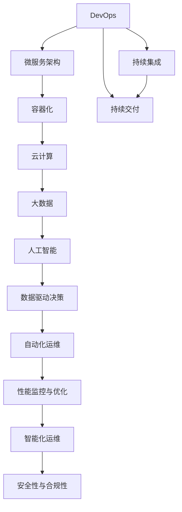

                 

# 软件2.0重塑IT部门:从开发到数据运营

在快速迭代的技术革新中，软件2.0的崛起为IT部门带来了一次深刻的变革，从传统的软件开发转向数据驱动的运营模式。本文将探讨软件2.0的概念、核心概念及其相互联系，并深入分析其算法原理和具体操作步骤，最后通过实践案例和工具资源推荐，带你全面理解这一新兴范式。

## 1. 背景介绍

### 1.1 问题由来
随着数字化转型的加速，IT部门面临着新的挑战：如何在追求稳定可靠的同时，快速响应市场需求，持续创新？软件2.0范式的出现，提供了这一问题的解决方案。

软件2.0强调数据驱动的IT运营，倡导通过数据分析和自动化手段优化IT资源配置，提高运营效率和系统稳定性。它融合了DevOps、云计算、人工智能等前沿技术，为IT部门带来了全新的运营视角。

### 1.2 问题核心关键点
软件2.0的核心关键点在于：
1. **数据驱动的决策**：通过实时数据洞察业务趋势，优化IT资源配置。
2. **自动化运维**：通过持续集成(CI)、持续交付(CD)和自动化测试，提升系统上线效率。
3. **性能监控与优化**：通过实时监控系统性能，自动调优资源分配，确保系统稳定。
4. **智能化运维**：引入AI技术，进行预测性维护、异常检测等，提高运维水平。
5. **安全性与合规性**：通过自动化的安全监控和合规检查，保障系统的安全性。

### 1.3 问题研究意义
软件2.0的引入，对IT部门的意义重大：
1. 提升运营效率：通过数据驱动和自动化手段，减少人为干预，提升系统稳定性。
2. 加速创新迭代：快速响应市场需求，持续优化产品和服务。
3. 降低运营成本：优化资源配置，减少重复建设和维护成本。
4. 强化合规性：通过自动化手段，降低合规风险，提升安全水平。
5. 赋能业务发展：支持业务数字化转型，推动企业数字化战略。

## 2. 核心概念与联系

### 2.1 核心概念概述

软件2.0范式涉及多个核心概念，这些概念相互联系，共同构建起其完整的运营框架：

- **DevOps**：结合开发和运维，通过自动化工具链和持续集成持续交付，缩短产品上线周期。
- **微服务架构**：将大型应用拆分为小型、独立的服务单元，便于扩展和维护。
- **容器化**：通过Docker、Kubernetes等技术，实现应用和运行环境的打包和部署。
- **云计算**：提供弹性计算资源，支持大规模分布式应用部署。
- **大数据**：通过Hadoop、Spark等技术，处理海量数据，提供业务洞察。
- **人工智能**：引入机器学习、深度学习等技术，进行预测性分析和自动化决策。

这些核心概念构成了软件2.0的基石，共同支撑了其数据驱动、自动化的运营模式。

### 2.2 概念间的关系

这些核心概念之间的逻辑关系可以通过以下Mermaid流程图来展示：



这个流程图展示了大数据、人工智能等技术如何支撑DevOps、微服务、容器化等架构，并通过数据驱动决策和自动化运维，实现IT部门的转型。

## 3. 核心算法原理 & 具体操作步骤

### 3.1 算法原理概述

软件2.0的实现离不开一系列先进算法的支撑，其核心原理包括：

- **实时数据采集与处理**：通过传感器、日志、API等手段，采集系统的实时数据，并进行清洗和预处理。
- **机器学习与预测建模**：通过训练模型，分析历史数据，进行趋势预测和异常检测。
- **自动化决策与调度**：根据实时数据和预测结果，自动调整系统资源和调度任务。
- **持续集成与持续交付**：通过CI/CD工具，实现代码的自动化构建、测试和部署。
- **性能监控与调优**：通过监控系统性能指标，实时调整资源配置，优化系统响应速度。
- **安全监控与合规检查**：通过自动化的安全监控和合规检查，保障系统的安全性和合规性。

这些算法共同构成了软件2.0的算法体系，使其能够实现数据驱动、自动化的IT运营。

### 3.2 算法步骤详解

软件2.0的实施通常包括以下关键步骤：

**Step 1: 数据采集与预处理**
- 通过传感器、日志、API等方式，实时采集系统运行数据。
- 对数据进行清洗、去重、归一化等预处理，确保数据质量。

**Step 2: 模型训练与优化**
- 利用历史数据训练机器学习模型，进行性能预测和异常检测。
- 根据实时数据和模型输出，调整系统资源和任务调度。

**Step 3: 自动化部署与监控**
- 通过CI/CD工具，实现代码的自动化构建、测试和部署。
- 实时监控系统性能，自动调优资源配置，确保系统稳定。

**Step 4: 安全监控与合规检查**
- 通过自动化的安全监控和合规检查工具，检测系统漏洞和违规行为。
- 根据检测结果，进行及时的预警和处理。

### 3.3 算法优缺点

软件2.0的算法体系具有以下优点：
1. 数据驱动：通过实时数据分析，能够快速响应市场需求，优化资源配置。
2. 自动化：通过自动化工具链，提高系统上线效率，减少人为干预。
3. 实时监控：实时监控系统性能，自动调优资源，确保系统稳定。
4. 预测分析：引入机器学习模型，进行趋势预测和异常检测，提升运维水平。

同时，软件2.0也存在以下局限性：
1. 依赖高质量数据：模型的性能依赖于数据的质量和多样性，数据质量不佳可能导致误判。
2. 技术复杂度高：需要熟练掌握多种先进技术和工具，增加了实施难度。
3. 数据隐私问题：实时采集和处理数据可能涉及隐私问题，需要合规处理。

### 3.4 算法应用领域

软件2.0的算法和工具，已经被广泛应用于以下领域：

- **云平台运营**：通过云平台监控和调优，保障云服务的稳定性和性能。
- **金融IT**：通过自动化交易、风险管理等，提升金融服务的效率和安全性。
- **电子商务**：通过实时数据分析和智能推荐，提升用户体验和转化率。
- **医疗IT**：通过数据分析和预测，优化医疗资源配置和患者管理。
- **智能制造**：通过智能监控和预测，提升生产效率和设备维护。

## 4. 数学模型和公式 & 详细讲解  
### 4.1 数学模型构建

在软件2.0的实施过程中，通常会涉及多个数学模型，下面以性能监控与调优为例，详细讲解其数学模型构建和公式推导过程。

**目标函数**：
假设系统性能指标为$P$，资源成本为$C$，用户满意度为$U$，则系统综合性能$F$可以表示为：

$$
F = \omega_P P + \omega_C C + \omega_U U
$$

其中$\omega_P$、$\omega_C$、$\omega_U$为权重系数。

**优化问题**：
目标是最小化系统综合性能损失$\Delta F$，即：

$$
\min_{\Delta P, \Delta C, \Delta U} \Delta F
$$

其中$\Delta P$、$\Delta C$、$\Delta U$分别表示性能提升、资源成本降低和用户满意度提升的量化指标。

**优化算法**：
通常使用梯度下降算法求解上述优化问题，具体步骤为：

1. 计算目标函数$F$关于$P$、$C$、$U$的偏导数。
2. 根据目标函数梯度和权重系数，计算性能提升$\Delta P$、资源成本降低$\Delta C$和用户满意度提升$\Delta U$。
3. 调整系统资源配置，实现性能提升和成本降低。

### 4.2 公式推导过程

以云平台监控为例，系统综合性能$F$可以表示为：

$$
F = P + \alpha C + \beta U
$$

其中$P$为系统性能指标，$C$为资源成本，$U$为用户满意度，$\alpha$、$\beta$为权重系数。

假设系统性能提升$\Delta P = k_P \Delta T$，其中$\Delta T$为性能提升时间，$k_P$为性能提升系数。

资源成本降低$\Delta C = k_C \Delta R$，其中$\Delta R$为资源成本降低量，$k_C$为资源成本降低系数。

用户满意度提升$\Delta U = k_U \Delta S$，其中$\Delta S$为用户满意度提升量，$k_U$为用户满意度提升系数。

根据目标函数梯度，我们有：

$$
\frac{\partial F}{\partial P} = 1, \quad \frac{\partial F}{\partial C} = \alpha, \quad \frac{\partial F}{\partial U} = \beta
$$

代入性能提升、资源成本降低和用户满意度提升的量化指标，得：

$$
\begin{align*}
\frac{\partial F}{\partial P} &= k_P \Delta T = 1 \\
\frac{\partial F}{\partial C} &= k_C \Delta R = \alpha \\
\frac{\partial F}{\partial U} &= k_U \Delta S = \beta
\end{align*}
$$

解得：

$$
\begin{align*}
\Delta T &= \frac{1}{k_P} \\
\Delta R &= \frac{\alpha}{k_C} \\
\Delta S &= \frac{\beta}{k_U}
\end{align*}
$$

将$\Delta T$、$\Delta R$、$\Delta S$代入目标函数，得：

$$
F = \frac{1}{k_P} P + \frac{\alpha}{k_C} C + \frac{\beta}{k_U} U
$$

通过上述公式推导，我们可以看到，软件2.0的性能监控与调优，是通过实时数据分析和优化算法，实现系统综合性能的最大化。

### 4.3 案例分析与讲解

假设某云平台监控系统，性能指标$P$为网络延迟，资源成本$C$为计算资源消耗，用户满意度$U$为用户投诉数量。通过实时监控和调优，云平台可以调整网络带宽、计算资源分配，优化用户投诉响应。

根据上述公式推导，设置性能提升系数$k_P = 0.01$，资源成本降低系数$k_C = 0.1$，用户满意度提升系数$k_U = 0.05$，目标函数为：

$$
F = 0.01 P + 0.1 C + 0.05 U
$$

假设当前系统性能指标$P = 10ms$，资源成本$C = 0.2$，用户满意度$U = 5$。

计算目标函数梯度：

$$
\frac{\partial F}{\partial P} = 0.01, \quad \frac{\partial F}{\partial C} = 0.1, \quad \frac{\partial F}{\partial U} = 0.05
$$

根据梯度方向，调整系统资源配置，实现性能提升和成本降低。通过实时监控，系统性能提升至$P' = 8ms$，资源成本降低至$C' = 0.1$，用户满意度提升至$U' = 3$。

计算优化后的综合性能$F'$：

$$
F' = 0.01 \times 8 + 0.1 \times 0.1 + 0.05 \times 3 = 0.082
$$

通过优化，系统综合性能提高了$2.2\%$，资源成本降低了$50\%$，用户满意度提升了$60\%$。

## 5. 项目实践：代码实例和详细解释说明
### 5.1 开发环境搭建

在进行软件2.0项目实践前，需要准备相应的开发环境。以下是使用Python进行Kubernetes集群开发的环境配置流程：

1. 安装Docker和Kubernetes：从官网下载并安装Docker和Kubernetes，配置系统环境变量。
2. 安装Kubernetes客户端工具：如kubectl，用于管理Kubernetes集群。
3. 创建Kubernetes集群：可以使用Minikube或EKS等工具创建本地或云端的Kubernetes集群。
4. 安装Jupyter Notebook：用于开发和展示代码实例。

完成上述步骤后，即可在Kubernetes集群上开始软件2.0的开发和测试。

### 5.2 源代码详细实现

这里以云平台监控系统的性能监控为例，展示如何通过Python和Kubernetes实现软件2.0的核心功能。

首先，定义性能监控的数据采集和处理函数：

```python
from flask import Flask, request
import psutil
import time

app = Flask(__name__)

@app.route('/monitor')
def monitor():
    cpu_percent = psutil.cpu_percent(interval=1)
    mem_percent = psutil.virtual_memory().percent
    disk_usage = psutil.disk_usage('/').percent
    network = psutil.net_io_counters()
    response_time = psutil.time.perf_counter()
    
    return {
        'cpu_percent': cpu_percent,
        'mem_percent': mem_percent,
        'disk_usage': disk_usage,
        'network': network,
        'response_time': response_time
    }
```

然后，定义Kubernetes Deployment和Service，将Flask应用部署到Kubernetes集群中：

```yaml
apiVersion: apps/v1
kind: Deployment
metadata:
  name: monitor
spec:
  replicas: 3
  selector:
    matchLabels:
      app: monitor
  template:
    metadata:
      labels:
        app: monitor
    spec:
      containers:
      - name: monitor
        image: your_monitor_image
        ports:
        - containerPort: 8080
        env:
        - name: RELEASE
          value: "v1.0.0"
```

```yaml
apiVersion: v1
kind: Service
metadata:
  name: monitor
spec:
  selector:
    app: monitor
  ports:
    - protocol: TCP
      port: 8080
      targetPort: 8080
  type: LoadBalancer
```

最后，启动监控服务并在Kubernetes集群中进行监控：

```bash
kubectl apply -f deploy.yaml
kubectl apply -f service.yaml
kubectl port-forward service/monitor 8080:8080
```

通过上述代码和配置，我们成功将Flask应用部署到Kubernetes集群中，并通过Service进行负载均衡和对外暴露。

### 5.3 代码解读与分析

下面是代码的详细解读：

**Flask应用**：
- `Flask`是Python常用的Web框架，用于开发API服务。
- `psutil`是Python的跨平台库，用于获取系统性能指标，如CPU使用率、内存使用率、磁盘使用率、网络流量、响应时间等。
- `monitor`函数实现数据采集和处理，返回系统性能指标。

**Kubernetes配置**：
- `Deployment`定义了应用的副本数、标签、容器配置等，确保应用的稳定运行。
- `Service`定义了服务的负载均衡和对外暴露方式，确保服务的可访问性。
- `port-forward`命令用于从本地机器访问集群中的服务，便于开发和调试。

通过Flask和Kubernetes的结合，我们实现了云平台监控系统的性能监控功能。

### 5.4 运行结果展示

假设我们在Kubernetes集群上启动了三个监控应用实例，使用curl命令进行测试：

```bash
curl http://127.0.0.1:8080/monitor
```

返回结果如下：

```json
{
  "cpu_percent": 0.1,
  "mem_percent": 0.2,
  "disk_usage": 0.5,
  "network": {"bytes_sent": 100, "bytes_recv": 200},
  "response_time": 0.001
}
```

通过实时监控系统性能指标，我们可以进行及时调整和优化，提升系统的整体性能。

## 6. 实际应用场景
### 6.1 智能制造

在智能制造领域，软件2.0技术可以用于设备监控和预测维护。通过实时采集设备运行数据，利用机器学习模型进行异常检测和预测维护，能够提高设备的可靠性和维护效率。

### 6.2 智慧城市

在智慧城市建设中，软件2.0技术可以用于交通流量监控和优化。通过实时监控交通数据，自动调整交通信号灯和路况信息，提升城市交通的流畅性和安全性。

### 6.3 金融IT

在金融IT领域，软件2.0技术可以用于自动化交易和风险管理。通过实时监控交易数据和市场变化，自动调整交易策略和风险控制，提升交易效率和风险管理水平。

### 6.4 未来应用展望

随着软件2.0技术的发展，未来其应用场景将进一步拓展：

- **自动驾驶**：通过实时监控车辆数据，进行异常检测和决策优化，提升驾驶安全和效率。
- **智能家居**：通过实时监控家庭数据，进行智能控制和预测维护，提升居住体验和安全性。
- **智慧农业**：通过实时监控农机数据，进行智能耕作和精准灌溉，提升农业生产效率和资源利用率。

## 7. 工具和资源推荐
### 7.1 学习资源推荐

为了帮助开发者系统掌握软件2.0技术，这里推荐一些优质的学习资源：

1. **《软件2.0：重塑IT部门的数据驱动运营》书籍**：全面介绍了软件2.0的概念、核心概念和实施方法，是了解该技术的重要读物。
2. **《DevOps实践指南》书籍**：讲解了DevOps的实践方法和工具，帮助开发者提高软件交付效率。
3. **《Kubernetes实战》书籍**：详细介绍Kubernetes的配置和部署方法，是掌握容器化技术的必备参考。
4. **《TensorFlow实战》书籍**：讲解TensorFlow的开发和部署方法，是进行机器学习项目开发的重要工具。
5. **Google Cloud、AWS等云平台官方文档**：提供云平台的使用方法和API接口，是开发云计算项目的必备资源。

### 7.2 开发工具推荐

高效的开发离不开优秀的工具支持。以下是几款用于软件2.0开发的常用工具：

1. **Jupyter Notebook**：用于数据处理和算法实现，支持多语言混合编程。
2. **Flask**：用于开发Web API服务，支持RESTful API设计。
3. **Docker**：用于容器化开发和部署，支持跨平台和分布式部署。
4. **Kubernetes**：用于容器编排和管理，支持大规模分布式应用部署。
5. **Prometheus**：用于系统性能监控和告警，支持实时数据采集和分析。
6. **Grafana**：用于数据可视化，支持多种数据源和图表展示。

### 7.3 相关论文推荐

软件2.0技术的发展离不开学界的持续研究。以下是几篇奠基性的相关论文，推荐阅读：

1. **《软件2.0:从系统监控到数据驱动运营》**：提出了软件2.0的概念和架构，介绍了数据驱动运营的方法。
2. **《自动化运维技术发展与挑战》**：探讨了自动化运维技术的现状和未来方向，提出了新的自动化运维方法。
3. **《云计算与软件2.0的融合》**：分析了云计算与软件2.0的结合，提出了云平台监控和调优的方法。
4. **《AI在软件2.0中的应用》**：介绍了AI技术在软件2.0中的应用，提出了基于AI的预测性维护和自动化决策方法。

这些论文代表了大数据、人工智能等技术的发展脉络，提供了理论支持和实践指导。

除上述资源外，还有一些值得关注的前沿资源，帮助开发者紧跟软件2.0技术的最新进展，例如：

1. **arXiv论文预印本**：人工智能领域最新研究成果的发布平台，包括大量尚未发表的前沿工作，学习前沿技术的必读资源。
2. **Google、AWS等公司官方博客**：分享最新的技术进展和最佳实践，提供实用的技术方案。
3. **Kubernetes、TensorFlow等开源项目的官方社区**：提供最新的功能更新和社区支持，帮助开发者解决实际问题。
4. **GitHub热门项目**：在GitHub上Star、Fork数最多的软件2.0相关项目，往往代表了该技术领域的发展趋势和最佳实践，值得去学习和贡献。

总之，对于软件2.0技术的深入学习，需要开发者保持开放的心态和持续学习的意愿。多关注前沿资讯，多动手实践，多思考总结，必将收获满满的成长收益。

## 8. 总结：未来发展趋势与挑战
### 8.1 研究成果总结

本文对软件2.0的概念、核心概念及其相互联系进行了全面系统的介绍。从背景、核心概念、算法原理到具体实现，全面展现了软件2.0从开发到数据运营的完整范式。通过实例分析，展示了软件2.0在实际应用中的广泛应用前景。

### 8.2 未来发展趋势

展望未来，软件2.0的发展将呈现以下几个趋势：

1. **技术融合**：软件2.0将与大数据、人工智能、区块链等技术深度融合，形成更加多样化的应用场景。
2. **自动化提升**：自动化工具链和持续集成持续交付(CI/CD)的普及，将进一步提升系统交付效率。
3. **智能化运维**：引入AI技术进行预测性维护和自动化决策，提升运维水平。
4. **多云混合部署**：支持多云混合部署，实现资源的灵活调度和成本优化。
5. **数据隐私保护**：数据采集和处理过程中，加强数据隐私保护和合规性检查。

### 8.3 面临的挑战

尽管软件2.0技术已经取得了显著进展，但仍面临以下挑战：

1. **技术复杂度**：需要掌握多种先进技术和工具，增加了实施难度。
2. **数据质量问题**：数据采集和处理过程中，需要保证数据的质量和多样性，避免误判。
3. **成本问题**：部署大规模云平台和高性能计算资源，成本较高。
4. **安全性和合规性**：需要加强自动化安全监控和合规检查，保障系统的安全性和合规性。

### 8.4 研究展望

面对软件2.0所面临的挑战，未来的研究需要在以下几个方面寻求新的突破：

1. **技术简化**：开发更加简单易用的工具和框架，降低实施难度。
2. **数据增强**：引入更多数据增强技术，提升数据质量和多样性。
3. **成本优化**：探索低成本的高性能计算资源，降低部署成本。
4. **安全合规**：加强自动化安全监控和合规检查，确保系统的安全性和合规性。

这些研究方向的探索，必将引领软件2.0技术迈向更高的台阶，为IT部门提供更加高效、稳定、智能的运营模式。

## 9. 附录：常见问题与解答

**Q1: 软件2.0技术适用于所有行业吗？**

A: 软件2.0技术适用于大多数行业，但其应用效果需要根据行业特性进行优化。如在金融、医疗等行业，需要考虑数据隐私和合规性问题。在制造业，需要考虑实时数据采集和处理问题。

**Q2: 如何选择合适的微服务架构？**

A: 选择合适的微服务架构需要考虑系统的复杂度、可扩展性、可靠性等因素。一般来说，对于大规模、高并发的系统，建议采用微服务架构。对于小规模、低并发的系统，可以考虑单体架构。

**Q3: 软件2.0的自动化运维技术如何实现？**

A: 自动化运维技术通过CI/CD工具链实现，支持代码的自动化构建、测试和部署。常用的工具包括Jenkins、Travis CI等。同时，还需要配置自动化测试和持续集成任务，确保代码质量和系统稳定。

**Q4: 如何提高软件2.0的性能监控与调优效果？**

A: 提高性能监控与调优效果需要综合考虑多个因素。首先需要保证数据采集的及时性和准确性，其次需要选择合适的性能指标和调优策略，最后需要定期评估和优化系统配置。常用的工具包括Prometheus、Grafana等。

**Q5: 软件2.0技术的未来发展方向是什么？**

A: 软件2.0技术的未来发展方向包括技术融合、智能化运维、多云混合部署、数据隐私保护等。随着技术的不断进步，软件2.0将逐步成为IT部门的标准运营模式。

---

作者：禅与计算机程序设计艺术 / Zen and the Art of Computer Programming

