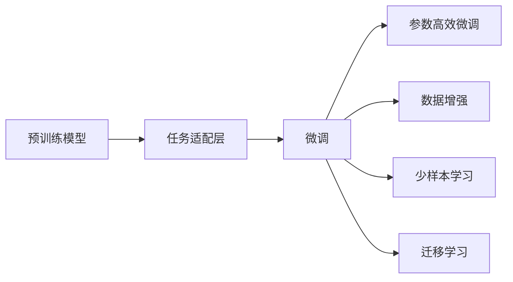
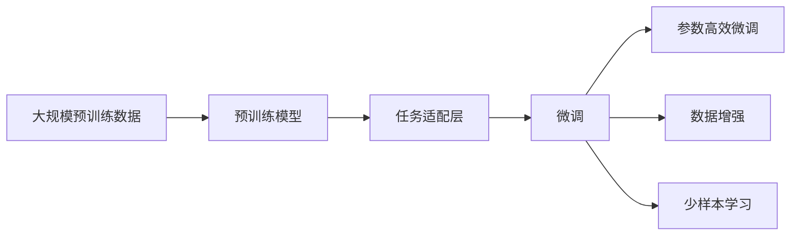
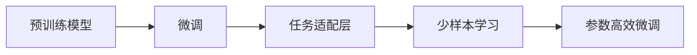
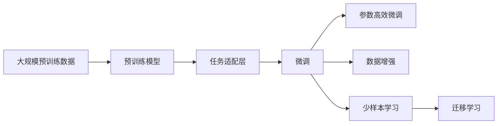

                 

# 迁移学习:让AI模型适应新任务的技巧

> 关键词：迁移学习,泛化能力,预训练模型,任务适配层,微调(Fine-Tuning),参数高效微调(PEFT),数据增强,少样本学习,Few-shot Learning

## 1. 背景介绍

### 1.1 问题由来
随着人工智能技术的不断进步，机器学习模型在各个领域得到了广泛应用。然而，每个特定任务通常需要重新从零开始训练模型，这不仅耗时耗力，还可能导致在新的任务上性能不佳。迁移学习（Transfer Learning）的出现，为这一问题提供了可行的解决方案。

迁移学习是指将一个任务上学习到的知识，迁移到另一个相关但不同的任务上。它的核心思想是，利用已有模型在某个任务上的性能，来提升新任务上的模型表现。这种方法可以大大减少训练时间，提升模型泛化能力，并在数据稀缺的情况下取得良好效果。

### 1.2 问题核心关键点
迁移学习的核心关键点在于如何将预训练模型的知识迁移到新的任务上。这通常涉及以下几个步骤：
- **预训练模型**：在大量无标签数据上训练一个通用的模型，使其能够学习到通用的特征表示。
- **任务适配层**：根据新任务的特性，在预训练模型的基础上添加新的输出层或参数，使其能够适应新的任务。
- **微调**：在新任务的少量有标签数据上，对模型进行有监督的细调，以进一步提升在新任务上的性能。
- **参数高效微调(PEFT)**：采用只更新少量参数的方式，避免破坏预训练模型的整体结构。

这些步骤共同构成了迁移学习的核心流程，使得模型能够从已有知识中受益，以较少的训练成本实现更好的性能提升。

### 1.3 问题研究意义
研究迁移学习的方法，对于拓展人工智能模型的应用范围，提升模型在新任务上的性能，加速机器学习技术的产业化进程，具有重要意义：

1. 降低应用开发成本。迁移学习可以大幅减少从头训练所需的成本，包括数据收集、标注、计算资源等。
2. 提升模型效果。迁移学习可以使模型更好地适应新任务，避免从头训练时的知识损失。
3. 加速开发进度。站在前人的基础上，迁移学习可以更快地完成任务适配，缩短开发周期。
4. 促进技术创新。迁移学习促进了对预训练模型的深入研究，催生了少样本学习、自适应学习等新的研究方向。
5. 赋能产业升级。迁移学习使得人工智能技术更容易被各行各业所采用，为传统行业数字化转型升级提供新的技术路径。

## 2. 核心概念与联系

### 2.1 核心概念概述

为更好地理解迁移学习的核心概念，本节将介绍几个密切相关的核心概念：

- **预训练模型(Pre-trained Model)**：指在大量无标签数据上训练得到的通用模型，如BERT、GPT-2等。这些模型通常具有较强的泛化能力，能够在多种任务上取得优异性能。
- **任务适配层(Task Adaptation Layer)**：根据新任务的需求，在预训练模型的基础上添加新的输出层或参数，使其能够适应特定的任务。例如，在图像分类任务中，可以在卷积神经网络(CNN)的最后一层添加全连接层，输出类别概率。
- **微调(Fine-Tuning)**：指在预训练模型的基础上，使用新任务的少量有标签数据，对模型进行有监督的细调，以进一步提升在新任务上的性能。通常只更新顶层部分参数。
- **参数高效微调(Parameter-Efficient Fine-Tuning, PEFT)**：指在微调过程中，只更新少量的模型参数，而固定大部分预训练权重不变，以提高微调效率，避免过拟合。
- **数据增强(Data Augmentation)**：通过对训练样本进行变换、旋转、裁剪等操作，生成更多的训练样本，提高模型泛化能力。
- **少样本学习(Few-shot Learning)**：指在只有少量标注样本的情况下，模型能够快速适应新任务。
- **迁移学习(Transfer Learning)**：指将一个领域学习到的知识，迁移到另一个不同但相关的领域的学习范式。

这些核心概念之间的逻辑关系可以通过以下Mermaid流程图来展示：



这个流程图展示了大规模预训练模型、任务适配层、微调、参数高效微调、数据增强、少样本学习、迁移学习等概念之间的关系：

1. 预训练模型在大量无标签数据上学习通用的特征表示。
2. 任务适配层根据新任务的需求，在预训练模型的基础上进行适配。
3. 微调使用新任务的少量有标签数据，对模型进行有监督的细调，以提升性能。
4. 参数高效微调只更新少量参数，避免破坏预训练模型的整体结构。
5. 数据增强通过对训练样本进行变换，生成更多的训练样本，提高模型泛化能力。
6. 少样本学习在只有少量标注样本的情况下，模型能够快速适应新任务。
7. 迁移学习将一个领域学习到的知识迁移到另一个不同但相关的领域。

这些概念共同构成了迁移学习的核心生态系统，使其能够在各种场景下发挥强大的学习能力。通过理解这些核心概念，我们可以更好地把握迁移学习的精髓，为后续深入讨论具体的迁移学习方法和技术奠定基础。

### 2.2 概念间的关系

这些核心概念之间存在着紧密的联系，形成了迁移学习的完整生态系统。下面我通过几个Mermaid流程图来展示这些概念之间的关系。

#### 2.2.1 迁移学习的基本流程



这个流程图展示了迁移学习的基本流程：预训练模型在大量无标签数据上学习通用的特征表示，根据新任务的需求进行任务适配，然后在少量有标签数据上进行微调，通过参数高效微调、数据增强、少样本学习等技术，提升模型在新任务上的性能。

#### 2.2.2 预训练模型与微调的关系



这个流程图展示了预训练模型与微调的关系：预训练模型在大量无标签数据上学习通用的特征表示，通过任务适配层和微调，在新任务的少量有标签数据上提升性能。参数高效微调和少样本学习等技术进一步提高了模型在新任务上的适应能力。

#### 2.2.3 数据增强与少样本学习的关系


这个流程图展示了数据增强与少样本学习的关系：通过对训练数据进行增强，生成更多的训练样本，从而提高模型泛化能力，降低对标注样本的依赖。少样本学习则进一步利用少量标注样本，提升模型在新任务上的性能。

### 2.3 核心概念的整体架构

最后，我们用一个综合的流程图来展示这些核心概念在迁移学习过程中的整体架构：



这个综合流程图展示了从预训练到微调，再到少样本学习，以及迁移学习的完整过程。预训练模型在大量无标签数据上学习通用的特征表示，通过任务适配层和微调，在新任务的少量有标签数据上提升性能。参数高效微调和数据增强等技术进一步提高模型性能。迁移学习则将预训练模型在不同任务间进行知识迁移，增强模型的泛化能力。

## 3. 核心算法原理 & 具体操作步骤
### 3.1 算法原理概述

迁移学习的基本原理是，利用预训练模型在已有任务上学习到的知识，来提升在新任务上的性能。其核心思想是，将预训练模型看作一个强大的特征提取器，通过有监督的微调，使其能够适应特定的下游任务。

形式化地，假设预训练模型为 $M_{\theta}$，其中 $\theta$ 为预训练得到的模型参数。给定新任务的标注数据集 $D=\{(x_i,y_i)\}_{i=1}^N$，迁移学习的目标是最小化经验风险，即找到最优参数：

$$
\theta^* = \mathop{\arg\min}_{\theta} \mathcal{L}(M_{\theta},D)
$$

其中 $\mathcal{L}$ 为针对任务 $T$ 设计的损失函数，用于衡量模型预测输出与真实标签之间的差异。常见的损失函数包括交叉熵损失、均方误差损失等。

通过梯度下降等优化算法，微调过程不断更新模型参数 $\theta$，最小化损失函数 $\mathcal{L}$，使得模型输出逼近真实标签。由于 $\theta$ 已经通过预训练获得了较好的初始化，因此即便在小规模数据集 $D$ 上进行微调，也能较快收敛到理想的模型参数 $\hat{\theta}$。

### 3.2 算法步骤详解

迁移学习的一般流程包括以下几个关键步骤：

**Step 1: 准备预训练模型和数据集**
- 选择合适的预训练模型 $M_{\theta}$ 作为初始化参数，如 BERT、GPT-2 等。
- 准备新任务的标注数据集 $D$，划分为训练集、验证集和测试集。一般要求标注数据与预训练数据的分布不要差异过大。

**Step 2: 添加任务适配层**
- 根据新任务类型，在预训练模型的基础上设计合适的输出层和损失函数。
- 对于分类任务，通常在顶层添加线性分类器和交叉熵损失函数。
- 对于生成任务，通常使用语言模型的解码器输出概率分布，并以负对数似然为损失函数。

**Step 3: 设置微调超参数**
- 选择合适的优化算法及其参数，如 AdamW、SGD 等，设置学习率、批大小、迭代轮数等。
- 设置正则化技术及强度，包括权重衰减、Dropout、Early Stopping 等。
- 确定冻结预训练参数的策略，如仅微调顶层，或全部参数都参与微调。

**Step 4: 执行梯度训练**
- 将训练集数据分批次输入模型，前向传播计算损失函数。
- 反向传播计算参数梯度，根据设定的优化算法和学习率更新模型参数。
- 周期性在验证集上评估模型性能，根据性能指标决定是否触发 Early Stopping。
- 重复上述步骤直到满足预设的迭代轮数或 Early Stopping 条件。

**Step 5: 测试和部署**
- 在测试集上评估微调后模型 $M_{\hat{\theta}}$ 的性能，对比微调前后的精度提升。
- 使用微调后的模型对新样本进行推理预测，集成到实际的应用系统中。
- 持续收集新的数据，定期重新微调模型，以适应数据分布的变化。

以上是迁移学习的一般流程。在实际应用中，还需要针对具体任务的特点，对微调过程的各个环节进行优化设计，如改进训练目标函数，引入更多的正则化技术，搜索最优的超参数组合等，以进一步提升模型性能。

### 3.3 算法优缺点

迁移学习具有以下优点：
1. 简单高效。只需准备少量标注数据，即可对预训练模型进行快速适配，获得较大的性能提升。
2. 通用适用。适用于各种NLP下游任务，包括分类、匹配、生成等，设计简单的任务适配层即可实现迁移学习。
3. 参数高效。利用参数高效微调技术，在固定大部分预训练参数的情况下，仍可取得不错的迁移效果。
4. 效果显著。在学术界和工业界的诸多任务上，迁移学习已经刷新了最先进的性能指标。

同时，该方法也存在一定的局限性：
1. 依赖标注数据。迁移的效果很大程度上取决于标注数据的质量和数量，获取高质量标注数据的成本较高。
2. 迁移能力有限。当目标任务与预训练数据的分布差异较大时，迁移的性能提升有限。
3. 负面效果传递。预训练模型的固有偏见、有害信息等，可能通过迁移学习传递到下游任务，造成负面影响。
4. 可解释性不足。迁移学习模型的决策过程通常缺乏可解释性，难以对其推理逻辑进行分析和调试。

尽管存在这些局限性，但就目前而言，迁移学习仍然是大规模预训练模型应用的最主流范式。未来相关研究的重点在于如何进一步降低迁移学习对标注数据的依赖，提高模型的少样本学习和跨领域迁移能力，同时兼顾可解释性和伦理安全性等因素。

### 3.4 算法应用领域

迁移学习在NLP领域已经得到了广泛的应用，覆盖了几乎所有常见任务，例如：

- 文本分类：如情感分析、主题分类、意图识别等。通过迁移学习使模型学习文本-标签映射。
- 命名实体识别：识别文本中的人名、地名、机构名等特定实体。通过迁移学习使模型掌握实体边界和类型。
- 关系抽取：从文本中抽取实体之间的语义关系。通过迁移学习使模型学习实体-关系三元组。
- 问答系统：对自然语言问题给出答案。将问题-答案对作为迁移数据，训练模型学习匹配答案。
- 机器翻译：将源语言文本翻译成目标语言。通过迁移学习使模型学习语言-语言映射。
- 文本摘要：将长文本压缩成简短摘要。通过迁移学习使模型学习抓取要点。
- 对话系统：使机器能够与人自然对话。通过迁移学习使模型适应多轮对话历史，进行回复生成。

除了上述这些经典任务外，迁移学习也被创新性地应用到更多场景中，如可控文本生成、常识推理、代码生成、数据增强等，为NLP技术带来了全新的突破。随着预训练模型和迁移学习的不断进步，相信NLP技术将在更广阔的应用领域大放异彩。

## 4. 数学模型和公式 & 详细讲解 & 举例说明

### 4.1 数学模型构建

本节将使用数学语言对迁移学习的基本原理进行严格的刻画。

记预训练模型为 $M_{\theta}$，其中 $\theta$ 为预训练得到的模型参数。假设迁移任务的训练集为 $D=\{(x_i,y_i)\}_{i=1}^N$，其中 $x_i$ 为输入，$y_i$ 为输出。

定义模型 $M_{\theta}$ 在数据样本 $(x,y)$ 上的损失函数为 $\ell(M_{\theta}(x),y)$，则在数据集 $D$ 上的经验风险为：

$$
\mathcal{L}(\theta) = \frac{1}{N} \sum_{i=1}^N \ell(M_{\theta}(x_i),y_i)
$$

迁移学习的优化目标是最小化经验风险，即找到最优参数：

$$
\theta^* = \mathop{\arg\min}_{\theta} \mathcal{L}(\theta)
$$

在实践中，我们通常使用基于梯度的优化算法（如SGD、Adam等）来近似求解上述最优化问题。设 $\eta$ 为学习率，$\lambda$ 为正则化系数，则参数的更新公式为：

$$
\theta \leftarrow \theta - \eta \nabla_{\theta}\mathcal{L}(\theta) - \eta\lambda\theta
$$

其中 $\nabla_{\theta}\mathcal{L}(\theta)$ 为损失函数对参数 $\theta$ 的梯度，可通过反向传播算法高效计算。

### 4.2 公式推导过程

以下我们以二分类任务为例，推导交叉熵损失函数及其梯度的计算公式。

假设模型 $M_{\theta}$ 在输入 $x$ 上的输出为 $\hat{y}=M_{\theta}(x) \in [0,1]$，表示样本属于正类的概率。真实标签 $y \in \{0,1\}$。则二分类交叉熵损失函数定义为：

$$
\ell(M_{\theta}(x),y) = -[y\log \hat{y} + (1-y)\log (1-\hat{y})]
$$

将其代入经验风险公式，得：

$$
\mathcal{L}(\theta) = -\frac{1}{N}\sum_{i=1}^N [y_i\log M_{\theta}(x_i)+(1-y_i)\log(1-M_{\theta}(x_i))]
$$

根据链式法则，损失函数对参数 $\theta_k$ 的梯度为：

$$
\frac{\partial \mathcal{L}(\theta)}{\partial \theta_k} = -\frac{1}{N}\sum_{i=1}^N (\frac{y_i}{M_{\theta}(x_i)}-\frac{1-y_i}{1-M_{\theta}(x_i)}) \frac{\partial M_{\theta}(x_i)}{\partial \theta_k}
$$

其中 $\frac{\partial M_{\theta}(x_i)}{\partial \theta_k}$ 可进一步递归展开，利用自动微分技术完成计算。

在得到损失函数的梯度后，即可带入参数更新公式，完成模型的迭代优化。重复上述过程直至收敛，最终得到适应新任务的最优模型参数 $\theta^*$。

### 4.3 案例分析与讲解

下面以一个具体的迁移学习案例来说明其应用过程。假设我们有一组新任务的标注数据，包括文本分类和命名实体识别，目标是在这两个任务上训练一个通用的预训练模型。

1. **数据准备**：收集两个任务的标注数据集，并进行预处理，包括文本清洗、分词、编码等。

2. **模型选择**：选择一个大规模的预训练模型，如BERT或GPT-2，作为初始化参数。

3. **任务适配层**：根据文本分类任务，在BERT模型顶层添加一个全连接层，输出类别概率，并使用交叉熵损失函数。对于命名实体识别任务，添加多个输出层，分别输出BIO标签（Begin, Inside, Outside）。

4. **微调设置**：选择合适的优化算法（如AdamW），设置学习率、批大小、迭代轮数等。设置正则化技术，如Dropout、L2正则等。

5. **模型训练**：使用两个任务的标注数据，分批次输入模型，前向传播计算损失函数，反向传播更新模型参数。在每个epoch结束时，在验证集上评估模型性能。

6. **测试和部署**：在测试集上评估微调后的模型，对比微调前后的精度提升。使用微调后的模型对新样本进行推理预测，集成到实际的应用系统中。

通过上述步骤，我们可以将一个通用的预训练模型，通过迁移学习适配到不同的下游任务，从而提升模型在新任务上的性能。

## 5. 项目实践：代码实例和详细解释说明

### 5.1 开发环境搭建

在进行迁移学习实践前，我们需要准备好开发环境。以下是使用Python进行PyTorch开发的环境配置流程：

1. 安装Anaconda：从官网下载并安装Anaconda，用于创建独立的Python环境。

2. 创建并激活虚拟环境：
```bash
conda create -n pytorch-env python=3.8 
conda activate pytorch-env
```

3. 安装PyTorch：根据CUDA版本，从官网获取对应的安装命令。例如：
```bash
conda install pytorch torchvision torchaudio cudatoolkit=11.1 -c pytorch -c conda-forge
```

4. 安装Transformers库：
```bash
pip install transformers
```

5. 安装各类工具包：
```bash
pip install numpy pandas scikit-learn matplotlib tqdm jupyter notebook ipython
```

完成上述步骤后，即可在`pytorch-env`环境中开始迁移学习实践。

### 5.2 源代码详细实现

下面我们以文本分类任务为例，给出使用Transformers库对BERT模型进行迁移学习的PyTorch代码实现。

首先，定义迁移学习任务的数据处理函数：

```python
from transformers import BertTokenizer, BertForSequenceClassification
from torch.utils.data import Dataset
import torch

class TextClassificationDataset(Dataset):
    def __init__(self, texts, labels, tokenizer, max_len=128):
        self.texts = texts
        self.labels = labels
        self.tokenizer = tokenizer
        self.max_len = max_len
        
    def __len__(self):
        return len(self.texts)
    
    def __getitem__(self, item):
        text = self.texts[item]
        label = self.labels[item]
        
        encoding = self.tokenizer(text, return_tensors='pt', max_length=self.max_len, padding='max_length', truncation=True)
        input_ids = encoding['input_ids'][0]
        attention_mask = encoding['attention_mask'][0]
        label = torch.tensor(label, dtype=torch.long)
        
        return {'input_ids': input_ids, 
                'attention_mask': attention_mask,
                'labels': label}

# 标签与id的映射
label2id = {'0': 0, '1': 1, '2': 2, '3': 3, '4': 4, '5': 5, '6': 6, '7': 7, '8': 8, '9': 9, '10': 10, '11': 11, '12': 12, '13': 13, '14': 14, '15': 15}
id2label = {v: k for k, v in label2id.items()}
```

然后，定义模型和优化器：

```python
from transformers import AdamW

model = BertForSequenceClassification.from_pretrained('bert-base-cased', num_labels=len(label2id))

optimizer = AdamW(model.parameters(), lr=2e-5)
```

接着，定义训练和评估函数：

```python
from torch.utils.data import DataLoader
from tqdm import tqdm
from sklearn.metrics import classification_report

device = torch.device('cuda') if torch.cuda.is_available() else torch.device('cpu')
model.to(device)

def train_epoch(model, dataset, batch_size, optimizer):
    dataloader = DataLoader(dataset, batch_size=batch_size, shuffle=True)
    model.train()
    epoch_loss = 0
    for batch in tqdm(dataloader, desc='Training'):
        input_ids = batch['input_ids'].to(device)
        attention_mask = batch['attention_mask'].to(device)
        labels = batch['labels'].to(device)
        model.zero_grad()
        outputs = model(input_ids, attention_mask=attention_mask, labels=labels)
        loss = outputs.loss
        epoch_loss += loss.item()
        loss.backward()
        optimizer.step()
    return epoch_loss / len(dataloader)

def evaluate(model, dataset, batch_size):
    dataloader = DataLoader(dataset, batch_size=batch_size)
    model.eval()
    preds, labels = [], []
    with torch.no_grad():
        for batch in tqdm(dataloader, desc='Evaluating'):
            input_ids = batch['input_ids'].to(device)
            attention_mask = batch['attention_mask'].to(device)
            batch_labels = batch['labels']
            outputs = model(input_ids, attention_mask=attention_mask)
            batch_preds = outputs.logits.argmax(dim=2).to('cpu').tolist()
            batch_labels = batch_labels.to('cpu').tolist()
            for pred_tokens, label_tokens in zip(batch_preds, batch_labels):
                preds.append(pred_tokens[:len(label_tokens)])
                labels.append(label_tokens)
                
    print(classification_report(labels, preds))
```

最后，启动迁移学习流程并在测试集上评估：

```python
epochs = 5
batch_size = 16

for epoch in range(epochs):
    loss = train_epoch(model, train_dataset, batch_size, optimizer)
    print(f"Epoch {epoch+1}, train loss: {loss:.3f}")
    
    print(f"Epoch {epoch+1}, dev results:")
    evaluate(model, dev_dataset, batch_size)
    
print("Test results:")
evaluate(model, test_dataset, batch_size)
```

以上就是使用PyTorch对BERT进行迁移学习的完整代码实现。可以看到，得益于Transformers库的强大封装，我们可以用相对简洁的代码完成迁移学习的各个步骤。

### 5.3 代码解读与分析

让我们再详细解读一下关键代码的实现细节：

**TextClassificationDataset类**：
- `__init__`方法：初始化文本、标签、分词器等关键组件。
- `__len__`方法：返回数据集的样本数量。
- `__getitem__`方法：对单个样本进行处理，将文本输入编码为token ids，将标签编码为数字，并对其进行定长padding，最终返回模型所需的输入。

**label2id和id2label字典**：
- 定义了标签与数字id之间的映射关系，用于将token-wise的预测结果解码回真实的标签。

**训练和评估函数**：
- 使用PyTorch的DataLoader对数据集进行批次化加载，供模型训练和推理使用。
- 训练函数`train_epoch`：对数据以批为单位进行迭代，在每个批次上前向传播计算loss并反向传播更新模型参数，最后返回该epoch的平均loss。
- 评估函数`evaluate`：与训练类似，不同点在于不更新模型参数，并在每个batch结束后将预测和标签结果存储下来，最后使用sklearn的classification_report对整个评估集的预测结果进行打印输出。

**迁移学习流程**：
- 定义总的epoch数和batch size，开始循环迭代


