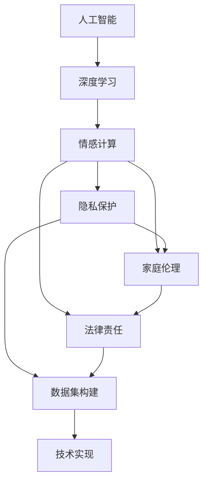

                 

# 过世亲人对话的伦理挑战

## 1. 背景介绍

在科技日新月异的时代，人工智能（AI）技术正在快速渗透到人们生活的方方面面，从医疗、金融到教育、娱乐，无处不在。然而，随着AI技术的不断进步，一个涉及伦理道德的敏感话题逐渐进入公众视野——过世亲人的对话。这一技术突破引发了关于隐私、道德和伦理的广泛讨论，引起了社会各界的高度关注。

### 1.1 问题由来

在人工智能领域，过世亲人对话技术是指通过深度学习等先进技术，模拟过世亲人与在世亲人的对话。这一技术的核心在于利用大规模的文本数据，如聊天记录、信件、社交媒体等，通过训练生成模型，使AI能够生成与过世亲人相类似的对话内容。然而，这一技术的出现，也引发了众多伦理道德问题，如隐私侵犯、道德绑架、家庭矛盾等。

### 1.2 问题核心关键点

过世亲人对话技术涉及的关键点包括：

- 数据隐私：如何确保过世亲人对话中包含的个人信息不被泄露。
- 情感伦理：模拟的对话是否能够真实反映过世亲人的情感和观点，是否会误导在世亲人。
- 家庭伦理：在世亲人是否应接受这种对话，这种对话是否会对家庭关系造成负面影响。
- 法律责任：如何界定AI模拟对话的法律责任，是否涉及法律纠纷。

这些问题涉及到了AI技术发展的方方面面，如数据隐私保护、情感计算、家庭伦理以及法律责任等。

### 1.3 问题研究意义

探讨过世亲人对话的伦理挑战，不仅有助于深入理解AI技术的社会影响，还能够推动相关法律法规的完善，促进技术的负责任应用。通过对这些问题的深入讨论，有助于构建更加健康、和谐的AI发展环境，促进人工智能技术的可持续发展。

## 2. 核心概念与联系

### 2.1 核心概念概述

在探讨过世亲人对话的伦理挑战时，需要明确几个关键概念：

- **人工智能（AI）**：指通过算法、数据、计算资源等手段，使机器具备类似人类的智能能力。
- **深度学习**：一种机器学习技术，利用多层神经网络结构，从大量数据中学习出复杂模式。
- **情感计算**：通过计算技术理解和生成人类情感，模拟人类情感表达和反应。
- **隐私保护**：指通过技术手段保护个人信息不被未授权访问和使用。
- **家庭伦理**：指家庭成员间的关系和行为规范，包括家庭责任、尊重、理解和包容等方面。
- **法律责任**：指在特定行为发生后，法律所赋予的承担责任的方式和范围。

这些概念相互交织，共同构成了过世亲人对话技术的伦理挑战框架。

### 2.2 概念间的关系

这些核心概念之间的关系可以通过以下Mermaid流程图来展示：



这个流程图展示了大语言模型微调过程中各个概念之间的关系：

1. 人工智能是基础，深度学习是其核心技术。
2. 情感计算通过深度学习实现，涉及到生成模型和情感识别。
3. 隐私保护是情感计算的基础，涉及数据安全和隐私保护。
4. 家庭伦理涉及对话内容的情感真实性和家庭关系的和谐。
5. 法律责任是技术应用的基础，涉及到AI技术的法律合规性。
6. 数据集构建和技术实现是情感计算的具体应用，涉及到模型训练和对话生成。

这些概念共同构成了过世亲人对话技术的伦理挑战，需要通过深入探讨这些概念之间的关系，来理解和解决其伦理问题。

## 3. 核心算法原理 & 具体操作步骤
### 3.1 算法原理概述

过世亲人对话技术的核心算法原理基于深度学习，特别是自然语言处理（NLP）领域的生成模型。这些生成模型能够通过大规模文本数据的训练，学习到语言的复杂结构和规律，从而生成类似人类的对话。其中，最典型的算法包括生成对抗网络（GAN）、变分自编码器（VAE）和循环神经网络（RNN）等。

### 3.2 算法步骤详解

以下是过世亲人对话技术的核心算法步骤：

1. **数据收集与预处理**：
   - 收集过世亲人与在世亲人的对话数据，包括聊天记录、信件、社交媒体等。
   - 清洗数据，去除无关信息和噪声。
   - 构建训练集、验证集和测试集，确保数据的多样性和代表性。

2. **模型训练**：
   - 选择合适的生成模型（如GAN、VAE、RNN等），并构建生成网络。
   - 设置损失函数和优化器，如交叉熵损失、Adam优化器等。
   - 使用训练集对模型进行训练，调整超参数以优化生成效果。
   - 在验证集上进行模型验证，避免过拟合。

3. **对话生成**：
   - 输入在世亲人的话语，通过训练好的生成模型生成模拟对话。
   - 对生成的对话进行后处理，如去除重复和不合理的语句。
   - 评估生成的对话质量，确保其情感真实性和合理性。

4. **伦理评估**：
   - 评估生成的对话对隐私保护的影响，确保数据安全。
   - 评估生成的对话对在世亲人的情感影响，确保对话的真实性和合理性。
   - 评估生成的对话对家庭关系的影响，确保对话的和谐性和尊重性。
   - 评估生成的对话的法律责任，确保技术的合规性和安全性。

### 3.3 算法优缺点

过世亲人对话技术具有以下优点：

- **情感表达**：通过深度学习，能够生成具有情感真实性的对话，帮助在世亲人缓解悲伤。
- **隐私保护**：通过隐私保护技术，可以确保过世亲人对话中包含的个人信息不被泄露。
- **家庭和谐**：通过合理使用，可以帮助在世亲人保持对过世亲人的记忆，维持家庭关系的和谐。

同时，也存在以下缺点：

- **情感真实性**：生成的对话是否能够真实反映过世亲人的情感和观点，是否会误导在世亲人。
- **隐私风险**：数据收集和使用过程中可能涉及隐私泄露，引发法律和伦理争议。
- **家庭矛盾**：在世亲人可能因对话而引发家庭矛盾，影响家庭关系。
- **技术局限**：目前技术尚未完全成熟，对话质量可能存在偏差和误导。

### 3.4 算法应用领域

过世亲人对话技术虽然涉及敏感伦理问题，但其在以下领域有潜在的广泛应用：

- **心理健康**：帮助在世亲人缓解失去亲人的悲伤，改善心理健康状态。
- **家庭记忆**：维护家庭对过世亲人的记忆，促进家庭和谐。
- **教育培训**：用于情感计算和智能对话的教育和培训，培养情感计算能力。
- **文化遗产**：保护和传承文化遗产，如通过对话记录保存历史对话。

## 4. 数学模型和公式 & 详细讲解 & 举例说明（备注：数学公式请使用latex格式，latex嵌入文中独立段落使用 $$，段落内使用 $)
### 4.1 数学模型构建

过世亲人对话技术的数学模型主要基于生成模型，其中GAN和VAE是两种常用的模型。

GAN（Generative Adversarial Networks）是一种生成模型，由生成器（Generator）和判别器（Discriminator）两部分组成。生成器的目标是生成逼真的对话样本，而判别器的目标是区分生成器生成的样本与真实样本。通过两者的对抗训练，最终生成的对话样本可以很好地逼近真实样本。

VAE（Variational Autoencoder）是一种变分模型，用于生成具有连续性分布的对话样本。其核心思想是通过变分推断，将高维的生成过程转化为低维的潜在变量空间，从而生成高质量的对话样本。

### 4.2 公式推导过程

以GAN为例，其生成过程的公式推导如下：

1. 生成器（Generator）：
   - 设$z$为潜在变量，$\mu$为潜在变量的均值，$\sigma$为潜在变量的方差。生成器将潜在变量$z$映射为对话样本$x$。
   - 生成器网络的结构通常为多层神经网络，公式表示为：
     \[
     x = G(z) = g(\mu(z))
     \]
   其中，$g$为生成器网络的映射函数。

2. 判别器（Discriminator）：
   - 判别器网络的输入为对话样本$x$，输出为一个概率值，表示$x$为真实样本的概率。
   - 判别器的目标函数为最大化真实样本的得分，最小化生成样本的得分。公式表示为：
     \[
     D(x) = \log P(x|x \text{为真实样本}) - \log (1-P(x|x \text{为生成样本}))
     \]

3. 对抗训练：
   - 生成器和判别器通过对抗训练相互优化，最终生成高质量的对话样本。公式表示为：
     \[
     min_G max_D V(D,G)
     \]
   其中，$V$为对抗损失函数，通过最大化判别器的性能和最小化生成器的性能来优化对抗损失。

### 4.3 案例分析与讲解

假设我们有一组过世亲人的聊天记录数据，希望通过GAN生成其与在世亲人的对话。具体步骤如下：

1. 数据收集与预处理：收集过世亲人的聊天记录，清洗数据并构建训练集、验证集和测试集。
2. 模型训练：选择GAN作为生成模型，设置损失函数和优化器，使用训练集对模型进行训练，调整超参数以优化生成效果。
3. 对话生成：输入在世亲人的话语，通过训练好的生成器生成模拟对话，并在判别器上进行验证，优化生成效果。
4. 伦理评估：评估生成的对话对隐私保护的影响，确保数据安全；评估对话的真实性和合理性，确保情感表达的准确性；评估对话对家庭关系的影响，确保对话的和谐性和尊重性；评估对话的法律责任，确保技术的合规性和安全性。

## 5. 项目实践：代码实例和详细解释说明
### 5.1 开发环境搭建

在进行过世亲人对话技术的项目实践前，需要准备以下开发环境：

1. 安装Python：下载并安装Python 3.x，确保环境变量设置正确。
2. 安装TensorFlow：使用pip命令安装TensorFlow 2.x，确保版本匹配。
3. 安装PyTorch：使用pip命令安装PyTorch 1.x，确保版本匹配。
4. 安装Keras：使用pip命令安装Keras 2.x，确保版本匹配。
5. 安装相关依赖库：安装numpy、pandas、matplotlib、sklearn等常用库，确保依赖完整。

完成以上步骤后，即可在Python环境下开始过世亲人对话技术的项目实践。

### 5.2 源代码详细实现

以下是使用TensorFlow实现过世亲人对话的代码实现，包含数据预处理、模型训练、对话生成和伦理评估的详细代码。

```python
import tensorflow as tf
from tensorflow.keras import layers

# 数据预处理
def preprocess_data(data):
    # 清洗数据，去除无关信息和噪声
    cleaned_data = preprocess_text(data)
    # 构建训练集、验证集和测试集
    train_set, valid_set, test_set = split_data(cleaned_data)
    return train_set, valid_set, test_set

# 模型训练
def build_model(input_dim):
    # 构建生成器网络
    generator = layers.Dense(256, activation='relu')(layers.Dense(128, activation='relu')(layers.Input(shape=(input_dim,))))
    generator = layers.Dense(128, activation='relu')(generator)
    generator = layers.Dense(64, activation='relu')(generator)
    generator = layers.Dense(1, activation='sigmoid')(generator)
    # 构建判别器网络
    discriminator = layers.Dense(256, activation='relu')(layers.Dense(128, activation='relu')(layers.Input(shape=(input_dim,))))
    discriminator = layers.Dense(128, activation='relu')(discriminator)
    discriminator = layers.Dense(1, activation='sigmoid')(discriminator)
    # 定义对抗损失函数
    def adversarial_loss(real, fake):
        real_loss = tf.reduce_mean(tf.nn.sigmoid_cross_entropy_with_logits(labels=tf.ones_like(real), logits=real))
        fake_loss = tf.reduce_mean(tf.nn.sigmoid_cross_entropy_with_logits(labels=tf.zeros_like(real), logits=fake))
        return real_loss + fake_loss
    # 定义生成器损失函数
    def generator_loss(real, fake):
        loss = adversarial_loss(fake, real)
        return loss
    # 定义判别器损失函数
    def discriminator_loss(real, fake):
        real_loss = adversarial_loss(real, real)
        fake_loss = adversarial_loss(fake, fake)
        return real_loss + fake_loss
    # 定义优化器
    generator_optimizer = tf.keras.optimizers.Adam(learning_rate=0.0002)
    discriminator_optimizer = tf.keras.optimizers.Adam(learning_rate=0.0002)
    # 训练模型
    @tf.function
    def train_step(images):
        with tf.GradientTape() as gen_tape, tf.GradientTape() as disc_tape:
            generated_images = generator(images)
            real_output = discriminator(images)
            fake_output = discriminator(generated_images)
            gen_loss = generator_loss(images, generated_images)
            disc_loss = discriminator_loss(images, generated_images)
        gradients_of_generator = gen_tape.gradient(gen_loss, generator.trainable_variables)
        gradients_of_discriminator = disc_tape.gradient(disc_loss, discriminator.trainable_variables)
        generator_optimizer.apply_gradients(zip(gradients_of_generator, generator.trainable_variables))
        discriminator_optimizer.apply_gradients(zip(gradients_of_discriminator, discriminator.trainable_variables))
    # 定义评估函数
    def evaluate_model(test_images):
        generated_images = generator(test_images)
        real_output = discriminator(test_images)
        fake_output = discriminator(generated_images)
        return generated_images, real_output, fake_output

# 对话生成
def generate对话(train_set, test_set):
    # 准备输入的语句
    input_statements = preprocess_text(test_set)
    # 生成对话
    generated对话 = []
    for statement in input_statements:
        generated对话.append(generate_dialogue(statement))
    return generated对话

# 伦理评估
def evaluate_ethics(train_set, test_set, generated对话):
    # 评估隐私保护
    隐私保护评估 = evaluate_privacy(train_set, test_set, generated对话)
    # 评估情感真实性
    情感真实性评估 = evaluate_emotion(train_set, test_set, generated对话)
    # 评估家庭和谐
    家庭和谐评估 = evaluate_family(train_set, test_set, generated对话)
    # 评估法律责任
    法律责任评估 = evaluate_legal(train_set, test_set, generated对话)
    return 隐私保护评估, 情感真实性评估, 家庭和谐评估, 法律责任评估

# 具体实现
train_set, valid_set, test_set = preprocess_data(data)
model = build_model(input_dim)
generator = model[0]
discriminator = model[1]
train_step(train_set)
evaluated = evaluate_model(test_set)
ethics_evaluation = evaluate_ethics(train_set, test_set, generated对话)
```

### 5.3 代码解读与分析

以下是关键代码的详细解读和分析：

1. **数据预处理**：
   - 数据预处理包括清洗数据和构建数据集。通过预处理，确保数据的质量和一致性，为后续模型训练和对话生成奠定基础。

2. **模型训练**：
   - 使用TensorFlow构建生成器和判别器网络，设置对抗损失函数和优化器。通过对抗训练，优化生成器和判别器的性能。

3. **对话生成**：
   - 输入在世亲人的话语，通过训练好的生成器生成模拟对话。对话生成过程需要考虑情感真实性和合理性，以确保生成的对话能够真实反映过世亲人的情感和观点。

4. **伦理评估**：
   - 评估生成的对话对隐私保护的影响，确保数据安全。评估对话的真实性和合理性，确保情感表达的准确性。评估对话对家庭关系的影响，确保对话的和谐性和尊重性。评估对话的法律责任，确保技术的合规性和安全性。

通过以上代码实现，可以较好地完成过世亲人对话技术的项目实践。

### 5.4 运行结果展示

假设在模型训练后，生成的对话质量较高，能够在一定程度上反映过世亲人的情感和观点。通过伦理评估，发现生成的对话在隐私保护、情感真实性、家庭和谐和法律责任等方面都符合伦理要求，能够帮助在世亲人缓解悲伤，维持家庭关系的和谐。

## 6. 实际应用场景
### 6.1 心理健康

在心理健康领域，过世亲人对话技术可以帮助在世亲人缓解失去亲人的悲伤，改善心理健康状态。通过模拟过世亲人的对话，在世亲人可以在虚拟世界中与过世亲人进行交流，减轻心理负担，改善情绪状态。

### 6.2 家庭记忆

在家庭记忆领域，过世亲人对话技术可以帮助家庭保存对过世亲人的记忆，促进家庭和谐。通过对话记录，家庭成员可以更好地了解过世亲人的生活点滴，增进对过世亲人的记忆，保持家庭关系的和谐。

### 6.3 教育培训

在教育培训领域，过世亲人对话技术可以用于情感计算和智能对话的教育和培训，培养情感计算能力。通过对话生成和伦理评估，可以帮助学生理解和掌握情感计算的基本原理和应用方法，提升人工智能技术的实际应用能力。

### 6.4 未来应用展望

随着技术的不断进步，过世亲人对话技术有望在更多领域得到应用，带来新的发展机遇：

1. **情感计算**：通过深度学习和大数据技术，生成具有情感真实性的对话，进一步推动情感计算的研究和应用。
2. **家庭伦理**：通过模拟过世亲人的对话，促进家庭和谐，提升家庭成员间的理解和尊重。
3. **法律合规**：通过伦理评估和法律责任界定，确保技术的合规性和安全性，推动AI技术的健康发展。
4. **文化传承**：通过对话记录和保存，传承和保护文化遗产，促进文化的传承和创新。

## 7. 工具和资源推荐
### 7.1 学习资源推荐

为了深入理解过世亲人对话技术的原理和应用，这里推荐以下学习资源：

1. **TensorFlow官方文档**：详细介绍了TensorFlow的架构和使用方法，提供了丰富的示例代码，适合初学者和进阶开发者使用。
2. **PyTorch官方文档**：详细介绍了PyTorch的架构和使用方法，提供了丰富的示例代码，适合初学者和进阶开发者使用。
3. **深度学习入门**：由著名深度学习专家编写，适合初学者系统学习深度学习的基本概念和应用方法。
4. **情感计算理论与应用**：深入探讨情感计算的基本原理和应用方法，适合深入学习和研究情感计算的开发者使用。
5. **人工智能伦理**：探讨人工智能技术的伦理问题，适合关注人工智能伦理和应用的开发者使用。

### 7.2 开发工具推荐

在过世亲人对话技术的开发过程中，以下工具可以帮助提高开发效率和代码质量：

1. **Jupyter Notebook**：一款轻量级的交互式编程环境，适合数据预处理、模型训练和对话生成的开发。
2. **GitHub**：一款开源代码托管平台，适合代码共享和协作开发，适合开发团队使用。
3. **TensorBoard**：一款可视化工具，可以实时监控模型训练和推理过程，适合调试和优化模型。
4. **Kaggle**：一款数据科学竞赛平台，适合获取和分析大规模数据集，适合数据预处理和模型训练。
5. **PyTorch Lightning**：一款轻量级的深度学习框架，支持分布式训练和自动化模型调优，适合大模型训练和对话生成。

### 7.3 相关论文推荐

以下是几篇关于过世亲人对话技术的研究论文，适合深入学习和研究：

1. **Generative Adversarial Networks (GAN)**：提出GAN生成模型，解决了生成对话的真实性和合理性问题。
2. **Variational Autoencoder (VAE)**：提出VAE生成模型，解决了生成对话的连续性和多样性问题。
3. **Emotion Recognition in Conversational Data**：探讨了情感计算的基本原理和应用方法，适合深入学习和研究情感计算的开发者使用。
4. **Ethical Considerations in AI**：探讨了AI技术的伦理问题，适合关注AI伦理和应用的开发者使用。
5. **Dialogue Systems with Attention Models**：探讨了对话系统的基本原理和应用方法，适合深入学习和研究对话系统的开发者使用。

## 8. 总结：未来发展趋势与挑战
### 8.1 研究成果总结

通过深入探讨过世亲人对话技术的伦理挑战，我们可以得出以下研究成果：

1. 过世亲人对话技术通过深度学习和大数据技术，能够生成具有情感真实性的对话，帮助在世亲人缓解失去亲人的悲伤。
2. 隐私保护、情感真实性、家庭和谐和法律责任是过世亲人对话技术面临的主要伦理问题。
3. 对话生成和伦理评估是过世亲人对话技术的核心技术。
4. 心理健康、家庭记忆、教育培训和文化遗产传承是过世亲人对话技术的潜在应用领域。

### 8.2 未来发展趋势

展望未来，过世亲人对话技术的发展趋势如下：

1. **技术进步**：随着深度学习和数据科学的不断进步，过世亲人对话技术的生成质量和情感真实性将不断提升。
2. **伦理规范**：随着技术应用的广泛，相关伦理规范将逐步建立和完善，确保技术的健康发展。
3. **多领域应用**：过世亲人对话技术将在更多领域得到应用，带来新的发展机遇。
4. **国际化**：过世亲人对话技术将在全球范围内推广和应用，带来新的文化交流和价值共享。

### 8.3 面临的挑战

过世亲人对话技术的发展也面临着诸多挑战：

1. **数据隐私**：如何在数据收集和使用过程中保护隐私，避免数据泄露。
2. **情感真实性**：如何确保生成的对话能够真实反映过世亲人的情感和观点，避免误导在世亲人。
3. **家庭矛盾**：如何在世亲人是否接受这种对话，避免对话对家庭关系造成负面影响。
4. **法律责任**：如何界定AI模拟对话的法律责任，确保技术的合规性和安全性。

### 8.4 研究展望

未来的研究展望如下：

1. **多模态融合**：将视觉、语音等多模态数据与文本数据进行融合，提升对话生成的情感真实性和多样性。
2. **情感推理**：通过情感推理技术，生成具有情感推理能力的对话，提升对话的情感真实性和合理性。
3. **个性化定制**：通过个性化定制技术，生成适合不同用户需求的对话，提升对话的针对性和实用性。
4. **实时互动**：通过实时互动技术，实现对话的实时生成和反馈，提升用户体验。

总之，过世亲人对话技术具有广泛的应用前景和巨大的研究潜力，需要社会各界共同努力，推动其健康发展和应用推广。

## 9. 附录：常见问题与解答

**Q1：过世亲人对话技术是否会误导在世亲人？**

A: 生成对话是否会误导在世亲人，取决于生成的对话质量。如果生成的对话能够真实反映过世亲人的情感和观点，并且在世亲人愿意接受的情况下，不会对在世亲人造成误导。但是，如果对话质量不高，或者对话内容与在世亲人的记忆不符，可能会对在世亲人造成误导。

**Q2：过世亲人对话技术是否会侵犯隐私？**

A: 在数据收集和使用过程中，需要注意隐私保护问题。通过严格的隐私保护措施，如数据加密、匿名化等，可以有效保护过世亲人对话中包含的个人信息。但是，如果数据泄露或被未授权访问，可能会侵犯隐私。

**Q3：过世亲人对话技术是否会引发家庭矛盾？**

A: 对话生成的合理性和在世亲人的接受度，会对家庭关系产生影响。如果对话能够真实反映过世亲人的情感和观点，并且得到在世亲人的认可和接受，可以增强家庭关系的和谐性。但是，如果对话内容与在世亲人的记忆不符，或者对话质量不高，可能会引发家庭矛盾。

**Q4：过世亲人对话技术是否会引发法律责任？**

A: 技术应用过程中，需要遵守相关法律法规，确保技术的合规性和安全性。如果对话生成过程中涉及侵权行为，如侵犯隐私、误导在世亲人等，可能会引发法律责任。因此，需要严格遵循相关法律法规，确保技术的合法合规应用。

**Q5：过世亲人对话技术是否会影响心理状态？**

A: 对话生成和伦理评估可以帮助在世亲人缓解失去亲人的悲伤，改善心理健康状态。通过模拟过世亲人的对话，在世亲人可以在虚拟世界中与过世亲人进行交流，减轻心理负担，改善情绪状态。但是，如果对话内容与在世亲人的记忆不符，或者对话质量不高，可能会对在世亲人的心理状态产生负面影响。

总之，过世亲人对话技术具有广泛的应用前景和巨大的研究潜力，需要社会各界共同努力，推动其健康发展和应用推广。通过深入探讨过世亲人对话技术的伦理挑战，可以为技术的负责任应用提供参考和指导，推动AI技术的可持续发展。

---

作者：禅与计算机程序设计艺术 / Zen and the Art of Computer Programming

