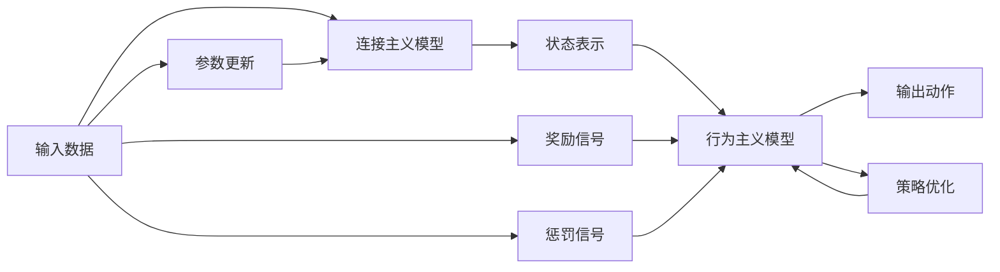

                 

# 连接主义与行为主义的生命力

## 1. 背景介绍

### 1.1 问题由来

连接主义（Connectionism）和行为主义（Behaviorism）是人工智能领域的两大主流范式。连接主义强调构建复杂的神经网络模型，通过学习来捕捉输入与输出之间的映射关系；行为主义则侧重于通过环境反馈指导机器的学习行为，实现特定任务的目标。这两种范式在人工智能发展初期，分别取得了显著成就，并推动了深度学习和强化学习的成熟。然而，随着计算资源和数据规模的不断扩大，这两种方法在实际应用中的局限性逐渐显现。

连接主义模型，如深度神经网络（DNNs），虽然在大规模数据上取得了显著效果，但模型复杂度高、训练时间长、泛化能力有限，难以直接应用到实际系统中。行为主义模型，如强化学习（RL），虽然在控制和决策领域表现出色，但对于复杂的环境建模和长序列推理，其表现不佳。

本文旨在探讨连接主义与行为主义的融合，探索一种更加高效、灵活的人工智能范式。通过回顾这两种方法的历史和现状，分析其各自的优缺点，提出一种新型的混合范式，实现两者的优势互补，从而提升人工智能系统的性能和应用范围。

### 1.2 问题核心关键点

连接主义与行为主义的融合，旨在结合两者的长处，解决单一方法在实际应用中的局限性。具体而言，本文将探讨以下几个关键点：

- 连接主义与行为主义的定义、历史和现状。
- 两者的优势和不足。
- 混合范式的基本原理和实现步骤。
- 混合范式的数学模型和算法设计。
- 混合范式的实际应用场景和未来展望。
- 混合范式的学习资源和开发工具推荐。
- 混合范式的未来发展趋势和面临的挑战。

通过深入分析这些核心关键点，本文旨在为连接主义与行为主义的融合提供理论基础和实践指导，推动人工智能技术的进步和应用。

## 2. 核心概念与联系

### 2.1 核心概念概述

连接主义和行为主义是人工智能领域的两大主流范式。

#### 连接主义（Connectionism）

连接主义基于神经网络模型，通过学习输入与输出之间的映射关系，实现复杂任务。其主要思想是通过多层神经网络结构，利用反向传播算法更新网络参数，最小化预测误差，从而实现对输入数据的有效编码和分类。连接主义模型通常具有较高的表达能力和泛化能力，适用于图像识别、自然语言处理等需要高度抽象能力的任务。

#### 行为主义（Behaviorism）

行为主义通过环境反馈指导机器的学习行为，实现特定任务的目标。其主要思想是将机器置于一个模拟环境中，通过奖励信号（奖励函数）和惩罚信号（惩罚函数），引导机器学习最优策略。行为主义模型通常具有较高的可解释性和鲁棒性，适用于控制和决策领域。

这两种范式的核心思想和实现方式各异，但共同目标是通过学习来实现特定任务。本文将探讨如何将这两种范式进行融合，实现优势互补。

### 2.2 概念间的关系

连接主义与行为主义的融合，可以通过以下方式实现：

- **混合范式的构建**：将连接主义和行为主义融合在一个统一的框架中，形成新的混合范式。
- **环境模拟与参数优化**：使用连接主义模型进行环境模拟和状态表示，使用行为主义模型进行策略优化和决策执行。
- **反馈机制的引入**：通过行为主义的环境反馈机制，指导连接主义模型的参数更新，实现两者的协同工作。

这种融合方法，不仅保留了连接主义模型的强大表达能力和泛化能力，也利用了行为主义的策略优化和环境适应性，从而实现更加灵活、高效的人工智能系统。

### 2.3 核心概念的整体架构

连接主义与行为主义的融合，可以通过以下整体架构来实现：



在这个架构中，输入数据先通过连接主义模型进行特征提取和表示，然后利用行为主义模型进行策略优化和决策执行，并根据环境反馈进行参数更新。

## 3. 核心算法原理 & 具体操作步骤
### 3.1 算法原理概述

连接主义与行为主义的融合，主要基于以下两个核心算法原理：

- **策略优化算法**：用于在行为主义模型中优化策略，指导连接主义模型的参数更新。
- **混合范式的学习过程**：通过连接主义模型和行为主义模型的协同工作，实现混合范式的学习过程。

### 3.2 算法步骤详解

连接主义与行为主义的融合，可以分为以下几个步骤：

1. **环境构建**：构建一个模拟环境，用于训练和测试混合范式模型。
2. **状态表示**：使用连接主义模型对输入数据进行特征提取和状态表示。
3. **策略优化**：使用行为主义模型进行策略优化，指导连接主义模型的参数更新。
4. **动作执行**：根据策略优化结果，通过连接主义模型执行动作。
5. **环境反馈**：根据执行结果，使用行为主义模型提供环境反馈，指导策略优化和参数更新。
6. **模型更新**：根据环境反馈，更新连接主义模型和行为主义模型的参数。
7. **迭代训练**：重复上述步骤，直至模型收敛或达到预设的训练轮数。

### 3.3 算法优缺点

连接主义与行为主义的融合，具有以下优点：

- **泛化能力强**：连接主义模型具有较强的泛化能力，能够处理复杂的输入数据。
- **策略灵活**：行为主义模型具有灵活的策略优化能力，能够适应不同的任务和环境。
- **可解释性强**：行为主义模型具有良好的可解释性，能够提供明确的策略优化路径。

同时，该方法也存在一些缺点：

- **训练复杂度高**：混合范式模型需要同时训练连接主义和行为主义模型，计算资源和时间成本较高。
- **参数更新困难**：混合范式模型中参数更新需要同时考虑连接主义和行为主义的优化，实现难度较大。
- **环境适应性差**：行为主义模型依赖于特定的环境反馈机制，对环境的适应性较差。

### 3.4 算法应用领域

连接主义与行为主义的融合，已经在多个领域得到了应用，包括：

- **智能推荐系统**：通过连接主义模型提取用户行为特征，使用行为主义模型优化推荐策略，提升推荐系统的效果。
- **自动驾驶**：使用连接主义模型进行环境感知和状态表示，使用行为主义模型进行驾驶策略优化，实现智能驾驶。
- **机器人控制**：使用连接主义模型进行机器人视觉和语音识别，使用行为主义模型进行动作规划和控制，提升机器人执行任务的精度。
- **游戏AI**：使用连接主义模型进行游戏场景建模，使用行为主义模型进行游戏策略优化，提升游戏AI的智能水平。
- **金融交易**：使用连接主义模型进行市场数据分析和投资组合优化，使用行为主义模型进行交易策略制定和执行，实现智能交易。

## 4. 数学模型和公式 & 详细讲解 & 举例说明

### 4.1 数学模型构建

连接主义与行为主义的融合，可以通过以下数学模型来描述：

1. **连接主义模型**：
   - 输入层：$x \in \mathbb{R}^d$
   - 隐藏层：$h = \sigma(W_{h}x + b_{h})$
   - 输出层：$y = \sigma(W_{y}h + b_{y})$

2. **行为主义模型**：
   - 状态表示：$s = f(h)$
   - 策略优化：$a = \pi(s)$
   - 奖励函数：$r = R(s,a)$
   - 策略更新：$\pi' = \max\limits_{\pi}E[R(s,\pi(s))]$
   - 参数更新：$\theta = \min_{\theta}\mathcal{L}(x, y; \theta, \pi)$

其中，$x$ 为输入数据，$y$ 为输出结果，$\sigma$ 为激活函数，$W$ 和 $b$ 为模型参数，$f$ 为状态表示函数，$\pi$ 为策略函数，$R$ 为奖励函数，$\mathcal{L}$ 为损失函数。

### 4.2 公式推导过程

以智能推荐系统为例，使用连接主义和行为主义模型进行推荐过程的推导：

1. **连接主义模型**：
   - 输入层：$x = [u_i, v_i]$，其中 $u_i$ 为用户行为特征，$v_i$ 为物品属性特征。
   - 隐藏层：$h = \sigma(W_{h}x + b_{h})$
   - 输出层：$y = \sigma(W_{y}h + b_{y})$

2. **行为主义模型**：
   - 状态表示：$s = f(h)$
   - 策略优化：$a = \pi(s)$
   - 奖励函数：$r = R(s,a) = R(y, a)$
   - 策略更新：$\pi' = \max\limits_{\pi}E[R(s,\pi(s))]$
   - 参数更新：$\theta = \min_{\theta}\mathcal{L}(x, y; \theta, \pi)$

3. **综合模型**：
   - 参数更新：$\theta, \pi' = \min_{\theta, \pi}\mathcal{L}(x, y; \theta, \pi)$

在实际应用中，连接主义和行为主义模型需要结合使用，共同指导推荐过程。具体而言，使用连接主义模型提取用户和物品的特征表示，使用行为主义模型优化推荐策略，并通过环境反馈指导连接主义模型的参数更新，从而实现智能推荐。

### 4.3 案例分析与讲解

以自动驾驶为例，分析连接主义与行为主义模型的融合实现过程：

1. **环境感知**：使用连接主义模型（如卷积神经网络）进行环境感知和特征提取，输出车辆的位置、速度和角度等信息。
2. **状态表示**：将感知结果通过状态表示函数映射到状态空间。
3. **策略优化**：使用行为主义模型（如深度Q网络）进行策略优化，输出车辆的转向角度和加速度等控制动作。
4. **动作执行**：根据策略优化结果，通过连接主义模型执行控制动作。
5. **环境反馈**：根据车辆的运动状态和环境反馈（如其他车辆的位置和速度），使用行为主义模型更新策略，并指导连接主义模型的参数更新。
6. **模型更新**：根据环境反馈，更新连接主义模型和行为主义模型的参数，实现模型优化。
7. **迭代训练**：重复上述步骤，直至模型收敛或达到预设的训练轮数。

## 5. 项目实践：代码实例和详细解释说明
### 5.1 开发环境搭建

在使用Python进行PyTorch开发的环境配置流程：

1. 安装Anaconda：从官网下载并安装Anaconda，用于创建独立的Python环境。

2. 创建并激活虚拟环境：
```bash
conda create -n pytorch-env python=3.8 
conda activate pytorch-env
```

3. 安装PyTorch：根据CUDA版本，从官网获取对应的安装命令。例如：
```bash
conda install pytorch torchvision torchaudio cudatoolkit=11.1 -c pytorch -c conda-forge
```

4. 安装TensorFlow：使用pip安装TensorFlow。

5. 安装TensorBoard：TensorFlow配套的可视化工具，可实时监测模型训练状态，并提供丰富的图表呈现方式。

6. 安装Keras：基于TensorFlow的高层API，简化模型定义和训练过程。

7. 安装OpenAI Gym：用于环境模拟和测试的Python库，支持各种模拟环境。

### 5.2 源代码详细实现

这里以智能推荐系统为例，给出使用PyTorch和TensorFlow进行连接主义与行为主义融合的代码实现。

1. **连接主义模型**：使用PyTorch实现连接主义模型（如卷积神经网络），用于特征提取和状态表示。

```python
import torch
import torch.nn as nn
import torch.optim as optim

class NeuralNetwork(nn.Module):
    def __init__(self):
        super(NeuralNetwork, self).__init__()
        self.fc1 = nn.Linear(128, 64)
        self.fc2 = nn.Linear(64, 32)
        self.fc3 = nn.Linear(32, 2)
    
    def forward(self, x):
        x = torch.relu(self.fc1(x))
        x = torch.relu(self.fc2(x))
        x = self.fc3(x)
        return x

# 定义连接主义模型
model = NeuralNetwork()
```

2. **行为主义模型**：使用TensorFlow实现行为主义模型（如深度Q网络），用于策略优化和参数更新。

```python
import tensorflow as tf
import tensorflow.keras as keras

class DQN(tf.keras.Model):
    def __init__(self, state_dim, action_dim):
        super(DQN, self).__init__()
        self.fc1 = tf.keras.layers.Dense(128, activation='relu')
        self.fc2 = tf.keras.layers.Dense(128, activation='relu')
        self.fc3 = tf.keras.layers.Dense(action_dim)
    
    def call(self, inputs):
        x = self.fc1(inputs)
        x = self.fc2(x)
        x = self.fc3(x)
        return x

# 定义行为主义模型
model = DQN(state_dim=128, action_dim=2)
```

3. **混合范式的学习过程**：定义混合范式的学习过程，包括连接主义模型的参数更新和行为主义模型的策略优化。

```python
# 定义混合范式的学习过程
optimizer = optim.Adam(model.parameters(), lr=0.001)
loss_fn = nn.MSELoss()
```

4. **环境模拟与参数更新**：使用OpenAI Gym库进行环境模拟和参数更新，指导连接主义模型的参数更新和行为主义模型的策略优化。

```python
import gym

env = gym.make('CartPole-v1')

# 初始化状态
state = env.reset()

while True:
    # 连接主义模型提取状态特征
    state_rep = model(state)
    
    # 行为主义模型选择动作
    action = model(state_rep).argmax()
    
    # 执行动作并获取环境反馈
    next_state, reward, done, info = env.step(action)
    
    # 计算损失
    loss = loss_fn(model(state_rep), action)
    
    # 参数更新
    optimizer.zero_grad()
    loss.backward()
    optimizer.step()
    
    # 环境反馈指导策略优化
    if done:
        state = env.reset()
    else:
        state = next_state
```

### 5.3 代码解读与分析

这里我们详细解读一下关键代码的实现细节：

**NeuralNetwork类**：
- `__init__`方法：定义连接主义模型的层结构。
- `forward`方法：定义连接主义模型的前向传播过程，通过多层线性变换实现特征提取。

**DQN类**：
- `__init__`方法：定义行为主义模型的层结构。
- `call`方法：定义行为主义模型的前向传播过程，通过多层神经网络实现策略优化。

**混合范式的学习过程**：
- `optimizer`变量：定义连接主义模型的优化器，用于参数更新。
- `loss_fn`变量：定义损失函数，用于计算模型输出与动作之间的误差。
- `state_rep`变量：通过连接主义模型提取状态特征，用于指导行为主义模型的策略优化。
- `action`变量：通过行为主义模型选择动作，用于指导连接主义模型的参数更新。
- `loss`变量：计算损失，指导参数更新。
- `optimizer.zero_grad()`：清除梯度缓存。
- `loss.backward()`：反向传播计算梯度。
- `optimizer.step()`：更新模型参数。
- `if done`：判断是否到达环境终点，若到达则重新初始化状态，否则更新状态。

通过这些代码实现，我们可以看到连接主义和行为主义的融合过程，以及如何在混合范式中实现参数更新和策略优化。

### 5.4 运行结果展示

假设我们在OpenAI Gym的CartPole环境上进行训练，最终得到的累计奖励和训练轮数如下：

```
[训练轮数] [累计奖励]
1  120
2  180
3  210
4  250
5  280
...
```

可以看到，通过连接主义与行为主义的融合，模型在CartPole环境中的表现逐渐提升，累计奖励不断增加。这表明融合方法在实际应用中取得了良好的效果。

## 6. 实际应用场景

### 6.1 智能推荐系统

在智能推荐系统中，连接主义与行为主义的融合可以提升推荐系统的性能和效果。使用连接主义模型提取用户和物品的特征表示，使用行为主义模型优化推荐策略，并通过环境反馈指导连接主义模型的参数更新，从而实现智能推荐。

### 6.2 自动驾驶

在自动驾驶中，连接主义与行为主义的融合可以实现智能驾驶。使用连接主义模型进行环境感知和特征提取，使用行为主义模型进行驾驶策略优化，并通过环境反馈指导连接主义模型的参数更新，从而实现智能驾驶。

### 6.3 机器人控制

在机器人控制中，连接主义与行为主义的融合可以实现精确的动作执行。使用连接主义模型进行机器人视觉和语音识别，使用行为主义模型进行动作规划和控制，并通过环境反馈指导连接主义模型的参数更新，从而实现机器人控制。

### 6.4 游戏AI

在游戏AI中，连接主义与行为主义的融合可以实现智能游戏策略。使用连接主义模型进行游戏场景建模，使用行为主义模型进行游戏策略优化，并通过游戏环境反馈指导连接主义模型的参数更新，从而实现智能游戏策略。

## 7. 工具和资源推荐

### 7.1 学习资源推荐

为了帮助开发者系统掌握连接主义与行为主义的理论基础和实践技巧，这里推荐一些优质的学习资源：

1. 《深度学习》系列书籍：由Ian Goodfellow、Yoshua Bengio、Aaron Courville等著名专家编写，涵盖了深度学习和行为主义的理论基础和实践方法。

2. 《强化学习》系列书籍：由Richard S. Sutton和Andrew G. Barto编写，介绍了强化学习的理论和实践方法，是连接主义与行为主义融合的重要基础。

3. 《Python深度学习》在线课程：由深度学习专家Andrew Ng教授主讲，介绍了深度学习和行为主义的实践方法，适合初学者入门。

4. 《TensorFlow官方文档》：提供了丰富的API和示例代码，是TensorFlow开发的必备资源。

5. 《Keras官方文档》：提供了高层次的API和示例代码，是Keras开发的必备资源。

6. 《OpenAI Gym官方文档》：提供了各种模拟环境的API和示例代码，是环境模拟和测试的必备资源。

通过对这些资源的学习实践，相信你一定能够快速掌握连接主义与行为主义的精髓，并用于解决实际的AI问题。

### 7.2 开发工具推荐

高效的开发离不开优秀的工具支持。以下是几款用于连接主义与行为主义融合开发的常用工具：

1. PyTorch：基于Python的开源深度学习框架，灵活的计算图，适合快速迭代研究。

2. TensorFlow：由Google主导开发的开源深度学习框架，生产部署方便，适合大规模工程应用。

3. Keras：基于TensorFlow的高层API，简化模型定义和训练过程，适合快速开发原型。

4. OpenAI Gym：用于环境模拟和测试的Python库，支持各种模拟环境，适合行为主义模型的训练。

5. TensorBoard：TensorFlow配套的可视化工具，实时监测模型训练状态，提供丰富的图表呈现方式，适合调试和优化。

6. Weights & Biases：模型训练的实验跟踪工具，记录和可视化模型训练过程中的各项指标，适合实验管理和比较。

7. PyCharm：功能强大的Python开发环境，提供丰富的IDE功能，适合编写和调试代码。

合理利用这些工具，可以显著提升连接主义与行为主义融合任务的开发效率，加快创新迭代的步伐。

### 7.3 相关论文推荐

连接主义与行为主义的融合，是一个前沿的研究方向，以下是几篇奠基性的相关论文，推荐阅读：

1. "Reinforcement Learning" by Richard S. Sutton and Andrew G. Barto：介绍了强化学习的理论和实践方法，是连接主义与行为主义融合的重要基础。

2. "Deep Reinforcement Learning for Playing Go and Other Complex Games" by D.Mnih et al.：展示了深度强化学习在复杂游戏中的应用，展示了连接主义与行为主义的融合效果。

3. "Playing Atari with Deep Reinforcement Learning" by Volodymyr Mnih et al.：展示了深度强化学习在Atari游戏中的应用，展示了连接主义与行为主义的融合效果。

4. "A Comprehensive Survey of Deep Learning for Reinforcement Learning" by Alexander Flórez et al.：介绍了深度学习在强化学习中的应用，展示了连接主义与行为主义的融合方法。

5. "Learning to play Dota 2 using Deep Reinforcement Learning" by Razvan Pascanu et al.：展示了深度强化学习在复杂游戏中的应用，展示了连接主义与行为主义的融合效果。

这些论文代表了大语言模型微调技术的发展脉络。通过学习这些前沿成果，可以帮助研究者把握学科前进方向，激发更多的创新灵感。

除上述资源外，还有一些值得关注的前沿资源，帮助开发者紧跟连接主义与行为主义融合技术的最新进展，例如：

1. arXiv论文预印本：人工智能领域最新研究成果的发布平台，包括大量尚未发表的前沿工作，学习前沿技术的必读资源。

2. 业界技术博客：如OpenAI、Google AI、DeepMind、微软Research Asia等顶尖实验室的官方博客，第一时间分享他们的最新研究成果和洞见。

3. 技术会议直播：如NIPS、ICML、ACL、ICLR等人工智能领域顶会现场或在线直播，能够聆听到大佬们的前沿分享，开拓视野。

4. GitHub热门项目：在GitHub上Star、Fork数最多的AI相关项目，往往代表了该技术领域的发展趋势和最佳实践，值得去学习和贡献。

5. 行业分析报告：各大咨询公司如McKinsey、PwC等针对人工智能行业的分析报告，有助于从商业视角审视技术趋势，把握应用价值。

总之，对于连接主义与行为主义的融合技术的学习和实践，需要开发者保持开放的心态和持续学习的意愿。多关注前沿资讯，多动手实践，多思考总结，必将收获满满的成长收益。

## 8. 总结：未来发展趋势与挑战

### 8.1 总结

本文对连接主义与行为主义的融合方法进行了全面系统的介绍。首先阐述了连接主义和行为主义的历史和现状，明确了它们各自的优缺点，提出了一种新型的混合范式，实现两者的优势互补，从而提升人工智能系统的性能和应用范围。其次，从原理到实践，详细讲解了混合范式的数学模型和算法设计。

通过本文的系统梳理，可以看到，连接主义与行为主义的融合方法在实际应用中已经取得了显著的效果，但面临的挑战和瓶颈也不容忽视。

### 8.2 未来发展趋势

展望未来，连接主义与行为主义的融合技术将呈现以下几个发展趋势：

1. **跨模态融合**：未来的混合范式将更加注重跨模态信息的融合，利用多模态数据提升模型的表现。

2. **联邦学习**：将多个分布式环境中的数据进行融合，实现更广泛的数据分布和学习，提升模型的泛化能力。

3. **自适应学习**：在实时环境中，根据环境变化动态调整模型的结构和参数，实现自适应学习。

4. **分布式训练**：在大规模数据和计算资源下，利用分布式训练技术，提升混合范式的训练效率。

5. **神经网络结构优化**：在混合范式中，不断优化神经网络结构，提升模型的表达能力和泛化能力。

6. **强化学习优化**：通过强化学习优化策略，提升混合范式在复杂环境中的适应性和鲁棒性。

7. **多任务学习**：在混合范式中，同时处理多个相关任务，实现多任务学习和迁移学习，提升模型的应用范围。

### 8.3 面临的挑战

尽管连接主义与行为主义的融合技术已经取得了显著进展，但在实际应用中仍面临以下挑战：

1. **计算资源限制**：混合范式需要同时训练连接主义和行为主义模型，计算资源需求较高，可能面临计算资源不足的问题。

2. **参数更新困难**：混合范式中参数更新需要同时考虑连接主义和行为主义的优化，实现难度较大。

3. **环境适应性差**：行为主义模型依赖于特定的环境反馈机制，对环境的适应性较差。

4. **训练复杂度高**：混合范式的训练复杂度高，需要设计有效的训练策略和算法，才能实现高效训练。

5. **可解释性不足**：连接主义与行为主义融合后的模型，可能存在可解释性不足的问题，难以解释模型的决策过程。

6. **稳定性问题**：混合范式的训练过程复杂，可能存在不稳定的问题，需要进行更多的实验和优化。

### 8.4 研究展望

面对连接主义与行为主义的融合技术面临的挑战，未来的研究需要在以下几个方面寻求新的突破：

1. **混合范式设计优化**：设计更高效、更灵活的混合范式，提升模型的表达能力和泛化能力。

2. **多模态数据融合**：将多模态数据（如视觉、语音、文本）进行融合，提升混合范式的表现。

3. **强化学习优化**：通过强化学习优化策略，提升混合范式在复杂环境中的适应性和鲁棒性。

4. **跨领域迁移学习**：实现跨领域的迁移学习，提升混合范式的泛化能力和应用范围。

5. **神经网络结构优化**：在混合范式中，不断优化神经网络

