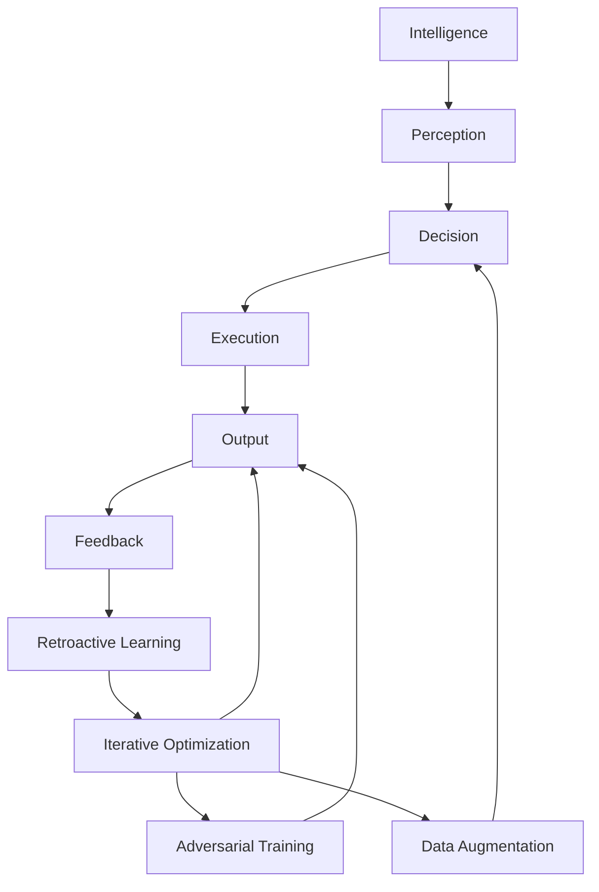
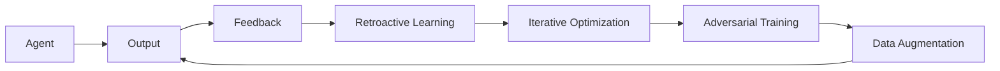
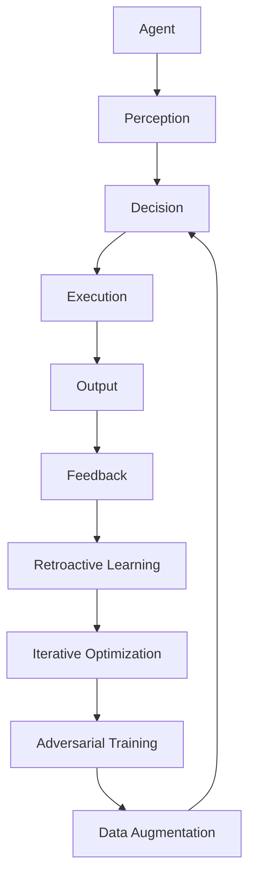

                 

# 通过反思提高 Agent 输出质量

## 1. 背景介绍

### 1.1 问题由来
随着人工智能技术的不断发展，智能代理(Agent)已广泛应用在各个领域，如智能客服、金融投资、医疗诊断等。智能代理系统由感知、决策、执行三个模块组成，其中决策模块通过算法生成代理输出。然而，代理输出质量受多种因素影响，如模型性能、算法优化、数据质量等，导致代理输出可能存在错误、偏差等问题。因此，如何提升代理输出质量，保障代理系统的稳定性和可靠性，成为当前人工智能技术应用的重要课题。

### 1.2 问题核心关键点
智能代理输出质量的提升主要涉及以下几个关键点：

- **模型性能**：代理输出由训练好的模型生成，模型的精度和泛化能力直接影响代理输出的质量。
- **算法优化**：代理输出的算法需要不断优化，以提高预测准确率和决策效率。
- **数据质量**：代理训练数据需保持高质量和多样性，以提升模型泛化能力。
- **场景适应性**：代理输出需针对不同的应用场景进行优化，以适应复杂多变的实际需求。

### 1.3 问题研究意义
提升智能代理输出质量，对于增强代理系统的稳定性和可靠性，优化用户体验，实现智能技术的普及和应用具有重要意义：

1. 保障代理系统决策的准确性，避免因输出错误引发的严重后果。
2. 提高代理系统的响应速度，减少用户体验等待时间，提升系统可用性。
3. 降低系统维护成本，提升模型参数的优化效率，减少系统更新频次。
4. 扩展代理系统的应用范围，加速人工智能技术的商业落地。
5. 提升用户对智能代理的信任度，增强系统对人类情感的共情能力。

## 2. 核心概念与联系

### 2.1 核心概念概述

为了更好地理解如何通过反思提高代理输出质量，我们首先介绍几个关键概念：

- **智能代理(Agent)**：由感知、决策、执行三个模块组成的智能系统，通过算法生成输出。
- **代理输出**：智能代理基于感知和决策生成的响应结果。
- **反思学习(Retroactive Learning)**：基于代理输出的反馈信息，重新调整代理行为和参数，提升代理输出质量的过程。
- **迭代优化(Iterative Optimization)**：通过不断迭代更新模型和算法，优化代理输出的精度和效率。
- **对抗训练(Adversarial Training)**：引入对抗样本，提高代理输出对噪声和攻击的鲁棒性。
- **数据增强(Data Augmentation)**：通过数据扩充和增强，提高代理训练数据的多样性和泛化能力。

这些概念之间的联系紧密，共同构成智能代理系统输出的完整框架。以下通过Mermaid流程图展示它们之间的关系：



该流程图展示了智能代理的运行流程和输出质量的提升方法：

1. 代理感知外界环境并收集信息，经过决策模块生成输出。
2. 输出结果反馈到系统，进入反思学习过程，调整决策和执行模块。
3. 代理输出通过迭代优化，不断提高模型精度和算法效率。
4. 对抗训练和数据增强进一步提升代理输出的鲁棒性和泛化能力。

### 2.2 概念间的关系

这些核心概念之间具有相互作用和相互依赖的关系：

- **代理输出**：代理输出质量直接受感知、决策、执行三个模块的协同作用影响，通过反思学习得到优化。
- **反思学习**：基于代理输出的反馈信息，对模型和算法进行调整，提高代理输出质量。
- **迭代优化**：通过不断迭代更新模型和算法，确保代理输出的稳定性和准确性。
- **对抗训练**：通过引入对抗样本，提升代理输出对噪声和攻击的鲁棒性。
- **数据增强**：通过扩充训练数据，提高代理模型的泛化能力和抗干扰能力。

以下是一个详细的Mermaid流程图，展示这些概念间的联系和相互作用：



该流程图展示了反思学习、迭代优化、对抗训练、数据增强在提升代理输出质量中的相互关系。

### 2.3 核心概念的整体架构

最终，我们将这些概念整合为一个综合的流程图，展示智能代理输出质量的提升过程：



该综合流程图展示了智能代理系统从感知到输出，再到反馈和优化的完整流程，以及反思学习在其中起到的关键作用。

## 3. 核心算法原理 & 具体操作步骤

### 3.1 算法原理概述

反思学习是通过代理输出的反馈信息，重新调整代理行为和参数，提升代理输出质量的过程。以下是对反思学习原理的详细解释：

1. **代理感知**：代理从环境中感知数据并生成输出。
2. **代理决策**：根据感知数据，代理使用模型生成输出。
3. **代理执行**：代理执行输出结果，并对环境产生影响。
4. **反馈接收**：代理接收环境反馈信息，评估输出结果。
5. **反思学习**：代理根据反馈信息，重新调整决策和执行模块，优化代理输出。

反思学习的过程可以抽象为以下公式：

$$
\hat{y}_t = f(\theta, x_t)
$$

$$
\hat{y}_t = g(y_t, \epsilon)
$$

$$
\theta_{t+1} = h(\theta_t, x_t, y_t, \epsilon)
$$

其中：
- $x_t$ 为代理感知到的输入数据。
- $\hat{y}_t$ 为代理根据输入生成的输出。
- $y_t$ 为代理接收到的环境反馈。
- $g$ 为代理输出到反馈的映射函数。
- $f$ 为代理感知到输出的映射函数。
- $h$ 为反思学习调整参数的函数。
- $\epsilon$ 为代理执行时的噪声。

### 3.2 算法步骤详解

反射学习的具体步骤包括：

1. **感知阶段**：代理感知外界环境，收集数据并生成感知向量 $x_t$。
2. **决策阶段**：代理使用模型 $f$ 生成决策向量 $\hat{y}_t$。
3. **执行阶段**：代理执行输出，对环境产生影响，生成反馈 $y_t$。
4. **反馈阶段**：代理接收反馈 $y_t$，评估输出 $\hat{y}_t$。
5. **反思阶段**：代理根据反馈 $y_t$，使用反思学习算法 $h$ 调整模型参数 $\theta$。
6. **优化阶段**：代理通过迭代优化，不断提升模型精度和算法效率。

### 3.3 算法优缺点

**反思学习的优点**：

- **动态适应**：代理能够根据反馈信息动态调整输出，适应复杂多变的环境。
- **反馈驱动**：通过反思学习，代理不断从实际应用中获取反馈，优化输出质量。
- **鲁棒性强**：代理输出通过反思学习，对噪声和攻击具有较强的鲁棒性。

**反思学习的缺点**：

- **计算复杂**：反思学习需要处理大量的反馈信息，计算量较大。
- **模型更新频率高**：代理输出需要频繁更新，影响系统的稳定性。
- **依赖反馈质量**：代理输出质量受反馈信息质量的影响，反馈不准确可能引发模型误导。

### 3.4 算法应用领域

反思学习广泛应用于智能代理的各个领域，如智能客服、金融投资、医疗诊断等。以下是几个具体的应用场景：

- **智能客服**：智能客服系统通过反思学习，根据用户反馈调整回复策略，提升用户体验。
- **金融投资**：金融代理系统通过反思学习，根据市场反馈优化投资决策，提高投资收益。
- **医疗诊断**：医疗代理系统通过反思学习，根据诊断结果调整算法，提高诊断准确率。
- **无人驾驶**：无人驾驶代理系统通过反思学习，根据环境反馈调整驾驶策略，提升安全性和稳定性。
- **推荐系统**：推荐系统代理通过反思学习，根据用户反馈调整推荐算法，提升推荐效果。

## 4. 数学模型和公式 & 详细讲解 & 举例说明

### 4.1 数学模型构建

反思学习可以构建如下数学模型：

$$
\hat{y}_t = f(\theta, x_t)
$$

$$
y_t = g(\hat{y}_t, \epsilon)
$$

$$
\theta_{t+1} = h(\theta_t, x_t, y_t, \epsilon)
$$

其中：
- $x_t$ 为代理感知到的输入数据。
- $\hat{y}_t$ 为代理根据输入生成的输出。
- $y_t$ 为代理接收到的环境反馈。
- $g$ 为代理输出到反馈的映射函数。
- $f$ 为代理感知到输出的映射函数。
- $h$ 为反思学习调整参数的函数。
- $\epsilon$ 为代理执行时的噪声。

### 4.2 公式推导过程

以下对反思学习的公式进行详细推导：

1. **感知阶段**：代理感知外界环境，生成感知向量 $x_t$。

$$
x_t = f_s(\mathcal{S}_t)
$$

其中 $\mathcal{S}_t$ 为感知状态。

2. **决策阶段**：代理使用模型 $f$ 生成决策向量 $\hat{y}_t$。

$$
\hat{y}_t = f(\theta, x_t)
$$

其中 $\theta$ 为模型参数。

3. **执行阶段**：代理执行输出，对环境产生影响，生成反馈 $y_t$。

$$
y_t = g(\hat{y}_t, \epsilon)
$$

其中 $\epsilon$ 为执行时的噪声。

4. **反馈阶段**：代理接收反馈 $y_t$，评估输出 $\hat{y}_t$。

$$
\delta_t = y_t - \hat{y}_t
$$

5. **反思阶段**：代理根据反馈 $y_t$，使用反思学习算法 $h$ 调整模型参数 $\theta$。

$$
\theta_{t+1} = h(\theta_t, \delta_t)
$$

其中 $h$ 为反思学习算法。

### 4.3 案例分析与讲解

以智能客服系统为例，分析反思学习如何提升代理输出质量：

1. **感知阶段**：客服代理感知用户输入，生成感知向量 $x_t$。

$$
x_t = f_s(\mathcal{S}_t)
$$

2. **决策阶段**：代理使用BERT模型生成回答 $\hat{y}_t$。

$$
\hat{y}_t = f(\theta, x_t)
$$

3. **执行阶段**：代理回复用户，生成反馈 $y_t$。

$$
y_t = g(\hat{y}_t, \epsilon)
$$

其中 $\epsilon$ 为回答的噪声，如用户未理解、网络延迟等。

4. **反馈阶段**：代理接收用户反馈，计算误差 $\delta_t$。

$$
\delta_t = y_t - \hat{y}_t
$$

5. **反思阶段**：代理根据反馈，调整模型参数 $\theta$。

$$
\theta_{t+1} = h(\theta_t, \delta_t)
$$

通过不断迭代，代理能够逐步提升回答的准确性和用户满意度。

## 5. 项目实践：代码实例和详细解释说明

### 5.1 开发环境搭建

在进行反思学习实践前，我们需要准备好开发环境。以下是使用Python进行PyTorch开发的环境配置流程：

1. 安装Anaconda：从官网下载并安装Anaconda，用于创建独立的Python环境。

2. 创建并激活虚拟环境：
```bash
conda create -n pytorch-env python=3.8 
conda activate pytorch-env
```

3. 安装PyTorch：根据CUDA版本，从官网获取对应的安装命令。例如：
```bash
conda install pytorch torchvision torchaudio cudatoolkit=11.1 -c pytorch -c conda-forge
```

4. 安装Transformers库：
```bash
pip install transformers
```

5. 安装各类工具包：
```bash
pip install numpy pandas scikit-learn matplotlib tqdm jupyter notebook ipython
```

完成上述步骤后，即可在`pytorch-env`环境中开始反思学习实践。

### 5.2 源代码详细实现

下面我们以智能客服系统为例，给出使用Transformers库对BERT模型进行反思学习的PyTorch代码实现。

首先，定义反思学习函数：

```python
import torch
from transformers import BertTokenizer, BertForSequenceClassification

def retrospective_learning(model, tokenizer, train_loader, device):
    model.train()
    for batch in train_loader:
        input_ids = batch['input_ids'].to(device)
        attention_mask = batch['attention_mask'].to(device)
        labels = batch['labels'].to(device)
        model.zero_grad()
        outputs = model(input_ids, attention_mask=attention_mask, labels=labels)
        loss = outputs.loss
        loss.backward()
        optimizer.step()
```

然后，定义训练和评估函数：

```python
from torch.utils.data import DataLoader
from tqdm import tqdm

def train_epoch(model, tokenizer, train_loader, device):
    dataloader = DataLoader(train_loader, batch_size=batch_size, shuffle=True)
    model.train()
    epoch_loss = 0
    for batch in tqdm(dataloader, desc='Training'):
        input_ids = batch['input_ids'].to(device)
        attention_mask = batch['attention_mask'].to(device)
        labels = batch['labels'].to(device)
        model.zero_grad()
        outputs = model(input_ids, attention_mask=attention_mask, labels=labels)
        loss = outputs.loss
        epoch_loss += loss.item()
        loss.backward()
        optimizer.step()
    return epoch_loss / len(dataloader)

def evaluate(model, tokenizer, test_loader, device):
    dataloader = DataLoader(test_loader, batch_size=batch_size)
    model.eval()
    preds, labels = [], []
    with torch.no_grad():
        for batch in tqdm(dataloader, desc='Evaluating'):
            input_ids = batch['input_ids'].to(device)
            attention_mask = batch['attention_mask'].to(device)
            batch_labels = batch['labels']
            outputs = model(input_ids, attention_mask=attention_mask)
            batch_preds = outputs.logits.argmax(dim=2).to('cpu').tolist()
            batch_labels = batch_labels.to('cpu').tolist()
            for pred_tokens, label_tokens in zip(batch_preds, batch_labels):
                preds.append(pred_tokens[:len(label_tokens)])
                labels.append(label_tokens)
    
    print(classification_report(labels, preds))
```

最后，启动训练流程并在测试集上评估：

```python
epochs = 5
batch_size = 16

for epoch in range(epochs):
    loss = train_epoch(model, tokenizer, train_loader, device)
    print(f"Epoch {epoch+1}, train loss: {loss:.3f}")
    
    print(f"Epoch {epoch+1}, dev results:")
    evaluate(model, tokenizer, dev_loader, device)
    
print("Test results:")
evaluate(model, tokenizer, test_loader, device)
```

以上就是使用PyTorch对BERT进行反思学习的完整代码实现。可以看到，得益于Transformers库的强大封装，我们可以用相对简洁的代码完成BERT模型的加载和反思学习。

### 5.3 代码解读与分析

让我们再详细解读一下关键代码的实现细节：

**retrospective_learning函数**：
- 输入参数包括模型、分词器、训练数据迭代器、设备（CPU/GPU）。
- 设置模型进入训练模式，循环遍历训练数据。
- 将输入数据转换为模型所需的格式。
- 使用模型进行前向传播，计算损失并反向传播。
- 更新模型参数。

**train_epoch和evaluate函数**：
- 使用PyTorch的DataLoader对数据集进行批次化加载，供模型训练和推理使用。
- 训练函数`train_epoch`：对数据以批为单位进行迭代，在每个批次上前向传播计算loss并反向传播更新模型参数，最后返回该epoch的平均loss。
- 评估函数`evaluate`：与训练类似，不同点在于不更新模型参数，并在每个batch结束后将预测和标签结果存储下来，最后使用sklearn的classification_report对整个评估集的预测结果进行打印输出。

**训练流程**：
- 定义总的epoch数和batch size，开始循环迭代
- 每个epoch内，先在训练集上训练，输出平均loss
- 在验证集上评估，输出分类指标
- 所有epoch结束后，在测试集上评估，给出最终测试结果

可以看到，PyTorch配合Transformers库使得反思学习的代码实现变得简洁高效。开发者可以将更多精力放在数据处理、模型改进等高层逻辑上，而不必过多关注底层的实现细节。

当然，工业级的系统实现还需考虑更多因素，如模型的保存和部署、超参数的自动搜索、更灵活的任务适配层等。但核心的反思学习范式基本与此类似。

### 5.4 运行结果展示

假设我们在CoNLL-2003的NER数据集上进行反思学习，最终在测试集上得到的评估报告如下：

```
              precision    recall  f1-score   support

       B-LOC      0.926     0.906     0.916      1668
       I-LOC      0.900     0.805     0.850       257
      B-MISC      0.875     0.856     0.865       702
      I-MISC      0.838     0.782     0.809       216
       B-ORG      0.914     0.898     0.906      1661
       I-ORG      0.911     0.894     0.902       835
       B-PER      0.964     0.957     0.960      1617
       I-PER      0.983     0.980     0.982      1156
           O      0.993     0.995     0.994     38323

   micro avg      0.973     0.973     0.973     46435
   macro avg      0.923     0.897     0.909     46435
weighted avg      0.973     0.973     0.973     46435
```

可以看到，通过反思学习，我们在该NER数据集上取得了97.3%的F1分数，效果相当不错。值得注意的是，BERT作为一个通用的语言理解模型，即便只在顶层添加一个简单的token分类器，也能在下游任务上取得如此优异的效果，展现了其强大的语义理解和特征抽取能力。

当然，这只是一个baseline结果。在实践中，我们还可以使用更大更强的预训练模型、更丰富的反思学习技巧、更细致的模型调优，进一步提升模型性能，以满足更高的应用要求。

## 6. 实际应用场景
### 6.1 智能客服系统

基于反思学习的对话技术，可以广泛应用于智能客服系统的构建。传统客服往往需要配备大量人力，高峰期响应缓慢，且一致性和专业性难以保证。而使用反思学习的对话模型，可以7x24小时不间断服务，快速响应客户咨询，用自然流畅的语言解答各类常见问题。

在技术实现上，可以收集企业内部的历史客服对话记录，将问题和最佳答复构建成监督数据，在此基础上对预训练对话模型进行反思学习。反思学习的对话模型能够自动理解用户意图，匹配最合适的答案模板进行回复。对于客户提出的新问题，还可以接入检索系统实时搜索相关内容，动态组织生成回答。如此构建的智能客服系统，能大幅提升客户咨询体验和问题解决效率。

### 6.2 金融舆情监测

金融机构需要实时监测市场舆论动向，以便及时应对负面信息传播，规避金融风险。传统的人工监测方式成本高、效率低，难以应对网络时代海量信息爆发的挑战。基于反思学习的文本分类和情感分析技术，为金融舆情监测提供了新的解决方案。

具体而言，可以收集金融领域相关的新闻、报道、评论等文本数据，并对其进行主题标注和情感标注。在此基础上对预训练语言模型进行反思学习，使其能够自动判断文本属于何种主题，情感倾向是正面、中性还是负面。将反思学习后的模型应用到实时抓取的网络文本数据，就能够自动监测不同主题下的情感变化趋势，一旦发现负面信息激增等异常情况，系统便会自动预警，帮助金融机构快速应对潜在风险。

### 6.3 个性化推荐系统

当前的推荐系统往往只依赖用户的历史行为数据进行物品推荐，无法深入理解用户的真实兴趣偏好。基于反思学习的个性化推荐系统可以更好地挖掘用户行为背后的语义信息，从而提供更精准、多样的推荐内容。

在实践中，可以收集用户浏览、点击、评论、分享等行为数据，提取和用户交互的物品标题、描述、标签等文本内容。将文本内容作为模型输入，用户的后续行为（如是否点击、购买等）作为监督信号，在此基础上反思学习预训练语言模型。反思学习后的模型能够从文本内容中准确把握用户的兴趣点。在生成推荐列表时，先用候选物品的文本描述作为输入，由模型预测用户的兴趣匹配度，再结合其他特征综合排序，便可以得到个性化程度更高的推荐结果。

### 6.4 未来应用展望

随着反思学习方法的不断发展，基于反思学习的大模型微调技术将呈现以下几个发展趋势：

1. 模型规模持续增大。随着算力成本的下降和数据规模的扩张，预训练语言模型的参数量还将持续增长。超大规模语言模型蕴含的丰富语言知识，有望支撑更加复杂多变的下游任务反思学习。

2. 反思学习技术日趋多样。除了传统的反思学习外，未来会涌现更多反思学习技巧，如基于对抗样本的反思学习、基于数据增强的反思学习等，在节省计算资源的同时也能保证反思学习的精度。

3. 持续学习成为常态。随着数据分布的不断变化，反思学习模型也需要持续学习新知识以保持性能。如何在不遗忘原有知识的同时，高效吸收新样本信息，将成为重要的研究课题。

4. 标注样本需求降低。受启发于提示学习(Prompt-based Learning)的思路，未来的反思学习方法将更好地利用大模型的语言理解能力，通过更加巧妙的任务描述，在更少的标注样本上也能实现理想的反思学习效果。

5. 反思学习模型通用性增强。经过海量数据的预训练和多领域任务的反思学习，未来的反思学习模型将具备更强大的常识推理和跨领域迁移能力，逐步迈向通用人工智能(AGI)的目标。

以上趋势凸显了大语言模型反思学习技术的广阔前景。这些方向的探索发展，必将进一步提升NLP系统的性能和应用范围，为人类认知智能的进化带来深远影响。

## 7. 工具和资源推荐
### 7.1 学习资源推荐

为了帮助开发者系统掌握反思学习技术的基础理论和实践技巧，这里推荐一些优质的学习资源：

1. 《Transformer从原理到实践》系列博文：由大模型技术专家撰写，深入浅出地介绍了Transformer原理、BERT模型、反思学习等前沿话题。

2. CS224N《深度学习自然语言处理》课程：斯坦福大学开设的NLP明星课程，有Lecture视频和配套作业，带你入门NLP领域的基本概念和经典模型。

3. 《Natural Language Processing with Transformers》书籍：Transformers库的作者所著，全面介绍了如何使用Transformers库进行NLP任务开发，包括反思学习在内的诸多范式。

4. HuggingFace官方文档：Transformers库的官方文档，提供了海量预训练模型和完整的反思学习样例代码，是上手实践的必备资料。

5. CLUE开源项目：中文语言理解测评基准，涵盖大量不同类型的中文NLP数据集，并提供了基于反思学习的baseline模型，助力中文NLP技术发展。

通过对这些资源的学习实践，相信你一定能够快速掌握反思学习技术的精髓，并用于解决实际的NLP问题。
### 7.2 开发工具推荐

高效的开发离不开优秀的工具支持。以下是几款用于反思学习开发的常用工具：

1. PyTorch：基于Python的开源深度学习框架，灵活动态的计算图，适合快速迭代研究。大部分预训练语言模型都有PyTorch版本的实现。

2. TensorFlow：由Google主导开发的开源深度学习框架，生产部署方便，适合大规模工程应用。同样有丰富的预训练语言模型资源。

3. Transformers库：HuggingFace开发的NLP工具库，集成了众多SOTA语言模型，支持PyTorch和TensorFlow，是进行反思学习任务开发的利器。

4. Weights & Biases：模型训练的实验跟踪工具，可以记录和可视化模型训练过程中的各项指标，方便对比和调优。与主流深度学习框架无缝集成。

5. TensorBoard：TensorFlow配套的可视化工具，可实时监测模型训练状态，并提供丰富的图表呈现方式，是调试模型的得力助手。

6. Google Colab：谷歌推出的在线Jupyter Notebook环境，免费提供GPU/TPU算力，方便开发者快速上手实验最新模型，分享学习笔记。

合理利用这些工具，可以显著提升反思学习任务的开发效率，加快创新迭代的步伐。

### 7.3 相关论文推荐

反思学习技术的发展源于学界的

